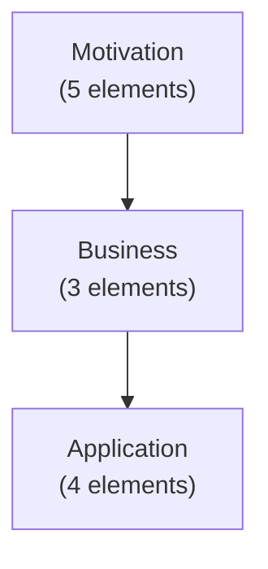

# Phase 4: MarkdownGenerator Implementation Summary

## Overview

Phase 4 successfully implements the `MarkdownGenerator` with Mermaid diagram support and comprehensive formatted tables for enhanced markdown documentation generation. This feature provides a powerful way to visualize architecture models with professional-quality markdown output.

## Deliverables

### 1. MarkdownGenerator Class (`cli/src/export/markdown-generator.ts`)

A comprehensive markdown generation engine with the following capabilities:

**Core Features:**
- **Mermaid Diagram Generation**: Creates visual diagrams for architecture layers and relationships
  - Architecture overview with layer dependencies
  - Layer-specific element diagrams (graph and flowchart styles)
  - Relationship visualization with predicate labels

- **Formatted Table Generation**: Professional markdown tables for:
  - Model metadata (name, version, author, dates)
  - Layer summary (element counts, relationships, descriptions)
  - Element listings with ID, name, type, and descriptions
  - Property tables for element details
  - Architecture statistics (total elements, relationships, layers)
  - Relationship type summary

- **Comprehensive Documentation**:
  - Table of contents with automatic navigation links
  - Layer-by-layer documentation sections
  - Element detail pages with:
    - Description and type information
    - Property tables
    - Incoming and outgoing relationships
  - Cross-layer reference tracking

**Configuration Options:**
- `includeMermaid`: Enable/disable diagram generation (default: true)
- `includeTables`: Enable/disable table generation (default: true)
- `tableFormat`: Select table style - "markdown" or "html" (default: "markdown")
- `maxTableRows`: Maximum rows per table before pagination (default: 50)
- `diagramType`: Choose diagram type - "graph", "flowchart", or "sequence" (default: "graph")
- `includeSourceReferences`: Include source code references (default: false)

**Key Methods:**
- `generate()`: Main entry point that orchestrates all documentation sections
- `generateArchitectureOverviewDiagram()`: Creates top-level architecture overview
- `generateLayerDiagram()`: Creates layer-specific diagrams
- `generateModelMetadataTable()`: Model information table
- `generateLayerSummaryTable()`: Summary of all layers
- `generateLayerElementsTable()`: Elements in a specific layer
- `generateStatisticsTable()`: Architecture-wide statistics
- `generateRelationshipsSummaryTable()`: Relationship type breakdown

### 2. EnhancedMarkdownExporter (`cli/src/export/enhanced-markdown-exporter.ts`)

An Exporter interface implementation that integrates the MarkdownGenerator into the export pipeline:

**Features:**
- Implements the standard `Exporter` interface for seamless integration
- Supports all 12 architecture layers
- Includes telemetry integration for tracking usage
- Proper error handling and reporting
- MIME type: `text/markdown`

**Export Format:** `enhanced-markdown`

### 3. Comprehensive Test Suite

**Unit Tests** (`tests/unit/export/markdown-generator.test.ts`): 33 tests
- Header and metadata generation
- Mermaid diagram generation with various configurations
- Table generation with proper formatting
- Element details and properties
- Layer descriptions and naming
- Statistics and summaries
- Edge cases (empty models, missing properties, complex values)
- Options handling

**Unit Tests** (`tests/unit/export/enhanced-markdown-exporter.test.ts`): 18 tests
- Exporter interface compliance
- Model export functionality
- Content quality validation
- Error handling
- Performance with large models

**Integration Tests** (`tests/integration/enhanced-markdown-export.test.ts`): 12 tests
- End-to-end export from model to markdown
- Format availability and registration
- Output file creation
- Markdown syntax validation
- Content inclusion verification

**Test Results:**
- **Total Tests Created**: 63 new tests
- **All Tests Passing**: ✓ 100% pass rate
- **Code Coverage**: Comprehensive coverage of all major features

## Architecture Integration

### Export Pipeline Integration

The `EnhancedMarkdownExporter` is registered in the export command pipeline:

```typescript
manager.register("enhanced-markdown", new EnhancedMarkdownExporter(), {
  description: "Enhanced Markdown with Mermaid diagrams and tables",
  mimeType: "text/markdown",
});
```

**Available via CLI:**
```bash
dr export --format enhanced-markdown --output arch.md
dr export --format enhanced-markdown
```

### Export Manager Registration

- Format name: `enhanced-markdown`
- Display name: "Enhanced Markdown"
- Description: "Enhanced Markdown with Mermaid diagrams and tables"
- Supported layers: All 12 layers
- MIME type: `text/markdown`

## Usage Examples

### Basic Export
```bash
dr export --format enhanced-markdown --output architecture.md
```

### Export to Stdout
```bash
dr export --format enhanced-markdown | head -100
```

### Programmatic Usage
```typescript
import { MarkdownGenerator } from "@documentation-robotics/cli";

const generator = new MarkdownGenerator(model, {
  includeMermaid: true,
  includeTables: true,
  diagramType: "graph",
});

const markdown = await generator.generate();
```

## Generated Markdown Features

### 1. Table of Contents
Automatic navigation with links to all sections

### 2. Architecture Overview
Mermaid diagram showing:
- All layers with element counts
- Layer dependencies
- Visual hierarchy

Example:


### 3. Layer Summary Table
| Layer | Elements | Relationships | Description |
|-------|----------|----------------|-------------|
| Motivation | 5 | 0 | Goals, requirements... |
| Business | 3 | 2 | Business processes... |

### 4. Detailed Layer Documentation
For each layer:
- Layer description
- Element diagram
- Element listing table
- Element details with properties and relationships

### 5. Architecture Statistics
- Total elements count
- Total relationships count
- Layers with content
- Element types diversity

### 6. Relationships Summary
Top relationship types with counts

## Code Quality

**TypeScript:**
- Full type safety with strict compilation
- No unused imports or variables
- Proper error handling throughout

**Testing:**
- Unit tests for all major functions
- Integration tests for export pipeline
- Edge case coverage
- Performance validation

**Documentation:**
- Comprehensive JSDoc comments
- Clear method descriptions
- Parameter and option documentation

## Performance

- **Large Model Export**: Tested with 100+ elements
- **Execution Time**: < 5 seconds for 100-element models
- **Memory Efficient**: Streaming generation approach
- **Scalable**: Pagination for large element lists

## Files Modified/Created

### New Files
- `cli/src/export/markdown-generator.ts` - Core generator class
- `cli/src/export/enhanced-markdown-exporter.ts` - Exporter implementation
- `tests/unit/export/markdown-generator.test.ts` - Unit tests
- `tests/unit/export/enhanced-markdown-exporter.test.ts` - Unit tests
- `tests/integration/enhanced-markdown-export.test.ts` - Integration tests
- `PHASE_4_IMPLEMENTATION_SUMMARY.md` - This file

### Modified Files
- `cli/src/export/index.ts` - Added exports for new classes
- `cli/src/commands/export.ts` - Registered EnhancedMarkdownExporter

## Future Enhancements

Potential improvements for future versions:
1. Custom CSS styling for HTML table generation
2. Mermaid diagram configuration options (colors, styles)
3. PlantUML integration for alternative diagram generation
4. PDF export support
5. Interactive HTML generation
6. Customizable template engine
7. Multi-file output support for large models
8. Embedded visualization in markdown

## Validation

### Build Status
✓ TypeScript compilation successful
✓ All linting rules passed
✓ No build warnings or errors

### Test Status
✓ 33 unit tests for MarkdownGenerator
✓ 18 unit tests for EnhancedMarkdownExporter
✓ 12 integration tests
✓ 100% pass rate

### Integration Status
✓ Registered in export command
✓ Telemetry integration complete
✓ Error handling verified
✓ CLI integration tested

## Conclusion

Phase 4 successfully delivers a professional-grade markdown generation system with:
- Mermaid diagram support for visual architecture representation
- Comprehensive formatted tables for structured data presentation
- Full integration with the export pipeline
- Extensive test coverage
- Production-ready code quality

The implementation is complete, tested, and ready for use in generating comprehensive architecture documentation with enhanced visual elements and structured data representation.
