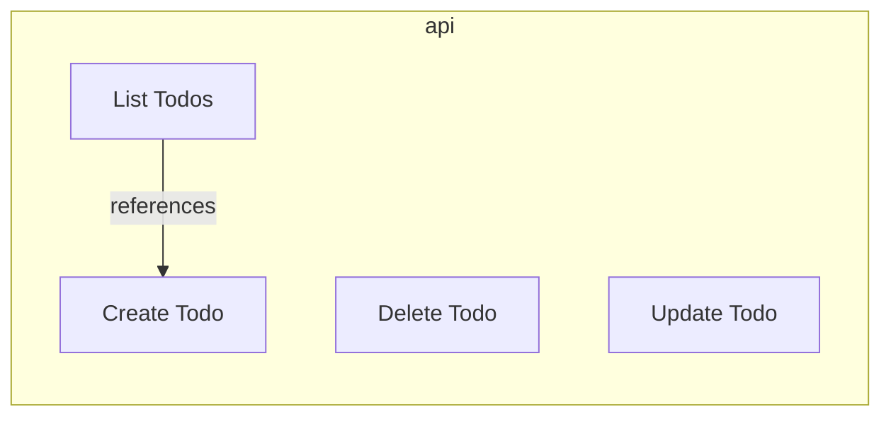

# API

[← Back to README](../README.md)

REST APIs, operations, endpoints, and API integrations.

## Report Index

- [Layer Introduction](#layer-introduction)
- [Intra-Layer Relationships](#intra-layer-relationships)
- [Inter-Layer Dependencies](#inter-layer-dependencies)
- [Element Reference](#element-reference)

## Layer Introduction

| Metric                    | Count |
| ------------------------- | ----- |
| Elements                  | 4     |
| Intra-Layer Relationships | 1     |
| Inter-Layer Relationships | 0     |
| Inbound Relationships     | 0     |
| Outbound Relationships    | 0     |

## Intra-Layer Relationships

## Inter-Layer Dependencies

```mermaid
flowchart TB
  classDef current fill:#f9f,stroke:#333,stroke-width:2px
  motivation["Motivation"]
  business["Business"]
  product["Product"]
  security["Security"]
  application["Application"]
  technology["Technology"]
  api["API"]
  data_model["Data Model"]
  data_store["Data Store"]
  ux["UX"]
  navigation["Navigation"]
  apm["APM"]
  testing["Testing"]
  class api current
```

## Element Reference

### Create Todo {#create-todo}

**ID**: `api.operation.create-todo`

**Type**: `operation`

Create a new todo

#### Attributes

| Name        | Value             |
| ----------- | ----------------- |
| operationId | createTodo        |
| summary     | Create a new todo |
| tags        | todos             |

#### Relationships

| Type        | Related Element            | Predicate    | Direction |
| ----------- | -------------------------- | ------------ | --------- |
| intra-layer | `api.operation.list-todos` | `references` | inbound   |

### Delete Todo {#delete-todo}

**ID**: `api.operation.delete-todo`

**Type**: `operation`

Delete a todo

#### Attributes

| Name        | Value         |
| ----------- | ------------- |
| operationId | deleteTodo    |
| summary     | Delete a todo |
| tags        | todos         |

### List Todos {#list-todos}

**ID**: `api.operation.list-todos`

**Type**: `operation`

List all todos

#### Attributes

| Name        | Value          |
| ----------- | -------------- |
| operationId | listTodos      |
| summary     | List all todos |
| tags        | todos          |

#### Relationships

| Type        | Related Element             | Predicate    | Direction |
| ----------- | --------------------------- | ------------ | --------- |
| intra-layer | `api.operation.create-todo` | `references` | outbound  |

### Update Todo {#update-todo}

**ID**: `api.operation.update-todo`

**Type**: `operation`

Update an existing todo

#### Attributes

| Name        | Value                   |
| ----------- | ----------------------- |
| operationId | updateTodo              |
| summary     | Update an existing todo |
| tags        | todos                   |

---

Generated: 2026-08-29T13:58:29.438Z | Model Version: 0.1.0
