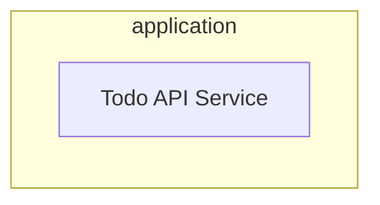

# Application

Application components, services, and interactions.

## Report Index

- [Layer Introduction](#layer-introduction)
- [Intra-Layer Relationships](#intra-layer-relationships)
- [Inter-Layer Dependencies](#inter-layer-dependencies)
- [Element Reference](#element-reference)

## Layer Introduction

| Metric                    | Count |
| ------------------------- | ----- |
| Elements                  | 1     |
| Intra-Layer Relationships | 0     |
| Inter-Layer Relationships | 0     |
| Inbound Relationships     | 0     |
| Outbound Relationships    | 0     |

## Intra-Layer Relationships

## Inter-Layer Dependencies

```mermaid
flowchart TB
  classDef current fill:#f9f,stroke:#333,stroke-width:2px
  motivation["Motivation"]
  business["Business"]
  security["Security"]
  application["Application"]
  technology["Technology"]
  api["API"]
  data_model["Data Model"]
  data_store["Data Store"]
  ux["UX"]
  navigation["Navigation"]
  apm["APM"]
  testing["Testing"]
  class application current
```

## Element Reference

### Todo API Service {#todo-api-service}

**ID**: `application.applicationservice.todo-api-service`

**Type**: `service`

Application service implementing task management

---

Generated: 2026-04-09T02:07:07.290Z | Model Version: 0.1.0
