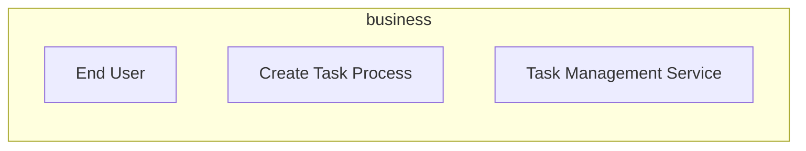

# Business

Business processes, functions, roles, and services.

## Report Index

- [Layer Introduction](#layer-introduction)
- [Intra-Layer Relationships](#intra-layer-relationships)
- [Inter-Layer Dependencies](#inter-layer-dependencies)
- [Element Reference](#element-reference)

## Layer Introduction

| Metric                    | Count |
| ------------------------- | ----- |
| Elements                  | 3     |
| Intra-Layer Relationships | 0     |
| Inter-Layer Relationships | 0     |
| Inbound Relationships     | 0     |
| Outbound Relationships    | 0     |

## Intra-Layer Relationships

## Inter-Layer Dependencies

## Element Reference

### End User {#end-user}

**ID**: `business.actor.end-user`

**Type**: `actor`

End user of the task management system

### Create Task Process {#create-task-process}

**ID**: `business.businessprocess.create-task-process`

**Type**: `process`

Business process for creating tasks

### Task Management Service {#task-management-service}

**ID**: `business.businessservice.task-management`

**Type**: `service`

Business capability for task management

---

Generated: 2026-04-09T02:07:07.273Z | Model Version: 0.1.0
