# Motivation Layer - Cross-Layer Relationships

## Cross-Layer Relationships

**Purpose**: Define semantic links to entities in other layers, supporting traceability, governance, and architectural alignment.

### Cross-Layer Relationship Diagram

```mermaid
graph TB
  subgraph thisLayer["01: Motivation Layer"]
    thisConstrainedBy["ConstrainedBy"]
    thisDeliversValue["DeliversValue"]
    thisFulfillsRequirement["FulfillsRequirement"]
    thisGovernedByPrinciple["GovernedByPrinciple"]
    thisSupportsGoal["SupportsGoal"]
  end

  %% Source layers
  subgraph source02Layer["02: Business Layer"]
    source02Node["Any Business Layer entity"]
  end
  subgraph source04Layer["04: Application Layer"]
    source04Node["Any Application Layer entity"]
  end
  subgraph source05Layer["05: Technology Layer"]
    source05Node["Any Technology Layer entity"]
  end
  subgraph source06Layer["06: API Layer"]
    source06Node["Any API Layer entity"]
  end

  %% Incoming relationships
  source05Node -->|constrained-by| thisConstrainedBy
  source06Node -->|constrained-by| thisConstrainedBy
  source02Node -->|delivers-value| thisDeliversValue
  source04Node -->|delivers-value| thisDeliversValue
  source04Node -->|fulfills-requirements| thisFulfillsRequirement
  source05Node -->|fulfills-requirements| thisFulfillsRequirement
  source06Node -->|fulfills-requirements| thisFulfillsRequirement
  source02Node -->|governed-by-principles| thisGovernedByPrinciple
  source04Node -->|governed-by-principles| thisGovernedByPrinciple
  source05Node -->|governed-by-principles| thisGovernedByPrinciple
  source06Node -->|governed-by-principles| thisGovernedByPrinciple
  source02Node -->|supports-goals| thisSupportsGoal
  source04Node -->|supports-goals| thisSupportsGoal
  source05Node -->|supports-goals| thisSupportsGoal
  source06Node -->|supports-goals| thisSupportsGoal

  %% Styling
  classDef thisLayerStyle fill:#4ECDC4,stroke:#333,stroke-width:3px
  classDef targetLayerStyle fill:#FFD700,stroke:#333,stroke-width:2px
  classDef sourceLayerStyle fill:#E17055,stroke:#333,stroke-width:2px

  class thisConstrainedBy thisLayerStyle
  class thisDeliversValue thisLayerStyle
  class thisFulfillsRequirement thisLayerStyle
  class thisGovernedByPrinciple thisLayerStyle
  class thisSupportsGoal thisLayerStyle
  class source02Node sourceLayerStyle
  class source04Node sourceLayerStyle
  class source05Node sourceLayerStyle
  class source06Node sourceLayerStyle
```

### Outgoing Relationships (This Layer → Other Layers)

Links from entities in this layer to entities in other layers.

_No outgoing cross-layer relationships defined._

### Incoming Relationships (Other Layers → This Layer)

Links from entities in other layers to entities in this layer.

#### From Business Layer (02)

| Predicate | Source Element | Target Element | Field Path | Description | Documented |
|-----------|----------------|----------------|------------|-------------|------------|
| `delivers-value` | BusinessService | DeliversValue | `motivation.delivers-value` | BusinessService delivers Value | [✓](../../spec/schemas/link-registry.json) |
| `governed-by-principles` | BusinessService | GovernedByPrinciple | `motivation.governed-by-principles`, `x-governed-by-principles` | BusinessService governed by Principles | [✓](../../spec/schemas/link-registry.json) |
| `supports-goals` | BusinessService | SupportsGoal | `motivation.supports-goals`, `x-supports-goals` | BusinessService supports Goals | [✓](../../spec/schemas/link-registry.json) |

#### From Application Layer (04)

| Predicate | Source Element | Target Element | Field Path | Description | Documented |
|-----------|----------------|----------------|------------|-------------|------------|
| `delivers-value` | ApplicationService | DeliversValue | `motivation.delivers-value` | BusinessService delivers Value | [✓](../../spec/schemas/link-registry.json) |
| `fulfills-requirements` | ApplicationFunction | FulfillsRequirement | `motivation.fulfills-requirements`, `x-fulfills-requirements` | comma-separated Requirement IDs this function fulfills | [✓](../../spec/schemas/link-registry.json) |
| `governed-by-principles` | ApplicationFunction, ApplicationService | GovernedByPrinciple | `motivation.governed-by-principles`, `x-governed-by-principles` | BusinessService governed by Principles | [✓](../../spec/schemas/link-registry.json) |
| `supports-goals` | ApplicationService | SupportsGoal | `motivation.supports-goals`, `x-supports-goals` | BusinessService supports Goals | [✓](../../spec/schemas/link-registry.json) |

#### From Technology Layer (05)

| Predicate | Source Element | Target Element | Field Path | Description | Documented |
|-----------|----------------|----------------|------------|-------------|------------|
| `constrained-by` | Artifact, CommunicationNetwork, Node, SystemSoftware, TechnologyService | ConstrainedBy | `motivation.constrained-by`, `x-constrained-by` | string[] (Constraint IDs for regulatory/compliance, optional) | [✓](../../spec/schemas/link-registry.json) |
| `fulfills-requirements` | CommunicationNetwork, Node, SystemSoftware | FulfillsRequirement | `motivation.fulfills-requirements`, `x-fulfills-requirements` | comma-separated Requirement IDs this function fulfills | [✓](../../spec/schemas/link-registry.json) |
| `governed-by-principles` | CommunicationNetwork, Node, SystemSoftware, TechnologyService | GovernedByPrinciple | `motivation.governed-by-principles`, `x-governed-by-principles` | BusinessService governed by Principles | [✓](../../spec/schemas/link-registry.json) |
| `supports-goals` | TechnologyService | SupportsGoal | `motivation.supports-goals`, `x-supports-goals` | BusinessService supports Goals | [✓](../../spec/schemas/link-registry.json) |

#### From API Layer (06)

| Predicate | Source Element | Target Element | Field Path | Description | Documented |
|-----------|----------------|----------------|------------|-------------|------------|
| `constrained-by` | Operation, SecurityScheme | ConstrainedBy | `motivation.constrained-by`, `x-constrained-by` | string[] (Constraint IDs for regulatory/compliance, optional) | [✓](../../spec/schemas/link-registry.json) |
| `fulfills-requirements` | Operation, SecurityScheme | FulfillsRequirement | `motivation.fulfills-requirements`, `x-fulfills-requirements` | comma-separated Requirement IDs this function fulfills | [✓](../../spec/schemas/link-registry.json) |
| `governed-by-principles` | OpenAPIDocument, Operation, SecurityScheme | GovernedByPrinciple | `motivation.governed-by-principles`, `x-governed-by-principles` | BusinessService governed by Principles | [✓](../../spec/schemas/link-registry.json) |
| `supports-goals` | Operation, SecurityScheme | SupportsGoal | `motivation.supports-goals`, `x-supports-goals` | BusinessService supports Goals | [✓](../../spec/schemas/link-registry.json) |
