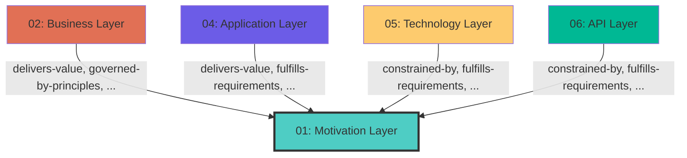

## Cross-Layer Relationships

**Purpose**: Define semantic links to entities in other layers, supporting traceability, governance, and architectural alignment.

### Outgoing Relationships (This Layer → Other Layers)

Links from entities in this layer to entities in other layers.

_No outgoing cross-layer relationships defined._

### Incoming Relationships (Other Layers → This Layer)

Links from entities in other layers to entities in this layer.

#### From Business Layer (02)

| Predicate | Source Element | Target Element | Field Path | Description |
|-----------|----------------|----------------|------------|-------------|
| `delivers-value` | Any | DeliversValue | `motivation.delivers-value` | comma-separated Value IDs |
| `governed-by-principles` | Any | GovernedByPrinciple | `motivation.governed-by-principles`, `x-governed-by-principles` | string[] (Principle IDs that guide this API, optional) |
| `supports-goals` | Any | SupportsGoal | `motivation.supports-goals`, `x-supports-goals` | comma-separated Goal IDs this service supports |

#### From Application Layer (04)

| Predicate | Source Element | Target Element | Field Path | Description |
|-----------|----------------|----------------|------------|-------------|
| `delivers-value` | Any | DeliversValue | `motivation.delivers-value` | comma-separated Value IDs |
| `fulfills-requirements` | Any | FulfillsRequirement | `motivation.fulfills-requirements`, `x-fulfills-requirements` | comma-separated Requirement IDs this function fulfills |
| `governed-by-principles` | Any | GovernedByPrinciple | `motivation.governed-by-principles`, `x-governed-by-principles` | string[] (Principle IDs that guide this API, optional) |
| `supports-goals` | Any | SupportsGoal | `motivation.supports-goals`, `x-supports-goals` | comma-separated Goal IDs this service supports |

#### From Technology Layer (05)

| Predicate | Source Element | Target Element | Field Path | Description |
|-----------|----------------|----------------|------------|-------------|
| `constrained-by` | Any | ConstrainedBy | `motivation.constrained-by`, `x-constrained-by` | string[] (Constraint IDs for regulatory/compliance, optional) |
| `fulfills-requirements` | Any | FulfillsRequirement | `motivation.fulfills-requirements`, `x-fulfills-requirements` | comma-separated Requirement IDs this function fulfills |
| `governed-by-principles` | Any | GovernedByPrinciple | `motivation.governed-by-principles`, `x-governed-by-principles` | string[] (Principle IDs that guide this API, optional) |
| `supports-goals` | Any | SupportsGoal | `motivation.supports-goals`, `x-supports-goals` | comma-separated Goal IDs this service supports |

#### From API Layer (06)

| Predicate | Source Element | Target Element | Field Path | Description |
|-----------|----------------|----------------|------------|-------------|
| `constrained-by` | Any | ConstrainedBy | `motivation.constrained-by`, `x-constrained-by` | string[] (Constraint IDs for regulatory/compliance, optional) |
| `fulfills-requirements` | Any | FulfillsRequirement | `motivation.fulfills-requirements`, `x-fulfills-requirements` | comma-separated Requirement IDs this function fulfills |
| `governed-by-principles` | Any | GovernedByPrinciple | `motivation.governed-by-principles`, `x-governed-by-principles` | string[] (Principle IDs that guide this API, optional) |
| `supports-goals` | Any | SupportsGoal | `motivation.supports-goals`, `x-supports-goals` | comma-separated Goal IDs this service supports |

### Cross-Layer Relationship Diagram

