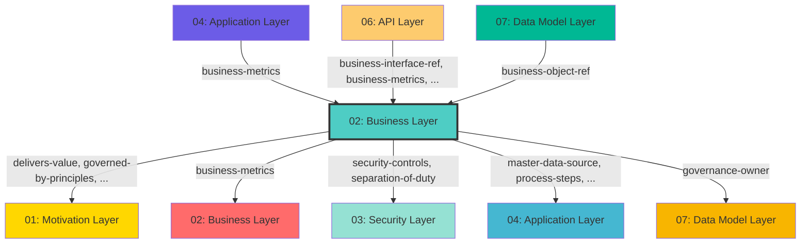

## Cross-Layer Relationships

**Purpose**: Define semantic links to entities in other layers, supporting traceability, governance, and architectural alignment.

### Outgoing Relationships (This Layer → Other Layers)

Links from entities in this layer to entities in other layers.

#### To Motivation Layer (01)

Links to strategic goals, requirements, principles, and constraints.

| Predicate | Source Element | Target Element | Field Path | Strength | Required | Description |
|-----------|----------------|----------------|------------|----------|----------|-------------|
| `delivers-value` | Any | DeliversValue | `motivation.delivers-value` | medium | No | comma-separated Value IDs |
| `governed-by-principles` | Any | GovernedByPrinciple | `motivation.governed-by-principles`, `x-governed-by-principles` | high | No | string[] (Principle IDs that guide this API, optional) |
| `supports-goals` | Any | SupportsGoal | `motivation.supports-goals`, `x-supports-goals` | high | No | comma-separated Goal IDs this service supports |

**Example**:
```yaml
properties:
  motivation.delivers-value:
    type: string
    description: comma-separated Value IDs
    example: "target-id-1"
```

#### To Business Layer (02)

Links to business services, processes, and actors.

| Predicate | Source Element | Target Element | Field Path | Strength | Required | Description |
|-----------|----------------|----------------|------------|----------|----------|-------------|
| `business-metrics` | Any | BusinessMetric | `apm.business-metrics`, `x-apm-business-metrics` | medium | No | comma-separated business metric IDs this service tracks |

**Example**:
```yaml
properties:
  apm.business-metrics:
    type: string
    description: comma-separated business metric IDs this service tracks
    example: "target-id-1"
```

#### To Security Layer (03)

Links to security models, resources, and controls.

| Predicate | Source Element | Target Element | Field Path | Strength | Required | Description |
|-----------|----------------|----------------|------------|----------|----------|-------------|
| `security-controls` | Any | SecurityControl | `process.security-controls` | high | No | security control references |
| `separation-of-duty` | Any | SeparationOfDuty | `process.separation-of-duty` | medium | No | Links to SeparationOfDuty in target layer |

**Example**:
```yaml
properties:
  process.security-controls:
    type: string
    description: security control references
    example: "target-id-1"
```

#### To Application Layer (04)

Links to application layer elements.

| Predicate | Source Element | Target Element | Field Path | Strength | Required | Description |
|-----------|----------------|----------------|------------|----------|----------|-------------|
| `master-data-source` | Any | MasterDataSource | `application.master-data-source` | medium | No | authoritative DataObject for this business object |
| `process-steps` | Any | ProcessStep | `application.process-steps` | medium | No | which specific ApplicationProcess steps realize this business process |
| `realized-by-process` | Any | RealizedByProces | `application.realized-by-process` | medium | No | ApplicationProcess ID that automates this business process |
| `represented-by-dataobject` | Any | RepresentedByDataobject | `application.represented-by-dataobject` | medium | No | DataObject ID that represents this business concept in applications |

**Example**:
```yaml
properties:
  application.master-data-source:
    type: string
    description: authoritative DataObject for this business object
    example: "target-id-1"
```

#### To Data Model Layer (07)

Links to data schemas, tables, and columns.

| Predicate | Source Element | Target Element | Field Path | Strength | Required | Description |
|-----------|----------------|----------------|------------|----------|----------|-------------|
| `governance-owner` | Any | GovernanceOwner | `data.governance-owner` | medium | No | data owner reference |

**Example**:
```yaml
properties:
  data.governance-owner:
    type: string
    description: data owner reference
    example: "target-id-1"
```

### Incoming Relationships (Other Layers → This Layer)

Links from entities in other layers to entities in this layer.

#### From Business Layer (02)

| Predicate | Source Element | Target Element | Field Path | Description |
|-----------|----------------|----------------|------------|-------------|
| `business-metrics` | Any | BusinessMetric | `apm.business-metrics`, `x-apm-business-metrics` | comma-separated business metric IDs this service tracks |

#### From Application Layer (04)

| Predicate | Source Element | Target Element | Field Path | Description |
|-----------|----------------|----------------|------------|-------------|
| `business-metrics` | Any | BusinessMetric | `apm.business-metrics`, `x-apm-business-metrics` | comma-separated business metric IDs this service tracks |

#### From API Layer (06)

| Predicate | Source Element | Target Element | Field Path | Description |
|-----------|----------------|----------------|------------|-------------|
| `business-metrics` | Any | BusinessMetric | `apm.business-metrics`, `x-apm-business-metrics` | comma-separated business metric IDs this service tracks |
| `business-interface-ref` | Any | BusinessInterface | `x-business-interface-ref` | string (BusinessInterface.id, optional) |
| `business-service-ref` | Any | BusinessService | `x-business-service-ref` | string (BusinessService.id, optional) |

#### From Data Model Layer (07)

| Predicate | Source Element | Target Element | Field Path | Description |
|-----------|----------------|----------------|------------|-------------|
| `business-object-ref` | Any | BusinessObject | `x-business-object-ref` | string (BusinessObject.id reference, optional) |

### Cross-Layer Relationship Diagram


