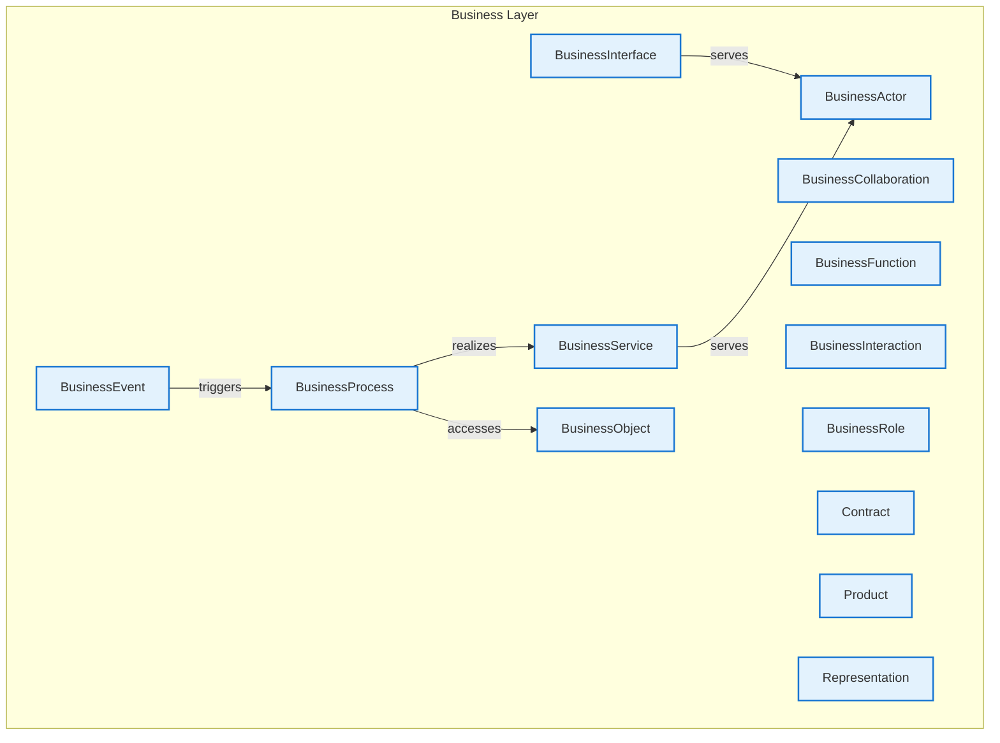

# Business Layer - Intra-Layer Relationships

## Overview

**Purpose**: Define semantic links between entities WITHIN this layer, capturing
structural composition, behavioral dependencies, and influence relationships.

**Layer ID**: `02-business-layer`
**Analysis Date**: Generated automatically
**Validation**: Uses MarkdownLayerParser for closed-loop validation

---

### Relationship Diagram

## Entity: BusinessActor

**Definition**: An organizational entity capable of performing behavior

### Outgoing Relationships (BusinessActor → Other Entities)

_No outgoing intra-layer relationships documented._

### Incoming Relationships (Other Entities → BusinessActor)

| Relationship Type | Source Entity | Predicate | Status | Source | In Catalog | Documented |
|-------------------|---------------|-----------|--------|--------|------------|------------|
| serving | BusinessInterface | `serves` | XML | xml_example | ✓ | ✗ |
| serving | BusinessService | `serves` | XML | xml_example | ✓ | ✗ |

### Relationship Summary

- **Total Relationships**: 2
- **Outgoing**: 0
- **Incoming**: 2
- **Documented**: 0/2
- **With XML Examples**: 2/2
- **In Catalog**: 2/2

---

## Entity: BusinessCollaboration

**Definition**: Aggregate of business roles working together

### Outgoing Relationships (BusinessCollaboration → Other Entities)

_No outgoing intra-layer relationships documented._

### Incoming Relationships (Other Entities → BusinessCollaboration)

_No incoming intra-layer relationships documented._

### Relationship Summary

- **Total Relationships**: 0
- **Outgoing**: 0
- **Incoming**: 0
- **Documented**: 0/0
- **With XML Examples**: 0/0
- **In Catalog**: 0/0

---

## Entity: BusinessEvent

**Definition**: Something that happens and influences behavior

### Outgoing Relationships (BusinessEvent → Other Entities)

| Relationship Type | Target Entity | Predicate | Status | Source | In Catalog | Documented |
|-------------------|---------------|-----------|--------|--------|------------|------------|
| triggering | BusinessProcess | `triggers` | XML | xml_example | ✓ | ✗ |

### Incoming Relationships (Other Entities → BusinessEvent)

_No incoming intra-layer relationships documented._

### Relationship Summary

- **Total Relationships**: 1
- **Outgoing**: 1
- **Incoming**: 0
- **Documented**: 0/1
- **With XML Examples**: 1/1
- **In Catalog**: 1/1

---

## Entity: BusinessFunction

**Definition**: Collection of business behavior based on criteria

### Outgoing Relationships (BusinessFunction → Other Entities)

_No outgoing intra-layer relationships documented._

### Incoming Relationships (Other Entities → BusinessFunction)

_No incoming intra-layer relationships documented._

### Relationship Summary

- **Total Relationships**: 0
- **Outgoing**: 0
- **Incoming**: 0
- **Documented**: 0/0
- **With XML Examples**: 0/0
- **In Catalog**: 0/0

---

## Entity: BusinessInteraction

**Definition**: Unit of collective behavior by collaboration

### Outgoing Relationships (BusinessInteraction → Other Entities)

_No outgoing intra-layer relationships documented._

### Incoming Relationships (Other Entities → BusinessInteraction)

_No incoming intra-layer relationships documented._

### Relationship Summary

- **Total Relationships**: 0
- **Outgoing**: 0
- **Incoming**: 0
- **Documented**: 0/0
- **With XML Examples**: 0/0
- **In Catalog**: 0/0

---

## Entity: BusinessInterface

**Definition**: Point of access where business service is available

### Outgoing Relationships (BusinessInterface → Other Entities)

| Relationship Type | Target Entity | Predicate | Status | Source | In Catalog | Documented |
|-------------------|---------------|-----------|--------|--------|------------|------------|
| serving | BusinessActor | `serves` | XML | xml_example | ✓ | ✗ |

### Incoming Relationships (Other Entities → BusinessInterface)

_No incoming intra-layer relationships documented._

### Relationship Summary

- **Total Relationships**: 1
- **Outgoing**: 1
- **Incoming**: 0
- **Documented**: 0/1
- **With XML Examples**: 1/1
- **In Catalog**: 1/1

---

## Entity: BusinessObject

**Definition**: Concept used within business domain

### Outgoing Relationships (BusinessObject → Other Entities)

_No outgoing intra-layer relationships documented._

### Incoming Relationships (Other Entities → BusinessObject)

| Relationship Type | Source Entity | Predicate | Status | Source | In Catalog | Documented |
|-------------------|---------------|-----------|--------|--------|------------|------------|
| access | BusinessProcess | `accesses` | XML | xml_example | ✓ | ✗ |

### Relationship Summary

- **Total Relationships**: 1
- **Outgoing**: 0
- **Incoming**: 1
- **Documented**: 0/1
- **With XML Examples**: 1/1
- **In Catalog**: 1/1

---

## Entity: BusinessProcess

**Definition**: Sequence of business behaviors achieving a result

### Outgoing Relationships (BusinessProcess → Other Entities)

| Relationship Type | Target Entity | Predicate | Status | Source | In Catalog | Documented |
|-------------------|---------------|-----------|--------|--------|------------|------------|
| access | BusinessObject | `accesses` | XML | xml_example | ✓ | ✗ |
| realization | BusinessService | `realizes` | XML | xml_example | ✓ | ✗ |

### Incoming Relationships (Other Entities → BusinessProcess)

| Relationship Type | Source Entity | Predicate | Status | Source | In Catalog | Documented |
|-------------------|---------------|-----------|--------|--------|------------|------------|
| triggering | BusinessEvent | `triggers` | XML | xml_example | ✓ | ✗ |

### Relationship Summary

- **Total Relationships**: 3
- **Outgoing**: 2
- **Incoming**: 1
- **Documented**: 0/3
- **With XML Examples**: 3/3
- **In Catalog**: 3/3

---

## Entity: BusinessRole

**Definition**: The responsibility for performing specific behavior

### Outgoing Relationships (BusinessRole → Other Entities)

_No outgoing intra-layer relationships documented._

### Incoming Relationships (Other Entities → BusinessRole)

_No incoming intra-layer relationships documented._

### Relationship Summary

- **Total Relationships**: 0
- **Outgoing**: 0
- **Incoming**: 0
- **Documented**: 0/0
- **With XML Examples**: 0/0
- **In Catalog**: 0/0

---

## Entity: BusinessService

**Definition**: Service that fulfills a business need

### Outgoing Relationships (BusinessService → Other Entities)

| Relationship Type | Target Entity | Predicate | Status | Source | In Catalog | Documented |
|-------------------|---------------|-----------|--------|--------|------------|------------|
| serving | BusinessActor | `serves` | XML | xml_example | ✓ | ✗ |

### Incoming Relationships (Other Entities → BusinessService)

| Relationship Type | Source Entity | Predicate | Status | Source | In Catalog | Documented |
|-------------------|---------------|-----------|--------|--------|------------|------------|
| realization | BusinessProcess | `realizes` | XML | xml_example | ✓ | ✗ |

### Relationship Summary

- **Total Relationships**: 2
- **Outgoing**: 1
- **Incoming**: 1
- **Documented**: 0/2
- **With XML Examples**: 2/2
- **In Catalog**: 2/2

---

## Entity: Contract

**Definition**: Formal specification of agreement

### Outgoing Relationships (Contract → Other Entities)

_No outgoing intra-layer relationships documented._

### Incoming Relationships (Other Entities → Contract)

_No incoming intra-layer relationships documented._

### Relationship Summary

- **Total Relationships**: 0
- **Outgoing**: 0
- **Incoming**: 0
- **Documented**: 0/0
- **With XML Examples**: 0/0
- **In Catalog**: 0/0

---

## Entity: Product

**Definition**: Coherent collection of services with a value

### Outgoing Relationships (Product → Other Entities)

_No outgoing intra-layer relationships documented._

### Incoming Relationships (Other Entities → Product)

_No incoming intra-layer relationships documented._

### Relationship Summary

- **Total Relationships**: 0
- **Outgoing**: 0
- **Incoming**: 0
- **Documented**: 0/0
- **With XML Examples**: 0/0
- **In Catalog**: 0/0

---

## Entity: Representation

**Definition**: Perceptible form of business object

### Outgoing Relationships (Representation → Other Entities)

_No outgoing intra-layer relationships documented._

### Incoming Relationships (Other Entities → Representation)

_No incoming intra-layer relationships documented._

### Relationship Summary

- **Total Relationships**: 0
- **Outgoing**: 0
- **Incoming**: 0
- **Documented**: 0/0
- **With XML Examples**: 0/0
- **In Catalog**: 0/0

---

## Layer Summary

### Entity Coverage (Target: 2+ relationships per entity)

- **Entities Meeting Target**: 3/13
- **Entity Coverage**: 23.1%

**Entities Below Target**:

- BusinessRole: 0 relationship(s) (needs 2 more)
- BusinessCollaboration: 0 relationship(s) (needs 2 more)
- BusinessFunction: 0 relationship(s) (needs 2 more)
- BusinessInteraction: 0 relationship(s) (needs 2 more)
- Contract: 0 relationship(s) (needs 2 more)
- Representation: 0 relationship(s) (needs 2 more)
- Product: 0 relationship(s) (needs 2 more)
- BusinessInterface: 1 relationship(s) (needs 1 more)
- BusinessEvent: 1 relationship(s) (needs 1 more)
- BusinessObject: 1 relationship(s) (needs 1 more)

### Coverage Matrix

| Entity | Outgoing | Incoming | Total | Meets Target | Status |
|--------|----------|----------|-------|--------------|--------|
| BusinessActor | 0 | 2 | 2 | ✓ | Complete |
| BusinessCollaboration | 0 | 0 | 0 | ✗ | Needs 2 |
| BusinessEvent | 1 | 0 | 1 | ✗ | Needs 1 |
| BusinessFunction | 0 | 0 | 0 | ✗ | Needs 2 |
| BusinessInteraction | 0 | 0 | 0 | ✗ | Needs 2 |
| BusinessInterface | 1 | 0 | 1 | ✗ | Needs 1 |
| BusinessObject | 0 | 1 | 1 | ✗ | Needs 1 |
| BusinessProcess | 2 | 1 | 3 | ✓ | Complete |
| BusinessRole | 0 | 0 | 0 | ✗ | Needs 2 |
| BusinessService | 1 | 1 | 2 | ✓ | Complete |
| Contract | 0 | 0 | 0 | ✗ | Needs 2 |
| Product | 0 | 0 | 0 | ✗ | Needs 2 |
| Representation | 0 | 0 | 0 | ✗ | Needs 2 |
| **TOTAL** | **-** | **-** | **10** | **3/13** | **23.1%** |

### Relationship Statistics

- **Total Intra-Layer Relationships**: 5
- **Average Relationships per Entity**: 0.8
- **Entity Coverage Target**: 2+ relationships
