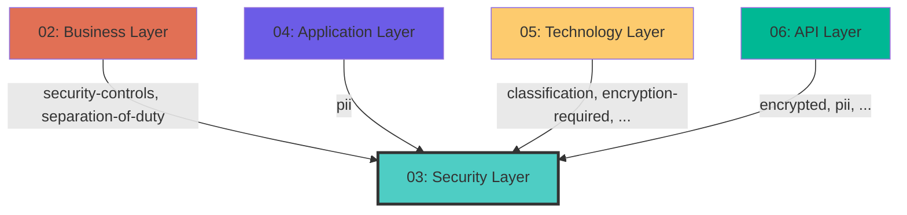

## Cross-Layer Relationships

**Purpose**: Define semantic links to entities in other layers, supporting traceability, governance, and architectural alignment.

### Outgoing Relationships (This Layer → Other Layers)

Links from entities in this layer to entities in other layers.

_No outgoing cross-layer relationships defined._

### Incoming Relationships (Other Layers → This Layer)

Links from entities in other layers to entities in this layer.

#### From Business Layer (02)

| Predicate | Source Element | Target Element | Field Path | Description |
|-----------|----------------|----------------|------------|-------------|
| `security-controls` | Any | SecurityControl | `process.security-controls` | security control references |
| `separation-of-duty` | Any | SeparationOfDuty | `process.separation-of-duty` | Links to SeparationOfDuty in target layer |

#### From Application Layer (04)

| Predicate | Source Element | Target Element | Field Path | Description |
|-----------|----------------|----------------|------------|-------------|
| `pii` | Any | Pii | `data.pii` | Links to Pii in target layer |

#### From Technology Layer (05)

| Predicate | Source Element | Target Element | Field Path | Description |
|-----------|----------------|----------------|------------|-------------|
| `classification` | Any | Classification | `security.classification` | Links to Classification in target layer |
| `encryption-required` | Any | EncryptionRequired | `security.encryption-required` | Links to EncryptionRequired in target layer |
| `encryption-type` | Any | EncryptionType | `security.encryption-type` | Links to EncryptionType in target layer |
| `pii` | Any | Pii | `security.pii`, `x-pii` | contains personally identifiable information |

#### From API Layer (06)

| Predicate | Source Element | Target Element | Field Path | Description |
|-----------|----------------|----------------|------------|-------------|
| `encrypted` | Any | Encrypted | `x-encrypted` | boolean |
| `pii` | Any | Pii | `security.pii`, `x-pii` | contains personally identifiable information |
| `required-permissions` | Any | Permission | `x-required-permissions` | string[] (Permission.name[], optional) |
| `security-resource` | Any | SecureResource | `x-security-resource` | string (SecureResource.resource, optional) |

### Cross-Layer Relationship Diagram

