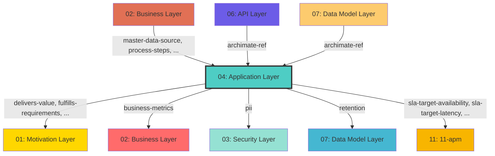

## Cross-Layer Relationships

**Purpose**: Define semantic links to entities in other layers, supporting traceability, governance, and architectural alignment.

### Outgoing Relationships (This Layer → Other Layers)

Links from entities in this layer to entities in other layers.

#### To Motivation Layer (01)

Links to strategic goals, requirements, principles, and constraints.

| Predicate | Source Element | Target Element | Field Path | Strength | Required | Description |
|-----------|----------------|----------------|------------|----------|----------|-------------|
| `delivers-value` | Any | DeliversValue | `motivation.delivers-value` | medium | No | comma-separated Value IDs |
| `fulfills-requirements` | Any | FulfillsRequirement | `motivation.fulfills-requirements`, `x-fulfills-requirements` | high | No | comma-separated Requirement IDs this function fulfills |
| `governed-by-principles` | Any | GovernedByPrinciple | `motivation.governed-by-principles`, `x-governed-by-principles` | high | No | string[] (Principle IDs that guide this API, optional) |
| `supports-goals` | Any | SupportsGoal | `motivation.supports-goals`, `x-supports-goals` | high | No | comma-separated Goal IDs this service supports |

**Example**:
```yaml
properties:
  motivation.delivers-value:
    type: string
    description: comma-separated Value IDs
    example: "target-id-1"
```

#### To Business Layer (02)

Links to business services, processes, and actors.

| Predicate | Source Element | Target Element | Field Path | Strength | Required | Description |
|-----------|----------------|----------------|------------|----------|----------|-------------|
| `business-metrics` | Any | BusinessMetric | `apm.business-metrics`, `x-apm-business-metrics` | medium | No | comma-separated business metric IDs this service tracks |

**Example**:
```yaml
properties:
  apm.business-metrics:
    type: string
    description: comma-separated business metric IDs this service tracks
    example: "target-id-1"
```

#### To Security Layer (03)

Links to security models, resources, and controls.

| Predicate | Source Element | Target Element | Field Path | Strength | Required | Description |
|-----------|----------------|----------------|------------|----------|----------|-------------|
| `pii` | Any | Pii | `data.pii` | medium | No | Links to Pii in target layer |

**Example**:
```yaml
properties:
  data.pii:
    type: string
    description: Links to Pii in target layer
    example: "target-id-1"
```

#### To Data Model Layer (07)

Links to data schemas, tables, and columns.

| Predicate | Source Element | Target Element | Field Path | Strength | Required | Description |
|-----------|----------------|----------------|------------|----------|----------|-------------|
| `retention` | Any | Retention | `data.retention` | medium | No | Links to Retention in target layer |

**Example**:
```yaml
properties:
  data.retention:
    type: string
    description: Links to Retention in target layer
    example: "target-id-1"
```

#### To 11-apm (11)

Links to 11-apm elements.

| Predicate | Source Element | Target Element | Field Path | Strength | Required | Description |
|-----------|----------------|----------------|------------|----------|----------|-------------|
| `sla-target-availability` | Any | SlaTargetAvailability | `apm.sla-target-availability`, `x-apm-sla-target-availability` | medium | No | string (e.g., "99.95%", "99.99%", optional) |
| `sla-target-latency` | Any | SlaTargetLatency | `apm.sla-target-latency`, `x-apm-sla-target-latency` | medium | No | string (e.g., "200ms", "500ms", optional) |
| `traced` | Any | Traced | `apm.traced` | medium | No | Links to Traced in target layer |

**Example**:
```yaml
properties:
  apm.sla-target-availability:
    type: string
    description: string (e.g., "99.95%", "99.99%", optional)
    example: "target-id-1"
```

### Incoming Relationships (Other Layers → This Layer)

Links from entities in other layers to entities in this layer.

#### From Business Layer (02)

| Predicate | Source Element | Target Element | Field Path | Description |
|-----------|----------------|----------------|------------|-------------|
| `master-data-source` | Any | MasterDataSource | `application.master-data-source` | authoritative DataObject for this business object |
| `process-steps` | Any | ProcessStep | `application.process-steps` | which specific ApplicationProcess steps realize this business process |
| `realized-by-process` | Any | RealizedByProces | `application.realized-by-process` | ApplicationProcess ID that automates this business process |
| `represented-by-dataobject` | Any | RepresentedByDataobject | `application.represented-by-dataobject` | DataObject ID that represents this business concept in applications |

#### From API Layer (06)

| Predicate | Source Element | Target Element | Field Path | Description |
|-----------|----------------|----------------|------------|-------------|
| `archimate-ref` | Any | Element | `x-archimate-ref` | string (Element.id reference to ApplicationService) |

#### From Data Model Layer (07)

| Predicate | Source Element | Target Element | Field Path | Description |
|-----------|----------------|----------------|------------|-------------|
| `archimate-ref` | Any | Element | `x-archimate-ref` | string (Element.id reference to ApplicationService) |

### Cross-Layer Relationship Diagram


