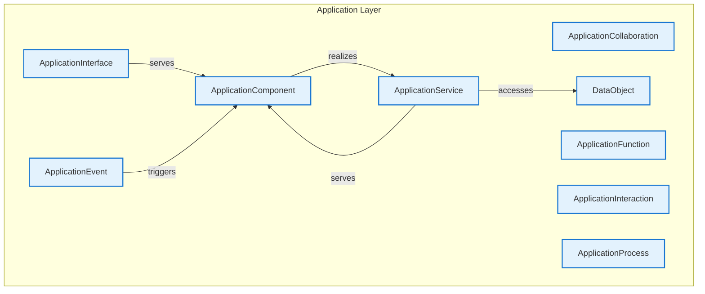

# Application Layer - Intra-Layer Relationships

## Overview

**Purpose**: Define semantic links between entities WITHIN this layer, capturing
structural composition, behavioral dependencies, and influence relationships.

**Layer ID**: `04-application-layer`
**Analysis Date**: Generated automatically
**Validation**: Uses MarkdownLayerParser for closed-loop validation

---

### Relationship Diagram

## Entity: ApplicationCollaboration

**Definition**: Aggregate of application components working together

### Outgoing Relationships (ApplicationCollaboration → Other Entities)

_No outgoing intra-layer relationships documented._

### Incoming Relationships (Other Entities → ApplicationCollaboration)

_No incoming intra-layer relationships documented._

### Relationship Summary

- **Total Relationships**: 0
- **Outgoing**: 0
- **Incoming**: 0
- **Documented**: 0/0
- **With XML Examples**: 0/0
- **In Catalog**: 0/0

---

## Entity: ApplicationComponent

**Definition**: Modular, deployable, and replaceable part of a system

### Outgoing Relationships (ApplicationComponent → Other Entities)

| Relationship Type | Target Entity | Predicate | Status | Source | In Catalog | Documented |
|-------------------|---------------|-----------|--------|--------|------------|------------|
| realization | ApplicationService | `realizes` | XML | xml_example | ✓ | ✗ |

### Incoming Relationships (Other Entities → ApplicationComponent)

| Relationship Type | Source Entity | Predicate | Status | Source | In Catalog | Documented |
|-------------------|---------------|-----------|--------|--------|------------|------------|
| triggering | ApplicationEvent | `triggers` | XML | xml_example | ✓ | ✗ |
| serving | ApplicationInterface | `serves` | XML | xml_example | ✓ | ✗ |
| serving | ApplicationService | `serves` | XML | xml_example | ✓ | ✗ |

### Relationship Summary

- **Total Relationships**: 4
- **Outgoing**: 1
- **Incoming**: 3
- **Documented**: 0/4
- **With XML Examples**: 4/4
- **In Catalog**: 4/4

---

## Entity: ApplicationEvent

**Definition**: Application state change notification

### Outgoing Relationships (ApplicationEvent → Other Entities)

| Relationship Type | Target Entity | Predicate | Status | Source | In Catalog | Documented |
|-------------------|---------------|-----------|--------|--------|------------|------------|
| triggering | ApplicationComponent | `triggers` | XML | xml_example | ✓ | ✗ |

### Incoming Relationships (Other Entities → ApplicationEvent)

_No incoming intra-layer relationships documented._

### Relationship Summary

- **Total Relationships**: 1
- **Outgoing**: 1
- **Incoming**: 0
- **Documented**: 0/1
- **With XML Examples**: 1/1
- **In Catalog**: 1/1

---

## Entity: ApplicationFunction

**Definition**: Automated behavior performed by application component

### Outgoing Relationships (ApplicationFunction → Other Entities)

_No outgoing intra-layer relationships documented._

### Incoming Relationships (Other Entities → ApplicationFunction)

_No incoming intra-layer relationships documented._

### Relationship Summary

- **Total Relationships**: 0
- **Outgoing**: 0
- **Incoming**: 0
- **Documented**: 0/0
- **With XML Examples**: 0/0
- **In Catalog**: 0/0

---

## Entity: ApplicationInteraction

**Definition**: Unit of collective application behavior

### Outgoing Relationships (ApplicationInteraction → Other Entities)

_No outgoing intra-layer relationships documented._

### Incoming Relationships (Other Entities → ApplicationInteraction)

_No incoming intra-layer relationships documented._

### Relationship Summary

- **Total Relationships**: 0
- **Outgoing**: 0
- **Incoming**: 0
- **Documented**: 0/0
- **With XML Examples**: 0/0
- **In Catalog**: 0/0

---

## Entity: ApplicationInterface

**Definition**: Point of access where application service is available

### Outgoing Relationships (ApplicationInterface → Other Entities)

| Relationship Type | Target Entity | Predicate | Status | Source | In Catalog | Documented |
|-------------------|---------------|-----------|--------|--------|------------|------------|
| serving | ApplicationComponent | `serves` | XML | xml_example | ✓ | ✗ |

### Incoming Relationships (Other Entities → ApplicationInterface)

_No incoming intra-layer relationships documented._

### Relationship Summary

- **Total Relationships**: 1
- **Outgoing**: 1
- **Incoming**: 0
- **Documented**: 0/1
- **With XML Examples**: 1/1
- **In Catalog**: 1/1

---

## Entity: ApplicationProcess

**Definition**: Sequence of application behaviors

### Outgoing Relationships (ApplicationProcess → Other Entities)

_No outgoing intra-layer relationships documented._

### Incoming Relationships (Other Entities → ApplicationProcess)

_No incoming intra-layer relationships documented._

### Relationship Summary

- **Total Relationships**: 0
- **Outgoing**: 0
- **Incoming**: 0
- **Documented**: 0/0
- **With XML Examples**: 0/0
- **In Catalog**: 0/0

---

## Entity: ApplicationService

**Definition**: Service that exposes application functionality

### Outgoing Relationships (ApplicationService → Other Entities)

| Relationship Type | Target Entity | Predicate | Status | Source | In Catalog | Documented |
|-------------------|---------------|-----------|--------|--------|------------|------------|
| serving | ApplicationComponent | `serves` | XML | xml_example | ✓ | ✗ |
| access | DataObject | `accesses` | XML | xml_example | ✓ | ✗ |

### Incoming Relationships (Other Entities → ApplicationService)

| Relationship Type | Source Entity | Predicate | Status | Source | In Catalog | Documented |
|-------------------|---------------|-----------|--------|--------|------------|------------|
| realization | ApplicationComponent | `realizes` | XML | xml_example | ✓ | ✗ |

### Relationship Summary

- **Total Relationships**: 3
- **Outgoing**: 2
- **Incoming**: 1
- **Documented**: 0/3
- **With XML Examples**: 3/3
- **In Catalog**: 3/3

---

## Entity: DataObject

**Definition**: Data structured for automated processing

### Outgoing Relationships (DataObject → Other Entities)

_No outgoing intra-layer relationships documented._

### Incoming Relationships (Other Entities → DataObject)

| Relationship Type | Source Entity | Predicate | Status | Source | In Catalog | Documented |
|-------------------|---------------|-----------|--------|--------|------------|------------|
| access | ApplicationService | `accesses` | XML | xml_example | ✓ | ✗ |

### Relationship Summary

- **Total Relationships**: 1
- **Outgoing**: 0
- **Incoming**: 1
- **Documented**: 0/1
- **With XML Examples**: 1/1
- **In Catalog**: 1/1

---

## Layer Summary

### Entity Coverage (Target: 2+ relationships per entity)

- **Entities Meeting Target**: 2/9
- **Entity Coverage**: 22.2%

**Entities Below Target**:

- ApplicationCollaboration: 0 relationship(s) (needs 2 more)
- ApplicationFunction: 0 relationship(s) (needs 2 more)
- ApplicationInteraction: 0 relationship(s) (needs 2 more)
- ApplicationProcess: 0 relationship(s) (needs 2 more)
- ApplicationInterface: 1 relationship(s) (needs 1 more)
- ApplicationEvent: 1 relationship(s) (needs 1 more)
- DataObject: 1 relationship(s) (needs 1 more)

### Coverage Matrix

| Entity | Outgoing | Incoming | Total | Meets Target | Status |
|--------|----------|----------|-------|--------------|--------|
| ApplicationCollaboration | 0 | 0 | 0 | ✗ | Needs 2 |
| ApplicationComponent | 1 | 3 | 4 | ✓ | Complete |
| ApplicationEvent | 1 | 0 | 1 | ✗ | Needs 1 |
| ApplicationFunction | 0 | 0 | 0 | ✗ | Needs 2 |
| ApplicationInteraction | 0 | 0 | 0 | ✗ | Needs 2 |
| ApplicationInterface | 1 | 0 | 1 | ✗ | Needs 1 |
| ApplicationProcess | 0 | 0 | 0 | ✗ | Needs 2 |
| ApplicationService | 2 | 1 | 3 | ✓ | Complete |
| DataObject | 0 | 1 | 1 | ✗ | Needs 1 |
| **TOTAL** | **-** | **-** | **10** | **2/9** | **22.2%** |

### Relationship Statistics

- **Total Intra-Layer Relationships**: 5
- **Average Relationships per Entity**: 1.1
- **Entity Coverage Target**: 2+ relationships
