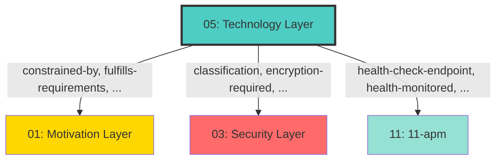

## Cross-Layer Relationships

**Purpose**: Define semantic links to entities in other layers, supporting traceability, governance, and architectural alignment.

### Outgoing Relationships (This Layer → Other Layers)

Links from entities in this layer to entities in other layers.

#### To Motivation Layer (01)

Links to strategic goals, requirements, principles, and constraints.

| Predicate | Source Element | Target Element | Field Path | Strength | Required | Description |
|-----------|----------------|----------------|------------|----------|----------|-------------|
| `constrained-by` | Any | ConstrainedBy | `motivation.constrained-by`, `x-constrained-by` | medium | No | string[] (Constraint IDs for regulatory/compliance, optional) |
| `fulfills-requirements` | Any | FulfillsRequirement | `motivation.fulfills-requirements`, `x-fulfills-requirements` | high | No | comma-separated Requirement IDs this function fulfills |
| `governed-by-principles` | Any | GovernedByPrinciple | `motivation.governed-by-principles`, `x-governed-by-principles` | high | No | string[] (Principle IDs that guide this API, optional) |
| `supports-goals` | Any | SupportsGoal | `motivation.supports-goals`, `x-supports-goals` | high | No | comma-separated Goal IDs this service supports |

**Example**:
```yaml
properties:
  motivation.constrained-by:
    type: string
    description: string[] (Constraint IDs for regulatory/compliance, optional)
    example: "target-id-1"
```

#### To Security Layer (03)

Links to security models, resources, and controls.

| Predicate | Source Element | Target Element | Field Path | Strength | Required | Description |
|-----------|----------------|----------------|------------|----------|----------|-------------|
| `classification` | Any | Classification | `security.classification` | low | No | Links to Classification in target layer |
| `encryption-required` | Any | EncryptionRequired | `security.encryption-required` | medium | No | Links to EncryptionRequired in target layer |
| `encryption-type` | Any | EncryptionType | `security.encryption-type` | medium | No | Links to EncryptionType in target layer |
| `pii` | Any | Pii | `security.pii`, `x-pii` | medium | No | contains personally identifiable information |

**Example**:
```yaml
properties:
  security.classification:
    type: string
    description: Links to Classification in target layer
    example: "target-id-1"
```

#### To 11-apm (11)

Links to 11-apm elements.

| Predicate | Source Element | Target Element | Field Path | Strength | Required | Description |
|-----------|----------------|----------------|------------|----------|----------|-------------|
| `health-check-endpoint` | Any | HealthCheckEndpoint | `apm.health-check-endpoint` | medium | No | health check endpoint |
| `health-monitored` | Any | HealthMonitored | `apm.health-monitored` | medium | No | whether health is actively monitored |
| `sla-target-availability` | Any | SlaTargetAvailability | `apm.sla-target-availability`, `x-apm-sla-target-availability` | medium | No | string (e.g., "99.95%", "99.99%", optional) |
| `sla-target-latency` | Any | SlaTargetLatency | `apm.sla-target-latency`, `x-apm-sla-target-latency` | medium | No | string (e.g., "200ms", "500ms", optional) |

**Example**:
```yaml
properties:
  apm.health-check-endpoint:
    type: string
    description: health check endpoint
    example: "target-id-1"
```

### Incoming Relationships (Other Layers → This Layer)

Links from entities in other layers to entities in this layer.

_No incoming cross-layer relationships defined._

### Cross-Layer Relationship Diagram


