# Technology Layer - Cross-Layer Relationships

## Cross-Layer Relationships

**Purpose**: Define semantic links to entities in other layers, supporting traceability, governance, and architectural alignment.

### Cross-Layer Relationship Diagram

```mermaid
graph TB
  subgraph thisLayer["05: Technology Layer"]
    ThisLayerNode["Entities in Technology Layer"]
  end

  %% Target layers
  subgraph target01Layer["01: Motivation Layer"]
    target01ConstrainedBy["ConstrainedBy"]
    target01FulfillsRequirement["FulfillsRequirement"]
    target01GovernedByPrinciple["GovernedByPrinciple"]
    target01SupportsGoal["SupportsGoal"]
  end
  subgraph target03Layer["03: Security Layer"]
    target03Classification["Classification"]
    target03EncryptionRequired["EncryptionRequired"]
    target03EncryptionType["EncryptionType"]
    target03Pii["Pii"]
  end
  subgraph target11Layer["11: 11-apm"]
    target11HealthCheckEndpoint["HealthCheckEndpoint"]
    target11HealthMonitored["HealthMonitored"]
    target11SlaTargetAvailability["SlaTargetAvailability"]
    target11SlaTargetLatency["SlaTargetLatency"]
  end

  %% Outgoing relationships
  ThisLayerNode -->|health-check-endpoint| target11HealthCheckEndpoint
  ThisLayerNode -->|health-monitored| target11HealthMonitored
  ThisLayerNode -->|sla-target-availability| target11SlaTargetAvailability
  ThisLayerNode -->|sla-target-latency| target11SlaTargetLatency
  ThisLayerNode -->|constrained-by| target01ConstrainedBy
  ThisLayerNode -->|fulfills-requirements| target01FulfillsRequirement
  ThisLayerNode -->|governed-by-principles| target01GovernedByPrinciple
  ThisLayerNode -->|supports-goals| target01SupportsGoal
  ThisLayerNode -->|classification| target03Classification
  ThisLayerNode -->|encryption-required| target03EncryptionRequired
  ThisLayerNode -->|encryption-type| target03EncryptionType
  ThisLayerNode -->|pii| target03Pii

  %% Styling
  classDef thisLayerStyle fill:#4ECDC4,stroke:#333,stroke-width:3px
  classDef targetLayerStyle fill:#FFD700,stroke:#333,stroke-width:2px
  classDef sourceLayerStyle fill:#E17055,stroke:#333,stroke-width:2px

  class ThisLayerNode thisLayerStyle
  class target01ConstrainedBy targetLayerStyle
  class target01FulfillsRequirement targetLayerStyle
  class target01GovernedByPrinciple targetLayerStyle
  class target01SupportsGoal targetLayerStyle
  class target03Classification targetLayerStyle
  class target03EncryptionRequired targetLayerStyle
  class target03EncryptionType targetLayerStyle
  class target03Pii targetLayerStyle
  class target11HealthCheckEndpoint targetLayerStyle
  class target11HealthMonitored targetLayerStyle
  class target11SlaTargetAvailability targetLayerStyle
  class target11SlaTargetLatency targetLayerStyle
```



### Outgoing Relationships (This Layer → Other Layers)

Links from entities in this layer to entities in other layers.

#### To Motivation Layer (01)

Links to strategic goals, requirements, principles, and constraints.

| Predicate | Source Element | Target Element | Field Path | Strength | Required | Description | Documented |
|-----------|----------------|----------------|------------|----------|----------|-------------|------------|
| `constrained-by` | Artifact, CommunicationNetwork, Node, SystemSoftware, TechnologyService | ConstrainedBy | `motivation.constrained-by`, `x-constrained-by` | medium | No | string[] (Constraint IDs for regulatory/compliance, optional) | [✓](../../spec/schemas/link-registry.json) |
| `fulfills-requirements` | CommunicationNetwork, Node, SystemSoftware | FulfillsRequirement | `motivation.fulfills-requirements`, `x-fulfills-requirements` | high | No | comma-separated Requirement IDs this function fulfills | [✓](../../spec/schemas/link-registry.json) |
| `governed-by-principles` | CommunicationNetwork, Node, SystemSoftware, TechnologyService | GovernedByPrinciple | `motivation.governed-by-principles`, `x-governed-by-principles` | high | No | BusinessService governed by Principles | [✓](../../spec/schemas/link-registry.json) |
| `supports-goals` | TechnologyService | SupportsGoal | `motivation.supports-goals`, `x-supports-goals` | high | No | BusinessService supports Goals | [✓](../../spec/schemas/link-registry.json) |

**Example**:
```yaml
properties:
  motivation.constrained-by:
    type: string
    description: string[] (Constraint IDs for regulatory/compliance, optional)
    example: "target-id-1"
```

#### To Security Layer (03)

Links to security models, resources, and controls.

| Predicate | Source Element | Target Element | Field Path | Strength | Required | Description | Documented |
|-----------|----------------|----------------|------------|----------|----------|-------------|------------|
| `classification` | Artifact | Classification | `security.classification` | low | No | Links to Classification in target layer | [✓](../../spec/schemas/link-registry.json) |
| `encryption-required` | Artifact | EncryptionRequired | `security.encryption-required` | medium | No | Links to EncryptionRequired in target layer | [✓](../../spec/schemas/link-registry.json) |
| `encryption-type` | Artifact | EncryptionType | `security.encryption-type` | medium | No | Links to EncryptionType in target layer | [✓](../../spec/schemas/link-registry.json) |
| `pii` | Artifact | Pii | `security.pii`, `x-pii` | medium | No | contains personally identifiable information | [✓](../../spec/schemas/link-registry.json) |

**Example**:
```yaml
properties:
  security.classification:
    type: string
    description: Links to Classification in target layer
    example: "target-id-1"
```

#### To 11-apm (11)

Links to 11-apm elements.

| Predicate | Source Element | Target Element | Field Path | Strength | Required | Description | Documented |
|-----------|----------------|----------------|------------|----------|----------|-------------|------------|
| `health-check-endpoint` | TechnologyService | HealthCheckEndpoint | `apm.health-check-endpoint` | medium | No | health check endpoint | [✓](../../spec/schemas/link-registry.json) |
| `health-monitored` | TechnologyService | HealthMonitored | `apm.health-monitored` | medium | No | whether health is actively monitored | [✓](../../spec/schemas/link-registry.json) |
| `sla-target-availability` | TechnologyService | SlaTargetAvailability | `apm.sla-target-availability`, `x-apm-sla-target-availability` | medium | No | string (e.g., "99.95%", "99.99%", optional) | [✓](../../spec/schemas/link-registry.json) |
| `sla-target-latency` | TechnologyService | SlaTargetLatency | `apm.sla-target-latency`, `x-apm-sla-target-latency` | medium | No | string (e.g., "200ms", "500ms", optional) | [✓](../../spec/schemas/link-registry.json) |

**Example**:
```yaml
properties:
  apm.health-check-endpoint:
    type: string
    description: health check endpoint
    example: "target-id-1"
```

### Incoming Relationships (Other Layers → This Layer)

Links from entities in other layers to entities in this layer.

_No incoming cross-layer relationships defined._
