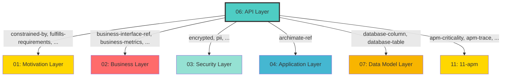

## Cross-Layer Relationships

**Purpose**: Define semantic links to entities in other layers, supporting traceability, governance, and architectural alignment.

### Outgoing Relationships (This Layer → Other Layers)

Links from entities in this layer to entities in other layers.

#### To Motivation Layer (01)

Links to strategic goals, requirements, principles, and constraints.

| Predicate | Source Element | Target Element | Field Path | Strength | Required | Description |
|-----------|----------------|----------------|------------|----------|----------|-------------|
| `constrained-by` | Any | ConstrainedBy | `motivation.constrained-by`, `x-constrained-by` | medium | No | string[] (Constraint IDs for regulatory/compliance, optional) |
| `fulfills-requirements` | Any | FulfillsRequirement | `motivation.fulfills-requirements`, `x-fulfills-requirements` | high | No | comma-separated Requirement IDs this function fulfills |
| `governed-by-principles` | Any | GovernedByPrinciple | `motivation.governed-by-principles`, `x-governed-by-principles` | high | No | string[] (Principle IDs that guide this API, optional) |
| `supports-goals` | Any | SupportsGoal | `motivation.supports-goals`, `x-supports-goals` | high | No | comma-separated Goal IDs this service supports |

**Example**:
```yaml
properties:
  motivation.constrained-by:
    type: string
    description: string[] (Constraint IDs for regulatory/compliance, optional)
    example: "target-id-1"
```

#### To Business Layer (02)

Links to business services, processes, and actors.

| Predicate | Source Element | Target Element | Field Path | Strength | Required | Description |
|-----------|----------------|----------------|------------|----------|----------|-------------|
| `business-metrics` | Any | BusinessMetric | `apm.business-metrics`, `x-apm-business-metrics` | medium | No | comma-separated business metric IDs this service tracks |
| `business-interface-ref` | Any | BusinessInterface | `x-business-interface-ref` | medium | No | string (BusinessInterface.id, optional) |
| `business-service-ref` | Any | BusinessService | `x-business-service-ref` | medium | No | string (BusinessService.id, optional) |

**Example**:
```yaml
properties:
  apm.business-metrics:
    type: string
    description: comma-separated business metric IDs this service tracks
    example: "target-id-1"
```

#### To Security Layer (03)

Links to security models, resources, and controls.

| Predicate | Source Element | Target Element | Field Path | Strength | Required | Description |
|-----------|----------------|----------------|------------|----------|----------|-------------|
| `encrypted` | Any | Encrypted | `x-encrypted` | medium | No | boolean |
| `pii` | Any | Pii | `security.pii`, `x-pii` | medium | No | contains personally identifiable information |
| `required-permissions` | Any | Permission | `x-required-permissions` | critical | No | string[] (Permission.name[], optional) |
| `security-resource` | Any | SecureResource | `x-security-resource` | critical | No | string (SecureResource.resource, optional) |

**Example**:
```yaml
properties:
  x-encrypted:
    type: string
    description: boolean
    example: "target-id-1"
```

#### To Application Layer (04)

Links to application layer elements.

| Predicate | Source Element | Target Element | Field Path | Strength | Required | Description |
|-----------|----------------|----------------|------------|----------|----------|-------------|
| `archimate-ref` | Any | Element | `x-archimate-ref` | medium | No | string (Element.id reference to ApplicationService) |

**Example**:
```yaml
properties:
  x-archimate-ref:
    type: string
    description: string (Element.id reference to ApplicationService)
    example: "target-id-1"
```

#### To Data Model Layer (07)

Links to data schemas, tables, and columns.

| Predicate | Source Element | Target Element | Field Path | Strength | Required | Description |
|-----------|----------------|----------------|------------|----------|----------|-------------|
| `database-column` | Any | Column | `x-database-column` | medium | No | string |
| `database-table` | Any | Table | `x-database-table` | medium | No | string |

**Example**:
```yaml
properties:
  x-database-column:
    type: string
    description: string
    example: "target-id-1"
```

#### To 11-apm (11)

Links to 11-apm elements.

| Predicate | Source Element | Target Element | Field Path | Strength | Required | Description |
|-----------|----------------|----------------|------------|----------|----------|-------------|
| `apm-criticality` | Any | Criticality | `x-apm-criticality` | medium | No | enum [low, medium, high, critical] (optional) |
| `sla-target-availability` | Any | SlaTargetAvailability | `apm.sla-target-availability`, `x-apm-sla-target-availability` | medium | No | string (e.g., "99.95%", "99.99%", optional) |
| `sla-target-latency` | Any | SlaTargetLatency | `apm.sla-target-latency`, `x-apm-sla-target-latency` | medium | No | string (e.g., "200ms", "500ms", optional) |
| `apm-trace` | Any | Trace | `x-apm-trace` | medium | No | boolean (optional) |

**Example**:
```yaml
properties:
  x-apm-criticality:
    type: string
    description: enum [low, medium, high, critical] (optional)
    example: "target-id-1"
```

### Incoming Relationships (Other Layers → This Layer)

Links from entities in other layers to entities in this layer.

_No incoming cross-layer relationships defined._

### Cross-Layer Relationship Diagram


