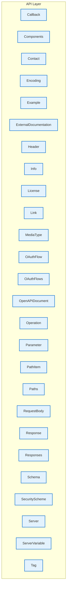

# API Layer - Intra-Layer Relationships

## Overview

**Purpose**: Define semantic links between entities WITHIN this layer, capturing
structural composition, behavioral dependencies, and influence relationships.

**Layer ID**: `06-api-layer`
**Analysis Date**: Generated automatically
**Validation**: Uses MarkdownLayerParser for closed-loop validation

---

### Relationship Diagram

## Entity: Callback

**Definition**: Defines a webhook or callback URL pattern where the API will send asynchronous notifications. Enables event-driven integrations and async workflows.

### Outgoing Relationships (Callback → Other Entities)

_No outgoing intra-layer relationships documented._

### Incoming Relationships (Other Entities → Callback)

_No incoming intra-layer relationships documented._

### Relationship Summary

- **Total Relationships**: 0
- **Outgoing**: 0
- **Incoming**: 0
- **Documented**: 0/0
- **With XML Examples**: 0/0
- **In Catalog**: 0/0

---

## Entity: Components

**Definition**: Reusable component definitions

### Outgoing Relationships (Components → Other Entities)

_No outgoing intra-layer relationships documented._

### Incoming Relationships (Other Entities → Components)

_No incoming intra-layer relationships documented._

### Relationship Summary

- **Total Relationships**: 0
- **Outgoing**: 0
- **Incoming**: 0
- **Documented**: 0/0
- **With XML Examples**: 0/0
- **In Catalog**: 0/0

---

## Entity: Contact

**Definition**: Contact information for the API owner or maintainer, including name, email, and URL. Enables consumers to reach out for support or collaboration.

### Outgoing Relationships (Contact → Other Entities)

_No outgoing intra-layer relationships documented._

### Incoming Relationships (Other Entities → Contact)

_No incoming intra-layer relationships documented._

### Relationship Summary

- **Total Relationships**: 0
- **Outgoing**: 0
- **Incoming**: 0
- **Documented**: 0/0
- **With XML Examples**: 0/0
- **In Catalog**: 0/0

---

## Entity: Encoding

**Definition**: Specifies serialization details for multipart request body properties, including content-type, headers, and encoding style. Handles complex content negotiation.

### Outgoing Relationships (Encoding → Other Entities)

_No outgoing intra-layer relationships documented._

### Incoming Relationships (Other Entities → Encoding)

_No incoming intra-layer relationships documented._

### Relationship Summary

- **Total Relationships**: 0
- **Outgoing**: 0
- **Incoming**: 0
- **Documented**: 0/0
- **With XML Examples**: 0/0
- **In Catalog**: 0/0

---

## Entity: Example

**Definition**: Provides sample values for request bodies, responses, or parameters. Improves documentation clarity and enables automated testing or mocking.

### Outgoing Relationships (Example → Other Entities)

_No outgoing intra-layer relationships documented._

### Incoming Relationships (Other Entities → Example)

_No incoming intra-layer relationships documented._

### Relationship Summary

- **Total Relationships**: 0
- **Outgoing**: 0
- **Incoming**: 0
- **Documented**: 0/0
- **With XML Examples**: 0/0
- **In Catalog**: 0/0

---

## Entity: ExternalDocumentation

**Definition**: A reference to external documentation resources (URLs, wikis, guides) that provide additional context beyond the inline API specification. Links API elements to comprehensive documentation.

### Outgoing Relationships (ExternalDocumentation → Other Entities)

_No outgoing intra-layer relationships documented._

### Incoming Relationships (Other Entities → ExternalDocumentation)

_No incoming intra-layer relationships documented._

### Relationship Summary

- **Total Relationships**: 0
- **Outgoing**: 0
- **Incoming**: 0
- **Documented**: 0/0
- **With XML Examples**: 0/0
- **In Catalog**: 0/0

---

## Entity: Header

**Definition**: Defines HTTP header parameters for requests or responses, specifying name, schema, required status, and description. Documents header-based communication requirements.

### Outgoing Relationships (Header → Other Entities)

_No outgoing intra-layer relationships documented._

### Incoming Relationships (Other Entities → Header)

_No incoming intra-layer relationships documented._

### Relationship Summary

- **Total Relationships**: 0
- **Outgoing**: 0
- **Incoming**: 0
- **Documented**: 0/0
- **With XML Examples**: 0/0
- **In Catalog**: 0/0

---

## Entity: Info

**Definition**: Metadata about the API

### Outgoing Relationships (Info → Other Entities)

_No outgoing intra-layer relationships documented._

### Incoming Relationships (Other Entities → Info)

_No incoming intra-layer relationships documented._

### Relationship Summary

- **Total Relationships**: 0
- **Outgoing**: 0
- **Incoming**: 0
- **Documented**: 0/0
- **With XML Examples**: 0/0
- **In Catalog**: 0/0

---

## Entity: License

**Definition**: Specifies the legal license under which the API is provided, including license name and URL to full terms. Clarifies usage rights for API consumers.

### Outgoing Relationships (License → Other Entities)

_No outgoing intra-layer relationships documented._

### Incoming Relationships (Other Entities → License)

_No incoming intra-layer relationships documented._

### Relationship Summary

- **Total Relationships**: 0
- **Outgoing**: 0
- **Incoming**: 0
- **Documented**: 0/0
- **With XML Examples**: 0/0
- **In Catalog**: 0/0

---

## Entity: Link

**Definition**: Describes a relationship between API responses and subsequent operations, enabling hypermedia-driven API navigation. Supports HATEOAS design patterns.

### Outgoing Relationships (Link → Other Entities)

_No outgoing intra-layer relationships documented._

### Incoming Relationships (Other Entities → Link)

_No incoming intra-layer relationships documented._

### Relationship Summary

- **Total Relationships**: 0
- **Outgoing**: 0
- **Incoming**: 0
- **Documented**: 0/0
- **With XML Examples**: 0/0
- **In Catalog**: 0/0

---

## Entity: MediaType

**Definition**: Media type and schema for request/response body

### Outgoing Relationships (MediaType → Other Entities)

_No outgoing intra-layer relationships documented._

### Incoming Relationships (Other Entities → MediaType)

_No incoming intra-layer relationships documented._

### Relationship Summary

- **Total Relationships**: 0
- **Outgoing**: 0
- **Incoming**: 0
- **Documented**: 0/0
- **With XML Examples**: 0/0
- **In Catalog**: 0/0

---

## Entity: OAuthFlow

**Definition**: Individual OAuth 2.0 flow configuration

### Outgoing Relationships (OAuthFlow → Other Entities)

_No outgoing intra-layer relationships documented._

### Incoming Relationships (Other Entities → OAuthFlow)

_No incoming intra-layer relationships documented._

### Relationship Summary

- **Total Relationships**: 0
- **Outgoing**: 0
- **Incoming**: 0
- **Documented**: 0/0
- **With XML Examples**: 0/0
- **In Catalog**: 0/0

---

## Entity: OAuthFlows

**Definition**: Configuration for OAuth 2.0 authentication flows (implicit, password, clientCredentials, authorizationCode), specifying authorization URLs, token URLs, and scopes. Defines OAuth security implementation.

### Outgoing Relationships (OAuthFlows → Other Entities)

_No outgoing intra-layer relationships documented._

### Incoming Relationships (Other Entities → OAuthFlows)

_No incoming intra-layer relationships documented._

### Relationship Summary

- **Total Relationships**: 0
- **Outgoing**: 0
- **Incoming**: 0
- **Documented**: 0/0
- **With XML Examples**: 0/0
- **In Catalog**: 0/0

---

## Entity: OpenAPIDocument

**Definition**: Root of an OpenAPI specification file

### Outgoing Relationships (OpenAPIDocument → Other Entities)

_No outgoing intra-layer relationships documented._

### Incoming Relationships (Other Entities → OpenAPIDocument)

_No incoming intra-layer relationships documented._

### Relationship Summary

- **Total Relationships**: 0
- **Outgoing**: 0
- **Incoming**: 0
- **Documented**: 0/0
- **With XML Examples**: 0/0
- **In Catalog**: 0/0

---

## Entity: Operation

**Definition**: Single API operation (HTTP method on a path)

### Outgoing Relationships (Operation → Other Entities)

_No outgoing intra-layer relationships documented._

### Incoming Relationships (Other Entities → Operation)

_No incoming intra-layer relationships documented._

### Relationship Summary

- **Total Relationships**: 0
- **Outgoing**: 0
- **Incoming**: 0
- **Documented**: 0/0
- **With XML Examples**: 0/0
- **In Catalog**: 0/0

---

## Entity: Parameter

**Definition**: Parameter for an operation

### Outgoing Relationships (Parameter → Other Entities)

_No outgoing intra-layer relationships documented._

### Incoming Relationships (Other Entities → Parameter)

_No incoming intra-layer relationships documented._

### Relationship Summary

- **Total Relationships**: 0
- **Outgoing**: 0
- **Incoming**: 0
- **Documented**: 0/0
- **With XML Examples**: 0/0
- **In Catalog**: 0/0

---

## Entity: PathItem

**Definition**: Operations available on a path

### Outgoing Relationships (PathItem → Other Entities)

_No outgoing intra-layer relationships documented._

### Incoming Relationships (Other Entities → PathItem)

_No incoming intra-layer relationships documented._

### Relationship Summary

- **Total Relationships**: 0
- **Outgoing**: 0
- **Incoming**: 0
- **Documented**: 0/0
- **With XML Examples**: 0/0
- **In Catalog**: 0/0

---

## Entity: Paths

**Definition**: Available API endpoints and operations

### Outgoing Relationships (Paths → Other Entities)

_No outgoing intra-layer relationships documented._

### Incoming Relationships (Other Entities → Paths)

_No incoming intra-layer relationships documented._

### Relationship Summary

- **Total Relationships**: 0
- **Outgoing**: 0
- **Incoming**: 0
- **Documented**: 0/0
- **With XML Examples**: 0/0
- **In Catalog**: 0/0

---

## Entity: RequestBody

**Definition**: Request payload for an operation

### Outgoing Relationships (RequestBody → Other Entities)

_No outgoing intra-layer relationships documented._

### Incoming Relationships (Other Entities → RequestBody)

_No incoming intra-layer relationships documented._

### Relationship Summary

- **Total Relationships**: 0
- **Outgoing**: 0
- **Incoming**: 0
- **Documented**: 0/0
- **With XML Examples**: 0/0
- **In Catalog**: 0/0

---

## Entity: Response

**Definition**: Single response definition

### Outgoing Relationships (Response → Other Entities)

_No outgoing intra-layer relationships documented._

### Incoming Relationships (Other Entities → Response)

_No incoming intra-layer relationships documented._

### Relationship Summary

- **Total Relationships**: 0
- **Outgoing**: 0
- **Incoming**: 0
- **Documented**: 0/0
- **With XML Examples**: 0/0
- **In Catalog**: 0/0

---

## Entity: Responses

**Definition**: Possible responses from an operation

### Outgoing Relationships (Responses → Other Entities)

_No outgoing intra-layer relationships documented._

### Incoming Relationships (Other Entities → Responses)

_No incoming intra-layer relationships documented._

### Relationship Summary

- **Total Relationships**: 0
- **Outgoing**: 0
- **Incoming**: 0
- **Documented**: 0/0
- **With XML Examples**: 0/0
- **In Catalog**: 0/0

---

## Entity: Schema

**Definition**: Data type definition (JSON Schema subset)

### Outgoing Relationships (Schema → Other Entities)

_No outgoing intra-layer relationships documented._

### Incoming Relationships (Other Entities → Schema)

_No incoming intra-layer relationships documented._

### Relationship Summary

- **Total Relationships**: 0
- **Outgoing**: 0
- **Incoming**: 0
- **Documented**: 0/0
- **With XML Examples**: 0/0
- **In Catalog**: 0/0

---

## Entity: SecurityScheme

**Definition**: Security mechanism for the API

### Outgoing Relationships (SecurityScheme → Other Entities)

_No outgoing intra-layer relationships documented._

### Incoming Relationships (Other Entities → SecurityScheme)

_No incoming intra-layer relationships documented._

### Relationship Summary

- **Total Relationships**: 0
- **Outgoing**: 0
- **Incoming**: 0
- **Documented**: 0/0
- **With XML Examples**: 0/0
- **In Catalog**: 0/0

---

## Entity: Server

**Definition**: Server where the API is available

### Outgoing Relationships (Server → Other Entities)

_No outgoing intra-layer relationships documented._

### Incoming Relationships (Other Entities → Server)

_No incoming intra-layer relationships documented._

### Relationship Summary

- **Total Relationships**: 0
- **Outgoing**: 0
- **Incoming**: 0
- **Documented**: 0/0
- **With XML Examples**: 0/0
- **In Catalog**: 0/0

---

## Entity: ServerVariable

**Definition**: A variable placeholder in server URL templates that can be substituted at runtime. Enables dynamic server addressing for different environments or tenants.

### Outgoing Relationships (ServerVariable → Other Entities)

_No outgoing intra-layer relationships documented._

### Incoming Relationships (Other Entities → ServerVariable)

_No incoming intra-layer relationships documented._

### Relationship Summary

- **Total Relationships**: 0
- **Outgoing**: 0
- **Incoming**: 0
- **Documented**: 0/0
- **With XML Examples**: 0/0
- **In Catalog**: 0/0

---

## Entity: Tag

**Definition**: A metadata label used to group and categorize API operations for documentation organization. Enables logical grouping of endpoints in generated API documentation.

### Outgoing Relationships (Tag → Other Entities)

_No outgoing intra-layer relationships documented._

### Incoming Relationships (Other Entities → Tag)

_No incoming intra-layer relationships documented._

### Relationship Summary

- **Total Relationships**: 0
- **Outgoing**: 0
- **Incoming**: 0
- **Documented**: 0/0
- **With XML Examples**: 0/0
- **In Catalog**: 0/0

---

## Layer Summary

### Entity Coverage (Target: 2+ relationships per entity)

- **Entities Meeting Target**: 0/26
- **Entity Coverage**: 0.0%

**Entities Below Target**:

- OpenAPIDocument: 0 relationship(s) (needs 2 more)
- Info: 0 relationship(s) (needs 2 more)
- Server: 0 relationship(s) (needs 2 more)
- Paths: 0 relationship(s) (needs 2 more)
- PathItem: 0 relationship(s) (needs 2 more)
- Operation: 0 relationship(s) (needs 2 more)
- Parameter: 0 relationship(s) (needs 2 more)
- RequestBody: 0 relationship(s) (needs 2 more)
- Responses: 0 relationship(s) (needs 2 more)
- Response: 0 relationship(s) (needs 2 more)
- MediaType: 0 relationship(s) (needs 2 more)
- Components: 0 relationship(s) (needs 2 more)
- Schema: 0 relationship(s) (needs 2 more)
- Tag: 0 relationship(s) (needs 2 more)
- ExternalDocumentation: 0 relationship(s) (needs 2 more)
- Contact: 0 relationship(s) (needs 2 more)
- License: 0 relationship(s) (needs 2 more)
- ServerVariable: 0 relationship(s) (needs 2 more)
- Header: 0 relationship(s) (needs 2 more)
- Link: 0 relationship(s) (needs 2 more)
- Callback: 0 relationship(s) (needs 2 more)
- Example: 0 relationship(s) (needs 2 more)
- Encoding: 0 relationship(s) (needs 2 more)
- OAuthFlows: 0 relationship(s) (needs 2 more)
- OAuthFlow: 0 relationship(s) (needs 2 more)
- SecurityScheme: 0 relationship(s) (needs 2 more)

### Coverage Matrix

| Entity | Outgoing | Incoming | Total | Meets Target | Status |
|--------|----------|----------|-------|--------------|--------|
| Callback | 0 | 0 | 0 | ✗ | Needs 2 |
| Components | 0 | 0 | 0 | ✗ | Needs 2 |
| Contact | 0 | 0 | 0 | ✗ | Needs 2 |
| Encoding | 0 | 0 | 0 | ✗ | Needs 2 |
| Example | 0 | 0 | 0 | ✗ | Needs 2 |
| ExternalDocumentation | 0 | 0 | 0 | ✗ | Needs 2 |
| Header | 0 | 0 | 0 | ✗ | Needs 2 |
| Info | 0 | 0 | 0 | ✗ | Needs 2 |
| License | 0 | 0 | 0 | ✗ | Needs 2 |
| Link | 0 | 0 | 0 | ✗ | Needs 2 |
| MediaType | 0 | 0 | 0 | ✗ | Needs 2 |
| OAuthFlow | 0 | 0 | 0 | ✗ | Needs 2 |
| OAuthFlows | 0 | 0 | 0 | ✗ | Needs 2 |
| OpenAPIDocument | 0 | 0 | 0 | ✗ | Needs 2 |
| Operation | 0 | 0 | 0 | ✗ | Needs 2 |
| Parameter | 0 | 0 | 0 | ✗ | Needs 2 |
| PathItem | 0 | 0 | 0 | ✗ | Needs 2 |
| Paths | 0 | 0 | 0 | ✗ | Needs 2 |
| RequestBody | 0 | 0 | 0 | ✗ | Needs 2 |
| Response | 0 | 0 | 0 | ✗ | Needs 2 |
| Responses | 0 | 0 | 0 | ✗ | Needs 2 |
| Schema | 0 | 0 | 0 | ✗ | Needs 2 |
| SecurityScheme | 0 | 0 | 0 | ✗ | Needs 2 |
| Server | 0 | 0 | 0 | ✗ | Needs 2 |
| ServerVariable | 0 | 0 | 0 | ✗ | Needs 2 |
| Tag | 0 | 0 | 0 | ✗ | Needs 2 |
| **TOTAL** | **-** | **-** | **0** | **0/26** | **0.0%** |

### Relationship Statistics

- **Total Intra-Layer Relationships**: 0
- **Average Relationships per Entity**: 0.0
- **Entity Coverage Target**: 2+ relationships
