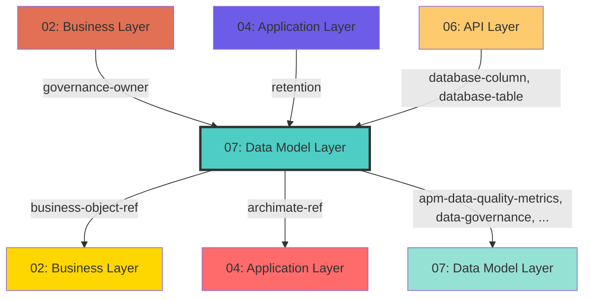

## Cross-Layer Relationships

**Purpose**: Define semantic links to entities in other layers, supporting traceability, governance, and architectural alignment.

### Outgoing Relationships (This Layer → Other Layers)

Links from entities in this layer to entities in other layers.

#### To Business Layer (02)

Links to business services, processes, and actors.

| Predicate | Source Element | Target Element | Field Path | Strength | Required | Description |
|-----------|----------------|----------------|------------|----------|----------|-------------|
| `business-object-ref` | Any | BusinessObject | `x-business-object-ref` | medium | No | string (BusinessObject.id reference, optional) |

**Example**:
```yaml
properties:
  x-business-object-ref:
    type: string
    description: string (BusinessObject.id reference, optional)
    example: "target-id-1"
```

#### To Application Layer (04)

Links to application layer elements.

| Predicate | Source Element | Target Element | Field Path | Strength | Required | Description |
|-----------|----------------|----------------|------------|----------|----------|-------------|
| `archimate-ref` | Any | Element | `x-archimate-ref` | medium | No | string (Element.id reference to ApplicationService) |

**Example**:
```yaml
properties:
  x-archimate-ref:
    type: string
    description: string (Element.id reference to ApplicationService)
    example: "target-id-1"
```

#### To Data Model Layer (07)

Links to data schemas, tables, and columns.

| Predicate | Source Element | Target Element | Field Path | Strength | Required | Description |
|-----------|----------------|----------------|------------|----------|----------|-------------|
| `apm-data-quality-metrics` | Any | DataQualityMetric | `x-apm-data-quality-metrics` | medium | No | DataQualityMetrics (optional) |
| `data-governance` | Any | Governance | `x-data-governance` | medium | No | DataGovernance (optional) |
| `database` | Any | Database | `x-database` | medium | No | DatabaseMapping (optional) |

**Example**:
```yaml
properties:
  x-apm-data-quality-metrics:
    type: string
    description: DataQualityMetrics (optional)
    example: "target-id-1"
```

### Incoming Relationships (Other Layers → This Layer)

Links from entities in other layers to entities in this layer.

#### From Business Layer (02)

| Predicate | Source Element | Target Element | Field Path | Description |
|-----------|----------------|----------------|------------|-------------|
| `governance-owner` | Any | GovernanceOwner | `data.governance-owner` | data owner reference |

#### From Application Layer (04)

| Predicate | Source Element | Target Element | Field Path | Description |
|-----------|----------------|----------------|------------|-------------|
| `retention` | Any | Retention | `data.retention` | Links to Retention in target layer |

#### From API Layer (06)

| Predicate | Source Element | Target Element | Field Path | Description |
|-----------|----------------|----------------|------------|-------------|
| `database-column` | Any | Column | `x-database-column` | string |
| `database-table` | Any | Table | `x-database-table` | string |

#### From Data Model Layer (07)

| Predicate | Source Element | Target Element | Field Path | Description |
|-----------|----------------|----------------|------------|-------------|
| `apm-data-quality-metrics` | Any | DataQualityMetric | `x-apm-data-quality-metrics` | DataQualityMetrics (optional) |
| `data-governance` | Any | Governance | `x-data-governance` | DataGovernance (optional) |
| `database` | Any | Database | `x-database` | DatabaseMapping (optional) |

### Cross-Layer Relationship Diagram


