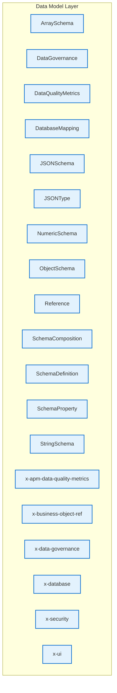

# Data Model Layer - Intra-Layer Relationships

## Overview

**Purpose**: Define semantic links between entities WITHIN this layer, capturing
structural composition, behavioral dependencies, and influence relationships.

**Layer ID**: `07-data-model-layer`
**Analysis Date**: Generated automatically
**Validation**: Uses MarkdownLayerParser for closed-loop validation

---

### Relationship Diagram

## Entity: ArraySchema

**Definition**: ArraySchema validation rules

### Outgoing Relationships (ArraySchema → Other Entities)

_No outgoing intra-layer relationships documented._

### Incoming Relationships (Other Entities → ArraySchema)

_No incoming intra-layer relationships documented._

### Relationship Summary

- **Total Relationships**: 0
- **Outgoing**: 0
- **Incoming**: 0
- **Documented**: 0/0
- **With XML Examples**: 0/0
- **In Catalog**: 0/0

---

## Entity: DataGovernance

**Definition**: Metadata about data ownership, classification, sensitivity level, and handling requirements. Ensures data is managed according to organizational policies and regulations.

### Outgoing Relationships (DataGovernance → Other Entities)

_No outgoing intra-layer relationships documented._

### Incoming Relationships (Other Entities → DataGovernance)

_No incoming intra-layer relationships documented._

### Relationship Summary

- **Total Relationships**: 0
- **Outgoing**: 0
- **Incoming**: 0
- **Documented**: 0/0
- **With XML Examples**: 0/0
- **In Catalog**: 0/0

---

## Entity: DataQualityMetrics

**Definition**: Defines measurable quality attributes for data elements such as completeness, accuracy, consistency, and timeliness. Enables data quality monitoring and SLA enforcement.

### Outgoing Relationships (DataQualityMetrics → Other Entities)

_No outgoing intra-layer relationships documented._

### Incoming Relationships (Other Entities → DataQualityMetrics)

_No incoming intra-layer relationships documented._

### Relationship Summary

- **Total Relationships**: 0
- **Outgoing**: 0
- **Incoming**: 0
- **Documented**: 0/0
- **With XML Examples**: 0/0
- **In Catalog**: 0/0

---

## Entity: DatabaseMapping

**Definition**: Specifies how a logical data model entity maps to physical database storage, including table names, column mappings, and storage optimizations. Bridges logical and physical data layers.

### Outgoing Relationships (DatabaseMapping → Other Entities)

_No outgoing intra-layer relationships documented._

### Incoming Relationships (Other Entities → DatabaseMapping)

_No incoming intra-layer relationships documented._

### Relationship Summary

- **Total Relationships**: 0
- **Outgoing**: 0
- **Incoming**: 0
- **Documented**: 0/0
- **With XML Examples**: 0/0
- **In Catalog**: 0/0

---

## Entity: JSONSchema

**Definition**: Root schema document

### Outgoing Relationships (JSONSchema → Other Entities)

_No outgoing intra-layer relationships documented._

### Incoming Relationships (Other Entities → JSONSchema)

_No incoming intra-layer relationships documented._

### Relationship Summary

- **Total Relationships**: 0
- **Outgoing**: 0
- **Incoming**: 0
- **Documented**: 0/0
- **With XML Examples**: 0/0
- **In Catalog**: 0/0

---

## Entity: JSONType

**Definition**: Core JSON data types

### Outgoing Relationships (JSONType → Other Entities)

_No outgoing intra-layer relationships documented._

### Incoming Relationships (Other Entities → JSONType)

_No incoming intra-layer relationships documented._

### Relationship Summary

- **Total Relationships**: 0
- **Outgoing**: 0
- **Incoming**: 0
- **Documented**: 0/0
- **With XML Examples**: 0/0
- **In Catalog**: 0/0

---

## Entity: NumericSchema

**Definition**: NumericSchema validation rules

### Outgoing Relationships (NumericSchema → Other Entities)

_No outgoing intra-layer relationships documented._

### Incoming Relationships (Other Entities → NumericSchema)

_No incoming intra-layer relationships documented._

### Relationship Summary

- **Total Relationships**: 0
- **Outgoing**: 0
- **Incoming**: 0
- **Documented**: 0/0
- **With XML Examples**: 0/0
- **In Catalog**: 0/0

---

## Entity: ObjectSchema

**Definition**: ObjectSchema validation rules

### Outgoing Relationships (ObjectSchema → Other Entities)

_No outgoing intra-layer relationships documented._

### Incoming Relationships (Other Entities → ObjectSchema)

_No incoming intra-layer relationships documented._

### Relationship Summary

- **Total Relationships**: 0
- **Outgoing**: 0
- **Incoming**: 0
- **Documented**: 0/0
- **With XML Examples**: 0/0
- **In Catalog**: 0/0

---

## Entity: Reference

**Definition**: Reference to another schema

### Outgoing Relationships (Reference → Other Entities)

_No outgoing intra-layer relationships documented._

### Incoming Relationships (Other Entities → Reference)

_No incoming intra-layer relationships documented._

### Relationship Summary

- **Total Relationships**: 0
- **Outgoing**: 0
- **Incoming**: 0
- **Documented**: 0/0
- **With XML Examples**: 0/0
- **In Catalog**: 0/0

---

## Entity: SchemaComposition

**Definition**: Combining multiple schemas

### Outgoing Relationships (SchemaComposition → Other Entities)

_No outgoing intra-layer relationships documented._

### Incoming Relationships (Other Entities → SchemaComposition)

_No incoming intra-layer relationships documented._

### Relationship Summary

- **Total Relationships**: 0
- **Outgoing**: 0
- **Incoming**: 0
- **Documented**: 0/0
- **With XML Examples**: 0/0
- **In Catalog**: 0/0

---

## Entity: SchemaDefinition

**Definition**: A reusable JSON Schema definition that can be referenced throughout the data model. Enables DRY schema design and consistent type definitions across entities.

### Outgoing Relationships (SchemaDefinition → Other Entities)

_No outgoing intra-layer relationships documented._

### Incoming Relationships (Other Entities → SchemaDefinition)

_No incoming intra-layer relationships documented._

### Relationship Summary

- **Total Relationships**: 0
- **Outgoing**: 0
- **Incoming**: 0
- **Documented**: 0/0
- **With XML Examples**: 0/0
- **In Catalog**: 0/0

---

## Entity: SchemaProperty

**Definition**: Defines a single property within a schema, including its type, constraints, validation rules, and documentation. The fundamental building block of data model structure.

### Outgoing Relationships (SchemaProperty → Other Entities)

_No outgoing intra-layer relationships documented._

### Incoming Relationships (Other Entities → SchemaProperty)

_No incoming intra-layer relationships documented._

### Relationship Summary

- **Total Relationships**: 0
- **Outgoing**: 0
- **Incoming**: 0
- **Documented**: 0/0
- **With XML Examples**: 0/0
- **In Catalog**: 0/0

---

## Entity: StringSchema

**Definition**: StringSchema validation rules

### Outgoing Relationships (StringSchema → Other Entities)

_No outgoing intra-layer relationships documented._

### Incoming Relationships (Other Entities → StringSchema)

_No incoming intra-layer relationships documented._

### Relationship Summary

- **Total Relationships**: 0
- **Outgoing**: 0
- **Incoming**: 0
- **Documented**: 0/0
- **With XML Examples**: 0/0
- **In Catalog**: 0/0

---

## Entity: x-apm-data-quality-metrics

**Definition**: Links schema to data quality metrics in APM/Observability Layer

### Outgoing Relationships (x-apm-data-quality-metrics → Other Entities)

_No outgoing intra-layer relationships documented._

### Incoming Relationships (Other Entities → x-apm-data-quality-metrics)

_No incoming intra-layer relationships documented._

### Relationship Summary

- **Total Relationships**: 0
- **Outgoing**: 0
- **Incoming**: 0
- **Documented**: 0/0
- **With XML Examples**: 0/0
- **In Catalog**: 0/0

---

## Entity: x-business-object-ref

**Definition**: Reference to BusinessObject this schema implements

### Outgoing Relationships (x-business-object-ref → Other Entities)

_No outgoing intra-layer relationships documented._

### Incoming Relationships (Other Entities → x-business-object-ref)

_No incoming intra-layer relationships documented._

### Relationship Summary

- **Total Relationships**: 0
- **Outgoing**: 0
- **Incoming**: 0
- **Documented**: 0/0
- **With XML Examples**: 0/0
- **In Catalog**: 0/0

---

## Entity: x-data-governance

**Definition**: Data model governance metadata (root-level)

### Outgoing Relationships (x-data-governance → Other Entities)

_No outgoing intra-layer relationships documented._

### Incoming Relationships (Other Entities → x-data-governance)

_No incoming intra-layer relationships documented._

### Relationship Summary

- **Total Relationships**: 0
- **Outgoing**: 0
- **Incoming**: 0
- **Documented**: 0/0
- **With XML Examples**: 0/0
- **In Catalog**: 0/0

---

## Entity: x-database

**Definition**: Database mapping information

### Outgoing Relationships (x-database → Other Entities)

_No outgoing intra-layer relationships documented._

### Incoming Relationships (Other Entities → x-database)

_No incoming intra-layer relationships documented._

### Relationship Summary

- **Total Relationships**: 0
- **Outgoing**: 0
- **Incoming**: 0
- **Documented**: 0/0
- **With XML Examples**: 0/0
- **In Catalog**: 0/0

---

## Entity: x-security

**Definition**: Security and privacy metadata

### Outgoing Relationships (x-security → Other Entities)

_No outgoing intra-layer relationships documented._

### Incoming Relationships (Other Entities → x-security)

_No incoming intra-layer relationships documented._

### Relationship Summary

- **Total Relationships**: 0
- **Outgoing**: 0
- **Incoming**: 0
- **Documented**: 0/0
- **With XML Examples**: 0/0
- **In Catalog**: 0/0

---

## Entity: x-ui

**Definition**: UI rendering hints

### Outgoing Relationships (x-ui → Other Entities)

_No outgoing intra-layer relationships documented._

### Incoming Relationships (Other Entities → x-ui)

_No incoming intra-layer relationships documented._

### Relationship Summary

- **Total Relationships**: 0
- **Outgoing**: 0
- **Incoming**: 0
- **Documented**: 0/0
- **With XML Examples**: 0/0
- **In Catalog**: 0/0

---

## Layer Summary

### Entity Coverage (Target: 2+ relationships per entity)

- **Entities Meeting Target**: 0/19
- **Entity Coverage**: 0.0%

**Entities Below Target**:

- JSONSchema: 0 relationship(s) (needs 2 more)
- JSONType: 0 relationship(s) (needs 2 more)
- StringSchema: 0 relationship(s) (needs 2 more)
- NumericSchema: 0 relationship(s) (needs 2 more)
- ArraySchema: 0 relationship(s) (needs 2 more)
- ObjectSchema: 0 relationship(s) (needs 2 more)
- SchemaComposition: 0 relationship(s) (needs 2 more)
- Reference: 0 relationship(s) (needs 2 more)
- SchemaDefinition: 0 relationship(s) (needs 2 more)
- SchemaProperty: 0 relationship(s) (needs 2 more)
- DataGovernance: 0 relationship(s) (needs 2 more)
- DataQualityMetrics: 0 relationship(s) (needs 2 more)
- DatabaseMapping: 0 relationship(s) (needs 2 more)
- x-business-object-ref: 0 relationship(s) (needs 2 more)
- x-data-governance: 0 relationship(s) (needs 2 more)
- x-apm-data-quality-metrics: 0 relationship(s) (needs 2 more)
- x-database: 0 relationship(s) (needs 2 more)
- x-ui: 0 relationship(s) (needs 2 more)
- x-security: 0 relationship(s) (needs 2 more)

### Coverage Matrix

| Entity | Outgoing | Incoming | Total | Meets Target | Status |
|--------|----------|----------|-------|--------------|--------|
| ArraySchema | 0 | 0 | 0 | ✗ | Needs 2 |
| DataGovernance | 0 | 0 | 0 | ✗ | Needs 2 |
| DataQualityMetrics | 0 | 0 | 0 | ✗ | Needs 2 |
| DatabaseMapping | 0 | 0 | 0 | ✗ | Needs 2 |
| JSONSchema | 0 | 0 | 0 | ✗ | Needs 2 |
| JSONType | 0 | 0 | 0 | ✗ | Needs 2 |
| NumericSchema | 0 | 0 | 0 | ✗ | Needs 2 |
| ObjectSchema | 0 | 0 | 0 | ✗ | Needs 2 |
| Reference | 0 | 0 | 0 | ✗ | Needs 2 |
| SchemaComposition | 0 | 0 | 0 | ✗ | Needs 2 |
| SchemaDefinition | 0 | 0 | 0 | ✗ | Needs 2 |
| SchemaProperty | 0 | 0 | 0 | ✗ | Needs 2 |
| StringSchema | 0 | 0 | 0 | ✗ | Needs 2 |
| x-apm-data-quality-metrics | 0 | 0 | 0 | ✗ | Needs 2 |
| x-business-object-ref | 0 | 0 | 0 | ✗ | Needs 2 |
| x-data-governance | 0 | 0 | 0 | ✗ | Needs 2 |
| x-database | 0 | 0 | 0 | ✗ | Needs 2 |
| x-security | 0 | 0 | 0 | ✗ | Needs 2 |
| x-ui | 0 | 0 | 0 | ✗ | Needs 2 |
| **TOTAL** | **-** | **-** | **0** | **0/19** | **0.0%** |

### Relationship Statistics

- **Total Intra-Layer Relationships**: 0
- **Average Relationships per Entity**: 0.0
- **Entity Coverage Target**: 2+ relationships
