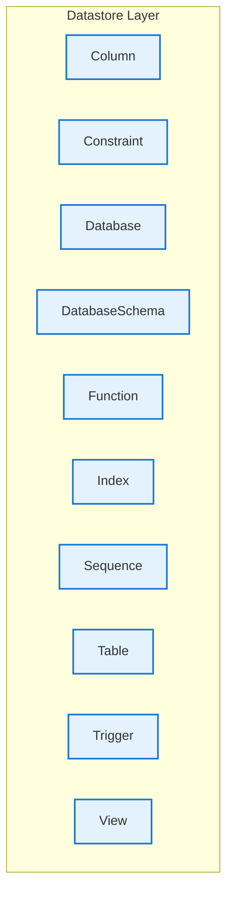

# Datastore Layer - Intra-Layer Relationships

## Overview

**Purpose**: Define semantic links between entities WITHIN this layer, capturing
structural composition, behavioral dependencies, and influence relationships.

**Layer ID**: `08-datastore-layer`
**Analysis Date**: Generated automatically
**Validation**: Uses MarkdownLayerParser for closed-loop validation

---

### Relationship Diagram

## Entity: Column

**Definition**: Table column definition

### Outgoing Relationships (Column → Other Entities)

_No outgoing intra-layer relationships documented._

### Incoming Relationships (Other Entities → Column)

_No incoming intra-layer relationships documented._

### Relationship Summary

- **Total Relationships**: 0
- **Outgoing**: 0
- **Incoming**: 0
- **Documented**: 0/0
- **With XML Examples**: 0/0
- **In Catalog**: 0/0

---

## Entity: Constraint

**Definition**: Table constraint

### Outgoing Relationships (Constraint → Other Entities)

_No outgoing intra-layer relationships documented._

### Incoming Relationships (Other Entities → Constraint)

_No incoming intra-layer relationships documented._

### Relationship Summary

- **Total Relationships**: 0
- **Outgoing**: 0
- **Incoming**: 0
- **Documented**: 0/0
- **With XML Examples**: 0/0
- **In Catalog**: 0/0

---

## Entity: Database

**Definition**: Database instance containing schemas

### Outgoing Relationships (Database → Other Entities)

_No outgoing intra-layer relationships documented._

### Incoming Relationships (Other Entities → Database)

_No incoming intra-layer relationships documented._

### Relationship Summary

- **Total Relationships**: 0
- **Outgoing**: 0
- **Incoming**: 0
- **Documented**: 0/0
- **With XML Examples**: 0/0
- **In Catalog**: 0/0

---

## Entity: DatabaseSchema

**Definition**: Logical grouping of database objects

### Outgoing Relationships (DatabaseSchema → Other Entities)

_No outgoing intra-layer relationships documented._

### Incoming Relationships (Other Entities → DatabaseSchema)

_No incoming intra-layer relationships documented._

### Relationship Summary

- **Total Relationships**: 0
- **Outgoing**: 0
- **Incoming**: 0
- **Documented**: 0/0
- **With XML Examples**: 0/0
- **In Catalog**: 0/0

---

## Entity: Function

**Definition**: A stored database function that encapsulates reusable computation logic. Returns a value and can be used in SQL expressions for data transformation or validation.

### Outgoing Relationships (Function → Other Entities)

_No outgoing intra-layer relationships documented._

### Incoming Relationships (Other Entities → Function)

_No incoming intra-layer relationships documented._

### Relationship Summary

- **Total Relationships**: 0
- **Outgoing**: 0
- **Incoming**: 0
- **Documented**: 0/0
- **With XML Examples**: 0/0
- **In Catalog**: 0/0

---

## Entity: Index

**Definition**: Database index for query optimization

### Outgoing Relationships (Index → Other Entities)

_No outgoing intra-layer relationships documented._

### Incoming Relationships (Other Entities → Index)

_No incoming intra-layer relationships documented._

### Relationship Summary

- **Total Relationships**: 0
- **Outgoing**: 0
- **Incoming**: 0
- **Documented**: 0/0
- **With XML Examples**: 0/0
- **In Catalog**: 0/0

---

## Entity: Sequence

**Definition**: A database sequence generator that produces unique, ordered numeric values. Used for generating primary keys, order numbers, or other sequential identifiers.

### Outgoing Relationships (Sequence → Other Entities)

_No outgoing intra-layer relationships documented._

### Incoming Relationships (Other Entities → Sequence)

_No incoming intra-layer relationships documented._

### Relationship Summary

- **Total Relationships**: 0
- **Outgoing**: 0
- **Incoming**: 0
- **Documented**: 0/0
- **With XML Examples**: 0/0
- **In Catalog**: 0/0

---

## Entity: Table

**Definition**: Database table definition

### Outgoing Relationships (Table → Other Entities)

_No outgoing intra-layer relationships documented._

### Incoming Relationships (Other Entities → Table)

_No incoming intra-layer relationships documented._

### Relationship Summary

- **Total Relationships**: 0
- **Outgoing**: 0
- **Incoming**: 0
- **Documented**: 0/0
- **With XML Examples**: 0/0
- **In Catalog**: 0/0

---

## Entity: Trigger

**Definition**: A database trigger that automatically executes in response to data modification events (INSERT, UPDATE, DELETE). Enables reactive database behavior and data integrity enforcement.

### Outgoing Relationships (Trigger → Other Entities)

_No outgoing intra-layer relationships documented._

### Incoming Relationships (Other Entities → Trigger)

_No incoming intra-layer relationships documented._

### Relationship Summary

- **Total Relationships**: 0
- **Outgoing**: 0
- **Incoming**: 0
- **Documented**: 0/0
- **With XML Examples**: 0/0
- **In Catalog**: 0/0

---

## Entity: View

**Definition**: Database view

### Outgoing Relationships (View → Other Entities)

_No outgoing intra-layer relationships documented._

### Incoming Relationships (Other Entities → View)

_No incoming intra-layer relationships documented._

### Relationship Summary

- **Total Relationships**: 0
- **Outgoing**: 0
- **Incoming**: 0
- **Documented**: 0/0
- **With XML Examples**: 0/0
- **In Catalog**: 0/0

---

## Layer Summary

### Entity Coverage (Target: 2+ relationships per entity)

- **Entities Meeting Target**: 0/10
- **Entity Coverage**: 0.0%

**Entities Below Target**:

- Database: 0 relationship(s) (needs 2 more)
- DatabaseSchema: 0 relationship(s) (needs 2 more)
- Table: 0 relationship(s) (needs 2 more)
- Column: 0 relationship(s) (needs 2 more)
- Constraint: 0 relationship(s) (needs 2 more)
- Index: 0 relationship(s) (needs 2 more)
- View: 0 relationship(s) (needs 2 more)
- Trigger: 0 relationship(s) (needs 2 more)
- Sequence: 0 relationship(s) (needs 2 more)
- Function: 0 relationship(s) (needs 2 more)

### Coverage Matrix

| Entity | Outgoing | Incoming | Total | Meets Target | Status |
|--------|----------|----------|-------|--------------|--------|
| Column | 0 | 0 | 0 | ✗ | Needs 2 |
| Constraint | 0 | 0 | 0 | ✗ | Needs 2 |
| Database | 0 | 0 | 0 | ✗ | Needs 2 |
| DatabaseSchema | 0 | 0 | 0 | ✗ | Needs 2 |
| Function | 0 | 0 | 0 | ✗ | Needs 2 |
| Index | 0 | 0 | 0 | ✗ | Needs 2 |
| Sequence | 0 | 0 | 0 | ✗ | Needs 2 |
| Table | 0 | 0 | 0 | ✗ | Needs 2 |
| Trigger | 0 | 0 | 0 | ✗ | Needs 2 |
| View | 0 | 0 | 0 | ✗ | Needs 2 |
| **TOTAL** | **-** | **-** | **0** | **0/10** | **0.0%** |

### Relationship Statistics

- **Total Intra-Layer Relationships**: 0
- **Average Relationships per Entity**: 0.0
- **Entity Coverage Target**: 2+ relationships
