# Motivation Layer - Cross-Layer Relationships

## Cross-Layer Relationships

**Purpose**: Define semantic links to entities in other layers, supporting traceability, governance, and architectural alignment.

### Cross-Layer Relationship Diagram

```mermaid
graph TB
  subgraph thisLayer["01: Motivation Layer"]
    thisConstraint["Constraint"]
    thisGoal["Goal"]
    thisPrinciple["Principle"]
    thisRequirement["Requirement"]
    thisValue["Value"]
  end

  %% Source layers
  subgraph source02Layer["02: Business Layer"]
    source02Node["Any Business Layer entity"]
  end
  subgraph source03Layer["03: Security Layer"]
    source03Node["Any Security Layer entity"]
  end
  subgraph source04Layer["04: Application Layer"]
    source04Node["Any Application Layer entity"]
  end
  subgraph source05Layer["05: Technology Layer"]
    source05Node["Any Technology Layer entity"]
  end
  subgraph source06Layer["06: API Layer"]
    source06Node["Any API Layer entity"]
  end
  subgraph source07Layer["07: Data Model Layer"]
    source07Node["Any Data Model Layer entity"]
  end
  subgraph source08Layer["08: Datastore Layer"]
    source08Node["Any Datastore Layer entity"]
  end
  subgraph source09Layer["09: UX Layer"]
    source09Node["Any UX Layer entity"]
  end
  subgraph source10Layer["10: Navigation Layer"]
    source10Node["Any Navigation Layer entity"]
  end
  subgraph source11Layer["11: APM/Observability Layer"]
    source11Node["Any APM/Observability Layer entity"]
  end
  subgraph source12Layer["12: Testing Layer"]
    source12Node["Any Testing Layer entity"]
  end

  %% Incoming relationships
  source05Node -->|constrained-by| thisConstraint
  source06Node -->|constrained-by| thisConstraint
  source02Node -->|delivers-value| thisValue
  source04Node -->|delivers-value| thisValue
  source04Node -->|fulfills-requirements| thisRequirement
  source05Node -->|fulfills-requirements| thisRequirement
  source06Node -->|fulfills-requirements| thisRequirement
  source02Node -->|governed-by-principles| thisPrinciple
  source03Node -->|governed-by-principles| thisPrinciple
  source04Node -->|governed-by-principles| thisPrinciple
  source05Node -->|governed-by-principles| thisPrinciple
  source06Node -->|governed-by-principles| thisPrinciple
  source07Node -->|governed-by-principles| thisPrinciple
  source08Node -->|governed-by-principles| thisPrinciple
  source09Node -->|governed-by-principles| thisPrinciple
  source10Node -->|governed-by-principles| thisPrinciple
  source11Node -->|governed-by-principles| thisPrinciple
  source12Node -->|governed-by-principles| thisPrinciple
  source02Node -->|supports-goals| thisGoal
  source03Node -->|supports-goals| thisGoal
  source04Node -->|supports-goals| thisGoal
  source05Node -->|supports-goals| thisGoal
  source06Node -->|supports-goals| thisGoal
  source07Node -->|supports-goals| thisGoal
  source08Node -->|supports-goals| thisGoal
  source09Node -->|supports-goals| thisGoal
  source10Node -->|supports-goals| thisGoal
  source11Node -->|supports-goals| thisGoal
  source12Node -->|supports-goals| thisGoal

  %% Styling
  classDef thisLayerStyle fill:#4ECDC4,stroke:#333,stroke-width:3px
  classDef targetLayerStyle fill:#FFD700,stroke:#333,stroke-width:2px
  classDef sourceLayerStyle fill:#E17055,stroke:#333,stroke-width:2px

  class thisConstraint thisLayerStyle
  class thisGoal thisLayerStyle
  class thisPrinciple thisLayerStyle
  class thisRequirement thisLayerStyle
  class thisValue thisLayerStyle
  class source02Node sourceLayerStyle
  class source03Node sourceLayerStyle
  class source04Node sourceLayerStyle
  class source05Node sourceLayerStyle
  class source06Node sourceLayerStyle
  class source07Node sourceLayerStyle
  class source08Node sourceLayerStyle
  class source09Node sourceLayerStyle
  class source10Node sourceLayerStyle
  class source11Node sourceLayerStyle
  class source12Node sourceLayerStyle
```

### Outgoing Relationships (This Layer → Other Layers)

Links from entities in this layer to entities in other layers.

_No outgoing cross-layer relationships defined._

### Incoming Relationships (Other Layers → This Layer)

Links from entities in other layers to entities in this layer.

#### From Business Layer (02)

| Predicate                | Source Element  | Target Element | Field Path                                                      | Description                            | Documented                                 |
| ------------------------ | --------------- | -------------- | --------------------------------------------------------------- | -------------------------------------- | ------------------------------------------ |
| `delivers-value`         | BusinessService | Value          | `motivation.delivers-value`                                     | BusinessService delivers Value         | [✓](../../spec/schemas/link-registry.json) |
| `governed-by-principles` | BusinessService | Principle      | `motivation.governed-by-principles`, `x-governed-by-principles` | BusinessService governed by Principles | [✓](../../spec/schemas/link-registry.json) |
| `supports-goals`         | BusinessService | Goal           | `motivation.supports-goals`, `x-supports-goals`                 | BusinessService supports Goals         | [✓](../../spec/schemas/link-registry.json) |

#### From Security Layer (03)

| Predicate                | Source Element  | Target Element | Field Path                                                      | Description                            | Documented                                 |
| ------------------------ | --------------- | -------------- | --------------------------------------------------------------- | -------------------------------------- | ------------------------------------------ |
| `governed-by-principles` | BusinessService | Principle      | `motivation.governed-by-principles`, `x-governed-by-principles` | BusinessService governed by Principles | [✓](../../spec/schemas/link-registry.json) |
| `supports-goals`         | BusinessService | Goal           | `motivation.supports-goals`, `x-supports-goals`                 | BusinessService supports Goals         | [✓](../../spec/schemas/link-registry.json) |

#### From Application Layer (04)

| Predicate                | Source Element                          | Target Element | Field Path                                                      | Description                                            | Documented                                 |
| ------------------------ | --------------------------------------- | -------------- | --------------------------------------------------------------- | ------------------------------------------------------ | ------------------------------------------ |
| `delivers-value`         | ApplicationService                      | Value          | `motivation.delivers-value`                                     | BusinessService delivers Value                         | [✓](../../spec/schemas/link-registry.json) |
| `fulfills-requirements`  | ApplicationFunction                     | Requirement    | `motivation.fulfills-requirements`, `x-fulfills-requirements`   | comma-separated Requirement IDs this function fulfills | [✓](../../spec/schemas/link-registry.json) |
| `governed-by-principles` | ApplicationFunction, ApplicationService | Principle      | `motivation.governed-by-principles`, `x-governed-by-principles` | BusinessService governed by Principles                 | [✓](../../spec/schemas/link-registry.json) |
| `supports-goals`         | ApplicationService                      | Goal           | `motivation.supports-goals`, `x-supports-goals`                 | BusinessService supports Goals                         | [✓](../../spec/schemas/link-registry.json) |

#### From Technology Layer (05)

| Predicate                | Source Element                                                          | Target Element | Field Path                                                      | Description                                                   | Documented                                 |
| ------------------------ | ----------------------------------------------------------------------- | -------------- | --------------------------------------------------------------- | ------------------------------------------------------------- | ------------------------------------------ |
| `constrained-by`         | Artifact, CommunicationNetwork, Node, SystemSoftware, TechnologyService | Constraint     | `motivation.constrained-by`, `x-constrained-by`                 | string[] (Constraint IDs for regulatory/compliance, optional) | [✓](../../spec/schemas/link-registry.json) |
| `fulfills-requirements`  | CommunicationNetwork, Node, SystemSoftware                              | Requirement    | `motivation.fulfills-requirements`, `x-fulfills-requirements`   | comma-separated Requirement IDs this function fulfills        | [✓](../../spec/schemas/link-registry.json) |
| `governed-by-principles` | CommunicationNetwork, Node, SystemSoftware, TechnologyService           | Principle      | `motivation.governed-by-principles`, `x-governed-by-principles` | BusinessService governed by Principles                        | [✓](../../spec/schemas/link-registry.json) |
| `supports-goals`         | TechnologyService                                                       | Goal           | `motivation.supports-goals`, `x-supports-goals`                 | BusinessService supports Goals                                | [✓](../../spec/schemas/link-registry.json) |

#### From API Layer (06)

| Predicate                | Source Element                             | Target Element | Field Path                                                      | Description                                                   | Documented                                 |
| ------------------------ | ------------------------------------------ | -------------- | --------------------------------------------------------------- | ------------------------------------------------------------- | ------------------------------------------ |
| `constrained-by`         | Operation, SecurityScheme                  | Constraint     | `motivation.constrained-by`, `x-constrained-by`                 | string[] (Constraint IDs for regulatory/compliance, optional) | [✓](../../spec/schemas/link-registry.json) |
| `fulfills-requirements`  | Operation, SecurityScheme                  | Requirement    | `motivation.fulfills-requirements`, `x-fulfills-requirements`   | comma-separated Requirement IDs this function fulfills        | [✓](../../spec/schemas/link-registry.json) |
| `governed-by-principles` | OpenAPIDocument, Operation, SecurityScheme | Principle      | `motivation.governed-by-principles`, `x-governed-by-principles` | BusinessService governed by Principles                        | [✓](../../spec/schemas/link-registry.json) |
| `supports-goals`         | Operation, SecurityScheme                  | Goal           | `motivation.supports-goals`, `x-supports-goals`                 | BusinessService supports Goals                                | [✓](../../spec/schemas/link-registry.json) |

#### From Data Model Layer (07)

| Predicate                | Source Element  | Target Element | Field Path                                                      | Description                            | Documented                                 |
| ------------------------ | --------------- | -------------- | --------------------------------------------------------------- | -------------------------------------- | ------------------------------------------ |
| `governed-by-principles` | BusinessService | Principle      | `motivation.governed-by-principles`, `x-governed-by-principles` | BusinessService governed by Principles | [✓](../../spec/schemas/link-registry.json) |
| `supports-goals`         | BusinessService | Goal           | `motivation.supports-goals`, `x-supports-goals`                 | BusinessService supports Goals         | [✓](../../spec/schemas/link-registry.json) |

#### From Datastore Layer (08)

| Predicate                | Source Element  | Target Element | Field Path                                                      | Description                            | Documented                                 |
| ------------------------ | --------------- | -------------- | --------------------------------------------------------------- | -------------------------------------- | ------------------------------------------ |
| `governed-by-principles` | BusinessService | Principle      | `motivation.governed-by-principles`, `x-governed-by-principles` | BusinessService governed by Principles | [✓](../../spec/schemas/link-registry.json) |
| `supports-goals`         | BusinessService | Goal           | `motivation.supports-goals`, `x-supports-goals`                 | BusinessService supports Goals         | [✓](../../spec/schemas/link-registry.json) |

#### From UX Layer (09)

| Predicate                | Source Element  | Target Element | Field Path                                                      | Description                            | Documented                                 |
| ------------------------ | --------------- | -------------- | --------------------------------------------------------------- | -------------------------------------- | ------------------------------------------ |
| `governed-by-principles` | BusinessService | Principle      | `motivation.governed-by-principles`, `x-governed-by-principles` | BusinessService governed by Principles | [✓](../../spec/schemas/link-registry.json) |
| `supports-goals`         | BusinessService | Goal           | `motivation.supports-goals`, `x-supports-goals`                 | BusinessService supports Goals         | [✓](../../spec/schemas/link-registry.json) |

#### From Navigation Layer (10)

| Predicate                | Source Element  | Target Element | Field Path                                                      | Description                            | Documented                                 |
| ------------------------ | --------------- | -------------- | --------------------------------------------------------------- | -------------------------------------- | ------------------------------------------ |
| `governed-by-principles` | BusinessService | Principle      | `motivation.governed-by-principles`, `x-governed-by-principles` | BusinessService governed by Principles | [✓](../../spec/schemas/link-registry.json) |
| `supports-goals`         | BusinessService | Goal           | `motivation.supports-goals`, `x-supports-goals`                 | BusinessService supports Goals         | [✓](../../spec/schemas/link-registry.json) |

#### From APM/Observability Layer (11)

| Predicate                | Source Element  | Target Element | Field Path                                                      | Description                            | Documented                                 |
| ------------------------ | --------------- | -------------- | --------------------------------------------------------------- | -------------------------------------- | ------------------------------------------ |
| `governed-by-principles` | BusinessService | Principle      | `motivation.governed-by-principles`, `x-governed-by-principles` | BusinessService governed by Principles | [✓](../../spec/schemas/link-registry.json) |
| `supports-goals`         | BusinessService | Goal           | `motivation.supports-goals`, `x-supports-goals`                 | BusinessService supports Goals         | [✓](../../spec/schemas/link-registry.json) |

#### From Testing Layer (12)

| Predicate                | Source Element  | Target Element | Field Path                                                      | Description                            | Documented                                 |
| ------------------------ | --------------- | -------------- | --------------------------------------------------------------- | -------------------------------------- | ------------------------------------------ |
| `governed-by-principles` | BusinessService | Principle      | `motivation.governed-by-principles`, `x-governed-by-principles` | BusinessService governed by Principles | [✓](../../spec/schemas/link-registry.json) |
| `supports-goals`         | BusinessService | Goal           | `motivation.supports-goals`, `x-supports-goals`                 | BusinessService supports Goals         | [✓](../../spec/schemas/link-registry.json) |
