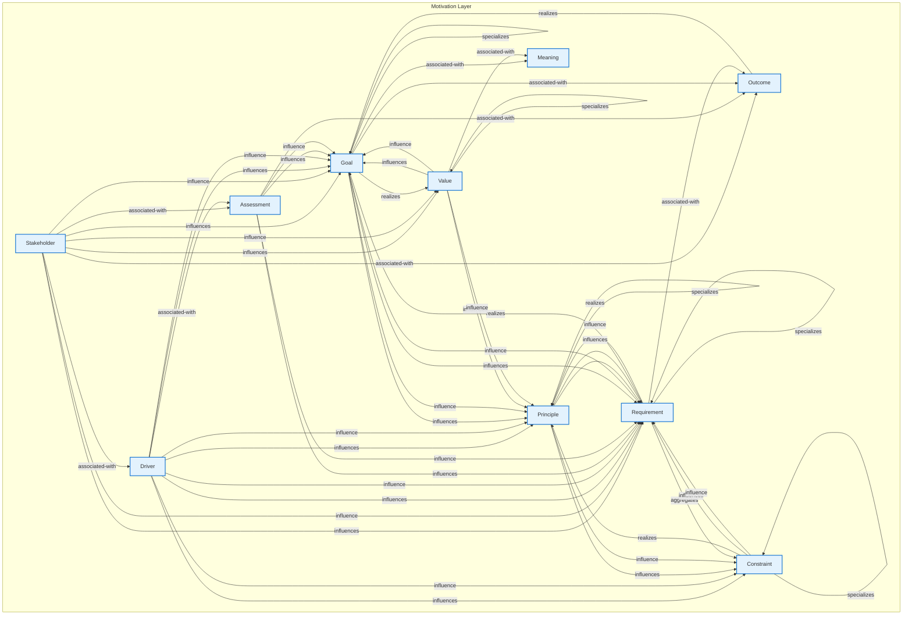

# Motivation Layer - Intra-Layer Relationships

## Overview

**Purpose**: Define semantic links between entities WITHIN this layer, capturing
structural composition, behavioral dependencies, and influence relationships.

**Layer ID**: `01-motivation`
**Analysis Date**: Generated automatically
**Validation**: Uses MarkdownLayerParser for closed-loop validation

---

### Relationship Diagram

## Layer Summary

### Entity Coverage (Target: 2+ relationships per entity)

- **Entities Meeting Target**: 10/10
- **Entity Coverage**: 100.0%

### Coverage Matrix

| Entity      | Outgoing | Incoming | Total   | Meets Target | Status     |
| ----------- | -------- | -------- | ------- | ------------ | ---------- |
| Assessment  | 5        | 2        | 7       | ✓            | Complete   |
| Constraint  | 5        | 7        | 12      | ✓            | Complete   |
| Driver      | 9        | 1        | 10      | ✓            | Complete   |
| Goal        | 9        | 12       | 21      | ✓            | Complete   |
| Meaning     | 0        | 2        | 2       | ✓            | Complete   |
| Outcome     | 1        | 4        | 5       | ✓            | Complete   |
| Principle   | 6        | 10       | 16      | ✓            | Complete   |
| Requirement | 6        | 14       | 20      | ✓            | Complete   |
| Stakeholder | 9        | 0        | 9       | ✓            | Complete   |
| Value       | 6        | 4        | 10      | ✓            | Complete   |
| **TOTAL**   | **-**    | **-**    | **112** | **10/10**    | **100.0%** |

### Relationship Statistics

- **Total Unique Relationships**: 56
- **Total Connections (Entity Perspective)**: 112
- **Average Connections per Entity**: 11.2
- **Entity Coverage Target**: 2+ relationships

## Entity: Assessment

**Definition**: Outcome of analysis of the state of affairs

### Outgoing Relationships (Assessment → Other Entities)

| Relationship Type | Target Entity | Predicate         | Status           | Source                                                        | In Catalog | Documented                                                  |
| ----------------- | ------------- | ----------------- | ---------------- | ------------------------------------------------------------- | ---------- | ----------------------------------------------------------- |
| influence         | Goal          | `influence`       | XML              | [XML](../../spec/layers/01-motivation-layer.md#example-model) | ✓          | ✗                                                           |
| influence         | Goal          | `influences`      | Documented + XML | [Doc](../../spec/layers/01-motivation-layer.md#relationships) | ✓          | [✓](../../spec/layers/01-motivation-layer.md#relationships) |
| association       | Outcome       | `associated-with` | Documented + XML | [Doc](../../spec/layers/01-motivation-layer.md#relationships) | ✓          | [✓](../../spec/layers/01-motivation-layer.md#relationships) |
| influence         | Requirement   | `influence`       | XML              | [XML](../../spec/layers/01-motivation-layer.md#example-model) | ✓          | ✗                                                           |
| influence         | Requirement   | `influences`      | Documented + XML | [Doc](../../spec/layers/01-motivation-layer.md#relationships) | ✓          | [✓](../../spec/layers/01-motivation-layer.md#relationships) |

### Incoming Relationships (Other Entities → Assessment)

| Relationship Type | Source Entity | Predicate         | Status           | Source                                                        | In Catalog | Documented                                                  |
| ----------------- | ------------- | ----------------- | ---------------- | ------------------------------------------------------------- | ---------- | ----------------------------------------------------------- |
| association       | Driver        | `associated-with` | Documented + XML | [Doc](../../spec/layers/01-motivation-layer.md#relationships) | ✓          | [✓](../../spec/layers/01-motivation-layer.md#relationships) |
| association       | Stakeholder   | `associated-with` | Documented + XML | [Doc](../../spec/layers/01-motivation-layer.md#relationships) | ✓          | [✓](../../spec/layers/01-motivation-layer.md#relationships) |

### Relationship Summary

- **Total Relationships**: 7
- **Outgoing**: 5
- **Incoming**: 2
- **Documented**: 5/7
- **With XML Examples**: 7/7
- **In Catalog**: 7/7

---

## Entity: Constraint

**Definition**: Restriction on the way in which a system is realized

### Outgoing Relationships (Constraint → Other Entities)

| Relationship Type | Target Entity | Predicate     | Status           | Source                                                        | In Catalog | Documented                                                  |
| ----------------- | ------------- | ------------- | ---------------- | ------------------------------------------------------------- | ---------- | ----------------------------------------------------------- |
| aggregation       | Constraint    | `aggregates`  | Documented + XML | [Doc](../../spec/layers/01-motivation-layer.md#relationships) | ✓          | [✓](../../spec/layers/01-motivation-layer.md#relationships) |
| specialization    | Constraint    | `specializes` | Documented + XML | [Doc](../../spec/layers/01-motivation-layer.md#relationships) | ✓          | [✓](../../spec/layers/01-motivation-layer.md#relationships) |
| realization       | Principle     | `realizes`    | Documented + XML | [Doc](../../spec/layers/01-motivation-layer.md#relationships) | ✓          | [✓](../../spec/layers/01-motivation-layer.md#relationships) |
| influence         | Requirement   | `influence`   | XML              | [XML](../../spec/layers/01-motivation-layer.md#example-model) | ✓          | ✗                                                           |
| influence         | Requirement   | `influences`  | Documented + XML | [Doc](../../spec/layers/01-motivation-layer.md#relationships) | ✓          | [✓](../../spec/layers/01-motivation-layer.md#relationships) |

### Incoming Relationships (Other Entities → Constraint)

| Relationship Type | Source Entity | Predicate     | Status           | Source                                                        | In Catalog | Documented                                                  |
| ----------------- | ------------- | ------------- | ---------------- | ------------------------------------------------------------- | ---------- | ----------------------------------------------------------- |
| aggregation       | Constraint    | `aggregates`  | Documented + XML | [Doc](../../spec/layers/01-motivation-layer.md#relationships) | ✓          | [✓](../../spec/layers/01-motivation-layer.md#relationships) |
| specialization    | Constraint    | `specializes` | Documented + XML | [Doc](../../spec/layers/01-motivation-layer.md#relationships) | ✓          | [✓](../../spec/layers/01-motivation-layer.md#relationships) |
| influence         | Driver        | `influence`   | XML              | [XML](../../spec/layers/01-motivation-layer.md#example-model) | ✓          | ✗                                                           |
| influence         | Driver        | `influences`  | Documented + XML | [Doc](../../spec/layers/01-motivation-layer.md#relationships) | ✓          | [✓](../../spec/layers/01-motivation-layer.md#relationships) |
| influence         | Principle     | `influence`   | XML              | [XML](../../spec/layers/01-motivation-layer.md#example-model) | ✓          | ✗                                                           |
| influence         | Principle     | `influences`  | Documented + XML | [Doc](../../spec/layers/01-motivation-layer.md#relationships) | ✓          | [✓](../../spec/layers/01-motivation-layer.md#relationships) |
| aggregation       | Requirement   | `aggregates`  | XML              | [XML](../../spec/layers/01-motivation-layer.md#example-model) | ✓          | ✗                                                           |

### Relationship Summary

- **Total Relationships**: 12
- **Outgoing**: 5
- **Incoming**: 7
- **Documented**: 8/12
- **With XML Examples**: 12/12
- **In Catalog**: 12/12

---

## Entity: Driver

**Definition**: External or internal condition that motivates an organization

### Outgoing Relationships (Driver → Other Entities)

| Relationship Type | Target Entity | Predicate         | Status           | Source                                                        | In Catalog | Documented                                                  |
| ----------------- | ------------- | ----------------- | ---------------- | ------------------------------------------------------------- | ---------- | ----------------------------------------------------------- |
| association       | Assessment    | `associated-with` | Documented + XML | [Doc](../../spec/layers/01-motivation-layer.md#relationships) | ✓          | [✓](../../spec/layers/01-motivation-layer.md#relationships) |
| influence         | Constraint    | `influence`       | XML              | [XML](../../spec/layers/01-motivation-layer.md#example-model) | ✓          | ✗                                                           |
| influence         | Constraint    | `influences`      | Documented + XML | [Doc](../../spec/layers/01-motivation-layer.md#relationships) | ✓          | [✓](../../spec/layers/01-motivation-layer.md#relationships) |
| influence         | Goal          | `influence`       | XML              | [XML](../../spec/layers/01-motivation-layer.md#example-model) | ✓          | ✗                                                           |
| influence         | Goal          | `influences`      | Documented + XML | [Doc](../../spec/layers/01-motivation-layer.md#relationships) | ✓          | [✓](../../spec/layers/01-motivation-layer.md#relationships) |
| influence         | Principle     | `influence`       | XML              | [XML](../../spec/layers/01-motivation-layer.md#example-model) | ✓          | ✗                                                           |
| influence         | Principle     | `influences`      | Documented + XML | [Doc](../../spec/layers/01-motivation-layer.md#relationships) | ✓          | [✓](../../spec/layers/01-motivation-layer.md#relationships) |
| influence         | Requirement   | `influence`       | XML              | [XML](../../spec/layers/01-motivation-layer.md#example-model) | ✓          | ✗                                                           |
| influence         | Requirement   | `influences`      | Documented + XML | [Doc](../../spec/layers/01-motivation-layer.md#relationships) | ✓          | [✓](../../spec/layers/01-motivation-layer.md#relationships) |

### Incoming Relationships (Other Entities → Driver)

| Relationship Type | Source Entity | Predicate         | Status           | Source                                                        | In Catalog | Documented                                                  |
| ----------------- | ------------- | ----------------- | ---------------- | ------------------------------------------------------------- | ---------- | ----------------------------------------------------------- |
| association       | Stakeholder   | `associated-with` | Documented + XML | [Doc](../../spec/layers/01-motivation-layer.md#relationships) | ✓          | [✓](../../spec/layers/01-motivation-layer.md#relationships) |

### Relationship Summary

- **Total Relationships**: 10
- **Outgoing**: 9
- **Incoming**: 1
- **Documented**: 6/10
- **With XML Examples**: 10/10
- **In Catalog**: 10/10

---

## Entity: Goal

**Definition**: High-level statement of intent, direction, or desired end state

### Outgoing Relationships (Goal → Other Entities)

| Relationship Type | Target Entity | Predicate         | Status           | Source                                                        | In Catalog | Documented                                                  |
| ----------------- | ------------- | ----------------- | ---------------- | ------------------------------------------------------------- | ---------- | ----------------------------------------------------------- |
| aggregation       | Goal          | `aggregates`      | Documented + XML | [Doc](../../spec/layers/01-motivation-layer.md#relationships) | ✓          | [✓](../../spec/layers/01-motivation-layer.md#relationships) |
| specialization    | Goal          | `specializes`     | Documented + XML | [Doc](../../spec/layers/01-motivation-layer.md#relationships) | ✓          | [✓](../../spec/layers/01-motivation-layer.md#relationships) |
| association       | Meaning       | `associated-with` | Documented + XML | [Doc](../../spec/layers/01-motivation-layer.md#relationships) | ✓          | [✓](../../spec/layers/01-motivation-layer.md#relationships) |
| association       | Outcome       | `associated-with` | Documented + XML | [Doc](../../spec/layers/01-motivation-layer.md#relationships) | ✓          | [✓](../../spec/layers/01-motivation-layer.md#relationships) |
| influence         | Principle     | `influence`       | XML              | [XML](../../spec/layers/01-motivation-layer.md#example-model) | ✓          | ✗                                                           |
| influence         | Principle     | `influences`      | Documented + XML | [Doc](../../spec/layers/01-motivation-layer.md#relationships) | ✓          | [✓](../../spec/layers/01-motivation-layer.md#relationships) |
| influence         | Requirement   | `influence`       | XML              | [XML](../../spec/layers/01-motivation-layer.md#example-model) | ✓          | ✗                                                           |
| influence         | Requirement   | `influences`      | Documented + XML | [Doc](../../spec/layers/01-motivation-layer.md#relationships) | ✓          | [✓](../../spec/layers/01-motivation-layer.md#relationships) |
| realization       | Value         | `realizes`        | Documented + XML | [Doc](../../spec/layers/01-motivation-layer.md#relationships) | ✓          | [✓](../../spec/layers/01-motivation-layer.md#relationships) |

### Incoming Relationships (Other Entities → Goal)

| Relationship Type | Source Entity | Predicate     | Status           | Source                                                        | In Catalog | Documented                                                  |
| ----------------- | ------------- | ------------- | ---------------- | ------------------------------------------------------------- | ---------- | ----------------------------------------------------------- |
| influence         | Assessment    | `influence`   | XML              | [XML](../../spec/layers/01-motivation-layer.md#example-model) | ✓          | ✗                                                           |
| influence         | Assessment    | `influences`  | Documented + XML | [Doc](../../spec/layers/01-motivation-layer.md#relationships) | ✓          | [✓](../../spec/layers/01-motivation-layer.md#relationships) |
| influence         | Driver        | `influence`   | XML              | [XML](../../spec/layers/01-motivation-layer.md#example-model) | ✓          | ✗                                                           |
| influence         | Driver        | `influences`  | Documented + XML | [Doc](../../spec/layers/01-motivation-layer.md#relationships) | ✓          | [✓](../../spec/layers/01-motivation-layer.md#relationships) |
| aggregation       | Goal          | `aggregates`  | Documented + XML | [Doc](../../spec/layers/01-motivation-layer.md#relationships) | ✓          | [✓](../../spec/layers/01-motivation-layer.md#relationships) |
| specialization    | Goal          | `specializes` | Documented + XML | [Doc](../../spec/layers/01-motivation-layer.md#relationships) | ✓          | [✓](../../spec/layers/01-motivation-layer.md#relationships) |
| realization       | Outcome       | `realizes`    | Documented + XML | [Doc](../../spec/layers/01-motivation-layer.md#relationships) | ✓          | [✓](../../spec/layers/01-motivation-layer.md#relationships) |
| realization       | Requirement   | `realizes`    | Documented + XML | [Doc](../../spec/layers/01-motivation-layer.md#relationships) | ✓          | [✓](../../spec/layers/01-motivation-layer.md#relationships) |
| influence         | Stakeholder   | `influence`   | XML              | [XML](../../spec/layers/01-motivation-layer.md#example-model) | ✓          | ✗                                                           |
| influence         | Stakeholder   | `influences`  | Documented + XML | [Doc](../../spec/layers/01-motivation-layer.md#relationships) | ✓          | [✓](../../spec/layers/01-motivation-layer.md#relationships) |
| influence         | Value         | `influence`   | XML              | [XML](../../spec/layers/01-motivation-layer.md#example-model) | ✓          | ✗                                                           |
| influence         | Value         | `influences`  | Documented + XML | [Doc](../../spec/layers/01-motivation-layer.md#relationships) | ✓          | [✓](../../spec/layers/01-motivation-layer.md#relationships) |

### Relationship Summary

- **Total Relationships**: 21
- **Outgoing**: 9
- **Incoming**: 12
- **Documented**: 15/21
- **With XML Examples**: 21/21
- **In Catalog**: 21/21

---

## Entity: Meaning

**Definition**: Knowledge or expertise present in a representation

### Outgoing Relationships (Meaning → Other Entities)

_No outgoing intra-layer relationships documented._

### Incoming Relationships (Other Entities → Meaning)

| Relationship Type | Source Entity | Predicate         | Status           | Source                                                        | In Catalog | Documented                                                  |
| ----------------- | ------------- | ----------------- | ---------------- | ------------------------------------------------------------- | ---------- | ----------------------------------------------------------- |
| association       | Goal          | `associated-with` | Documented + XML | [Doc](../../spec/layers/01-motivation-layer.md#relationships) | ✓          | [✓](../../spec/layers/01-motivation-layer.md#relationships) |
| association       | Value         | `associated-with` | Documented + XML | [Doc](../../spec/layers/01-motivation-layer.md#relationships) | ✓          | [✓](../../spec/layers/01-motivation-layer.md#relationships) |

### Relationship Summary

- **Total Relationships**: 2
- **Outgoing**: 0
- **Incoming**: 2
- **Documented**: 2/2
- **With XML Examples**: 2/2
- **In Catalog**: 2/2

---

## Entity: Outcome

**Definition**: End result that has been achieved

### Outgoing Relationships (Outcome → Other Entities)

| Relationship Type | Target Entity | Predicate  | Status           | Source                                                        | In Catalog | Documented                                                  |
| ----------------- | ------------- | ---------- | ---------------- | ------------------------------------------------------------- | ---------- | ----------------------------------------------------------- |
| realization       | Goal          | `realizes` | Documented + XML | [Doc](../../spec/layers/01-motivation-layer.md#relationships) | ✓          | [✓](../../spec/layers/01-motivation-layer.md#relationships) |

### Incoming Relationships (Other Entities → Outcome)

| Relationship Type | Source Entity | Predicate         | Status           | Source                                                        | In Catalog | Documented                                                  |
| ----------------- | ------------- | ----------------- | ---------------- | ------------------------------------------------------------- | ---------- | ----------------------------------------------------------- |
| association       | Assessment    | `associated-with` | Documented + XML | [Doc](../../spec/layers/01-motivation-layer.md#relationships) | ✓          | [✓](../../spec/layers/01-motivation-layer.md#relationships) |
| association       | Goal          | `associated-with` | Documented + XML | [Doc](../../spec/layers/01-motivation-layer.md#relationships) | ✓          | [✓](../../spec/layers/01-motivation-layer.md#relationships) |
| association       | Requirement   | `associated-with` | Documented + XML | [Doc](../../spec/layers/01-motivation-layer.md#relationships) | ✓          | [✓](../../spec/layers/01-motivation-layer.md#relationships) |
| association       | Stakeholder   | `associated-with` | Documented + XML | [Doc](../../spec/layers/01-motivation-layer.md#relationships) | ✓          | [✓](../../spec/layers/01-motivation-layer.md#relationships) |

### Relationship Summary

- **Total Relationships**: 5
- **Outgoing**: 1
- **Incoming**: 4
- **Documented**: 5/5
- **With XML Examples**: 5/5
- **In Catalog**: 5/5

---

## Entity: Principle

**Definition**: Normative property of all systems in a given context

### Outgoing Relationships (Principle → Other Entities)

| Relationship Type | Target Entity | Predicate     | Status           | Source                                                        | In Catalog | Documented                                                  |
| ----------------- | ------------- | ------------- | ---------------- | ------------------------------------------------------------- | ---------- | ----------------------------------------------------------- |
| influence         | Constraint    | `influence`   | XML              | [XML](../../spec/layers/01-motivation-layer.md#example-model) | ✓          | ✗                                                           |
| influence         | Constraint    | `influences`  | Documented + XML | [Doc](../../spec/layers/01-motivation-layer.md#relationships) | ✓          | [✓](../../spec/layers/01-motivation-layer.md#relationships) |
| aggregation       | Principle     | `aggregates`  | Documented + XML | [Doc](../../spec/layers/01-motivation-layer.md#relationships) | ✓          | [✓](../../spec/layers/01-motivation-layer.md#relationships) |
| specialization    | Principle     | `specializes` | Documented + XML | [Doc](../../spec/layers/01-motivation-layer.md#relationships) | ✓          | [✓](../../spec/layers/01-motivation-layer.md#relationships) |
| influence         | Requirement   | `influence`   | XML              | [XML](../../spec/layers/01-motivation-layer.md#example-model) | ✓          | ✗                                                           |
| influence         | Requirement   | `influences`  | Documented + XML | [Doc](../../spec/layers/01-motivation-layer.md#relationships) | ✓          | [✓](../../spec/layers/01-motivation-layer.md#relationships) |

### Incoming Relationships (Other Entities → Principle)

| Relationship Type | Source Entity | Predicate     | Status           | Source                                                        | In Catalog | Documented                                                  |
| ----------------- | ------------- | ------------- | ---------------- | ------------------------------------------------------------- | ---------- | ----------------------------------------------------------- |
| realization       | Constraint    | `realizes`    | Documented + XML | [Doc](../../spec/layers/01-motivation-layer.md#relationships) | ✓          | [✓](../../spec/layers/01-motivation-layer.md#relationships) |
| influence         | Driver        | `influence`   | XML              | [XML](../../spec/layers/01-motivation-layer.md#example-model) | ✓          | ✗                                                           |
| influence         | Driver        | `influences`  | Documented + XML | [Doc](../../spec/layers/01-motivation-layer.md#relationships) | ✓          | [✓](../../spec/layers/01-motivation-layer.md#relationships) |
| influence         | Goal          | `influence`   | XML              | [XML](../../spec/layers/01-motivation-layer.md#example-model) | ✓          | ✗                                                           |
| influence         | Goal          | `influences`  | Documented + XML | [Doc](../../spec/layers/01-motivation-layer.md#relationships) | ✓          | [✓](../../spec/layers/01-motivation-layer.md#relationships) |
| aggregation       | Principle     | `aggregates`  | Documented + XML | [Doc](../../spec/layers/01-motivation-layer.md#relationships) | ✓          | [✓](../../spec/layers/01-motivation-layer.md#relationships) |
| specialization    | Principle     | `specializes` | Documented + XML | [Doc](../../spec/layers/01-motivation-layer.md#relationships) | ✓          | [✓](../../spec/layers/01-motivation-layer.md#relationships) |
| realization       | Requirement   | `realizes`    | Documented + XML | [Doc](../../spec/layers/01-motivation-layer.md#relationships) | ✓          | [✓](../../spec/layers/01-motivation-layer.md#relationships) |
| influence         | Value         | `influence`   | XML              | [XML](../../spec/layers/01-motivation-layer.md#example-model) | ✓          | ✗                                                           |
| influence         | Value         | `influences`  | Documented + XML | [Doc](../../spec/layers/01-motivation-layer.md#relationships) | ✓          | [✓](../../spec/layers/01-motivation-layer.md#relationships) |

### Relationship Summary

- **Total Relationships**: 16
- **Outgoing**: 6
- **Incoming**: 10
- **Documented**: 11/16
- **With XML Examples**: 16/16
- **In Catalog**: 16/16

---

## Entity: Requirement

**Definition**: Statement of need that must be realized

### Outgoing Relationships (Requirement → Other Entities)

| Relationship Type | Target Entity | Predicate         | Status           | Source                                                        | In Catalog | Documented                                                  |
| ----------------- | ------------- | ----------------- | ---------------- | ------------------------------------------------------------- | ---------- | ----------------------------------------------------------- |
| aggregation       | Constraint    | `aggregates`      | XML              | [XML](../../spec/layers/01-motivation-layer.md#example-model) | ✓          | ✗                                                           |
| realization       | Goal          | `realizes`        | Documented + XML | [Doc](../../spec/layers/01-motivation-layer.md#relationships) | ✓          | [✓](../../spec/layers/01-motivation-layer.md#relationships) |
| association       | Outcome       | `associated-with` | Documented + XML | [Doc](../../spec/layers/01-motivation-layer.md#relationships) | ✓          | [✓](../../spec/layers/01-motivation-layer.md#relationships) |
| realization       | Principle     | `realizes`        | Documented + XML | [Doc](../../spec/layers/01-motivation-layer.md#relationships) | ✓          | [✓](../../spec/layers/01-motivation-layer.md#relationships) |
| aggregation       | Requirement   | `aggregates`      | Documented + XML | [Doc](../../spec/layers/01-motivation-layer.md#relationships) | ✓          | [✓](../../spec/layers/01-motivation-layer.md#relationships) |
| specialization    | Requirement   | `specializes`     | Documented + XML | [Doc](../../spec/layers/01-motivation-layer.md#relationships) | ✓          | [✓](../../spec/layers/01-motivation-layer.md#relationships) |

### Incoming Relationships (Other Entities → Requirement)

| Relationship Type | Source Entity | Predicate     | Status           | Source                                                        | In Catalog | Documented                                                  |
| ----------------- | ------------- | ------------- | ---------------- | ------------------------------------------------------------- | ---------- | ----------------------------------------------------------- |
| influence         | Assessment    | `influence`   | XML              | [XML](../../spec/layers/01-motivation-layer.md#example-model) | ✓          | ✗                                                           |
| influence         | Assessment    | `influences`  | Documented + XML | [Doc](../../spec/layers/01-motivation-layer.md#relationships) | ✓          | [✓](../../spec/layers/01-motivation-layer.md#relationships) |
| influence         | Constraint    | `influence`   | XML              | [XML](../../spec/layers/01-motivation-layer.md#example-model) | ✓          | ✗                                                           |
| influence         | Constraint    | `influences`  | Documented + XML | [Doc](../../spec/layers/01-motivation-layer.md#relationships) | ✓          | [✓](../../spec/layers/01-motivation-layer.md#relationships) |
| influence         | Driver        | `influence`   | XML              | [XML](../../spec/layers/01-motivation-layer.md#example-model) | ✓          | ✗                                                           |
| influence         | Driver        | `influences`  | Documented + XML | [Doc](../../spec/layers/01-motivation-layer.md#relationships) | ✓          | [✓](../../spec/layers/01-motivation-layer.md#relationships) |
| influence         | Goal          | `influence`   | XML              | [XML](../../spec/layers/01-motivation-layer.md#example-model) | ✓          | ✗                                                           |
| influence         | Goal          | `influences`  | Documented + XML | [Doc](../../spec/layers/01-motivation-layer.md#relationships) | ✓          | [✓](../../spec/layers/01-motivation-layer.md#relationships) |
| influence         | Principle     | `influence`   | XML              | [XML](../../spec/layers/01-motivation-layer.md#example-model) | ✓          | ✗                                                           |
| influence         | Principle     | `influences`  | Documented + XML | [Doc](../../spec/layers/01-motivation-layer.md#relationships) | ✓          | [✓](../../spec/layers/01-motivation-layer.md#relationships) |
| aggregation       | Requirement   | `aggregates`  | Documented + XML | [Doc](../../spec/layers/01-motivation-layer.md#relationships) | ✓          | [✓](../../spec/layers/01-motivation-layer.md#relationships) |
| specialization    | Requirement   | `specializes` | Documented + XML | [Doc](../../spec/layers/01-motivation-layer.md#relationships) | ✓          | [✓](../../spec/layers/01-motivation-layer.md#relationships) |
| influence         | Stakeholder   | `influence`   | XML              | [XML](../../spec/layers/01-motivation-layer.md#example-model) | ✓          | ✗                                                           |
| influence         | Stakeholder   | `influences`  | Documented + XML | [Doc](../../spec/layers/01-motivation-layer.md#relationships) | ✓          | [✓](../../spec/layers/01-motivation-layer.md#relationships) |

### Relationship Summary

- **Total Relationships**: 20
- **Outgoing**: 6
- **Incoming**: 14
- **Documented**: 13/20
- **With XML Examples**: 20/20
- **In Catalog**: 20/20

---

## Entity: Stakeholder

**Definition**: Individual, team, or organization with interest in the outcome

### Outgoing Relationships (Stakeholder → Other Entities)

| Relationship Type | Target Entity | Predicate         | Status           | Source                                                        | In Catalog | Documented                                                  |
| ----------------- | ------------- | ----------------- | ---------------- | ------------------------------------------------------------- | ---------- | ----------------------------------------------------------- |
| association       | Assessment    | `associated-with` | Documented + XML | [Doc](../../spec/layers/01-motivation-layer.md#relationships) | ✓          | [✓](../../spec/layers/01-motivation-layer.md#relationships) |
| association       | Driver        | `associated-with` | Documented + XML | [Doc](../../spec/layers/01-motivation-layer.md#relationships) | ✓          | [✓](../../spec/layers/01-motivation-layer.md#relationships) |
| influence         | Goal          | `influence`       | XML              | [XML](../../spec/layers/01-motivation-layer.md#example-model) | ✓          | ✗                                                           |
| influence         | Goal          | `influences`      | Documented + XML | [Doc](../../spec/layers/01-motivation-layer.md#relationships) | ✓          | [✓](../../spec/layers/01-motivation-layer.md#relationships) |
| association       | Outcome       | `associated-with` | Documented + XML | [Doc](../../spec/layers/01-motivation-layer.md#relationships) | ✓          | [✓](../../spec/layers/01-motivation-layer.md#relationships) |
| influence         | Requirement   | `influence`       | XML              | [XML](../../spec/layers/01-motivation-layer.md#example-model) | ✓          | ✗                                                           |
| influence         | Requirement   | `influences`      | Documented + XML | [Doc](../../spec/layers/01-motivation-layer.md#relationships) | ✓          | [✓](../../spec/layers/01-motivation-layer.md#relationships) |
| influence         | Value         | `influence`       | XML              | [XML](../../spec/layers/01-motivation-layer.md#example-model) | ✓          | ✗                                                           |
| influence         | Value         | `influences`      | Documented + XML | [Doc](../../spec/layers/01-motivation-layer.md#relationships) | ✓          | [✓](../../spec/layers/01-motivation-layer.md#relationships) |

### Incoming Relationships (Other Entities → Stakeholder)

_No incoming intra-layer relationships documented._

### Relationship Summary

- **Total Relationships**: 9
- **Outgoing**: 9
- **Incoming**: 0
- **Documented**: 6/9
- **With XML Examples**: 9/9
- **In Catalog**: 9/9

---

## Entity: Value

**Definition**: Relative worth, utility, or importance of something

### Outgoing Relationships (Value → Other Entities)

| Relationship Type | Target Entity | Predicate         | Status           | Source                                                        | In Catalog | Documented                                                  |
| ----------------- | ------------- | ----------------- | ---------------- | ------------------------------------------------------------- | ---------- | ----------------------------------------------------------- |
| influence         | Goal          | `influence`       | XML              | [XML](../../spec/layers/01-motivation-layer.md#example-model) | ✓          | ✗                                                           |
| influence         | Goal          | `influences`      | Documented + XML | [Doc](../../spec/layers/01-motivation-layer.md#relationships) | ✓          | [✓](../../spec/layers/01-motivation-layer.md#relationships) |
| association       | Meaning       | `associated-with` | Documented + XML | [Doc](../../spec/layers/01-motivation-layer.md#relationships) | ✓          | [✓](../../spec/layers/01-motivation-layer.md#relationships) |
| influence         | Principle     | `influence`       | XML              | [XML](../../spec/layers/01-motivation-layer.md#example-model) | ✓          | ✗                                                           |
| influence         | Principle     | `influences`      | Documented + XML | [Doc](../../spec/layers/01-motivation-layer.md#relationships) | ✓          | [✓](../../spec/layers/01-motivation-layer.md#relationships) |
| specialization    | Value         | `specializes`     | Documented + XML | [Doc](../../spec/layers/01-motivation-layer.md#relationships) | ✓          | [✓](../../spec/layers/01-motivation-layer.md#relationships) |

### Incoming Relationships (Other Entities → Value)

| Relationship Type | Source Entity | Predicate     | Status           | Source                                                        | In Catalog | Documented                                                  |
| ----------------- | ------------- | ------------- | ---------------- | ------------------------------------------------------------- | ---------- | ----------------------------------------------------------- |
| realization       | Goal          | `realizes`    | Documented + XML | [Doc](../../spec/layers/01-motivation-layer.md#relationships) | ✓          | [✓](../../spec/layers/01-motivation-layer.md#relationships) |
| influence         | Stakeholder   | `influence`   | XML              | [XML](../../spec/layers/01-motivation-layer.md#example-model) | ✓          | ✗                                                           |
| influence         | Stakeholder   | `influences`  | Documented + XML | [Doc](../../spec/layers/01-motivation-layer.md#relationships) | ✓          | [✓](../../spec/layers/01-motivation-layer.md#relationships) |
| specialization    | Value         | `specializes` | Documented + XML | [Doc](../../spec/layers/01-motivation-layer.md#relationships) | ✓          | [✓](../../spec/layers/01-motivation-layer.md#relationships) |

### Relationship Summary

- **Total Relationships**: 10
- **Outgoing**: 6
- **Incoming**: 4
- **Documented**: 7/10
- **With XML Examples**: 10/10
- **In Catalog**: 10/10

---
