# Business Layer - Cross-Layer Relationships

## Cross-Layer Relationships

**Purpose**: Define semantic links to entities in other layers, supporting traceability, governance, and architectural alignment.

### Cross-Layer Relationship Diagram

```mermaid
graph TB
  subgraph thisLayer["02: Business Layer"]
    thisBusinessInterface["BusinessInterface"]
    thisBusinessMetric["BusinessMetric"]
    thisBusinessObject["BusinessObject"]
    thisBusinessService["BusinessService"]
  end

  %% Target layers
  subgraph target01Layer["01: Motivation Layer"]
    target01Value["Value"]
    target01Principle["Principle"]
    target01Goal["Goal"]
  end
  subgraph target02Layer["02: Business Layer"]
    target02BusinessMetric["BusinessMetric"]
  end
  subgraph target03Layer["03: Security Layer"]
    target03Classification["Classification"]
    target03SecurityControl["SecurityControl"]
    target03SeparationOfDuty["SeparationOfDuty"]
  end
  subgraph target04Layer["04: Application Layer"]
    target04MasterDataSource["MasterDataSource"]
    target04ProcessStep["ProcessStep"]
    target04RealizedByProces["RealizedByProces"]
    target04RepresentedByDataobject["RepresentedByDataobject"]
  end
  subgraph target07Layer["07: Data Model Layer"]
    target07GovernanceOwner["GovernanceOwner"]
  end

  %% Source layers
  subgraph source04Layer["04: Application Layer"]
    source04Node["Any Application Layer entity"]
  end
  subgraph source06Layer["06: API Layer"]
    source06Node["Any API Layer entity"]
  end
  subgraph source07Layer["07: Data Model Layer"]
    source07Node["Any Data Model Layer entity"]
  end

  %% Outgoing relationships
  thisBusinessInterface -->|master-data-source| target04MasterDataSource
  thisBusinessInterface -->|process-steps| target04ProcessStep
  thisBusinessInterface -->|realized-by-process| target04RealizedByProces
  thisBusinessInterface -->|represented-by-dataobject| target04RepresentedByDataobject
  thisBusinessInterface -->|business-metrics| target02BusinessMetric
  thisBusinessInterface -->|governance-owner| target07GovernanceOwner
  thisBusinessInterface -->|delivers-value| target01Value
  thisBusinessInterface -->|governed-by-principles| target01Principle
  thisBusinessInterface -->|supports-goals| target01Goal
  thisBusinessInterface -->|classification| target03Classification
  thisBusinessInterface -->|security-controls| target03SecurityControl
  thisBusinessInterface -->|separation-of-duty| target03SeparationOfDuty

  %% Incoming relationships
  source04Node -->|business-metrics| thisBusinessMetric
  source06Node -->|business-metrics| thisBusinessMetric
  source06Node -->|business-interface-ref| thisBusinessInterface
  source07Node -->|business-object-ref| thisBusinessObject
  source06Node -->|business-service-ref| thisBusinessService

  %% Styling
  classDef thisLayerStyle fill:#4ECDC4,stroke:#333,stroke-width:3px
  classDef targetLayerStyle fill:#FFD700,stroke:#333,stroke-width:2px
  classDef sourceLayerStyle fill:#E17055,stroke:#333,stroke-width:2px

  class thisBusinessInterface thisLayerStyle
  class thisBusinessMetric thisLayerStyle
  class thisBusinessObject thisLayerStyle
  class thisBusinessService thisLayerStyle
  class target01DeliversValue targetLayerStyle
  class target01GovernedByPrinciple targetLayerStyle
  class target01SupportsGoal targetLayerStyle
  class target02BusinessMetric targetLayerStyle
  class target03Classification targetLayerStyle
  class target03SecurityControl targetLayerStyle
  class target03SeparationOfDuty targetLayerStyle
  class target04MasterDataSource targetLayerStyle
  class target04ProcessStep targetLayerStyle
  class target04RealizedByProces targetLayerStyle
  class target04RepresentedByDataobject targetLayerStyle
  class target07GovernanceOwner targetLayerStyle
  class source04Node sourceLayerStyle
  class source06Node sourceLayerStyle
  class source07Node sourceLayerStyle
```



### Outgoing Relationships (This Layer → Other Layers)

Links from entities in this layer to entities in other layers.

#### To Motivation Layer (01)

Links to strategic goals, requirements, principles, and constraints.

| Predicate                | Source Element  | Target Element | Field Path                                                      | Description                            | Documented                                 |
| ------------------------ | --------------- | -------------- | --------------------------------------------------------------- | -------------------------------------- | ------------------------------------------ |
| `delivers-value`         | BusinessService | Value          | `motivation.delivers-value`                                     | BusinessService delivers Value         | [✓](../../spec/schemas/link-registry.json) |
| `governed-by-principles` | BusinessService | Principle      | `motivation.governed-by-principles`, `x-governed-by-principles` | BusinessService governed by Principles | [✓](../../spec/schemas/link-registry.json) |
| `supports-goals`         | BusinessService | Goal           | `motivation.supports-goals`, `x-supports-goals`                 | BusinessService supports Goals         | [✓](../../spec/schemas/link-registry.json) |

**Example**:

```yaml
properties:
  motivation.delivers-value:
    type: array
    items:
      type: string
    description: BusinessService delivers Value
    example: ["target-id-1", "target-id-2"]
```

#### To Business Layer (02)

Links to business services, processes, and actors.

| Predicate          | Source Element  | Target Element | Field Path                                       | Description                                             | Documented                                 |
| ------------------ | --------------- | -------------- | ------------------------------------------------ | ------------------------------------------------------- | ------------------------------------------ |
| `business-metrics` | BusinessProcess | BusinessMetric | `apm.business-metrics`, `x-apm-business-metrics` | comma-separated business metric IDs this service tracks | [✓](../../spec/schemas/link-registry.json) |

**Example**:

```yaml
properties:
  apm.business-metrics:
    type: array
    items:
      type: string
    description: comma-separated business metric IDs this service tracks
    example: ["target-id-1", "target-id-2"]
```

#### To Security Layer (03)

Links to security models, resources, and controls.

| Predicate            | Source Element  | Target Element   | Field Path                   | Description                               | Documented                                 |
| -------------------- | --------------- | ---------------- | ---------------------------- | ----------------------------------------- | ------------------------------------------ |
| `classification`     | Artifact        | Classification   | `security.classification`    | Links to Classification in target layer   | [✓](../../spec/schemas/link-registry.json) |
| `security-controls`  | BusinessProcess | SecurityControl  | `process.security-controls`  | security control references               | [✓](../../spec/schemas/link-registry.json) |
| `separation-of-duty` | BusinessProcess | SeparationOfDuty | `process.separation-of-duty` | Links to SeparationOfDuty in target layer | [✓](../../spec/schemas/link-registry.json) |

**Example**:

```yaml
properties:
  security.classification:
    type: string
    description: Links to Classification in target layer
    example: "target-id-1"
```

#### To Application Layer (04)

Links to application layer elements.

| Predicate                   | Source Element  | Target Element          | Field Path                              | Description                                                              | Documented |
| --------------------------- | --------------- | ----------------------- | --------------------------------------- | ------------------------------------------------------------------------ | ---------- |
| `master-data-source`        | BusinessObject  | MasterDataSource        | `application.master-data-source`        | BusinessObject master data source from DataObject                        | ✗          |
| `process-steps`             | BusinessProcess | ProcessStep             | `application.process-steps`             | which specific ApplicationProcess steps realize this business process    | ✗          |
| `realized-by-process`       | BusinessProcess | RealizedByProces        | `application.realized-by-process`       | ApplicationService - **BusinessProcess** automated by ApplicationProcess | ✗          |
| `represented-by-dataobject` | BusinessObject  | RepresentedByDataobject | `application.represented-by-dataobject` | BusinessObject represented in DataObject                                 | ✗          |

**Example**:

```yaml
properties:
  application.master-data-source:
    type: string
    description: BusinessObject master data source from DataObject
    example: "target-id-1"
```

#### To Data Model Layer (07)

Links to data schemas, tables, and columns.

| Predicate          | Source Element | Target Element  | Field Path              | Description                               | Documented                                 |
| ------------------ | -------------- | --------------- | ----------------------- | ----------------------------------------- | ------------------------------------------ |
| `governance-owner` | BusinessObject | GovernanceOwner | `data.governance-owner` | BusinessObject ownership by BusinessActor | [✓](../../spec/schemas/link-registry.json) |

**Example**:

```yaml
properties:
  data.governance-owner:
    type: string
    description: BusinessObject ownership by BusinessActor
    example: "target-id-1"
```

### Incoming Relationships (Other Layers → This Layer)

Links from entities in other layers to entities in this layer.

#### From Business Layer (02)

| Predicate          | Source Element  | Target Element | Field Path                                       | Description                                             | Documented                                 |
| ------------------ | --------------- | -------------- | ------------------------------------------------ | ------------------------------------------------------- | ------------------------------------------ |
| `business-metrics` | BusinessProcess | BusinessMetric | `apm.business-metrics`, `x-apm-business-metrics` | comma-separated business metric IDs this service tracks | [✓](../../spec/schemas/link-registry.json) |

#### From Application Layer (04)

| Predicate          | Source Element     | Target Element | Field Path                                       | Description                                             | Documented                                 |
| ------------------ | ------------------ | -------------- | ------------------------------------------------ | ------------------------------------------------------- | ------------------------------------------ |
| `business-metrics` | ApplicationService | BusinessMetric | `apm.business-metrics`, `x-apm-business-metrics` | comma-separated business metric IDs this service tracks | [✓](../../spec/schemas/link-registry.json) |

#### From API Layer (06)

| Predicate                | Source Element            | Target Element    | Field Path                                       | Description                                             | Documented                                 |
| ------------------------ | ------------------------- | ----------------- | ------------------------------------------------ | ------------------------------------------------------- | ------------------------------------------ |
| `business-metrics`       | Operation, SecurityScheme | BusinessMetric    | `apm.business-metrics`, `x-apm-business-metrics` | comma-separated business metric IDs this service tracks | [✓](../../spec/schemas/link-registry.json) |
| `business-interface-ref` | Operation, SecurityScheme | BusinessInterface | `x-business-interface-ref`                       | string (BusinessInterface.id, optional)                 | ✗                                          |
| `business-service-ref`   | Operation, SecurityScheme | BusinessService   | `x-business-service-ref`                         | string (BusinessService.id, optional)                   | ✗                                          |

#### From Data Model Layer (07)

| Predicate             | Source Element                                                    | Target Element | Field Path              | Description                                    | Documented |
| --------------------- | ----------------------------------------------------------------- | -------------- | ----------------------- | ---------------------------------------------- | ---------- |
| `business-object-ref` | JSONSchema, x-business-object-ref Extension, x-security Extension | BusinessObject | `x-business-object-ref` | string (BusinessObject.id reference, optional) | ✗          |
