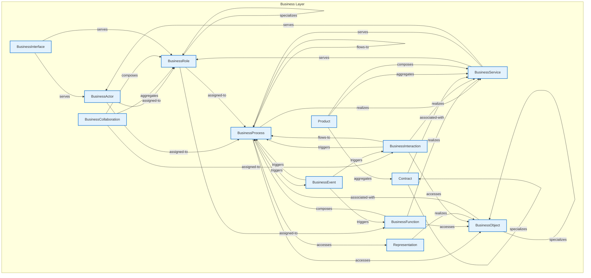

# Business Layer - Intra-Layer Relationships

## Overview

**Purpose**: Define semantic links between entities WITHIN this layer, capturing
structural composition, behavioral dependencies, and influence relationships.

**Layer ID**: `02-business`
**Analysis Date**: Generated automatically
**Validation**: Uses MarkdownLayerParser for closed-loop validation

---

### Relationship Diagram

## Layer Summary

### Entity Coverage (Target: 2+ relationships per entity)

- **Entities Meeting Target**: 13/13
- **Entity Coverage**: 100.0%

### Coverage Matrix

| Entity                | Outgoing | Incoming | Total  | Meets Target | Status     |
| --------------------- | -------- | -------- | ------ | ------------ | ---------- |
| BusinessActor         | 2        | 2        | 4      | ✓            | Complete   |
| BusinessCollaboration | 3        | 0        | 3      | ✓            | Complete   |
| BusinessEvent         | 3        | 1        | 4      | ✓            | Complete   |
| BusinessFunction      | 3        | 2        | 5      | ✓            | Complete   |
| BusinessInteraction   | 4        | 2        | 6      | ✓            | Complete   |
| BusinessInterface     | 2        | 0        | 2      | ✓            | Complete   |
| BusinessObject        | 2        | 5        | 7      | ✓            | Complete   |
| BusinessProcess       | 6        | 10       | 16     | ✓            | Complete   |
| BusinessRole          | 3        | 6        | 9      | ✓            | Complete   |
| BusinessService       | 3        | 6        | 9      | ✓            | Complete   |
| Contract              | 2        | 2        | 4      | ✓            | Complete   |
| Product               | 3        | 0        | 3      | ✓            | Complete   |
| Representation        | 1        | 1        | 2      | ✓            | Complete   |
| **TOTAL**             | **-**    | **-**    | **74** | **13/13**    | **100.0%** |

### Relationship Statistics

- **Total Unique Relationships**: 37
- **Total Connections (Entity Perspective)**: 74
- **Average Connections per Entity**: 5.7
- **Entity Coverage Target**: 2+ relationships

## Entity: BusinessActor

**Definition**: An organizational entity capable of performing behavior

### Outgoing Relationships (BusinessActor → Other Entities)

| Relationship Type | Target Entity   | Predicate     | Status | Source                                                      | In Catalog | Documented |
| ----------------- | --------------- | ------------- | ------ | ----------------------------------------------------------- | ---------- | ---------- |
| assignment        | BusinessProcess | `assigned-to` | XML    | [XML](../../spec/layers/02-business-layer.md#example-model) | ✓          | ✗          |
| assignment        | BusinessRole    | `assigned-to` | XML    | [XML](../../spec/layers/02-business-layer.md#example-model) | ✓          | ✗          |

### Incoming Relationships (Other Entities → BusinessActor)

| Relationship Type | Source Entity     | Predicate | Status | Source                                                      | In Catalog | Documented |
| ----------------- | ----------------- | --------- | ------ | ----------------------------------------------------------- | ---------- | ---------- |
| serving           | BusinessInterface | `serves`  | XML    | [XML](../../spec/layers/02-business-layer.md#example-model) | ✓          | ✗          |
| serving           | BusinessService   | `serves`  | XML    | [XML](../../spec/layers/02-business-layer.md#example-model) | ✓          | ✗          |

### Relationship Summary

- **Total Relationships**: 4
- **Outgoing**: 2
- **Incoming**: 2
- **Documented**: 0/4
- **With XML Examples**: 4/4
- **In Catalog**: 4/4

---

## Entity: BusinessCollaboration

**Definition**: Aggregate of business roles working together

### Outgoing Relationships (BusinessCollaboration → Other Entities)

| Relationship Type | Target Entity       | Predicate     | Status     | Source                                                      | In Catalog | Documented                                                |
| ----------------- | ------------------- | ------------- | ---------- | ----------------------------------------------------------- | ---------- | --------------------------------------------------------- |
| assignment        | BusinessInteraction | `assigned-to` | XML        | [XML](../../spec/layers/02-business-layer.md#example-model) | ✓          | ✗                                                         |
| aggregation       | BusinessRole        | `aggregates`  | XML        | [XML](../../spec/layers/02-business-layer.md#example-model) | ✓          | ✗                                                         |
| composes          | BusinessRole        | `composes`    | Documented | [Doc](../../spec/layers/02-business-layer.md#relationships) | ✓          | [✓](../../spec/layers/02-business-layer.md#relationships) |

### Incoming Relationships (Other Entities → BusinessCollaboration)

_No incoming intra-layer relationships documented._

### Relationship Summary

- **Total Relationships**: 3
- **Outgoing**: 3
- **Incoming**: 0
- **Documented**: 1/3
- **With XML Examples**: 2/3
- **In Catalog**: 3/3

---

## Entity: BusinessEvent

**Definition**: Something that happens and influences behavior

### Outgoing Relationships (BusinessEvent → Other Entities)

| Relationship Type | Target Entity       | Predicate  | Status     | Source                                                      | In Catalog | Documented                                                |
| ----------------- | ------------------- | ---------- | ---------- | ----------------------------------------------------------- | ---------- | --------------------------------------------------------- |
| triggering        | BusinessFunction    | `triggers` | XML        | [XML](../../spec/layers/02-business-layer.md#example-model) | ✓          | ✗                                                         |
| triggers          | BusinessInteraction | `triggers` | Documented | [Doc](../../spec/layers/02-business-layer.md#relationships) | ✓          | [✓](../../spec/layers/02-business-layer.md#relationships) |
| triggering        | BusinessProcess     | `triggers` | XML        | [XML](../../spec/layers/02-business-layer.md#example-model) | ✓          | ✗                                                         |

### Incoming Relationships (Other Entities → BusinessEvent)

| Relationship Type | Source Entity   | Predicate  | Status | Source                                                      | In Catalog | Documented |
| ----------------- | --------------- | ---------- | ------ | ----------------------------------------------------------- | ---------- | ---------- |
| triggering        | BusinessProcess | `triggers` | XML    | [XML](../../spec/layers/02-business-layer.md#example-model) | ✓          | ✗          |

### Relationship Summary

- **Total Relationships**: 4
- **Outgoing**: 3
- **Incoming**: 1
- **Documented**: 1/4
- **With XML Examples**: 3/4
- **In Catalog**: 4/4

---

## Entity: BusinessFunction

**Definition**: Collection of business behavior based on criteria

### Outgoing Relationships (BusinessFunction → Other Entities)

| Relationship Type | Target Entity   | Predicate  | Status | Source                                                      | In Catalog | Documented |
| ----------------- | --------------- | ---------- | ------ | ----------------------------------------------------------- | ---------- | ---------- |
| access            | BusinessObject  | `accesses` | XML    | [XML](../../spec/layers/02-business-layer.md#example-model) | ✓          | ✗          |
| composition       | BusinessProcess | `composes` | XML    | [XML](../../spec/layers/02-business-layer.md#example-model) | ✓          | ✗          |
| realization       | BusinessService | `realizes` | XML    | [XML](../../spec/layers/02-business-layer.md#example-model) | ✓          | ✗          |

### Incoming Relationships (Other Entities → BusinessFunction)

| Relationship Type | Source Entity | Predicate     | Status     | Source                                                      | In Catalog | Documented                                                |
| ----------------- | ------------- | ------------- | ---------- | ----------------------------------------------------------- | ---------- | --------------------------------------------------------- |
| triggering        | BusinessEvent | `triggers`    | XML        | [XML](../../spec/layers/02-business-layer.md#example-model) | ✓          | ✗                                                         |
| assigned to       | BusinessRole  | `assigned-to` | Documented | [Doc](../../spec/layers/02-business-layer.md#relationships) | ✓          | [✓](../../spec/layers/02-business-layer.md#relationships) |

### Relationship Summary

- **Total Relationships**: 5
- **Outgoing**: 3
- **Incoming**: 2
- **Documented**: 1/5
- **With XML Examples**: 4/5
- **In Catalog**: 5/5

---

## Entity: BusinessInteraction

**Definition**: Unit of collective behavior by collaboration

### Outgoing Relationships (BusinessInteraction → Other Entities)

| Relationship Type | Target Entity   | Predicate  | Status     | Source                                                      | In Catalog | Documented                                                |
| ----------------- | --------------- | ---------- | ---------- | ----------------------------------------------------------- | ---------- | --------------------------------------------------------- |
| access            | BusinessObject  | `accesses` | XML        | [XML](../../spec/layers/02-business-layer.md#example-model) | ✓          | ✗                                                         |
| flows to          | BusinessProcess | `flows-to` | Documented | [Doc](../../spec/layers/02-business-layer.md#relationships) | ✓          | [✓](../../spec/layers/02-business-layer.md#relationships) |
| triggers          | BusinessProcess | `triggers` | Documented | [Doc](../../spec/layers/02-business-layer.md#relationships) | ✓          | [✓](../../spec/layers/02-business-layer.md#relationships) |
| realizes          | BusinessService | `realizes` | Documented | [Doc](../../spec/layers/02-business-layer.md#relationships) | ✓          | [✓](../../spec/layers/02-business-layer.md#relationships) |

### Incoming Relationships (Other Entities → BusinessInteraction)

| Relationship Type | Source Entity         | Predicate     | Status     | Source                                                      | In Catalog | Documented                                                |
| ----------------- | --------------------- | ------------- | ---------- | ----------------------------------------------------------- | ---------- | --------------------------------------------------------- |
| assignment        | BusinessCollaboration | `assigned-to` | XML        | [XML](../../spec/layers/02-business-layer.md#example-model) | ✓          | ✗                                                         |
| triggers          | BusinessEvent         | `triggers`    | Documented | [Doc](../../spec/layers/02-business-layer.md#relationships) | ✓          | [✓](../../spec/layers/02-business-layer.md#relationships) |

### Relationship Summary

- **Total Relationships**: 6
- **Outgoing**: 4
- **Incoming**: 2
- **Documented**: 4/6
- **With XML Examples**: 2/6
- **In Catalog**: 6/6

---

## Entity: BusinessInterface

**Definition**: Point of access where business service is available

### Outgoing Relationships (BusinessInterface → Other Entities)

| Relationship Type | Target Entity | Predicate | Status | Source                                                      | In Catalog | Documented |
| ----------------- | ------------- | --------- | ------ | ----------------------------------------------------------- | ---------- | ---------- |
| serving           | BusinessActor | `serves`  | XML    | [XML](../../spec/layers/02-business-layer.md#example-model) | ✓          | ✗          |
| serving           | BusinessRole  | `serves`  | XML    | [XML](../../spec/layers/02-business-layer.md#example-model) | ✓          | ✗          |

### Incoming Relationships (Other Entities → BusinessInterface)

_No incoming intra-layer relationships documented._

### Relationship Summary

- **Total Relationships**: 2
- **Outgoing**: 2
- **Incoming**: 0
- **Documented**: 0/2
- **With XML Examples**: 2/2
- **In Catalog**: 2/2

---

## Entity: BusinessObject

**Definition**: Concept used within business domain

### Outgoing Relationships (BusinessObject → Other Entities)

| Relationship Type | Target Entity   | Predicate         | Status     | Source                                                      | In Catalog | Documented                                                |
| ----------------- | --------------- | ----------------- | ---------- | ----------------------------------------------------------- | ---------- | --------------------------------------------------------- |
| specialization    | BusinessObject  | `specializes`     | XML        | [XML](../../spec/layers/02-business-layer.md#example-model) | ✓          | ✗                                                         |
| associated with   | BusinessProcess | `associated-with` | Documented | [Doc](../../spec/layers/02-business-layer.md#relationships) | ✓          | [✓](../../spec/layers/02-business-layer.md#relationships) |

### Incoming Relationships (Other Entities → BusinessObject)

| Relationship Type | Source Entity       | Predicate     | Status | Source                                                      | In Catalog | Documented |
| ----------------- | ------------------- | ------------- | ------ | ----------------------------------------------------------- | ---------- | ---------- |
| access            | BusinessFunction    | `accesses`    | XML    | [XML](../../spec/layers/02-business-layer.md#example-model) | ✓          | ✗          |
| access            | BusinessInteraction | `accesses`    | XML    | [XML](../../spec/layers/02-business-layer.md#example-model) | ✓          | ✗          |
| specialization    | BusinessObject      | `specializes` | XML    | [XML](../../spec/layers/02-business-layer.md#example-model) | ✓          | ✗          |
| access            | BusinessProcess     | `accesses`    | XML    | [XML](../../spec/layers/02-business-layer.md#example-model) | ✓          | ✗          |
| realization       | Representation      | `realizes`    | XML    | [XML](../../spec/layers/02-business-layer.md#example-model) | ✓          | ✗          |

### Relationship Summary

- **Total Relationships**: 7
- **Outgoing**: 2
- **Incoming**: 5
- **Documented**: 1/7
- **With XML Examples**: 6/7
- **In Catalog**: 7/7

---

## Entity: BusinessProcess

**Definition**: Sequence of business behaviors achieving a result

### Outgoing Relationships (BusinessProcess → Other Entities)

| Relationship Type | Target Entity   | Predicate  | Status | Source                                                      | In Catalog | Documented |
| ----------------- | --------------- | ---------- | ------ | ----------------------------------------------------------- | ---------- | ---------- |
| triggering        | BusinessEvent   | `triggers` | XML    | [XML](../../spec/layers/02-business-layer.md#example-model) | ✓          | ✗          |
| access            | BusinessObject  | `accesses` | XML    | [XML](../../spec/layers/02-business-layer.md#example-model) | ✓          | ✗          |
| composition       | BusinessProcess | `composes` | XML    | [XML](../../spec/layers/02-business-layer.md#example-model) | ✓          | ✗          |
| flow              | BusinessProcess | `flows-to` | XML    | [XML](../../spec/layers/02-business-layer.md#example-model) | ✓          | ✗          |
| realization       | BusinessService | `realizes` | XML    | [XML](../../spec/layers/02-business-layer.md#example-model) | ✓          | ✗          |
| access            | Representation  | `accesses` | XML    | [XML](../../spec/layers/02-business-layer.md#example-model) | ✓          | ✗          |

### Incoming Relationships (Other Entities → BusinessProcess)

| Relationship Type | Source Entity       | Predicate         | Status     | Source                                                      | In Catalog | Documented                                                |
| ----------------- | ------------------- | ----------------- | ---------- | ----------------------------------------------------------- | ---------- | --------------------------------------------------------- |
| assignment        | BusinessActor       | `assigned-to`     | XML        | [XML](../../spec/layers/02-business-layer.md#example-model) | ✓          | ✗                                                         |
| triggering        | BusinessEvent       | `triggers`        | XML        | [XML](../../spec/layers/02-business-layer.md#example-model) | ✓          | ✗                                                         |
| composition       | BusinessFunction    | `composes`        | XML        | [XML](../../spec/layers/02-business-layer.md#example-model) | ✓          | ✗                                                         |
| flows to          | BusinessInteraction | `flows-to`        | Documented | [Doc](../../spec/layers/02-business-layer.md#relationships) | ✓          | [✓](../../spec/layers/02-business-layer.md#relationships) |
| triggers          | BusinessInteraction | `triggers`        | Documented | [Doc](../../spec/layers/02-business-layer.md#relationships) | ✓          | [✓](../../spec/layers/02-business-layer.md#relationships) |
| associated with   | BusinessObject      | `associated-with` | Documented | [Doc](../../spec/layers/02-business-layer.md#relationships) | ✓          | [✓](../../spec/layers/02-business-layer.md#relationships) |
| composition       | BusinessProcess     | `composes`        | XML        | [XML](../../spec/layers/02-business-layer.md#example-model) | ✓          | ✗                                                         |
| flow              | BusinessProcess     | `flows-to`        | XML        | [XML](../../spec/layers/02-business-layer.md#example-model) | ✓          | ✗                                                         |
| assignment        | BusinessRole        | `assigned-to`     | XML        | [XML](../../spec/layers/02-business-layer.md#example-model) | ✓          | ✗                                                         |
| serving           | BusinessService     | `serves`          | XML        | [XML](../../spec/layers/02-business-layer.md#example-model) | ✓          | ✗                                                         |

### Relationship Summary

- **Total Relationships**: 16
- **Outgoing**: 6
- **Incoming**: 10
- **Documented**: 3/16
- **With XML Examples**: 13/16
- **In Catalog**: 16/16

---

## Entity: BusinessRole

**Definition**: The responsibility for performing specific behavior

### Outgoing Relationships (BusinessRole → Other Entities)

| Relationship Type | Target Entity    | Predicate     | Status     | Source                                                      | In Catalog | Documented                                                |
| ----------------- | ---------------- | ------------- | ---------- | ----------------------------------------------------------- | ---------- | --------------------------------------------------------- |
| assigned to       | BusinessFunction | `assigned-to` | Documented | [Doc](../../spec/layers/02-business-layer.md#relationships) | ✓          | [✓](../../spec/layers/02-business-layer.md#relationships) |
| assignment        | BusinessProcess  | `assigned-to` | XML        | [XML](../../spec/layers/02-business-layer.md#example-model) | ✓          | ✗                                                         |
| specializes       | BusinessRole     | `specializes` | Documented | [Doc](../../spec/layers/02-business-layer.md#relationships) | ✓          | [✓](../../spec/layers/02-business-layer.md#relationships) |

### Incoming Relationships (Other Entities → BusinessRole)

| Relationship Type | Source Entity         | Predicate     | Status     | Source                                                      | In Catalog | Documented                                                |
| ----------------- | --------------------- | ------------- | ---------- | ----------------------------------------------------------- | ---------- | --------------------------------------------------------- |
| assignment        | BusinessActor         | `assigned-to` | XML        | [XML](../../spec/layers/02-business-layer.md#example-model) | ✓          | ✗                                                         |
| aggregation       | BusinessCollaboration | `aggregates`  | XML        | [XML](../../spec/layers/02-business-layer.md#example-model) | ✓          | ✗                                                         |
| composes          | BusinessCollaboration | `composes`    | Documented | [Doc](../../spec/layers/02-business-layer.md#relationships) | ✓          | [✓](../../spec/layers/02-business-layer.md#relationships) |
| serving           | BusinessInterface     | `serves`      | XML        | [XML](../../spec/layers/02-business-layer.md#example-model) | ✓          | ✗                                                         |
| specializes       | BusinessRole          | `specializes` | Documented | [Doc](../../spec/layers/02-business-layer.md#relationships) | ✓          | [✓](../../spec/layers/02-business-layer.md#relationships) |
| serving           | BusinessService       | `serves`      | XML        | [XML](../../spec/layers/02-business-layer.md#example-model) | ✓          | ✗                                                         |

### Relationship Summary

- **Total Relationships**: 9
- **Outgoing**: 3
- **Incoming**: 6
- **Documented**: 4/9
- **With XML Examples**: 5/9
- **In Catalog**: 9/9

---

## Entity: BusinessService

**Definition**: Service that fulfills a business need

### Outgoing Relationships (BusinessService → Other Entities)

| Relationship Type | Target Entity   | Predicate | Status | Source                                                      | In Catalog | Documented |
| ----------------- | --------------- | --------- | ------ | ----------------------------------------------------------- | ---------- | ---------- |
| serving           | BusinessActor   | `serves`  | XML    | [XML](../../spec/layers/02-business-layer.md#example-model) | ✓          | ✗          |
| serving           | BusinessProcess | `serves`  | XML    | [XML](../../spec/layers/02-business-layer.md#example-model) | ✓          | ✗          |
| serving           | BusinessRole    | `serves`  | XML    | [XML](../../spec/layers/02-business-layer.md#example-model) | ✓          | ✗          |

### Incoming Relationships (Other Entities → BusinessService)

| Relationship Type | Source Entity       | Predicate         | Status     | Source                                                      | In Catalog | Documented                                                |
| ----------------- | ------------------- | ----------------- | ---------- | ----------------------------------------------------------- | ---------- | --------------------------------------------------------- |
| realization       | BusinessFunction    | `realizes`        | XML        | [XML](../../spec/layers/02-business-layer.md#example-model) | ✓          | ✗                                                         |
| realizes          | BusinessInteraction | `realizes`        | Documented | [Doc](../../spec/layers/02-business-layer.md#relationships) | ✓          | [✓](../../spec/layers/02-business-layer.md#relationships) |
| realization       | BusinessProcess     | `realizes`        | XML        | [XML](../../spec/layers/02-business-layer.md#example-model) | ✓          | ✗                                                         |
| association       | Contract            | `associated-with` | XML        | [XML](../../spec/layers/02-business-layer.md#example-model) | ✓          | ✗                                                         |
| aggregation       | Product             | `aggregates`      | XML        | [XML](../../spec/layers/02-business-layer.md#example-model) | ✓          | ✗                                                         |
| composes          | Product             | `composes`        | Documented | [Doc](../../spec/layers/02-business-layer.md#relationships) | ✓          | [✓](../../spec/layers/02-business-layer.md#relationships) |

### Relationship Summary

- **Total Relationships**: 9
- **Outgoing**: 3
- **Incoming**: 6
- **Documented**: 2/9
- **With XML Examples**: 7/9
- **In Catalog**: 9/9

---

## Entity: Contract

**Definition**: Formal specification of agreement

### Outgoing Relationships (Contract → Other Entities)

| Relationship Type | Target Entity   | Predicate         | Status | Source                                                      | In Catalog | Documented |
| ----------------- | --------------- | ----------------- | ------ | ----------------------------------------------------------- | ---------- | ---------- |
| association       | BusinessService | `associated-with` | XML    | [XML](../../spec/layers/02-business-layer.md#example-model) | ✓          | ✗          |
| specialization    | Contract        | `specializes`     | XML    | [XML](../../spec/layers/02-business-layer.md#example-model) | ✓          | ✗          |

### Incoming Relationships (Other Entities → Contract)

| Relationship Type | Source Entity | Predicate     | Status | Source                                                      | In Catalog | Documented |
| ----------------- | ------------- | ------------- | ------ | ----------------------------------------------------------- | ---------- | ---------- |
| specialization    | Contract      | `specializes` | XML    | [XML](../../spec/layers/02-business-layer.md#example-model) | ✓          | ✗          |
| aggregation       | Product       | `aggregates`  | XML    | [XML](../../spec/layers/02-business-layer.md#example-model) | ✓          | ✗          |

### Relationship Summary

- **Total Relationships**: 4
- **Outgoing**: 2
- **Incoming**: 2
- **Documented**: 0/4
- **With XML Examples**: 4/4
- **In Catalog**: 4/4

---

## Entity: Product

**Definition**: Coherent collection of services with a value

### Outgoing Relationships (Product → Other Entities)

| Relationship Type | Target Entity   | Predicate    | Status     | Source                                                      | In Catalog | Documented                                                |
| ----------------- | --------------- | ------------ | ---------- | ----------------------------------------------------------- | ---------- | --------------------------------------------------------- |
| aggregation       | BusinessService | `aggregates` | XML        | [XML](../../spec/layers/02-business-layer.md#example-model) | ✓          | ✗                                                         |
| composes          | BusinessService | `composes`   | Documented | [Doc](../../spec/layers/02-business-layer.md#relationships) | ✓          | [✓](../../spec/layers/02-business-layer.md#relationships) |
| aggregation       | Contract        | `aggregates` | XML        | [XML](../../spec/layers/02-business-layer.md#example-model) | ✓          | ✗                                                         |

### Incoming Relationships (Other Entities → Product)

_No incoming intra-layer relationships documented._

### Relationship Summary

- **Total Relationships**: 3
- **Outgoing**: 3
- **Incoming**: 0
- **Documented**: 1/3
- **With XML Examples**: 2/3
- **In Catalog**: 3/3

---

## Entity: Representation

**Definition**: Perceptible form of business object

### Outgoing Relationships (Representation → Other Entities)

| Relationship Type | Target Entity  | Predicate  | Status | Source                                                      | In Catalog | Documented |
| ----------------- | -------------- | ---------- | ------ | ----------------------------------------------------------- | ---------- | ---------- |
| realization       | BusinessObject | `realizes` | XML    | [XML](../../spec/layers/02-business-layer.md#example-model) | ✓          | ✗          |

### Incoming Relationships (Other Entities → Representation)

| Relationship Type | Source Entity   | Predicate  | Status | Source                                                      | In Catalog | Documented |
| ----------------- | --------------- | ---------- | ------ | ----------------------------------------------------------- | ---------- | ---------- |
| access            | BusinessProcess | `accesses` | XML    | [XML](../../spec/layers/02-business-layer.md#example-model) | ✓          | ✗          |

### Relationship Summary

- **Total Relationships**: 2
- **Outgoing**: 1
- **Incoming**: 1
- **Documented**: 0/2
- **With XML Examples**: 2/2
- **In Catalog**: 2/2

---
