# Security Layer - Cross-Layer Relationships

## Cross-Layer Relationships

**Purpose**: Define semantic links to entities in other layers, supporting traceability, governance, and architectural alignment.

### Cross-Layer Relationship Diagram

```mermaid
graph TB
  subgraph thisLayer["03: Security Layer"]
    thisClassification["Classification"]
    thisEncrypted["Encrypted"]
    thisEncryptionRequired["EncryptionRequired"]
    thisEncryptionType["EncryptionType"]
    thisPermission["Permission"]
    thisPii["Pii"]
    thisSecureResource["SecureResource"]
    thisSecurityControl["SecurityControl"]
    thisSeparationOfDuty["SeparationOfDuty"]
  end

  %% Target layers
  subgraph target01Layer["01: Motivation Layer"]
    target01Principle["Principle"]
    target01Goal["Goal"]
  end
  subgraph target03Layer["03: Security Layer"]
    target03Classification["Classification"]
  end

  %% Source layers
  subgraph source02Layer["02: Business Layer"]
    source02Node["Any Business Layer entity"]
  end
  subgraph source04Layer["04: Application Layer"]
    source04Node["Any Application Layer entity"]
  end
  subgraph source05Layer["05: Technology Layer"]
    source05Node["Any Technology Layer entity"]
  end
  subgraph source06Layer["06: API Layer"]
    source06Node["Any API Layer entity"]
  end
  subgraph source07Layer["07: Data Model Layer"]
    source07Node["Any Data Model Layer entity"]
  end
  subgraph source08Layer["08: Datastore Layer"]
    source08Node["Any Datastore Layer entity"]
  end
  subgraph source09Layer["09: UX Layer"]
    source09Node["Any UX Layer entity"]
  end
  subgraph source10Layer["10: Navigation Layer"]
    source10Node["Any Navigation Layer entity"]
  end
  subgraph source11Layer["11: APM/Observability Layer"]
    source11Node["Any APM/Observability Layer entity"]
  end
  subgraph source12Layer["12: Testing Layer"]
    source12Node["Any Testing Layer entity"]
  end

  %% Outgoing relationships
  thisClassification -->|governed-by-principles| target01Principle
  thisClassification -->|supports-goals| target01Goal
  thisClassification -->|classification| target03Classification

  %% Incoming relationships
  source02Node -->|classification| thisClassification
  source04Node -->|classification| thisClassification
  source05Node -->|classification| thisClassification
  source06Node -->|classification| thisClassification
  source07Node -->|classification| thisClassification
  source08Node -->|classification| thisClassification
  source09Node -->|classification| thisClassification
  source10Node -->|classification| thisClassification
  source11Node -->|classification| thisClassification
  source12Node -->|classification| thisClassification
  source04Node -->|pii| thisPii
  source06Node -->|encrypted| thisEncrypted
  source05Node -->|encryption-required| thisEncryptionRequired
  source05Node -->|encryption-type| thisEncryptionType
  source05Node -->|pii| thisPii
  source06Node -->|pii| thisPii
  source02Node -->|security-controls| thisSecurityControl
  source02Node -->|separation-of-duty| thisSeparationOfDuty
  source06Node -->|required-permissions| thisPermission
  source06Node -->|security-resource| thisSecureResource

  %% Styling
  classDef thisLayerStyle fill:#4ECDC4,stroke:#333,stroke-width:3px
  classDef targetLayerStyle fill:#FFD700,stroke:#333,stroke-width:2px
  classDef sourceLayerStyle fill:#E17055,stroke:#333,stroke-width:2px

  class thisClassification thisLayerStyle
  class thisEncrypted thisLayerStyle
  class thisEncryptionRequired thisLayerStyle
  class thisEncryptionType thisLayerStyle
  class thisPermission thisLayerStyle
  class thisPii thisLayerStyle
  class thisSecureResource thisLayerStyle
  class thisSecurityControl thisLayerStyle
  class thisSeparationOfDuty thisLayerStyle
  class target01GovernedByPrinciple targetLayerStyle
  class target01SupportsGoal targetLayerStyle
  class target03Classification targetLayerStyle
  class source02Node sourceLayerStyle
  class source04Node sourceLayerStyle
  class source05Node sourceLayerStyle
  class source06Node sourceLayerStyle
  class source07Node sourceLayerStyle
  class source08Node sourceLayerStyle
  class source09Node sourceLayerStyle
  class source10Node sourceLayerStyle
  class source11Node sourceLayerStyle
  class source12Node sourceLayerStyle
```



### Outgoing Relationships (This Layer → Other Layers)

Links from entities in this layer to entities in other layers.

#### To Motivation Layer (01)

Links to strategic goals, requirements, principles, and constraints.

| Predicate                | Source Element  | Target Element | Field Path                                                      | Description                            | Documented                                 |
| ------------------------ | --------------- | -------------- | --------------------------------------------------------------- | -------------------------------------- | ------------------------------------------ |
| `governed-by-principles` | BusinessService | Principle      | `motivation.governed-by-principles`, `x-governed-by-principles` | BusinessService governed by Principles | [✓](../../spec/schemas/link-registry.json) |
| `supports-goals`         | BusinessService | Goal           | `motivation.supports-goals`, `x-supports-goals`                 | BusinessService supports Goals         | [✓](../../spec/schemas/link-registry.json) |

**Example**:

```yaml
properties:
  motivation.governed-by-principles:
    type: array
    items:
      type: string
    description: BusinessService governed by Principles
    example: ["target-id-1", "target-id-2"]
```

#### To Security Layer (03)

Links to security models, resources, and controls.

| Predicate        | Source Element | Target Element | Field Path                | Description                             | Documented                                 |
| ---------------- | -------------- | -------------- | ------------------------- | --------------------------------------- | ------------------------------------------ |
| `classification` | Artifact       | Classification | `security.classification` | Links to Classification in target layer | [✓](../../spec/schemas/link-registry.json) |

**Example**:

```yaml
properties:
  security.classification:
    type: string
    description: Links to Classification in target layer
    example: "target-id-1"
```

### Incoming Relationships (Other Layers → This Layer)

Links from entities in other layers to entities in this layer.

#### From Business Layer (02)

| Predicate            | Source Element  | Target Element   | Field Path                   | Description                               | Documented                                 |
| -------------------- | --------------- | ---------------- | ---------------------------- | ----------------------------------------- | ------------------------------------------ |
| `classification`     | Artifact        | Classification   | `security.classification`    | Links to Classification in target layer   | [✓](../../spec/schemas/link-registry.json) |
| `security-controls`  | BusinessProcess | SecurityControl  | `process.security-controls`  | security control references               | [✓](../../spec/schemas/link-registry.json) |
| `separation-of-duty` | BusinessProcess | SeparationOfDuty | `process.separation-of-duty` | Links to SeparationOfDuty in target layer | [✓](../../spec/schemas/link-registry.json) |

#### From Security Layer (03)

| Predicate        | Source Element | Target Element | Field Path                | Description                             | Documented                                 |
| ---------------- | -------------- | -------------- | ------------------------- | --------------------------------------- | ------------------------------------------ |
| `classification` | Artifact       | Classification | `security.classification` | Links to Classification in target layer | [✓](../../spec/schemas/link-registry.json) |

#### From Application Layer (04)

| Predicate        | Source Element              | Target Element | Field Path                | Description                             | Documented                                 |
| ---------------- | --------------------------- | -------------- | ------------------------- | --------------------------------------- | ------------------------------------------ |
| `classification` | Artifact                    | Classification | `security.classification` | Links to Classification in target layer | [✓](../../spec/schemas/link-registry.json) |
| `pii`            | Data Properties, DataObject | Pii            | `data.pii`                | Links to Pii in target layer            | [✓](../../spec/schemas/link-registry.json) |

#### From Technology Layer (05)

| Predicate             | Source Element | Target Element     | Field Path                     | Description                                  | Documented                                 |
| --------------------- | -------------- | ------------------ | ------------------------------ | -------------------------------------------- | ------------------------------------------ |
| `classification`      | Artifact       | Classification     | `security.classification`      | Links to Classification in target layer      | [✓](../../spec/schemas/link-registry.json) |
| `encryption-required` | Artifact       | EncryptionRequired | `security.encryption-required` | Links to EncryptionRequired in target layer  | [✓](../../spec/schemas/link-registry.json) |
| `encryption-type`     | Artifact       | EncryptionType     | `security.encryption-type`     | Links to EncryptionType in target layer      | [✓](../../spec/schemas/link-registry.json) |
| `pii`                 | Artifact       | Pii                | `security.pii`, `x-pii`        | contains personally identifiable information | [✓](../../spec/schemas/link-registry.json) |

#### From API Layer (06)

| Predicate              | Source Element            | Target Element | Field Path                | Description                                  | Documented                                 |
| ---------------------- | ------------------------- | -------------- | ------------------------- | -------------------------------------------- | ------------------------------------------ |
| `classification`       | Artifact                  | Classification | `security.classification` | Links to Classification in target layer      | [✓](../../spec/schemas/link-registry.json) |
| `encrypted`            | Schema                    | Encrypted      | `x-encrypted`             | boolean                                      | ✗                                          |
| `pii`                  | Schema                    | Pii            | `security.pii`, `x-pii`   | contains personally identifiable information | [✓](../../spec/schemas/link-registry.json) |
| `required-permissions` | Operation, SecurityScheme | Permission     | `x-required-permissions`  | string[] (Permission.name[], optional)       | ✗                                          |
| `security-resource`    | Operation, SecurityScheme | SecureResource | `x-security-resource`     | string (SecureResource.resource, optional)   | ✗                                          |

#### From Data Model Layer (07)

| Predicate        | Source Element | Target Element | Field Path                | Description                             | Documented                                 |
| ---------------- | -------------- | -------------- | ------------------------- | --------------------------------------- | ------------------------------------------ |
| `classification` | Artifact       | Classification | `security.classification` | Links to Classification in target layer | [✓](../../spec/schemas/link-registry.json) |

#### From Datastore Layer (08)

| Predicate        | Source Element | Target Element | Field Path                | Description                             | Documented                                 |
| ---------------- | -------------- | -------------- | ------------------------- | --------------------------------------- | ------------------------------------------ |
| `classification` | Artifact       | Classification | `security.classification` | Links to Classification in target layer | [✓](../../spec/schemas/link-registry.json) |

#### From UX Layer (09)

| Predicate        | Source Element | Target Element | Field Path                | Description                             | Documented                                 |
| ---------------- | -------------- | -------------- | ------------------------- | --------------------------------------- | ------------------------------------------ |
| `classification` | Artifact       | Classification | `security.classification` | Links to Classification in target layer | [✓](../../spec/schemas/link-registry.json) |

#### From Navigation Layer (10)

| Predicate        | Source Element | Target Element | Field Path                | Description                             | Documented                                 |
| ---------------- | -------------- | -------------- | ------------------------- | --------------------------------------- | ------------------------------------------ |
| `classification` | Artifact       | Classification | `security.classification` | Links to Classification in target layer | [✓](../../spec/schemas/link-registry.json) |

#### From APM/Observability Layer (11)

| Predicate        | Source Element | Target Element | Field Path                | Description                             | Documented                                 |
| ---------------- | -------------- | -------------- | ------------------------- | --------------------------------------- | ------------------------------------------ |
| `classification` | Artifact       | Classification | `security.classification` | Links to Classification in target layer | [✓](../../spec/schemas/link-registry.json) |

#### From Testing Layer (12)

| Predicate        | Source Element | Target Element | Field Path                | Description                             | Documented                                 |
| ---------------- | -------------- | -------------- | ------------------------- | --------------------------------------- | ------------------------------------------ |
| `classification` | Artifact       | Classification | `security.classification` | Links to Classification in target layer | [✓](../../spec/schemas/link-registry.json) |
