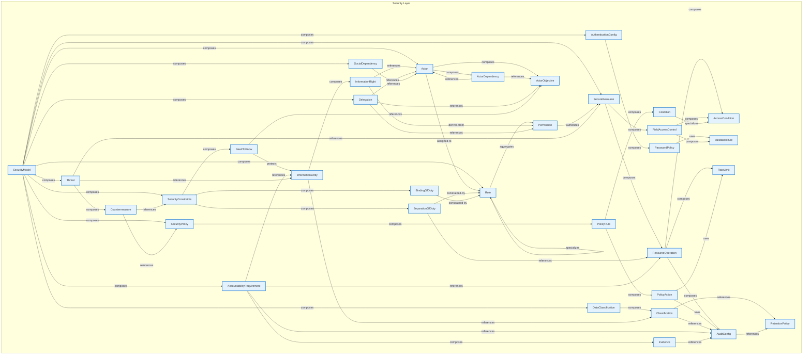

# Security Layer - Intra-Layer Relationships

## Overview

**Purpose**: Define semantic links between entities WITHIN this layer, capturing
structural composition, behavioral dependencies, and influence relationships.

**Layer ID**: `03-security`
**Analysis Date**: Generated automatically
**Validation**: Uses MarkdownLayerParser for closed-loop validation

---

### Relationship Diagram

## Layer Summary

### Entity Coverage (Target: 2+ relationships per entity)

- **Entities Meeting Target**: 34/34
- **Entity Coverage**: 100.0%

### Coverage Matrix

| Entity                    | Outgoing | Incoming | Total   | Meets Target | Status     |
| ------------------------- | -------- | -------- | ------- | ------------ | ---------- |
| AccessCondition           | 0        | 3        | 3       | ✓            | Complete   |
| AccountabilityRequirement | 4        | 1        | 5       | ✓            | Complete   |
| Actor                     | 3        | 5        | 8       | ✓            | Complete   |
| ActorDependency           | 2        | 1        | 3       | ✓            | Complete   |
| ActorObjective            | 0        | 4        | 4       | ✓            | Complete   |
| AuditConfig               | 1        | 5        | 6       | ✓            | Complete   |
| AuthenticationConfig      | 1        | 1        | 2       | ✓            | Complete   |
| BindingOfDuty             | 1        | 1        | 2       | ✓            | Complete   |
| Classification            | 2        | 2        | 4       | ✓            | Complete   |
| Condition                 | 1        | 1        | 2       | ✓            | Complete   |
| Countermeasure            | 2        | 1        | 3       | ✓            | Complete   |
| DataClassification        | 1        | 1        | 2       | ✓            | Complete   |
| Delegation                | 3        | 1        | 4       | ✓            | Complete   |
| Evidence                  | 1        | 1        | 2       | ✓            | Complete   |
| FieldAccessControl        | 2        | 1        | 3       | ✓            | Complete   |
| InformationEntity         | 2        | 3        | 5       | ✓            | Complete   |
| InformationRight          | 2        | 1        | 3       | ✓            | Complete   |
| NeedToKnow                | 2        | 1        | 3       | ✓            | Complete   |
| PasswordPolicy            | 1        | 1        | 2       | ✓            | Complete   |
| Permission                | 1        | 3        | 4       | ✓            | Complete   |
| PolicyAction              | 2        | 1        | 3       | ✓            | Complete   |
| PolicyRule                | 2        | 1        | 3       | ✓            | Complete   |
| RateLimit                 | 0        | 2        | 2       | ✓            | Complete   |
| ResourceOperation         | 3        | 3        | 6       | ✓            | Complete   |
| RetentionPolicy           | 0        | 2        | 2       | ✓            | Complete   |
| Role                      | 2        | 5        | 7       | ✓            | Complete   |
| SecureResource            | 2        | 3        | 5       | ✓            | Complete   |
| SecurityConstraints       | 3        | 2        | 5       | ✓            | Complete   |
| SecurityModel             | 11       | 0        | 11      | ✓            | Complete   |
| SecurityPolicy            | 1        | 2        | 3       | ✓            | Complete   |
| SeparationOfDuty          | 2        | 1        | 3       | ✓            | Complete   |
| SocialDependency          | 1        | 1        | 2       | ✓            | Complete   |
| Threat                    | 3        | 1        | 4       | ✓            | Complete   |
| ValidationRule            | 0        | 2        | 2       | ✓            | Complete   |
| **TOTAL**                 | **-**    | **-**    | **128** | **34/34**    | **100.0%** |

### Relationship Statistics

- **Total Unique Relationships**: 64
- **Total Connections (Entity Perspective)**: 128
- **Average Connections per Entity**: 3.8
- **Entity Coverage Target**: 2+ relationships

## Entity: AccessCondition

**Definition**: Conditional access rule

### Outgoing Relationships (AccessCondition → Other Entities)

_No outgoing intra-layer relationships documented._

### Incoming Relationships (Other Entities → AccessCondition)

| Relationship Type | Source Entity      | Predicate     | Status | Source                                                      | In Catalog | Documented |
| ----------------- | ------------------ | ------------- | ------ | ----------------------------------------------------------- | ---------- | ---------- |
| specialization    | Condition          | `specializes` | XML    | [XML](../../spec/layers/03-security-layer.md#example-model) | ✓          | ✗          |
| composition       | FieldAccessControl | `composes`    | XML    | [XML](../../spec/layers/03-security-layer.md#example-model) | ✓          | ✗          |
| composition       | ResourceOperation  | `composes`    | XML    | [XML](../../spec/layers/03-security-layer.md#example-model) | ✓          | ✗          |

### Relationship Summary

- **Total Relationships**: 3
- **Outgoing**: 0
- **Incoming**: 3
- **Documented**: 0/3
- **With XML Examples**: 3/3
- **In Catalog**: 3/3

---

## Entity: AccountabilityRequirement

**Definition**: Accountability and non-repudiation requirements

### Outgoing Relationships (AccountabilityRequirement → Other Entities)

| Relationship Type | Target Entity     | Predicate    | Status | Source                                                      | In Catalog | Documented |
| ----------------- | ----------------- | ------------ | ------ | ----------------------------------------------------------- | ---------- | ---------- |
| reference         | AuditConfig       | `references` | XML    | [XML](../../spec/layers/03-security-layer.md#example-model) | ✓          | ✗          |
| composition       | Evidence          | `composes`   | XML    | [XML](../../spec/layers/03-security-layer.md#example-model) | ✓          | ✗          |
| reference         | InformationEntity | `references` | XML    | [XML](../../spec/layers/03-security-layer.md#example-model) | ✓          | ✗          |
| reference         | ResourceOperation | `references` | XML    | [XML](../../spec/layers/03-security-layer.md#example-model) | ✓          | ✗          |

### Incoming Relationships (Other Entities → AccountabilityRequirement)

| Relationship Type | Source Entity | Predicate  | Status | Source                                                      | In Catalog | Documented |
| ----------------- | ------------- | ---------- | ------ | ----------------------------------------------------------- | ---------- | ---------- |
| composition       | SecurityModel | `composes` | XML    | [XML](../../spec/layers/03-security-layer.md#example-model) | ✓          | ✗          |

### Relationship Summary

- **Total Relationships**: 5
- **Outgoing**: 4
- **Incoming**: 1
- **Documented**: 0/5
- **With XML Examples**: 5/5
- **In Catalog**: 5/5

---

## Entity: Actor

**Definition**: Actor in the system (beyond roles)

### Outgoing Relationships (Actor → Other Entities)

| Relationship Type | Target Entity   | Predicate     | Status | Source                                                      | In Catalog | Documented |
| ----------------- | --------------- | ------------- | ------ | ----------------------------------------------------------- | ---------- | ---------- |
| composition       | ActorDependency | `composes`    | XML    | [XML](../../spec/layers/03-security-layer.md#example-model) | ✓          | ✗          |
| composition       | ActorObjective  | `composes`    | XML    | [XML](../../spec/layers/03-security-layer.md#example-model) | ✓          | ✗          |
| assignment        | Role            | `assigned-to` | XML    | [XML](../../spec/layers/03-security-layer.md#example-model) | ✓          | ✗          |

### Incoming Relationships (Other Entities → Actor)

| Relationship Type | Source Entity    | Predicate    | Status | Source                                                      | In Catalog | Documented |
| ----------------- | ---------------- | ------------ | ------ | ----------------------------------------------------------- | ---------- | ---------- |
| reference         | ActorDependency  | `references` | XML    | [XML](../../spec/layers/03-security-layer.md#example-model) | ✓          | ✗          |
| reference         | Delegation       | `references` | XML    | [XML](../../spec/layers/03-security-layer.md#example-model) | ✓          | ✗          |
| reference         | InformationRight | `references` | XML    | [XML](../../spec/layers/03-security-layer.md#example-model) | ✓          | ✗          |
| composition       | SecurityModel    | `composes`   | XML    | [XML](../../spec/layers/03-security-layer.md#example-model) | ✓          | ✗          |
| reference         | SocialDependency | `references` | XML    | [XML](../../spec/layers/03-security-layer.md#example-model) | ✓          | ✗          |

### Relationship Summary

- **Total Relationships**: 8
- **Outgoing**: 3
- **Incoming**: 5
- **Documented**: 0/8
- **With XML Examples**: 8/8
- **In Catalog**: 8/8

---

## Entity: ActorDependency

**Definition**: Dependency between actors

### Outgoing Relationships (ActorDependency → Other Entities)

| Relationship Type | Target Entity  | Predicate    | Status | Source                                                      | In Catalog | Documented |
| ----------------- | -------------- | ------------ | ------ | ----------------------------------------------------------- | ---------- | ---------- |
| reference         | Actor          | `references` | XML    | [XML](../../spec/layers/03-security-layer.md#example-model) | ✓          | ✗          |
| reference         | ActorObjective | `references` | XML    | [XML](../../spec/layers/03-security-layer.md#example-model) | ✓          | ✗          |

### Incoming Relationships (Other Entities → ActorDependency)

| Relationship Type | Source Entity | Predicate  | Status | Source                                                      | In Catalog | Documented |
| ----------------- | ------------- | ---------- | ------ | ----------------------------------------------------------- | ---------- | ---------- |
| composition       | Actor         | `composes` | XML    | [XML](../../spec/layers/03-security-layer.md#example-model) | ✓          | ✗          |

### Relationship Summary

- **Total Relationships**: 3
- **Outgoing**: 2
- **Incoming**: 1
- **Documented**: 0/3
- **With XML Examples**: 3/3
- **In Catalog**: 3/3

---

## Entity: ActorObjective

**Definition**: Security-related objective or goal of an actor

### Outgoing Relationships (ActorObjective → Other Entities)

_No outgoing intra-layer relationships documented._

### Incoming Relationships (Other Entities → ActorObjective)

| Relationship Type | Source Entity   | Predicate    | Status | Source                                                      | In Catalog | Documented |
| ----------------- | --------------- | ------------ | ------ | ----------------------------------------------------------- | ---------- | ---------- |
| composition       | Actor           | `composes`   | XML    | [XML](../../spec/layers/03-security-layer.md#example-model) | ✓          | ✗          |
| reference         | ActorDependency | `references` | XML    | [XML](../../spec/layers/03-security-layer.md#example-model) | ✓          | ✗          |
| reference         | Delegation      | `references` | XML    | [XML](../../spec/layers/03-security-layer.md#example-model) | ✓          | ✗          |
| reference         | NeedToKnow      | `references` | XML    | [XML](../../spec/layers/03-security-layer.md#example-model) | ✓          | ✗          |

### Relationship Summary

- **Total Relationships**: 4
- **Outgoing**: 0
- **Incoming**: 4
- **Documented**: 0/4
- **With XML Examples**: 4/4
- **In Catalog**: 4/4

---

## Entity: AuditConfig

**Definition**: Configuration for security audit logging, specifying what events to capture, retention periods, storage destinations, and compliance requirements. Enables security monitoring and forensic analysis.

### Outgoing Relationships (AuditConfig → Other Entities)

| Relationship Type | Target Entity   | Predicate    | Status | Source                                                      | In Catalog | Documented |
| ----------------- | --------------- | ------------ | ------ | ----------------------------------------------------------- | ---------- | ---------- |
| reference         | RetentionPolicy | `references` | XML    | [XML](../../spec/layers/03-security-layer.md#example-model) | ✓          | ✗          |

### Incoming Relationships (Other Entities → AuditConfig)

| Relationship Type | Source Entity             | Predicate    | Status | Source                                                      | In Catalog | Documented |
| ----------------- | ------------------------- | ------------ | ------ | ----------------------------------------------------------- | ---------- | ---------- |
| reference         | AccountabilityRequirement | `references` | XML    | [XML](../../spec/layers/03-security-layer.md#example-model) | ✓          | ✗          |
| reference         | Classification            | `references` | XML    | [XML](../../spec/layers/03-security-layer.md#example-model) | ✓          | ✗          |
| reference         | Evidence                  | `references` | XML    | [XML](../../spec/layers/03-security-layer.md#example-model) | ✓          | ✗          |
| uses              | PolicyAction              | `uses`       | XML    | [XML](../../spec/layers/03-security-layer.md#example-model) | ✓          | ✗          |
| composition       | ResourceOperation         | `composes`   | XML    | [XML](../../spec/layers/03-security-layer.md#example-model) | ✓          | ✗          |

### Relationship Summary

- **Total Relationships**: 6
- **Outgoing**: 1
- **Incoming**: 5
- **Documented**: 0/6
- **With XML Examples**: 6/6
- **In Catalog**: 6/6

---

## Entity: AuthenticationConfig

**Definition**: Authentication configuration

### Outgoing Relationships (AuthenticationConfig → Other Entities)

| Relationship Type | Target Entity  | Predicate  | Status | Source                                                      | In Catalog | Documented |
| ----------------- | -------------- | ---------- | ------ | ----------------------------------------------------------- | ---------- | ---------- |
| composition       | PasswordPolicy | `composes` | XML    | [XML](../../spec/layers/03-security-layer.md#example-model) | ✓          | ✗          |

### Incoming Relationships (Other Entities → AuthenticationConfig)

| Relationship Type | Source Entity | Predicate  | Status | Source                                                      | In Catalog | Documented |
| ----------------- | ------------- | ---------- | ------ | ----------------------------------------------------------- | ---------- | ---------- |
| composition       | SecurityModel | `composes` | XML    | [XML](../../spec/layers/03-security-layer.md#example-model) | ✓          | ✗          |

### Relationship Summary

- **Total Relationships**: 2
- **Outgoing**: 1
- **Incoming**: 1
- **Documented**: 0/2
- **With XML Examples**: 2/2
- **In Catalog**: 2/2

---

## Entity: BindingOfDuty

**Definition**: Same actor must complete related tasks

### Outgoing Relationships (BindingOfDuty → Other Entities)

| Relationship Type | Target Entity | Predicate        | Status | Source                                                      | In Catalog | Documented |
| ----------------- | ------------- | ---------------- | ------ | ----------------------------------------------------------- | ---------- | ---------- |
| constrainedby     | Role          | `constrained-by` | XML    | [XML](../../spec/layers/03-security-layer.md#example-model) | ✓          | ✗          |

### Incoming Relationships (Other Entities → BindingOfDuty)

| Relationship Type | Source Entity       | Predicate  | Status | Source                                                      | In Catalog | Documented |
| ----------------- | ------------------- | ---------- | ------ | ----------------------------------------------------------- | ---------- | ---------- |
| composition       | SecurityConstraints | `composes` | XML    | [XML](../../spec/layers/03-security-layer.md#example-model) | ✓          | ✗          |

### Relationship Summary

- **Total Relationships**: 2
- **Outgoing**: 1
- **Incoming**: 1
- **Documented**: 0/2
- **With XML Examples**: 2/2
- **In Catalog**: 2/2

---

## Entity: Classification

**Definition**: A single classification level defining data sensitivity and protection requirements

### Outgoing Relationships (Classification → Other Entities)

| Relationship Type | Target Entity   | Predicate    | Status | Source                                                      | In Catalog | Documented |
| ----------------- | --------------- | ------------ | ------ | ----------------------------------------------------------- | ---------- | ---------- |
| reference         | AuditConfig     | `references` | XML    | [XML](../../spec/layers/03-security-layer.md#example-model) | ✓          | ✗          |
| reference         | RetentionPolicy | `references` | XML    | [XML](../../spec/layers/03-security-layer.md#example-model) | ✓          | ✗          |

### Incoming Relationships (Other Entities → Classification)

| Relationship Type | Source Entity      | Predicate    | Status | Source                                                      | In Catalog | Documented |
| ----------------- | ------------------ | ------------ | ------ | ----------------------------------------------------------- | ---------- | ---------- |
| composition       | DataClassification | `composes`   | XML    | [XML](../../spec/layers/03-security-layer.md#example-model) | ✓          | ✗          |
| reference         | InformationEntity  | `references` | XML    | [XML](../../spec/layers/03-security-layer.md#example-model) | ✓          | ✗          |

### Relationship Summary

- **Total Relationships**: 4
- **Outgoing**: 2
- **Incoming**: 2
- **Documented**: 0/4
- **With XML Examples**: 4/4
- **In Catalog**: 4/4

---

## Entity: Condition

**Definition**: A logical expression or predicate that determines when a SecurityPolicy rule applies. Supports attribute-based access control by evaluating context such as time, location, user attributes, or resource state.

### Outgoing Relationships (Condition → Other Entities)

| Relationship Type | Target Entity   | Predicate     | Status | Source                                                      | In Catalog | Documented |
| ----------------- | --------------- | ------------- | ------ | ----------------------------------------------------------- | ---------- | ---------- |
| specialization    | AccessCondition | `specializes` | XML    | [XML](../../spec/layers/03-security-layer.md#example-model) | ✓          | ✗          |

### Incoming Relationships (Other Entities → Condition)

| Relationship Type | Source Entity | Predicate  | Status | Source                                                      | In Catalog | Documented |
| ----------------- | ------------- | ---------- | ------ | ----------------------------------------------------------- | ---------- | ---------- |
| composition       | PolicyRule    | `composes` | XML    | [XML](../../spec/layers/03-security-layer.md#example-model) | ✓          | ✗          |

### Relationship Summary

- **Total Relationships**: 2
- **Outgoing**: 1
- **Incoming**: 1
- **Documented**: 0/2
- **With XML Examples**: 2/2
- **In Catalog**: 2/2

---

## Entity: Countermeasure

**Definition**: Security countermeasure for a threat

### Outgoing Relationships (Countermeasure → Other Entities)

| Relationship Type | Target Entity       | Predicate    | Status | Source                                                      | In Catalog | Documented |
| ----------------- | ------------------- | ------------ | ------ | ----------------------------------------------------------- | ---------- | ---------- |
| reference         | SecurityConstraints | `references` | XML    | [XML](../../spec/layers/03-security-layer.md#example-model) | ✓          | ✗          |
| reference         | SecurityPolicy      | `references` | XML    | [XML](../../spec/layers/03-security-layer.md#example-model) | ✓          | ✗          |

### Incoming Relationships (Other Entities → Countermeasure)

| Relationship Type | Source Entity | Predicate  | Status | Source                                                      | In Catalog | Documented |
| ----------------- | ------------- | ---------- | ------ | ----------------------------------------------------------- | ---------- | ---------- |
| composition       | Threat        | `composes` | XML    | [XML](../../spec/layers/03-security-layer.md#example-model) | ✓          | ✗          |

### Relationship Summary

- **Total Relationships**: 3
- **Outgoing**: 2
- **Incoming**: 1
- **Documented**: 0/3
- **With XML Examples**: 3/3
- **In Catalog**: 3/3

---

## Entity: DataClassification

**Definition**: Data classification and protection policies

### Outgoing Relationships (DataClassification → Other Entities)

| Relationship Type | Target Entity  | Predicate  | Status | Source                                                      | In Catalog | Documented |
| ----------------- | -------------- | ---------- | ------ | ----------------------------------------------------------- | ---------- | ---------- |
| composition       | Classification | `composes` | XML    | [XML](../../spec/layers/03-security-layer.md#example-model) | ✓          | ✗          |

### Incoming Relationships (Other Entities → DataClassification)

| Relationship Type | Source Entity | Predicate  | Status | Source                                                      | In Catalog | Documented |
| ----------------- | ------------- | ---------- | ------ | ----------------------------------------------------------- | ---------- | ---------- |
| composition       | SecurityModel | `composes` | XML    | [XML](../../spec/layers/03-security-layer.md#example-model) | ✓          | ✗          |

### Relationship Summary

- **Total Relationships**: 2
- **Outgoing**: 1
- **Incoming**: 1
- **Documented**: 0/2
- **With XML Examples**: 2/2
- **In Catalog**: 2/2

---

## Entity: Delegation

**Definition**: Explicit delegation of permissions or goals

### Outgoing Relationships (Delegation → Other Entities)

| Relationship Type | Target Entity  | Predicate    | Status | Source                                                      | In Catalog | Documented |
| ----------------- | -------------- | ------------ | ------ | ----------------------------------------------------------- | ---------- | ---------- |
| reference         | Actor          | `references` | XML    | [XML](../../spec/layers/03-security-layer.md#example-model) | ✓          | ✗          |
| reference         | ActorObjective | `references` | XML    | [XML](../../spec/layers/03-security-layer.md#example-model) | ✓          | ✗          |
| reference         | Permission     | `references` | XML    | [XML](../../spec/layers/03-security-layer.md#example-model) | ✓          | ✗          |

### Incoming Relationships (Other Entities → Delegation)

| Relationship Type | Source Entity | Predicate  | Status | Source                                                      | In Catalog | Documented |
| ----------------- | ------------- | ---------- | ------ | ----------------------------------------------------------- | ---------- | ---------- |
| composition       | SecurityModel | `composes` | XML    | [XML](../../spec/layers/03-security-layer.md#example-model) | ✓          | ✗          |

### Relationship Summary

- **Total Relationships**: 4
- **Outgoing**: 3
- **Incoming**: 1
- **Documented**: 0/4
- **With XML Examples**: 4/4
- **In Catalog**: 4/4

---

## Entity: Evidence

**Definition**: Evidence required for accountability

### Outgoing Relationships (Evidence → Other Entities)

| Relationship Type | Target Entity | Predicate    | Status | Source                                                      | In Catalog | Documented |
| ----------------- | ------------- | ------------ | ------ | ----------------------------------------------------------- | ---------- | ---------- |
| reference         | AuditConfig   | `references` | XML    | [XML](../../spec/layers/03-security-layer.md#example-model) | ✓          | ✗          |

### Incoming Relationships (Other Entities → Evidence)

| Relationship Type | Source Entity             | Predicate  | Status | Source                                                      | In Catalog | Documented |
| ----------------- | ------------------------- | ---------- | ------ | ----------------------------------------------------------- | ---------- | ---------- |
| composition       | AccountabilityRequirement | `composes` | XML    | [XML](../../spec/layers/03-security-layer.md#example-model) | ✓          | ✗          |

### Relationship Summary

- **Total Relationships**: 2
- **Outgoing**: 1
- **Incoming**: 1
- **Documented**: 0/2
- **With XML Examples**: 2/2
- **In Catalog**: 2/2

---

## Entity: FieldAccessControl

**Definition**: Field-level access control

### Outgoing Relationships (FieldAccessControl → Other Entities)

| Relationship Type | Target Entity   | Predicate  | Status | Source                                                      | In Catalog | Documented |
| ----------------- | --------------- | ---------- | ------ | ----------------------------------------------------------- | ---------- | ---------- |
| composition       | AccessCondition | `composes` | XML    | [XML](../../spec/layers/03-security-layer.md#example-model) | ✓          | ✗          |
| composition       | ValidationRule  | `composes` | XML    | [XML](../../spec/layers/03-security-layer.md#example-model) | ✓          | ✗          |

### Incoming Relationships (Other Entities → FieldAccessControl)

| Relationship Type | Source Entity  | Predicate  | Status | Source                                                      | In Catalog | Documented |
| ----------------- | -------------- | ---------- | ------ | ----------------------------------------------------------- | ---------- | ---------- |
| composition       | SecureResource | `composes` | XML    | [XML](../../spec/layers/03-security-layer.md#example-model) | ✓          | ✗          |

### Relationship Summary

- **Total Relationships**: 3
- **Outgoing**: 2
- **Incoming**: 1
- **Documented**: 0/3
- **With XML Examples**: 3/3
- **In Catalog**: 3/3

---

## Entity: InformationEntity

**Definition**: Information asset with fine-grained rights

### Outgoing Relationships (InformationEntity → Other Entities)

| Relationship Type | Target Entity    | Predicate    | Status | Source                                                      | In Catalog | Documented |
| ----------------- | ---------------- | ------------ | ------ | ----------------------------------------------------------- | ---------- | ---------- |
| reference         | Classification   | `references` | XML    | [XML](../../spec/layers/03-security-layer.md#example-model) | ✓          | ✗          |
| composition       | InformationRight | `composes`   | XML    | [XML](../../spec/layers/03-security-layer.md#example-model) | ✓          | ✗          |

### Incoming Relationships (Other Entities → InformationEntity)

| Relationship Type | Source Entity             | Predicate    | Status | Source                                                      | In Catalog | Documented |
| ----------------- | ------------------------- | ------------ | ------ | ----------------------------------------------------------- | ---------- | ---------- |
| reference         | AccountabilityRequirement | `references` | XML    | [XML](../../spec/layers/03-security-layer.md#example-model) | ✓          | ✗          |
| protects          | NeedToKnow                | `protects`   | XML    | [XML](../../spec/layers/03-security-layer.md#example-model) | ✓          | ✗          |
| reference         | Threat                    | `references` | XML    | [XML](../../spec/layers/03-security-layer.md#example-model) | ✓          | ✗          |

### Relationship Summary

- **Total Relationships**: 5
- **Outgoing**: 2
- **Incoming**: 3
- **Documented**: 0/5
- **With XML Examples**: 5/5
- **In Catalog**: 5/5

---

## Entity: InformationRight

**Definition**: Fine-grained information access rights

### Outgoing Relationships (InformationRight → Other Entities)

| Relationship Type | Target Entity | Predicate      | Status | Source                                                      | In Catalog | Documented |
| ----------------- | ------------- | -------------- | ------ | ----------------------------------------------------------- | ---------- | ---------- |
| reference         | Actor         | `references`   | XML    | [XML](../../spec/layers/03-security-layer.md#example-model) | ✓          | ✗          |
| derivedfrom       | Permission    | `derives-from` | XML    | [XML](../../spec/layers/03-security-layer.md#example-model) | ✓          | ✗          |

### Incoming Relationships (Other Entities → InformationRight)

| Relationship Type | Source Entity     | Predicate  | Status | Source                                                      | In Catalog | Documented |
| ----------------- | ----------------- | ---------- | ------ | ----------------------------------------------------------- | ---------- | ---------- |
| composition       | InformationEntity | `composes` | XML    | [XML](../../spec/layers/03-security-layer.md#example-model) | ✓          | ✗          |

### Relationship Summary

- **Total Relationships**: 3
- **Outgoing**: 2
- **Incoming**: 1
- **Documented**: 0/3
- **With XML Examples**: 3/3
- **In Catalog**: 3/3

---

## Entity: NeedToKnow

**Definition**: Information access based on objective/purpose requirements

### Outgoing Relationships (NeedToKnow → Other Entities)

| Relationship Type | Target Entity     | Predicate    | Status | Source                                                      | In Catalog | Documented |
| ----------------- | ----------------- | ------------ | ------ | ----------------------------------------------------------- | ---------- | ---------- |
| reference         | ActorObjective    | `references` | XML    | [XML](../../spec/layers/03-security-layer.md#example-model) | ✓          | ✗          |
| protects          | InformationEntity | `protects`   | XML    | [XML](../../spec/layers/03-security-layer.md#example-model) | ✓          | ✗          |

### Incoming Relationships (Other Entities → NeedToKnow)

| Relationship Type | Source Entity       | Predicate  | Status | Source                                                      | In Catalog | Documented |
| ----------------- | ------------------- | ---------- | ------ | ----------------------------------------------------------- | ---------- | ---------- |
| composition       | SecurityConstraints | `composes` | XML    | [XML](../../spec/layers/03-security-layer.md#example-model) | ✓          | ✗          |

### Relationship Summary

- **Total Relationships**: 3
- **Outgoing**: 2
- **Incoming**: 1
- **Documented**: 0/3
- **With XML Examples**: 3/3
- **In Catalog**: 3/3

---

## Entity: PasswordPolicy

**Definition**: Password requirements

### Outgoing Relationships (PasswordPolicy → Other Entities)

| Relationship Type | Target Entity  | Predicate | Status | Source                                                      | In Catalog | Documented |
| ----------------- | -------------- | --------- | ------ | ----------------------------------------------------------- | ---------- | ---------- |
| uses              | ValidationRule | `uses`    | XML    | [XML](../../spec/layers/03-security-layer.md#example-model) | ✓          | ✗          |

### Incoming Relationships (Other Entities → PasswordPolicy)

| Relationship Type | Source Entity        | Predicate  | Status | Source                                                      | In Catalog | Documented |
| ----------------- | -------------------- | ---------- | ------ | ----------------------------------------------------------- | ---------- | ---------- |
| composition       | AuthenticationConfig | `composes` | XML    | [XML](../../spec/layers/03-security-layer.md#example-model) | ✓          | ✗          |

### Relationship Summary

- **Total Relationships**: 2
- **Outgoing**: 1
- **Incoming**: 1
- **Documented**: 0/2
- **With XML Examples**: 2/2
- **In Catalog**: 2/2

---

## Entity: Permission

**Definition**: Permission definition

### Outgoing Relationships (Permission → Other Entities)

| Relationship Type | Target Entity  | Predicate    | Status | Source                                                      | In Catalog | Documented |
| ----------------- | -------------- | ------------ | ------ | ----------------------------------------------------------- | ---------- | ---------- |
| authorization     | SecureResource | `authorizes` | XML    | [XML](../../spec/layers/03-security-layer.md#example-model) | ✓          | ✗          |

### Incoming Relationships (Other Entities → Permission)

| Relationship Type | Source Entity    | Predicate      | Status | Source                                                      | In Catalog | Documented |
| ----------------- | ---------------- | -------------- | ------ | ----------------------------------------------------------- | ---------- | ---------- |
| reference         | Delegation       | `references`   | XML    | [XML](../../spec/layers/03-security-layer.md#example-model) | ✓          | ✗          |
| derivedfrom       | InformationRight | `derives-from` | XML    | [XML](../../spec/layers/03-security-layer.md#example-model) | ✓          | ✗          |
| aggregation       | Role             | `aggregates`   | XML    | [XML](../../spec/layers/03-security-layer.md#example-model) | ✓          | ✗          |

### Relationship Summary

- **Total Relationships**: 4
- **Outgoing**: 1
- **Incoming**: 3
- **Documented**: 0/4
- **With XML Examples**: 4/4
- **In Catalog**: 4/4

---

## Entity: PolicyAction

**Definition**: Action to take when policy rule matches

### Outgoing Relationships (PolicyAction → Other Entities)

| Relationship Type | Target Entity | Predicate | Status | Source                                                      | In Catalog | Documented |
| ----------------- | ------------- | --------- | ------ | ----------------------------------------------------------- | ---------- | ---------- |
| uses              | AuditConfig   | `uses`    | XML    | [XML](../../spec/layers/03-security-layer.md#example-model) | ✓          | ✗          |
| uses              | RateLimit     | `uses`    | XML    | [XML](../../spec/layers/03-security-layer.md#example-model) | ✓          | ✗          |

### Incoming Relationships (Other Entities → PolicyAction)

| Relationship Type | Source Entity | Predicate  | Status | Source                                                      | In Catalog | Documented |
| ----------------- | ------------- | ---------- | ------ | ----------------------------------------------------------- | ---------- | ---------- |
| composition       | PolicyRule    | `composes` | XML    | [XML](../../spec/layers/03-security-layer.md#example-model) | ✓          | ✗          |

### Relationship Summary

- **Total Relationships**: 3
- **Outgoing**: 2
- **Incoming**: 1
- **Documented**: 0/3
- **With XML Examples**: 3/3
- **In Catalog**: 3/3

---

## Entity: PolicyRule

**Definition**: Individual policy rule

### Outgoing Relationships (PolicyRule → Other Entities)

| Relationship Type | Target Entity | Predicate  | Status | Source                                                      | In Catalog | Documented |
| ----------------- | ------------- | ---------- | ------ | ----------------------------------------------------------- | ---------- | ---------- |
| composition       | Condition     | `composes` | XML    | [XML](../../spec/layers/03-security-layer.md#example-model) | ✓          | ✗          |
| composition       | PolicyAction  | `composes` | XML    | [XML](../../spec/layers/03-security-layer.md#example-model) | ✓          | ✗          |

### Incoming Relationships (Other Entities → PolicyRule)

| Relationship Type | Source Entity  | Predicate  | Status | Source                                                      | In Catalog | Documented |
| ----------------- | -------------- | ---------- | ------ | ----------------------------------------------------------- | ---------- | ---------- |
| composition       | SecurityPolicy | `composes` | XML    | [XML](../../spec/layers/03-security-layer.md#example-model) | ✓          | ✗          |

### Relationship Summary

- **Total Relationships**: 3
- **Outgoing**: 2
- **Incoming**: 1
- **Documented**: 0/3
- **With XML Examples**: 3/3
- **In Catalog**: 3/3

---

## Entity: RateLimit

**Definition**: Defines throttling constraints for API or service access, specifying maximum request counts, time windows, and actions to take when limits are exceeded. Protects resources from abuse and ensures fair usage across consumers.

### Outgoing Relationships (RateLimit → Other Entities)

_No outgoing intra-layer relationships documented._

### Incoming Relationships (Other Entities → RateLimit)

| Relationship Type | Source Entity     | Predicate  | Status | Source                                                      | In Catalog | Documented |
| ----------------- | ----------------- | ---------- | ------ | ----------------------------------------------------------- | ---------- | ---------- |
| uses              | PolicyAction      | `uses`     | XML    | [XML](../../spec/layers/03-security-layer.md#example-model) | ✓          | ✗          |
| composition       | ResourceOperation | `composes` | XML    | [XML](../../spec/layers/03-security-layer.md#example-model) | ✓          | ✗          |

### Relationship Summary

- **Total Relationships**: 2
- **Outgoing**: 0
- **Incoming**: 2
- **Documented**: 0/2
- **With XML Examples**: 2/2
- **In Catalog**: 2/2

---

## Entity: ResourceOperation

**Definition**: Operation on a resource

### Outgoing Relationships (ResourceOperation → Other Entities)

| Relationship Type | Target Entity   | Predicate  | Status | Source                                                      | In Catalog | Documented |
| ----------------- | --------------- | ---------- | ------ | ----------------------------------------------------------- | ---------- | ---------- |
| composition       | AccessCondition | `composes` | XML    | [XML](../../spec/layers/03-security-layer.md#example-model) | ✓          | ✗          |
| composition       | AuditConfig     | `composes` | XML    | [XML](../../spec/layers/03-security-layer.md#example-model) | ✓          | ✗          |
| composition       | RateLimit       | `composes` | XML    | [XML](../../spec/layers/03-security-layer.md#example-model) | ✓          | ✗          |

### Incoming Relationships (Other Entities → ResourceOperation)

| Relationship Type | Source Entity             | Predicate    | Status | Source                                                      | In Catalog | Documented |
| ----------------- | ------------------------- | ------------ | ------ | ----------------------------------------------------------- | ---------- | ---------- |
| reference         | AccountabilityRequirement | `references` | XML    | [XML](../../spec/layers/03-security-layer.md#example-model) | ✓          | ✗          |
| composition       | SecureResource            | `composes`   | XML    | [XML](../../spec/layers/03-security-layer.md#example-model) | ✓          | ✗          |
| reference         | SeparationOfDuty          | `references` | XML    | [XML](../../spec/layers/03-security-layer.md#example-model) | ✓          | ✗          |

### Relationship Summary

- **Total Relationships**: 6
- **Outgoing**: 3
- **Incoming**: 3
- **Documented**: 0/6
- **With XML Examples**: 6/6
- **In Catalog**: 6/6

---

## Entity: RetentionPolicy

**Definition**: Defines how long security-related data (audit logs, access records, encryption keys) must be retained, archival strategies, and secure deletion procedures. Ensures compliance with regulatory requirements.

### Outgoing Relationships (RetentionPolicy → Other Entities)

_No outgoing intra-layer relationships documented._

### Incoming Relationships (Other Entities → RetentionPolicy)

| Relationship Type | Source Entity  | Predicate    | Status | Source                                                      | In Catalog | Documented |
| ----------------- | -------------- | ------------ | ------ | ----------------------------------------------------------- | ---------- | ---------- |
| reference         | AuditConfig    | `references` | XML    | [XML](../../spec/layers/03-security-layer.md#example-model) | ✓          | ✗          |
| reference         | Classification | `references` | XML    | [XML](../../spec/layers/03-security-layer.md#example-model) | ✓          | ✗          |

### Relationship Summary

- **Total Relationships**: 2
- **Outgoing**: 0
- **Incoming**: 2
- **Documented**: 0/2
- **With XML Examples**: 2/2
- **In Catalog**: 2/2

---

## Entity: Role

**Definition**: User role definition

### Outgoing Relationships (Role → Other Entities)

| Relationship Type | Target Entity | Predicate     | Status | Source                                                      | In Catalog | Documented |
| ----------------- | ------------- | ------------- | ------ | ----------------------------------------------------------- | ---------- | ---------- |
| aggregation       | Permission    | `aggregates`  | XML    | [XML](../../spec/layers/03-security-layer.md#example-model) | ✓          | ✗          |
| specialization    | Role          | `specializes` | XML    | [XML](../../spec/layers/03-security-layer.md#example-model) | ✓          | ✗          |

### Incoming Relationships (Other Entities → Role)

| Relationship Type | Source Entity    | Predicate        | Status | Source                                                      | In Catalog | Documented |
| ----------------- | ---------------- | ---------------- | ------ | ----------------------------------------------------------- | ---------- | ---------- |
| assignment        | Actor            | `assigned-to`    | XML    | [XML](../../spec/layers/03-security-layer.md#example-model) | ✓          | ✗          |
| constrainedby     | BindingOfDuty    | `constrained-by` | XML    | [XML](../../spec/layers/03-security-layer.md#example-model) | ✓          | ✗          |
| specialization    | Role             | `specializes`    | XML    | [XML](../../spec/layers/03-security-layer.md#example-model) | ✓          | ✗          |
| composition       | SecurityModel    | `composes`       | XML    | [XML](../../spec/layers/03-security-layer.md#example-model) | ✓          | ✗          |
| constrainedby     | SeparationOfDuty | `constrained-by` | XML    | [XML](../../spec/layers/03-security-layer.md#example-model) | ✓          | ✗          |

### Relationship Summary

- **Total Relationships**: 7
- **Outgoing**: 2
- **Incoming**: 5
- **Documented**: 0/7
- **With XML Examples**: 7/7
- **In Catalog**: 7/7

---

## Entity: SecureResource

**Definition**: Protected resource definition

### Outgoing Relationships (SecureResource → Other Entities)

| Relationship Type | Target Entity      | Predicate  | Status | Source                                                      | In Catalog | Documented |
| ----------------- | ------------------ | ---------- | ------ | ----------------------------------------------------------- | ---------- | ---------- |
| composition       | FieldAccessControl | `composes` | XML    | [XML](../../spec/layers/03-security-layer.md#example-model) | ✓          | ✗          |
| composition       | ResourceOperation  | `composes` | XML    | [XML](../../spec/layers/03-security-layer.md#example-model) | ✓          | ✗          |

### Incoming Relationships (Other Entities → SecureResource)

| Relationship Type | Source Entity | Predicate    | Status | Source                                                      | In Catalog | Documented |
| ----------------- | ------------- | ------------ | ------ | ----------------------------------------------------------- | ---------- | ---------- |
| authorization     | Permission    | `authorizes` | XML    | [XML](../../spec/layers/03-security-layer.md#example-model) | ✓          | ✗          |
| composition       | SecurityModel | `composes`   | XML    | [XML](../../spec/layers/03-security-layer.md#example-model) | ✓          | ✗          |
| reference         | Threat        | `references` | XML    | [XML](../../spec/layers/03-security-layer.md#example-model) | ✓          | ✗          |

### Relationship Summary

- **Total Relationships**: 5
- **Outgoing**: 2
- **Incoming**: 3
- **Documented**: 0/5
- **With XML Examples**: 5/5
- **In Catalog**: 5/5

---

## Entity: SecurityConstraints

**Definition**: Security patterns and constraints

### Outgoing Relationships (SecurityConstraints → Other Entities)

| Relationship Type | Target Entity    | Predicate  | Status | Source                                                      | In Catalog | Documented |
| ----------------- | ---------------- | ---------- | ------ | ----------------------------------------------------------- | ---------- | ---------- |
| composition       | BindingOfDuty    | `composes` | XML    | [XML](../../spec/layers/03-security-layer.md#example-model) | ✓          | ✗          |
| composition       | NeedToKnow       | `composes` | XML    | [XML](../../spec/layers/03-security-layer.md#example-model) | ✓          | ✗          |
| composition       | SeparationOfDuty | `composes` | XML    | [XML](../../spec/layers/03-security-layer.md#example-model) | ✓          | ✗          |

### Incoming Relationships (Other Entities → SecurityConstraints)

| Relationship Type | Source Entity  | Predicate    | Status | Source                                                      | In Catalog | Documented |
| ----------------- | -------------- | ------------ | ------ | ----------------------------------------------------------- | ---------- | ---------- |
| reference         | Countermeasure | `references` | XML    | [XML](../../spec/layers/03-security-layer.md#example-model) | ✓          | ✗          |
| composition       | SecurityModel  | `composes`   | XML    | [XML](../../spec/layers/03-security-layer.md#example-model) | ✓          | ✗          |

### Relationship Summary

- **Total Relationships**: 5
- **Outgoing**: 3
- **Incoming**: 2
- **Documented**: 0/5
- **With XML Examples**: 5/5
- **In Catalog**: 5/5

---

## Entity: SecurityModel

**Definition**: Complete security model for application

### Outgoing Relationships (SecurityModel → Other Entities)

| Relationship Type | Target Entity             | Predicate  | Status | Source                                                      | In Catalog | Documented |
| ----------------- | ------------------------- | ---------- | ------ | ----------------------------------------------------------- | ---------- | ---------- |
| composition       | AccountabilityRequirement | `composes` | XML    | [XML](../../spec/layers/03-security-layer.md#example-model) | ✓          | ✗          |
| composition       | Actor                     | `composes` | XML    | [XML](../../spec/layers/03-security-layer.md#example-model) | ✓          | ✗          |
| composition       | AuthenticationConfig      | `composes` | XML    | [XML](../../spec/layers/03-security-layer.md#example-model) | ✓          | ✗          |
| composition       | DataClassification        | `composes` | XML    | [XML](../../spec/layers/03-security-layer.md#example-model) | ✓          | ✗          |
| composition       | Delegation                | `composes` | XML    | [XML](../../spec/layers/03-security-layer.md#example-model) | ✓          | ✗          |
| composition       | Role                      | `composes` | XML    | [XML](../../spec/layers/03-security-layer.md#example-model) | ✓          | ✗          |
| composition       | SecureResource            | `composes` | XML    | [XML](../../spec/layers/03-security-layer.md#example-model) | ✓          | ✗          |
| composition       | SecurityConstraints       | `composes` | XML    | [XML](../../spec/layers/03-security-layer.md#example-model) | ✓          | ✗          |
| composition       | SecurityPolicy            | `composes` | XML    | [XML](../../spec/layers/03-security-layer.md#example-model) | ✓          | ✗          |
| composition       | SocialDependency          | `composes` | XML    | [XML](../../spec/layers/03-security-layer.md#example-model) | ✓          | ✗          |
| composition       | Threat                    | `composes` | XML    | [XML](../../spec/layers/03-security-layer.md#example-model) | ✓          | ✗          |

### Incoming Relationships (Other Entities → SecurityModel)

_No incoming intra-layer relationships documented._

### Relationship Summary

- **Total Relationships**: 11
- **Outgoing**: 11
- **Incoming**: 0
- **Documented**: 0/11
- **With XML Examples**: 11/11
- **In Catalog**: 11/11

---

## Entity: SecurityPolicy

**Definition**: Declarative security policy

### Outgoing Relationships (SecurityPolicy → Other Entities)

| Relationship Type | Target Entity | Predicate  | Status | Source                                                      | In Catalog | Documented |
| ----------------- | ------------- | ---------- | ------ | ----------------------------------------------------------- | ---------- | ---------- |
| composition       | PolicyRule    | `composes` | XML    | [XML](../../spec/layers/03-security-layer.md#example-model) | ✓          | ✗          |

### Incoming Relationships (Other Entities → SecurityPolicy)

| Relationship Type | Source Entity  | Predicate    | Status | Source                                                      | In Catalog | Documented |
| ----------------- | -------------- | ------------ | ------ | ----------------------------------------------------------- | ---------- | ---------- |
| reference         | Countermeasure | `references` | XML    | [XML](../../spec/layers/03-security-layer.md#example-model) | ✓          | ✗          |
| composition       | SecurityModel  | `composes`   | XML    | [XML](../../spec/layers/03-security-layer.md#example-model) | ✓          | ✗          |

### Relationship Summary

- **Total Relationships**: 3
- **Outgoing**: 1
- **Incoming**: 2
- **Documented**: 0/3
- **With XML Examples**: 3/3
- **In Catalog**: 3/3

---

## Entity: SeparationOfDuty

**Definition**: Different actors must perform related tasks

### Outgoing Relationships (SeparationOfDuty → Other Entities)

| Relationship Type | Target Entity     | Predicate        | Status | Source                                                      | In Catalog | Documented |
| ----------------- | ----------------- | ---------------- | ------ | ----------------------------------------------------------- | ---------- | ---------- |
| reference         | ResourceOperation | `references`     | XML    | [XML](../../spec/layers/03-security-layer.md#example-model) | ✓          | ✗          |
| constrainedby     | Role              | `constrained-by` | XML    | [XML](../../spec/layers/03-security-layer.md#example-model) | ✓          | ✗          |

### Incoming Relationships (Other Entities → SeparationOfDuty)

| Relationship Type | Source Entity       | Predicate  | Status | Source                                                      | In Catalog | Documented |
| ----------------- | ------------------- | ---------- | ------ | ----------------------------------------------------------- | ---------- | ---------- |
| composition       | SecurityConstraints | `composes` | XML    | [XML](../../spec/layers/03-security-layer.md#example-model) | ✓          | ✗          |

### Relationship Summary

- **Total Relationships**: 3
- **Outgoing**: 2
- **Incoming**: 1
- **Documented**: 0/3
- **With XML Examples**: 3/3
- **In Catalog**: 3/3

---

## Entity: SocialDependency

**Definition**: Dependencies and trust between actors

### Outgoing Relationships (SocialDependency → Other Entities)

| Relationship Type | Target Entity | Predicate    | Status | Source                                                      | In Catalog | Documented |
| ----------------- | ------------- | ------------ | ------ | ----------------------------------------------------------- | ---------- | ---------- |
| reference         | Actor         | `references` | XML    | [XML](../../spec/layers/03-security-layer.md#example-model) | ✓          | ✗          |

### Incoming Relationships (Other Entities → SocialDependency)

| Relationship Type | Source Entity | Predicate  | Status | Source                                                      | In Catalog | Documented |
| ----------------- | ------------- | ---------- | ------ | ----------------------------------------------------------- | ---------- | ---------- |
| composition       | SecurityModel | `composes` | XML    | [XML](../../spec/layers/03-security-layer.md#example-model) | ✓          | ✗          |

### Relationship Summary

- **Total Relationships**: 2
- **Outgoing**: 1
- **Incoming**: 1
- **Documented**: 0/2
- **With XML Examples**: 2/2
- **In Catalog**: 2/2

---

## Entity: Threat

**Definition**: Security threat and countermeasures

### Outgoing Relationships (Threat → Other Entities)

| Relationship Type | Target Entity     | Predicate    | Status | Source                                                      | In Catalog | Documented |
| ----------------- | ----------------- | ------------ | ------ | ----------------------------------------------------------- | ---------- | ---------- |
| composition       | Countermeasure    | `composes`   | XML    | [XML](../../spec/layers/03-security-layer.md#example-model) | ✓          | ✗          |
| reference         | InformationEntity | `references` | XML    | [XML](../../spec/layers/03-security-layer.md#example-model) | ✓          | ✗          |
| reference         | SecureResource    | `references` | XML    | [XML](../../spec/layers/03-security-layer.md#example-model) | ✓          | ✗          |

### Incoming Relationships (Other Entities → Threat)

| Relationship Type | Source Entity | Predicate  | Status | Source                                                      | In Catalog | Documented |
| ----------------- | ------------- | ---------- | ------ | ----------------------------------------------------------- | ---------- | ---------- |
| composition       | SecurityModel | `composes` | XML    | [XML](../../spec/layers/03-security-layer.md#example-model) | ✓          | ✗          |

### Relationship Summary

- **Total Relationships**: 4
- **Outgoing**: 3
- **Incoming**: 1
- **Documented**: 0/4
- **With XML Examples**: 4/4
- **In Catalog**: 4/4

---

## Entity: ValidationRule

**Definition**: Specifies data validation constraints for FieldAccessControl, defining allowed patterns, value ranges, or transformations applied when accessing protected fields. Prevents data corruption and enforces field-level integrity.

### Outgoing Relationships (ValidationRule → Other Entities)

_No outgoing intra-layer relationships documented._

### Incoming Relationships (Other Entities → ValidationRule)

| Relationship Type | Source Entity      | Predicate  | Status | Source                                                      | In Catalog | Documented |
| ----------------- | ------------------ | ---------- | ------ | ----------------------------------------------------------- | ---------- | ---------- |
| composition       | FieldAccessControl | `composes` | XML    | [XML](../../spec/layers/03-security-layer.md#example-model) | ✓          | ✗          |
| uses              | PasswordPolicy     | `uses`     | XML    | [XML](../../spec/layers/03-security-layer.md#example-model) | ✓          | ✗          |

### Relationship Summary

- **Total Relationships**: 2
- **Outgoing**: 0
- **Incoming**: 2
- **Documented**: 0/2
- **With XML Examples**: 2/2
- **In Catalog**: 2/2

---
