# Security Layer - Intra-Layer Relationships

## Overview

**Purpose**: Define semantic links between entities WITHIN this layer, capturing
structural composition, behavioral dependencies, and influence relationships.

**Layer ID**: `03-security`
**Analysis Date**: Generated automatically
**Validation**: Uses MarkdownLayerParser for closed-loop validation

---

### Relationship Diagram

```mermaid
graph TB
  subgraph "Security Layer"

    AccessCondition["AccessCondition"]
    AccountabilityRequirement["AccountabilityRequirement"]
    Actor["Actor"]
    ActorDependency["ActorDependency"]
    ActorObjective["ActorObjective"]
    AuditConfig["AuditConfig"]
    AuthenticationConfig["AuthenticationConfig"]
    BindingOfDuty["BindingOfDuty"]
    Classification["Classification"]
    Condition["Condition"]
    Countermeasure["Countermeasure"]
    DataClassification["DataClassification"]
    Delegation["Delegation"]
    Evidence["Evidence"]
    FieldAccessControl["FieldAccessControl"]
    InformationEntity["InformationEntity"]
    InformationRight["InformationRight"]
    NeedToKnow["NeedToKnow"]
    PasswordPolicy["PasswordPolicy"]
    Permission["Permission"]
    PolicyAction["PolicyAction"]
    PolicyRule["PolicyRule"]
    RateLimit["RateLimit"]
    ResourceOperation["ResourceOperation"]
    RetentionPolicy["RetentionPolicy"]
    Role["Role"]
    SecureResource["SecureResource"]
    SecurityConstraints["SecurityConstraints"]
    SecurityModel["SecurityModel"]
    SecurityPolicy["SecurityPolicy"]
    SeparationOfDuty["SeparationOfDuty"]
    SocialDependency["SocialDependency"]
    Threat["Threat"]
    ValidationRule["ValidationRule"]

    SecurityModel -->|composes| AuthenticationConfig
    SecurityModel -->|composes| Role
    SecurityModel -->|composes| Permission
    SecurityModel -->|composes| SecureResource
    SecurityModel -->|composes| SecurityPolicy
    SecurityModel -->|composes| DataClassification
    SecurityModel -->|composes| Actor
    SecurityModel -->|composes| InformationEntity
    SecurityModel -->|composes| Delegation
    SecurityModel -->|composes| SecurityConstraints
    SecurityModel -->|composes| SocialDependency
    SecurityModel -->|composes| Threat
    SecurityModel -->|composes| AccountabilityRequirement
    AuthenticationConfig -->|composes| PasswordPolicy
    AuthenticationConfig -->|authenticates| Actor
    PasswordPolicy -->|uses| ValidationRule
    Role -->|specializes| Role
    Role -->|authorizes| Permission
    Role -->|protects| SecureResource
    Role -->|aggregates| Permission
    Permission -->|composes| AccessCondition
    Permission -->|authorizes| SecureResource
    Permission -->|authorizes| ResourceOperation
    SecureResource -->|composes| ResourceOperation
    SecureResource -->|composes| FieldAccessControl
    SecureResource -->|composes| RateLimit
    SecureResource -->|composes| AuditConfig
    ResourceOperation -->|composes| AccessCondition
    ResourceOperation -->|composes| RateLimit
    ResourceOperation -->|composes| AuditConfig
    AccessCondition -->|references| Role
    FieldAccessControl -->|references| Permission
    FieldAccessControl -->|composes| AccessCondition
    FieldAccessControl -->|composes| ValidationRule
    SecurityPolicy -->|composes| PolicyRule
    SecurityPolicy -->|composes| ValidationRule
    SecurityPolicy -->|protects| SecureResource
    SecurityPolicy -->|enforces-requirement| Permission
    PolicyRule -->|composes| PolicyAction
    PolicyRule -->|composes| Condition
    PolicyAction -->|references| AuditConfig
    PolicyAction -->|uses| RateLimit
    PolicyAction -->|uses| AuditConfig
    DataClassification -->|composes| Classification
    DataClassification -->|composes| RetentionPolicy
    Classification -->|protects| SecureResource
    Classification -->|references| RetentionPolicy
    Classification -->|references| AuditConfig
    Actor -->|composes| ActorObjective
    Actor -->|composes| ActorDependency
    Actor -->|assigned-to| Role
    ActorObjective -->|references| SecurityPolicy
    ActorDependency -->|references| InformationEntity
    ActorDependency -->|references| Actor
    ActorDependency -->|references| ActorObjective
    InformationEntity -->|composes| InformationRight
    InformationEntity -->|references| Classification
    InformationRight -->|authorizes| InformationEntity
    InformationRight -->|references| Actor
    InformationRight -->|derives-from| Permission
    Delegation -->|references| Role
    Delegation -->|references| Actor
    Delegation -->|references| Permission
    Delegation -->|references| ActorObjective
    SecurityConstraints -->|composes| SeparationOfDuty
    SecurityConstraints -->|composes| BindingOfDuty
    SecurityConstraints -->|composes| NeedToKnow
    SeparationOfDuty -->|references| Role
    SeparationOfDuty -->|constrained-by| Role
    SeparationOfDuty -->|references| ResourceOperation
    BindingOfDuty -->|references| Role
    BindingOfDuty -->|constrained-by| Role
    NeedToKnow -->|references| Actor
    NeedToKnow -->|protects| InformationEntity
    NeedToKnow -->|references| ActorObjective
    SocialDependency -->|associated-with| Actor
    SocialDependency -->|references| Actor
    AccountabilityRequirement -->|composes| Evidence
    AccountabilityRequirement -->|references| Actor
    AccountabilityRequirement -->|references| AuditConfig
    AccountabilityRequirement -->|references| ResourceOperation
    AccountabilityRequirement -->|references| InformationEntity
    Evidence -->|references| AuditConfig
    Threat -->|composes| Countermeasure
    Threat -->|references| SecureResource
    Threat -->|references| Actor
    Threat -->|references| InformationEntity
    Countermeasure -->|protects| SecureResource
    Countermeasure -->|protects| Actor
    Countermeasure -->|references| Threat
    Countermeasure -->|associated-with| SecurityPolicy
    Countermeasure -->|references| SecurityConstraints
    Countermeasure -->|references| SecurityPolicy
    RateLimit -->|associated-with| SecurityPolicy
    AuditConfig -->|references| RetentionPolicy
    Condition -->|uses| ValidationRule
    Condition -->|specializes| AccessCondition
    RetentionPolicy -->|references| AuditConfig
    ValidationRule -->|uses| Condition
  end

  %% Styling
  classDef default fill:#E3F2FD,stroke:#1976D2,stroke-width:2px
```

## Layer Summary

### Entity Coverage (Target: 2+ relationships per entity)

- **Entities Meeting Target**: 34/34
- **Entity Coverage**: 100.0%

### Coverage Matrix

| Entity                    | Outgoing | Incoming | Total   | Meets Target | Status     |
| ------------------------- | -------- | -------- | ------- | ------------ | ---------- |
| AccessCondition           | 1        | 4        | 5       | ✓            | Complete   |
| AccountabilityRequirement | 5        | 1        | 6       | ✓            | Complete   |
| Actor                     | 3        | 11       | 14      | ✓            | Complete   |
| ActorDependency           | 3        | 1        | 4       | ✓            | Complete   |
| ActorObjective            | 1        | 4        | 5       | ✓            | Complete   |
| AuditConfig               | 1        | 8        | 9       | ✓            | Complete   |
| AuthenticationConfig      | 2        | 1        | 3       | ✓            | Complete   |
| BindingOfDuty             | 2        | 1        | 3       | ✓            | Complete   |
| Classification            | 3        | 2        | 5       | ✓            | Complete   |
| Condition                 | 2        | 2        | 4       | ✓            | Complete   |
| Countermeasure            | 6        | 1        | 7       | ✓            | Complete   |
| DataClassification        | 2        | 1        | 3       | ✓            | Complete   |
| Delegation                | 4        | 1        | 5       | ✓            | Complete   |
| Evidence                  | 1        | 1        | 2       | ✓            | Complete   |
| FieldAccessControl        | 3        | 1        | 4       | ✓            | Complete   |
| InformationEntity         | 2        | 6        | 8       | ✓            | Complete   |
| InformationRight          | 3        | 1        | 4       | ✓            | Complete   |
| NeedToKnow                | 3        | 1        | 4       | ✓            | Complete   |
| PasswordPolicy            | 1        | 1        | 2       | ✓            | Complete   |
| Permission                | 3        | 7        | 10      | ✓            | Complete   |
| PolicyAction              | 3        | 1        | 4       | ✓            | Complete   |
| PolicyRule                | 2        | 1        | 3       | ✓            | Complete   |
| RateLimit                 | 1        | 3        | 4       | ✓            | Complete   |
| ResourceOperation         | 3        | 4        | 7       | ✓            | Complete   |
| RetentionPolicy           | 1        | 3        | 4       | ✓            | Complete   |
| Role                      | 4        | 9        | 13      | ✓            | Complete   |
| SecureResource            | 4        | 7        | 11      | ✓            | Complete   |
| SecurityConstraints       | 3        | 2        | 5       | ✓            | Complete   |
| SecurityModel             | 13       | 0        | 13      | ✓            | Complete   |
| SecurityPolicy            | 4        | 5        | 9       | ✓            | Complete   |
| SeparationOfDuty          | 3        | 1        | 4       | ✓            | Complete   |
| SocialDependency          | 2        | 1        | 3       | ✓            | Complete   |
| Threat                    | 4        | 2        | 6       | ✓            | Complete   |
| ValidationRule            | 1        | 4        | 5       | ✓            | Complete   |
| **TOTAL**                 | **-**    | **-**    | **198** | **34/34**    | **100.0%** |

### Relationship Statistics

- **Total Unique Relationships**: 99
- **Total Connections (Entity Perspective)**: 198
- **Average Connections per Entity**: 5.8
- **Entity Coverage Target**: 2+ relationships

## Entity: AccessCondition

**Definition**: Conditional access rule

### Outgoing Relationships (AccessCondition → Other Entities)

| Relationship Type | Target Entity | Predicate    | Status           | Source                                                      | In Catalog | Documented                                                |
| ----------------- | ------------- | ------------ | ---------------- | ----------------------------------------------------------- | ---------- | --------------------------------------------------------- |
| reference         | Role          | `references` | Documented + XML | [Doc](../../spec/layers/03-security-layer.md#relationships) | ✓          | [✓](../../spec/layers/03-security-layer.md#relationships) |

### Incoming Relationships (Other Entities → AccessCondition)

| Relationship Type | Source Entity      | Predicate     | Status           | Source                                                      | In Catalog | Documented                                                |
| ----------------- | ------------------ | ------------- | ---------------- | ----------------------------------------------------------- | ---------- | --------------------------------------------------------- |
| specialization    | Condition          | `specializes` | XML              | [XML](../../spec/layers/03-security-layer.md#example-model) | ✓          | ✗                                                         |
| composition       | FieldAccessControl | `composes`    | XML              | [XML](../../spec/layers/03-security-layer.md#example-model) | ✓          | ✗                                                         |
| composition       | Permission         | `composes`    | Documented + XML | [Doc](../../spec/layers/03-security-layer.md#relationships) | ✓          | [✓](../../spec/layers/03-security-layer.md#relationships) |
| composition       | ResourceOperation  | `composes`    | XML              | [XML](../../spec/layers/03-security-layer.md#example-model) | ✓          | ✗                                                         |

### Relationship Summary

- **Total Relationships**: 5
- **Outgoing**: 1
- **Incoming**: 4
- **Documented**: 2/5
- **With XML Examples**: 5/5
- **In Catalog**: 5/5

---

## Entity: AccountabilityRequirement

**Definition**: Accountability and non-repudiation requirements

### Outgoing Relationships (AccountabilityRequirement → Other Entities)

| Relationship Type | Target Entity     | Predicate    | Status           | Source                                                      | In Catalog | Documented                                                |
| ----------------- | ----------------- | ------------ | ---------------- | ----------------------------------------------------------- | ---------- | --------------------------------------------------------- |
| reference         | Actor             | `references` | Documented + XML | [Doc](../../spec/layers/03-security-layer.md#relationships) | ✓          | [✓](../../spec/layers/03-security-layer.md#relationships) |
| reference         | AuditConfig       | `references` | XML              | [XML](../../spec/layers/03-security-layer.md#example-model) | ✓          | ✗                                                         |
| composition       | Evidence          | `composes`   | Documented + XML | [Doc](../../spec/layers/03-security-layer.md#relationships) | ✓          | [✓](../../spec/layers/03-security-layer.md#relationships) |
| reference         | InformationEntity | `references` | XML              | [XML](../../spec/layers/03-security-layer.md#example-model) | ✓          | ✗                                                         |
| reference         | ResourceOperation | `references` | XML              | [XML](../../spec/layers/03-security-layer.md#example-model) | ✓          | ✗                                                         |

### Incoming Relationships (Other Entities → AccountabilityRequirement)

| Relationship Type | Source Entity | Predicate  | Status           | Source                                                      | In Catalog | Documented                                                |
| ----------------- | ------------- | ---------- | ---------------- | ----------------------------------------------------------- | ---------- | --------------------------------------------------------- |
| composition       | SecurityModel | `composes` | Documented + XML | [Doc](../../spec/layers/03-security-layer.md#relationships) | ✓          | [✓](../../spec/layers/03-security-layer.md#relationships) |

### Relationship Summary

- **Total Relationships**: 6
- **Outgoing**: 5
- **Incoming**: 1
- **Documented**: 3/6
- **With XML Examples**: 6/6
- **In Catalog**: 6/6

---

## Entity: Actor

**Definition**: Actor in the system (beyond roles)

### Outgoing Relationships (Actor → Other Entities)

| Relationship Type | Target Entity   | Predicate     | Status           | Source                                                      | In Catalog | Documented                                                |
| ----------------- | --------------- | ------------- | ---------------- | ----------------------------------------------------------- | ---------- | --------------------------------------------------------- |
| composition       | ActorDependency | `composes`    | Documented + XML | [Doc](../../spec/layers/03-security-layer.md#relationships) | ✓          | [✓](../../spec/layers/03-security-layer.md#relationships) |
| composition       | ActorObjective  | `composes`    | Documented + XML | [Doc](../../spec/layers/03-security-layer.md#relationships) | ✓          | [✓](../../spec/layers/03-security-layer.md#relationships) |
| assignment        | Role            | `assigned-to` | Documented + XML | [Doc](../../spec/layers/03-security-layer.md#relationships) | ✓          | [✓](../../spec/layers/03-security-layer.md#relationships) |

### Incoming Relationships (Other Entities → Actor)

| Relationship Type | Source Entity             | Predicate         | Status           | Source                                                      | In Catalog | Documented                                                |
| ----------------- | ------------------------- | ----------------- | ---------------- | ----------------------------------------------------------- | ---------- | --------------------------------------------------------- |
| reference         | AccountabilityRequirement | `references`      | Documented + XML | [Doc](../../spec/layers/03-security-layer.md#relationships) | ✓          | [✓](../../spec/layers/03-security-layer.md#relationships) |
| reference         | ActorDependency           | `references`      | XML              | [XML](../../spec/layers/03-security-layer.md#example-model) | ✓          | ✗                                                         |
| authentication    | AuthenticationConfig      | `authenticates`   | Documented + XML | [Doc](../../spec/layers/03-security-layer.md#relationships) | ✓          | [✓](../../spec/layers/03-security-layer.md#relationships) |
| protection        | Countermeasure            | `protects`        | Documented + XML | [Doc](../../spec/layers/03-security-layer.md#relationships) | ✓          | [✓](../../spec/layers/03-security-layer.md#relationships) |
| reference         | Delegation                | `references`      | Documented + XML | [Doc](../../spec/layers/03-security-layer.md#relationships) | ✓          | [✓](../../spec/layers/03-security-layer.md#relationships) |
| reference         | InformationRight          | `references`      | XML              | [XML](../../spec/layers/03-security-layer.md#example-model) | ✓          | ✗                                                         |
| reference         | NeedToKnow                | `references`      | Documented + XML | [Doc](../../spec/layers/03-security-layer.md#relationships) | ✓          | [✓](../../spec/layers/03-security-layer.md#relationships) |
| composition       | SecurityModel             | `composes`        | Documented + XML | [Doc](../../spec/layers/03-security-layer.md#relationships) | ✓          | [✓](../../spec/layers/03-security-layer.md#relationships) |
| association       | SocialDependency          | `associated-with` | Documented + XML | [Doc](../../spec/layers/03-security-layer.md#relationships) | ✓          | [✓](../../spec/layers/03-security-layer.md#relationships) |
| reference         | SocialDependency          | `references`      | XML              | [XML](../../spec/layers/03-security-layer.md#example-model) | ✓          | ✗                                                         |
| reference         | Threat                    | `references`      | Documented + XML | [Doc](../../spec/layers/03-security-layer.md#relationships) | ✓          | [✓](../../spec/layers/03-security-layer.md#relationships) |

### Relationship Summary

- **Total Relationships**: 14
- **Outgoing**: 3
- **Incoming**: 11
- **Documented**: 11/14
- **With XML Examples**: 14/14
- **In Catalog**: 14/14

---

## Entity: ActorDependency

**Definition**: Dependency between actors

### Outgoing Relationships (ActorDependency → Other Entities)

| Relationship Type | Target Entity     | Predicate    | Status           | Source                                                      | In Catalog | Documented                                                |
| ----------------- | ----------------- | ------------ | ---------------- | ----------------------------------------------------------- | ---------- | --------------------------------------------------------- |
| reference         | Actor             | `references` | XML              | [XML](../../spec/layers/03-security-layer.md#example-model) | ✓          | ✗                                                         |
| reference         | ActorObjective    | `references` | XML              | [XML](../../spec/layers/03-security-layer.md#example-model) | ✓          | ✗                                                         |
| reference         | InformationEntity | `references` | Documented + XML | [Doc](../../spec/layers/03-security-layer.md#relationships) | ✓          | [✓](../../spec/layers/03-security-layer.md#relationships) |

### Incoming Relationships (Other Entities → ActorDependency)

| Relationship Type | Source Entity | Predicate  | Status           | Source                                                      | In Catalog | Documented                                                |
| ----------------- | ------------- | ---------- | ---------------- | ----------------------------------------------------------- | ---------- | --------------------------------------------------------- |
| composition       | Actor         | `composes` | Documented + XML | [Doc](../../spec/layers/03-security-layer.md#relationships) | ✓          | [✓](../../spec/layers/03-security-layer.md#relationships) |

### Relationship Summary

- **Total Relationships**: 4
- **Outgoing**: 3
- **Incoming**: 1
- **Documented**: 2/4
- **With XML Examples**: 4/4
- **In Catalog**: 4/4

---

## Entity: ActorObjective

**Definition**: Security-related objective or goal of an actor

### Outgoing Relationships (ActorObjective → Other Entities)

| Relationship Type | Target Entity  | Predicate    | Status           | Source                                                      | In Catalog | Documented                                                |
| ----------------- | -------------- | ------------ | ---------------- | ----------------------------------------------------------- | ---------- | --------------------------------------------------------- |
| reference         | SecurityPolicy | `references` | Documented + XML | [Doc](../../spec/layers/03-security-layer.md#relationships) | ✓          | [✓](../../spec/layers/03-security-layer.md#relationships) |

### Incoming Relationships (Other Entities → ActorObjective)

| Relationship Type | Source Entity   | Predicate    | Status           | Source                                                      | In Catalog | Documented                                                |
| ----------------- | --------------- | ------------ | ---------------- | ----------------------------------------------------------- | ---------- | --------------------------------------------------------- |
| composition       | Actor           | `composes`   | Documented + XML | [Doc](../../spec/layers/03-security-layer.md#relationships) | ✓          | [✓](../../spec/layers/03-security-layer.md#relationships) |
| reference         | ActorDependency | `references` | XML              | [XML](../../spec/layers/03-security-layer.md#example-model) | ✓          | ✗                                                         |
| reference         | Delegation      | `references` | XML              | [XML](../../spec/layers/03-security-layer.md#example-model) | ✓          | ✗                                                         |
| reference         | NeedToKnow      | `references` | XML              | [XML](../../spec/layers/03-security-layer.md#example-model) | ✓          | ✗                                                         |

### Relationship Summary

- **Total Relationships**: 5
- **Outgoing**: 1
- **Incoming**: 4
- **Documented**: 2/5
- **With XML Examples**: 5/5
- **In Catalog**: 5/5

---

## Entity: AuditConfig

**Definition**: Configuration for security audit logging, specifying what events to capture, retention periods, storage destinations, and compliance requirements. Enables security monitoring and forensic analysis.

### Outgoing Relationships (AuditConfig → Other Entities)

| Relationship Type | Target Entity   | Predicate    | Status | Source                                                      | In Catalog | Documented |
| ----------------- | --------------- | ------------ | ------ | ----------------------------------------------------------- | ---------- | ---------- |
| reference         | RetentionPolicy | `references` | XML    | [XML](../../spec/layers/03-security-layer.md#example-model) | ✓          | ✗          |

### Incoming Relationships (Other Entities → AuditConfig)

| Relationship Type | Source Entity             | Predicate    | Status           | Source                                                      | In Catalog | Documented                                                |
| ----------------- | ------------------------- | ------------ | ---------------- | ----------------------------------------------------------- | ---------- | --------------------------------------------------------- |
| reference         | AccountabilityRequirement | `references` | XML              | [XML](../../spec/layers/03-security-layer.md#example-model) | ✓          | ✗                                                         |
| reference         | Classification            | `references` | XML              | [XML](../../spec/layers/03-security-layer.md#example-model) | ✓          | ✗                                                         |
| reference         | Evidence                  | `references` | Documented + XML | [Doc](../../spec/layers/03-security-layer.md#relationships) | ✓          | [✓](../../spec/layers/03-security-layer.md#relationships) |
| reference         | PolicyAction              | `references` | Documented + XML | [Doc](../../spec/layers/03-security-layer.md#relationships) | ✓          | [✓](../../spec/layers/03-security-layer.md#relationships) |
| uses              | PolicyAction              | `uses`       | XML              | [XML](../../spec/layers/03-security-layer.md#example-model) | ✓          | ✗                                                         |
| composition       | ResourceOperation         | `composes`   | XML              | [XML](../../spec/layers/03-security-layer.md#example-model) | ✓          | ✗                                                         |
| reference         | RetentionPolicy           | `references` | Documented + XML | [Doc](../../spec/layers/03-security-layer.md#relationships) | ✓          | [✓](../../spec/layers/03-security-layer.md#relationships) |
| composition       | SecureResource            | `composes`   | Documented + XML | [Doc](../../spec/layers/03-security-layer.md#relationships) | ✓          | [✓](../../spec/layers/03-security-layer.md#relationships) |

### Relationship Summary

- **Total Relationships**: 9
- **Outgoing**: 1
- **Incoming**: 8
- **Documented**: 4/9
- **With XML Examples**: 9/9
- **In Catalog**: 9/9

---

## Entity: AuthenticationConfig

**Definition**: Authentication configuration

### Outgoing Relationships (AuthenticationConfig → Other Entities)

| Relationship Type | Target Entity  | Predicate       | Status           | Source                                                      | In Catalog | Documented                                                |
| ----------------- | -------------- | --------------- | ---------------- | ----------------------------------------------------------- | ---------- | --------------------------------------------------------- |
| authentication    | Actor          | `authenticates` | Documented + XML | [Doc](../../spec/layers/03-security-layer.md#relationships) | ✓          | [✓](../../spec/layers/03-security-layer.md#relationships) |
| composition       | PasswordPolicy | `composes`      | Documented + XML | [Doc](../../spec/layers/03-security-layer.md#relationships) | ✓          | [✓](../../spec/layers/03-security-layer.md#relationships) |

### Incoming Relationships (Other Entities → AuthenticationConfig)

| Relationship Type | Source Entity | Predicate  | Status           | Source                                                      | In Catalog | Documented                                                |
| ----------------- | ------------- | ---------- | ---------------- | ----------------------------------------------------------- | ---------- | --------------------------------------------------------- |
| composition       | SecurityModel | `composes` | Documented + XML | [Doc](../../spec/layers/03-security-layer.md#relationships) | ✓          | [✓](../../spec/layers/03-security-layer.md#relationships) |

### Relationship Summary

- **Total Relationships**: 3
- **Outgoing**: 2
- **Incoming**: 1
- **Documented**: 3/3
- **With XML Examples**: 3/3
- **In Catalog**: 3/3

---

## Entity: BindingOfDuty

**Definition**: Same actor must complete related tasks

### Outgoing Relationships (BindingOfDuty → Other Entities)

| Relationship Type | Target Entity | Predicate        | Status           | Source                                                      | In Catalog | Documented                                                |
| ----------------- | ------------- | ---------------- | ---------------- | ----------------------------------------------------------- | ---------- | --------------------------------------------------------- |
| constrainedby     | Role          | `constrained-by` | XML              | [XML](../../spec/layers/03-security-layer.md#example-model) | ✓          | ✗                                                         |
| reference         | Role          | `references`     | Documented + XML | [Doc](../../spec/layers/03-security-layer.md#relationships) | ✓          | [✓](../../spec/layers/03-security-layer.md#relationships) |

### Incoming Relationships (Other Entities → BindingOfDuty)

| Relationship Type | Source Entity       | Predicate  | Status           | Source                                                      | In Catalog | Documented                                                |
| ----------------- | ------------------- | ---------- | ---------------- | ----------------------------------------------------------- | ---------- | --------------------------------------------------------- |
| composition       | SecurityConstraints | `composes` | Documented + XML | [Doc](../../spec/layers/03-security-layer.md#relationships) | ✓          | [✓](../../spec/layers/03-security-layer.md#relationships) |

### Relationship Summary

- **Total Relationships**: 3
- **Outgoing**: 2
- **Incoming**: 1
- **Documented**: 2/3
- **With XML Examples**: 3/3
- **In Catalog**: 3/3

---

## Entity: Classification

**Definition**: A single classification level defining data sensitivity and protection requirements

### Outgoing Relationships (Classification → Other Entities)

| Relationship Type | Target Entity   | Predicate    | Status           | Source                                                      | In Catalog | Documented                                                |
| ----------------- | --------------- | ------------ | ---------------- | ----------------------------------------------------------- | ---------- | --------------------------------------------------------- |
| reference         | AuditConfig     | `references` | XML              | [XML](../../spec/layers/03-security-layer.md#example-model) | ✓          | ✗                                                         |
| reference         | RetentionPolicy | `references` | XML              | [XML](../../spec/layers/03-security-layer.md#example-model) | ✓          | ✗                                                         |
| protection        | SecureResource  | `protects`   | Documented + XML | [Doc](../../spec/layers/03-security-layer.md#relationships) | ✓          | [✓](../../spec/layers/03-security-layer.md#relationships) |

### Incoming Relationships (Other Entities → Classification)

| Relationship Type | Source Entity      | Predicate    | Status           | Source                                                      | In Catalog | Documented                                                |
| ----------------- | ------------------ | ------------ | ---------------- | ----------------------------------------------------------- | ---------- | --------------------------------------------------------- |
| composition       | DataClassification | `composes`   | Documented + XML | [Doc](../../spec/layers/03-security-layer.md#relationships) | ✓          | [✓](../../spec/layers/03-security-layer.md#relationships) |
| reference         | InformationEntity  | `references` | XML              | [XML](../../spec/layers/03-security-layer.md#example-model) | ✓          | ✗                                                         |

### Relationship Summary

- **Total Relationships**: 5
- **Outgoing**: 3
- **Incoming**: 2
- **Documented**: 2/5
- **With XML Examples**: 5/5
- **In Catalog**: 5/5

---

## Entity: Condition

**Definition**: A logical expression or predicate that determines when a SecurityPolicy rule applies. Supports attribute-based access control by evaluating context such as time, location, user attributes, or resource state.

### Outgoing Relationships (Condition → Other Entities)

| Relationship Type | Target Entity   | Predicate     | Status           | Source                                                      | In Catalog | Documented                                                |
| ----------------- | --------------- | ------------- | ---------------- | ----------------------------------------------------------- | ---------- | --------------------------------------------------------- |
| specialization    | AccessCondition | `specializes` | XML              | [XML](../../spec/layers/03-security-layer.md#example-model) | ✓          | ✗                                                         |
| uses              | ValidationRule  | `uses`        | Documented + XML | [Doc](../../spec/layers/03-security-layer.md#relationships) | ✓          | [✓](../../spec/layers/03-security-layer.md#relationships) |

### Incoming Relationships (Other Entities → Condition)

| Relationship Type | Source Entity  | Predicate  | Status           | Source                                                      | In Catalog | Documented                                                |
| ----------------- | -------------- | ---------- | ---------------- | ----------------------------------------------------------- | ---------- | --------------------------------------------------------- |
| composition       | PolicyRule     | `composes` | Documented + XML | [Doc](../../spec/layers/03-security-layer.md#relationships) | ✓          | [✓](../../spec/layers/03-security-layer.md#relationships) |
| uses              | ValidationRule | `uses`     | Documented + XML | [Doc](../../spec/layers/03-security-layer.md#relationships) | ✓          | [✓](../../spec/layers/03-security-layer.md#relationships) |

### Relationship Summary

- **Total Relationships**: 4
- **Outgoing**: 2
- **Incoming**: 2
- **Documented**: 3/4
- **With XML Examples**: 4/4
- **In Catalog**: 4/4

---

## Entity: Countermeasure

**Definition**: Security countermeasure for a threat

### Outgoing Relationships (Countermeasure → Other Entities)

| Relationship Type | Target Entity       | Predicate         | Status           | Source                                                      | In Catalog | Documented                                                |
| ----------------- | ------------------- | ----------------- | ---------------- | ----------------------------------------------------------- | ---------- | --------------------------------------------------------- |
| protection        | Actor               | `protects`        | Documented + XML | [Doc](../../spec/layers/03-security-layer.md#relationships) | ✓          | [✓](../../spec/layers/03-security-layer.md#relationships) |
| protection        | SecureResource      | `protects`        | Documented + XML | [Doc](../../spec/layers/03-security-layer.md#relationships) | ✓          | [✓](../../spec/layers/03-security-layer.md#relationships) |
| reference         | SecurityConstraints | `references`      | XML              | [XML](../../spec/layers/03-security-layer.md#example-model) | ✓          | ✗                                                         |
| association       | SecurityPolicy      | `associated-with` | Documented + XML | [Doc](../../spec/layers/03-security-layer.md#relationships) | ✓          | [✓](../../spec/layers/03-security-layer.md#relationships) |
| reference         | SecurityPolicy      | `references`      | XML              | [XML](../../spec/layers/03-security-layer.md#example-model) | ✓          | ✗                                                         |
| reference         | Threat              | `references`      | Documented + XML | [Doc](../../spec/layers/03-security-layer.md#relationships) | ✓          | [✓](../../spec/layers/03-security-layer.md#relationships) |

### Incoming Relationships (Other Entities → Countermeasure)

| Relationship Type | Source Entity | Predicate  | Status           | Source                                                      | In Catalog | Documented                                                |
| ----------------- | ------------- | ---------- | ---------------- | ----------------------------------------------------------- | ---------- | --------------------------------------------------------- |
| composition       | Threat        | `composes` | Documented + XML | [Doc](../../spec/layers/03-security-layer.md#relationships) | ✓          | [✓](../../spec/layers/03-security-layer.md#relationships) |

### Relationship Summary

- **Total Relationships**: 7
- **Outgoing**: 6
- **Incoming**: 1
- **Documented**: 5/7
- **With XML Examples**: 7/7
- **In Catalog**: 7/7

---

## Entity: DataClassification

**Definition**: Data classification and protection policies

### Outgoing Relationships (DataClassification → Other Entities)

| Relationship Type | Target Entity   | Predicate  | Status           | Source                                                      | In Catalog | Documented                                                |
| ----------------- | --------------- | ---------- | ---------------- | ----------------------------------------------------------- | ---------- | --------------------------------------------------------- |
| composition       | Classification  | `composes` | Documented + XML | [Doc](../../spec/layers/03-security-layer.md#relationships) | ✓          | [✓](../../spec/layers/03-security-layer.md#relationships) |
| composition       | RetentionPolicy | `composes` | Documented + XML | [Doc](../../spec/layers/03-security-layer.md#relationships) | ✓          | [✓](../../spec/layers/03-security-layer.md#relationships) |

### Incoming Relationships (Other Entities → DataClassification)

| Relationship Type | Source Entity | Predicate  | Status           | Source                                                      | In Catalog | Documented                                                |
| ----------------- | ------------- | ---------- | ---------------- | ----------------------------------------------------------- | ---------- | --------------------------------------------------------- |
| composition       | SecurityModel | `composes` | Documented + XML | [Doc](../../spec/layers/03-security-layer.md#relationships) | ✓          | [✓](../../spec/layers/03-security-layer.md#relationships) |

### Relationship Summary

- **Total Relationships**: 3
- **Outgoing**: 2
- **Incoming**: 1
- **Documented**: 3/3
- **With XML Examples**: 3/3
- **In Catalog**: 3/3

---

## Entity: Delegation

**Definition**: Explicit delegation of permissions or goals

### Outgoing Relationships (Delegation → Other Entities)

| Relationship Type | Target Entity  | Predicate    | Status           | Source                                                      | In Catalog | Documented                                                |
| ----------------- | -------------- | ------------ | ---------------- | ----------------------------------------------------------- | ---------- | --------------------------------------------------------- |
| reference         | Actor          | `references` | Documented + XML | [Doc](../../spec/layers/03-security-layer.md#relationships) | ✓          | [✓](../../spec/layers/03-security-layer.md#relationships) |
| reference         | ActorObjective | `references` | XML              | [XML](../../spec/layers/03-security-layer.md#example-model) | ✓          | ✗                                                         |
| reference         | Permission     | `references` | XML              | [XML](../../spec/layers/03-security-layer.md#example-model) | ✓          | ✗                                                         |
| reference         | Role           | `references` | Documented + XML | [Doc](../../spec/layers/03-security-layer.md#relationships) | ✓          | [✓](../../spec/layers/03-security-layer.md#relationships) |

### Incoming Relationships (Other Entities → Delegation)

| Relationship Type | Source Entity | Predicate  | Status           | Source                                                      | In Catalog | Documented                                                |
| ----------------- | ------------- | ---------- | ---------------- | ----------------------------------------------------------- | ---------- | --------------------------------------------------------- |
| composition       | SecurityModel | `composes` | Documented + XML | [Doc](../../spec/layers/03-security-layer.md#relationships) | ✓          | [✓](../../spec/layers/03-security-layer.md#relationships) |

### Relationship Summary

- **Total Relationships**: 5
- **Outgoing**: 4
- **Incoming**: 1
- **Documented**: 3/5
- **With XML Examples**: 5/5
- **In Catalog**: 5/5

---

## Entity: Evidence

**Definition**: Evidence required for accountability

### Outgoing Relationships (Evidence → Other Entities)

| Relationship Type | Target Entity | Predicate    | Status           | Source                                                      | In Catalog | Documented                                                |
| ----------------- | ------------- | ------------ | ---------------- | ----------------------------------------------------------- | ---------- | --------------------------------------------------------- |
| reference         | AuditConfig   | `references` | Documented + XML | [Doc](../../spec/layers/03-security-layer.md#relationships) | ✓          | [✓](../../spec/layers/03-security-layer.md#relationships) |

### Incoming Relationships (Other Entities → Evidence)

| Relationship Type | Source Entity             | Predicate  | Status           | Source                                                      | In Catalog | Documented                                                |
| ----------------- | ------------------------- | ---------- | ---------------- | ----------------------------------------------------------- | ---------- | --------------------------------------------------------- |
| composition       | AccountabilityRequirement | `composes` | Documented + XML | [Doc](../../spec/layers/03-security-layer.md#relationships) | ✓          | [✓](../../spec/layers/03-security-layer.md#relationships) |

### Relationship Summary

- **Total Relationships**: 2
- **Outgoing**: 1
- **Incoming**: 1
- **Documented**: 2/2
- **With XML Examples**: 2/2
- **In Catalog**: 2/2

---

## Entity: FieldAccessControl

**Definition**: Field-level access control

### Outgoing Relationships (FieldAccessControl → Other Entities)

| Relationship Type | Target Entity   | Predicate    | Status           | Source                                                      | In Catalog | Documented                                                |
| ----------------- | --------------- | ------------ | ---------------- | ----------------------------------------------------------- | ---------- | --------------------------------------------------------- |
| composition       | AccessCondition | `composes`   | XML              | [XML](../../spec/layers/03-security-layer.md#example-model) | ✓          | ✗                                                         |
| reference         | Permission      | `references` | Documented + XML | [Doc](../../spec/layers/03-security-layer.md#relationships) | ✓          | [✓](../../spec/layers/03-security-layer.md#relationships) |
| composition       | ValidationRule  | `composes`   | XML              | [XML](../../spec/layers/03-security-layer.md#example-model) | ✓          | ✗                                                         |

### Incoming Relationships (Other Entities → FieldAccessControl)

| Relationship Type | Source Entity  | Predicate  | Status           | Source                                                      | In Catalog | Documented                                                |
| ----------------- | -------------- | ---------- | ---------------- | ----------------------------------------------------------- | ---------- | --------------------------------------------------------- |
| composition       | SecureResource | `composes` | Documented + XML | [Doc](../../spec/layers/03-security-layer.md#relationships) | ✓          | [✓](../../spec/layers/03-security-layer.md#relationships) |

### Relationship Summary

- **Total Relationships**: 4
- **Outgoing**: 3
- **Incoming**: 1
- **Documented**: 2/4
- **With XML Examples**: 4/4
- **In Catalog**: 4/4

---

## Entity: InformationEntity

**Definition**: Information asset with fine-grained rights

### Outgoing Relationships (InformationEntity → Other Entities)

| Relationship Type | Target Entity    | Predicate    | Status           | Source                                                      | In Catalog | Documented                                                |
| ----------------- | ---------------- | ------------ | ---------------- | ----------------------------------------------------------- | ---------- | --------------------------------------------------------- |
| reference         | Classification   | `references` | XML              | [XML](../../spec/layers/03-security-layer.md#example-model) | ✓          | ✗                                                         |
| composition       | InformationRight | `composes`   | Documented + XML | [Doc](../../spec/layers/03-security-layer.md#relationships) | ✓          | [✓](../../spec/layers/03-security-layer.md#relationships) |

### Incoming Relationships (Other Entities → InformationEntity)

| Relationship Type | Source Entity             | Predicate    | Status           | Source                                                      | In Catalog | Documented                                                |
| ----------------- | ------------------------- | ------------ | ---------------- | ----------------------------------------------------------- | ---------- | --------------------------------------------------------- |
| reference         | AccountabilityRequirement | `references` | XML              | [XML](../../spec/layers/03-security-layer.md#example-model) | ✓          | ✗                                                         |
| reference         | ActorDependency           | `references` | Documented + XML | [Doc](../../spec/layers/03-security-layer.md#relationships) | ✓          | [✓](../../spec/layers/03-security-layer.md#relationships) |
| authorization     | InformationRight          | `authorizes` | Documented + XML | [Doc](../../spec/layers/03-security-layer.md#relationships) | ✓          | [✓](../../spec/layers/03-security-layer.md#relationships) |
| protects          | NeedToKnow                | `protects`   | XML              | [XML](../../spec/layers/03-security-layer.md#example-model) | ✓          | ✗                                                         |
| composition       | SecurityModel             | `composes`   | Documented + XML | [Doc](../../spec/layers/03-security-layer.md#relationships) | ✓          | [✓](../../spec/layers/03-security-layer.md#relationships) |
| reference         | Threat                    | `references` | XML              | [XML](../../spec/layers/03-security-layer.md#example-model) | ✓          | ✗                                                         |

### Relationship Summary

- **Total Relationships**: 8
- **Outgoing**: 2
- **Incoming**: 6
- **Documented**: 4/8
- **With XML Examples**: 8/8
- **In Catalog**: 8/8

---

## Entity: InformationRight

**Definition**: Fine-grained information access rights

### Outgoing Relationships (InformationRight → Other Entities)

| Relationship Type | Target Entity     | Predicate      | Status           | Source                                                      | In Catalog | Documented                                                |
| ----------------- | ----------------- | -------------- | ---------------- | ----------------------------------------------------------- | ---------- | --------------------------------------------------------- |
| reference         | Actor             | `references`   | XML              | [XML](../../spec/layers/03-security-layer.md#example-model) | ✓          | ✗                                                         |
| authorization     | InformationEntity | `authorizes`   | Documented + XML | [Doc](../../spec/layers/03-security-layer.md#relationships) | ✓          | [✓](../../spec/layers/03-security-layer.md#relationships) |
| derivedfrom       | Permission        | `derives-from` | XML              | [XML](../../spec/layers/03-security-layer.md#example-model) | ✓          | ✗                                                         |

### Incoming Relationships (Other Entities → InformationRight)

| Relationship Type | Source Entity     | Predicate  | Status           | Source                                                      | In Catalog | Documented                                                |
| ----------------- | ----------------- | ---------- | ---------------- | ----------------------------------------------------------- | ---------- | --------------------------------------------------------- |
| composition       | InformationEntity | `composes` | Documented + XML | [Doc](../../spec/layers/03-security-layer.md#relationships) | ✓          | [✓](../../spec/layers/03-security-layer.md#relationships) |

### Relationship Summary

- **Total Relationships**: 4
- **Outgoing**: 3
- **Incoming**: 1
- **Documented**: 2/4
- **With XML Examples**: 4/4
- **In Catalog**: 4/4

---

## Entity: NeedToKnow

**Definition**: Information access based on objective/purpose requirements

### Outgoing Relationships (NeedToKnow → Other Entities)

| Relationship Type | Target Entity     | Predicate    | Status           | Source                                                      | In Catalog | Documented                                                |
| ----------------- | ----------------- | ------------ | ---------------- | ----------------------------------------------------------- | ---------- | --------------------------------------------------------- |
| reference         | Actor             | `references` | Documented + XML | [Doc](../../spec/layers/03-security-layer.md#relationships) | ✓          | [✓](../../spec/layers/03-security-layer.md#relationships) |
| reference         | ActorObjective    | `references` | XML              | [XML](../../spec/layers/03-security-layer.md#example-model) | ✓          | ✗                                                         |
| protects          | InformationEntity | `protects`   | XML              | [XML](../../spec/layers/03-security-layer.md#example-model) | ✓          | ✗                                                         |

### Incoming Relationships (Other Entities → NeedToKnow)

| Relationship Type | Source Entity       | Predicate  | Status           | Source                                                      | In Catalog | Documented                                                |
| ----------------- | ------------------- | ---------- | ---------------- | ----------------------------------------------------------- | ---------- | --------------------------------------------------------- |
| composition       | SecurityConstraints | `composes` | Documented + XML | [Doc](../../spec/layers/03-security-layer.md#relationships) | ✓          | [✓](../../spec/layers/03-security-layer.md#relationships) |

### Relationship Summary

- **Total Relationships**: 4
- **Outgoing**: 3
- **Incoming**: 1
- **Documented**: 2/4
- **With XML Examples**: 4/4
- **In Catalog**: 4/4

---

## Entity: PasswordPolicy

**Definition**: Password requirements

### Outgoing Relationships (PasswordPolicy → Other Entities)

| Relationship Type | Target Entity  | Predicate | Status           | Source                                                      | In Catalog | Documented                                                |
| ----------------- | -------------- | --------- | ---------------- | ----------------------------------------------------------- | ---------- | --------------------------------------------------------- |
| uses              | ValidationRule | `uses`    | Documented + XML | [Doc](../../spec/layers/03-security-layer.md#relationships) | ✓          | [✓](../../spec/layers/03-security-layer.md#relationships) |

### Incoming Relationships (Other Entities → PasswordPolicy)

| Relationship Type | Source Entity        | Predicate  | Status           | Source                                                      | In Catalog | Documented                                                |
| ----------------- | -------------------- | ---------- | ---------------- | ----------------------------------------------------------- | ---------- | --------------------------------------------------------- |
| composition       | AuthenticationConfig | `composes` | Documented + XML | [Doc](../../spec/layers/03-security-layer.md#relationships) | ✓          | [✓](../../spec/layers/03-security-layer.md#relationships) |

### Relationship Summary

- **Total Relationships**: 2
- **Outgoing**: 1
- **Incoming**: 1
- **Documented**: 2/2
- **With XML Examples**: 2/2
- **In Catalog**: 2/2

---

## Entity: Permission

**Definition**: Permission definition

### Outgoing Relationships (Permission → Other Entities)

| Relationship Type | Target Entity     | Predicate    | Status           | Source                                                      | In Catalog | Documented                                                |
| ----------------- | ----------------- | ------------ | ---------------- | ----------------------------------------------------------- | ---------- | --------------------------------------------------------- |
| composition       | AccessCondition   | `composes`   | Documented + XML | [Doc](../../spec/layers/03-security-layer.md#relationships) | ✓          | [✓](../../spec/layers/03-security-layer.md#relationships) |
| authorization     | ResourceOperation | `authorizes` | Documented + XML | [Doc](../../spec/layers/03-security-layer.md#relationships) | ✓          | [✓](../../spec/layers/03-security-layer.md#relationships) |
| authorization     | SecureResource    | `authorizes` | Documented + XML | [Doc](../../spec/layers/03-security-layer.md#relationships) | ✓          | [✓](../../spec/layers/03-security-layer.md#relationships) |

### Incoming Relationships (Other Entities → Permission)

| Relationship Type | Source Entity      | Predicate              | Status           | Source                                                      | In Catalog | Documented                                                |
| ----------------- | ------------------ | ---------------------- | ---------------- | ----------------------------------------------------------- | ---------- | --------------------------------------------------------- |
| reference         | Delegation         | `references`           | XML              | [XML](../../spec/layers/03-security-layer.md#example-model) | ✓          | ✗                                                         |
| reference         | FieldAccessControl | `references`           | Documented + XML | [Doc](../../spec/layers/03-security-layer.md#relationships) | ✓          | [✓](../../spec/layers/03-security-layer.md#relationships) |
| derivedfrom       | InformationRight   | `derives-from`         | XML              | [XML](../../spec/layers/03-security-layer.md#example-model) | ✓          | ✗                                                         |
| aggregation       | Role               | `aggregates`           | XML              | [XML](../../spec/layers/03-security-layer.md#example-model) | ✓          | ✗                                                         |
| authorization     | Role               | `authorizes`           | Documented + XML | [Doc](../../spec/layers/03-security-layer.md#relationships) | ✓          | [✓](../../spec/layers/03-security-layer.md#relationships) |
| composition       | SecurityModel      | `composes`             | Documented + XML | [Doc](../../spec/layers/03-security-layer.md#relationships) | ✓          | [✓](../../spec/layers/03-security-layer.md#relationships) |
| enforcement       | SecurityPolicy     | `enforces-requirement` | Documented + XML | [Doc](../../spec/layers/03-security-layer.md#relationships) | ✓          | [✓](../../spec/layers/03-security-layer.md#relationships) |

### Relationship Summary

- **Total Relationships**: 10
- **Outgoing**: 3
- **Incoming**: 7
- **Documented**: 7/10
- **With XML Examples**: 10/10
- **In Catalog**: 10/10

---

## Entity: PolicyAction

**Definition**: Action to take when policy rule matches

### Outgoing Relationships (PolicyAction → Other Entities)

| Relationship Type | Target Entity | Predicate    | Status           | Source                                                      | In Catalog | Documented                                                |
| ----------------- | ------------- | ------------ | ---------------- | ----------------------------------------------------------- | ---------- | --------------------------------------------------------- |
| reference         | AuditConfig   | `references` | Documented + XML | [Doc](../../spec/layers/03-security-layer.md#relationships) | ✓          | [✓](../../spec/layers/03-security-layer.md#relationships) |
| uses              | AuditConfig   | `uses`       | XML              | [XML](../../spec/layers/03-security-layer.md#example-model) | ✓          | ✗                                                         |
| uses              | RateLimit     | `uses`       | XML              | [XML](../../spec/layers/03-security-layer.md#example-model) | ✓          | ✗                                                         |

### Incoming Relationships (Other Entities → PolicyAction)

| Relationship Type | Source Entity | Predicate  | Status           | Source                                                      | In Catalog | Documented                                                |
| ----------------- | ------------- | ---------- | ---------------- | ----------------------------------------------------------- | ---------- | --------------------------------------------------------- |
| composition       | PolicyRule    | `composes` | Documented + XML | [Doc](../../spec/layers/03-security-layer.md#relationships) | ✓          | [✓](../../spec/layers/03-security-layer.md#relationships) |

### Relationship Summary

- **Total Relationships**: 4
- **Outgoing**: 3
- **Incoming**: 1
- **Documented**: 2/4
- **With XML Examples**: 4/4
- **In Catalog**: 4/4

---

## Entity: PolicyRule

**Definition**: Individual policy rule

### Outgoing Relationships (PolicyRule → Other Entities)

| Relationship Type | Target Entity | Predicate  | Status           | Source                                                      | In Catalog | Documented                                                |
| ----------------- | ------------- | ---------- | ---------------- | ----------------------------------------------------------- | ---------- | --------------------------------------------------------- |
| composition       | Condition     | `composes` | Documented + XML | [Doc](../../spec/layers/03-security-layer.md#relationships) | ✓          | [✓](../../spec/layers/03-security-layer.md#relationships) |
| composition       | PolicyAction  | `composes` | Documented + XML | [Doc](../../spec/layers/03-security-layer.md#relationships) | ✓          | [✓](../../spec/layers/03-security-layer.md#relationships) |

### Incoming Relationships (Other Entities → PolicyRule)

| Relationship Type | Source Entity  | Predicate  | Status           | Source                                                      | In Catalog | Documented                                                |
| ----------------- | -------------- | ---------- | ---------------- | ----------------------------------------------------------- | ---------- | --------------------------------------------------------- |
| composition       | SecurityPolicy | `composes` | Documented + XML | [Doc](../../spec/layers/03-security-layer.md#relationships) | ✓          | [✓](../../spec/layers/03-security-layer.md#relationships) |

### Relationship Summary

- **Total Relationships**: 3
- **Outgoing**: 2
- **Incoming**: 1
- **Documented**: 3/3
- **With XML Examples**: 3/3
- **In Catalog**: 3/3

---

## Entity: RateLimit

**Definition**: Defines throttling constraints for API or service access, specifying maximum request counts, time windows, and actions to take when limits are exceeded. Protects resources from abuse and ensures fair usage across consumers.

### Outgoing Relationships (RateLimit → Other Entities)

| Relationship Type | Target Entity  | Predicate         | Status           | Source                                                      | In Catalog | Documented                                                |
| ----------------- | -------------- | ----------------- | ---------------- | ----------------------------------------------------------- | ---------- | --------------------------------------------------------- |
| association       | SecurityPolicy | `associated-with` | Documented + XML | [Doc](../../spec/layers/03-security-layer.md#relationships) | ✓          | [✓](../../spec/layers/03-security-layer.md#relationships) |

### Incoming Relationships (Other Entities → RateLimit)

| Relationship Type | Source Entity     | Predicate  | Status           | Source                                                      | In Catalog | Documented                                                |
| ----------------- | ----------------- | ---------- | ---------------- | ----------------------------------------------------------- | ---------- | --------------------------------------------------------- |
| uses              | PolicyAction      | `uses`     | XML              | [XML](../../spec/layers/03-security-layer.md#example-model) | ✓          | ✗                                                         |
| composition       | ResourceOperation | `composes` | XML              | [XML](../../spec/layers/03-security-layer.md#example-model) | ✓          | ✗                                                         |
| composition       | SecureResource    | `composes` | Documented + XML | [Doc](../../spec/layers/03-security-layer.md#relationships) | ✓          | [✓](../../spec/layers/03-security-layer.md#relationships) |

### Relationship Summary

- **Total Relationships**: 4
- **Outgoing**: 1
- **Incoming**: 3
- **Documented**: 2/4
- **With XML Examples**: 4/4
- **In Catalog**: 4/4

---

## Entity: ResourceOperation

**Definition**: Operation on a resource

### Outgoing Relationships (ResourceOperation → Other Entities)

| Relationship Type | Target Entity   | Predicate  | Status | Source                                                      | In Catalog | Documented |
| ----------------- | --------------- | ---------- | ------ | ----------------------------------------------------------- | ---------- | ---------- |
| composition       | AccessCondition | `composes` | XML    | [XML](../../spec/layers/03-security-layer.md#example-model) | ✓          | ✗          |
| composition       | AuditConfig     | `composes` | XML    | [XML](../../spec/layers/03-security-layer.md#example-model) | ✓          | ✗          |
| composition       | RateLimit       | `composes` | XML    | [XML](../../spec/layers/03-security-layer.md#example-model) | ✓          | ✗          |

### Incoming Relationships (Other Entities → ResourceOperation)

| Relationship Type | Source Entity             | Predicate    | Status           | Source                                                      | In Catalog | Documented                                                |
| ----------------- | ------------------------- | ------------ | ---------------- | ----------------------------------------------------------- | ---------- | --------------------------------------------------------- |
| reference         | AccountabilityRequirement | `references` | XML              | [XML](../../spec/layers/03-security-layer.md#example-model) | ✓          | ✗                                                         |
| authorization     | Permission                | `authorizes` | Documented + XML | [Doc](../../spec/layers/03-security-layer.md#relationships) | ✓          | [✓](../../spec/layers/03-security-layer.md#relationships) |
| composition       | SecureResource            | `composes`   | Documented + XML | [Doc](../../spec/layers/03-security-layer.md#relationships) | ✓          | [✓](../../spec/layers/03-security-layer.md#relationships) |
| reference         | SeparationOfDuty          | `references` | XML              | [XML](../../spec/layers/03-security-layer.md#example-model) | ✓          | ✗                                                         |

### Relationship Summary

- **Total Relationships**: 7
- **Outgoing**: 3
- **Incoming**: 4
- **Documented**: 2/7
- **With XML Examples**: 7/7
- **In Catalog**: 7/7

---

## Entity: RetentionPolicy

**Definition**: Defines how long security-related data (audit logs, access records, encryption keys) must be retained, archival strategies, and secure deletion procedures. Ensures compliance with regulatory requirements.

### Outgoing Relationships (RetentionPolicy → Other Entities)

| Relationship Type | Target Entity | Predicate    | Status           | Source                                                      | In Catalog | Documented                                                |
| ----------------- | ------------- | ------------ | ---------------- | ----------------------------------------------------------- | ---------- | --------------------------------------------------------- |
| reference         | AuditConfig   | `references` | Documented + XML | [Doc](../../spec/layers/03-security-layer.md#relationships) | ✓          | [✓](../../spec/layers/03-security-layer.md#relationships) |

### Incoming Relationships (Other Entities → RetentionPolicy)

| Relationship Type | Source Entity      | Predicate    | Status           | Source                                                      | In Catalog | Documented                                                |
| ----------------- | ------------------ | ------------ | ---------------- | ----------------------------------------------------------- | ---------- | --------------------------------------------------------- |
| reference         | AuditConfig        | `references` | XML              | [XML](../../spec/layers/03-security-layer.md#example-model) | ✓          | ✗                                                         |
| reference         | Classification     | `references` | XML              | [XML](../../spec/layers/03-security-layer.md#example-model) | ✓          | ✗                                                         |
| composition       | DataClassification | `composes`   | Documented + XML | [Doc](../../spec/layers/03-security-layer.md#relationships) | ✓          | [✓](../../spec/layers/03-security-layer.md#relationships) |

### Relationship Summary

- **Total Relationships**: 4
- **Outgoing**: 1
- **Incoming**: 3
- **Documented**: 2/4
- **With XML Examples**: 4/4
- **In Catalog**: 4/4

---

## Entity: Role

**Definition**: User role definition

### Outgoing Relationships (Role → Other Entities)

| Relationship Type | Target Entity  | Predicate     | Status           | Source                                                      | In Catalog | Documented                                                |
| ----------------- | -------------- | ------------- | ---------------- | ----------------------------------------------------------- | ---------- | --------------------------------------------------------- |
| aggregation       | Permission     | `aggregates`  | XML              | [XML](../../spec/layers/03-security-layer.md#example-model) | ✓          | ✗                                                         |
| authorization     | Permission     | `authorizes`  | Documented + XML | [Doc](../../spec/layers/03-security-layer.md#relationships) | ✓          | [✓](../../spec/layers/03-security-layer.md#relationships) |
| specialization    | Role           | `specializes` | Documented + XML | [Doc](../../spec/layers/03-security-layer.md#relationships) | ✓          | [✓](../../spec/layers/03-security-layer.md#relationships) |
| protection        | SecureResource | `protects`    | Documented + XML | [Doc](../../spec/layers/03-security-layer.md#relationships) | ✓          | [✓](../../spec/layers/03-security-layer.md#relationships) |

### Incoming Relationships (Other Entities → Role)

| Relationship Type | Source Entity    | Predicate        | Status           | Source                                                      | In Catalog | Documented                                                |
| ----------------- | ---------------- | ---------------- | ---------------- | ----------------------------------------------------------- | ---------- | --------------------------------------------------------- |
| reference         | AccessCondition  | `references`     | Documented + XML | [Doc](../../spec/layers/03-security-layer.md#relationships) | ✓          | [✓](../../spec/layers/03-security-layer.md#relationships) |
| assignment        | Actor            | `assigned-to`    | Documented + XML | [Doc](../../spec/layers/03-security-layer.md#relationships) | ✓          | [✓](../../spec/layers/03-security-layer.md#relationships) |
| constrainedby     | BindingOfDuty    | `constrained-by` | XML              | [XML](../../spec/layers/03-security-layer.md#example-model) | ✓          | ✗                                                         |
| reference         | BindingOfDuty    | `references`     | Documented + XML | [Doc](../../spec/layers/03-security-layer.md#relationships) | ✓          | [✓](../../spec/layers/03-security-layer.md#relationships) |
| reference         | Delegation       | `references`     | Documented + XML | [Doc](../../spec/layers/03-security-layer.md#relationships) | ✓          | [✓](../../spec/layers/03-security-layer.md#relationships) |
| specialization    | Role             | `specializes`    | Documented + XML | [Doc](../../spec/layers/03-security-layer.md#relationships) | ✓          | [✓](../../spec/layers/03-security-layer.md#relationships) |
| composition       | SecurityModel    | `composes`       | Documented + XML | [Doc](../../spec/layers/03-security-layer.md#relationships) | ✓          | [✓](../../spec/layers/03-security-layer.md#relationships) |
| constrainedby     | SeparationOfDuty | `constrained-by` | XML              | [XML](../../spec/layers/03-security-layer.md#example-model) | ✓          | ✗                                                         |
| reference         | SeparationOfDuty | `references`     | Documented + XML | [Doc](../../spec/layers/03-security-layer.md#relationships) | ✓          | [✓](../../spec/layers/03-security-layer.md#relationships) |

### Relationship Summary

- **Total Relationships**: 13
- **Outgoing**: 4
- **Incoming**: 9
- **Documented**: 10/13
- **With XML Examples**: 13/13
- **In Catalog**: 13/13

---

## Entity: SecureResource

**Definition**: Protected resource definition

### Outgoing Relationships (SecureResource → Other Entities)

| Relationship Type | Target Entity      | Predicate  | Status           | Source                                                      | In Catalog | Documented                                                |
| ----------------- | ------------------ | ---------- | ---------------- | ----------------------------------------------------------- | ---------- | --------------------------------------------------------- |
| composition       | AuditConfig        | `composes` | Documented + XML | [Doc](../../spec/layers/03-security-layer.md#relationships) | ✓          | [✓](../../spec/layers/03-security-layer.md#relationships) |
| composition       | FieldAccessControl | `composes` | Documented + XML | [Doc](../../spec/layers/03-security-layer.md#relationships) | ✓          | [✓](../../spec/layers/03-security-layer.md#relationships) |
| composition       | RateLimit          | `composes` | Documented + XML | [Doc](../../spec/layers/03-security-layer.md#relationships) | ✓          | [✓](../../spec/layers/03-security-layer.md#relationships) |
| composition       | ResourceOperation  | `composes` | Documented + XML | [Doc](../../spec/layers/03-security-layer.md#relationships) | ✓          | [✓](../../spec/layers/03-security-layer.md#relationships) |

### Incoming Relationships (Other Entities → SecureResource)

| Relationship Type | Source Entity  | Predicate    | Status           | Source                                                      | In Catalog | Documented                                                |
| ----------------- | -------------- | ------------ | ---------------- | ----------------------------------------------------------- | ---------- | --------------------------------------------------------- |
| protection        | Classification | `protects`   | Documented + XML | [Doc](../../spec/layers/03-security-layer.md#relationships) | ✓          | [✓](../../spec/layers/03-security-layer.md#relationships) |
| protection        | Countermeasure | `protects`   | Documented + XML | [Doc](../../spec/layers/03-security-layer.md#relationships) | ✓          | [✓](../../spec/layers/03-security-layer.md#relationships) |
| authorization     | Permission     | `authorizes` | Documented + XML | [Doc](../../spec/layers/03-security-layer.md#relationships) | ✓          | [✓](../../spec/layers/03-security-layer.md#relationships) |
| protection        | Role           | `protects`   | Documented + XML | [Doc](../../spec/layers/03-security-layer.md#relationships) | ✓          | [✓](../../spec/layers/03-security-layer.md#relationships) |
| composition       | SecurityModel  | `composes`   | Documented + XML | [Doc](../../spec/layers/03-security-layer.md#relationships) | ✓          | [✓](../../spec/layers/03-security-layer.md#relationships) |
| protection        | SecurityPolicy | `protects`   | Documented + XML | [Doc](../../spec/layers/03-security-layer.md#relationships) | ✓          | [✓](../../spec/layers/03-security-layer.md#relationships) |
| reference         | Threat         | `references` | Documented + XML | [Doc](../../spec/layers/03-security-layer.md#relationships) | ✓          | [✓](../../spec/layers/03-security-layer.md#relationships) |

### Relationship Summary

- **Total Relationships**: 11
- **Outgoing**: 4
- **Incoming**: 7
- **Documented**: 11/11
- **With XML Examples**: 11/11
- **In Catalog**: 11/11

---

## Entity: SecurityConstraints

**Definition**: Security patterns and constraints

### Outgoing Relationships (SecurityConstraints → Other Entities)

| Relationship Type | Target Entity    | Predicate  | Status           | Source                                                      | In Catalog | Documented                                                |
| ----------------- | ---------------- | ---------- | ---------------- | ----------------------------------------------------------- | ---------- | --------------------------------------------------------- |
| composition       | BindingOfDuty    | `composes` | Documented + XML | [Doc](../../spec/layers/03-security-layer.md#relationships) | ✓          | [✓](../../spec/layers/03-security-layer.md#relationships) |
| composition       | NeedToKnow       | `composes` | Documented + XML | [Doc](../../spec/layers/03-security-layer.md#relationships) | ✓          | [✓](../../spec/layers/03-security-layer.md#relationships) |
| composition       | SeparationOfDuty | `composes` | Documented + XML | [Doc](../../spec/layers/03-security-layer.md#relationships) | ✓          | [✓](../../spec/layers/03-security-layer.md#relationships) |

### Incoming Relationships (Other Entities → SecurityConstraints)

| Relationship Type | Source Entity  | Predicate    | Status           | Source                                                      | In Catalog | Documented                                                |
| ----------------- | -------------- | ------------ | ---------------- | ----------------------------------------------------------- | ---------- | --------------------------------------------------------- |
| reference         | Countermeasure | `references` | XML              | [XML](../../spec/layers/03-security-layer.md#example-model) | ✓          | ✗                                                         |
| composition       | SecurityModel  | `composes`   | Documented + XML | [Doc](../../spec/layers/03-security-layer.md#relationships) | ✓          | [✓](../../spec/layers/03-security-layer.md#relationships) |

### Relationship Summary

- **Total Relationships**: 5
- **Outgoing**: 3
- **Incoming**: 2
- **Documented**: 4/5
- **With XML Examples**: 5/5
- **In Catalog**: 5/5

---

## Entity: SecurityModel

**Definition**: Complete security model for application

### Outgoing Relationships (SecurityModel → Other Entities)

| Relationship Type | Target Entity             | Predicate  | Status           | Source                                                      | In Catalog | Documented                                                |
| ----------------- | ------------------------- | ---------- | ---------------- | ----------------------------------------------------------- | ---------- | --------------------------------------------------------- |
| composition       | AccountabilityRequirement | `composes` | Documented + XML | [Doc](../../spec/layers/03-security-layer.md#relationships) | ✓          | [✓](../../spec/layers/03-security-layer.md#relationships) |
| composition       | Actor                     | `composes` | Documented + XML | [Doc](../../spec/layers/03-security-layer.md#relationships) | ✓          | [✓](../../spec/layers/03-security-layer.md#relationships) |
| composition       | AuthenticationConfig      | `composes` | Documented + XML | [Doc](../../spec/layers/03-security-layer.md#relationships) | ✓          | [✓](../../spec/layers/03-security-layer.md#relationships) |
| composition       | DataClassification        | `composes` | Documented + XML | [Doc](../../spec/layers/03-security-layer.md#relationships) | ✓          | [✓](../../spec/layers/03-security-layer.md#relationships) |
| composition       | Delegation                | `composes` | Documented + XML | [Doc](../../spec/layers/03-security-layer.md#relationships) | ✓          | [✓](../../spec/layers/03-security-layer.md#relationships) |
| composition       | InformationEntity         | `composes` | Documented + XML | [Doc](../../spec/layers/03-security-layer.md#relationships) | ✓          | [✓](../../spec/layers/03-security-layer.md#relationships) |
| composition       | Permission                | `composes` | Documented + XML | [Doc](../../spec/layers/03-security-layer.md#relationships) | ✓          | [✓](../../spec/layers/03-security-layer.md#relationships) |
| composition       | Role                      | `composes` | Documented + XML | [Doc](../../spec/layers/03-security-layer.md#relationships) | ✓          | [✓](../../spec/layers/03-security-layer.md#relationships) |
| composition       | SecureResource            | `composes` | Documented + XML | [Doc](../../spec/layers/03-security-layer.md#relationships) | ✓          | [✓](../../spec/layers/03-security-layer.md#relationships) |
| composition       | SecurityConstraints       | `composes` | Documented + XML | [Doc](../../spec/layers/03-security-layer.md#relationships) | ✓          | [✓](../../spec/layers/03-security-layer.md#relationships) |
| composition       | SecurityPolicy            | `composes` | Documented + XML | [Doc](../../spec/layers/03-security-layer.md#relationships) | ✓          | [✓](../../spec/layers/03-security-layer.md#relationships) |
| composition       | SocialDependency          | `composes` | Documented + XML | [Doc](../../spec/layers/03-security-layer.md#relationships) | ✓          | [✓](../../spec/layers/03-security-layer.md#relationships) |
| composition       | Threat                    | `composes` | Documented + XML | [Doc](../../spec/layers/03-security-layer.md#relationships) | ✓          | [✓](../../spec/layers/03-security-layer.md#relationships) |

### Incoming Relationships (Other Entities → SecurityModel)

_No incoming intra-layer relationships documented._

### Relationship Summary

- **Total Relationships**: 13
- **Outgoing**: 13
- **Incoming**: 0
- **Documented**: 13/13
- **With XML Examples**: 13/13
- **In Catalog**: 13/13

---

## Entity: SecurityPolicy

**Definition**: Declarative security policy

### Outgoing Relationships (SecurityPolicy → Other Entities)

| Relationship Type | Target Entity  | Predicate              | Status           | Source                                                      | In Catalog | Documented                                                |
| ----------------- | -------------- | ---------------------- | ---------------- | ----------------------------------------------------------- | ---------- | --------------------------------------------------------- |
| enforcement       | Permission     | `enforces-requirement` | Documented + XML | [Doc](../../spec/layers/03-security-layer.md#relationships) | ✓          | [✓](../../spec/layers/03-security-layer.md#relationships) |
| composition       | PolicyRule     | `composes`             | Documented + XML | [Doc](../../spec/layers/03-security-layer.md#relationships) | ✓          | [✓](../../spec/layers/03-security-layer.md#relationships) |
| protection        | SecureResource | `protects`             | Documented + XML | [Doc](../../spec/layers/03-security-layer.md#relationships) | ✓          | [✓](../../spec/layers/03-security-layer.md#relationships) |
| composition       | ValidationRule | `composes`             | Documented + XML | [Doc](../../spec/layers/03-security-layer.md#relationships) | ✓          | [✓](../../spec/layers/03-security-layer.md#relationships) |

### Incoming Relationships (Other Entities → SecurityPolicy)

| Relationship Type | Source Entity  | Predicate         | Status           | Source                                                      | In Catalog | Documented                                                |
| ----------------- | -------------- | ----------------- | ---------------- | ----------------------------------------------------------- | ---------- | --------------------------------------------------------- |
| reference         | ActorObjective | `references`      | Documented + XML | [Doc](../../spec/layers/03-security-layer.md#relationships) | ✓          | [✓](../../spec/layers/03-security-layer.md#relationships) |
| association       | Countermeasure | `associated-with` | Documented + XML | [Doc](../../spec/layers/03-security-layer.md#relationships) | ✓          | [✓](../../spec/layers/03-security-layer.md#relationships) |
| reference         | Countermeasure | `references`      | XML              | [XML](../../spec/layers/03-security-layer.md#example-model) | ✓          | ✗                                                         |
| association       | RateLimit      | `associated-with` | Documented + XML | [Doc](../../spec/layers/03-security-layer.md#relationships) | ✓          | [✓](../../spec/layers/03-security-layer.md#relationships) |
| composition       | SecurityModel  | `composes`        | Documented + XML | [Doc](../../spec/layers/03-security-layer.md#relationships) | ✓          | [✓](../../spec/layers/03-security-layer.md#relationships) |

### Relationship Summary

- **Total Relationships**: 9
- **Outgoing**: 4
- **Incoming**: 5
- **Documented**: 8/9
- **With XML Examples**: 9/9
- **In Catalog**: 9/9

---

## Entity: SeparationOfDuty

**Definition**: Different actors must perform related tasks

### Outgoing Relationships (SeparationOfDuty → Other Entities)

| Relationship Type | Target Entity     | Predicate        | Status           | Source                                                      | In Catalog | Documented                                                |
| ----------------- | ----------------- | ---------------- | ---------------- | ----------------------------------------------------------- | ---------- | --------------------------------------------------------- |
| reference         | ResourceOperation | `references`     | XML              | [XML](../../spec/layers/03-security-layer.md#example-model) | ✓          | ✗                                                         |
| constrainedby     | Role              | `constrained-by` | XML              | [XML](../../spec/layers/03-security-layer.md#example-model) | ✓          | ✗                                                         |
| reference         | Role              | `references`     | Documented + XML | [Doc](../../spec/layers/03-security-layer.md#relationships) | ✓          | [✓](../../spec/layers/03-security-layer.md#relationships) |

### Incoming Relationships (Other Entities → SeparationOfDuty)

| Relationship Type | Source Entity       | Predicate  | Status           | Source                                                      | In Catalog | Documented                                                |
| ----------------- | ------------------- | ---------- | ---------------- | ----------------------------------------------------------- | ---------- | --------------------------------------------------------- |
| composition       | SecurityConstraints | `composes` | Documented + XML | [Doc](../../spec/layers/03-security-layer.md#relationships) | ✓          | [✓](../../spec/layers/03-security-layer.md#relationships) |

### Relationship Summary

- **Total Relationships**: 4
- **Outgoing**: 3
- **Incoming**: 1
- **Documented**: 2/4
- **With XML Examples**: 4/4
- **In Catalog**: 4/4

---

## Entity: SocialDependency

**Definition**: Dependencies and trust between actors

### Outgoing Relationships (SocialDependency → Other Entities)

| Relationship Type | Target Entity | Predicate         | Status           | Source                                                      | In Catalog | Documented                                                |
| ----------------- | ------------- | ----------------- | ---------------- | ----------------------------------------------------------- | ---------- | --------------------------------------------------------- |
| association       | Actor         | `associated-with` | Documented + XML | [Doc](../../spec/layers/03-security-layer.md#relationships) | ✓          | [✓](../../spec/layers/03-security-layer.md#relationships) |
| reference         | Actor         | `references`      | XML              | [XML](../../spec/layers/03-security-layer.md#example-model) | ✓          | ✗                                                         |

### Incoming Relationships (Other Entities → SocialDependency)

| Relationship Type | Source Entity | Predicate  | Status           | Source                                                      | In Catalog | Documented                                                |
| ----------------- | ------------- | ---------- | ---------------- | ----------------------------------------------------------- | ---------- | --------------------------------------------------------- |
| composition       | SecurityModel | `composes` | Documented + XML | [Doc](../../spec/layers/03-security-layer.md#relationships) | ✓          | [✓](../../spec/layers/03-security-layer.md#relationships) |

### Relationship Summary

- **Total Relationships**: 3
- **Outgoing**: 2
- **Incoming**: 1
- **Documented**: 2/3
- **With XML Examples**: 3/3
- **In Catalog**: 3/3

---

## Entity: Threat

**Definition**: Security threat and countermeasures

### Outgoing Relationships (Threat → Other Entities)

| Relationship Type | Target Entity     | Predicate    | Status           | Source                                                      | In Catalog | Documented                                                |
| ----------------- | ----------------- | ------------ | ---------------- | ----------------------------------------------------------- | ---------- | --------------------------------------------------------- |
| reference         | Actor             | `references` | Documented + XML | [Doc](../../spec/layers/03-security-layer.md#relationships) | ✓          | [✓](../../spec/layers/03-security-layer.md#relationships) |
| composition       | Countermeasure    | `composes`   | Documented + XML | [Doc](../../spec/layers/03-security-layer.md#relationships) | ✓          | [✓](../../spec/layers/03-security-layer.md#relationships) |
| reference         | InformationEntity | `references` | XML              | [XML](../../spec/layers/03-security-layer.md#example-model) | ✓          | ✗                                                         |
| reference         | SecureResource    | `references` | Documented + XML | [Doc](../../spec/layers/03-security-layer.md#relationships) | ✓          | [✓](../../spec/layers/03-security-layer.md#relationships) |

### Incoming Relationships (Other Entities → Threat)

| Relationship Type | Source Entity  | Predicate    | Status           | Source                                                      | In Catalog | Documented                                                |
| ----------------- | -------------- | ------------ | ---------------- | ----------------------------------------------------------- | ---------- | --------------------------------------------------------- |
| reference         | Countermeasure | `references` | Documented + XML | [Doc](../../spec/layers/03-security-layer.md#relationships) | ✓          | [✓](../../spec/layers/03-security-layer.md#relationships) |
| composition       | SecurityModel  | `composes`   | Documented + XML | [Doc](../../spec/layers/03-security-layer.md#relationships) | ✓          | [✓](../../spec/layers/03-security-layer.md#relationships) |

### Relationship Summary

- **Total Relationships**: 6
- **Outgoing**: 4
- **Incoming**: 2
- **Documented**: 5/6
- **With XML Examples**: 6/6
- **In Catalog**: 6/6

---

## Entity: ValidationRule

**Definition**: Specifies data validation constraints for FieldAccessControl, defining allowed patterns, value ranges, or transformations applied when accessing protected fields. Prevents data corruption and enforces field-level integrity.

### Outgoing Relationships (ValidationRule → Other Entities)

| Relationship Type | Target Entity | Predicate | Status           | Source                                                      | In Catalog | Documented                                                |
| ----------------- | ------------- | --------- | ---------------- | ----------------------------------------------------------- | ---------- | --------------------------------------------------------- |
| uses              | Condition     | `uses`    | Documented + XML | [Doc](../../spec/layers/03-security-layer.md#relationships) | ✓          | [✓](../../spec/layers/03-security-layer.md#relationships) |

### Incoming Relationships (Other Entities → ValidationRule)

| Relationship Type | Source Entity      | Predicate  | Status           | Source                                                      | In Catalog | Documented                                                |
| ----------------- | ------------------ | ---------- | ---------------- | ----------------------------------------------------------- | ---------- | --------------------------------------------------------- |
| uses              | Condition          | `uses`     | Documented + XML | [Doc](../../spec/layers/03-security-layer.md#relationships) | ✓          | [✓](../../spec/layers/03-security-layer.md#relationships) |
| composition       | FieldAccessControl | `composes` | XML              | [XML](../../spec/layers/03-security-layer.md#example-model) | ✓          | ✗                                                         |
| uses              | PasswordPolicy     | `uses`     | Documented + XML | [Doc](../../spec/layers/03-security-layer.md#relationships) | ✓          | [✓](../../spec/layers/03-security-layer.md#relationships) |
| composition       | SecurityPolicy     | `composes` | Documented + XML | [Doc](../../spec/layers/03-security-layer.md#relationships) | ✓          | [✓](../../spec/layers/03-security-layer.md#relationships) |

### Relationship Summary

- **Total Relationships**: 5
- **Outgoing**: 1
- **Incoming**: 4
- **Documented**: 4/5
- **With XML Examples**: 5/5
- **In Catalog**: 5/5

---
