# Application Layer - Cross-Layer Relationships

## Cross-Layer Relationships

**Purpose**: Define semantic links to entities in other layers, supporting traceability, governance, and architectural alignment.

### Cross-Layer Relationship Diagram

```mermaid
graph TB
  subgraph thisLayer["04: Application Layer"]
    thisElement["Element"]
    thisMasterDataSource["MasterDataSource"]
    thisProcessStep["ProcessStep"]
    thisRealizedByProces["RealizedByProces"]
    thisRepresentedByDataobject["RepresentedByDataobject"]
  end

  %% Target layers
  subgraph target01Layer["01: Motivation Layer"]
    target01Value["Value"]
    target01Requirement["Requirement"]
    target01Principle["Principle"]
    target01Goal["Goal"]
  end
  subgraph target02Layer["02: Business Layer"]
    target02BusinessMetric["BusinessMetric"]
  end
  subgraph target03Layer["03: Security Layer"]
    target03Pii["Pii"]
  end
  subgraph target07Layer["07: Data Model Layer"]
    target07Retention["Retention"]
  end
  subgraph target11Layer["11: 11-apm"]
    target11SlaTargetAvailability["SlaTargetAvailability"]
    target11SlaTargetLatency["SlaTargetLatency"]
    target11Traced["Traced"]
  end

  %% Source layers
  subgraph source02Layer["02: Business Layer"]
    source02Node["Any Business Layer entity"]
  end
  subgraph source06Layer["06: API Layer"]
    source06Node["Any API Layer entity"]
  end
  subgraph source07Layer["07: Data Model Layer"]
    source07Node["Any Data Model Layer entity"]
  end

  %% Outgoing relationships
  thisElement -->|sla-target-availability| target11SlaTargetAvailability
  thisElement -->|sla-target-latency| target11SlaTargetLatency
  thisElement -->|traced| target11Traced
  thisElement -->|business-metrics| target02BusinessMetric
  thisElement -->|retention| target07Retention
  thisElement -->|delivers-value| target01Value
  thisElement -->|fulfills-requirements| target01Requirement
  thisElement -->|governed-by-principles| target01Principle
  thisElement -->|supports-goals| target01Goal
  thisElement -->|pii| target03Pii

  %% Incoming relationships
  source02Node -->|master-data-source| thisMasterDataSource
  source02Node -->|process-steps| thisProcessStep
  source02Node -->|realized-by-process| thisRealizedByProces
  source02Node -->|represented-by-dataobject| thisRepresentedByDataobject
  source06Node -->|archimate-ref| thisElement
  source07Node -->|archimate-ref| thisElement

  %% Styling
  classDef thisLayerStyle fill:#4ECDC4,stroke:#333,stroke-width:3px
  classDef targetLayerStyle fill:#FFD700,stroke:#333,stroke-width:2px
  classDef sourceLayerStyle fill:#E17055,stroke:#333,stroke-width:2px

  class thisElement thisLayerStyle
  class thisMasterDataSource thisLayerStyle
  class thisProcessStep thisLayerStyle
  class thisRealizedByProces thisLayerStyle
  class thisRepresentedByDataobject thisLayerStyle
  class target01DeliversValue targetLayerStyle
  class target01FulfillsRequirement targetLayerStyle
  class target01GovernedByPrinciple targetLayerStyle
  class target01SupportsGoal targetLayerStyle
  class target02BusinessMetric targetLayerStyle
  class target03Pii targetLayerStyle
  class target07Retention targetLayerStyle
  class target11SlaTargetAvailability targetLayerStyle
  class target11SlaTargetLatency targetLayerStyle
  class target11Traced targetLayerStyle
  class source02Node sourceLayerStyle
  class source06Node sourceLayerStyle
  class source07Node sourceLayerStyle
```



### Outgoing Relationships (This Layer → Other Layers)

Links from entities in this layer to entities in other layers.

#### To Motivation Layer (01)

Links to strategic goals, requirements, principles, and constraints.

| Predicate                | Source Element                          | Target Element | Field Path                                                      | Description                                            | Documented                                 |
| ------------------------ | --------------------------------------- | -------------- | --------------------------------------------------------------- | ------------------------------------------------------ | ------------------------------------------ |
| `delivers-value`         | ApplicationService                      | Value          | `motivation.delivers-value`                                     | BusinessService delivers Value                         | [✓](../../spec/schemas/link-registry.json) |
| `fulfills-requirements`  | ApplicationFunction                     | Requirement    | `motivation.fulfills-requirements`, `x-fulfills-requirements`   | comma-separated Requirement IDs this function fulfills | [✓](../../spec/schemas/link-registry.json) |
| `governed-by-principles` | ApplicationFunction, ApplicationService | Principle      | `motivation.governed-by-principles`, `x-governed-by-principles` | BusinessService governed by Principles                 | [✓](../../spec/schemas/link-registry.json) |
| `supports-goals`         | ApplicationService                      | Goal           | `motivation.supports-goals`, `x-supports-goals`                 | BusinessService supports Goals                         | [✓](../../spec/schemas/link-registry.json) |

**Example**:

```yaml
properties:
  motivation.delivers-value:
    type: array
    items:
      type: string
    description: BusinessService delivers Value
    example: ["target-id-1", "target-id-2"]
```

#### To Business Layer (02)

Links to business services, processes, and actors.

| Predicate          | Source Element     | Target Element | Field Path                                       | Description                                             | Documented                                 |
| ------------------ | ------------------ | -------------- | ------------------------------------------------ | ------------------------------------------------------- | ------------------------------------------ |
| `business-metrics` | ApplicationService | BusinessMetric | `apm.business-metrics`, `x-apm-business-metrics` | comma-separated business metric IDs this service tracks | [✓](../../spec/schemas/link-registry.json) |

**Example**:

```yaml
properties:
  apm.business-metrics:
    type: array
    items:
      type: string
    description: comma-separated business metric IDs this service tracks
    example: ["target-id-1", "target-id-2"]
```

#### To Security Layer (03)

Links to security models, resources, and controls.

| Predicate | Source Element              | Target Element | Field Path | Description                  | Documented                                 |
| --------- | --------------------------- | -------------- | ---------- | ---------------------------- | ------------------------------------------ |
| `pii`     | Data Properties, DataObject | Pii            | `data.pii` | Links to Pii in target layer | [✓](../../spec/schemas/link-registry.json) |

**Example**:

```yaml
properties:
  data.pii:
    type: string
    description: Links to Pii in target layer
    example: "target-id-1"
```

#### To Data Model Layer (07)

Links to data schemas, tables, and columns.

| Predicate   | Source Element              | Target Element | Field Path       | Description                        | Documented                                 |
| ----------- | --------------------------- | -------------- | ---------------- | ---------------------------------- | ------------------------------------------ |
| `retention` | Data Properties, DataObject | Retention      | `data.retention` | Links to Retention in target layer | [✓](../../spec/schemas/link-registry.json) |

**Example**:

```yaml
properties:
  data.retention:
    type: string
    description: Links to Retention in target layer
    example: "target-id-1"
```

#### To 11-apm (11)

Links to 11-apm elements.

| Predicate                 | Source Element                      | Target Element        | Field Path                                                     | Description                                 | Documented                                 |
| ------------------------- | ----------------------------------- | --------------------- | -------------------------------------------------------------- | ------------------------------------------- | ------------------------------------------ |
| `sla-target-availability` | ApplicationService                  | SlaTargetAvailability | `apm.sla-target-availability`, `x-apm-sla-target-availability` | string (e.g., "99.95%", "99.99%", optional) | [✓](../../spec/schemas/link-registry.json) |
| `sla-target-latency`      | ApplicationService                  | SlaTargetLatency      | `apm.sla-target-latency`, `x-apm-sla-target-latency`           | string (e.g., "200ms", "500ms", optional)   | [✓](../../spec/schemas/link-registry.json) |
| `traced`                  | ApplicationService, Data Properties | Traced                | `apm.traced`                                                   | Links to Traced in target layer             | [✓](../../spec/schemas/link-registry.json) |

**Example**:

```yaml
properties:
  apm.sla-target-availability:
    type: string
    description: string (e.g., "99.95%", "99.99%", optional)
    example: "target-id-1"
```

### Incoming Relationships (Other Layers → This Layer)

Links from entities in other layers to entities in this layer.

#### From Business Layer (02)

| Predicate                   | Source Element  | Target Element          | Field Path                              | Description                                                              | Documented |
| --------------------------- | --------------- | ----------------------- | --------------------------------------- | ------------------------------------------------------------------------ | ---------- |
| `master-data-source`        | BusinessObject  | MasterDataSource        | `application.master-data-source`        | BusinessObject master data source from DataObject                        | ✗          |
| `process-steps`             | BusinessProcess | ProcessStep             | `application.process-steps`             | which specific ApplicationProcess steps realize this business process    | ✗          |
| `realized-by-process`       | BusinessProcess | RealizedByProces        | `application.realized-by-process`       | ApplicationService - **BusinessProcess** automated by ApplicationProcess | ✗          |
| `represented-by-dataobject` | BusinessObject  | RepresentedByDataobject | `application.represented-by-dataobject` | BusinessObject represented in DataObject                                 | ✗          |

#### From API Layer (06)

| Predicate       | Source Element                             | Target Element | Field Path        | Description                                         | Documented |
| --------------- | ------------------------------------------ | -------------- | ----------------- | --------------------------------------------------- | ---------- |
| `archimate-ref` | OpenAPIDocument, Operation, SecurityScheme | Element        | `x-archimate-ref` | string (Element.id reference to ApplicationService) | ✗          |

#### From Data Model Layer (07)

| Predicate       | Source Element                   | Target Element | Field Path        | Description                                         | Documented |
| --------------- | -------------------------------- | -------------- | ----------------- | --------------------------------------------------- | ---------- |
| `archimate-ref` | JSONSchema, x-security Extension | Element        | `x-archimate-ref` | string (Element.id reference to ApplicationService) | ✗          |
