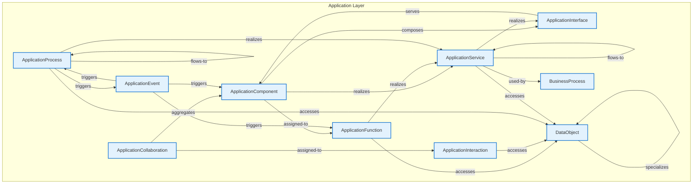

# Application Layer - Intra-Layer Relationships

## Overview

**Purpose**: Define semantic links between entities WITHIN this layer, capturing
structural composition, behavioral dependencies, and influence relationships.

**Layer ID**: `04-application`
**Analysis Date**: Generated automatically
**Validation**: Uses MarkdownLayerParser for closed-loop validation

---

### Relationship Diagram

## Layer Summary

### Entity Coverage (Target: 2+ relationships per entity)

- **Entities Meeting Target**: 9/9
- **Entity Coverage**: 100.0%

### Coverage Matrix

| Entity                   | Outgoing | Incoming | Total  | Meets Target | Status     |
| ------------------------ | -------- | -------- | ------ | ------------ | ---------- |
| ApplicationCollaboration | 2        | 0        | 2      | ✓            | Complete   |
| ApplicationComponent     | 3        | 3        | 6      | ✓            | Complete   |
| ApplicationEvent         | 3        | 1        | 4      | ✓            | Complete   |
| ApplicationFunction      | 2        | 2        | 4      | ✓            | Complete   |
| ApplicationInteraction   | 1        | 1        | 2      | ✓            | Complete   |
| ApplicationInterface     | 1        | 2        | 3      | ✓            | Complete   |
| ApplicationProcess       | 5        | 3        | 8      | ✓            | Complete   |
| ApplicationService       | 4        | 4        | 8      | ✓            | Complete   |
| DataObject               | 1        | 5        | 6      | ✓            | Complete   |
| **TOTAL**                | **-**    | **-**    | **43** | **9/9**      | **100.0%** |

### Relationship Statistics

- **Total Unique Relationships**: 22
- **Total Connections (Entity Perspective)**: 43
- **Average Connections per Entity**: 4.8
- **Entity Coverage Target**: 2+ relationships

## Entity: ApplicationCollaboration

**Definition**: Aggregate of application components working together

### Outgoing Relationships (ApplicationCollaboration → Other Entities)

| Relationship Type | Target Entity          | Predicate     | Status     | Source                                                         | In Catalog | Documented                                                   |
| ----------------- | ---------------------- | ------------- | ---------- | -------------------------------------------------------------- | ---------- | ------------------------------------------------------------ |
| aggregates        | ApplicationComponent   | `aggregates`  | Documented | [Doc](../../spec/layers/04-application-layer.md#relationships) | ✓          | [✓](../../spec/layers/04-application-layer.md#relationships) |
| assigned to       | ApplicationInteraction | `assigned-to` | Documented | [Doc](../../spec/layers/04-application-layer.md#relationships) | ✓          | [✓](../../spec/layers/04-application-layer.md#relationships) |

### Incoming Relationships (Other Entities → ApplicationCollaboration)

_No incoming intra-layer relationships documented._

### Relationship Summary

- **Total Relationships**: 2
- **Outgoing**: 2
- **Incoming**: 0
- **Documented**: 2/2
- **With XML Examples**: 0/2
- **In Catalog**: 2/2

---

## Entity: ApplicationComponent

**Definition**: Modular, deployable, and replaceable part of a system

### Outgoing Relationships (ApplicationComponent → Other Entities)

| Relationship Type | Target Entity        | Predicate     | Status     | Source                                                         | In Catalog | Documented                                                   |
| ----------------- | -------------------- | ------------- | ---------- | -------------------------------------------------------------- | ---------- | ------------------------------------------------------------ |
| assigned to       | ApplicationFunction  | `assigned-to` | Documented | [Doc](../../spec/layers/04-application-layer.md#relationships) | ✓          | [✓](../../spec/layers/04-application-layer.md#relationships) |
| composes          | ApplicationInterface | `composes`    | Documented | [Doc](../../spec/layers/04-application-layer.md#relationships) | ✓          | [✓](../../spec/layers/04-application-layer.md#relationships) |
| realizes          | ApplicationService   | `realizes`    | Documented | [Doc](../../spec/layers/04-application-layer.md#relationships) | ✓          | [✓](../../spec/layers/04-application-layer.md#relationships) |

### Incoming Relationships (Other Entities → ApplicationComponent)

| Relationship Type | Source Entity            | Predicate    | Status     | Source                                                         | In Catalog | Documented                                                   |
| ----------------- | ------------------------ | ------------ | ---------- | -------------------------------------------------------------- | ---------- | ------------------------------------------------------------ |
| aggregates        | ApplicationCollaboration | `aggregates` | Documented | [Doc](../../spec/layers/04-application-layer.md#relationships) | ✓          | [✓](../../spec/layers/04-application-layer.md#relationships) |
| triggers          | ApplicationEvent         | `triggers`   | Documented | [Doc](../../spec/layers/04-application-layer.md#relationships) | ✓          | [✓](../../spec/layers/04-application-layer.md#relationships) |
| serves            | ApplicationInterface     | `serves`     | Documented | [Doc](../../spec/layers/04-application-layer.md#relationships) | ✓          | [✓](../../spec/layers/04-application-layer.md#relationships) |

### Relationship Summary

- **Total Relationships**: 6
- **Outgoing**: 3
- **Incoming**: 3
- **Documented**: 6/6
- **With XML Examples**: 0/6
- **In Catalog**: 6/6

---

## Entity: ApplicationEvent

**Definition**: Application state change notification

### Outgoing Relationships (ApplicationEvent → Other Entities)

| Relationship Type | Target Entity        | Predicate  | Status     | Source                                                         | In Catalog | Documented                                                   |
| ----------------- | -------------------- | ---------- | ---------- | -------------------------------------------------------------- | ---------- | ------------------------------------------------------------ |
| triggers          | ApplicationComponent | `triggers` | Documented | [Doc](../../spec/layers/04-application-layer.md#relationships) | ✓          | [✓](../../spec/layers/04-application-layer.md#relationships) |
| triggers          | ApplicationFunction  | `triggers` | Documented | [Doc](../../spec/layers/04-application-layer.md#relationships) | ✓          | [✓](../../spec/layers/04-application-layer.md#relationships) |
| triggers          | ApplicationProcess   | `triggers` | Documented | [Doc](../../spec/layers/04-application-layer.md#relationships) | ✓          | [✓](../../spec/layers/04-application-layer.md#relationships) |

### Incoming Relationships (Other Entities → ApplicationEvent)

| Relationship Type | Source Entity      | Predicate  | Status     | Source                                                         | In Catalog | Documented                                                   |
| ----------------- | ------------------ | ---------- | ---------- | -------------------------------------------------------------- | ---------- | ------------------------------------------------------------ |
| triggers          | ApplicationProcess | `triggers` | Documented | [Doc](../../spec/layers/04-application-layer.md#relationships) | ✓          | [✓](../../spec/layers/04-application-layer.md#relationships) |

### Relationship Summary

- **Total Relationships**: 4
- **Outgoing**: 3
- **Incoming**: 1
- **Documented**: 4/4
- **With XML Examples**: 0/4
- **In Catalog**: 4/4

---

## Entity: ApplicationFunction

**Definition**: Automated behavior performed by application component

### Outgoing Relationships (ApplicationFunction → Other Entities)

| Relationship Type | Target Entity      | Predicate  | Status     | Source                                                         | In Catalog | Documented                                                   |
| ----------------- | ------------------ | ---------- | ---------- | -------------------------------------------------------------- | ---------- | ------------------------------------------------------------ |
| realizes          | ApplicationService | `realizes` | Documented | [Doc](../../spec/layers/04-application-layer.md#relationships) | ✓          | [✓](../../spec/layers/04-application-layer.md#relationships) |
| accesses          | DataObject         | `accesses` | Documented | [Doc](../../spec/layers/04-application-layer.md#relationships) | ✓          | [✓](../../spec/layers/04-application-layer.md#relationships) |

### Incoming Relationships (Other Entities → ApplicationFunction)

| Relationship Type | Source Entity        | Predicate     | Status     | Source                                                         | In Catalog | Documented                                                   |
| ----------------- | -------------------- | ------------- | ---------- | -------------------------------------------------------------- | ---------- | ------------------------------------------------------------ |
| assigned to       | ApplicationComponent | `assigned-to` | Documented | [Doc](../../spec/layers/04-application-layer.md#relationships) | ✓          | [✓](../../spec/layers/04-application-layer.md#relationships) |
| triggers          | ApplicationEvent     | `triggers`    | Documented | [Doc](../../spec/layers/04-application-layer.md#relationships) | ✓          | [✓](../../spec/layers/04-application-layer.md#relationships) |

### Relationship Summary

- **Total Relationships**: 4
- **Outgoing**: 2
- **Incoming**: 2
- **Documented**: 4/4
- **With XML Examples**: 0/4
- **In Catalog**: 4/4

---

## Entity: ApplicationInteraction

**Definition**: Unit of collective application behavior

### Outgoing Relationships (ApplicationInteraction → Other Entities)

| Relationship Type | Target Entity | Predicate  | Status     | Source                                                         | In Catalog | Documented                                                   |
| ----------------- | ------------- | ---------- | ---------- | -------------------------------------------------------------- | ---------- | ------------------------------------------------------------ |
| accesses          | DataObject    | `accesses` | Documented | [Doc](../../spec/layers/04-application-layer.md#relationships) | ✓          | [✓](../../spec/layers/04-application-layer.md#relationships) |

### Incoming Relationships (Other Entities → ApplicationInteraction)

| Relationship Type | Source Entity            | Predicate     | Status     | Source                                                         | In Catalog | Documented                                                   |
| ----------------- | ------------------------ | ------------- | ---------- | -------------------------------------------------------------- | ---------- | ------------------------------------------------------------ |
| assigned to       | ApplicationCollaboration | `assigned-to` | Documented | [Doc](../../spec/layers/04-application-layer.md#relationships) | ✓          | [✓](../../spec/layers/04-application-layer.md#relationships) |

### Relationship Summary

- **Total Relationships**: 2
- **Outgoing**: 1
- **Incoming**: 1
- **Documented**: 2/2
- **With XML Examples**: 0/2
- **In Catalog**: 2/2

---

## Entity: ApplicationInterface

**Definition**: Point of access where application service is available

### Outgoing Relationships (ApplicationInterface → Other Entities)

| Relationship Type | Target Entity        | Predicate | Status     | Source                                                         | In Catalog | Documented                                                   |
| ----------------- | -------------------- | --------- | ---------- | -------------------------------------------------------------- | ---------- | ------------------------------------------------------------ |
| serves            | ApplicationComponent | `serves`  | Documented | [Doc](../../spec/layers/04-application-layer.md#relationships) | ✓          | [✓](../../spec/layers/04-application-layer.md#relationships) |

### Incoming Relationships (Other Entities → ApplicationInterface)

| Relationship Type | Source Entity        | Predicate  | Status     | Source                                                         | In Catalog | Documented                                                   |
| ----------------- | -------------------- | ---------- | ---------- | -------------------------------------------------------------- | ---------- | ------------------------------------------------------------ |
| composes          | ApplicationComponent | `composes` | Documented | [Doc](../../spec/layers/04-application-layer.md#relationships) | ✓          | [✓](../../spec/layers/04-application-layer.md#relationships) |
| realizes          | ApplicationService   | `realizes` | Documented | [Doc](../../spec/layers/04-application-layer.md#relationships) | ✓          | [✓](../../spec/layers/04-application-layer.md#relationships) |

### Relationship Summary

- **Total Relationships**: 3
- **Outgoing**: 1
- **Incoming**: 2
- **Documented**: 3/3
- **With XML Examples**: 0/3
- **In Catalog**: 3/3

---

## Entity: ApplicationProcess

**Definition**: Sequence of application behaviors

### Outgoing Relationships (ApplicationProcess → Other Entities)

| Relationship Type | Target Entity      | Predicate  | Status     | Source                                                         | In Catalog | Documented                                                   |
| ----------------- | ------------------ | ---------- | ---------- | -------------------------------------------------------------- | ---------- | ------------------------------------------------------------ |
| triggers          | ApplicationEvent   | `triggers` | Documented | [Doc](../../spec/layers/04-application-layer.md#relationships) | ✓          | [✓](../../spec/layers/04-application-layer.md#relationships) |
| composes          | ApplicationProcess | `composes` | Documented | [Doc](../../spec/layers/04-application-layer.md#relationships) | ✓          | [✓](../../spec/layers/04-application-layer.md#relationships) |
| flows to          | ApplicationProcess | `flows-to` | Documented | [Doc](../../spec/layers/04-application-layer.md#relationships) | ✓          | [✓](../../spec/layers/04-application-layer.md#relationships) |
| realizes          | ApplicationService | `realizes` | Documented | [Doc](../../spec/layers/04-application-layer.md#relationships) | ✓          | [✓](../../spec/layers/04-application-layer.md#relationships) |
| accesses          | DataObject         | `accesses` | Documented | [Doc](../../spec/layers/04-application-layer.md#relationships) | ✓          | [✓](../../spec/layers/04-application-layer.md#relationships) |

### Incoming Relationships (Other Entities → ApplicationProcess)

| Relationship Type | Source Entity      | Predicate  | Status     | Source                                                         | In Catalog | Documented                                                   |
| ----------------- | ------------------ | ---------- | ---------- | -------------------------------------------------------------- | ---------- | ------------------------------------------------------------ |
| triggers          | ApplicationEvent   | `triggers` | Documented | [Doc](../../spec/layers/04-application-layer.md#relationships) | ✓          | [✓](../../spec/layers/04-application-layer.md#relationships) |
| composes          | ApplicationProcess | `composes` | Documented | [Doc](../../spec/layers/04-application-layer.md#relationships) | ✓          | [✓](../../spec/layers/04-application-layer.md#relationships) |
| flows to          | ApplicationProcess | `flows-to` | Documented | [Doc](../../spec/layers/04-application-layer.md#relationships) | ✓          | [✓](../../spec/layers/04-application-layer.md#relationships) |

### Relationship Summary

- **Total Relationships**: 8
- **Outgoing**: 5
- **Incoming**: 3
- **Documented**: 8/8
- **With XML Examples**: 0/8
- **In Catalog**: 8/8

---

## Entity: ApplicationService

**Definition**: Service that exposes application functionality

### Outgoing Relationships (ApplicationService → Other Entities)

| Relationship Type | Target Entity        | Predicate  | Status     | Source                                                         | In Catalog | Documented                                                   |
| ----------------- | -------------------- | ---------- | ---------- | -------------------------------------------------------------- | ---------- | ------------------------------------------------------------ |
| realizes          | ApplicationInterface | `realizes` | Documented | [Doc](../../spec/layers/04-application-layer.md#relationships) | ✓          | [✓](../../spec/layers/04-application-layer.md#relationships) |
| flows to          | ApplicationService   | `flows-to` | Documented | [Doc](../../spec/layers/04-application-layer.md#relationships) | ✓          | [✓](../../spec/layers/04-application-layer.md#relationships) |
| used by           | BusinessProcess      | `used-by`  | Documented | [Doc](../../spec/layers/04-application-layer.md#relationships) | ✓          | [✓](../../spec/layers/04-application-layer.md#relationships) |
| accesses          | DataObject           | `accesses` | Documented | [Doc](../../spec/layers/04-application-layer.md#relationships) | ✓          | [✓](../../spec/layers/04-application-layer.md#relationships) |

### Incoming Relationships (Other Entities → ApplicationService)

| Relationship Type | Source Entity        | Predicate  | Status     | Source                                                         | In Catalog | Documented                                                   |
| ----------------- | -------------------- | ---------- | ---------- | -------------------------------------------------------------- | ---------- | ------------------------------------------------------------ |
| realizes          | ApplicationComponent | `realizes` | Documented | [Doc](../../spec/layers/04-application-layer.md#relationships) | ✓          | [✓](../../spec/layers/04-application-layer.md#relationships) |
| realizes          | ApplicationFunction  | `realizes` | Documented | [Doc](../../spec/layers/04-application-layer.md#relationships) | ✓          | [✓](../../spec/layers/04-application-layer.md#relationships) |
| realizes          | ApplicationProcess   | `realizes` | Documented | [Doc](../../spec/layers/04-application-layer.md#relationships) | ✓          | [✓](../../spec/layers/04-application-layer.md#relationships) |
| flows to          | ApplicationService   | `flows-to` | Documented | [Doc](../../spec/layers/04-application-layer.md#relationships) | ✓          | [✓](../../spec/layers/04-application-layer.md#relationships) |

### Relationship Summary

- **Total Relationships**: 8
- **Outgoing**: 4
- **Incoming**: 4
- **Documented**: 8/8
- **With XML Examples**: 0/8
- **In Catalog**: 8/8

---

## Entity: DataObject

**Definition**: Data structured for automated processing

### Outgoing Relationships (DataObject → Other Entities)

| Relationship Type | Target Entity | Predicate     | Status     | Source                                                         | In Catalog | Documented                                                   |
| ----------------- | ------------- | ------------- | ---------- | -------------------------------------------------------------- | ---------- | ------------------------------------------------------------ |
| specializes       | DataObject    | `specializes` | Documented | [Doc](../../spec/layers/04-application-layer.md#relationships) | ✓          | [✓](../../spec/layers/04-application-layer.md#relationships) |

### Incoming Relationships (Other Entities → DataObject)

| Relationship Type | Source Entity          | Predicate     | Status     | Source                                                         | In Catalog | Documented                                                   |
| ----------------- | ---------------------- | ------------- | ---------- | -------------------------------------------------------------- | ---------- | ------------------------------------------------------------ |
| accesses          | ApplicationFunction    | `accesses`    | Documented | [Doc](../../spec/layers/04-application-layer.md#relationships) | ✓          | [✓](../../spec/layers/04-application-layer.md#relationships) |
| accesses          | ApplicationInteraction | `accesses`    | Documented | [Doc](../../spec/layers/04-application-layer.md#relationships) | ✓          | [✓](../../spec/layers/04-application-layer.md#relationships) |
| accesses          | ApplicationProcess     | `accesses`    | Documented | [Doc](../../spec/layers/04-application-layer.md#relationships) | ✓          | [✓](../../spec/layers/04-application-layer.md#relationships) |
| accesses          | ApplicationService     | `accesses`    | Documented | [Doc](../../spec/layers/04-application-layer.md#relationships) | ✓          | [✓](../../spec/layers/04-application-layer.md#relationships) |
| specializes       | DataObject             | `specializes` | Documented | [Doc](../../spec/layers/04-application-layer.md#relationships) | ✓          | [✓](../../spec/layers/04-application-layer.md#relationships) |

### Relationship Summary

- **Total Relationships**: 6
- **Outgoing**: 1
- **Incoming**: 5
- **Documented**: 6/6
- **With XML Examples**: 0/6
- **In Catalog**: 6/6

---
