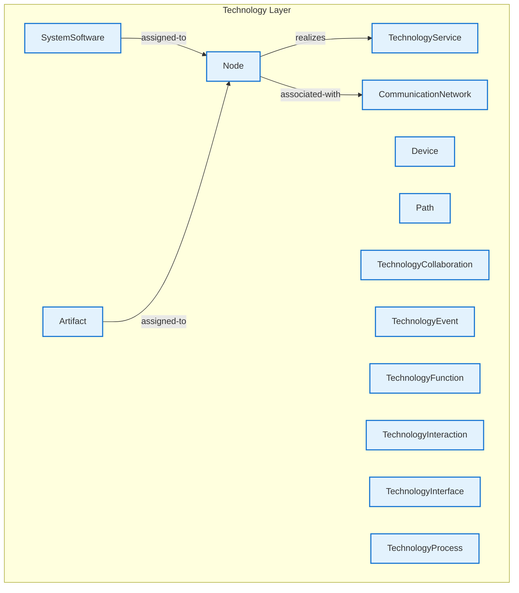

# Technology Layer - Intra-Layer Relationships

## Overview

**Purpose**: Define semantic links between entities WITHIN this layer, capturing
structural composition, behavioral dependencies, and influence relationships.

**Layer ID**: `05-technology`
**Analysis Date**: Generated automatically
**Validation**: Uses MarkdownLayerParser for closed-loop validation

---

### Relationship Diagram

## Layer Summary

### Entity Coverage (Target: 2+ relationships per entity)

- **Entities Meeting Target**: 1/13
- **Entity Coverage**: 7.7%

**Entities Below Target**:

- Device: 0 relationship(s) (needs 2 more)
- TechnologyCollaboration: 0 relationship(s) (needs 2 more)
- TechnologyInterface: 0 relationship(s) (needs 2 more)
- Path: 0 relationship(s) (needs 2 more)
- TechnologyFunction: 0 relationship(s) (needs 2 more)
- TechnologyProcess: 0 relationship(s) (needs 2 more)
- TechnologyInteraction: 0 relationship(s) (needs 2 more)
- TechnologyEvent: 0 relationship(s) (needs 2 more)
- SystemSoftware: 1 relationship(s) (needs 1 more)
- CommunicationNetwork: 1 relationship(s) (needs 1 more)
- TechnologyService: 1 relationship(s) (needs 1 more)
- Artifact: 1 relationship(s) (needs 1 more)

### Coverage Matrix

| Entity                  | Outgoing | Incoming | Total | Meets Target | Status   |
| ----------------------- | -------- | -------- | ----- | ------------ | -------- |
| Artifact                | 1        | 0        | 1     | ✗            | Needs 1  |
| CommunicationNetwork    | 0        | 1        | 1     | ✗            | Needs 1  |
| Device                  | 0        | 0        | 0     | ✗            | Needs 2  |
| Node                    | 2        | 2        | 4     | ✓            | Complete |
| Path                    | 0        | 0        | 0     | ✗            | Needs 2  |
| SystemSoftware          | 1        | 0        | 1     | ✗            | Needs 1  |
| TechnologyCollaboration | 0        | 0        | 0     | ✗            | Needs 2  |
| TechnologyEvent         | 0        | 0        | 0     | ✗            | Needs 2  |
| TechnologyFunction      | 0        | 0        | 0     | ✗            | Needs 2  |
| TechnologyInteraction   | 0        | 0        | 0     | ✗            | Needs 2  |
| TechnologyInterface     | 0        | 0        | 0     | ✗            | Needs 2  |
| TechnologyProcess       | 0        | 0        | 0     | ✗            | Needs 2  |
| TechnologyService       | 0        | 1        | 1     | ✗            | Needs 1  |
| **TOTAL**               | **-**    | **-**    | **8** | **1/13**     | **7.7%** |

### Relationship Statistics

- **Total Unique Relationships**: 4
- **Total Connections (Entity Perspective)**: 8
- **Average Connections per Entity**: 0.6
- **Entity Coverage Target**: 2+ relationships

## Entity: Artifact

**Definition**: Physical piece of data used or produced

### Outgoing Relationships (Artifact → Other Entities)

| Relationship Type | Target Entity | Predicate     | Status | Source                                                        | In Catalog | Documented |
| ----------------- | ------------- | ------------- | ------ | ------------------------------------------------------------- | ---------- | ---------- |
| assignment        | Node          | `assigned-to` | XML    | [XML](../../spec/layers/05-technology-layer.md#example-model) | ✓          | ✗          |

### Incoming Relationships (Other Entities → Artifact)

_No incoming intra-layer relationships documented._

### Relationship Summary

- **Total Relationships**: 1
- **Outgoing**: 1
- **Incoming**: 0
- **Documented**: 0/1
- **With XML Examples**: 1/1
- **In Catalog**: 1/1

---

## Entity: CommunicationNetwork

**Definition**: Set of structures that connects nodes

### Outgoing Relationships (CommunicationNetwork → Other Entities)

_No outgoing intra-layer relationships documented._

### Incoming Relationships (Other Entities → CommunicationNetwork)

| Relationship Type | Source Entity | Predicate         | Status | Source                                                        | In Catalog | Documented |
| ----------------- | ------------- | ----------------- | ------ | ------------------------------------------------------------- | ---------- | ---------- |
| association       | Node          | `associated-with` | XML    | [XML](../../spec/layers/05-technology-layer.md#example-model) | ✓          | ✗          |

### Relationship Summary

- **Total Relationships**: 1
- **Outgoing**: 0
- **Incoming**: 1
- **Documented**: 0/1
- **With XML Examples**: 1/1
- **In Catalog**: 1/1

---

## Entity: Device

**Definition**: Physical IT resource with processing capability

### Outgoing Relationships (Device → Other Entities)

_No outgoing intra-layer relationships documented._

### Incoming Relationships (Other Entities → Device)

_No incoming intra-layer relationships documented._

### Relationship Summary

- **Total Relationships**: 0
- **Outgoing**: 0
- **Incoming**: 0
- **Documented**: 0/0
- **With XML Examples**: 0/0
- **In Catalog**: 0/0

---

## Entity: Node

**Definition**: Computational or physical resource that hosts artifacts

### Outgoing Relationships (Node → Other Entities)

| Relationship Type | Target Entity        | Predicate         | Status | Source                                                        | In Catalog | Documented |
| ----------------- | -------------------- | ----------------- | ------ | ------------------------------------------------------------- | ---------- | ---------- |
| association       | CommunicationNetwork | `associated-with` | XML    | [XML](../../spec/layers/05-technology-layer.md#example-model) | ✓          | ✗          |
| realization       | TechnologyService    | `realizes`        | XML    | [XML](../../spec/layers/05-technology-layer.md#example-model) | ✓          | ✗          |

### Incoming Relationships (Other Entities → Node)

| Relationship Type | Source Entity  | Predicate     | Status | Source                                                        | In Catalog | Documented |
| ----------------- | -------------- | ------------- | ------ | ------------------------------------------------------------- | ---------- | ---------- |
| assignment        | Artifact       | `assigned-to` | XML    | [XML](../../spec/layers/05-technology-layer.md#example-model) | ✓          | ✗          |
| assignment        | SystemSoftware | `assigned-to` | XML    | [XML](../../spec/layers/05-technology-layer.md#example-model) | ✓          | ✗          |

### Relationship Summary

- **Total Relationships**: 4
- **Outgoing**: 2
- **Incoming**: 2
- **Documented**: 0/4
- **With XML Examples**: 4/4
- **In Catalog**: 4/4

---

## Entity: Path

**Definition**: Link between nodes through which they exchange

### Outgoing Relationships (Path → Other Entities)

_No outgoing intra-layer relationships documented._

### Incoming Relationships (Other Entities → Path)

_No incoming intra-layer relationships documented._

### Relationship Summary

- **Total Relationships**: 0
- **Outgoing**: 0
- **Incoming**: 0
- **Documented**: 0/0
- **With XML Examples**: 0/0
- **In Catalog**: 0/0

---

## Entity: SystemSoftware

**Definition**: Software that provides platform for applications

### Outgoing Relationships (SystemSoftware → Other Entities)

| Relationship Type | Target Entity | Predicate     | Status | Source                                                        | In Catalog | Documented |
| ----------------- | ------------- | ------------- | ------ | ------------------------------------------------------------- | ---------- | ---------- |
| assignment        | Node          | `assigned-to` | XML    | [XML](../../spec/layers/05-technology-layer.md#example-model) | ✓          | ✗          |

### Incoming Relationships (Other Entities → SystemSoftware)

_No incoming intra-layer relationships documented._

### Relationship Summary

- **Total Relationships**: 1
- **Outgoing**: 1
- **Incoming**: 0
- **Documented**: 0/1
- **With XML Examples**: 1/1
- **In Catalog**: 1/1

---

## Entity: TechnologyCollaboration

**Definition**: Aggregate of nodes working together

### Outgoing Relationships (TechnologyCollaboration → Other Entities)

_No outgoing intra-layer relationships documented._

### Incoming Relationships (Other Entities → TechnologyCollaboration)

_No incoming intra-layer relationships documented._

### Relationship Summary

- **Total Relationships**: 0
- **Outgoing**: 0
- **Incoming**: 0
- **Documented**: 0/0
- **With XML Examples**: 0/0
- **In Catalog**: 0/0

---

## Entity: TechnologyEvent

**Definition**: Technology state change

### Outgoing Relationships (TechnologyEvent → Other Entities)

_No outgoing intra-layer relationships documented._

### Incoming Relationships (Other Entities → TechnologyEvent)

_No incoming intra-layer relationships documented._

### Relationship Summary

- **Total Relationships**: 0
- **Outgoing**: 0
- **Incoming**: 0
- **Documented**: 0/0
- **With XML Examples**: 0/0
- **In Catalog**: 0/0

---

## Entity: TechnologyFunction

**Definition**: Collection of technology behavior

### Outgoing Relationships (TechnologyFunction → Other Entities)

_No outgoing intra-layer relationships documented._

### Incoming Relationships (Other Entities → TechnologyFunction)

_No incoming intra-layer relationships documented._

### Relationship Summary

- **Total Relationships**: 0
- **Outgoing**: 0
- **Incoming**: 0
- **Documented**: 0/0
- **With XML Examples**: 0/0
- **In Catalog**: 0/0

---

## Entity: TechnologyInteraction

**Definition**: Unit of collective technology behavior

### Outgoing Relationships (TechnologyInteraction → Other Entities)

_No outgoing intra-layer relationships documented._

### Incoming Relationships (Other Entities → TechnologyInteraction)

_No incoming intra-layer relationships documented._

### Relationship Summary

- **Total Relationships**: 0
- **Outgoing**: 0
- **Incoming**: 0
- **Documented**: 0/0
- **With XML Examples**: 0/0
- **In Catalog**: 0/0

---

## Entity: TechnologyInterface

**Definition**: Point of access where technology services are available

### Outgoing Relationships (TechnologyInterface → Other Entities)

_No outgoing intra-layer relationships documented._

### Incoming Relationships (Other Entities → TechnologyInterface)

_No incoming intra-layer relationships documented._

### Relationship Summary

- **Total Relationships**: 0
- **Outgoing**: 0
- **Incoming**: 0
- **Documented**: 0/0
- **With XML Examples**: 0/0
- **In Catalog**: 0/0

---

## Entity: TechnologyProcess

**Definition**: Sequence of technology behaviors

### Outgoing Relationships (TechnologyProcess → Other Entities)

_No outgoing intra-layer relationships documented._

### Incoming Relationships (Other Entities → TechnologyProcess)

_No incoming intra-layer relationships documented._

### Relationship Summary

- **Total Relationships**: 0
- **Outgoing**: 0
- **Incoming**: 0
- **Documented**: 0/0
- **With XML Examples**: 0/0
- **In Catalog**: 0/0

---

## Entity: TechnologyService

**Definition**: Externally visible unit of technology functionality

### Outgoing Relationships (TechnologyService → Other Entities)

_No outgoing intra-layer relationships documented._

### Incoming Relationships (Other Entities → TechnologyService)

| Relationship Type | Source Entity | Predicate  | Status | Source                                                        | In Catalog | Documented |
| ----------------- | ------------- | ---------- | ------ | ------------------------------------------------------------- | ---------- | ---------- |
| realization       | Node          | `realizes` | XML    | [XML](../../spec/layers/05-technology-layer.md#example-model) | ✓          | ✗          |

### Relationship Summary

- **Total Relationships**: 1
- **Outgoing**: 0
- **Incoming**: 1
- **Documented**: 0/1
- **With XML Examples**: 1/1
- **In Catalog**: 1/1

---
