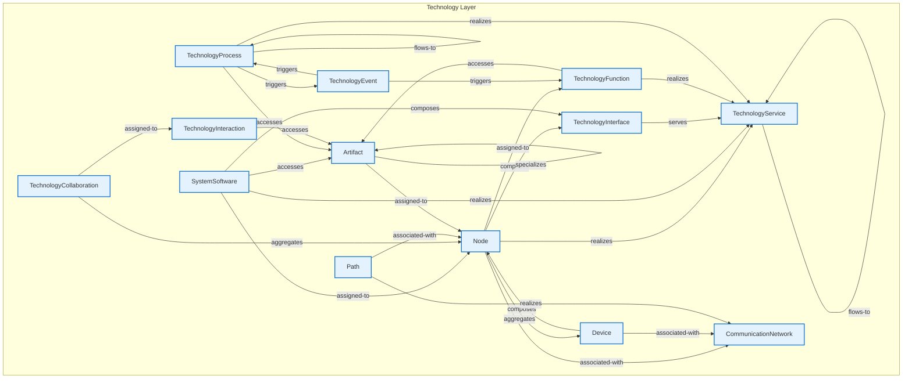

# Technology Layer - Intra-Layer Relationships

## Overview

**Purpose**: Define semantic links between entities WITHIN this layer, capturing
structural composition, behavioral dependencies, and influence relationships.

**Layer ID**: `05-technology`
**Analysis Date**: Generated automatically
**Validation**: Uses MarkdownLayerParser for closed-loop validation

---

### Relationship Diagram

## Layer Summary

### Entity Coverage (Target: 2+ relationships per entity)

- **Entities Meeting Target**: 13/13
- **Entity Coverage**: 100.0%

### Coverage Matrix

| Entity                  | Outgoing | Incoming | Total  | Meets Target | Status     |
| ----------------------- | -------- | -------- | ------ | ------------ | ---------- |
| Artifact                | 2        | 5        | 7      | ✓            | Complete   |
| CommunicationNetwork    | 0        | 3        | 3      | ✓            | Complete   |
| Device                  | 2        | 1        | 3      | ✓            | Complete   |
| Node                    | 5        | 5        | 10     | ✓            | Complete   |
| Path                    | 2        | 0        | 2      | ✓            | Complete   |
| SystemSoftware          | 4        | 0        | 4      | ✓            | Complete   |
| TechnologyCollaboration | 2        | 0        | 2      | ✓            | Complete   |
| TechnologyEvent         | 2        | 1        | 3      | ✓            | Complete   |
| TechnologyFunction      | 2        | 2        | 4      | ✓            | Complete   |
| TechnologyInteraction   | 1        | 1        | 2      | ✓            | Complete   |
| TechnologyInterface     | 1        | 2        | 3      | ✓            | Complete   |
| TechnologyProcess       | 4        | 2        | 6      | ✓            | Complete   |
| TechnologyService       | 1        | 6        | 7      | ✓            | Complete   |
| **TOTAL**               | **-**    | **-**    | **56** | **13/13**    | **100.0%** |

### Relationship Statistics

- **Total Unique Relationships**: 28
- **Total Connections (Entity Perspective)**: 56
- **Average Connections per Entity**: 4.3
- **Entity Coverage Target**: 2+ relationships

## Entity: Artifact

**Definition**: Physical piece of data used or produced

### Outgoing Relationships (Artifact → Other Entities)

| Relationship Type | Target Entity | Predicate     | Status           | Source                                                        | In Catalog | Documented                                                  |
| ----------------- | ------------- | ------------- | ---------------- | ------------------------------------------------------------- | ---------- | ----------------------------------------------------------- |
| specialization    | Artifact      | `specializes` | Documented + XML | [Doc](../../spec/layers/05-technology-layer.md#relationships) | ✓          | [✓](../../spec/layers/05-technology-layer.md#relationships) |
| assignment        | Node          | `assigned-to` | XML              | [XML](../../spec/layers/05-technology-layer.md#example-model) | ✓          | ✗                                                           |

### Incoming Relationships (Other Entities → Artifact)

| Relationship Type | Source Entity         | Predicate     | Status           | Source                                                        | In Catalog | Documented                                                  |
| ----------------- | --------------------- | ------------- | ---------------- | ------------------------------------------------------------- | ---------- | ----------------------------------------------------------- |
| specialization    | Artifact              | `specializes` | Documented + XML | [Doc](../../spec/layers/05-technology-layer.md#relationships) | ✓          | [✓](../../spec/layers/05-technology-layer.md#relationships) |
| access            | SystemSoftware        | `accesses`    | Documented + XML | [Doc](../../spec/layers/05-technology-layer.md#relationships) | ✓          | [✓](../../spec/layers/05-technology-layer.md#relationships) |
| access            | TechnologyFunction    | `accesses`    | Documented + XML | [Doc](../../spec/layers/05-technology-layer.md#relationships) | ✓          | [✓](../../spec/layers/05-technology-layer.md#relationships) |
| access            | TechnologyInteraction | `accesses`    | Documented + XML | [Doc](../../spec/layers/05-technology-layer.md#relationships) | ✓          | [✓](../../spec/layers/05-technology-layer.md#relationships) |
| access            | TechnologyProcess     | `accesses`    | Documented + XML | [Doc](../../spec/layers/05-technology-layer.md#relationships) | ✓          | [✓](../../spec/layers/05-technology-layer.md#relationships) |

### Relationship Summary

- **Total Relationships**: 7
- **Outgoing**: 2
- **Incoming**: 5
- **Documented**: 6/7
- **With XML Examples**: 7/7
- **In Catalog**: 7/7

---

## Entity: CommunicationNetwork

**Definition**: Set of structures that connects nodes

### Outgoing Relationships (CommunicationNetwork → Other Entities)

_No outgoing intra-layer relationships documented._

### Incoming Relationships (Other Entities → CommunicationNetwork)

| Relationship Type | Source Entity | Predicate         | Status           | Source                                                        | In Catalog | Documented                                                  |
| ----------------- | ------------- | ----------------- | ---------------- | ------------------------------------------------------------- | ---------- | ----------------------------------------------------------- |
| association       | Device        | `associated-with` | Documented + XML | [Doc](../../spec/layers/05-technology-layer.md#relationships) | ✓          | [✓](../../spec/layers/05-technology-layer.md#relationships) |
| association       | Node          | `associated-with` | XML              | [XML](../../spec/layers/05-technology-layer.md#example-model) | ✓          | ✗                                                           |
| realization       | Path          | `realizes`        | Documented + XML | [Doc](../../spec/layers/05-technology-layer.md#relationships) | ✓          | [✓](../../spec/layers/05-technology-layer.md#relationships) |

### Relationship Summary

- **Total Relationships**: 3
- **Outgoing**: 0
- **Incoming**: 3
- **Documented**: 2/3
- **With XML Examples**: 3/3
- **In Catalog**: 3/3

---

## Entity: Device

**Definition**: Physical IT resource with processing capability

### Outgoing Relationships (Device → Other Entities)

| Relationship Type | Target Entity        | Predicate         | Status           | Source                                                        | In Catalog | Documented                                                  |
| ----------------- | -------------------- | ----------------- | ---------------- | ------------------------------------------------------------- | ---------- | ----------------------------------------------------------- |
| association       | CommunicationNetwork | `associated-with` | Documented + XML | [Doc](../../spec/layers/05-technology-layer.md#relationships) | ✓          | [✓](../../spec/layers/05-technology-layer.md#relationships) |
| composition       | Node                 | `composes`        | Documented + XML | [Doc](../../spec/layers/05-technology-layer.md#relationships) | ✓          | [✓](../../spec/layers/05-technology-layer.md#relationships) |

### Incoming Relationships (Other Entities → Device)

| Relationship Type | Source Entity | Predicate    | Status           | Source                                                        | In Catalog | Documented                                                  |
| ----------------- | ------------- | ------------ | ---------------- | ------------------------------------------------------------- | ---------- | ----------------------------------------------------------- |
| aggregation       | Node          | `aggregates` | Documented + XML | [Doc](../../spec/layers/05-technology-layer.md#relationships) | ✓          | [✓](../../spec/layers/05-technology-layer.md#relationships) |

### Relationship Summary

- **Total Relationships**: 3
- **Outgoing**: 2
- **Incoming**: 1
- **Documented**: 3/3
- **With XML Examples**: 3/3
- **In Catalog**: 3/3

---

## Entity: Node

**Definition**: Computational or physical resource that hosts artifacts

### Outgoing Relationships (Node → Other Entities)

| Relationship Type | Target Entity        | Predicate         | Status           | Source                                                        | In Catalog | Documented                                                  |
| ----------------- | -------------------- | ----------------- | ---------------- | ------------------------------------------------------------- | ---------- | ----------------------------------------------------------- |
| association       | CommunicationNetwork | `associated-with` | XML              | [XML](../../spec/layers/05-technology-layer.md#example-model) | ✓          | ✗                                                           |
| aggregation       | Device               | `aggregates`      | Documented + XML | [Doc](../../spec/layers/05-technology-layer.md#relationships) | ✓          | [✓](../../spec/layers/05-technology-layer.md#relationships) |
| assignment        | TechnologyFunction   | `assigned-to`     | Documented + XML | [Doc](../../spec/layers/05-technology-layer.md#relationships) | ✓          | [✓](../../spec/layers/05-technology-layer.md#relationships) |
| composition       | TechnologyInterface  | `composes`        | Documented + XML | [Doc](../../spec/layers/05-technology-layer.md#relationships) | ✓          | [✓](../../spec/layers/05-technology-layer.md#relationships) |
| realization       | TechnologyService    | `realizes`        | XML              | [XML](../../spec/layers/05-technology-layer.md#example-model) | ✓          | ✗                                                           |

### Incoming Relationships (Other Entities → Node)

| Relationship Type | Source Entity           | Predicate         | Status           | Source                                                        | In Catalog | Documented                                                  |
| ----------------- | ----------------------- | ----------------- | ---------------- | ------------------------------------------------------------- | ---------- | ----------------------------------------------------------- |
| assignment        | Artifact                | `assigned-to`     | XML              | [XML](../../spec/layers/05-technology-layer.md#example-model) | ✓          | ✗                                                           |
| composition       | Device                  | `composes`        | Documented + XML | [Doc](../../spec/layers/05-technology-layer.md#relationships) | ✓          | [✓](../../spec/layers/05-technology-layer.md#relationships) |
| association       | Path                    | `associated-with` | Documented + XML | [Doc](../../spec/layers/05-technology-layer.md#relationships) | ✓          | [✓](../../spec/layers/05-technology-layer.md#relationships) |
| assignment        | SystemSoftware          | `assigned-to`     | XML              | [XML](../../spec/layers/05-technology-layer.md#example-model) | ✓          | ✗                                                           |
| aggregation       | TechnologyCollaboration | `aggregates`      | Documented + XML | [Doc](../../spec/layers/05-technology-layer.md#relationships) | ✓          | [✓](../../spec/layers/05-technology-layer.md#relationships) |

### Relationship Summary

- **Total Relationships**: 10
- **Outgoing**: 5
- **Incoming**: 5
- **Documented**: 6/10
- **With XML Examples**: 10/10
- **In Catalog**: 10/10

---

## Entity: Path

**Definition**: Link between nodes through which they exchange

### Outgoing Relationships (Path → Other Entities)

| Relationship Type | Target Entity        | Predicate         | Status           | Source                                                        | In Catalog | Documented                                                  |
| ----------------- | -------------------- | ----------------- | ---------------- | ------------------------------------------------------------- | ---------- | ----------------------------------------------------------- |
| realization       | CommunicationNetwork | `realizes`        | Documented + XML | [Doc](../../spec/layers/05-technology-layer.md#relationships) | ✓          | [✓](../../spec/layers/05-technology-layer.md#relationships) |
| association       | Node                 | `associated-with` | Documented + XML | [Doc](../../spec/layers/05-technology-layer.md#relationships) | ✓          | [✓](../../spec/layers/05-technology-layer.md#relationships) |

### Incoming Relationships (Other Entities → Path)

_No incoming intra-layer relationships documented._

### Relationship Summary

- **Total Relationships**: 2
- **Outgoing**: 2
- **Incoming**: 0
- **Documented**: 2/2
- **With XML Examples**: 2/2
- **In Catalog**: 2/2

---

## Entity: SystemSoftware

**Definition**: Software that provides platform for applications

### Outgoing Relationships (SystemSoftware → Other Entities)

| Relationship Type | Target Entity       | Predicate     | Status           | Source                                                        | In Catalog | Documented                                                  |
| ----------------- | ------------------- | ------------- | ---------------- | ------------------------------------------------------------- | ---------- | ----------------------------------------------------------- |
| access            | Artifact            | `accesses`    | Documented + XML | [Doc](../../spec/layers/05-technology-layer.md#relationships) | ✓          | [✓](../../spec/layers/05-technology-layer.md#relationships) |
| assignment        | Node                | `assigned-to` | XML              | [XML](../../spec/layers/05-technology-layer.md#example-model) | ✓          | ✗                                                           |
| composition       | TechnologyInterface | `composes`    | Documented + XML | [Doc](../../spec/layers/05-technology-layer.md#relationships) | ✓          | [✓](../../spec/layers/05-technology-layer.md#relationships) |
| realization       | TechnologyService   | `realizes`    | Documented + XML | [Doc](../../spec/layers/05-technology-layer.md#relationships) | ✓          | [✓](../../spec/layers/05-technology-layer.md#relationships) |

### Incoming Relationships (Other Entities → SystemSoftware)

_No incoming intra-layer relationships documented._

### Relationship Summary

- **Total Relationships**: 4
- **Outgoing**: 4
- **Incoming**: 0
- **Documented**: 3/4
- **With XML Examples**: 4/4
- **In Catalog**: 4/4

---

## Entity: TechnologyCollaboration

**Definition**: Aggregate of nodes working together

### Outgoing Relationships (TechnologyCollaboration → Other Entities)

| Relationship Type | Target Entity         | Predicate     | Status           | Source                                                        | In Catalog | Documented                                                  |
| ----------------- | --------------------- | ------------- | ---------------- | ------------------------------------------------------------- | ---------- | ----------------------------------------------------------- |
| aggregation       | Node                  | `aggregates`  | Documented + XML | [Doc](../../spec/layers/05-technology-layer.md#relationships) | ✓          | [✓](../../spec/layers/05-technology-layer.md#relationships) |
| assignment        | TechnologyInteraction | `assigned-to` | Documented + XML | [Doc](../../spec/layers/05-technology-layer.md#relationships) | ✓          | [✓](../../spec/layers/05-technology-layer.md#relationships) |

### Incoming Relationships (Other Entities → TechnologyCollaboration)

_No incoming intra-layer relationships documented._

### Relationship Summary

- **Total Relationships**: 2
- **Outgoing**: 2
- **Incoming**: 0
- **Documented**: 2/2
- **With XML Examples**: 2/2
- **In Catalog**: 2/2

---

## Entity: TechnologyEvent

**Definition**: Technology state change

### Outgoing Relationships (TechnologyEvent → Other Entities)

| Relationship Type | Target Entity      | Predicate  | Status           | Source                                                        | In Catalog | Documented                                                  |
| ----------------- | ------------------ | ---------- | ---------------- | ------------------------------------------------------------- | ---------- | ----------------------------------------------------------- |
| triggering        | TechnologyFunction | `triggers` | Documented + XML | [Doc](../../spec/layers/05-technology-layer.md#relationships) | ✓          | [✓](../../spec/layers/05-technology-layer.md#relationships) |
| triggering        | TechnologyProcess  | `triggers` | Documented + XML | [Doc](../../spec/layers/05-technology-layer.md#relationships) | ✓          | [✓](../../spec/layers/05-technology-layer.md#relationships) |

### Incoming Relationships (Other Entities → TechnologyEvent)

| Relationship Type | Source Entity     | Predicate  | Status           | Source                                                        | In Catalog | Documented                                                  |
| ----------------- | ----------------- | ---------- | ---------------- | ------------------------------------------------------------- | ---------- | ----------------------------------------------------------- |
| triggering        | TechnologyProcess | `triggers` | Documented + XML | [Doc](../../spec/layers/05-technology-layer.md#relationships) | ✓          | [✓](../../spec/layers/05-technology-layer.md#relationships) |

### Relationship Summary

- **Total Relationships**: 3
- **Outgoing**: 2
- **Incoming**: 1
- **Documented**: 3/3
- **With XML Examples**: 3/3
- **In Catalog**: 3/3

---

## Entity: TechnologyFunction

**Definition**: Collection of technology behavior

### Outgoing Relationships (TechnologyFunction → Other Entities)

| Relationship Type | Target Entity     | Predicate  | Status           | Source                                                        | In Catalog | Documented                                                  |
| ----------------- | ----------------- | ---------- | ---------------- | ------------------------------------------------------------- | ---------- | ----------------------------------------------------------- |
| access            | Artifact          | `accesses` | Documented + XML | [Doc](../../spec/layers/05-technology-layer.md#relationships) | ✓          | [✓](../../spec/layers/05-technology-layer.md#relationships) |
| realization       | TechnologyService | `realizes` | Documented + XML | [Doc](../../spec/layers/05-technology-layer.md#relationships) | ✓          | [✓](../../spec/layers/05-technology-layer.md#relationships) |

### Incoming Relationships (Other Entities → TechnologyFunction)

| Relationship Type | Source Entity   | Predicate     | Status           | Source                                                        | In Catalog | Documented                                                  |
| ----------------- | --------------- | ------------- | ---------------- | ------------------------------------------------------------- | ---------- | ----------------------------------------------------------- |
| assignment        | Node            | `assigned-to` | Documented + XML | [Doc](../../spec/layers/05-technology-layer.md#relationships) | ✓          | [✓](../../spec/layers/05-technology-layer.md#relationships) |
| triggering        | TechnologyEvent | `triggers`    | Documented + XML | [Doc](../../spec/layers/05-technology-layer.md#relationships) | ✓          | [✓](../../spec/layers/05-technology-layer.md#relationships) |

### Relationship Summary

- **Total Relationships**: 4
- **Outgoing**: 2
- **Incoming**: 2
- **Documented**: 4/4
- **With XML Examples**: 4/4
- **In Catalog**: 4/4

---

## Entity: TechnologyInteraction

**Definition**: Unit of collective technology behavior

### Outgoing Relationships (TechnologyInteraction → Other Entities)

| Relationship Type | Target Entity | Predicate  | Status           | Source                                                        | In Catalog | Documented                                                  |
| ----------------- | ------------- | ---------- | ---------------- | ------------------------------------------------------------- | ---------- | ----------------------------------------------------------- |
| access            | Artifact      | `accesses` | Documented + XML | [Doc](../../spec/layers/05-technology-layer.md#relationships) | ✓          | [✓](../../spec/layers/05-technology-layer.md#relationships) |

### Incoming Relationships (Other Entities → TechnologyInteraction)

| Relationship Type | Source Entity           | Predicate     | Status           | Source                                                        | In Catalog | Documented                                                  |
| ----------------- | ----------------------- | ------------- | ---------------- | ------------------------------------------------------------- | ---------- | ----------------------------------------------------------- |
| assignment        | TechnologyCollaboration | `assigned-to` | Documented + XML | [Doc](../../spec/layers/05-technology-layer.md#relationships) | ✓          | [✓](../../spec/layers/05-technology-layer.md#relationships) |

### Relationship Summary

- **Total Relationships**: 2
- **Outgoing**: 1
- **Incoming**: 1
- **Documented**: 2/2
- **With XML Examples**: 2/2
- **In Catalog**: 2/2

---

## Entity: TechnologyInterface

**Definition**: Point of access where technology services are available

### Outgoing Relationships (TechnologyInterface → Other Entities)

| Relationship Type | Target Entity     | Predicate | Status           | Source                                                        | In Catalog | Documented                                                  |
| ----------------- | ----------------- | --------- | ---------------- | ------------------------------------------------------------- | ---------- | ----------------------------------------------------------- |
| serving           | TechnologyService | `serves`  | Documented + XML | [Doc](../../spec/layers/05-technology-layer.md#relationships) | ✓          | [✓](../../spec/layers/05-technology-layer.md#relationships) |

### Incoming Relationships (Other Entities → TechnologyInterface)

| Relationship Type | Source Entity  | Predicate  | Status           | Source                                                        | In Catalog | Documented                                                  |
| ----------------- | -------------- | ---------- | ---------------- | ------------------------------------------------------------- | ---------- | ----------------------------------------------------------- |
| composition       | Node           | `composes` | Documented + XML | [Doc](../../spec/layers/05-technology-layer.md#relationships) | ✓          | [✓](../../spec/layers/05-technology-layer.md#relationships) |
| composition       | SystemSoftware | `composes` | Documented + XML | [Doc](../../spec/layers/05-technology-layer.md#relationships) | ✓          | [✓](../../spec/layers/05-technology-layer.md#relationships) |

### Relationship Summary

- **Total Relationships**: 3
- **Outgoing**: 1
- **Incoming**: 2
- **Documented**: 3/3
- **With XML Examples**: 3/3
- **In Catalog**: 3/3

---

## Entity: TechnologyProcess

**Definition**: Sequence of technology behaviors

### Outgoing Relationships (TechnologyProcess → Other Entities)

| Relationship Type | Target Entity     | Predicate  | Status           | Source                                                        | In Catalog | Documented                                                  |
| ----------------- | ----------------- | ---------- | ---------------- | ------------------------------------------------------------- | ---------- | ----------------------------------------------------------- |
| access            | Artifact          | `accesses` | Documented + XML | [Doc](../../spec/layers/05-technology-layer.md#relationships) | ✓          | [✓](../../spec/layers/05-technology-layer.md#relationships) |
| triggering        | TechnologyEvent   | `triggers` | Documented + XML | [Doc](../../spec/layers/05-technology-layer.md#relationships) | ✓          | [✓](../../spec/layers/05-technology-layer.md#relationships) |
| flow              | TechnologyProcess | `flows-to` | Documented + XML | [Doc](../../spec/layers/05-technology-layer.md#relationships) | ✓          | [✓](../../spec/layers/05-technology-layer.md#relationships) |
| realization       | TechnologyService | `realizes` | Documented + XML | [Doc](../../spec/layers/05-technology-layer.md#relationships) | ✓          | [✓](../../spec/layers/05-technology-layer.md#relationships) |

### Incoming Relationships (Other Entities → TechnologyProcess)

| Relationship Type | Source Entity     | Predicate  | Status           | Source                                                        | In Catalog | Documented                                                  |
| ----------------- | ----------------- | ---------- | ---------------- | ------------------------------------------------------------- | ---------- | ----------------------------------------------------------- |
| triggering        | TechnologyEvent   | `triggers` | Documented + XML | [Doc](../../spec/layers/05-technology-layer.md#relationships) | ✓          | [✓](../../spec/layers/05-technology-layer.md#relationships) |
| flow              | TechnologyProcess | `flows-to` | Documented + XML | [Doc](../../spec/layers/05-technology-layer.md#relationships) | ✓          | [✓](../../spec/layers/05-technology-layer.md#relationships) |

### Relationship Summary

- **Total Relationships**: 6
- **Outgoing**: 4
- **Incoming**: 2
- **Documented**: 6/6
- **With XML Examples**: 6/6
- **In Catalog**: 6/6

---

## Entity: TechnologyService

**Definition**: Externally visible unit of technology functionality

### Outgoing Relationships (TechnologyService → Other Entities)

| Relationship Type | Target Entity     | Predicate  | Status           | Source                                                        | In Catalog | Documented                                                  |
| ----------------- | ----------------- | ---------- | ---------------- | ------------------------------------------------------------- | ---------- | ----------------------------------------------------------- |
| flow              | TechnologyService | `flows-to` | Documented + XML | [Doc](../../spec/layers/05-technology-layer.md#relationships) | ✓          | [✓](../../spec/layers/05-technology-layer.md#relationships) |

### Incoming Relationships (Other Entities → TechnologyService)

| Relationship Type | Source Entity       | Predicate  | Status           | Source                                                        | In Catalog | Documented                                                  |
| ----------------- | ------------------- | ---------- | ---------------- | ------------------------------------------------------------- | ---------- | ----------------------------------------------------------- |
| realization       | Node                | `realizes` | XML              | [XML](../../spec/layers/05-technology-layer.md#example-model) | ✓          | ✗                                                           |
| realization       | SystemSoftware      | `realizes` | Documented + XML | [Doc](../../spec/layers/05-technology-layer.md#relationships) | ✓          | [✓](../../spec/layers/05-technology-layer.md#relationships) |
| realization       | TechnologyFunction  | `realizes` | Documented + XML | [Doc](../../spec/layers/05-technology-layer.md#relationships) | ✓          | [✓](../../spec/layers/05-technology-layer.md#relationships) |
| serving           | TechnologyInterface | `serves`   | Documented + XML | [Doc](../../spec/layers/05-technology-layer.md#relationships) | ✓          | [✓](../../spec/layers/05-technology-layer.md#relationships) |
| realization       | TechnologyProcess   | `realizes` | Documented + XML | [Doc](../../spec/layers/05-technology-layer.md#relationships) | ✓          | [✓](../../spec/layers/05-technology-layer.md#relationships) |
| flow              | TechnologyService   | `flows-to` | Documented + XML | [Doc](../../spec/layers/05-technology-layer.md#relationships) | ✓          | [✓](../../spec/layers/05-technology-layer.md#relationships) |

### Relationship Summary

- **Total Relationships**: 7
- **Outgoing**: 1
- **Incoming**: 6
- **Documented**: 6/7
- **With XML Examples**: 7/7
- **In Catalog**: 7/7

---
