# API Layer - Cross-Layer Relationships

## Cross-Layer Relationships

**Purpose**: Define semantic links to entities in other layers, supporting traceability, governance, and architectural alignment.

### Cross-Layer Relationship Diagram

```mermaid
graph TB
  subgraph thisLayer["06: API Layer"]
    ThisLayerNode["Entities in API Layer"]
  end

  %% Target layers
  subgraph target01Layer["01: Motivation Layer"]
    target01Constraint["Constraint"]
    target01Requirement["Requirement"]
    target01Principle["Principle"]
    target01Goal["Goal"]
  end
  subgraph target02Layer["02: Business Layer"]
    target02BusinessInterface["BusinessInterface"]
    target02BusinessMetric["BusinessMetric"]
    target02BusinessService["BusinessService"]
  end
  subgraph target03Layer["03: Security Layer"]
    target03Encrypted["Encrypted"]
    target03Permission["Permission"]
    target03Pii["Pii"]
    target03SecureResource["SecureResource"]
  end
  subgraph target04Layer["04: Application Layer"]
    target04Element["Element"]
  end
  subgraph target07Layer["07: Data Model Layer"]
    target07Column["Column"]
    target07Table["Table"]
  end
  subgraph target11Layer["11: 11-apm"]
    target11Criticality["Criticality"]
    target11SlaTargetAvailability["SlaTargetAvailability"]
    target11SlaTargetLatency["SlaTargetLatency"]
    target11Trace["Trace"]
  end

  %% Outgoing relationships
  ThisLayerNode -->|apm-criticality| target11Criticality
  ThisLayerNode -->|sla-target-availability| target11SlaTargetAvailability
  ThisLayerNode -->|sla-target-latency| target11SlaTargetLatency
  ThisLayerNode -->|apm-trace| target11Trace
  ThisLayerNode -->|archimate-ref| target04Element
  ThisLayerNode -->|business-metrics| target02BusinessMetric
  ThisLayerNode -->|business-interface-ref| target02BusinessInterface
  ThisLayerNode -->|business-service-ref| target02BusinessService
  ThisLayerNode -->|database-column| target07Column
  ThisLayerNode -->|database-table| target07Table
  ThisLayerNode -->|constrained-by| target01Constraint
  ThisLayerNode -->|fulfills-requirements| target01Requirement
  ThisLayerNode -->|governed-by-principles| target01Principle
  ThisLayerNode -->|supports-goals| target01Goal
  ThisLayerNode -->|encrypted| target03Encrypted
  ThisLayerNode -->|pii| target03Pii
  ThisLayerNode -->|required-permissions| target03Permission
  ThisLayerNode -->|security-resource| target03SecureResource

  %% Styling
  classDef thisLayerStyle fill:#4ECDC4,stroke:#333,stroke-width:3px
  classDef targetLayerStyle fill:#FFD700,stroke:#333,stroke-width:2px
  classDef sourceLayerStyle fill:#E17055,stroke:#333,stroke-width:2px

  class ThisLayerNode thisLayerStyle
  class target01ConstrainedBy targetLayerStyle
  class target01FulfillsRequirement targetLayerStyle
  class target01GovernedByPrinciple targetLayerStyle
  class target01SupportsGoal targetLayerStyle
  class target02BusinessInterface targetLayerStyle
  class target02BusinessMetric targetLayerStyle
  class target02BusinessService targetLayerStyle
  class target03Encrypted targetLayerStyle
  class target03Permission targetLayerStyle
  class target03Pii targetLayerStyle
  class target03SecureResource targetLayerStyle
  class target04Element targetLayerStyle
  class target07Column targetLayerStyle
  class target07Table targetLayerStyle
  class target11Criticality targetLayerStyle
  class target11SlaTargetAvailability targetLayerStyle
  class target11SlaTargetLatency targetLayerStyle
  class target11Trace targetLayerStyle
```



### Outgoing Relationships (This Layer → Other Layers)

Links from entities in this layer to entities in other layers.

#### To Motivation Layer (01)

Links to strategic goals, requirements, principles, and constraints.

| Predicate                | Source Element                             | Target Element | Field Path                                                      | Description                                                   | Documented                                 |
| ------------------------ | ------------------------------------------ | -------------- | --------------------------------------------------------------- | ------------------------------------------------------------- | ------------------------------------------ |
| `constrained-by`         | Operation, SecurityScheme                  | Constraint     | `motivation.constrained-by`, `x-constrained-by`                 | string[] (Constraint IDs for regulatory/compliance, optional) | [✓](../../spec/schemas/link-registry.json) |
| `fulfills-requirements`  | Operation, SecurityScheme                  | Requirement    | `motivation.fulfills-requirements`, `x-fulfills-requirements`   | comma-separated Requirement IDs this function fulfills        | [✓](../../spec/schemas/link-registry.json) |
| `governed-by-principles` | OpenAPIDocument, Operation, SecurityScheme | Principle      | `motivation.governed-by-principles`, `x-governed-by-principles` | BusinessService governed by Principles                        | [✓](../../spec/schemas/link-registry.json) |
| `supports-goals`         | Operation, SecurityScheme                  | Goal           | `motivation.supports-goals`, `x-supports-goals`                 | BusinessService supports Goals                                | [✓](../../spec/schemas/link-registry.json) |

**Example**:

```yaml
properties:
  motivation.constrained-by:
    type: array
    items:
      type: string
    description: string[] (Constraint IDs for regulatory/compliance, optional)
    example: ["target-id-1", "target-id-2"]
```

#### To Business Layer (02)

Links to business services, processes, and actors.

| Predicate                | Source Element            | Target Element    | Field Path                                       | Description                                             | Documented                                 |
| ------------------------ | ------------------------- | ----------------- | ------------------------------------------------ | ------------------------------------------------------- | ------------------------------------------ |
| `business-metrics`       | Operation, SecurityScheme | BusinessMetric    | `apm.business-metrics`, `x-apm-business-metrics` | comma-separated business metric IDs this service tracks | [✓](../../spec/schemas/link-registry.json) |
| `business-interface-ref` | Operation, SecurityScheme | BusinessInterface | `x-business-interface-ref`                       | string (BusinessInterface.id, optional)                 | ✗                                          |
| `business-service-ref`   | Operation, SecurityScheme | BusinessService   | `x-business-service-ref`                         | string (BusinessService.id, optional)                   | ✗                                          |

**Example**:

```yaml
properties:
  apm.business-metrics:
    type: array
    items:
      type: string
    description: comma-separated business metric IDs this service tracks
    example: ["target-id-1", "target-id-2"]
```

#### To Security Layer (03)

Links to security models, resources, and controls.

| Predicate              | Source Element            | Target Element | Field Path               | Description                                  | Documented                                 |
| ---------------------- | ------------------------- | -------------- | ------------------------ | -------------------------------------------- | ------------------------------------------ |
| `encrypted`            | Schema                    | Encrypted      | `x-encrypted`            | boolean                                      | ✗                                          |
| `pii`                  | Schema                    | Pii            | `security.pii`, `x-pii`  | contains personally identifiable information | [✓](../../spec/schemas/link-registry.json) |
| `required-permissions` | Operation, SecurityScheme | Permission     | `x-required-permissions` | string[] (Permission.name[], optional)       | ✗                                          |
| `security-resource`    | Operation, SecurityScheme | SecureResource | `x-security-resource`    | string (SecureResource.resource, optional)   | ✗                                          |

**Example**:

```yaml
properties:
  x-encrypted:
    type: string
    description: boolean
    example: "target-id-1"
```

#### To Application Layer (04)

Links to application layer elements.

| Predicate       | Source Element                             | Target Element | Field Path        | Description                                         | Documented |
| --------------- | ------------------------------------------ | -------------- | ----------------- | --------------------------------------------------- | ---------- |
| `archimate-ref` | OpenAPIDocument, Operation, SecurityScheme | Element        | `x-archimate-ref` | string (Element.id reference to ApplicationService) | ✗          |

**Example**:

```yaml
properties:
  x-archimate-ref:
    type: string
    description: string (Element.id reference to ApplicationService)
    example: "target-id-1"
```

#### To Data Model Layer (07)

Links to data schemas, tables, and columns.

| Predicate         | Source Element         | Target Element | Field Path          | Description | Documented |
| ----------------- | ---------------------- | -------------- | ------------------- | ----------- | ---------- |
| `database-column` | Schema                 | Column         | `x-database-column` | string      | ✗          |
| `database-table`  | Schema, SecurityScheme | Table          | `x-database-table`  | string      | ✗          |

**Example**:

```yaml
properties:
  x-database-column:
    type: string
    description: string
    example: "target-id-1"
```

#### To 11-apm (11)

Links to 11-apm elements.

| Predicate                 | Source Element            | Target Element        | Field Path                                                     | Description                                   | Documented                                 |
| ------------------------- | ------------------------- | --------------------- | -------------------------------------------------------------- | --------------------------------------------- | ------------------------------------------ |
| `apm-criticality`         | Operation, SecurityScheme | Criticality           | `x-apm-criticality`                                            | enum [low, medium, high, critical] (optional) | ✗                                          |
| `sla-target-availability` | Operation, SecurityScheme | SlaTargetAvailability | `apm.sla-target-availability`, `x-apm-sla-target-availability` | string (e.g., "99.95%", "99.99%", optional)   | [✓](../../spec/schemas/link-registry.json) |
| `sla-target-latency`      | Operation, SecurityScheme | SlaTargetLatency      | `apm.sla-target-latency`, `x-apm-sla-target-latency`           | string (e.g., "200ms", "500ms", optional)     | [✓](../../spec/schemas/link-registry.json) |
| `apm-trace`               | Operation, SecurityScheme | Trace                 | `x-apm-trace`                                                  | boolean (optional)                            | ✗                                          |

**Example**:

```yaml
properties:
  x-apm-criticality:
    type: string
    description: enum [low, medium, high, critical] (optional)
    example: "target-id-1"
```

### Incoming Relationships (Other Layers → This Layer)

Links from entities in other layers to entities in this layer.

_No incoming cross-layer relationships defined._
