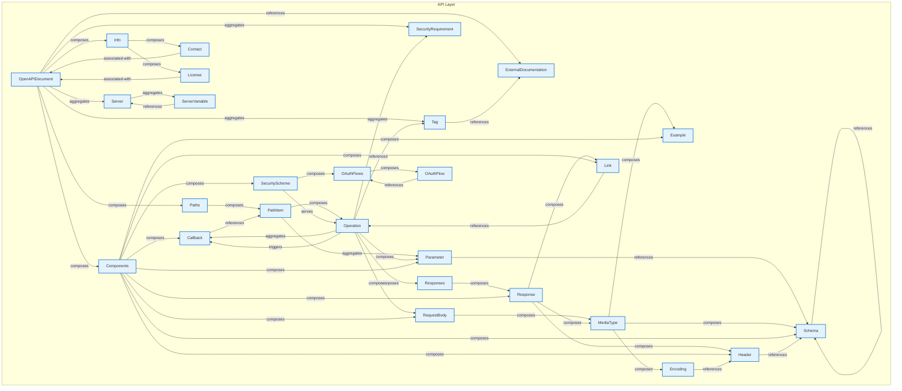

# API Layer - Intra-Layer Relationships

## Overview

**Purpose**: Define semantic links between entities WITHIN this layer, capturing
structural composition, behavioral dependencies, and influence relationships.

**Layer ID**: `06-api`
**Analysis Date**: Generated automatically
**Validation**: Uses MarkdownLayerParser for closed-loop validation

---

### Relationship Diagram

## Layer Summary

### Entity Coverage (Target: 2+ relationships per entity)

- **Entities Meeting Target**: 26/26
- **Entity Coverage**: 100.0%

### Coverage Matrix

| Entity                | Outgoing | Incoming | Total   | Meets Target | Status     |
| --------------------- | -------- | -------- | ------- | ------------ | ---------- |
| Callback              | 1        | 3        | 4       | ✓            | Complete   |
| Components            | 9        | 1        | 10      | ✓            | Complete   |
| Contact               | 1        | 1        | 2       | ✓            | Complete   |
| Encoding              | 1        | 1        | 2       | ✓            | Complete   |
| Example               | 0        | 2        | 2       | ✓            | Complete   |
| ExternalDocumentation | 0        | 2        | 2       | ✓            | Complete   |
| Header                | 1        | 3        | 4       | ✓            | Complete   |
| Info                  | 2        | 1        | 3       | ✓            | Complete   |
| License               | 1        | 1        | 2       | ✓            | Complete   |
| Link                  | 1        | 2        | 3       | ✓            | Complete   |
| MediaType             | 3        | 2        | 5       | ✓            | Complete   |
| OAuthFlow             | 1        | 1        | 2       | ✓            | Complete   |
| OAuthFlows            | 1        | 2        | 3       | ✓            | Complete   |
| OpenAPIDocument       | 7        | 2        | 9       | ✓            | Complete   |
| Operation             | 7        | 3        | 10      | ✓            | Complete   |
| Parameter             | 1        | 3        | 4       | ✓            | Complete   |
| PathItem              | 2        | 2        | 4       | ✓            | Complete   |
| Paths                 | 1        | 1        | 2       | ✓            | Complete   |
| RequestBody           | 1        | 2        | 3       | ✓            | Complete   |
| Response              | 3        | 2        | 5       | ✓            | Complete   |
| Responses             | 1        | 1        | 2       | ✓            | Complete   |
| Schema                | 2        | 6        | 8       | ✓            | Complete   |
| SecurityScheme        | 2        | 1        | 3       | ✓            | Complete   |
| Server                | 1        | 2        | 3       | ✓            | Complete   |
| ServerVariable        | 1        | 1        | 2       | ✓            | Complete   |
| Tag                   | 1        | 2        | 3       | ✓            | Complete   |
| **TOTAL**             | **-**    | **-**    | **102** | **26/26**    | **100.0%** |

### Relationship Statistics

- **Total Unique Relationships**: 52
- **Total Connections (Entity Perspective)**: 102
- **Average Connections per Entity**: 3.9
- **Entity Coverage Target**: 2+ relationships

## Entity: Callback

**Definition**: Defines a webhook or callback URL pattern where the API will send asynchronous notifications. Enables event-driven integrations and async workflows.

### Outgoing Relationships (Callback → Other Entities)

| Relationship Type | Target Entity | Predicate    | Status | Source                                                 | In Catalog | Documented |
| ----------------- | ------------- | ------------ | ------ | ------------------------------------------------------ | ---------- | ---------- |
| reference         | PathItem      | `references` | XML    | [XML](../../spec/layers/06-api-layer.md#example-model) | ✓          | ✗          |

### Incoming Relationships (Other Entities → Callback)

| Relationship Type | Source Entity | Predicate    | Status | Source                                                 | In Catalog | Documented |
| ----------------- | ------------- | ------------ | ------ | ------------------------------------------------------ | ---------- | ---------- |
| composition       | Components    | `composes`   | XML    | [XML](../../spec/layers/06-api-layer.md#example-model) | ✓          | ✗          |
| aggregation       | Operation     | `aggregates` | XML    | [XML](../../spec/layers/06-api-layer.md#example-model) | ✓          | ✗          |
| triggering        | Operation     | `triggers`   | XML    | [XML](../../spec/layers/06-api-layer.md#example-model) | ✓          | ✗          |

### Relationship Summary

- **Total Relationships**: 4
- **Outgoing**: 1
- **Incoming**: 3
- **Documented**: 0/4
- **With XML Examples**: 4/4
- **In Catalog**: 4/4

---

## Entity: Components

**Definition**: Reusable component definitions

### Outgoing Relationships (Components → Other Entities)

| Relationship Type | Target Entity  | Predicate  | Status | Source                                                 | In Catalog | Documented |
| ----------------- | -------------- | ---------- | ------ | ------------------------------------------------------ | ---------- | ---------- |
| composition       | Callback       | `composes` | XML    | [XML](../../spec/layers/06-api-layer.md#example-model) | ✓          | ✗          |
| composition       | Example        | `composes` | XML    | [XML](../../spec/layers/06-api-layer.md#example-model) | ✓          | ✗          |
| composition       | Header         | `composes` | XML    | [XML](../../spec/layers/06-api-layer.md#example-model) | ✓          | ✗          |
| composition       | Link           | `composes` | XML    | [XML](../../spec/layers/06-api-layer.md#example-model) | ✓          | ✗          |
| composition       | Parameter      | `composes` | XML    | [XML](../../spec/layers/06-api-layer.md#example-model) | ✓          | ✗          |
| composition       | RequestBody    | `composes` | XML    | [XML](../../spec/layers/06-api-layer.md#example-model) | ✓          | ✗          |
| composition       | Response       | `composes` | XML    | [XML](../../spec/layers/06-api-layer.md#example-model) | ✓          | ✗          |
| composition       | Schema         | `composes` | XML    | [XML](../../spec/layers/06-api-layer.md#example-model) | ✓          | ✗          |
| composition       | SecurityScheme | `composes` | XML    | [XML](../../spec/layers/06-api-layer.md#example-model) | ✓          | ✗          |

### Incoming Relationships (Other Entities → Components)

| Relationship Type | Source Entity   | Predicate  | Status | Source                                                 | In Catalog | Documented |
| ----------------- | --------------- | ---------- | ------ | ------------------------------------------------------ | ---------- | ---------- |
| composition       | OpenAPIDocument | `composes` | XML    | [XML](../../spec/layers/06-api-layer.md#example-model) | ✓          | ✗          |

### Relationship Summary

- **Total Relationships**: 10
- **Outgoing**: 9
- **Incoming**: 1
- **Documented**: 0/10
- **With XML Examples**: 10/10
- **In Catalog**: 10/10

---

## Entity: Contact

**Definition**: Contact information for the API owner or maintainer, including name, email, and URL. Enables consumers to reach out for support or collaboration.

### Outgoing Relationships (Contact → Other Entities)

| Relationship Type | Target Entity   | Predicate         | Status | Source                                                 | In Catalog | Documented |
| ----------------- | --------------- | ----------------- | ------ | ------------------------------------------------------ | ---------- | ---------- |
| association       | OpenAPIDocument | `associated-with` | XML    | [XML](../../spec/layers/06-api-layer.md#example-model) | ✓          | ✗          |

### Incoming Relationships (Other Entities → Contact)

| Relationship Type | Source Entity | Predicate  | Status | Source                                                 | In Catalog | Documented |
| ----------------- | ------------- | ---------- | ------ | ------------------------------------------------------ | ---------- | ---------- |
| composition       | Info          | `composes` | XML    | [XML](../../spec/layers/06-api-layer.md#example-model) | ✓          | ✗          |

### Relationship Summary

- **Total Relationships**: 2
- **Outgoing**: 1
- **Incoming**: 1
- **Documented**: 0/2
- **With XML Examples**: 2/2
- **In Catalog**: 2/2

---

## Entity: Encoding

**Definition**: Specifies serialization details for multipart request body properties, including content-type, headers, and encoding style. Handles complex content negotiation.

### Outgoing Relationships (Encoding → Other Entities)

| Relationship Type | Target Entity | Predicate    | Status | Source                                                 | In Catalog | Documented |
| ----------------- | ------------- | ------------ | ------ | ------------------------------------------------------ | ---------- | ---------- |
| reference         | Header        | `references` | XML    | [XML](../../spec/layers/06-api-layer.md#example-model) | ✓          | ✗          |

### Incoming Relationships (Other Entities → Encoding)

| Relationship Type | Source Entity | Predicate  | Status | Source                                                 | In Catalog | Documented |
| ----------------- | ------------- | ---------- | ------ | ------------------------------------------------------ | ---------- | ---------- |
| composition       | MediaType     | `composes` | XML    | [XML](../../spec/layers/06-api-layer.md#example-model) | ✓          | ✗          |

### Relationship Summary

- **Total Relationships**: 2
- **Outgoing**: 1
- **Incoming**: 1
- **Documented**: 0/2
- **With XML Examples**: 2/2
- **In Catalog**: 2/2

---

## Entity: Example

**Definition**: Provides sample values for request bodies, responses, or parameters. Improves documentation clarity and enables automated testing or mocking.

### Outgoing Relationships (Example → Other Entities)

_No outgoing intra-layer relationships documented._

### Incoming Relationships (Other Entities → Example)

| Relationship Type | Source Entity | Predicate  | Status | Source                                                 | In Catalog | Documented |
| ----------------- | ------------- | ---------- | ------ | ------------------------------------------------------ | ---------- | ---------- |
| composition       | Components    | `composes` | XML    | [XML](../../spec/layers/06-api-layer.md#example-model) | ✓          | ✗          |
| composition       | MediaType     | `composes` | XML    | [XML](../../spec/layers/06-api-layer.md#example-model) | ✓          | ✗          |

### Relationship Summary

- **Total Relationships**: 2
- **Outgoing**: 0
- **Incoming**: 2
- **Documented**: 0/2
- **With XML Examples**: 2/2
- **In Catalog**: 2/2

---

## Entity: ExternalDocumentation

**Definition**: A reference to external documentation resources (URLs, wikis, guides) that provide additional context beyond the inline API specification. Links API elements to comprehensive documentation.

### Outgoing Relationships (ExternalDocumentation → Other Entities)

_No outgoing intra-layer relationships documented._

### Incoming Relationships (Other Entities → ExternalDocumentation)

| Relationship Type | Source Entity   | Predicate    | Status | Source                                                 | In Catalog | Documented |
| ----------------- | --------------- | ------------ | ------ | ------------------------------------------------------ | ---------- | ---------- |
| reference         | OpenAPIDocument | `references` | XML    | [XML](../../spec/layers/06-api-layer.md#example-model) | ✓          | ✗          |
| reference         | Tag             | `references` | XML    | [XML](../../spec/layers/06-api-layer.md#example-model) | ✓          | ✗          |

### Relationship Summary

- **Total Relationships**: 2
- **Outgoing**: 0
- **Incoming**: 2
- **Documented**: 0/2
- **With XML Examples**: 2/2
- **In Catalog**: 2/2

---

## Entity: Header

**Definition**: Defines HTTP header parameters for requests or responses, specifying name, schema, required status, and description. Documents header-based communication requirements.

### Outgoing Relationships (Header → Other Entities)

| Relationship Type | Target Entity | Predicate    | Status | Source                                                 | In Catalog | Documented |
| ----------------- | ------------- | ------------ | ------ | ------------------------------------------------------ | ---------- | ---------- |
| reference         | Schema        | `references` | XML    | [XML](../../spec/layers/06-api-layer.md#example-model) | ✓          | ✗          |

### Incoming Relationships (Other Entities → Header)

| Relationship Type | Source Entity | Predicate    | Status | Source                                                 | In Catalog | Documented |
| ----------------- | ------------- | ------------ | ------ | ------------------------------------------------------ | ---------- | ---------- |
| composition       | Components    | `composes`   | XML    | [XML](../../spec/layers/06-api-layer.md#example-model) | ✓          | ✗          |
| reference         | Encoding      | `references` | XML    | [XML](../../spec/layers/06-api-layer.md#example-model) | ✓          | ✗          |
| composition       | Response      | `composes`   | XML    | [XML](../../spec/layers/06-api-layer.md#example-model) | ✓          | ✗          |

### Relationship Summary

- **Total Relationships**: 4
- **Outgoing**: 1
- **Incoming**: 3
- **Documented**: 0/4
- **With XML Examples**: 4/4
- **In Catalog**: 4/4

---

## Entity: Info

**Definition**: Metadata about the API

### Outgoing Relationships (Info → Other Entities)

| Relationship Type | Target Entity | Predicate  | Status | Source                                                 | In Catalog | Documented |
| ----------------- | ------------- | ---------- | ------ | ------------------------------------------------------ | ---------- | ---------- |
| composition       | Contact       | `composes` | XML    | [XML](../../spec/layers/06-api-layer.md#example-model) | ✓          | ✗          |
| composition       | License       | `composes` | XML    | [XML](../../spec/layers/06-api-layer.md#example-model) | ✓          | ✗          |

### Incoming Relationships (Other Entities → Info)

| Relationship Type | Source Entity   | Predicate  | Status | Source                                                 | In Catalog | Documented |
| ----------------- | --------------- | ---------- | ------ | ------------------------------------------------------ | ---------- | ---------- |
| composition       | OpenAPIDocument | `composes` | XML    | [XML](../../spec/layers/06-api-layer.md#example-model) | ✓          | ✗          |

### Relationship Summary

- **Total Relationships**: 3
- **Outgoing**: 2
- **Incoming**: 1
- **Documented**: 0/3
- **With XML Examples**: 3/3
- **In Catalog**: 3/3

---

## Entity: License

**Definition**: Specifies the legal license under which the API is provided, including license name and URL to full terms. Clarifies usage rights for API consumers.

### Outgoing Relationships (License → Other Entities)

| Relationship Type | Target Entity   | Predicate         | Status | Source                                                 | In Catalog | Documented |
| ----------------- | --------------- | ----------------- | ------ | ------------------------------------------------------ | ---------- | ---------- |
| association       | OpenAPIDocument | `associated-with` | XML    | [XML](../../spec/layers/06-api-layer.md#example-model) | ✓          | ✗          |

### Incoming Relationships (Other Entities → License)

| Relationship Type | Source Entity | Predicate  | Status | Source                                                 | In Catalog | Documented |
| ----------------- | ------------- | ---------- | ------ | ------------------------------------------------------ | ---------- | ---------- |
| composition       | Info          | `composes` | XML    | [XML](../../spec/layers/06-api-layer.md#example-model) | ✓          | ✗          |

### Relationship Summary

- **Total Relationships**: 2
- **Outgoing**: 1
- **Incoming**: 1
- **Documented**: 0/2
- **With XML Examples**: 2/2
- **In Catalog**: 2/2

---

## Entity: Link

**Definition**: Describes a relationship between API responses and subsequent operations, enabling hypermedia-driven API navigation. Supports HATEOAS design patterns.

### Outgoing Relationships (Link → Other Entities)

| Relationship Type | Target Entity | Predicate    | Status | Source                                                 | In Catalog | Documented |
| ----------------- | ------------- | ------------ | ------ | ------------------------------------------------------ | ---------- | ---------- |
| reference         | Operation     | `references` | XML    | [XML](../../spec/layers/06-api-layer.md#example-model) | ✓          | ✗          |

### Incoming Relationships (Other Entities → Link)

| Relationship Type | Source Entity | Predicate  | Status | Source                                                 | In Catalog | Documented |
| ----------------- | ------------- | ---------- | ------ | ------------------------------------------------------ | ---------- | ---------- |
| composition       | Components    | `composes` | XML    | [XML](../../spec/layers/06-api-layer.md#example-model) | ✓          | ✗          |
| composition       | Response      | `composes` | XML    | [XML](../../spec/layers/06-api-layer.md#example-model) | ✓          | ✗          |

### Relationship Summary

- **Total Relationships**: 3
- **Outgoing**: 1
- **Incoming**: 2
- **Documented**: 0/3
- **With XML Examples**: 3/3
- **In Catalog**: 3/3

---

## Entity: MediaType

**Definition**: Media type and schema for request/response body

### Outgoing Relationships (MediaType → Other Entities)

| Relationship Type | Target Entity | Predicate  | Status | Source                                                 | In Catalog | Documented |
| ----------------- | ------------- | ---------- | ------ | ------------------------------------------------------ | ---------- | ---------- |
| composition       | Encoding      | `composes` | XML    | [XML](../../spec/layers/06-api-layer.md#example-model) | ✓          | ✗          |
| composition       | Example       | `composes` | XML    | [XML](../../spec/layers/06-api-layer.md#example-model) | ✓          | ✗          |
| composition       | Schema        | `composes` | XML    | [XML](../../spec/layers/06-api-layer.md#example-model) | ✓          | ✗          |

### Incoming Relationships (Other Entities → MediaType)

| Relationship Type | Source Entity | Predicate  | Status | Source                                                 | In Catalog | Documented |
| ----------------- | ------------- | ---------- | ------ | ------------------------------------------------------ | ---------- | ---------- |
| composition       | RequestBody   | `composes` | XML    | [XML](../../spec/layers/06-api-layer.md#example-model) | ✓          | ✗          |
| composition       | Response      | `composes` | XML    | [XML](../../spec/layers/06-api-layer.md#example-model) | ✓          | ✗          |

### Relationship Summary

- **Total Relationships**: 5
- **Outgoing**: 3
- **Incoming**: 2
- **Documented**: 0/5
- **With XML Examples**: 5/5
- **In Catalog**: 5/5

---

## Entity: OAuthFlow

**Definition**: Individual OAuth 2.0 flow configuration

### Outgoing Relationships (OAuthFlow → Other Entities)

| Relationship Type | Target Entity | Predicate    | Status | Source                                                 | In Catalog | Documented |
| ----------------- | ------------- | ------------ | ------ | ------------------------------------------------------ | ---------- | ---------- |
| reference         | OAuthFlows    | `references` | XML    | [XML](../../spec/layers/06-api-layer.md#example-model) | ✓          | ✗          |

### Incoming Relationships (Other Entities → OAuthFlow)

| Relationship Type | Source Entity | Predicate  | Status | Source                                                 | In Catalog | Documented |
| ----------------- | ------------- | ---------- | ------ | ------------------------------------------------------ | ---------- | ---------- |
| composition       | OAuthFlows    | `composes` | XML    | [XML](../../spec/layers/06-api-layer.md#example-model) | ✓          | ✗          |

### Relationship Summary

- **Total Relationships**: 2
- **Outgoing**: 1
- **Incoming**: 1
- **Documented**: 0/2
- **With XML Examples**: 2/2
- **In Catalog**: 2/2

---

## Entity: OAuthFlows

**Definition**: Configuration for OAuth 2.0 authentication flows (implicit, password, clientCredentials, authorizationCode), specifying authorization URLs, token URLs, and scopes. Defines OAuth security implementation.

### Outgoing Relationships (OAuthFlows → Other Entities)

| Relationship Type | Target Entity | Predicate  | Status | Source                                                 | In Catalog | Documented |
| ----------------- | ------------- | ---------- | ------ | ------------------------------------------------------ | ---------- | ---------- |
| composition       | OAuthFlow     | `composes` | XML    | [XML](../../spec/layers/06-api-layer.md#example-model) | ✓          | ✗          |

### Incoming Relationships (Other Entities → OAuthFlows)

| Relationship Type | Source Entity  | Predicate    | Status | Source                                                 | In Catalog | Documented |
| ----------------- | -------------- | ------------ | ------ | ------------------------------------------------------ | ---------- | ---------- |
| reference         | OAuthFlow      | `references` | XML    | [XML](../../spec/layers/06-api-layer.md#example-model) | ✓          | ✗          |
| composition       | SecurityScheme | `composes`   | XML    | [XML](../../spec/layers/06-api-layer.md#example-model) | ✓          | ✗          |

### Relationship Summary

- **Total Relationships**: 3
- **Outgoing**: 1
- **Incoming**: 2
- **Documented**: 0/3
- **With XML Examples**: 3/3
- **In Catalog**: 3/3

---

## Entity: OpenAPIDocument

**Definition**: Root of an OpenAPI specification file

### Outgoing Relationships (OpenAPIDocument → Other Entities)

| Relationship Type | Target Entity         | Predicate    | Status | Source                                                 | In Catalog | Documented |
| ----------------- | --------------------- | ------------ | ------ | ------------------------------------------------------ | ---------- | ---------- |
| composition       | Components            | `composes`   | XML    | [XML](../../spec/layers/06-api-layer.md#example-model) | ✓          | ✗          |
| reference         | ExternalDocumentation | `references` | XML    | [XML](../../spec/layers/06-api-layer.md#example-model) | ✓          | ✗          |
| composition       | Info                  | `composes`   | XML    | [XML](../../spec/layers/06-api-layer.md#example-model) | ✓          | ✗          |
| composition       | Paths                 | `composes`   | XML    | [XML](../../spec/layers/06-api-layer.md#example-model) | ✓          | ✗          |
| aggregation       | SecurityRequirement   | `aggregates` | XML    | [XML](../../spec/layers/06-api-layer.md#example-model) | ✓          | ✗          |
| aggregation       | Server                | `aggregates` | XML    | [XML](../../spec/layers/06-api-layer.md#example-model) | ✓          | ✗          |
| aggregation       | Tag                   | `aggregates` | XML    | [XML](../../spec/layers/06-api-layer.md#example-model) | ✓          | ✗          |

### Incoming Relationships (Other Entities → OpenAPIDocument)

| Relationship Type | Source Entity | Predicate         | Status | Source                                                 | In Catalog | Documented |
| ----------------- | ------------- | ----------------- | ------ | ------------------------------------------------------ | ---------- | ---------- |
| association       | Contact       | `associated-with` | XML    | [XML](../../spec/layers/06-api-layer.md#example-model) | ✓          | ✗          |
| association       | License       | `associated-with` | XML    | [XML](../../spec/layers/06-api-layer.md#example-model) | ✓          | ✗          |

### Relationship Summary

- **Total Relationships**: 9
- **Outgoing**: 7
- **Incoming**: 2
- **Documented**: 0/9
- **With XML Examples**: 9/9
- **In Catalog**: 9/9

---

## Entity: Operation

**Definition**: Single API operation (HTTP method on a path)

### Outgoing Relationships (Operation → Other Entities)

| Relationship Type | Target Entity       | Predicate    | Status | Source                                                 | In Catalog | Documented |
| ----------------- | ------------------- | ------------ | ------ | ------------------------------------------------------ | ---------- | ---------- |
| aggregation       | Callback            | `aggregates` | XML    | [XML](../../spec/layers/06-api-layer.md#example-model) | ✓          | ✗          |
| triggering        | Callback            | `triggers`   | XML    | [XML](../../spec/layers/06-api-layer.md#example-model) | ✓          | ✗          |
| composition       | Parameter           | `composes`   | XML    | [XML](../../spec/layers/06-api-layer.md#example-model) | ✓          | ✗          |
| composition       | RequestBody         | `composes`   | XML    | [XML](../../spec/layers/06-api-layer.md#example-model) | ✓          | ✗          |
| composition       | Responses           | `composes`   | XML    | [XML](../../spec/layers/06-api-layer.md#example-model) | ✓          | ✗          |
| aggregation       | SecurityRequirement | `aggregates` | XML    | [XML](../../spec/layers/06-api-layer.md#example-model) | ✓          | ✗          |
| reference         | Tag                 | `references` | XML    | [XML](../../spec/layers/06-api-layer.md#example-model) | ✓          | ✗          |

### Incoming Relationships (Other Entities → Operation)

| Relationship Type | Source Entity  | Predicate    | Status | Source                                                 | In Catalog | Documented |
| ----------------- | -------------- | ------------ | ------ | ------------------------------------------------------ | ---------- | ---------- |
| reference         | Link           | `references` | XML    | [XML](../../spec/layers/06-api-layer.md#example-model) | ✓          | ✗          |
| composition       | PathItem       | `composes`   | XML    | [XML](../../spec/layers/06-api-layer.md#example-model) | ✓          | ✗          |
| serving           | SecurityScheme | `serves`     | XML    | [XML](../../spec/layers/06-api-layer.md#example-model) | ✓          | ✗          |

### Relationship Summary

- **Total Relationships**: 10
- **Outgoing**: 7
- **Incoming**: 3
- **Documented**: 0/10
- **With XML Examples**: 10/10
- **In Catalog**: 10/10

---

## Entity: Parameter

**Definition**: Parameter for an operation

### Outgoing Relationships (Parameter → Other Entities)

| Relationship Type | Target Entity | Predicate    | Status | Source                                                 | In Catalog | Documented |
| ----------------- | ------------- | ------------ | ------ | ------------------------------------------------------ | ---------- | ---------- |
| reference         | Schema        | `references` | XML    | [XML](../../spec/layers/06-api-layer.md#example-model) | ✓          | ✗          |

### Incoming Relationships (Other Entities → Parameter)

| Relationship Type | Source Entity | Predicate    | Status | Source                                                 | In Catalog | Documented |
| ----------------- | ------------- | ------------ | ------ | ------------------------------------------------------ | ---------- | ---------- |
| composition       | Components    | `composes`   | XML    | [XML](../../spec/layers/06-api-layer.md#example-model) | ✓          | ✗          |
| composition       | Operation     | `composes`   | XML    | [XML](../../spec/layers/06-api-layer.md#example-model) | ✓          | ✗          |
| aggregation       | PathItem      | `aggregates` | XML    | [XML](../../spec/layers/06-api-layer.md#example-model) | ✓          | ✗          |

### Relationship Summary

- **Total Relationships**: 4
- **Outgoing**: 1
- **Incoming**: 3
- **Documented**: 0/4
- **With XML Examples**: 4/4
- **In Catalog**: 4/4

---

## Entity: PathItem

**Definition**: Operations available on a path

### Outgoing Relationships (PathItem → Other Entities)

| Relationship Type | Target Entity | Predicate    | Status | Source                                                 | In Catalog | Documented |
| ----------------- | ------------- | ------------ | ------ | ------------------------------------------------------ | ---------- | ---------- |
| composition       | Operation     | `composes`   | XML    | [XML](../../spec/layers/06-api-layer.md#example-model) | ✓          | ✗          |
| aggregation       | Parameter     | `aggregates` | XML    | [XML](../../spec/layers/06-api-layer.md#example-model) | ✓          | ✗          |

### Incoming Relationships (Other Entities → PathItem)

| Relationship Type | Source Entity | Predicate    | Status | Source                                                 | In Catalog | Documented |
| ----------------- | ------------- | ------------ | ------ | ------------------------------------------------------ | ---------- | ---------- |
| reference         | Callback      | `references` | XML    | [XML](../../spec/layers/06-api-layer.md#example-model) | ✓          | ✗          |
| composition       | Paths         | `composes`   | XML    | [XML](../../spec/layers/06-api-layer.md#example-model) | ✓          | ✗          |

### Relationship Summary

- **Total Relationships**: 4
- **Outgoing**: 2
- **Incoming**: 2
- **Documented**: 0/4
- **With XML Examples**: 4/4
- **In Catalog**: 4/4

---

## Entity: Paths

**Definition**: Available API endpoints and operations

### Outgoing Relationships (Paths → Other Entities)

| Relationship Type | Target Entity | Predicate  | Status | Source                                                 | In Catalog | Documented |
| ----------------- | ------------- | ---------- | ------ | ------------------------------------------------------ | ---------- | ---------- |
| composition       | PathItem      | `composes` | XML    | [XML](../../spec/layers/06-api-layer.md#example-model) | ✓          | ✗          |

### Incoming Relationships (Other Entities → Paths)

| Relationship Type | Source Entity   | Predicate  | Status | Source                                                 | In Catalog | Documented |
| ----------------- | --------------- | ---------- | ------ | ------------------------------------------------------ | ---------- | ---------- |
| composition       | OpenAPIDocument | `composes` | XML    | [XML](../../spec/layers/06-api-layer.md#example-model) | ✓          | ✗          |

### Relationship Summary

- **Total Relationships**: 2
- **Outgoing**: 1
- **Incoming**: 1
- **Documented**: 0/2
- **With XML Examples**: 2/2
- **In Catalog**: 2/2

---

## Entity: RequestBody

**Definition**: Request payload for an operation

### Outgoing Relationships (RequestBody → Other Entities)

| Relationship Type | Target Entity | Predicate  | Status | Source                                                 | In Catalog | Documented |
| ----------------- | ------------- | ---------- | ------ | ------------------------------------------------------ | ---------- | ---------- |
| composition       | MediaType     | `composes` | XML    | [XML](../../spec/layers/06-api-layer.md#example-model) | ✓          | ✗          |

### Incoming Relationships (Other Entities → RequestBody)

| Relationship Type | Source Entity | Predicate  | Status | Source                                                 | In Catalog | Documented |
| ----------------- | ------------- | ---------- | ------ | ------------------------------------------------------ | ---------- | ---------- |
| composition       | Components    | `composes` | XML    | [XML](../../spec/layers/06-api-layer.md#example-model) | ✓          | ✗          |
| composition       | Operation     | `composes` | XML    | [XML](../../spec/layers/06-api-layer.md#example-model) | ✓          | ✗          |

### Relationship Summary

- **Total Relationships**: 3
- **Outgoing**: 1
- **Incoming**: 2
- **Documented**: 0/3
- **With XML Examples**: 3/3
- **In Catalog**: 3/3

---

## Entity: Response

**Definition**: Single response definition

### Outgoing Relationships (Response → Other Entities)

| Relationship Type | Target Entity | Predicate  | Status | Source                                                 | In Catalog | Documented |
| ----------------- | ------------- | ---------- | ------ | ------------------------------------------------------ | ---------- | ---------- |
| composition       | Header        | `composes` | XML    | [XML](../../spec/layers/06-api-layer.md#example-model) | ✓          | ✗          |
| composition       | Link          | `composes` | XML    | [XML](../../spec/layers/06-api-layer.md#example-model) | ✓          | ✗          |
| composition       | MediaType     | `composes` | XML    | [XML](../../spec/layers/06-api-layer.md#example-model) | ✓          | ✗          |

### Incoming Relationships (Other Entities → Response)

| Relationship Type | Source Entity | Predicate  | Status | Source                                                 | In Catalog | Documented |
| ----------------- | ------------- | ---------- | ------ | ------------------------------------------------------ | ---------- | ---------- |
| composition       | Components    | `composes` | XML    | [XML](../../spec/layers/06-api-layer.md#example-model) | ✓          | ✗          |
| composition       | Responses     | `composes` | XML    | [XML](../../spec/layers/06-api-layer.md#example-model) | ✓          | ✗          |

### Relationship Summary

- **Total Relationships**: 5
- **Outgoing**: 3
- **Incoming**: 2
- **Documented**: 0/5
- **With XML Examples**: 5/5
- **In Catalog**: 5/5

---

## Entity: Responses

**Definition**: Possible responses from an operation

### Outgoing Relationships (Responses → Other Entities)

| Relationship Type | Target Entity | Predicate  | Status | Source                                                 | In Catalog | Documented |
| ----------------- | ------------- | ---------- | ------ | ------------------------------------------------------ | ---------- | ---------- |
| composition       | Response      | `composes` | XML    | [XML](../../spec/layers/06-api-layer.md#example-model) | ✓          | ✗          |

### Incoming Relationships (Other Entities → Responses)

| Relationship Type | Source Entity | Predicate  | Status | Source                                                 | In Catalog | Documented |
| ----------------- | ------------- | ---------- | ------ | ------------------------------------------------------ | ---------- | ---------- |
| composition       | Operation     | `composes` | XML    | [XML](../../spec/layers/06-api-layer.md#example-model) | ✓          | ✗          |

### Relationship Summary

- **Total Relationships**: 2
- **Outgoing**: 1
- **Incoming**: 1
- **Documented**: 0/2
- **With XML Examples**: 2/2
- **In Catalog**: 2/2

---

## Entity: Schema

**Definition**: Data type definition (JSON Schema subset)

### Outgoing Relationships (Schema → Other Entities)

| Relationship Type | Target Entity | Predicate     | Status | Source                                                 | In Catalog | Documented |
| ----------------- | ------------- | ------------- | ------ | ------------------------------------------------------ | ---------- | ---------- |
| reference         | Schema        | `references`  | XML    | [XML](../../spec/layers/06-api-layer.md#example-model) | ✓          | ✗          |
| specialization    | Schema        | `specializes` | XML    | [XML](../../spec/layers/06-api-layer.md#example-model) | ✓          | ✗          |

### Incoming Relationships (Other Entities → Schema)

| Relationship Type | Source Entity | Predicate     | Status | Source                                                 | In Catalog | Documented |
| ----------------- | ------------- | ------------- | ------ | ------------------------------------------------------ | ---------- | ---------- |
| composition       | Components    | `composes`    | XML    | [XML](../../spec/layers/06-api-layer.md#example-model) | ✓          | ✗          |
| reference         | Header        | `references`  | XML    | [XML](../../spec/layers/06-api-layer.md#example-model) | ✓          | ✗          |
| composition       | MediaType     | `composes`    | XML    | [XML](../../spec/layers/06-api-layer.md#example-model) | ✓          | ✗          |
| reference         | Parameter     | `references`  | XML    | [XML](../../spec/layers/06-api-layer.md#example-model) | ✓          | ✗          |
| reference         | Schema        | `references`  | XML    | [XML](../../spec/layers/06-api-layer.md#example-model) | ✓          | ✗          |
| specialization    | Schema        | `specializes` | XML    | [XML](../../spec/layers/06-api-layer.md#example-model) | ✓          | ✗          |

### Relationship Summary

- **Total Relationships**: 8
- **Outgoing**: 2
- **Incoming**: 6
- **Documented**: 0/8
- **With XML Examples**: 8/8
- **In Catalog**: 8/8

---

## Entity: SecurityScheme

**Definition**: Security mechanism for the API

### Outgoing Relationships (SecurityScheme → Other Entities)

| Relationship Type | Target Entity | Predicate  | Status | Source                                                 | In Catalog | Documented |
| ----------------- | ------------- | ---------- | ------ | ------------------------------------------------------ | ---------- | ---------- |
| composition       | OAuthFlows    | `composes` | XML    | [XML](../../spec/layers/06-api-layer.md#example-model) | ✓          | ✗          |
| serving           | Operation     | `serves`   | XML    | [XML](../../spec/layers/06-api-layer.md#example-model) | ✓          | ✗          |

### Incoming Relationships (Other Entities → SecurityScheme)

| Relationship Type | Source Entity | Predicate  | Status | Source                                                 | In Catalog | Documented |
| ----------------- | ------------- | ---------- | ------ | ------------------------------------------------------ | ---------- | ---------- |
| composition       | Components    | `composes` | XML    | [XML](../../spec/layers/06-api-layer.md#example-model) | ✓          | ✗          |

### Relationship Summary

- **Total Relationships**: 3
- **Outgoing**: 2
- **Incoming**: 1
- **Documented**: 0/3
- **With XML Examples**: 3/3
- **In Catalog**: 3/3

---

## Entity: Server

**Definition**: Server where the API is available

### Outgoing Relationships (Server → Other Entities)

| Relationship Type | Target Entity  | Predicate    | Status | Source                                                 | In Catalog | Documented |
| ----------------- | -------------- | ------------ | ------ | ------------------------------------------------------ | ---------- | ---------- |
| aggregation       | ServerVariable | `aggregates` | XML    | [XML](../../spec/layers/06-api-layer.md#example-model) | ✓          | ✗          |

### Incoming Relationships (Other Entities → Server)

| Relationship Type | Source Entity   | Predicate    | Status | Source                                                 | In Catalog | Documented |
| ----------------- | --------------- | ------------ | ------ | ------------------------------------------------------ | ---------- | ---------- |
| aggregation       | OpenAPIDocument | `aggregates` | XML    | [XML](../../spec/layers/06-api-layer.md#example-model) | ✓          | ✗          |
| reference         | ServerVariable  | `references` | XML    | [XML](../../spec/layers/06-api-layer.md#example-model) | ✓          | ✗          |

### Relationship Summary

- **Total Relationships**: 3
- **Outgoing**: 1
- **Incoming**: 2
- **Documented**: 0/3
- **With XML Examples**: 3/3
- **In Catalog**: 3/3

---

## Entity: ServerVariable

**Definition**: A variable placeholder in server URL templates that can be substituted at runtime. Enables dynamic server addressing for different environments or tenants.

### Outgoing Relationships (ServerVariable → Other Entities)

| Relationship Type | Target Entity | Predicate    | Status | Source                                                 | In Catalog | Documented |
| ----------------- | ------------- | ------------ | ------ | ------------------------------------------------------ | ---------- | ---------- |
| reference         | Server        | `references` | XML    | [XML](../../spec/layers/06-api-layer.md#example-model) | ✓          | ✗          |

### Incoming Relationships (Other Entities → ServerVariable)

| Relationship Type | Source Entity | Predicate    | Status | Source                                                 | In Catalog | Documented |
| ----------------- | ------------- | ------------ | ------ | ------------------------------------------------------ | ---------- | ---------- |
| aggregation       | Server        | `aggregates` | XML    | [XML](../../spec/layers/06-api-layer.md#example-model) | ✓          | ✗          |

### Relationship Summary

- **Total Relationships**: 2
- **Outgoing**: 1
- **Incoming**: 1
- **Documented**: 0/2
- **With XML Examples**: 2/2
- **In Catalog**: 2/2

---

## Entity: Tag

**Definition**: A metadata label used to group and categorize API operations for documentation organization. Enables logical grouping of endpoints in generated API documentation.

### Outgoing Relationships (Tag → Other Entities)

| Relationship Type | Target Entity         | Predicate    | Status | Source                                                 | In Catalog | Documented |
| ----------------- | --------------------- | ------------ | ------ | ------------------------------------------------------ | ---------- | ---------- |
| reference         | ExternalDocumentation | `references` | XML    | [XML](../../spec/layers/06-api-layer.md#example-model) | ✓          | ✗          |

### Incoming Relationships (Other Entities → Tag)

| Relationship Type | Source Entity   | Predicate    | Status | Source                                                 | In Catalog | Documented |
| ----------------- | --------------- | ------------ | ------ | ------------------------------------------------------ | ---------- | ---------- |
| aggregation       | OpenAPIDocument | `aggregates` | XML    | [XML](../../spec/layers/06-api-layer.md#example-model) | ✓          | ✗          |
| reference         | Operation       | `references` | XML    | [XML](../../spec/layers/06-api-layer.md#example-model) | ✓          | ✗          |

### Relationship Summary

- **Total Relationships**: 3
- **Outgoing**: 1
- **Incoming**: 2
- **Documented**: 0/3
- **With XML Examples**: 3/3
- **In Catalog**: 3/3

---
