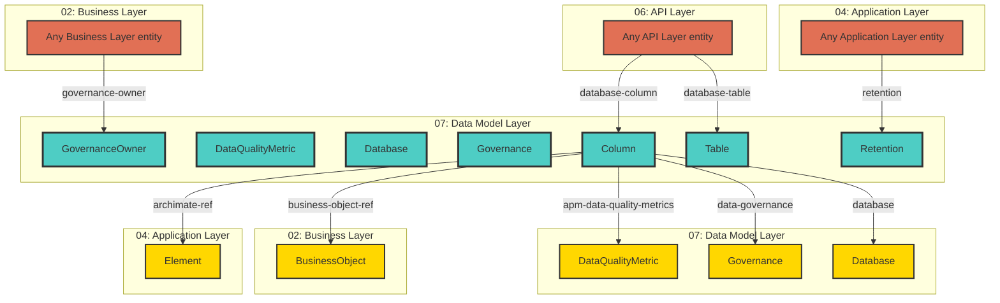

# Data Model Layer - Cross-Layer Relationships

## Cross-Layer Relationships

**Purpose**: Define semantic links to entities in other layers, supporting traceability, governance, and architectural alignment.

### Cross-Layer Relationship Diagram



### Outgoing Relationships (This Layer → Other Layers)

Links from entities in this layer to entities in other layers.

#### To Business Layer (02)

Links to business services, processes, and actors.

| Predicate             | Source Element                                                    | Target Element | Field Path              | Description                                    | Documented |
| --------------------- | ----------------------------------------------------------------- | -------------- | ----------------------- | ---------------------------------------------- | ---------- |
| `business-object-ref` | JSONSchema, x-business-object-ref Extension, x-security Extension | BusinessObject | `x-business-object-ref` | string (BusinessObject.id reference, optional) | ✗          |

**Example**:

```yaml
properties:
  x-business-object-ref:
    type: string
    description: string (BusinessObject.id reference, optional)
    example: "target-id-1"
```

#### To Application Layer (04)

Links to application layer elements.

| Predicate       | Source Element                   | Target Element | Field Path        | Description                                         | Documented |
| --------------- | -------------------------------- | -------------- | ----------------- | --------------------------------------------------- | ---------- |
| `archimate-ref` | JSONSchema, x-security Extension | Element        | `x-archimate-ref` | string (Element.id reference to ApplicationService) | ✗          |

**Example**:

```yaml
properties:
  x-archimate-ref:
    type: string
    description: string (Element.id reference to ApplicationService)
    example: "target-id-1"
```

#### To Data Model Layer (07)

Links to data schemas, tables, and columns.

| Predicate                  | Source Element                                                         | Target Element    | Field Path                   | Description                   | Documented |
| -------------------------- | ---------------------------------------------------------------------- | ----------------- | ---------------------------- | ----------------------------- | ---------- |
| `apm-data-quality-metrics` | JSONSchema, x-apm-data-quality-metrics Extension, x-security Extension | DataQualityMetric | `x-apm-data-quality-metrics` | DataQualityMetrics (optional) | ✗          |
| `data-governance`          | JSONSchema, x-data-governance Extension, x-security Extension          | Governance        | `x-data-governance`          | DataGovernance (optional)     | ✗          |
| `database`                 | JSONSchema, SchemaProperty, x-database Extension, x-security Extension | Database          | `x-database`                 | DatabaseMapping (optional)    | ✗          |

**Example**:

```yaml
properties:
  x-apm-data-quality-metrics:
    type: string
    description: DataQualityMetrics (optional)
    example: "target-id-1"
```

### Incoming Relationships (Other Layers → This Layer)

Links from entities in other layers to entities in this layer.

#### From Business Layer (02)

| Predicate          | Source Element | Target Element  | Field Path              | Description                               | Documented                                 |
| ------------------ | -------------- | --------------- | ----------------------- | ----------------------------------------- | ------------------------------------------ |
| `governance-owner` | BusinessObject | GovernanceOwner | `data.governance-owner` | BusinessObject ownership by BusinessActor | [✓](../../spec/schemas/link-registry.json) |

#### From Application Layer (04)

| Predicate   | Source Element              | Target Element | Field Path       | Description                        | Documented                                 |
| ----------- | --------------------------- | -------------- | ---------------- | ---------------------------------- | ------------------------------------------ |
| `retention` | Data Properties, DataObject | Retention      | `data.retention` | Links to Retention in target layer | [✓](../../spec/schemas/link-registry.json) |

#### From API Layer (06)

| Predicate         | Source Element         | Target Element | Field Path          | Description | Documented |
| ----------------- | ---------------------- | -------------- | ------------------- | ----------- | ---------- |
| `database-column` | Schema                 | Column         | `x-database-column` | string      | ✗          |
| `database-table`  | Schema, SecurityScheme | Table          | `x-database-table`  | string      | ✗          |

#### From Data Model Layer (07)

| Predicate                  | Source Element                                                         | Target Element    | Field Path                   | Description                   | Documented |
| -------------------------- | ---------------------------------------------------------------------- | ----------------- | ---------------------------- | ----------------------------- | ---------- |
| `apm-data-quality-metrics` | JSONSchema, x-apm-data-quality-metrics Extension, x-security Extension | DataQualityMetric | `x-apm-data-quality-metrics` | DataQualityMetrics (optional) | ✗          |
| `data-governance`          | JSONSchema, x-data-governance Extension, x-security Extension          | Governance        | `x-data-governance`          | DataGovernance (optional)     | ✗          |
| `database`                 | JSONSchema, SchemaProperty, x-database Extension, x-security Extension | Database          | `x-database`                 | DatabaseMapping (optional)    | ✗          |
