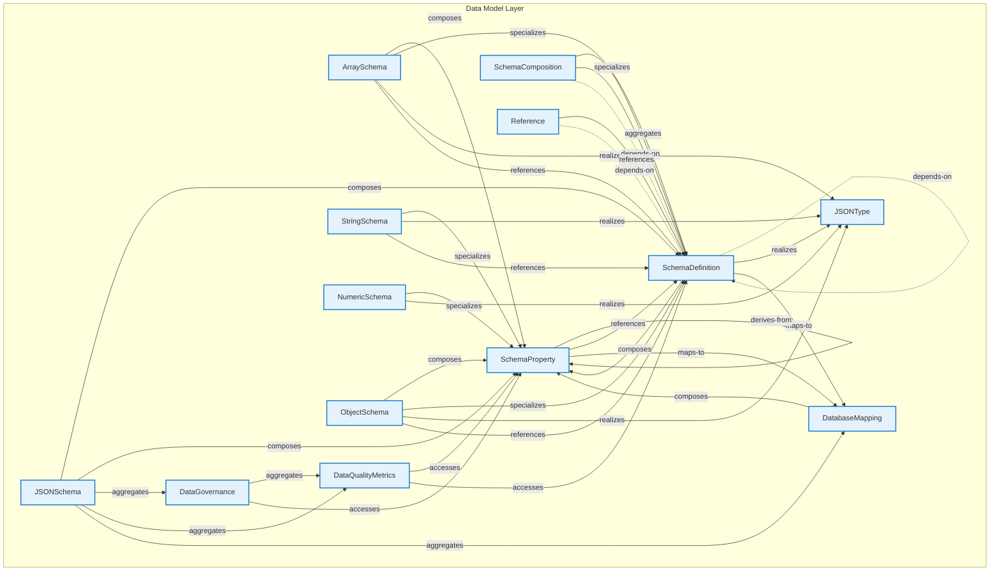

# Data Model Layer - Intra-Layer Relationships

## Overview

**Purpose**: Define semantic links between entities WITHIN this layer, capturing
structural composition, behavioral dependencies, and influence relationships.

**Layer ID**: `07-data-model`
**Analysis Date**: Generated automatically
**Validation**: Uses MarkdownLayerParser for closed-loop validation

---

### Relationship Diagram



## Layer Summary

### Entity Coverage (Target: 2+ relationships per entity)

- **Entities Meeting Target**: 13/13
- **Entity Coverage**: 100.0%

### Coverage Matrix

| Entity             | Outgoing | Incoming | Total  | Meets Target | Status     |
| ------------------ | -------- | -------- | ------ | ------------ | ---------- |
| ArraySchema        | 4        | 0        | 4      | ✓            | Complete   |
| DataGovernance     | 2        | 1        | 3      | ✓            | Complete   |
| DataQualityMetrics | 2        | 2        | 4      | ✓            | Complete   |
| DatabaseMapping    | 1        | 3        | 4      | ✓            | Complete   |
| JSONSchema         | 5        | 0        | 5      | ✓            | Complete   |
| JSONType           | 0        | 5        | 5      | ✓            | Complete   |
| NumericSchema      | 2        | 0        | 2      | ✓            | Complete   |
| ObjectSchema       | 4        | 0        | 4      | ✓            | Complete   |
| Reference          | 2        | 0        | 2      | ✓            | Complete   |
| SchemaComposition  | 3        | 0        | 3      | ✓            | Complete   |
| SchemaDefinition   | 6        | 16       | 22     | ✓            | Complete   |
| SchemaProperty     | 4        | 11       | 15     | ✓            | Complete   |
| StringSchema       | 3        | 0        | 3      | ✓            | Complete   |
| **TOTAL**          | **-**    | **-**    | **76** | **13/13**    | **100.0%** |

### Relationship Statistics

- **Total Unique Relationships**: 38
- **Total Connections (Entity Perspective)**: 76
- **Average Connections per Entity**: 5.8
- **Entity Coverage Target**: 2+ relationships

### Priority Gaps

_These relationships appear frequently but are not in the catalog:_

1. **depends-on (depends-on)** - Appears 6 time(s)

## Entity: ArraySchema

**Definition**: ArraySchema validation rules

### Outgoing Relationships (ArraySchema → Other Entities)

| Relationship Type | Target Entity    | Predicate     | Status           | Source                                                        | In Catalog | Documented                                                  |
| ----------------- | ---------------- | ------------- | ---------------- | ------------------------------------------------------------- | ---------- | ----------------------------------------------------------- |
| realization       | JSONType         | `realizes`    | Documented + XML | [Doc](../../spec/layers/07-data-model-layer.md#relationships) | ✓          | [✓](../../spec/layers/07-data-model-layer.md#relationships) |
| reference         | SchemaDefinition | `references`  | Documented + XML | [Doc](../../spec/layers/07-data-model-layer.md#relationships) | ✓          | [✓](../../spec/layers/07-data-model-layer.md#relationships) |
| specialization    | SchemaDefinition | `specializes` | Documented + XML | [Doc](../../spec/layers/07-data-model-layer.md#relationships) | ✓          | [✓](../../spec/layers/07-data-model-layer.md#relationships) |
| composition       | SchemaProperty   | `composes`    | Documented + XML | [Doc](../../spec/layers/07-data-model-layer.md#relationships) | ✓          | [✓](../../spec/layers/07-data-model-layer.md#relationships) |

### Incoming Relationships (Other Entities → ArraySchema)

_No incoming intra-layer relationships documented._

### Relationship Summary

- **Total Relationships**: 4
- **Outgoing**: 4
- **Incoming**: 0
- **Documented**: 4/4
- **With XML Examples**: 4/4
- **In Catalog**: 4/4

---

## Entity: DataGovernance

**Definition**: Metadata about data ownership, classification, sensitivity level, and handling requirements. Ensures data is managed according to organizational policies and regulations.

### Outgoing Relationships (DataGovernance → Other Entities)

| Relationship Type | Target Entity      | Predicate    | Status           | Source                                                        | In Catalog | Documented                                                  |
| ----------------- | ------------------ | ------------ | ---------------- | ------------------------------------------------------------- | ---------- | ----------------------------------------------------------- |
| aggregation       | DataQualityMetrics | `aggregates` | Documented + XML | [Doc](../../spec/layers/07-data-model-layer.md#relationships) | ✓          | [✓](../../spec/layers/07-data-model-layer.md#relationships) |
| access            | SchemaProperty     | `accesses`   | Documented + XML | [Doc](../../spec/layers/07-data-model-layer.md#relationships) | ✓          | [✓](../../spec/layers/07-data-model-layer.md#relationships) |

### Incoming Relationships (Other Entities → DataGovernance)

| Relationship Type | Source Entity | Predicate    | Status           | Source                                                        | In Catalog | Documented                                                  |
| ----------------- | ------------- | ------------ | ---------------- | ------------------------------------------------------------- | ---------- | ----------------------------------------------------------- |
| aggregation       | JSONSchema    | `aggregates` | Documented + XML | [Doc](../../spec/layers/07-data-model-layer.md#relationships) | ✓          | [✓](../../spec/layers/07-data-model-layer.md#relationships) |

### Relationship Summary

- **Total Relationships**: 3
- **Outgoing**: 2
- **Incoming**: 1
- **Documented**: 3/3
- **With XML Examples**: 3/3
- **In Catalog**: 3/3

---

## Entity: DataQualityMetrics

**Definition**: Defines measurable quality attributes for data elements such as completeness, accuracy, consistency, and timeliness. Enables data quality monitoring and SLA enforcement.

### Outgoing Relationships (DataQualityMetrics → Other Entities)

| Relationship Type | Target Entity    | Predicate  | Status           | Source                                                        | In Catalog | Documented                                                  |
| ----------------- | ---------------- | ---------- | ---------------- | ------------------------------------------------------------- | ---------- | ----------------------------------------------------------- |
| access            | SchemaDefinition | `accesses` | Documented + XML | [Doc](../../spec/layers/07-data-model-layer.md#relationships) | ✓          | [✓](../../spec/layers/07-data-model-layer.md#relationships) |
| access            | SchemaProperty   | `accesses` | Documented + XML | [Doc](../../spec/layers/07-data-model-layer.md#relationships) | ✓          | [✓](../../spec/layers/07-data-model-layer.md#relationships) |

### Incoming Relationships (Other Entities → DataQualityMetrics)

| Relationship Type | Source Entity  | Predicate    | Status           | Source                                                        | In Catalog | Documented                                                  |
| ----------------- | -------------- | ------------ | ---------------- | ------------------------------------------------------------- | ---------- | ----------------------------------------------------------- |
| aggregation       | DataGovernance | `aggregates` | Documented + XML | [Doc](../../spec/layers/07-data-model-layer.md#relationships) | ✓          | [✓](../../spec/layers/07-data-model-layer.md#relationships) |
| aggregation       | JSONSchema     | `aggregates` | Documented + XML | [Doc](../../spec/layers/07-data-model-layer.md#relationships) | ✓          | [✓](../../spec/layers/07-data-model-layer.md#relationships) |

### Relationship Summary

- **Total Relationships**: 4
- **Outgoing**: 2
- **Incoming**: 2
- **Documented**: 4/4
- **With XML Examples**: 4/4
- **In Catalog**: 4/4

---

## Entity: DatabaseMapping

**Definition**: Specifies how a logical data model entity maps to physical database storage, including table names, column mappings, and storage optimizations. Bridges logical and physical data layers.

### Outgoing Relationships (DatabaseMapping → Other Entities)

| Relationship Type | Target Entity  | Predicate  | Status           | Source                                                        | In Catalog | Documented                                                  |
| ----------------- | -------------- | ---------- | ---------------- | ------------------------------------------------------------- | ---------- | ----------------------------------------------------------- |
| composition       | SchemaProperty | `composes` | Documented + XML | [Doc](../../spec/layers/07-data-model-layer.md#relationships) | ✓          | [✓](../../spec/layers/07-data-model-layer.md#relationships) |

### Incoming Relationships (Other Entities → DatabaseMapping)

| Relationship Type | Source Entity    | Predicate    | Status           | Source                                                        | In Catalog | Documented                                                  |
| ----------------- | ---------------- | ------------ | ---------------- | ------------------------------------------------------------- | ---------- | ----------------------------------------------------------- |
| aggregation       | JSONSchema       | `aggregates` | Documented + XML | [Doc](../../spec/layers/07-data-model-layer.md#relationships) | ✓          | [✓](../../spec/layers/07-data-model-layer.md#relationships) |
| maps-to           | SchemaDefinition | `maps-to`    | Documented + XML | [Doc](../../spec/layers/07-data-model-layer.md#relationships) | ✓          | [✓](../../spec/layers/07-data-model-layer.md#relationships) |
| maps-to           | SchemaProperty   | `maps-to`    | Documented + XML | [Doc](../../spec/layers/07-data-model-layer.md#relationships) | ✓          | [✓](../../spec/layers/07-data-model-layer.md#relationships) |

### Relationship Summary

- **Total Relationships**: 4
- **Outgoing**: 1
- **Incoming**: 3
- **Documented**: 4/4
- **With XML Examples**: 4/4
- **In Catalog**: 4/4

---

## Entity: JSONSchema

**Definition**: Root schema document

### Outgoing Relationships (JSONSchema → Other Entities)

| Relationship Type | Target Entity      | Predicate    | Status           | Source                                                        | In Catalog | Documented                                                  |
| ----------------- | ------------------ | ------------ | ---------------- | ------------------------------------------------------------- | ---------- | ----------------------------------------------------------- |
| aggregation       | DataGovernance     | `aggregates` | Documented + XML | [Doc](../../spec/layers/07-data-model-layer.md#relationships) | ✓          | [✓](../../spec/layers/07-data-model-layer.md#relationships) |
| aggregation       | DataQualityMetrics | `aggregates` | Documented + XML | [Doc](../../spec/layers/07-data-model-layer.md#relationships) | ✓          | [✓](../../spec/layers/07-data-model-layer.md#relationships) |
| aggregation       | DatabaseMapping    | `aggregates` | Documented + XML | [Doc](../../spec/layers/07-data-model-layer.md#relationships) | ✓          | [✓](../../spec/layers/07-data-model-layer.md#relationships) |
| composition       | SchemaDefinition   | `composes`   | Documented + XML | [Doc](../../spec/layers/07-data-model-layer.md#relationships) | ✓          | [✓](../../spec/layers/07-data-model-layer.md#relationships) |
| composition       | SchemaProperty     | `composes`   | Documented + XML | [Doc](../../spec/layers/07-data-model-layer.md#relationships) | ✓          | [✓](../../spec/layers/07-data-model-layer.md#relationships) |

### Incoming Relationships (Other Entities → JSONSchema)

_No incoming intra-layer relationships documented._

### Relationship Summary

- **Total Relationships**: 5
- **Outgoing**: 5
- **Incoming**: 0
- **Documented**: 5/5
- **With XML Examples**: 5/5
- **In Catalog**: 5/5

---

## Entity: JSONType

**Definition**: Core JSON data types

### Outgoing Relationships (JSONType → Other Entities)

_No outgoing intra-layer relationships documented._

### Incoming Relationships (Other Entities → JSONType)

| Relationship Type | Source Entity    | Predicate  | Status           | Source                                                        | In Catalog | Documented                                                  |
| ----------------- | ---------------- | ---------- | ---------------- | ------------------------------------------------------------- | ---------- | ----------------------------------------------------------- |
| realization       | ArraySchema      | `realizes` | Documented + XML | [Doc](../../spec/layers/07-data-model-layer.md#relationships) | ✓          | [✓](../../spec/layers/07-data-model-layer.md#relationships) |
| realization       | NumericSchema    | `realizes` | Documented + XML | [Doc](../../spec/layers/07-data-model-layer.md#relationships) | ✓          | [✓](../../spec/layers/07-data-model-layer.md#relationships) |
| realization       | ObjectSchema     | `realizes` | Documented + XML | [Doc](../../spec/layers/07-data-model-layer.md#relationships) | ✓          | [✓](../../spec/layers/07-data-model-layer.md#relationships) |
| realization       | SchemaDefinition | `realizes` | Documented + XML | [Doc](../../spec/layers/07-data-model-layer.md#relationships) | ✓          | [✓](../../spec/layers/07-data-model-layer.md#relationships) |
| realization       | StringSchema     | `realizes` | Documented + XML | [Doc](../../spec/layers/07-data-model-layer.md#relationships) | ✓          | [✓](../../spec/layers/07-data-model-layer.md#relationships) |

### Relationship Summary

- **Total Relationships**: 5
- **Outgoing**: 0
- **Incoming**: 5
- **Documented**: 5/5
- **With XML Examples**: 5/5
- **In Catalog**: 5/5

---

## Entity: NumericSchema

**Definition**: NumericSchema validation rules

### Outgoing Relationships (NumericSchema → Other Entities)

| Relationship Type | Target Entity  | Predicate     | Status           | Source                                                        | In Catalog | Documented                                                  |
| ----------------- | -------------- | ------------- | ---------------- | ------------------------------------------------------------- | ---------- | ----------------------------------------------------------- |
| realization       | JSONType       | `realizes`    | Documented + XML | [Doc](../../spec/layers/07-data-model-layer.md#relationships) | ✓          | [✓](../../spec/layers/07-data-model-layer.md#relationships) |
| specialization    | SchemaProperty | `specializes` | Documented + XML | [Doc](../../spec/layers/07-data-model-layer.md#relationships) | ✓          | [✓](../../spec/layers/07-data-model-layer.md#relationships) |

### Incoming Relationships (Other Entities → NumericSchema)

_No incoming intra-layer relationships documented._

### Relationship Summary

- **Total Relationships**: 2
- **Outgoing**: 2
- **Incoming**: 0
- **Documented**: 2/2
- **With XML Examples**: 2/2
- **In Catalog**: 2/2

---

## Entity: ObjectSchema

**Definition**: ObjectSchema validation rules

### Outgoing Relationships (ObjectSchema → Other Entities)

| Relationship Type | Target Entity    | Predicate     | Status           | Source                                                        | In Catalog | Documented                                                  |
| ----------------- | ---------------- | ------------- | ---------------- | ------------------------------------------------------------- | ---------- | ----------------------------------------------------------- |
| realization       | JSONType         | `realizes`    | Documented + XML | [Doc](../../spec/layers/07-data-model-layer.md#relationships) | ✓          | [✓](../../spec/layers/07-data-model-layer.md#relationships) |
| reference         | SchemaDefinition | `references`  | Documented + XML | [Doc](../../spec/layers/07-data-model-layer.md#relationships) | ✓          | [✓](../../spec/layers/07-data-model-layer.md#relationships) |
| specialization    | SchemaDefinition | `specializes` | Documented + XML | [Doc](../../spec/layers/07-data-model-layer.md#relationships) | ✓          | [✓](../../spec/layers/07-data-model-layer.md#relationships) |
| composition       | SchemaProperty   | `composes`    | Documented + XML | [Doc](../../spec/layers/07-data-model-layer.md#relationships) | ✓          | [✓](../../spec/layers/07-data-model-layer.md#relationships) |

### Incoming Relationships (Other Entities → ObjectSchema)

_No incoming intra-layer relationships documented._

### Relationship Summary

- **Total Relationships**: 4
- **Outgoing**: 4
- **Incoming**: 0
- **Documented**: 4/4
- **With XML Examples**: 4/4
- **In Catalog**: 4/4

---

## Entity: Reference

**Definition**: Reference to another schema

### Outgoing Relationships (Reference → Other Entities)

| Relationship Type | Target Entity    | Predicate    | Status           | Source                                                        | In Catalog | Documented                                                  |
| ----------------- | ---------------- | ------------ | ---------------- | ------------------------------------------------------------- | ---------- | ----------------------------------------------------------- |
| depends-on        | SchemaDefinition | `depends-on` | Documented + XML | [Doc](../../spec/layers/07-data-model-layer.md#relationships) | ✗          | [✓](../../spec/layers/07-data-model-layer.md#relationships) |
| reference         | SchemaDefinition | `references` | Documented + XML | [Doc](../../spec/layers/07-data-model-layer.md#relationships) | ✓          | [✓](../../spec/layers/07-data-model-layer.md#relationships) |

### Incoming Relationships (Other Entities → Reference)

_No incoming intra-layer relationships documented._

### Relationship Summary

- **Total Relationships**: 2
- **Outgoing**: 2
- **Incoming**: 0
- **Documented**: 2/2
- **With XML Examples**: 2/2
- **In Catalog**: 1/2

### Recommended Catalog Updates

_The following relationships should be added to relationship-catalog.json:_

**depends-on** (Reference → SchemaDefinition):

```json
{
  "id": "depends-on",
  "predicate": "depends-on",
  "inversePredicate": "dependency-of",
  "category": "structural",
  "applicableLayers": ["07"],
  "description": "Reference depends-on SchemaDefinition"
}
```

---

## Entity: SchemaComposition

**Definition**: Combining multiple schemas

### Outgoing Relationships (SchemaComposition → Other Entities)

| Relationship Type | Target Entity    | Predicate     | Status           | Source                                                        | In Catalog | Documented                                                  |
| ----------------- | ---------------- | ------------- | ---------------- | ------------------------------------------------------------- | ---------- | ----------------------------------------------------------- |
| aggregation       | SchemaDefinition | `aggregates`  | Documented + XML | [Doc](../../spec/layers/07-data-model-layer.md#relationships) | ✓          | [✓](../../spec/layers/07-data-model-layer.md#relationships) |
| depends-on        | SchemaDefinition | `depends-on`  | Documented + XML | [Doc](../../spec/layers/07-data-model-layer.md#relationships) | ✗          | [✓](../../spec/layers/07-data-model-layer.md#relationships) |
| specialization    | SchemaDefinition | `specializes` | Documented + XML | [Doc](../../spec/layers/07-data-model-layer.md#relationships) | ✓          | [✓](../../spec/layers/07-data-model-layer.md#relationships) |

### Incoming Relationships (Other Entities → SchemaComposition)

_No incoming intra-layer relationships documented._

### Relationship Summary

- **Total Relationships**: 3
- **Outgoing**: 3
- **Incoming**: 0
- **Documented**: 3/3
- **With XML Examples**: 3/3
- **In Catalog**: 2/3

### Recommended Catalog Updates

_The following relationships should be added to relationship-catalog.json:_

**depends-on** (SchemaComposition → SchemaDefinition):

```json
{
  "id": "depends-on",
  "predicate": "depends-on",
  "inversePredicate": "dependency-of",
  "category": "structural",
  "applicableLayers": ["07"],
  "description": "SchemaComposition depends-on SchemaDefinition"
}
```

---

## Entity: SchemaDefinition

**Definition**: A reusable JSON Schema definition that can be referenced throughout the data model. Enables DRY schema design and consistent type definitions across entities.

### Outgoing Relationships (SchemaDefinition → Other Entities)

| Relationship Type | Target Entity    | Predicate     | Status           | Source                                                        | In Catalog | Documented                                                  |
| ----------------- | ---------------- | ------------- | ---------------- | ------------------------------------------------------------- | ---------- | ----------------------------------------------------------- |
| maps-to           | DatabaseMapping  | `maps-to`     | Documented + XML | [Doc](../../spec/layers/07-data-model-layer.md#relationships) | ✓          | [✓](../../spec/layers/07-data-model-layer.md#relationships) |
| realization       | JSONType         | `realizes`    | Documented + XML | [Doc](../../spec/layers/07-data-model-layer.md#relationships) | ✓          | [✓](../../spec/layers/07-data-model-layer.md#relationships) |
| depends-on        | SchemaDefinition | `depends-on`  | Documented + XML | [Doc](../../spec/layers/07-data-model-layer.md#relationships) | ✗          | [✓](../../spec/layers/07-data-model-layer.md#relationships) |
| reference         | SchemaDefinition | `references`  | Documented + XML | [Doc](../../spec/layers/07-data-model-layer.md#relationships) | ✓          | [✓](../../spec/layers/07-data-model-layer.md#relationships) |
| specialization    | SchemaDefinition | `specializes` | Documented + XML | [Doc](../../spec/layers/07-data-model-layer.md#relationships) | ✓          | [✓](../../spec/layers/07-data-model-layer.md#relationships) |
| composition       | SchemaProperty   | `composes`    | Documented + XML | [Doc](../../spec/layers/07-data-model-layer.md#relationships) | ✓          | [✓](../../spec/layers/07-data-model-layer.md#relationships) |

### Incoming Relationships (Other Entities → SchemaDefinition)

| Relationship Type | Source Entity      | Predicate     | Status           | Source                                                        | In Catalog | Documented                                                  |
| ----------------- | ------------------ | ------------- | ---------------- | ------------------------------------------------------------- | ---------- | ----------------------------------------------------------- |
| reference         | ArraySchema        | `references`  | Documented + XML | [Doc](../../spec/layers/07-data-model-layer.md#relationships) | ✓          | [✓](../../spec/layers/07-data-model-layer.md#relationships) |
| specialization    | ArraySchema        | `specializes` | Documented + XML | [Doc](../../spec/layers/07-data-model-layer.md#relationships) | ✓          | [✓](../../spec/layers/07-data-model-layer.md#relationships) |
| access            | DataQualityMetrics | `accesses`    | Documented + XML | [Doc](../../spec/layers/07-data-model-layer.md#relationships) | ✓          | [✓](../../spec/layers/07-data-model-layer.md#relationships) |
| composition       | JSONSchema         | `composes`    | Documented + XML | [Doc](../../spec/layers/07-data-model-layer.md#relationships) | ✓          | [✓](../../spec/layers/07-data-model-layer.md#relationships) |
| reference         | ObjectSchema       | `references`  | Documented + XML | [Doc](../../spec/layers/07-data-model-layer.md#relationships) | ✓          | [✓](../../spec/layers/07-data-model-layer.md#relationships) |
| specialization    | ObjectSchema       | `specializes` | Documented + XML | [Doc](../../spec/layers/07-data-model-layer.md#relationships) | ✓          | [✓](../../spec/layers/07-data-model-layer.md#relationships) |
| depends-on        | Reference          | `depends-on`  | Documented + XML | [Doc](../../spec/layers/07-data-model-layer.md#relationships) | ✗          | [✓](../../spec/layers/07-data-model-layer.md#relationships) |
| reference         | Reference          | `references`  | Documented + XML | [Doc](../../spec/layers/07-data-model-layer.md#relationships) | ✓          | [✓](../../spec/layers/07-data-model-layer.md#relationships) |
| aggregation       | SchemaComposition  | `aggregates`  | Documented + XML | [Doc](../../spec/layers/07-data-model-layer.md#relationships) | ✓          | [✓](../../spec/layers/07-data-model-layer.md#relationships) |
| depends-on        | SchemaComposition  | `depends-on`  | Documented + XML | [Doc](../../spec/layers/07-data-model-layer.md#relationships) | ✗          | [✓](../../spec/layers/07-data-model-layer.md#relationships) |
| specialization    | SchemaComposition  | `specializes` | Documented + XML | [Doc](../../spec/layers/07-data-model-layer.md#relationships) | ✓          | [✓](../../spec/layers/07-data-model-layer.md#relationships) |
| depends-on        | SchemaDefinition   | `depends-on`  | Documented + XML | [Doc](../../spec/layers/07-data-model-layer.md#relationships) | ✗          | [✓](../../spec/layers/07-data-model-layer.md#relationships) |
| reference         | SchemaDefinition   | `references`  | Documented + XML | [Doc](../../spec/layers/07-data-model-layer.md#relationships) | ✓          | [✓](../../spec/layers/07-data-model-layer.md#relationships) |
| specialization    | SchemaDefinition   | `specializes` | Documented + XML | [Doc](../../spec/layers/07-data-model-layer.md#relationships) | ✓          | [✓](../../spec/layers/07-data-model-layer.md#relationships) |
| reference         | SchemaProperty     | `references`  | Documented + XML | [Doc](../../spec/layers/07-data-model-layer.md#relationships) | ✓          | [✓](../../spec/layers/07-data-model-layer.md#relationships) |
| reference         | StringSchema       | `references`  | Documented + XML | [Doc](../../spec/layers/07-data-model-layer.md#relationships) | ✓          | [✓](../../spec/layers/07-data-model-layer.md#relationships) |

### Relationship Summary

- **Total Relationships**: 22
- **Outgoing**: 6
- **Incoming**: 16
- **Documented**: 22/22
- **With XML Examples**: 22/22
- **In Catalog**: 18/22

### Recommended Catalog Updates

_The following relationships should be added to relationship-catalog.json:_

**depends-on** (SchemaDefinition → SchemaDefinition):

```json
{
  "id": "depends-on",
  "predicate": "depends-on",
  "inversePredicate": "dependency-of",
  "category": "structural",
  "applicableLayers": ["07"],
  "description": "SchemaDefinition depends-on SchemaDefinition"
}
```

**depends-on** (SchemaDefinition → SchemaDefinition):

```json
{
  "id": "depends-on",
  "predicate": "depends-on",
  "inversePredicate": "dependency-of",
  "category": "structural",
  "applicableLayers": ["07"],
  "description": "SchemaDefinition depends-on SchemaDefinition"
}
```

**depends-on** (SchemaComposition → SchemaDefinition):

```json
{
  "id": "depends-on",
  "predicate": "depends-on",
  "inversePredicate": "dependency-of",
  "category": "structural",
  "applicableLayers": ["07"],
  "description": "SchemaComposition depends-on SchemaDefinition"
}
```

_...and 1 more relationships_

---

## Entity: SchemaProperty

**Definition**: Defines a single property within a schema, including its type, constraints, validation rules, and documentation. The fundamental building block of data model structure.

### Outgoing Relationships (SchemaProperty → Other Entities)

| Relationship Type | Target Entity    | Predicate      | Status           | Source                                                        | In Catalog | Documented                                                  |
| ----------------- | ---------------- | -------------- | ---------------- | ------------------------------------------------------------- | ---------- | ----------------------------------------------------------- |
| maps-to           | DatabaseMapping  | `maps-to`      | Documented + XML | [Doc](../../spec/layers/07-data-model-layer.md#relationships) | ✓          | [✓](../../spec/layers/07-data-model-layer.md#relationships) |
| reference         | SchemaDefinition | `references`   | Documented + XML | [Doc](../../spec/layers/07-data-model-layer.md#relationships) | ✓          | [✓](../../spec/layers/07-data-model-layer.md#relationships) |
| derives-from      | SchemaProperty   | `derives-from` | Documented + XML | [Doc](../../spec/layers/07-data-model-layer.md#relationships) | ✓          | [✓](../../spec/layers/07-data-model-layer.md#relationships) |
| specialization    | SchemaProperty   | `specializes`  | Documented + XML | [Doc](../../spec/layers/07-data-model-layer.md#relationships) | ✓          | [✓](../../spec/layers/07-data-model-layer.md#relationships) |

### Incoming Relationships (Other Entities → SchemaProperty)

| Relationship Type | Source Entity      | Predicate      | Status           | Source                                                        | In Catalog | Documented                                                  |
| ----------------- | ------------------ | -------------- | ---------------- | ------------------------------------------------------------- | ---------- | ----------------------------------------------------------- |
| composition       | ArraySchema        | `composes`     | Documented + XML | [Doc](../../spec/layers/07-data-model-layer.md#relationships) | ✓          | [✓](../../spec/layers/07-data-model-layer.md#relationships) |
| access            | DataGovernance     | `accesses`     | Documented + XML | [Doc](../../spec/layers/07-data-model-layer.md#relationships) | ✓          | [✓](../../spec/layers/07-data-model-layer.md#relationships) |
| access            | DataQualityMetrics | `accesses`     | Documented + XML | [Doc](../../spec/layers/07-data-model-layer.md#relationships) | ✓          | [✓](../../spec/layers/07-data-model-layer.md#relationships) |
| composition       | DatabaseMapping    | `composes`     | Documented + XML | [Doc](../../spec/layers/07-data-model-layer.md#relationships) | ✓          | [✓](../../spec/layers/07-data-model-layer.md#relationships) |
| composition       | JSONSchema         | `composes`     | Documented + XML | [Doc](../../spec/layers/07-data-model-layer.md#relationships) | ✓          | [✓](../../spec/layers/07-data-model-layer.md#relationships) |
| specialization    | NumericSchema      | `specializes`  | Documented + XML | [Doc](../../spec/layers/07-data-model-layer.md#relationships) | ✓          | [✓](../../spec/layers/07-data-model-layer.md#relationships) |
| composition       | ObjectSchema       | `composes`     | Documented + XML | [Doc](../../spec/layers/07-data-model-layer.md#relationships) | ✓          | [✓](../../spec/layers/07-data-model-layer.md#relationships) |
| composition       | SchemaDefinition   | `composes`     | Documented + XML | [Doc](../../spec/layers/07-data-model-layer.md#relationships) | ✓          | [✓](../../spec/layers/07-data-model-layer.md#relationships) |
| derives-from      | SchemaProperty     | `derives-from` | Documented + XML | [Doc](../../spec/layers/07-data-model-layer.md#relationships) | ✓          | [✓](../../spec/layers/07-data-model-layer.md#relationships) |
| specialization    | SchemaProperty     | `specializes`  | Documented + XML | [Doc](../../spec/layers/07-data-model-layer.md#relationships) | ✓          | [✓](../../spec/layers/07-data-model-layer.md#relationships) |
| specialization    | StringSchema       | `specializes`  | Documented + XML | [Doc](../../spec/layers/07-data-model-layer.md#relationships) | ✓          | [✓](../../spec/layers/07-data-model-layer.md#relationships) |

### Relationship Summary

- **Total Relationships**: 15
- **Outgoing**: 4
- **Incoming**: 11
- **Documented**: 15/15
- **With XML Examples**: 15/15
- **In Catalog**: 15/15

---

## Entity: StringSchema

**Definition**: StringSchema validation rules

### Outgoing Relationships (StringSchema → Other Entities)

| Relationship Type | Target Entity    | Predicate     | Status           | Source                                                        | In Catalog | Documented                                                  |
| ----------------- | ---------------- | ------------- | ---------------- | ------------------------------------------------------------- | ---------- | ----------------------------------------------------------- |
| realization       | JSONType         | `realizes`    | Documented + XML | [Doc](../../spec/layers/07-data-model-layer.md#relationships) | ✓          | [✓](../../spec/layers/07-data-model-layer.md#relationships) |
| reference         | SchemaDefinition | `references`  | Documented + XML | [Doc](../../spec/layers/07-data-model-layer.md#relationships) | ✓          | [✓](../../spec/layers/07-data-model-layer.md#relationships) |
| specialization    | SchemaProperty   | `specializes` | Documented + XML | [Doc](../../spec/layers/07-data-model-layer.md#relationships) | ✓          | [✓](../../spec/layers/07-data-model-layer.md#relationships) |

### Incoming Relationships (Other Entities → StringSchema)

_No incoming intra-layer relationships documented._

### Relationship Summary

- **Total Relationships**: 3
- **Outgoing**: 3
- **Incoming**: 0
- **Documented**: 3/3
- **With XML Examples**: 3/3
- **In Catalog**: 3/3

---
