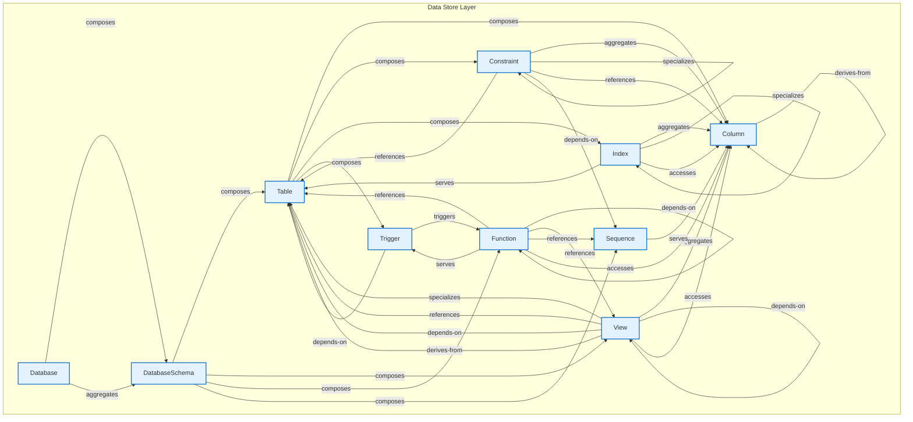

# Data Store Layer - Intra-Layer Relationships

## Overview

**Purpose**: Define semantic links between entities WITHIN this layer, capturing
structural composition, behavioral dependencies, and influence relationships.

**Layer ID**: `08-data-store`
**Analysis Date**: Generated automatically
**Validation**: Uses MarkdownLayerParser for closed-loop validation

---

### Relationship Diagram

## Layer Summary

### Entity Coverage (Target: 2+ relationships per entity)

- **Entities Meeting Target**: 10/10
- **Entity Coverage**: 100.0%

### Coverage Matrix

| Entity         | Outgoing | Incoming | Total  | Meets Target | Status     |
| -------------- | -------- | -------- | ------ | ------------ | ---------- |
| Column         | 1        | 10       | 11     | ✓            | Complete   |
| Constraint     | 5        | 2        | 7      | ✓            | Complete   |
| Database       | 2        | 0        | 2      | ✓            | Complete   |
| DatabaseSchema | 4        | 2        | 6      | ✓            | Complete   |
| Function       | 7        | 4        | 11     | ✓            | Complete   |
| Index          | 4        | 2        | 6      | ✓            | Complete   |
| Sequence       | 1        | 3        | 4      | ✓            | Complete   |
| Table          | 4        | 9        | 13     | ✓            | Complete   |
| Trigger        | 2        | 2        | 4      | ✓            | Complete   |
| View           | 8        | 4        | 12     | ✓            | Complete   |
| **TOTAL**      | **-**    | **-**    | **76** | **10/10**    | **100.0%** |

### Relationship Statistics

- **Total Unique Relationships**: 38
- **Total Connections (Entity Perspective)**: 76
- **Average Connections per Entity**: 7.6
- **Entity Coverage Target**: 2+ relationships

## Entity: Column

**Definition**: Table column definition

### Outgoing Relationships (Column → Other Entities)

| Relationship Type | Target Entity | Predicate      | Status           | Source                                                       | In Catalog | Documented                                                 |
| ----------------- | ------------- | -------------- | ---------------- | ------------------------------------------------------------ | ---------- | ---------------------------------------------------------- |
| derives-from      | Column        | `derives-from` | Documented + XML | [Doc](../../spec/layers/08-data-store-layer.md#relationships) | ✓          | [✓](../../spec/layers/08-data-store-layer.md#relationships) |

### Incoming Relationships (Other Entities → Column)

| Relationship Type | Source Entity | Predicate      | Status           | Source                                                       | In Catalog | Documented                                                 |
| ----------------- | ------------- | -------------- | ---------------- | ------------------------------------------------------------ | ---------- | ---------------------------------------------------------- |
| derives-from      | Column        | `derives-from` | Documented + XML | [Doc](../../spec/layers/08-data-store-layer.md#relationships) | ✓          | [✓](../../spec/layers/08-data-store-layer.md#relationships) |
| aggregation       | Constraint    | `aggregates`   | Documented + XML | [Doc](../../spec/layers/08-data-store-layer.md#relationships) | ✓          | [✓](../../spec/layers/08-data-store-layer.md#relationships) |
| reference         | Constraint    | `references`   | Documented + XML | [Doc](../../spec/layers/08-data-store-layer.md#relationships) | ✓          | [✓](../../spec/layers/08-data-store-layer.md#relationships) |
| access            | Function      | `accesses`     | Documented + XML | [Doc](../../spec/layers/08-data-store-layer.md#relationships) | ✓          | [✓](../../spec/layers/08-data-store-layer.md#relationships) |
| access            | Index         | `accesses`     | Documented + XML | [Doc](../../spec/layers/08-data-store-layer.md#relationships) | ✓          | [✓](../../spec/layers/08-data-store-layer.md#relationships) |
| aggregation       | Index         | `aggregates`   | Documented + XML | [Doc](../../spec/layers/08-data-store-layer.md#relationships) | ✓          | [✓](../../spec/layers/08-data-store-layer.md#relationships) |
| serving           | Sequence      | `serves`       | Documented + XML | [Doc](../../spec/layers/08-data-store-layer.md#relationships) | ✓          | [✓](../../spec/layers/08-data-store-layer.md#relationships) |
| composition       | Table         | `composes`     | Documented + XML | [Doc](../../spec/layers/08-data-store-layer.md#relationships) | ✓          | [✓](../../spec/layers/08-data-store-layer.md#relationships) |
| access            | View          | `accesses`     | Documented + XML | [Doc](../../spec/layers/08-data-store-layer.md#relationships) | ✓          | [✓](../../spec/layers/08-data-store-layer.md#relationships) |
| aggregation       | View          | `aggregates`   | Documented + XML | [Doc](../../spec/layers/08-data-store-layer.md#relationships) | ✓          | [✓](../../spec/layers/08-data-store-layer.md#relationships) |

### Relationship Summary

- **Total Relationships**: 11
- **Outgoing**: 1
- **Incoming**: 10
- **Documented**: 11/11
- **With XML Examples**: 11/11
- **In Catalog**: 11/11

---

## Entity: Constraint

**Definition**: Table constraint

### Outgoing Relationships (Constraint → Other Entities)

| Relationship Type | Target Entity | Predicate     | Status           | Source                                                       | In Catalog | Documented                                                 |
| ----------------- | ------------- | ------------- | ---------------- | ------------------------------------------------------------ | ---------- | ---------------------------------------------------------- |
| aggregation       | Column        | `aggregates`  | Documented + XML | [Doc](../../spec/layers/08-data-store-layer.md#relationships) | ✓          | [✓](../../spec/layers/08-data-store-layer.md#relationships) |
| reference         | Column        | `references`  | Documented + XML | [Doc](../../spec/layers/08-data-store-layer.md#relationships) | ✓          | [✓](../../spec/layers/08-data-store-layer.md#relationships) |
| specialization    | Constraint    | `specializes` | Documented + XML | [Doc](../../spec/layers/08-data-store-layer.md#relationships) | ✓          | [✓](../../spec/layers/08-data-store-layer.md#relationships) |
| depends-on        | Sequence      | `depends-on`  | Documented + XML | [Doc](../../spec/layers/08-data-store-layer.md#relationships) | ✓          | [✓](../../spec/layers/08-data-store-layer.md#relationships) |
| reference         | Table         | `references`  | Documented + XML | [Doc](../../spec/layers/08-data-store-layer.md#relationships) | ✓          | [✓](../../spec/layers/08-data-store-layer.md#relationships) |

### Incoming Relationships (Other Entities → Constraint)

| Relationship Type | Source Entity | Predicate     | Status           | Source                                                       | In Catalog | Documented                                                 |
| ----------------- | ------------- | ------------- | ---------------- | ------------------------------------------------------------ | ---------- | ---------------------------------------------------------- |
| specialization    | Constraint    | `specializes` | Documented + XML | [Doc](../../spec/layers/08-data-store-layer.md#relationships) | ✓          | [✓](../../spec/layers/08-data-store-layer.md#relationships) |
| composition       | Table         | `composes`    | Documented + XML | [Doc](../../spec/layers/08-data-store-layer.md#relationships) | ✓          | [✓](../../spec/layers/08-data-store-layer.md#relationships) |

### Relationship Summary

- **Total Relationships**: 7
- **Outgoing**: 5
- **Incoming**: 2
- **Documented**: 7/7
- **With XML Examples**: 7/7
- **In Catalog**: 7/7

---

## Entity: Database

**Definition**: Database instance containing schemas

### Outgoing Relationships (Database → Other Entities)

| Relationship Type | Target Entity  | Predicate    | Status           | Source                                                       | In Catalog | Documented                                                 |
| ----------------- | -------------- | ------------ | ---------------- | ------------------------------------------------------------ | ---------- | ---------------------------------------------------------- |
| aggregation       | DatabaseSchema | `aggregates` | Documented + XML | [Doc](../../spec/layers/08-data-store-layer.md#relationships) | ✓          | [✓](../../spec/layers/08-data-store-layer.md#relationships) |
| composition       | DatabaseSchema | `composes`   | Documented + XML | [Doc](../../spec/layers/08-data-store-layer.md#relationships) | ✓          | [✓](../../spec/layers/08-data-store-layer.md#relationships) |

### Incoming Relationships (Other Entities → Database)

_No incoming intra-layer relationships documented._

### Relationship Summary

- **Total Relationships**: 2
- **Outgoing**: 2
- **Incoming**: 0
- **Documented**: 2/2
- **With XML Examples**: 2/2
- **In Catalog**: 2/2

---

## Entity: DatabaseSchema

**Definition**: Logical grouping of database objects

### Outgoing Relationships (DatabaseSchema → Other Entities)

| Relationship Type | Target Entity | Predicate  | Status           | Source                                                       | In Catalog | Documented                                                 |
| ----------------- | ------------- | ---------- | ---------------- | ------------------------------------------------------------ | ---------- | ---------------------------------------------------------- |
| composition       | Function      | `composes` | Documented + XML | [Doc](../../spec/layers/08-data-store-layer.md#relationships) | ✓          | [✓](../../spec/layers/08-data-store-layer.md#relationships) |
| composition       | Sequence      | `composes` | Documented + XML | [Doc](../../spec/layers/08-data-store-layer.md#relationships) | ✓          | [✓](../../spec/layers/08-data-store-layer.md#relationships) |
| composition       | Table         | `composes` | Documented + XML | [Doc](../../spec/layers/08-data-store-layer.md#relationships) | ✓          | [✓](../../spec/layers/08-data-store-layer.md#relationships) |
| composition       | View          | `composes` | Documented + XML | [Doc](../../spec/layers/08-data-store-layer.md#relationships) | ✓          | [✓](../../spec/layers/08-data-store-layer.md#relationships) |

### Incoming Relationships (Other Entities → DatabaseSchema)

| Relationship Type | Source Entity | Predicate    | Status           | Source                                                       | In Catalog | Documented                                                 |
| ----------------- | ------------- | ------------ | ---------------- | ------------------------------------------------------------ | ---------- | ---------------------------------------------------------- |
| aggregation       | Database      | `aggregates` | Documented + XML | [Doc](../../spec/layers/08-data-store-layer.md#relationships) | ✓          | [✓](../../spec/layers/08-data-store-layer.md#relationships) |
| composition       | Database      | `composes`   | Documented + XML | [Doc](../../spec/layers/08-data-store-layer.md#relationships) | ✓          | [✓](../../spec/layers/08-data-store-layer.md#relationships) |

### Relationship Summary

- **Total Relationships**: 6
- **Outgoing**: 4
- **Incoming**: 2
- **Documented**: 6/6
- **With XML Examples**: 6/6
- **In Catalog**: 6/6

---

## Entity: Function

**Definition**: A stored database function that encapsulates reusable computation logic. Returns a value and can be used in SQL expressions for data transformation or validation.

### Outgoing Relationships (Function → Other Entities)

| Relationship Type | Target Entity | Predicate     | Status           | Source                                                       | In Catalog | Documented                                                 |
| ----------------- | ------------- | ------------- | ---------------- | ------------------------------------------------------------ | ---------- | ---------------------------------------------------------- |
| access            | Column        | `accesses`    | Documented + XML | [Doc](../../spec/layers/08-data-store-layer.md#relationships) | ✓          | [✓](../../spec/layers/08-data-store-layer.md#relationships) |
| depends-on        | Function      | `depends-on`  | Documented + XML | [Doc](../../spec/layers/08-data-store-layer.md#relationships) | ✓          | [✓](../../spec/layers/08-data-store-layer.md#relationships) |
| specialization    | Function      | `specializes` | Documented + XML | [Doc](../../spec/layers/08-data-store-layer.md#relationships) | ✓          | [✓](../../spec/layers/08-data-store-layer.md#relationships) |
| reference         | Sequence      | `references`  | Documented + XML | [Doc](../../spec/layers/08-data-store-layer.md#relationships) | ✓          | [✓](../../spec/layers/08-data-store-layer.md#relationships) |
| reference         | Table         | `references`  | Documented + XML | [Doc](../../spec/layers/08-data-store-layer.md#relationships) | ✓          | [✓](../../spec/layers/08-data-store-layer.md#relationships) |
| serving           | Trigger       | `serves`      | Documented + XML | [Doc](../../spec/layers/08-data-store-layer.md#relationships) | ✓          | [✓](../../spec/layers/08-data-store-layer.md#relationships) |
| reference         | View          | `references`  | Documented + XML | [Doc](../../spec/layers/08-data-store-layer.md#relationships) | ✓          | [✓](../../spec/layers/08-data-store-layer.md#relationships) |

### Incoming Relationships (Other Entities → Function)

| Relationship Type | Source Entity  | Predicate     | Status           | Source                                                       | In Catalog | Documented                                                 |
| ----------------- | -------------- | ------------- | ---------------- | ------------------------------------------------------------ | ---------- | ---------------------------------------------------------- |
| composition       | DatabaseSchema | `composes`    | Documented + XML | [Doc](../../spec/layers/08-data-store-layer.md#relationships) | ✓          | [✓](../../spec/layers/08-data-store-layer.md#relationships) |
| depends-on        | Function       | `depends-on`  | Documented + XML | [Doc](../../spec/layers/08-data-store-layer.md#relationships) | ✓          | [✓](../../spec/layers/08-data-store-layer.md#relationships) |
| specialization    | Function       | `specializes` | Documented + XML | [Doc](../../spec/layers/08-data-store-layer.md#relationships) | ✓          | [✓](../../spec/layers/08-data-store-layer.md#relationships) |
| triggering        | Trigger        | `triggers`    | Documented + XML | [Doc](../../spec/layers/08-data-store-layer.md#relationships) | ✓          | [✓](../../spec/layers/08-data-store-layer.md#relationships) |

### Relationship Summary

- **Total Relationships**: 11
- **Outgoing**: 7
- **Incoming**: 4
- **Documented**: 11/11
- **With XML Examples**: 11/11
- **In Catalog**: 11/11

---

## Entity: Index

**Definition**: Database index for query optimization

### Outgoing Relationships (Index → Other Entities)

| Relationship Type | Target Entity | Predicate     | Status           | Source                                                       | In Catalog | Documented                                                 |
| ----------------- | ------------- | ------------- | ---------------- | ------------------------------------------------------------ | ---------- | ---------------------------------------------------------- |
| access            | Column        | `accesses`    | Documented + XML | [Doc](../../spec/layers/08-data-store-layer.md#relationships) | ✓          | [✓](../../spec/layers/08-data-store-layer.md#relationships) |
| aggregation       | Column        | `aggregates`  | Documented + XML | [Doc](../../spec/layers/08-data-store-layer.md#relationships) | ✓          | [✓](../../spec/layers/08-data-store-layer.md#relationships) |
| specialization    | Index         | `specializes` | Documented + XML | [Doc](../../spec/layers/08-data-store-layer.md#relationships) | ✓          | [✓](../../spec/layers/08-data-store-layer.md#relationships) |
| serving           | Table         | `serves`      | Documented + XML | [Doc](../../spec/layers/08-data-store-layer.md#relationships) | ✓          | [✓](../../spec/layers/08-data-store-layer.md#relationships) |

### Incoming Relationships (Other Entities → Index)

| Relationship Type | Source Entity | Predicate     | Status           | Source                                                       | In Catalog | Documented                                                 |
| ----------------- | ------------- | ------------- | ---------------- | ------------------------------------------------------------ | ---------- | ---------------------------------------------------------- |
| specialization    | Index         | `specializes` | Documented + XML | [Doc](../../spec/layers/08-data-store-layer.md#relationships) | ✓          | [✓](../../spec/layers/08-data-store-layer.md#relationships) |
| composition       | Table         | `composes`    | Documented + XML | [Doc](../../spec/layers/08-data-store-layer.md#relationships) | ✓          | [✓](../../spec/layers/08-data-store-layer.md#relationships) |

### Relationship Summary

- **Total Relationships**: 6
- **Outgoing**: 4
- **Incoming**: 2
- **Documented**: 6/6
- **With XML Examples**: 6/6
- **In Catalog**: 6/6

---

## Entity: Sequence

**Definition**: A database sequence generator that produces unique, ordered numeric values. Used for generating primary keys, order numbers, or other sequential identifiers.

### Outgoing Relationships (Sequence → Other Entities)

| Relationship Type | Target Entity | Predicate | Status           | Source                                                       | In Catalog | Documented                                                 |
| ----------------- | ------------- | --------- | ---------------- | ------------------------------------------------------------ | ---------- | ---------------------------------------------------------- |
| serving           | Column        | `serves`  | Documented + XML | [Doc](../../spec/layers/08-data-store-layer.md#relationships) | ✓          | [✓](../../spec/layers/08-data-store-layer.md#relationships) |

### Incoming Relationships (Other Entities → Sequence)

| Relationship Type | Source Entity  | Predicate    | Status           | Source                                                       | In Catalog | Documented                                                 |
| ----------------- | -------------- | ------------ | ---------------- | ------------------------------------------------------------ | ---------- | ---------------------------------------------------------- |
| depends-on        | Constraint     | `depends-on` | Documented + XML | [Doc](../../spec/layers/08-data-store-layer.md#relationships) | ✓          | [✓](../../spec/layers/08-data-store-layer.md#relationships) |
| composition       | DatabaseSchema | `composes`   | Documented + XML | [Doc](../../spec/layers/08-data-store-layer.md#relationships) | ✓          | [✓](../../spec/layers/08-data-store-layer.md#relationships) |
| reference         | Function       | `references` | Documented + XML | [Doc](../../spec/layers/08-data-store-layer.md#relationships) | ✓          | [✓](../../spec/layers/08-data-store-layer.md#relationships) |

### Relationship Summary

- **Total Relationships**: 4
- **Outgoing**: 1
- **Incoming**: 3
- **Documented**: 4/4
- **With XML Examples**: 4/4
- **In Catalog**: 4/4

---

## Entity: Table

**Definition**: Database table definition

### Outgoing Relationships (Table → Other Entities)

| Relationship Type | Target Entity | Predicate  | Status           | Source                                                       | In Catalog | Documented                                                 |
| ----------------- | ------------- | ---------- | ---------------- | ------------------------------------------------------------ | ---------- | ---------------------------------------------------------- |
| composition       | Column        | `composes` | Documented + XML | [Doc](../../spec/layers/08-data-store-layer.md#relationships) | ✓          | [✓](../../spec/layers/08-data-store-layer.md#relationships) |
| composition       | Constraint    | `composes` | Documented + XML | [Doc](../../spec/layers/08-data-store-layer.md#relationships) | ✓          | [✓](../../spec/layers/08-data-store-layer.md#relationships) |
| composition       | Index         | `composes` | Documented + XML | [Doc](../../spec/layers/08-data-store-layer.md#relationships) | ✓          | [✓](../../spec/layers/08-data-store-layer.md#relationships) |
| composition       | Trigger       | `composes` | Documented + XML | [Doc](../../spec/layers/08-data-store-layer.md#relationships) | ✓          | [✓](../../spec/layers/08-data-store-layer.md#relationships) |

### Incoming Relationships (Other Entities → Table)

| Relationship Type | Source Entity  | Predicate      | Status           | Source                                                       | In Catalog | Documented                                                 |
| ----------------- | -------------- | -------------- | ---------------- | ------------------------------------------------------------ | ---------- | ---------------------------------------------------------- |
| reference         | Constraint     | `references`   | Documented + XML | [Doc](../../spec/layers/08-data-store-layer.md#relationships) | ✓          | [✓](../../spec/layers/08-data-store-layer.md#relationships) |
| composition       | DatabaseSchema | `composes`     | Documented + XML | [Doc](../../spec/layers/08-data-store-layer.md#relationships) | ✓          | [✓](../../spec/layers/08-data-store-layer.md#relationships) |
| reference         | Function       | `references`   | Documented + XML | [Doc](../../spec/layers/08-data-store-layer.md#relationships) | ✓          | [✓](../../spec/layers/08-data-store-layer.md#relationships) |
| serving           | Index          | `serves`       | Documented + XML | [Doc](../../spec/layers/08-data-store-layer.md#relationships) | ✓          | [✓](../../spec/layers/08-data-store-layer.md#relationships) |
| depends-on        | Trigger        | `depends-on`   | Documented + XML | [Doc](../../spec/layers/08-data-store-layer.md#relationships) | ✓          | [✓](../../spec/layers/08-data-store-layer.md#relationships) |
| depends-on        | View           | `depends-on`   | Documented + XML | [Doc](../../spec/layers/08-data-store-layer.md#relationships) | ✓          | [✓](../../spec/layers/08-data-store-layer.md#relationships) |
| derives-from      | View           | `derives-from` | Documented + XML | [Doc](../../spec/layers/08-data-store-layer.md#relationships) | ✓          | [✓](../../spec/layers/08-data-store-layer.md#relationships) |
| reference         | View           | `references`   | Documented + XML | [Doc](../../spec/layers/08-data-store-layer.md#relationships) | ✓          | [✓](../../spec/layers/08-data-store-layer.md#relationships) |
| specialization    | View           | `specializes`  | Documented + XML | [Doc](../../spec/layers/08-data-store-layer.md#relationships) | ✓          | [✓](../../spec/layers/08-data-store-layer.md#relationships) |

### Relationship Summary

- **Total Relationships**: 13
- **Outgoing**: 4
- **Incoming**: 9
- **Documented**: 13/13
- **With XML Examples**: 13/13
- **In Catalog**: 13/13

---

## Entity: Trigger

**Definition**: A database trigger that automatically executes in response to data modification events (INSERT, UPDATE, DELETE). Enables reactive database behavior and data integrity enforcement.

### Outgoing Relationships (Trigger → Other Entities)

| Relationship Type | Target Entity | Predicate    | Status           | Source                                                       | In Catalog | Documented                                                 |
| ----------------- | ------------- | ------------ | ---------------- | ------------------------------------------------------------ | ---------- | ---------------------------------------------------------- |
| triggering        | Function      | `triggers`   | Documented + XML | [Doc](../../spec/layers/08-data-store-layer.md#relationships) | ✓          | [✓](../../spec/layers/08-data-store-layer.md#relationships) |
| depends-on        | Table         | `depends-on` | Documented + XML | [Doc](../../spec/layers/08-data-store-layer.md#relationships) | ✓          | [✓](../../spec/layers/08-data-store-layer.md#relationships) |

### Incoming Relationships (Other Entities → Trigger)

| Relationship Type | Source Entity | Predicate  | Status           | Source                                                       | In Catalog | Documented                                                 |
| ----------------- | ------------- | ---------- | ---------------- | ------------------------------------------------------------ | ---------- | ---------------------------------------------------------- |
| serving           | Function      | `serves`   | Documented + XML | [Doc](../../spec/layers/08-data-store-layer.md#relationships) | ✓          | [✓](../../spec/layers/08-data-store-layer.md#relationships) |
| composition       | Table         | `composes` | Documented + XML | [Doc](../../spec/layers/08-data-store-layer.md#relationships) | ✓          | [✓](../../spec/layers/08-data-store-layer.md#relationships) |

### Relationship Summary

- **Total Relationships**: 4
- **Outgoing**: 2
- **Incoming**: 2
- **Documented**: 4/4
- **With XML Examples**: 4/4
- **In Catalog**: 4/4

---

## Entity: View

**Definition**: Database view

### Outgoing Relationships (View → Other Entities)

| Relationship Type | Target Entity | Predicate      | Status           | Source                                                       | In Catalog | Documented                                                 |
| ----------------- | ------------- | -------------- | ---------------- | ------------------------------------------------------------ | ---------- | ---------------------------------------------------------- |
| access            | Column        | `accesses`     | Documented + XML | [Doc](../../spec/layers/08-data-store-layer.md#relationships) | ✓          | [✓](../../spec/layers/08-data-store-layer.md#relationships) |
| aggregation       | Column        | `aggregates`   | Documented + XML | [Doc](../../spec/layers/08-data-store-layer.md#relationships) | ✓          | [✓](../../spec/layers/08-data-store-layer.md#relationships) |
| depends-on        | Table         | `depends-on`   | Documented + XML | [Doc](../../spec/layers/08-data-store-layer.md#relationships) | ✓          | [✓](../../spec/layers/08-data-store-layer.md#relationships) |
| derives-from      | Table         | `derives-from` | Documented + XML | [Doc](../../spec/layers/08-data-store-layer.md#relationships) | ✓          | [✓](../../spec/layers/08-data-store-layer.md#relationships) |
| reference         | Table         | `references`   | Documented + XML | [Doc](../../spec/layers/08-data-store-layer.md#relationships) | ✓          | [✓](../../spec/layers/08-data-store-layer.md#relationships) |
| specialization    | Table         | `specializes`  | Documented + XML | [Doc](../../spec/layers/08-data-store-layer.md#relationships) | ✓          | [✓](../../spec/layers/08-data-store-layer.md#relationships) |
| depends-on        | View          | `depends-on`   | Documented + XML | [Doc](../../spec/layers/08-data-store-layer.md#relationships) | ✓          | [✓](../../spec/layers/08-data-store-layer.md#relationships) |
| reference         | View          | `references`   | Documented + XML | [Doc](../../spec/layers/08-data-store-layer.md#relationships) | ✓          | [✓](../../spec/layers/08-data-store-layer.md#relationships) |

### Incoming Relationships (Other Entities → View)

| Relationship Type | Source Entity  | Predicate    | Status           | Source                                                       | In Catalog | Documented                                                 |
| ----------------- | -------------- | ------------ | ---------------- | ------------------------------------------------------------ | ---------- | ---------------------------------------------------------- |
| composition       | DatabaseSchema | `composes`   | Documented + XML | [Doc](../../spec/layers/08-data-store-layer.md#relationships) | ✓          | [✓](../../spec/layers/08-data-store-layer.md#relationships) |
| reference         | Function       | `references` | Documented + XML | [Doc](../../spec/layers/08-data-store-layer.md#relationships) | ✓          | [✓](../../spec/layers/08-data-store-layer.md#relationships) |
| depends-on        | View           | `depends-on` | Documented + XML | [Doc](../../spec/layers/08-data-store-layer.md#relationships) | ✓          | [✓](../../spec/layers/08-data-store-layer.md#relationships) |
| reference         | View           | `references` | Documented + XML | [Doc](../../spec/layers/08-data-store-layer.md#relationships) | ✓          | [✓](../../spec/layers/08-data-store-layer.md#relationships) |

### Relationship Summary

- **Total Relationships**: 12
- **Outgoing**: 8
- **Incoming**: 4
- **Documented**: 12/12
- **With XML Examples**: 12/12
- **In Catalog**: 12/12

---
