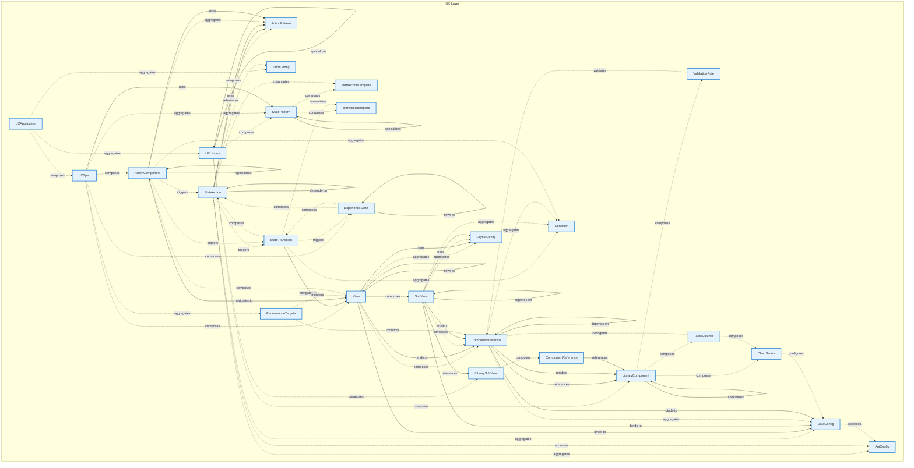

# UX Layer - Intra-Layer Relationships

## Overview

**Purpose**: Define semantic links between entities WITHIN this layer, capturing
structural composition, behavioral dependencies, and influence relationships.

**Layer ID**: `09-ux`
**Analysis Date**: Generated automatically
**Validation**: Uses MarkdownLayerParser for closed-loop validation

---

### Relationship Diagram



## Layer Summary

### Entity Coverage (Target: 2+ relationships per entity)

- **Entities Meeting Target**: 26/26
- **Entity Coverage**: 100.0%

### Coverage Matrix

| Entity              | Outgoing | Incoming | Total   | Meets Target | Status     |
| ------------------- | -------- | -------- | ------- | ------------ | ---------- |
| ActionComponent     | 8        | 4        | 12      | ✓            | Complete   |
| ActionPattern       | 0        | 5        | 5       | ✓            | Complete   |
| ApiConfig           | 0        | 3        | 3       | ✓            | Complete   |
| ChartSeries         | 1        | 2        | 3       | ✓            | Complete   |
| ComponentInstance   | 6        | 8        | 14      | ✓            | Complete   |
| ComponentReference  | 1        | 1        | 2       | ✓            | Complete   |
| Condition           | 0        | 4        | 4       | ✓            | Complete   |
| DataConfig          | 1        | 6        | 7       | ✓            | Complete   |
| ErrorConfig         | 0        | 2        | 2       | ✓            | Complete   |
| ExperienceState     | 3        | 3        | 6       | ✓            | Complete   |
| LayoutConfig        | 0        | 4        | 4       | ✓            | Complete   |
| LibraryComponent    | 4        | 5        | 9       | ✓            | Complete   |
| LibrarySubView      | 1        | 2        | 3       | ✓            | Complete   |
| PerformanceTargets  | 2        | 1        | 3       | ✓            | Complete   |
| StateAction         | 10       | 5        | 15      | ✓            | Complete   |
| StateActionTemplate | 0        | 2        | 2       | ✓            | Complete   |
| StatePattern        | 3        | 4        | 7       | ✓            | Complete   |
| StateTransition     | 5        | 3        | 8       | ✓            | Complete   |
| SubView             | 9        | 3        | 12      | ✓            | Complete   |
| TableColumn         | 2        | 1        | 3       | ✓            | Complete   |
| TransitionTemplate  | 0        | 2        | 2       | ✓            | Complete   |
| UXApplication       | 3        | 0        | 3       | ✓            | Complete   |
| UXLibrary           | 5        | 2        | 7       | ✓            | Complete   |
| UXSpec              | 6        | 1        | 7       | ✓            | Complete   |
| ValidationRule      | 1        | 1        | 2       | ✓            | Complete   |
| View                | 9        | 6        | 15      | ✓            | Complete   |
| **TOTAL**           | **-**    | **-**    | **160** | **26/26**    | **100.0%** |

### Relationship Statistics

- **Total Unique Relationships**: 80
- **Total Connections (Entity Perspective)**: 160
- **Average Connections per Entity**: 6.2
- **Entity Coverage Target**: 2+ relationships

### Priority Gaps

_These relationships appear frequently but are not in the catalog:_

1. **composition (composes)** - Appears 48 time(s)
2. **aggregation (aggregates)** - Appears 30 time(s)
3. **triggering (triggers)** - Appears 8 time(s)
4. **access (accesses)** - Appears 4 time(s)
5. **instantiates (instantiates)** - Appears 4 time(s)

## Entity: ActionComponent

**Definition**: Interactive element that triggers actions (button, menu, link, voice command)

### Outgoing Relationships (ActionComponent → Other Entities)

| Relationship Type | Target Entity   | Predicate      | Status           | Source                                                | In Catalog | Documented                                          |
| ----------------- | --------------- | -------------- | ---------------- | ----------------------------------------------------- | ---------- | --------------------------------------------------- |
| composition       | ActionComponent | `composes`     | Documented + XML | [Doc](../../spec/layers/09-ux-layer.md#relationships) | ✗          | [✓](../../spec/layers/09-ux-layer.md#relationships) |
| specialization    | ActionComponent | `specializes`  | Documented + XML | [Doc](../../spec/layers/09-ux-layer.md#relationships) | ✓          | [✓](../../spec/layers/09-ux-layer.md#relationships) |
| aggregation       | ActionPattern   | `aggregates`   | Documented + XML | [Doc](../../spec/layers/09-ux-layer.md#relationships) | ✗          | [✓](../../spec/layers/09-ux-layer.md#relationships) |
| uses              | ActionPattern   | `uses`         | Documented + XML | [Doc](../../spec/layers/09-ux-layer.md#relationships) | ✓          | [✓](../../spec/layers/09-ux-layer.md#relationships) |
| aggregation       | Condition       | `aggregates`   | Documented + XML | [Doc](../../spec/layers/09-ux-layer.md#relationships) | ✗          | [✓](../../spec/layers/09-ux-layer.md#relationships) |
| triggering        | StateAction     | `triggers`     | Documented + XML | [Doc](../../spec/layers/09-ux-layer.md#relationships) | ✗          | [✓](../../spec/layers/09-ux-layer.md#relationships) |
| triggering        | StateTransition | `triggers`     | Documented + XML | [Doc](../../spec/layers/09-ux-layer.md#relationships) | ✗          | [✓](../../spec/layers/09-ux-layer.md#relationships) |
| navigates-to      | View            | `navigates-to` | Documented + XML | [Doc](../../spec/layers/09-ux-layer.md#relationships) | ✓          | [✓](../../spec/layers/09-ux-layer.md#relationships) |

### Incoming Relationships (Other Entities → ActionComponent)

| Relationship Type | Source Entity   | Predicate     | Status           | Source                                                | In Catalog | Documented                                          |
| ----------------- | --------------- | ------------- | ---------------- | ----------------------------------------------------- | ---------- | --------------------------------------------------- |
| composition       | ActionComponent | `composes`    | Documented + XML | [Doc](../../spec/layers/09-ux-layer.md#relationships) | ✗          | [✓](../../spec/layers/09-ux-layer.md#relationships) |
| specialization    | ActionComponent | `specializes` | Documented + XML | [Doc](../../spec/layers/09-ux-layer.md#relationships) | ✓          | [✓](../../spec/layers/09-ux-layer.md#relationships) |
| composition       | UXSpec          | `composes`    | Documented + XML | [Doc](../../spec/layers/09-ux-layer.md#relationships) | ✗          | [✓](../../spec/layers/09-ux-layer.md#relationships) |
| composition       | View            | `composes`    | Documented + XML | [Doc](../../spec/layers/09-ux-layer.md#relationships) | ✗          | [✓](../../spec/layers/09-ux-layer.md#relationships) |

### Relationship Summary

- **Total Relationships**: 12
- **Outgoing**: 8
- **Incoming**: 4
- **Documented**: 12/12
- **With XML Examples**: 12/12
- **In Catalog**: 4/12

### Recommended Catalog Updates

_The following relationships should be added to relationship-catalog.json:_

**composition** (ActionComponent → ActionComponent):

```json
{
  "id": "composition",
  "predicate": "composes",
  "inversePredicate": "composed-of",
  "category": "structural",
  "applicableLayers": ["09"],
  "description": "ActionComponent composes ActionComponent"
}
```

**aggregation** (ActionComponent → ActionPattern):

```json
{
  "id": "aggregation",
  "predicate": "aggregates",
  "inversePredicate": "aggregated-by",
  "category": "structural",
  "applicableLayers": ["09"],
  "description": "ActionComponent aggregates ActionPattern"
}
```

**aggregation** (ActionComponent → Condition):

```json
{
  "id": "aggregation",
  "predicate": "aggregates",
  "inversePredicate": "aggregated-by",
  "category": "structural",
  "applicableLayers": ["09"],
  "description": "ActionComponent aggregates Condition"
}
```

_...and 5 more relationships_

---

## Entity: ActionPattern

**Definition**: Reusable action configuration for common user interactions

### Outgoing Relationships (ActionPattern → Other Entities)

_No outgoing intra-layer relationships documented._

### Incoming Relationships (Other Entities → ActionPattern)

| Relationship Type | Source Entity   | Predicate    | Status           | Source                                                | In Catalog | Documented                                          |
| ----------------- | --------------- | ------------ | ---------------- | ----------------------------------------------------- | ---------- | --------------------------------------------------- |
| aggregation       | ActionComponent | `aggregates` | Documented + XML | [Doc](../../spec/layers/09-ux-layer.md#relationships) | ✗          | [✓](../../spec/layers/09-ux-layer.md#relationships) |
| uses              | ActionComponent | `uses`       | Documented + XML | [Doc](../../spec/layers/09-ux-layer.md#relationships) | ✓          | [✓](../../spec/layers/09-ux-layer.md#relationships) |
| reference         | StateAction     | `references` | Documented + XML | [Doc](../../spec/layers/09-ux-layer.md#relationships) | ✓          | [✓](../../spec/layers/09-ux-layer.md#relationships) |
| uses              | StateAction     | `uses`       | Documented + XML | [Doc](../../spec/layers/09-ux-layer.md#relationships) | ✓          | [✓](../../spec/layers/09-ux-layer.md#relationships) |
| composition       | UXLibrary       | `composes`   | Documented + XML | [Doc](../../spec/layers/09-ux-layer.md#relationships) | ✗          | [✓](../../spec/layers/09-ux-layer.md#relationships) |

### Relationship Summary

- **Total Relationships**: 5
- **Outgoing**: 0
- **Incoming**: 5
- **Documented**: 5/5
- **With XML Examples**: 5/5
- **In Catalog**: 3/5

### Recommended Catalog Updates

_The following relationships should be added to relationship-catalog.json:_

**composition** (UXLibrary → ActionPattern):

```json
{
  "id": "composition",
  "predicate": "composes",
  "inversePredicate": "composed-of",
  "category": "structural",
  "applicableLayers": ["09"],
  "description": "UXLibrary composes ActionPattern"
}
```

**aggregation** (ActionComponent → ActionPattern):

```json
{
  "id": "aggregation",
  "predicate": "aggregates",
  "inversePredicate": "aggregated-by",
  "category": "structural",
  "applicableLayers": ["09"],
  "description": "ActionComponent aggregates ActionPattern"
}
```

---

## Entity: ApiConfig

**Definition**: Configuration for API integration within UI components, specifying endpoints, request/response mapping, authentication, and caching strategies. Connects UI to backend services.

### Outgoing Relationships (ApiConfig → Other Entities)

_No outgoing intra-layer relationships documented._

### Incoming Relationships (Other Entities → ApiConfig)

| Relationship Type | Source Entity | Predicate    | Status           | Source                                                | In Catalog | Documented                                          |
| ----------------- | ------------- | ------------ | ---------------- | ----------------------------------------------------- | ---------- | --------------------------------------------------- |
| access            | DataConfig    | `accesses`   | Documented + XML | [Doc](../../spec/layers/09-ux-layer.md#relationships) | ✗          | [✓](../../spec/layers/09-ux-layer.md#relationships) |
| access            | StateAction   | `accesses`   | Documented + XML | [Doc](../../spec/layers/09-ux-layer.md#relationships) | ✗          | [✓](../../spec/layers/09-ux-layer.md#relationships) |
| aggregation       | StateAction   | `aggregates` | Documented + XML | [Doc](../../spec/layers/09-ux-layer.md#relationships) | ✗          | [✓](../../spec/layers/09-ux-layer.md#relationships) |

### Relationship Summary

- **Total Relationships**: 3
- **Outgoing**: 0
- **Incoming**: 3
- **Documented**: 3/3
- **With XML Examples**: 3/3
- **In Catalog**: 0/3

### Recommended Catalog Updates

_The following relationships should be added to relationship-catalog.json:_

**aggregation** (StateAction → ApiConfig):

```json
{
  "id": "aggregation",
  "predicate": "aggregates",
  "inversePredicate": "aggregated-by",
  "category": "structural",
  "applicableLayers": ["09"],
  "description": "StateAction aggregates ApiConfig"
}
```

**access** (StateAction → ApiConfig):

```json
{
  "id": "access",
  "predicate": "accesses",
  "inversePredicate": "accessed-by",
  "category": "structural",
  "applicableLayers": ["09"],
  "description": "StateAction accesses ApiConfig"
}
```

**access** (DataConfig → ApiConfig):

```json
{
  "id": "access",
  "predicate": "accesses",
  "inversePredicate": "accessed-by",
  "category": "structural",
  "applicableLayers": ["09"],
  "description": "DataConfig accesses ApiConfig"
}
```

---

## Entity: ChartSeries

**Definition**: Configuration for a data series within a chart component, specifying data source, visualization type, colors, and legend properties. Defines how data is visualized in charts.

### Outgoing Relationships (ChartSeries → Other Entities)

| Relationship Type | Target Entity | Predicate    | Status           | Source                                                | In Catalog | Documented                                          |
| ----------------- | ------------- | ------------ | ---------------- | ----------------------------------------------------- | ---------- | --------------------------------------------------- |
| configures        | DataConfig    | `configures` | Documented + XML | [Doc](../../spec/layers/09-ux-layer.md#relationships) | ✗          | [✓](../../spec/layers/09-ux-layer.md#relationships) |

### Incoming Relationships (Other Entities → ChartSeries)

| Relationship Type | Source Entity    | Predicate  | Status           | Source                                                | In Catalog | Documented                                          |
| ----------------- | ---------------- | ---------- | ---------------- | ----------------------------------------------------- | ---------- | --------------------------------------------------- |
| composition       | LibraryComponent | `composes` | Documented + XML | [Doc](../../spec/layers/09-ux-layer.md#relationships) | ✗          | [✓](../../spec/layers/09-ux-layer.md#relationships) |
| composition       | TableColumn      | `composes` | Documented + XML | [Doc](../../spec/layers/09-ux-layer.md#relationships) | ✗          | [✓](../../spec/layers/09-ux-layer.md#relationships) |

### Relationship Summary

- **Total Relationships**: 3
- **Outgoing**: 1
- **Incoming**: 2
- **Documented**: 3/3
- **With XML Examples**: 3/3
- **In Catalog**: 0/3

### Recommended Catalog Updates

_The following relationships should be added to relationship-catalog.json:_

**configures** (ChartSeries → DataConfig):

```json
{
  "id": "configures",
  "predicate": "configures",
  "inversePredicate": "configured-by",
  "category": "structural",
  "applicableLayers": ["09"],
  "description": "ChartSeries configures DataConfig"
}
```

**composition** (LibraryComponent → ChartSeries):

```json
{
  "id": "composition",
  "predicate": "composes",
  "inversePredicate": "composed-of",
  "category": "structural",
  "applicableLayers": ["09"],
  "description": "LibraryComponent composes ChartSeries"
}
```

**composition** (TableColumn → ChartSeries):

```json
{
  "id": "composition",
  "predicate": "composes",
  "inversePredicate": "composed-of",
  "category": "structural",
  "applicableLayers": ["09"],
  "description": "TableColumn composes ChartSeries"
}
```

---

## Entity: ComponentInstance

**Definition**: Instance of a LibraryComponent with application-specific configuration

### Outgoing Relationships (ComponentInstance → Other Entities)

| Relationship Type | Target Entity     | Predicate    | Status           | Source                                                | In Catalog | Documented                                          |
| ----------------- | ----------------- | ------------ | ---------------- | ----------------------------------------------------- | ---------- | --------------------------------------------------- |
| depends-on        | ComponentInstance | `depends-on` | Documented + XML | [Doc](../../spec/layers/09-ux-layer.md#relationships) | ✓          | [✓](../../spec/layers/09-ux-layer.md#relationships) |
| aggregation       | Condition         | `aggregates` | Documented + XML | [Doc](../../spec/layers/09-ux-layer.md#relationships) | ✗          | [✓](../../spec/layers/09-ux-layer.md#relationships) |
| aggregation       | DataConfig        | `aggregates` | Documented + XML | [Doc](../../spec/layers/09-ux-layer.md#relationships) | ✗          | [✓](../../spec/layers/09-ux-layer.md#relationships) |
| binds-to          | DataConfig        | `binds-to`   | Documented + XML | [Doc](../../spec/layers/09-ux-layer.md#relationships) | ✓          | [✓](../../spec/layers/09-ux-layer.md#relationships) |
| reference         | LibraryComponent  | `references` | Documented + XML | [Doc](../../spec/layers/09-ux-layer.md#relationships) | ✓          | [✓](../../spec/layers/09-ux-layer.md#relationships) |
| renders           | LibraryComponent  | `renders`    | Documented + XML | [Doc](../../spec/layers/09-ux-layer.md#relationships) | ✓          | [✓](../../spec/layers/09-ux-layer.md#relationships) |

### Incoming Relationships (Other Entities → ComponentInstance)

| Relationship Type | Source Entity      | Predicate    | Status           | Source                                                | In Catalog | Documented                                          |
| ----------------- | ------------------ | ------------ | ---------------- | ----------------------------------------------------- | ---------- | --------------------------------------------------- |
| depends-on        | ComponentInstance  | `depends-on` | Documented + XML | [Doc](../../spec/layers/09-ux-layer.md#relationships) | ✓          | [✓](../../spec/layers/09-ux-layer.md#relationships) |
| monitors          | PerformanceTargets | `monitors`   | Documented + XML | [Doc](../../spec/layers/09-ux-layer.md#relationships) | ✗          | [✓](../../spec/layers/09-ux-layer.md#relationships) |
| composition       | SubView            | `composes`   | Documented + XML | [Doc](../../spec/layers/09-ux-layer.md#relationships) | ✗          | [✓](../../spec/layers/09-ux-layer.md#relationships) |
| renders           | SubView            | `renders`    | Documented + XML | [Doc](../../spec/layers/09-ux-layer.md#relationships) | ✓          | [✓](../../spec/layers/09-ux-layer.md#relationships) |
| configures        | TableColumn        | `configures` | Documented + XML | [Doc](../../spec/layers/09-ux-layer.md#relationships) | ✗          | [✓](../../spec/layers/09-ux-layer.md#relationships) |
| validates         | ValidationRule     | `validates`  | Documented + XML | [Doc](../../spec/layers/09-ux-layer.md#relationships) | ✗          | [✓](../../spec/layers/09-ux-layer.md#relationships) |
| composition       | View               | `composes`   | Documented + XML | [Doc](../../spec/layers/09-ux-layer.md#relationships) | ✗          | [✓](../../spec/layers/09-ux-layer.md#relationships) |
| renders           | View               | `renders`    | Documented + XML | [Doc](../../spec/layers/09-ux-layer.md#relationships) | ✓          | [✓](../../spec/layers/09-ux-layer.md#relationships) |

### Relationship Summary

- **Total Relationships**: 14
- **Outgoing**: 6
- **Incoming**: 8
- **Documented**: 14/14
- **With XML Examples**: 14/14
- **In Catalog**: 7/14

### Recommended Catalog Updates

_The following relationships should be added to relationship-catalog.json:_

**aggregation** (ComponentInstance → DataConfig):

```json
{
  "id": "aggregation",
  "predicate": "aggregates",
  "inversePredicate": "aggregated-by",
  "category": "structural",
  "applicableLayers": ["09"],
  "description": "ComponentInstance aggregates DataConfig"
}
```

**aggregation** (ComponentInstance → Condition):

```json
{
  "id": "aggregation",
  "predicate": "aggregates",
  "inversePredicate": "aggregated-by",
  "category": "structural",
  "applicableLayers": ["09"],
  "description": "ComponentInstance aggregates Condition"
}
```

**composition** (View → ComponentInstance):

```json
{
  "id": "composition",
  "predicate": "composes",
  "inversePredicate": "composed-of",
  "category": "structural",
  "applicableLayers": ["09"],
  "description": "View composes ComponentInstance"
}
```

_...and 4 more relationships_

---

## Entity: ComponentReference

**Definition**: A reference to another UI component that can be embedded or composed within a parent component. Enables component reuse and modular UI architecture.

### Outgoing Relationships (ComponentReference → Other Entities)

| Relationship Type | Target Entity    | Predicate    | Status           | Source                                                | In Catalog | Documented                                          |
| ----------------- | ---------------- | ------------ | ---------------- | ----------------------------------------------------- | ---------- | --------------------------------------------------- |
| reference         | LibraryComponent | `references` | Documented + XML | [Doc](../../spec/layers/09-ux-layer.md#relationships) | ✓          | [✓](../../spec/layers/09-ux-layer.md#relationships) |

### Incoming Relationships (Other Entities → ComponentReference)

| Relationship Type | Source Entity  | Predicate  | Status           | Source                                                | In Catalog | Documented                                          |
| ----------------- | -------------- | ---------- | ---------------- | ----------------------------------------------------- | ---------- | --------------------------------------------------- |
| composition       | LibrarySubView | `composes` | Documented + XML | [Doc](../../spec/layers/09-ux-layer.md#relationships) | ✗          | [✓](../../spec/layers/09-ux-layer.md#relationships) |

### Relationship Summary

- **Total Relationships**: 2
- **Outgoing**: 1
- **Incoming**: 1
- **Documented**: 2/2
- **With XML Examples**: 2/2
- **In Catalog**: 1/2

### Recommended Catalog Updates

_The following relationships should be added to relationship-catalog.json:_

**composition** (LibrarySubView → ComponentReference):

```json
{
  "id": "composition",
  "predicate": "composes",
  "inversePredicate": "composed-of",
  "category": "structural",
  "applicableLayers": ["09"],
  "description": "LibrarySubView composes ComponentReference"
}
```

---

## Entity: Condition

**Definition**: Boolean expression for guard conditions

### Outgoing Relationships (Condition → Other Entities)

_No outgoing intra-layer relationships documented._

### Incoming Relationships (Other Entities → Condition)

| Relationship Type | Source Entity     | Predicate    | Status           | Source                                                | In Catalog | Documented                                          |
| ----------------- | ----------------- | ------------ | ---------------- | ----------------------------------------------------- | ---------- | --------------------------------------------------- |
| aggregation       | ActionComponent   | `aggregates` | Documented + XML | [Doc](../../spec/layers/09-ux-layer.md#relationships) | ✗          | [✓](../../spec/layers/09-ux-layer.md#relationships) |
| aggregation       | ComponentInstance | `aggregates` | Documented + XML | [Doc](../../spec/layers/09-ux-layer.md#relationships) | ✗          | [✓](../../spec/layers/09-ux-layer.md#relationships) |
| aggregation       | StateTransition   | `aggregates` | Documented + XML | [Doc](../../spec/layers/09-ux-layer.md#relationships) | ✗          | [✓](../../spec/layers/09-ux-layer.md#relationships) |
| aggregation       | SubView           | `aggregates` | Documented + XML | [Doc](../../spec/layers/09-ux-layer.md#relationships) | ✗          | [✓](../../spec/layers/09-ux-layer.md#relationships) |

### Relationship Summary

- **Total Relationships**: 4
- **Outgoing**: 0
- **Incoming**: 4
- **Documented**: 4/4
- **With XML Examples**: 4/4
- **In Catalog**: 0/4

### Recommended Catalog Updates

_The following relationships should be added to relationship-catalog.json:_

**aggregation** (ComponentInstance → Condition):

```json
{
  "id": "aggregation",
  "predicate": "aggregates",
  "inversePredicate": "aggregated-by",
  "category": "structural",
  "applicableLayers": ["09"],
  "description": "ComponentInstance aggregates Condition"
}
```

**aggregation** (SubView → Condition):

```json
{
  "id": "aggregation",
  "predicate": "aggregates",
  "inversePredicate": "aggregated-by",
  "category": "structural",
  "applicableLayers": ["09"],
  "description": "SubView aggregates Condition"
}
```

**aggregation** (ActionComponent → Condition):

```json
{
  "id": "aggregation",
  "predicate": "aggregates",
  "inversePredicate": "aggregated-by",
  "category": "structural",
  "applicableLayers": ["09"],
  "description": "ActionComponent aggregates Condition"
}
```

_...and 1 more relationships_

---

## Entity: DataConfig

**Definition**: Configuration for data binding and state management within UI components, defining data sources, transformation pipelines, and update triggers. Manages component data flow.

### Outgoing Relationships (DataConfig → Other Entities)

| Relationship Type | Target Entity | Predicate  | Status           | Source                                                | In Catalog | Documented                                          |
| ----------------- | ------------- | ---------- | ---------------- | ----------------------------------------------------- | ---------- | --------------------------------------------------- |
| access            | ApiConfig     | `accesses` | Documented + XML | [Doc](../../spec/layers/09-ux-layer.md#relationships) | ✗          | [✓](../../spec/layers/09-ux-layer.md#relationships) |

### Incoming Relationships (Other Entities → DataConfig)

| Relationship Type | Source Entity     | Predicate    | Status           | Source                                                | In Catalog | Documented                                          |
| ----------------- | ----------------- | ------------ | ---------------- | ----------------------------------------------------- | ---------- | --------------------------------------------------- |
| configures        | ChartSeries       | `configures` | Documented + XML | [Doc](../../spec/layers/09-ux-layer.md#relationships) | ✗          | [✓](../../spec/layers/09-ux-layer.md#relationships) |
| aggregation       | ComponentInstance | `aggregates` | Documented + XML | [Doc](../../spec/layers/09-ux-layer.md#relationships) | ✗          | [✓](../../spec/layers/09-ux-layer.md#relationships) |
| binds-to          | ComponentInstance | `binds-to`   | Documented + XML | [Doc](../../spec/layers/09-ux-layer.md#relationships) | ✓          | [✓](../../spec/layers/09-ux-layer.md#relationships) |
| aggregation       | StateAction       | `aggregates` | Documented + XML | [Doc](../../spec/layers/09-ux-layer.md#relationships) | ✗          | [✓](../../spec/layers/09-ux-layer.md#relationships) |
| binds-to          | SubView           | `binds-to`   | Documented + XML | [Doc](../../spec/layers/09-ux-layer.md#relationships) | ✓          | [✓](../../spec/layers/09-ux-layer.md#relationships) |
| binds-to          | View              | `binds-to`   | Documented + XML | [Doc](../../spec/layers/09-ux-layer.md#relationships) | ✓          | [✓](../../spec/layers/09-ux-layer.md#relationships) |

### Relationship Summary

- **Total Relationships**: 7
- **Outgoing**: 1
- **Incoming**: 6
- **Documented**: 7/7
- **With XML Examples**: 7/7
- **In Catalog**: 3/7

### Recommended Catalog Updates

_The following relationships should be added to relationship-catalog.json:_

**access** (DataConfig → ApiConfig):

```json
{
  "id": "access",
  "predicate": "accesses",
  "inversePredicate": "accessed-by",
  "category": "structural",
  "applicableLayers": ["09"],
  "description": "DataConfig accesses ApiConfig"
}
```

**aggregation** (ComponentInstance → DataConfig):

```json
{
  "id": "aggregation",
  "predicate": "aggregates",
  "inversePredicate": "aggregated-by",
  "category": "structural",
  "applicableLayers": ["09"],
  "description": "ComponentInstance aggregates DataConfig"
}
```

**aggregation** (StateAction → DataConfig):

```json
{
  "id": "aggregation",
  "predicate": "aggregates",
  "inversePredicate": "aggregated-by",
  "category": "structural",
  "applicableLayers": ["09"],
  "description": "StateAction aggregates DataConfig"
}
```

_...and 1 more relationships_

---

## Entity: ErrorConfig

**Definition**: Configuration for error handling and display within UI components, specifying error message formats, retry behavior, fallback content, and user guidance. Ensures consistent error UX.

### Outgoing Relationships (ErrorConfig → Other Entities)

_No outgoing intra-layer relationships documented._

### Incoming Relationships (Other Entities → ErrorConfig)

| Relationship Type | Source Entity | Predicate    | Status           | Source                                                | In Catalog | Documented                                          |
| ----------------- | ------------- | ------------ | ---------------- | ----------------------------------------------------- | ---------- | --------------------------------------------------- |
| aggregation       | StateAction   | `aggregates` | Documented + XML | [Doc](../../spec/layers/09-ux-layer.md#relationships) | ✗          | [✓](../../spec/layers/09-ux-layer.md#relationships) |
| aggregation       | UXApplication | `aggregates` | Documented + XML | [Doc](../../spec/layers/09-ux-layer.md#relationships) | ✗          | [✓](../../spec/layers/09-ux-layer.md#relationships) |

### Relationship Summary

- **Total Relationships**: 2
- **Outgoing**: 0
- **Incoming**: 2
- **Documented**: 2/2
- **With XML Examples**: 2/2
- **In Catalog**: 0/2

### Recommended Catalog Updates

_The following relationships should be added to relationship-catalog.json:_

**aggregation** (StateAction → ErrorConfig):

```json
{
  "id": "aggregation",
  "predicate": "aggregates",
  "inversePredicate": "aggregated-by",
  "category": "structural",
  "applicableLayers": ["09"],
  "description": "StateAction aggregates ErrorConfig"
}
```

**aggregation** (UXApplication → ErrorConfig):

```json
{
  "id": "aggregation",
  "predicate": "aggregates",
  "inversePredicate": "aggregated-by",
  "category": "structural",
  "applicableLayers": ["09"],
  "description": "UXApplication aggregates ErrorConfig"
}
```

---

## Entity: ExperienceState

**Definition**: Distinct state that the experience can be in (works across all channels)

### Outgoing Relationships (ExperienceState → Other Entities)

| Relationship Type | Target Entity   | Predicate  | Status           | Source                                                | In Catalog | Documented                                          |
| ----------------- | --------------- | ---------- | ---------------- | ----------------------------------------------------- | ---------- | --------------------------------------------------- |
| flow              | ExperienceState | `flows-to` | Documented + XML | [Doc](../../spec/layers/09-ux-layer.md#relationships) | ✓          | [✓](../../spec/layers/09-ux-layer.md#relationships) |
| composition       | StateAction     | `composes` | Documented + XML | [Doc](../../spec/layers/09-ux-layer.md#relationships) | ✗          | [✓](../../spec/layers/09-ux-layer.md#relationships) |
| composition       | StateTransition | `composes` | Documented + XML | [Doc](../../spec/layers/09-ux-layer.md#relationships) | ✗          | [✓](../../spec/layers/09-ux-layer.md#relationships) |

### Incoming Relationships (Other Entities → ExperienceState)

| Relationship Type | Source Entity   | Predicate  | Status           | Source                                                | In Catalog | Documented                                          |
| ----------------- | --------------- | ---------- | ---------------- | ----------------------------------------------------- | ---------- | --------------------------------------------------- |
| flow              | ExperienceState | `flows-to` | Documented + XML | [Doc](../../spec/layers/09-ux-layer.md#relationships) | ✓          | [✓](../../spec/layers/09-ux-layer.md#relationships) |
| triggering        | StateTransition | `triggers` | Documented + XML | [Doc](../../spec/layers/09-ux-layer.md#relationships) | ✗          | [✓](../../spec/layers/09-ux-layer.md#relationships) |
| composition       | UXSpec          | `composes` | Documented + XML | [Doc](../../spec/layers/09-ux-layer.md#relationships) | ✗          | [✓](../../spec/layers/09-ux-layer.md#relationships) |

### Relationship Summary

- **Total Relationships**: 6
- **Outgoing**: 3
- **Incoming**: 3
- **Documented**: 6/6
- **With XML Examples**: 6/6
- **In Catalog**: 2/6

### Recommended Catalog Updates

_The following relationships should be added to relationship-catalog.json:_

**composition** (ExperienceState → StateAction):

```json
{
  "id": "composition",
  "predicate": "composes",
  "inversePredicate": "composed-of",
  "category": "structural",
  "applicableLayers": ["09"],
  "description": "ExperienceState composes StateAction"
}
```

**composition** (ExperienceState → StateTransition):

```json
{
  "id": "composition",
  "predicate": "composes",
  "inversePredicate": "composed-of",
  "category": "structural",
  "applicableLayers": ["09"],
  "description": "ExperienceState composes StateTransition"
}
```

**composition** (UXSpec → ExperienceState):

```json
{
  "id": "composition",
  "predicate": "composes",
  "inversePredicate": "composed-of",
  "category": "structural",
  "applicableLayers": ["09"],
  "description": "UXSpec composes ExperienceState"
}
```

_...and 1 more relationships_

---

## Entity: LayoutConfig

**Definition**: Configuration for UI layout structure, defining grid systems, responsive breakpoints, spacing rules, and component arrangement patterns. Controls visual organization of the interface.

### Outgoing Relationships (LayoutConfig → Other Entities)

_No outgoing intra-layer relationships documented._

### Incoming Relationships (Other Entities → LayoutConfig)

| Relationship Type | Source Entity | Predicate    | Status           | Source                                                | In Catalog | Documented                                          |
| ----------------- | ------------- | ------------ | ---------------- | ----------------------------------------------------- | ---------- | --------------------------------------------------- |
| aggregation       | SubView       | `aggregates` | Documented + XML | [Doc](../../spec/layers/09-ux-layer.md#relationships) | ✗          | [✓](../../spec/layers/09-ux-layer.md#relationships) |
| uses              | SubView       | `uses`       | Documented + XML | [Doc](../../spec/layers/09-ux-layer.md#relationships) | ✓          | [✓](../../spec/layers/09-ux-layer.md#relationships) |
| aggregation       | View          | `aggregates` | Documented + XML | [Doc](../../spec/layers/09-ux-layer.md#relationships) | ✗          | [✓](../../spec/layers/09-ux-layer.md#relationships) |
| uses              | View          | `uses`       | Documented + XML | [Doc](../../spec/layers/09-ux-layer.md#relationships) | ✓          | [✓](../../spec/layers/09-ux-layer.md#relationships) |

### Relationship Summary

- **Total Relationships**: 4
- **Outgoing**: 0
- **Incoming**: 4
- **Documented**: 4/4
- **With XML Examples**: 4/4
- **In Catalog**: 2/4

### Recommended Catalog Updates

_The following relationships should be added to relationship-catalog.json:_

**aggregation** (View → LayoutConfig):

```json
{
  "id": "aggregation",
  "predicate": "aggregates",
  "inversePredicate": "aggregated-by",
  "category": "structural",
  "applicableLayers": ["09"],
  "description": "View aggregates LayoutConfig"
}
```

**aggregation** (SubView → LayoutConfig):

```json
{
  "id": "aggregation",
  "predicate": "aggregates",
  "inversePredicate": "aggregated-by",
  "category": "structural",
  "applicableLayers": ["09"],
  "description": "SubView aggregates LayoutConfig"
}
```

---

## Entity: LibraryComponent

**Definition**: Reusable UI component definition that can be instantiated in multiple UXSpecs

### Outgoing Relationships (LibraryComponent → Other Entities)

| Relationship Type | Target Entity    | Predicate     | Status           | Source                                                | In Catalog | Documented                                          |
| ----------------- | ---------------- | ------------- | ---------------- | ----------------------------------------------------- | ---------- | --------------------------------------------------- |
| composition       | ChartSeries      | `composes`    | Documented + XML | [Doc](../../spec/layers/09-ux-layer.md#relationships) | ✗          | [✓](../../spec/layers/09-ux-layer.md#relationships) |
| specialization    | LibraryComponent | `specializes` | Documented + XML | [Doc](../../spec/layers/09-ux-layer.md#relationships) | ✓          | [✓](../../spec/layers/09-ux-layer.md#relationships) |
| composition       | TableColumn      | `composes`    | Documented + XML | [Doc](../../spec/layers/09-ux-layer.md#relationships) | ✗          | [✓](../../spec/layers/09-ux-layer.md#relationships) |
| composition       | ValidationRule   | `composes`    | Documented + XML | [Doc](../../spec/layers/09-ux-layer.md#relationships) | ✗          | [✓](../../spec/layers/09-ux-layer.md#relationships) |

### Incoming Relationships (Other Entities → LibraryComponent)

| Relationship Type | Source Entity      | Predicate     | Status           | Source                                                | In Catalog | Documented                                          |
| ----------------- | ------------------ | ------------- | ---------------- | ----------------------------------------------------- | ---------- | --------------------------------------------------- |
| reference         | ComponentInstance  | `references`  | Documented + XML | [Doc](../../spec/layers/09-ux-layer.md#relationships) | ✓          | [✓](../../spec/layers/09-ux-layer.md#relationships) |
| renders           | ComponentInstance  | `renders`     | Documented + XML | [Doc](../../spec/layers/09-ux-layer.md#relationships) | ✓          | [✓](../../spec/layers/09-ux-layer.md#relationships) |
| reference         | ComponentReference | `references`  | Documented + XML | [Doc](../../spec/layers/09-ux-layer.md#relationships) | ✓          | [✓](../../spec/layers/09-ux-layer.md#relationships) |
| specialization    | LibraryComponent   | `specializes` | Documented + XML | [Doc](../../spec/layers/09-ux-layer.md#relationships) | ✓          | [✓](../../spec/layers/09-ux-layer.md#relationships) |
| composition       | UXLibrary          | `composes`    | Documented + XML | [Doc](../../spec/layers/09-ux-layer.md#relationships) | ✗          | [✓](../../spec/layers/09-ux-layer.md#relationships) |

### Relationship Summary

- **Total Relationships**: 9
- **Outgoing**: 4
- **Incoming**: 5
- **Documented**: 9/9
- **With XML Examples**: 9/9
- **In Catalog**: 5/9

### Recommended Catalog Updates

_The following relationships should be added to relationship-catalog.json:_

**composition** (LibraryComponent → ValidationRule):

```json
{
  "id": "composition",
  "predicate": "composes",
  "inversePredicate": "composed-of",
  "category": "structural",
  "applicableLayers": ["09"],
  "description": "LibraryComponent composes ValidationRule"
}
```

**composition** (LibraryComponent → TableColumn):

```json
{
  "id": "composition",
  "predicate": "composes",
  "inversePredicate": "composed-of",
  "category": "structural",
  "applicableLayers": ["09"],
  "description": "LibraryComponent composes TableColumn"
}
```

**composition** (LibraryComponent → ChartSeries):

```json
{
  "id": "composition",
  "predicate": "composes",
  "inversePredicate": "composed-of",
  "category": "structural",
  "applicableLayers": ["09"],
  "description": "LibraryComponent composes ChartSeries"
}
```

_...and 1 more relationships_

---

## Entity: LibrarySubView

**Definition**: Reusable grouping of components that can be composed into views

### Outgoing Relationships (LibrarySubView → Other Entities)

| Relationship Type | Target Entity      | Predicate  | Status           | Source                                                | In Catalog | Documented                                          |
| ----------------- | ------------------ | ---------- | ---------------- | ----------------------------------------------------- | ---------- | --------------------------------------------------- |
| composition       | ComponentReference | `composes` | Documented + XML | [Doc](../../spec/layers/09-ux-layer.md#relationships) | ✗          | [✓](../../spec/layers/09-ux-layer.md#relationships) |

### Incoming Relationships (Other Entities → LibrarySubView)

| Relationship Type | Source Entity | Predicate    | Status           | Source                                                | In Catalog | Documented                                          |
| ----------------- | ------------- | ------------ | ---------------- | ----------------------------------------------------- | ---------- | --------------------------------------------------- |
| reference         | SubView       | `references` | Documented + XML | [Doc](../../spec/layers/09-ux-layer.md#relationships) | ✓          | [✓](../../spec/layers/09-ux-layer.md#relationships) |
| composition       | UXLibrary     | `composes`   | Documented + XML | [Doc](../../spec/layers/09-ux-layer.md#relationships) | ✗          | [✓](../../spec/layers/09-ux-layer.md#relationships) |

### Relationship Summary

- **Total Relationships**: 3
- **Outgoing**: 1
- **Incoming**: 2
- **Documented**: 3/3
- **With XML Examples**: 3/3
- **In Catalog**: 1/3

### Recommended Catalog Updates

_The following relationships should be added to relationship-catalog.json:_

**composition** (LibrarySubView → ComponentReference):

```json
{
  "id": "composition",
  "predicate": "composes",
  "inversePredicate": "composed-of",
  "category": "structural",
  "applicableLayers": ["09"],
  "description": "LibrarySubView composes ComponentReference"
}
```

**composition** (UXLibrary → LibrarySubView):

```json
{
  "id": "composition",
  "predicate": "composes",
  "inversePredicate": "composed-of",
  "category": "structural",
  "applicableLayers": ["09"],
  "description": "UXLibrary composes LibrarySubView"
}
```

---

## Entity: PerformanceTargets

**Definition**: Defines performance SLAs for UI components including load time, interaction responsiveness, and rendering thresholds. Enables performance monitoring and optimization.

### Outgoing Relationships (PerformanceTargets → Other Entities)

| Relationship Type | Target Entity     | Predicate  | Status           | Source                                                | In Catalog | Documented                                          |
| ----------------- | ----------------- | ---------- | ---------------- | ----------------------------------------------------- | ---------- | --------------------------------------------------- |
| monitors          | ComponentInstance | `monitors` | Documented + XML | [Doc](../../spec/layers/09-ux-layer.md#relationships) | ✗          | [✓](../../spec/layers/09-ux-layer.md#relationships) |
| monitors          | View              | `monitors` | Documented + XML | [Doc](../../spec/layers/09-ux-layer.md#relationships) | ✗          | [✓](../../spec/layers/09-ux-layer.md#relationships) |

### Incoming Relationships (Other Entities → PerformanceTargets)

| Relationship Type | Source Entity | Predicate    | Status           | Source                                                | In Catalog | Documented                                          |
| ----------------- | ------------- | ------------ | ---------------- | ----------------------------------------------------- | ---------- | --------------------------------------------------- |
| aggregation       | UXSpec        | `aggregates` | Documented + XML | [Doc](../../spec/layers/09-ux-layer.md#relationships) | ✗          | [✓](../../spec/layers/09-ux-layer.md#relationships) |

### Relationship Summary

- **Total Relationships**: 3
- **Outgoing**: 2
- **Incoming**: 1
- **Documented**: 3/3
- **With XML Examples**: 3/3
- **In Catalog**: 0/3

### Recommended Catalog Updates

_The following relationships should be added to relationship-catalog.json:_

**monitors** (PerformanceTargets → View):

```json
{
  "id": "monitors",
  "predicate": "monitors",
  "inversePredicate": "monitored-by",
  "category": "structural",
  "applicableLayers": ["09"],
  "description": "PerformanceTargets monitors View"
}
```

**monitors** (PerformanceTargets → ComponentInstance):

```json
{
  "id": "monitors",
  "predicate": "monitors",
  "inversePredicate": "monitored-by",
  "category": "structural",
  "applicableLayers": ["09"],
  "description": "PerformanceTargets monitors ComponentInstance"
}
```

**aggregation** (UXSpec → PerformanceTargets):

```json
{
  "id": "aggregation",
  "predicate": "aggregates",
  "inversePredicate": "aggregated-by",
  "category": "structural",
  "applicableLayers": ["09"],
  "description": "UXSpec aggregates PerformanceTargets"
}
```

---

## Entity: StateAction

**Definition**: Action executed during state lifecycle

### Outgoing Relationships (StateAction → Other Entities)

| Relationship Type | Target Entity       | Predicate      | Status           | Source                                                | In Catalog | Documented                                          |
| ----------------- | ------------------- | -------------- | ---------------- | ----------------------------------------------------- | ---------- | --------------------------------------------------- |
| reference         | ActionPattern       | `references`   | Documented + XML | [Doc](../../spec/layers/09-ux-layer.md#relationships) | ✓          | [✓](../../spec/layers/09-ux-layer.md#relationships) |
| uses              | ActionPattern       | `uses`         | Documented + XML | [Doc](../../spec/layers/09-ux-layer.md#relationships) | ✓          | [✓](../../spec/layers/09-ux-layer.md#relationships) |
| access            | ApiConfig           | `accesses`     | Documented + XML | [Doc](../../spec/layers/09-ux-layer.md#relationships) | ✗          | [✓](../../spec/layers/09-ux-layer.md#relationships) |
| aggregation       | ApiConfig           | `aggregates`   | Documented + XML | [Doc](../../spec/layers/09-ux-layer.md#relationships) | ✗          | [✓](../../spec/layers/09-ux-layer.md#relationships) |
| aggregation       | DataConfig          | `aggregates`   | Documented + XML | [Doc](../../spec/layers/09-ux-layer.md#relationships) | ✗          | [✓](../../spec/layers/09-ux-layer.md#relationships) |
| aggregation       | ErrorConfig         | `aggregates`   | Documented + XML | [Doc](../../spec/layers/09-ux-layer.md#relationships) | ✗          | [✓](../../spec/layers/09-ux-layer.md#relationships) |
| depends-on        | StateAction         | `depends-on`   | Documented + XML | [Doc](../../spec/layers/09-ux-layer.md#relationships) | ✓          | [✓](../../spec/layers/09-ux-layer.md#relationships) |
| flow              | StateAction         | `flows-to`     | Documented + XML | [Doc](../../spec/layers/09-ux-layer.md#relationships) | ✓          | [✓](../../spec/layers/09-ux-layer.md#relationships) |
| instantiates      | StateActionTemplate | `instantiates` | Documented + XML | [Doc](../../spec/layers/09-ux-layer.md#relationships) | ✗          | [✓](../../spec/layers/09-ux-layer.md#relationships) |
| triggering        | StateTransition     | `triggers`     | Documented + XML | [Doc](../../spec/layers/09-ux-layer.md#relationships) | ✗          | [✓](../../spec/layers/09-ux-layer.md#relationships) |

### Incoming Relationships (Other Entities → StateAction)

| Relationship Type | Source Entity   | Predicate    | Status           | Source                                                | In Catalog | Documented                                          |
| ----------------- | --------------- | ------------ | ---------------- | ----------------------------------------------------- | ---------- | --------------------------------------------------- |
| triggering        | ActionComponent | `triggers`   | Documented + XML | [Doc](../../spec/layers/09-ux-layer.md#relationships) | ✗          | [✓](../../spec/layers/09-ux-layer.md#relationships) |
| composition       | ExperienceState | `composes`   | Documented + XML | [Doc](../../spec/layers/09-ux-layer.md#relationships) | ✗          | [✓](../../spec/layers/09-ux-layer.md#relationships) |
| depends-on        | StateAction     | `depends-on` | Documented + XML | [Doc](../../spec/layers/09-ux-layer.md#relationships) | ✓          | [✓](../../spec/layers/09-ux-layer.md#relationships) |
| flow              | StateAction     | `flows-to`   | Documented + XML | [Doc](../../spec/layers/09-ux-layer.md#relationships) | ✓          | [✓](../../spec/layers/09-ux-layer.md#relationships) |
| composition       | StateTransition | `composes`   | Documented + XML | [Doc](../../spec/layers/09-ux-layer.md#relationships) | ✗          | [✓](../../spec/layers/09-ux-layer.md#relationships) |

### Relationship Summary

- **Total Relationships**: 15
- **Outgoing**: 10
- **Incoming**: 5
- **Documented**: 15/15
- **With XML Examples**: 15/15
- **In Catalog**: 6/15

### Recommended Catalog Updates

_The following relationships should be added to relationship-catalog.json:_

**aggregation** (StateAction → ApiConfig):

```json
{
  "id": "aggregation",
  "predicate": "aggregates",
  "inversePredicate": "aggregated-by",
  "category": "structural",
  "applicableLayers": ["09"],
  "description": "StateAction aggregates ApiConfig"
}
```

**aggregation** (StateAction → ErrorConfig):

```json
{
  "id": "aggregation",
  "predicate": "aggregates",
  "inversePredicate": "aggregated-by",
  "category": "structural",
  "applicableLayers": ["09"],
  "description": "StateAction aggregates ErrorConfig"
}
```

**aggregation** (StateAction → DataConfig):

```json
{
  "id": "aggregation",
  "predicate": "aggregates",
  "inversePredicate": "aggregated-by",
  "category": "structural",
  "applicableLayers": ["09"],
  "description": "StateAction aggregates DataConfig"
}
```

_...and 6 more relationships_

---

## Entity: StateActionTemplate

**Definition**: A reusable template defining actions to execute during component state transitions. Enables standardized behavior patterns for common state changes.

### Outgoing Relationships (StateActionTemplate → Other Entities)

_No outgoing intra-layer relationships documented._

### Incoming Relationships (Other Entities → StateActionTemplate)

| Relationship Type | Source Entity | Predicate      | Status           | Source                                                | In Catalog | Documented                                          |
| ----------------- | ------------- | -------------- | ---------------- | ----------------------------------------------------- | ---------- | --------------------------------------------------- |
| instantiates      | StateAction   | `instantiates` | Documented + XML | [Doc](../../spec/layers/09-ux-layer.md#relationships) | ✗          | [✓](../../spec/layers/09-ux-layer.md#relationships) |
| composition       | StatePattern  | `composes`     | Documented + XML | [Doc](../../spec/layers/09-ux-layer.md#relationships) | ✗          | [✓](../../spec/layers/09-ux-layer.md#relationships) |

### Relationship Summary

- **Total Relationships**: 2
- **Outgoing**: 0
- **Incoming**: 2
- **Documented**: 2/2
- **With XML Examples**: 2/2
- **In Catalog**: 0/2

### Recommended Catalog Updates

_The following relationships should be added to relationship-catalog.json:_

**composition** (StatePattern → StateActionTemplate):

```json
{
  "id": "composition",
  "predicate": "composes",
  "inversePredicate": "composed-of",
  "category": "structural",
  "applicableLayers": ["09"],
  "description": "StatePattern composes StateActionTemplate"
}
```

**instantiates** (StateAction → StateActionTemplate):

```json
{
  "id": "instantiates",
  "predicate": "instantiates",
  "inversePredicate": "instantiated-by",
  "category": "structural",
  "applicableLayers": ["09"],
  "description": "StateAction instantiates StateActionTemplate"
}
```

---

## Entity: StatePattern

**Definition**: Reusable state machine pattern for common UX flows

### Outgoing Relationships (StatePattern → Other Entities)

| Relationship Type | Target Entity       | Predicate     | Status           | Source                                                | In Catalog | Documented                                          |
| ----------------- | ------------------- | ------------- | ---------------- | ----------------------------------------------------- | ---------- | --------------------------------------------------- |
| composition       | StateActionTemplate | `composes`    | Documented + XML | [Doc](../../spec/layers/09-ux-layer.md#relationships) | ✗          | [✓](../../spec/layers/09-ux-layer.md#relationships) |
| specialization    | StatePattern        | `specializes` | Documented + XML | [Doc](../../spec/layers/09-ux-layer.md#relationships) | ✓          | [✓](../../spec/layers/09-ux-layer.md#relationships) |
| composition       | TransitionTemplate  | `composes`    | Documented + XML | [Doc](../../spec/layers/09-ux-layer.md#relationships) | ✗          | [✓](../../spec/layers/09-ux-layer.md#relationships) |

### Incoming Relationships (Other Entities → StatePattern)

| Relationship Type | Source Entity | Predicate     | Status           | Source                                                | In Catalog | Documented                                          |
| ----------------- | ------------- | ------------- | ---------------- | ----------------------------------------------------- | ---------- | --------------------------------------------------- |
| specialization    | StatePattern  | `specializes` | Documented + XML | [Doc](../../spec/layers/09-ux-layer.md#relationships) | ✓          | [✓](../../spec/layers/09-ux-layer.md#relationships) |
| composition       | UXLibrary     | `composes`    | Documented + XML | [Doc](../../spec/layers/09-ux-layer.md#relationships) | ✗          | [✓](../../spec/layers/09-ux-layer.md#relationships) |
| aggregation       | UXSpec        | `aggregates`  | Documented + XML | [Doc](../../spec/layers/09-ux-layer.md#relationships) | ✗          | [✓](../../spec/layers/09-ux-layer.md#relationships) |
| uses              | UXSpec        | `uses`        | Documented + XML | [Doc](../../spec/layers/09-ux-layer.md#relationships) | ✓          | [✓](../../spec/layers/09-ux-layer.md#relationships) |

### Relationship Summary

- **Total Relationships**: 7
- **Outgoing**: 3
- **Incoming**: 4
- **Documented**: 7/7
- **With XML Examples**: 7/7
- **In Catalog**: 3/7

### Recommended Catalog Updates

_The following relationships should be added to relationship-catalog.json:_

**composition** (StatePattern → StateActionTemplate):

```json
{
  "id": "composition",
  "predicate": "composes",
  "inversePredicate": "composed-of",
  "category": "structural",
  "applicableLayers": ["09"],
  "description": "StatePattern composes StateActionTemplate"
}
```

**composition** (StatePattern → TransitionTemplate):

```json
{
  "id": "composition",
  "predicate": "composes",
  "inversePredicate": "composed-of",
  "category": "structural",
  "applicableLayers": ["09"],
  "description": "StatePattern composes TransitionTemplate"
}
```

**composition** (UXLibrary → StatePattern):

```json
{
  "id": "composition",
  "predicate": "composes",
  "inversePredicate": "composed-of",
  "category": "structural",
  "applicableLayers": ["09"],
  "description": "UXLibrary composes StatePattern"
}
```

_...and 1 more relationships_

---

## Entity: StateTransition

**Definition**: Transition from current state to another state

### Outgoing Relationships (StateTransition → Other Entities)

| Relationship Type | Target Entity      | Predicate      | Status           | Source                                                | In Catalog | Documented                                          |
| ----------------- | ------------------ | -------------- | ---------------- | ----------------------------------------------------- | ---------- | --------------------------------------------------- |
| aggregation       | Condition          | `aggregates`   | Documented + XML | [Doc](../../spec/layers/09-ux-layer.md#relationships) | ✗          | [✓](../../spec/layers/09-ux-layer.md#relationships) |
| triggering        | ExperienceState    | `triggers`     | Documented + XML | [Doc](../../spec/layers/09-ux-layer.md#relationships) | ✗          | [✓](../../spec/layers/09-ux-layer.md#relationships) |
| composition       | StateAction        | `composes`     | Documented + XML | [Doc](../../spec/layers/09-ux-layer.md#relationships) | ✗          | [✓](../../spec/layers/09-ux-layer.md#relationships) |
| instantiates      | TransitionTemplate | `instantiates` | Documented + XML | [Doc](../../spec/layers/09-ux-layer.md#relationships) | ✗          | [✓](../../spec/layers/09-ux-layer.md#relationships) |
| navigates-to      | View               | `navigates-to` | Documented + XML | [Doc](../../spec/layers/09-ux-layer.md#relationships) | ✓          | [✓](../../spec/layers/09-ux-layer.md#relationships) |

### Incoming Relationships (Other Entities → StateTransition)

| Relationship Type | Source Entity   | Predicate  | Status           | Source                                                | In Catalog | Documented                                          |
| ----------------- | --------------- | ---------- | ---------------- | ----------------------------------------------------- | ---------- | --------------------------------------------------- |
| triggering        | ActionComponent | `triggers` | Documented + XML | [Doc](../../spec/layers/09-ux-layer.md#relationships) | ✗          | [✓](../../spec/layers/09-ux-layer.md#relationships) |
| composition       | ExperienceState | `composes` | Documented + XML | [Doc](../../spec/layers/09-ux-layer.md#relationships) | ✗          | [✓](../../spec/layers/09-ux-layer.md#relationships) |
| triggering        | StateAction     | `triggers` | Documented + XML | [Doc](../../spec/layers/09-ux-layer.md#relationships) | ✗          | [✓](../../spec/layers/09-ux-layer.md#relationships) |

### Relationship Summary

- **Total Relationships**: 8
- **Outgoing**: 5
- **Incoming**: 3
- **Documented**: 8/8
- **With XML Examples**: 8/8
- **In Catalog**: 1/8

### Recommended Catalog Updates

_The following relationships should be added to relationship-catalog.json:_

**composition** (StateTransition → StateAction):

```json
{
  "id": "composition",
  "predicate": "composes",
  "inversePredicate": "composed-of",
  "category": "structural",
  "applicableLayers": ["09"],
  "description": "StateTransition composes StateAction"
}
```

**aggregation** (StateTransition → Condition):

```json
{
  "id": "aggregation",
  "predicate": "aggregates",
  "inversePredicate": "aggregated-by",
  "category": "structural",
  "applicableLayers": ["09"],
  "description": "StateTransition aggregates Condition"
}
```

**triggering** (StateTransition → ExperienceState):

```json
{
  "id": "triggering",
  "predicate": "triggers",
  "inversePredicate": "triggered-by",
  "category": "structural",
  "applicableLayers": ["09"],
  "description": "StateTransition triggers ExperienceState"
}
```

_...and 4 more relationships_

---

## Entity: SubView

**Definition**: Instance of a LibrarySubView or custom sub-view definition

### Outgoing Relationships (SubView → Other Entities)

| Relationship Type | Target Entity     | Predicate    | Status           | Source                                                | In Catalog | Documented                                          |
| ----------------- | ----------------- | ------------ | ---------------- | ----------------------------------------------------- | ---------- | --------------------------------------------------- |
| composition       | ComponentInstance | `composes`   | Documented + XML | [Doc](../../spec/layers/09-ux-layer.md#relationships) | ✗          | [✓](../../spec/layers/09-ux-layer.md#relationships) |
| renders           | ComponentInstance | `renders`    | Documented + XML | [Doc](../../spec/layers/09-ux-layer.md#relationships) | ✓          | [✓](../../spec/layers/09-ux-layer.md#relationships) |
| aggregation       | Condition         | `aggregates` | Documented + XML | [Doc](../../spec/layers/09-ux-layer.md#relationships) | ✗          | [✓](../../spec/layers/09-ux-layer.md#relationships) |
| binds-to          | DataConfig        | `binds-to`   | Documented + XML | [Doc](../../spec/layers/09-ux-layer.md#relationships) | ✓          | [✓](../../spec/layers/09-ux-layer.md#relationships) |
| aggregation       | LayoutConfig      | `aggregates` | Documented + XML | [Doc](../../spec/layers/09-ux-layer.md#relationships) | ✗          | [✓](../../spec/layers/09-ux-layer.md#relationships) |
| uses              | LayoutConfig      | `uses`       | Documented + XML | [Doc](../../spec/layers/09-ux-layer.md#relationships) | ✓          | [✓](../../spec/layers/09-ux-layer.md#relationships) |
| reference         | LibrarySubView    | `references` | Documented + XML | [Doc](../../spec/layers/09-ux-layer.md#relationships) | ✓          | [✓](../../spec/layers/09-ux-layer.md#relationships) |
| composition       | SubView           | `composes`   | Documented + XML | [Doc](../../spec/layers/09-ux-layer.md#relationships) | ✗          | [✓](../../spec/layers/09-ux-layer.md#relationships) |
| depends-on        | SubView           | `depends-on` | Documented + XML | [Doc](../../spec/layers/09-ux-layer.md#relationships) | ✓          | [✓](../../spec/layers/09-ux-layer.md#relationships) |

### Incoming Relationships (Other Entities → SubView)

| Relationship Type | Source Entity | Predicate    | Status           | Source                                                | In Catalog | Documented                                          |
| ----------------- | ------------- | ------------ | ---------------- | ----------------------------------------------------- | ---------- | --------------------------------------------------- |
| composition       | SubView       | `composes`   | Documented + XML | [Doc](../../spec/layers/09-ux-layer.md#relationships) | ✗          | [✓](../../spec/layers/09-ux-layer.md#relationships) |
| depends-on        | SubView       | `depends-on` | Documented + XML | [Doc](../../spec/layers/09-ux-layer.md#relationships) | ✓          | [✓](../../spec/layers/09-ux-layer.md#relationships) |
| composition       | View          | `composes`   | Documented + XML | [Doc](../../spec/layers/09-ux-layer.md#relationships) | ✗          | [✓](../../spec/layers/09-ux-layer.md#relationships) |

### Relationship Summary

- **Total Relationships**: 12
- **Outgoing**: 9
- **Incoming**: 3
- **Documented**: 12/12
- **With XML Examples**: 12/12
- **In Catalog**: 6/12

### Recommended Catalog Updates

_The following relationships should be added to relationship-catalog.json:_

**composition** (SubView → ComponentInstance):

```json
{
  "id": "composition",
  "predicate": "composes",
  "inversePredicate": "composed-of",
  "category": "structural",
  "applicableLayers": ["09"],
  "description": "SubView composes ComponentInstance"
}
```

**composition** (SubView → SubView):

```json
{
  "id": "composition",
  "predicate": "composes",
  "inversePredicate": "composed-of",
  "category": "structural",
  "applicableLayers": ["09"],
  "description": "SubView composes SubView"
}
```

**aggregation** (SubView → LayoutConfig):

```json
{
  "id": "aggregation",
  "predicate": "aggregates",
  "inversePredicate": "aggregated-by",
  "category": "structural",
  "applicableLayers": ["09"],
  "description": "SubView aggregates LayoutConfig"
}
```

_...and 3 more relationships_

---

## Entity: TableColumn

**Definition**: Configuration for a single column within a data table component, specifying header, data binding, sorting, filtering, and rendering options. Defines table structure and behavior.

### Outgoing Relationships (TableColumn → Other Entities)

| Relationship Type | Target Entity     | Predicate    | Status           | Source                                                | In Catalog | Documented                                          |
| ----------------- | ----------------- | ------------ | ---------------- | ----------------------------------------------------- | ---------- | --------------------------------------------------- |
| composition       | ChartSeries       | `composes`   | Documented + XML | [Doc](../../spec/layers/09-ux-layer.md#relationships) | ✗          | [✓](../../spec/layers/09-ux-layer.md#relationships) |
| configures        | ComponentInstance | `configures` | Documented + XML | [Doc](../../spec/layers/09-ux-layer.md#relationships) | ✗          | [✓](../../spec/layers/09-ux-layer.md#relationships) |

### Incoming Relationships (Other Entities → TableColumn)

| Relationship Type | Source Entity    | Predicate  | Status           | Source                                                | In Catalog | Documented                                          |
| ----------------- | ---------------- | ---------- | ---------------- | ----------------------------------------------------- | ---------- | --------------------------------------------------- |
| composition       | LibraryComponent | `composes` | Documented + XML | [Doc](../../spec/layers/09-ux-layer.md#relationships) | ✗          | [✓](../../spec/layers/09-ux-layer.md#relationships) |

### Relationship Summary

- **Total Relationships**: 3
- **Outgoing**: 2
- **Incoming**: 1
- **Documented**: 3/3
- **With XML Examples**: 3/3
- **In Catalog**: 0/3

### Recommended Catalog Updates

_The following relationships should be added to relationship-catalog.json:_

**composition** (TableColumn → ChartSeries):

```json
{
  "id": "composition",
  "predicate": "composes",
  "inversePredicate": "composed-of",
  "category": "structural",
  "applicableLayers": ["09"],
  "description": "TableColumn composes ChartSeries"
}
```

**configures** (TableColumn → ComponentInstance):

```json
{
  "id": "configures",
  "predicate": "configures",
  "inversePredicate": "configured-by",
  "category": "structural",
  "applicableLayers": ["09"],
  "description": "TableColumn configures ComponentInstance"
}
```

**composition** (LibraryComponent → TableColumn):

```json
{
  "id": "composition",
  "predicate": "composes",
  "inversePredicate": "composed-of",
  "category": "structural",
  "applicableLayers": ["09"],
  "description": "LibraryComponent composes TableColumn"
}
```

---

## Entity: TransitionTemplate

**Definition**: Defines reusable animation and transition patterns for state changes, page navigation, or component lifecycle events. Ensures consistent motion design across the application.

### Outgoing Relationships (TransitionTemplate → Other Entities)

_No outgoing intra-layer relationships documented._

### Incoming Relationships (Other Entities → TransitionTemplate)

| Relationship Type | Source Entity   | Predicate      | Status           | Source                                                | In Catalog | Documented                                          |
| ----------------- | --------------- | -------------- | ---------------- | ----------------------------------------------------- | ---------- | --------------------------------------------------- |
| composition       | StatePattern    | `composes`     | Documented + XML | [Doc](../../spec/layers/09-ux-layer.md#relationships) | ✗          | [✓](../../spec/layers/09-ux-layer.md#relationships) |
| instantiates      | StateTransition | `instantiates` | Documented + XML | [Doc](../../spec/layers/09-ux-layer.md#relationships) | ✗          | [✓](../../spec/layers/09-ux-layer.md#relationships) |

### Relationship Summary

- **Total Relationships**: 2
- **Outgoing**: 0
- **Incoming**: 2
- **Documented**: 2/2
- **With XML Examples**: 2/2
- **In Catalog**: 0/2

### Recommended Catalog Updates

_The following relationships should be added to relationship-catalog.json:_

**composition** (StatePattern → TransitionTemplate):

```json
{
  "id": "composition",
  "predicate": "composes",
  "inversePredicate": "composed-of",
  "category": "structural",
  "applicableLayers": ["09"],
  "description": "StatePattern composes TransitionTemplate"
}
```

**instantiates** (StateTransition → TransitionTemplate):

```json
{
  "id": "instantiates",
  "predicate": "instantiates",
  "inversePredicate": "instantiated-by",
  "category": "structural",
  "applicableLayers": ["09"],
  "description": "StateTransition instantiates TransitionTemplate"
}
```

---

## Entity: UXApplication

**Definition**: Application-level UX configuration that groups UXSpecs and defines shared settings

### Outgoing Relationships (UXApplication → Other Entities)

| Relationship Type | Target Entity | Predicate    | Status           | Source                                                | In Catalog | Documented                                          |
| ----------------- | ------------- | ------------ | ---------------- | ----------------------------------------------------- | ---------- | --------------------------------------------------- |
| aggregation       | ErrorConfig   | `aggregates` | Documented + XML | [Doc](../../spec/layers/09-ux-layer.md#relationships) | ✗          | [✓](../../spec/layers/09-ux-layer.md#relationships) |
| aggregation       | UXLibrary     | `aggregates` | Documented + XML | [Doc](../../spec/layers/09-ux-layer.md#relationships) | ✗          | [✓](../../spec/layers/09-ux-layer.md#relationships) |
| composition       | UXSpec        | `composes`   | Documented + XML | [Doc](../../spec/layers/09-ux-layer.md#relationships) | ✗          | [✓](../../spec/layers/09-ux-layer.md#relationships) |

### Incoming Relationships (Other Entities → UXApplication)

_No incoming intra-layer relationships documented._

### Relationship Summary

- **Total Relationships**: 3
- **Outgoing**: 3
- **Incoming**: 0
- **Documented**: 3/3
- **With XML Examples**: 3/3
- **In Catalog**: 0/3

### Recommended Catalog Updates

_The following relationships should be added to relationship-catalog.json:_

**composition** (UXApplication → UXSpec):

```json
{
  "id": "composition",
  "predicate": "composes",
  "inversePredicate": "composed-of",
  "category": "structural",
  "applicableLayers": ["09"],
  "description": "UXApplication composes UXSpec"
}
```

**aggregation** (UXApplication → UXLibrary):

```json
{
  "id": "aggregation",
  "predicate": "aggregates",
  "inversePredicate": "aggregated-by",
  "category": "structural",
  "applicableLayers": ["09"],
  "description": "UXApplication aggregates UXLibrary"
}
```

**aggregation** (UXApplication → ErrorConfig):

```json
{
  "id": "aggregation",
  "predicate": "aggregates",
  "inversePredicate": "aggregated-by",
  "category": "structural",
  "applicableLayers": ["09"],
  "description": "UXApplication aggregates ErrorConfig"
}
```

---

## Entity: UXLibrary

**Definition**: Collection of reusable UI components and sub-views that can be shared across applications

### Outgoing Relationships (UXLibrary → Other Entities)

| Relationship Type | Target Entity    | Predicate     | Status           | Source                                                | In Catalog | Documented                                          |
| ----------------- | ---------------- | ------------- | ---------------- | ----------------------------------------------------- | ---------- | --------------------------------------------------- |
| composition       | ActionPattern    | `composes`    | Documented + XML | [Doc](../../spec/layers/09-ux-layer.md#relationships) | ✗          | [✓](../../spec/layers/09-ux-layer.md#relationships) |
| composition       | LibraryComponent | `composes`    | Documented + XML | [Doc](../../spec/layers/09-ux-layer.md#relationships) | ✗          | [✓](../../spec/layers/09-ux-layer.md#relationships) |
| composition       | LibrarySubView   | `composes`    | Documented + XML | [Doc](../../spec/layers/09-ux-layer.md#relationships) | ✗          | [✓](../../spec/layers/09-ux-layer.md#relationships) |
| composition       | StatePattern     | `composes`    | Documented + XML | [Doc](../../spec/layers/09-ux-layer.md#relationships) | ✗          | [✓](../../spec/layers/09-ux-layer.md#relationships) |
| specialization    | UXLibrary        | `specializes` | Documented + XML | [Doc](../../spec/layers/09-ux-layer.md#relationships) | ✓          | [✓](../../spec/layers/09-ux-layer.md#relationships) |

### Incoming Relationships (Other Entities → UXLibrary)

| Relationship Type | Source Entity | Predicate     | Status           | Source                                                | In Catalog | Documented                                          |
| ----------------- | ------------- | ------------- | ---------------- | ----------------------------------------------------- | ---------- | --------------------------------------------------- |
| aggregation       | UXApplication | `aggregates`  | Documented + XML | [Doc](../../spec/layers/09-ux-layer.md#relationships) | ✗          | [✓](../../spec/layers/09-ux-layer.md#relationships) |
| specialization    | UXLibrary     | `specializes` | Documented + XML | [Doc](../../spec/layers/09-ux-layer.md#relationships) | ✓          | [✓](../../spec/layers/09-ux-layer.md#relationships) |

### Relationship Summary

- **Total Relationships**: 7
- **Outgoing**: 5
- **Incoming**: 2
- **Documented**: 7/7
- **With XML Examples**: 7/7
- **In Catalog**: 2/7

### Recommended Catalog Updates

_The following relationships should be added to relationship-catalog.json:_

**composition** (UXLibrary → LibraryComponent):

```json
{
  "id": "composition",
  "predicate": "composes",
  "inversePredicate": "composed-of",
  "category": "structural",
  "applicableLayers": ["09"],
  "description": "UXLibrary composes LibraryComponent"
}
```

**composition** (UXLibrary → LibrarySubView):

```json
{
  "id": "composition",
  "predicate": "composes",
  "inversePredicate": "composed-of",
  "category": "structural",
  "applicableLayers": ["09"],
  "description": "UXLibrary composes LibrarySubView"
}
```

**composition** (UXLibrary → StatePattern):

```json
{
  "id": "composition",
  "predicate": "composes",
  "inversePredicate": "composed-of",
  "category": "structural",
  "applicableLayers": ["09"],
  "description": "UXLibrary composes StatePattern"
}
```

_...and 2 more relationships_

---

## Entity: UXSpec

**Definition**: Complete UX specification for a single experience (visual, voice, chat, SMS)

### Outgoing Relationships (UXSpec → Other Entities)

| Relationship Type | Target Entity      | Predicate    | Status           | Source                                                | In Catalog | Documented                                          |
| ----------------- | ------------------ | ------------ | ---------------- | ----------------------------------------------------- | ---------- | --------------------------------------------------- |
| composition       | ActionComponent    | `composes`   | Documented + XML | [Doc](../../spec/layers/09-ux-layer.md#relationships) | ✗          | [✓](../../spec/layers/09-ux-layer.md#relationships) |
| composition       | ExperienceState    | `composes`   | Documented + XML | [Doc](../../spec/layers/09-ux-layer.md#relationships) | ✗          | [✓](../../spec/layers/09-ux-layer.md#relationships) |
| aggregation       | PerformanceTargets | `aggregates` | Documented + XML | [Doc](../../spec/layers/09-ux-layer.md#relationships) | ✗          | [✓](../../spec/layers/09-ux-layer.md#relationships) |
| aggregation       | StatePattern       | `aggregates` | Documented + XML | [Doc](../../spec/layers/09-ux-layer.md#relationships) | ✗          | [✓](../../spec/layers/09-ux-layer.md#relationships) |
| uses              | StatePattern       | `uses`       | Documented + XML | [Doc](../../spec/layers/09-ux-layer.md#relationships) | ✓          | [✓](../../spec/layers/09-ux-layer.md#relationships) |
| composition       | View               | `composes`   | Documented + XML | [Doc](../../spec/layers/09-ux-layer.md#relationships) | ✗          | [✓](../../spec/layers/09-ux-layer.md#relationships) |

### Incoming Relationships (Other Entities → UXSpec)

| Relationship Type | Source Entity | Predicate  | Status           | Source                                                | In Catalog | Documented                                          |
| ----------------- | ------------- | ---------- | ---------------- | ----------------------------------------------------- | ---------- | --------------------------------------------------- |
| composition       | UXApplication | `composes` | Documented + XML | [Doc](../../spec/layers/09-ux-layer.md#relationships) | ✗          | [✓](../../spec/layers/09-ux-layer.md#relationships) |

### Relationship Summary

- **Total Relationships**: 7
- **Outgoing**: 6
- **Incoming**: 1
- **Documented**: 7/7
- **With XML Examples**: 7/7
- **In Catalog**: 1/7

### Recommended Catalog Updates

_The following relationships should be added to relationship-catalog.json:_

**composition** (UXSpec → View):

```json
{
  "id": "composition",
  "predicate": "composes",
  "inversePredicate": "composed-of",
  "category": "structural",
  "applicableLayers": ["09"],
  "description": "UXSpec composes View"
}
```

**composition** (UXSpec → ExperienceState):

```json
{
  "id": "composition",
  "predicate": "composes",
  "inversePredicate": "composed-of",
  "category": "structural",
  "applicableLayers": ["09"],
  "description": "UXSpec composes ExperienceState"
}
```

**composition** (UXSpec → ActionComponent):

```json
{
  "id": "composition",
  "predicate": "composes",
  "inversePredicate": "composed-of",
  "category": "structural",
  "applicableLayers": ["09"],
  "description": "UXSpec composes ActionComponent"
}
```

_...and 3 more relationships_

---

## Entity: ValidationRule

**Definition**: Client-side validation rule for a field

### Outgoing Relationships (ValidationRule → Other Entities)

| Relationship Type | Target Entity     | Predicate   | Status           | Source                                                | In Catalog | Documented                                          |
| ----------------- | ----------------- | ----------- | ---------------- | ----------------------------------------------------- | ---------- | --------------------------------------------------- |
| validates         | ComponentInstance | `validates` | Documented + XML | [Doc](../../spec/layers/09-ux-layer.md#relationships) | ✗          | [✓](../../spec/layers/09-ux-layer.md#relationships) |

### Incoming Relationships (Other Entities → ValidationRule)

| Relationship Type | Source Entity    | Predicate  | Status           | Source                                                | In Catalog | Documented                                          |
| ----------------- | ---------------- | ---------- | ---------------- | ----------------------------------------------------- | ---------- | --------------------------------------------------- |
| composition       | LibraryComponent | `composes` | Documented + XML | [Doc](../../spec/layers/09-ux-layer.md#relationships) | ✗          | [✓](../../spec/layers/09-ux-layer.md#relationships) |

### Relationship Summary

- **Total Relationships**: 2
- **Outgoing**: 1
- **Incoming**: 1
- **Documented**: 2/2
- **With XML Examples**: 2/2
- **In Catalog**: 0/2

### Recommended Catalog Updates

_The following relationships should be added to relationship-catalog.json:_

**validates** (ValidationRule → ComponentInstance):

```json
{
  "id": "validates",
  "predicate": "validates",
  "inversePredicate": "validated-by",
  "category": "structural",
  "applicableLayers": ["09"],
  "description": "ValidationRule validates ComponentInstance"
}
```

**composition** (LibraryComponent → ValidationRule):

```json
{
  "id": "composition",
  "predicate": "composes",
  "inversePredicate": "composed-of",
  "category": "structural",
  "applicableLayers": ["09"],
  "description": "LibraryComponent composes ValidationRule"
}
```

---

## Entity: View

**Definition**: Routable grouping of components (a complete user experience)

### Outgoing Relationships (View → Other Entities)

| Relationship Type | Target Entity     | Predicate     | Status           | Source                                                | In Catalog | Documented                                          |
| ----------------- | ----------------- | ------------- | ---------------- | ----------------------------------------------------- | ---------- | --------------------------------------------------- |
| composition       | ActionComponent   | `composes`    | Documented + XML | [Doc](../../spec/layers/09-ux-layer.md#relationships) | ✗          | [✓](../../spec/layers/09-ux-layer.md#relationships) |
| composition       | ComponentInstance | `composes`    | Documented + XML | [Doc](../../spec/layers/09-ux-layer.md#relationships) | ✗          | [✓](../../spec/layers/09-ux-layer.md#relationships) |
| renders           | ComponentInstance | `renders`     | Documented + XML | [Doc](../../spec/layers/09-ux-layer.md#relationships) | ✓          | [✓](../../spec/layers/09-ux-layer.md#relationships) |
| binds-to          | DataConfig        | `binds-to`    | Documented + XML | [Doc](../../spec/layers/09-ux-layer.md#relationships) | ✓          | [✓](../../spec/layers/09-ux-layer.md#relationships) |
| aggregation       | LayoutConfig      | `aggregates`  | Documented + XML | [Doc](../../spec/layers/09-ux-layer.md#relationships) | ✗          | [✓](../../spec/layers/09-ux-layer.md#relationships) |
| uses              | LayoutConfig      | `uses`        | Documented + XML | [Doc](../../spec/layers/09-ux-layer.md#relationships) | ✓          | [✓](../../spec/layers/09-ux-layer.md#relationships) |
| composition       | SubView           | `composes`    | Documented + XML | [Doc](../../spec/layers/09-ux-layer.md#relationships) | ✗          | [✓](../../spec/layers/09-ux-layer.md#relationships) |
| flow              | View              | `flows-to`    | Documented + XML | [Doc](../../spec/layers/09-ux-layer.md#relationships) | ✓          | [✓](../../spec/layers/09-ux-layer.md#relationships) |
| specialization    | View              | `specializes` | Documented + XML | [Doc](../../spec/layers/09-ux-layer.md#relationships) | ✓          | [✓](../../spec/layers/09-ux-layer.md#relationships) |

### Incoming Relationships (Other Entities → View)

| Relationship Type | Source Entity      | Predicate      | Status           | Source                                                | In Catalog | Documented                                          |
| ----------------- | ------------------ | -------------- | ---------------- | ----------------------------------------------------- | ---------- | --------------------------------------------------- |
| navigates-to      | ActionComponent    | `navigates-to` | Documented + XML | [Doc](../../spec/layers/09-ux-layer.md#relationships) | ✓          | [✓](../../spec/layers/09-ux-layer.md#relationships) |
| monitors          | PerformanceTargets | `monitors`     | Documented + XML | [Doc](../../spec/layers/09-ux-layer.md#relationships) | ✗          | [✓](../../spec/layers/09-ux-layer.md#relationships) |
| navigates-to      | StateTransition    | `navigates-to` | Documented + XML | [Doc](../../spec/layers/09-ux-layer.md#relationships) | ✓          | [✓](../../spec/layers/09-ux-layer.md#relationships) |
| composition       | UXSpec             | `composes`     | Documented + XML | [Doc](../../spec/layers/09-ux-layer.md#relationships) | ✗          | [✓](../../spec/layers/09-ux-layer.md#relationships) |
| flow              | View               | `flows-to`     | Documented + XML | [Doc](../../spec/layers/09-ux-layer.md#relationships) | ✓          | [✓](../../spec/layers/09-ux-layer.md#relationships) |
| specialization    | View               | `specializes`  | Documented + XML | [Doc](../../spec/layers/09-ux-layer.md#relationships) | ✓          | [✓](../../spec/layers/09-ux-layer.md#relationships) |

### Relationship Summary

- **Total Relationships**: 15
- **Outgoing**: 9
- **Incoming**: 6
- **Documented**: 15/15
- **With XML Examples**: 15/15
- **In Catalog**: 9/15

### Recommended Catalog Updates

_The following relationships should be added to relationship-catalog.json:_

**composition** (View → SubView):

```json
{
  "id": "composition",
  "predicate": "composes",
  "inversePredicate": "composed-of",
  "category": "structural",
  "applicableLayers": ["09"],
  "description": "View composes SubView"
}
```

**composition** (View → ComponentInstance):

```json
{
  "id": "composition",
  "predicate": "composes",
  "inversePredicate": "composed-of",
  "category": "structural",
  "applicableLayers": ["09"],
  "description": "View composes ComponentInstance"
}
```

**composition** (View → ActionComponent):

```json
{
  "id": "composition",
  "predicate": "composes",
  "inversePredicate": "composed-of",
  "category": "structural",
  "applicableLayers": ["09"],
  "description": "View composes ActionComponent"
}
```

_...and 3 more relationships_

---
