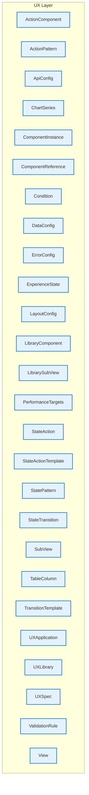

# UX Layer - Intra-Layer Relationships

## Overview

**Purpose**: Define semantic links between entities WITHIN this layer, capturing
structural composition, behavioral dependencies, and influence relationships.

**Layer ID**: `09-ux`
**Analysis Date**: Generated automatically
**Validation**: Uses MarkdownLayerParser for closed-loop validation

---

### Relationship Diagram

## Layer Summary

### Entity Coverage (Target: 2+ relationships per entity)

- **Entities Meeting Target**: 0/26
- **Entity Coverage**: 0.0%

**Entities Below Target**:

- UXLibrary: 0 relationship(s) (needs 2 more)
- LibraryComponent: 0 relationship(s) (needs 2 more)
- LibrarySubView: 0 relationship(s) (needs 2 more)
- StatePattern: 0 relationship(s) (needs 2 more)
- ActionPattern: 0 relationship(s) (needs 2 more)
- UXApplication: 0 relationship(s) (needs 2 more)
- UXSpec: 0 relationship(s) (needs 2 more)
- ExperienceState: 0 relationship(s) (needs 2 more)
- StateAction: 0 relationship(s) (needs 2 more)
- StateTransition: 0 relationship(s) (needs 2 more)
- Condition: 0 relationship(s) (needs 2 more)
- View: 0 relationship(s) (needs 2 more)
- SubView: 0 relationship(s) (needs 2 more)
- ComponentInstance: 0 relationship(s) (needs 2 more)
- ActionComponent: 0 relationship(s) (needs 2 more)
- ValidationRule: 0 relationship(s) (needs 2 more)
- LayoutConfig: 0 relationship(s) (needs 2 more)
- ErrorConfig: 0 relationship(s) (needs 2 more)
- ApiConfig: 0 relationship(s) (needs 2 more)
- DataConfig: 0 relationship(s) (needs 2 more)
- PerformanceTargets: 0 relationship(s) (needs 2 more)
- ComponentReference: 0 relationship(s) (needs 2 more)
- TransitionTemplate: 0 relationship(s) (needs 2 more)
- StateActionTemplate: 0 relationship(s) (needs 2 more)
- TableColumn: 0 relationship(s) (needs 2 more)
- ChartSeries: 0 relationship(s) (needs 2 more)

### Coverage Matrix

| Entity              | Outgoing | Incoming | Total | Meets Target | Status   |
| ------------------- | -------- | -------- | ----- | ------------ | -------- |
| ActionComponent     | 0        | 0        | 0     | ✗            | Needs 2  |
| ActionPattern       | 0        | 0        | 0     | ✗            | Needs 2  |
| ApiConfig           | 0        | 0        | 0     | ✗            | Needs 2  |
| ChartSeries         | 0        | 0        | 0     | ✗            | Needs 2  |
| ComponentInstance   | 0        | 0        | 0     | ✗            | Needs 2  |
| ComponentReference  | 0        | 0        | 0     | ✗            | Needs 2  |
| Condition           | 0        | 0        | 0     | ✗            | Needs 2  |
| DataConfig          | 0        | 0        | 0     | ✗            | Needs 2  |
| ErrorConfig         | 0        | 0        | 0     | ✗            | Needs 2  |
| ExperienceState     | 0        | 0        | 0     | ✗            | Needs 2  |
| LayoutConfig        | 0        | 0        | 0     | ✗            | Needs 2  |
| LibraryComponent    | 0        | 0        | 0     | ✗            | Needs 2  |
| LibrarySubView      | 0        | 0        | 0     | ✗            | Needs 2  |
| PerformanceTargets  | 0        | 0        | 0     | ✗            | Needs 2  |
| StateAction         | 0        | 0        | 0     | ✗            | Needs 2  |
| StateActionTemplate | 0        | 0        | 0     | ✗            | Needs 2  |
| StatePattern        | 0        | 0        | 0     | ✗            | Needs 2  |
| StateTransition     | 0        | 0        | 0     | ✗            | Needs 2  |
| SubView             | 0        | 0        | 0     | ✗            | Needs 2  |
| TableColumn         | 0        | 0        | 0     | ✗            | Needs 2  |
| TransitionTemplate  | 0        | 0        | 0     | ✗            | Needs 2  |
| UXApplication       | 0        | 0        | 0     | ✗            | Needs 2  |
| UXLibrary           | 0        | 0        | 0     | ✗            | Needs 2  |
| UXSpec              | 0        | 0        | 0     | ✗            | Needs 2  |
| ValidationRule      | 0        | 0        | 0     | ✗            | Needs 2  |
| View                | 0        | 0        | 0     | ✗            | Needs 2  |
| **TOTAL**           | **-**    | **-**    | **0** | **0/26**     | **0.0%** |

### Relationship Statistics

- **Total Unique Relationships**: 0
- **Total Connections (Entity Perspective)**: 0
- **Average Connections per Entity**: 0.0
- **Entity Coverage Target**: 2+ relationships

## Entity: ActionComponent

**Definition**: Interactive element that triggers actions (button, menu, link, voice command)

### Outgoing Relationships (ActionComponent → Other Entities)

_No outgoing intra-layer relationships documented._

### Incoming Relationships (Other Entities → ActionComponent)

_No incoming intra-layer relationships documented._

### Relationship Summary

- **Total Relationships**: 0
- **Outgoing**: 0
- **Incoming**: 0
- **Documented**: 0/0
- **With XML Examples**: 0/0
- **In Catalog**: 0/0

---

## Entity: ActionPattern

**Definition**: Reusable action configuration for common user interactions

### Outgoing Relationships (ActionPattern → Other Entities)

_No outgoing intra-layer relationships documented._

### Incoming Relationships (Other Entities → ActionPattern)

_No incoming intra-layer relationships documented._

### Relationship Summary

- **Total Relationships**: 0
- **Outgoing**: 0
- **Incoming**: 0
- **Documented**: 0/0
- **With XML Examples**: 0/0
- **In Catalog**: 0/0

---

## Entity: ApiConfig

**Definition**: Configuration for API integration within UI components, specifying endpoints, request/response mapping, authentication, and caching strategies. Connects UI to backend services.

### Outgoing Relationships (ApiConfig → Other Entities)

_No outgoing intra-layer relationships documented._

### Incoming Relationships (Other Entities → ApiConfig)

_No incoming intra-layer relationships documented._

### Relationship Summary

- **Total Relationships**: 0
- **Outgoing**: 0
- **Incoming**: 0
- **Documented**: 0/0
- **With XML Examples**: 0/0
- **In Catalog**: 0/0

---

## Entity: ChartSeries

**Definition**: Configuration for a data series within a chart component, specifying data source, visualization type, colors, and legend properties. Defines how data is visualized in charts.

### Outgoing Relationships (ChartSeries → Other Entities)

_No outgoing intra-layer relationships documented._

### Incoming Relationships (Other Entities → ChartSeries)

_No incoming intra-layer relationships documented._

### Relationship Summary

- **Total Relationships**: 0
- **Outgoing**: 0
- **Incoming**: 0
- **Documented**: 0/0
- **With XML Examples**: 0/0
- **In Catalog**: 0/0

---

## Entity: ComponentInstance

**Definition**: Instance of a LibraryComponent with application-specific configuration

### Outgoing Relationships (ComponentInstance → Other Entities)

_No outgoing intra-layer relationships documented._

### Incoming Relationships (Other Entities → ComponentInstance)

_No incoming intra-layer relationships documented._

### Relationship Summary

- **Total Relationships**: 0
- **Outgoing**: 0
- **Incoming**: 0
- **Documented**: 0/0
- **With XML Examples**: 0/0
- **In Catalog**: 0/0

---

## Entity: ComponentReference

**Definition**: A reference to another UI component that can be embedded or composed within a parent component. Enables component reuse and modular UI architecture.

### Outgoing Relationships (ComponentReference → Other Entities)

_No outgoing intra-layer relationships documented._

### Incoming Relationships (Other Entities → ComponentReference)

_No incoming intra-layer relationships documented._

### Relationship Summary

- **Total Relationships**: 0
- **Outgoing**: 0
- **Incoming**: 0
- **Documented**: 0/0
- **With XML Examples**: 0/0
- **In Catalog**: 0/0

---

## Entity: Condition

**Definition**: Boolean expression for guard conditions

### Outgoing Relationships (Condition → Other Entities)

_No outgoing intra-layer relationships documented._

### Incoming Relationships (Other Entities → Condition)

_No incoming intra-layer relationships documented._

### Relationship Summary

- **Total Relationships**: 0
- **Outgoing**: 0
- **Incoming**: 0
- **Documented**: 0/0
- **With XML Examples**: 0/0
- **In Catalog**: 0/0

---

## Entity: DataConfig

**Definition**: Configuration for data binding and state management within UI components, defining data sources, transformation pipelines, and update triggers. Manages component data flow.

### Outgoing Relationships (DataConfig → Other Entities)

_No outgoing intra-layer relationships documented._

### Incoming Relationships (Other Entities → DataConfig)

_No incoming intra-layer relationships documented._

### Relationship Summary

- **Total Relationships**: 0
- **Outgoing**: 0
- **Incoming**: 0
- **Documented**: 0/0
- **With XML Examples**: 0/0
- **In Catalog**: 0/0

---

## Entity: ErrorConfig

**Definition**: Configuration for error handling and display within UI components, specifying error message formats, retry behavior, fallback content, and user guidance. Ensures consistent error UX.

### Outgoing Relationships (ErrorConfig → Other Entities)

_No outgoing intra-layer relationships documented._

### Incoming Relationships (Other Entities → ErrorConfig)

_No incoming intra-layer relationships documented._

### Relationship Summary

- **Total Relationships**: 0
- **Outgoing**: 0
- **Incoming**: 0
- **Documented**: 0/0
- **With XML Examples**: 0/0
- **In Catalog**: 0/0

---

## Entity: ExperienceState

**Definition**: Distinct state that the experience can be in (works across all channels)

### Outgoing Relationships (ExperienceState → Other Entities)

_No outgoing intra-layer relationships documented._

### Incoming Relationships (Other Entities → ExperienceState)

_No incoming intra-layer relationships documented._

### Relationship Summary

- **Total Relationships**: 0
- **Outgoing**: 0
- **Incoming**: 0
- **Documented**: 0/0
- **With XML Examples**: 0/0
- **In Catalog**: 0/0

---

## Entity: LayoutConfig

**Definition**: Configuration for UI layout structure, defining grid systems, responsive breakpoints, spacing rules, and component arrangement patterns. Controls visual organization of the interface.

### Outgoing Relationships (LayoutConfig → Other Entities)

_No outgoing intra-layer relationships documented._

### Incoming Relationships (Other Entities → LayoutConfig)

_No incoming intra-layer relationships documented._

### Relationship Summary

- **Total Relationships**: 0
- **Outgoing**: 0
- **Incoming**: 0
- **Documented**: 0/0
- **With XML Examples**: 0/0
- **In Catalog**: 0/0

---

## Entity: LibraryComponent

**Definition**: Reusable UI component definition that can be instantiated in multiple UXSpecs

### Outgoing Relationships (LibraryComponent → Other Entities)

_No outgoing intra-layer relationships documented._

### Incoming Relationships (Other Entities → LibraryComponent)

_No incoming intra-layer relationships documented._

### Relationship Summary

- **Total Relationships**: 0
- **Outgoing**: 0
- **Incoming**: 0
- **Documented**: 0/0
- **With XML Examples**: 0/0
- **In Catalog**: 0/0

---

## Entity: LibrarySubView

**Definition**: Reusable grouping of components that can be composed into views

### Outgoing Relationships (LibrarySubView → Other Entities)

_No outgoing intra-layer relationships documented._

### Incoming Relationships (Other Entities → LibrarySubView)

_No incoming intra-layer relationships documented._

### Relationship Summary

- **Total Relationships**: 0
- **Outgoing**: 0
- **Incoming**: 0
- **Documented**: 0/0
- **With XML Examples**: 0/0
- **In Catalog**: 0/0

---

## Entity: PerformanceTargets

**Definition**: Defines performance SLAs for UI components including load time, interaction responsiveness, and rendering thresholds. Enables performance monitoring and optimization.

### Outgoing Relationships (PerformanceTargets → Other Entities)

_No outgoing intra-layer relationships documented._

### Incoming Relationships (Other Entities → PerformanceTargets)

_No incoming intra-layer relationships documented._

### Relationship Summary

- **Total Relationships**: 0
- **Outgoing**: 0
- **Incoming**: 0
- **Documented**: 0/0
- **With XML Examples**: 0/0
- **In Catalog**: 0/0

---

## Entity: StateAction

**Definition**: Action executed during state lifecycle

### Outgoing Relationships (StateAction → Other Entities)

_No outgoing intra-layer relationships documented._

### Incoming Relationships (Other Entities → StateAction)

_No incoming intra-layer relationships documented._

### Relationship Summary

- **Total Relationships**: 0
- **Outgoing**: 0
- **Incoming**: 0
- **Documented**: 0/0
- **With XML Examples**: 0/0
- **In Catalog**: 0/0

---

## Entity: StateActionTemplate

**Definition**: A reusable template defining actions to execute during component state transitions. Enables standardized behavior patterns for common state changes.

### Outgoing Relationships (StateActionTemplate → Other Entities)

_No outgoing intra-layer relationships documented._

### Incoming Relationships (Other Entities → StateActionTemplate)

_No incoming intra-layer relationships documented._

### Relationship Summary

- **Total Relationships**: 0
- **Outgoing**: 0
- **Incoming**: 0
- **Documented**: 0/0
- **With XML Examples**: 0/0
- **In Catalog**: 0/0

---

## Entity: StatePattern

**Definition**: Reusable state machine pattern for common UX flows

### Outgoing Relationships (StatePattern → Other Entities)

_No outgoing intra-layer relationships documented._

### Incoming Relationships (Other Entities → StatePattern)

_No incoming intra-layer relationships documented._

### Relationship Summary

- **Total Relationships**: 0
- **Outgoing**: 0
- **Incoming**: 0
- **Documented**: 0/0
- **With XML Examples**: 0/0
- **In Catalog**: 0/0

---

## Entity: StateTransition

**Definition**: Transition from current state to another state

### Outgoing Relationships (StateTransition → Other Entities)

_No outgoing intra-layer relationships documented._

### Incoming Relationships (Other Entities → StateTransition)

_No incoming intra-layer relationships documented._

### Relationship Summary

- **Total Relationships**: 0
- **Outgoing**: 0
- **Incoming**: 0
- **Documented**: 0/0
- **With XML Examples**: 0/0
- **In Catalog**: 0/0

---

## Entity: SubView

**Definition**: Instance of a LibrarySubView or custom sub-view definition

### Outgoing Relationships (SubView → Other Entities)

_No outgoing intra-layer relationships documented._

### Incoming Relationships (Other Entities → SubView)

_No incoming intra-layer relationships documented._

### Relationship Summary

- **Total Relationships**: 0
- **Outgoing**: 0
- **Incoming**: 0
- **Documented**: 0/0
- **With XML Examples**: 0/0
- **In Catalog**: 0/0

---

## Entity: TableColumn

**Definition**: Configuration for a single column within a data table component, specifying header, data binding, sorting, filtering, and rendering options. Defines table structure and behavior.

### Outgoing Relationships (TableColumn → Other Entities)

_No outgoing intra-layer relationships documented._

### Incoming Relationships (Other Entities → TableColumn)

_No incoming intra-layer relationships documented._

### Relationship Summary

- **Total Relationships**: 0
- **Outgoing**: 0
- **Incoming**: 0
- **Documented**: 0/0
- **With XML Examples**: 0/0
- **In Catalog**: 0/0

---

## Entity: TransitionTemplate

**Definition**: Defines reusable animation and transition patterns for state changes, page navigation, or component lifecycle events. Ensures consistent motion design across the application.

### Outgoing Relationships (TransitionTemplate → Other Entities)

_No outgoing intra-layer relationships documented._

### Incoming Relationships (Other Entities → TransitionTemplate)

_No incoming intra-layer relationships documented._

### Relationship Summary

- **Total Relationships**: 0
- **Outgoing**: 0
- **Incoming**: 0
- **Documented**: 0/0
- **With XML Examples**: 0/0
- **In Catalog**: 0/0

---

## Entity: UXApplication

**Definition**: Application-level UX configuration that groups UXSpecs and defines shared settings

### Outgoing Relationships (UXApplication → Other Entities)

_No outgoing intra-layer relationships documented._

### Incoming Relationships (Other Entities → UXApplication)

_No incoming intra-layer relationships documented._

### Relationship Summary

- **Total Relationships**: 0
- **Outgoing**: 0
- **Incoming**: 0
- **Documented**: 0/0
- **With XML Examples**: 0/0
- **In Catalog**: 0/0

---

## Entity: UXLibrary

**Definition**: Collection of reusable UI components and sub-views that can be shared across applications

### Outgoing Relationships (UXLibrary → Other Entities)

_No outgoing intra-layer relationships documented._

### Incoming Relationships (Other Entities → UXLibrary)

_No incoming intra-layer relationships documented._

### Relationship Summary

- **Total Relationships**: 0
- **Outgoing**: 0
- **Incoming**: 0
- **Documented**: 0/0
- **With XML Examples**: 0/0
- **In Catalog**: 0/0

---

## Entity: UXSpec

**Definition**: Complete UX specification for a single experience (visual, voice, chat, SMS)

### Outgoing Relationships (UXSpec → Other Entities)

_No outgoing intra-layer relationships documented._

### Incoming Relationships (Other Entities → UXSpec)

_No incoming intra-layer relationships documented._

### Relationship Summary

- **Total Relationships**: 0
- **Outgoing**: 0
- **Incoming**: 0
- **Documented**: 0/0
- **With XML Examples**: 0/0
- **In Catalog**: 0/0

---

## Entity: ValidationRule

**Definition**: Client-side validation rule for a field

### Outgoing Relationships (ValidationRule → Other Entities)

_No outgoing intra-layer relationships documented._

### Incoming Relationships (Other Entities → ValidationRule)

_No incoming intra-layer relationships documented._

### Relationship Summary

- **Total Relationships**: 0
- **Outgoing**: 0
- **Incoming**: 0
- **Documented**: 0/0
- **With XML Examples**: 0/0
- **In Catalog**: 0/0

---

## Entity: View

**Definition**: Routable grouping of components (a complete user experience)

### Outgoing Relationships (View → Other Entities)

_No outgoing intra-layer relationships documented._

### Incoming Relationships (Other Entities → View)

_No incoming intra-layer relationships documented._

### Relationship Summary

- **Total Relationships**: 0
- **Outgoing**: 0
- **Incoming**: 0
- **Documented**: 0/0
- **With XML Examples**: 0/0
- **In Catalog**: 0/0

---
