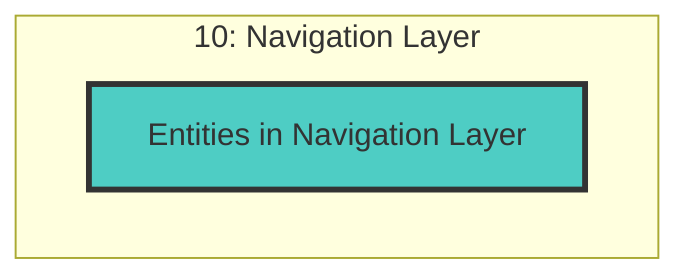

# Navigation Layer - Cross-Layer Relationships

## Cross-Layer Relationships

**Purpose**: Define semantic links to entities in other layers, supporting traceability, governance, and architectural alignment.

### Cross-Layer Relationship Diagram

### Outgoing Relationships (This Layer → Other Layers)

Links from entities in this layer to entities in other layers.

_No outgoing cross-layer relationships defined._

### Incoming Relationships (Other Layers → This Layer)

Links from entities in other layers to entities in this layer.

_No incoming cross-layer relationships defined._
