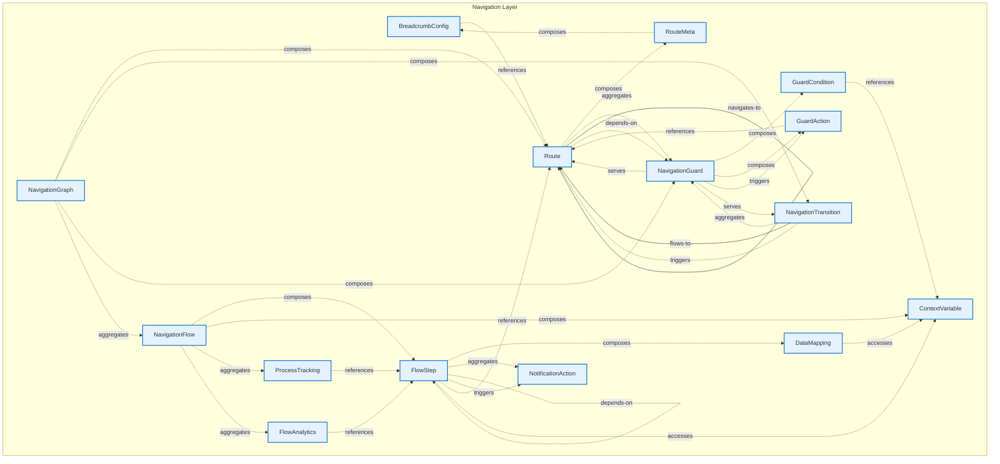

# Navigation Layer - Intra-Layer Relationships

## Overview

**Purpose**: Define semantic links between entities WITHIN this layer, capturing
structural composition, behavioral dependencies, and influence relationships.

**Layer ID**: `10-navigation`
**Analysis Date**: Generated automatically
**Validation**: Uses MarkdownLayerParser for closed-loop validation

---

### Relationship Diagram



## Layer Summary

### Entity Coverage (Target: 2+ relationships per entity)

- **Entities Meeting Target**: 15/15
- **Entity Coverage**: 100.0%

### Coverage Matrix

| Entity               | Outgoing | Incoming | Total  | Meets Target | Status     |
| -------------------- | -------- | -------- | ------ | ------------ | ---------- |
| BreadcrumbConfig     | 1        | 1        | 2      | ✓            | Complete   |
| ContextVariable      | 0        | 4        | 4      | ✓            | Complete   |
| DataMapping          | 1        | 1        | 2      | ✓            | Complete   |
| FlowAnalytics        | 1        | 1        | 2      | ✓            | Complete   |
| FlowStep             | 7        | 5        | 12     | ✓            | Complete   |
| GuardAction          | 1        | 2        | 3      | ✓            | Complete   |
| GuardCondition       | 1        | 1        | 2      | ✓            | Complete   |
| NavigationFlow       | 4        | 1        | 5      | ✓            | Complete   |
| NavigationGraph      | 4        | 0        | 4      | ✓            | Complete   |
| NavigationGuard      | 5        | 4        | 9      | ✓            | Complete   |
| NavigationTransition | 3        | 2        | 5      | ✓            | Complete   |
| NotificationAction   | 0        | 2        | 2      | ✓            | Complete   |
| ProcessTracking      | 1        | 1        | 2      | ✓            | Complete   |
| Route                | 7        | 11       | 18     | ✓            | Complete   |
| RouteMeta            | 1        | 1        | 2      | ✓            | Complete   |
| **TOTAL**            | **-**    | **-**    | **74** | **15/15**    | **100.0%** |

### Relationship Statistics

- **Total Unique Relationships**: 37
- **Total Connections (Entity Perspective)**: 74
- **Average Connections per Entity**: 4.9
- **Entity Coverage Target**: 2+ relationships

### Priority Gaps

_These relationships appear frequently but are not in the catalog:_

1. **composition (composes)** - Appears 20 time(s)
2. **reference (references)** - Appears 14 time(s)
3. **aggregation (aggregates)** - Appears 12 time(s)
4. **triggering (triggers)** - Appears 6 time(s)
5. **depends-on (depends-on)** - Appears 4 time(s)

## Entity: BreadcrumbConfig

**Definition**: Configuration for breadcrumb navigation display, specifying path generation rules, separator styles, truncation behavior, and home link settings. Provides users with location context and navigation history.

### Outgoing Relationships (BreadcrumbConfig → Other Entities)

| Relationship Type | Target Entity | Predicate    | Status           | Source                                                        | In Catalog | Documented                                                  |
| ----------------- | ------------- | ------------ | ---------------- | ------------------------------------------------------------- | ---------- | ----------------------------------------------------------- |
| reference         | Route         | `references` | Documented + XML | [Doc](../../spec/layers/10-navigation-layer.md#relationships) | ✗          | [✓](../../spec/layers/10-navigation-layer.md#relationships) |

### Incoming Relationships (Other Entities → BreadcrumbConfig)

| Relationship Type | Source Entity | Predicate  | Status           | Source                                                        | In Catalog | Documented                                                  |
| ----------------- | ------------- | ---------- | ---------------- | ------------------------------------------------------------- | ---------- | ----------------------------------------------------------- |
| composition       | RouteMeta     | `composes` | Documented + XML | [Doc](../../spec/layers/10-navigation-layer.md#relationships) | ✗          | [✓](../../spec/layers/10-navigation-layer.md#relationships) |

### Relationship Summary

- **Total Relationships**: 2
- **Outgoing**: 1
- **Incoming**: 1
- **Documented**: 2/2
- **With XML Examples**: 2/2
- **In Catalog**: 0/2

### Recommended Catalog Updates

_The following relationships should be added to relationship-catalog.json:_

**reference** (BreadcrumbConfig → Route):

```json
{
  "id": "reference",
  "predicate": "references",
  "inversePredicate": "referenced-by",
  "category": "structural",
  "applicableLayers": ["10"],
  "description": "BreadcrumbConfig references Route"
}
```

**composition** (RouteMeta → BreadcrumbConfig):

```json
{
  "id": "composition",
  "predicate": "composes",
  "inversePredicate": "composed-of",
  "category": "structural",
  "applicableLayers": ["10"],
  "description": "RouteMeta composes BreadcrumbConfig"
}
```

---

## Entity: ContextVariable

**Definition**: Shared variable across flow steps (Gap #1: Cross-experience state)

### Outgoing Relationships (ContextVariable → Other Entities)

_No outgoing intra-layer relationships documented._

### Incoming Relationships (Other Entities → ContextVariable)

| Relationship Type | Source Entity  | Predicate    | Status           | Source                                                        | In Catalog | Documented                                                  |
| ----------------- | -------------- | ------------ | ---------------- | ------------------------------------------------------------- | ---------- | ----------------------------------------------------------- |
| access            | DataMapping    | `accesses`   | Documented + XML | [Doc](../../spec/layers/10-navigation-layer.md#relationships) | ✗          | [✓](../../spec/layers/10-navigation-layer.md#relationships) |
| access            | FlowStep       | `accesses`   | Documented + XML | [Doc](../../spec/layers/10-navigation-layer.md#relationships) | ✗          | [✓](../../spec/layers/10-navigation-layer.md#relationships) |
| reference         | GuardCondition | `references` | Documented + XML | [Doc](../../spec/layers/10-navigation-layer.md#relationships) | ✗          | [✓](../../spec/layers/10-navigation-layer.md#relationships) |
| composition       | NavigationFlow | `composes`   | Documented + XML | [Doc](../../spec/layers/10-navigation-layer.md#relationships) | ✗          | [✓](../../spec/layers/10-navigation-layer.md#relationships) |

### Relationship Summary

- **Total Relationships**: 4
- **Outgoing**: 0
- **Incoming**: 4
- **Documented**: 4/4
- **With XML Examples**: 4/4
- **In Catalog**: 0/4

### Recommended Catalog Updates

_The following relationships should be added to relationship-catalog.json:_

**composition** (NavigationFlow → ContextVariable):

```json
{
  "id": "composition",
  "predicate": "composes",
  "inversePredicate": "composed-of",
  "category": "structural",
  "applicableLayers": ["10"],
  "description": "NavigationFlow composes ContextVariable"
}
```

**reference** (GuardCondition → ContextVariable):

```json
{
  "id": "reference",
  "predicate": "references",
  "inversePredicate": "referenced-by",
  "category": "structural",
  "applicableLayers": ["10"],
  "description": "GuardCondition references ContextVariable"
}
```

**access** (FlowStep → ContextVariable):

```json
{
  "id": "access",
  "predicate": "accesses",
  "inversePredicate": "accessed-by",
  "category": "structural",
  "applicableLayers": ["10"],
  "description": "FlowStep accesses ContextVariable"
}
```

_...and 1 more relationships_

---

## Entity: DataMapping

**Definition**: Maps data between flow context and experience (Gap #2: Data handoff)

### Outgoing Relationships (DataMapping → Other Entities)

| Relationship Type | Target Entity   | Predicate  | Status           | Source                                                        | In Catalog | Documented                                                  |
| ----------------- | --------------- | ---------- | ---------------- | ------------------------------------------------------------- | ---------- | ----------------------------------------------------------- |
| access            | ContextVariable | `accesses` | Documented + XML | [Doc](../../spec/layers/10-navigation-layer.md#relationships) | ✗          | [✓](../../spec/layers/10-navigation-layer.md#relationships) |

### Incoming Relationships (Other Entities → DataMapping)

| Relationship Type | Source Entity | Predicate  | Status           | Source                                                        | In Catalog | Documented                                                  |
| ----------------- | ------------- | ---------- | ---------------- | ------------------------------------------------------------- | ---------- | ----------------------------------------------------------- |
| composition       | FlowStep      | `composes` | Documented + XML | [Doc](../../spec/layers/10-navigation-layer.md#relationships) | ✗          | [✓](../../spec/layers/10-navigation-layer.md#relationships) |

### Relationship Summary

- **Total Relationships**: 2
- **Outgoing**: 1
- **Incoming**: 1
- **Documented**: 2/2
- **With XML Examples**: 2/2
- **In Catalog**: 0/2

### Recommended Catalog Updates

_The following relationships should be added to relationship-catalog.json:_

**access** (DataMapping → ContextVariable):

```json
{
  "id": "access",
  "predicate": "accesses",
  "inversePredicate": "accessed-by",
  "category": "structural",
  "applicableLayers": ["10"],
  "description": "DataMapping accesses ContextVariable"
}
```

**composition** (FlowStep → DataMapping):

```json
{
  "id": "composition",
  "predicate": "composes",
  "inversePredicate": "composed-of",
  "category": "structural",
  "applicableLayers": ["10"],
  "description": "FlowStep composes DataMapping"
}
```

---

## Entity: FlowAnalytics

**Definition**: Analytics for funnel tracking (Gap #9: Funnel analytics)

### Outgoing Relationships (FlowAnalytics → Other Entities)

| Relationship Type | Target Entity | Predicate    | Status           | Source                                                        | In Catalog | Documented                                                  |
| ----------------- | ------------- | ------------ | ---------------- | ------------------------------------------------------------- | ---------- | ----------------------------------------------------------- |
| reference         | FlowStep      | `references` | Documented + XML | [Doc](../../spec/layers/10-navigation-layer.md#relationships) | ✗          | [✓](../../spec/layers/10-navigation-layer.md#relationships) |

### Incoming Relationships (Other Entities → FlowAnalytics)

| Relationship Type | Source Entity  | Predicate    | Status           | Source                                                        | In Catalog | Documented                                                  |
| ----------------- | -------------- | ------------ | ---------------- | ------------------------------------------------------------- | ---------- | ----------------------------------------------------------- |
| aggregation       | NavigationFlow | `aggregates` | Documented + XML | [Doc](../../spec/layers/10-navigation-layer.md#relationships) | ✗          | [✓](../../spec/layers/10-navigation-layer.md#relationships) |

### Relationship Summary

- **Total Relationships**: 2
- **Outgoing**: 1
- **Incoming**: 1
- **Documented**: 2/2
- **With XML Examples**: 2/2
- **In Catalog**: 0/2

### Recommended Catalog Updates

_The following relationships should be added to relationship-catalog.json:_

**reference** (FlowAnalytics → FlowStep):

```json
{
  "id": "reference",
  "predicate": "references",
  "inversePredicate": "referenced-by",
  "category": "structural",
  "applicableLayers": ["10"],
  "description": "FlowAnalytics references FlowStep"
}
```

**aggregation** (NavigationFlow → FlowAnalytics):

```json
{
  "id": "aggregation",
  "predicate": "aggregates",
  "inversePredicate": "aggregated-by",
  "category": "structural",
  "applicableLayers": ["10"],
  "description": "NavigationFlow aggregates FlowAnalytics"
}
```

---

## Entity: FlowStep

**Definition**: One step in a navigation flow

### Outgoing Relationships (FlowStep → Other Entities)

| Relationship Type | Target Entity      | Predicate    | Status           | Source                                                        | In Catalog | Documented                                                  |
| ----------------- | ------------------ | ------------ | ---------------- | ------------------------------------------------------------- | ---------- | ----------------------------------------------------------- |
| access            | ContextVariable    | `accesses`   | Documented + XML | [Doc](../../spec/layers/10-navigation-layer.md#relationships) | ✗          | [✓](../../spec/layers/10-navigation-layer.md#relationships) |
| composition       | DataMapping        | `composes`   | Documented + XML | [Doc](../../spec/layers/10-navigation-layer.md#relationships) | ✗          | [✓](../../spec/layers/10-navigation-layer.md#relationships) |
| depends-on        | FlowStep           | `depends-on` | Documented + XML | [Doc](../../spec/layers/10-navigation-layer.md#relationships) | ✗          | [✓](../../spec/layers/10-navigation-layer.md#relationships) |
| flow              | FlowStep           | `flows-to`   | Documented + XML | [Doc](../../spec/layers/10-navigation-layer.md#relationships) | ✓          | [✓](../../spec/layers/10-navigation-layer.md#relationships) |
| aggregation       | NotificationAction | `aggregates` | Documented + XML | [Doc](../../spec/layers/10-navigation-layer.md#relationships) | ✗          | [✓](../../spec/layers/10-navigation-layer.md#relationships) |
| triggering        | NotificationAction | `triggers`   | Documented + XML | [Doc](../../spec/layers/10-navigation-layer.md#relationships) | ✗          | [✓](../../spec/layers/10-navigation-layer.md#relationships) |
| reference         | Route              | `references` | Documented + XML | [Doc](../../spec/layers/10-navigation-layer.md#relationships) | ✗          | [✓](../../spec/layers/10-navigation-layer.md#relationships) |

### Incoming Relationships (Other Entities → FlowStep)

| Relationship Type | Source Entity   | Predicate    | Status           | Source                                                        | In Catalog | Documented                                                  |
| ----------------- | --------------- | ------------ | ---------------- | ------------------------------------------------------------- | ---------- | ----------------------------------------------------------- |
| reference         | FlowAnalytics   | `references` | Documented + XML | [Doc](../../spec/layers/10-navigation-layer.md#relationships) | ✗          | [✓](../../spec/layers/10-navigation-layer.md#relationships) |
| depends-on        | FlowStep        | `depends-on` | Documented + XML | [Doc](../../spec/layers/10-navigation-layer.md#relationships) | ✗          | [✓](../../spec/layers/10-navigation-layer.md#relationships) |
| flow              | FlowStep        | `flows-to`   | Documented + XML | [Doc](../../spec/layers/10-navigation-layer.md#relationships) | ✓          | [✓](../../spec/layers/10-navigation-layer.md#relationships) |
| composition       | NavigationFlow  | `composes`   | Documented + XML | [Doc](../../spec/layers/10-navigation-layer.md#relationships) | ✗          | [✓](../../spec/layers/10-navigation-layer.md#relationships) |
| reference         | ProcessTracking | `references` | Documented + XML | [Doc](../../spec/layers/10-navigation-layer.md#relationships) | ✗          | [✓](../../spec/layers/10-navigation-layer.md#relationships) |

### Relationship Summary

- **Total Relationships**: 12
- **Outgoing**: 7
- **Incoming**: 5
- **Documented**: 12/12
- **With XML Examples**: 12/12
- **In Catalog**: 2/12

### Recommended Catalog Updates

_The following relationships should be added to relationship-catalog.json:_

**composition** (FlowStep → DataMapping):

```json
{
  "id": "composition",
  "predicate": "composes",
  "inversePredicate": "composed-of",
  "category": "structural",
  "applicableLayers": ["10"],
  "description": "FlowStep composes DataMapping"
}
```

**aggregation** (FlowStep → NotificationAction):

```json
{
  "id": "aggregation",
  "predicate": "aggregates",
  "inversePredicate": "aggregated-by",
  "category": "structural",
  "applicableLayers": ["10"],
  "description": "FlowStep aggregates NotificationAction"
}
```

**triggering** (FlowStep → NotificationAction):

```json
{
  "id": "triggering",
  "predicate": "triggers",
  "inversePredicate": "triggered-by",
  "category": "structural",
  "applicableLayers": ["10"],
  "description": "FlowStep triggers NotificationAction"
}
```

_...and 7 more relationships_

---

## Entity: GuardAction

**Definition**: Action when guard denies access

### Outgoing Relationships (GuardAction → Other Entities)

| Relationship Type | Target Entity | Predicate    | Status           | Source                                                        | In Catalog | Documented                                                  |
| ----------------- | ------------- | ------------ | ---------------- | ------------------------------------------------------------- | ---------- | ----------------------------------------------------------- |
| reference         | Route         | `references` | Documented + XML | [Doc](../../spec/layers/10-navigation-layer.md#relationships) | ✗          | [✓](../../spec/layers/10-navigation-layer.md#relationships) |

### Incoming Relationships (Other Entities → GuardAction)

| Relationship Type | Source Entity   | Predicate  | Status           | Source                                                        | In Catalog | Documented                                                  |
| ----------------- | --------------- | ---------- | ---------------- | ------------------------------------------------------------- | ---------- | ----------------------------------------------------------- |
| composition       | NavigationGuard | `composes` | Documented + XML | [Doc](../../spec/layers/10-navigation-layer.md#relationships) | ✗          | [✓](../../spec/layers/10-navigation-layer.md#relationships) |
| triggering        | NavigationGuard | `triggers` | Documented + XML | [Doc](../../spec/layers/10-navigation-layer.md#relationships) | ✗          | [✓](../../spec/layers/10-navigation-layer.md#relationships) |

### Relationship Summary

- **Total Relationships**: 3
- **Outgoing**: 1
- **Incoming**: 2
- **Documented**: 3/3
- **With XML Examples**: 3/3
- **In Catalog**: 0/3

### Recommended Catalog Updates

_The following relationships should be added to relationship-catalog.json:_

**reference** (GuardAction → Route):

```json
{
  "id": "reference",
  "predicate": "references",
  "inversePredicate": "referenced-by",
  "category": "structural",
  "applicableLayers": ["10"],
  "description": "GuardAction references Route"
}
```

**composition** (NavigationGuard → GuardAction):

```json
{
  "id": "composition",
  "predicate": "composes",
  "inversePredicate": "composed-of",
  "category": "structural",
  "applicableLayers": ["10"],
  "description": "NavigationGuard composes GuardAction"
}
```

**triggering** (NavigationGuard → GuardAction):

```json
{
  "id": "triggering",
  "predicate": "triggers",
  "inversePredicate": "triggered-by",
  "category": "structural",
  "applicableLayers": ["10"],
  "description": "NavigationGuard triggers GuardAction"
}
```

---

## Entity: GuardCondition

**Definition**: Condition expression for guard

### Outgoing Relationships (GuardCondition → Other Entities)

| Relationship Type | Target Entity   | Predicate    | Status           | Source                                                        | In Catalog | Documented                                                  |
| ----------------- | --------------- | ------------ | ---------------- | ------------------------------------------------------------- | ---------- | ----------------------------------------------------------- |
| reference         | ContextVariable | `references` | Documented + XML | [Doc](../../spec/layers/10-navigation-layer.md#relationships) | ✗          | [✓](../../spec/layers/10-navigation-layer.md#relationships) |

### Incoming Relationships (Other Entities → GuardCondition)

| Relationship Type | Source Entity   | Predicate  | Status           | Source                                                        | In Catalog | Documented                                                  |
| ----------------- | --------------- | ---------- | ---------------- | ------------------------------------------------------------- | ---------- | ----------------------------------------------------------- |
| composition       | NavigationGuard | `composes` | Documented + XML | [Doc](../../spec/layers/10-navigation-layer.md#relationships) | ✗          | [✓](../../spec/layers/10-navigation-layer.md#relationships) |

### Relationship Summary

- **Total Relationships**: 2
- **Outgoing**: 1
- **Incoming**: 1
- **Documented**: 2/2
- **With XML Examples**: 2/2
- **In Catalog**: 0/2

### Recommended Catalog Updates

_The following relationships should be added to relationship-catalog.json:_

**reference** (GuardCondition → ContextVariable):

```json
{
  "id": "reference",
  "predicate": "references",
  "inversePredicate": "referenced-by",
  "category": "structural",
  "applicableLayers": ["10"],
  "description": "GuardCondition references ContextVariable"
}
```

**composition** (NavigationGuard → GuardCondition):

```json
{
  "id": "composition",
  "predicate": "composes",
  "inversePredicate": "composed-of",
  "category": "structural",
  "applicableLayers": ["10"],
  "description": "NavigationGuard composes GuardCondition"
}
```

---

## Entity: NavigationFlow

**Definition**: Sequence of routes that realizes a business process

### Outgoing Relationships (NavigationFlow → Other Entities)

| Relationship Type | Target Entity   | Predicate    | Status           | Source                                                        | In Catalog | Documented                                                  |
| ----------------- | --------------- | ------------ | ---------------- | ------------------------------------------------------------- | ---------- | ----------------------------------------------------------- |
| composition       | ContextVariable | `composes`   | Documented + XML | [Doc](../../spec/layers/10-navigation-layer.md#relationships) | ✗          | [✓](../../spec/layers/10-navigation-layer.md#relationships) |
| aggregation       | FlowAnalytics   | `aggregates` | Documented + XML | [Doc](../../spec/layers/10-navigation-layer.md#relationships) | ✗          | [✓](../../spec/layers/10-navigation-layer.md#relationships) |
| composition       | FlowStep        | `composes`   | Documented + XML | [Doc](../../spec/layers/10-navigation-layer.md#relationships) | ✗          | [✓](../../spec/layers/10-navigation-layer.md#relationships) |
| aggregation       | ProcessTracking | `aggregates` | Documented + XML | [Doc](../../spec/layers/10-navigation-layer.md#relationships) | ✗          | [✓](../../spec/layers/10-navigation-layer.md#relationships) |

### Incoming Relationships (Other Entities → NavigationFlow)

| Relationship Type | Source Entity   | Predicate    | Status           | Source                                                        | In Catalog | Documented                                                  |
| ----------------- | --------------- | ------------ | ---------------- | ------------------------------------------------------------- | ---------- | ----------------------------------------------------------- |
| aggregation       | NavigationGraph | `aggregates` | Documented + XML | [Doc](../../spec/layers/10-navigation-layer.md#relationships) | ✗          | [✓](../../spec/layers/10-navigation-layer.md#relationships) |

### Relationship Summary

- **Total Relationships**: 5
- **Outgoing**: 4
- **Incoming**: 1
- **Documented**: 5/5
- **With XML Examples**: 5/5
- **In Catalog**: 0/5

### Recommended Catalog Updates

_The following relationships should be added to relationship-catalog.json:_

**composition** (NavigationFlow → FlowStep):

```json
{
  "id": "composition",
  "predicate": "composes",
  "inversePredicate": "composed-of",
  "category": "structural",
  "applicableLayers": ["10"],
  "description": "NavigationFlow composes FlowStep"
}
```

**composition** (NavigationFlow → ContextVariable):

```json
{
  "id": "composition",
  "predicate": "composes",
  "inversePredicate": "composed-of",
  "category": "structural",
  "applicableLayers": ["10"],
  "description": "NavigationFlow composes ContextVariable"
}
```

**aggregation** (NavigationFlow → ProcessTracking):

```json
{
  "id": "aggregation",
  "predicate": "aggregates",
  "inversePredicate": "aggregated-by",
  "category": "structural",
  "applicableLayers": ["10"],
  "description": "NavigationFlow aggregates ProcessTracking"
}
```

_...and 2 more relationships_

---

## Entity: NavigationGraph

**Definition**: Complete navigation structure for application

### Outgoing Relationships (NavigationGraph → Other Entities)

| Relationship Type | Target Entity        | Predicate    | Status           | Source                                                        | In Catalog | Documented                                                  |
| ----------------- | -------------------- | ------------ | ---------------- | ------------------------------------------------------------- | ---------- | ----------------------------------------------------------- |
| aggregation       | NavigationFlow       | `aggregates` | Documented + XML | [Doc](../../spec/layers/10-navigation-layer.md#relationships) | ✗          | [✓](../../spec/layers/10-navigation-layer.md#relationships) |
| composition       | NavigationGuard      | `composes`   | Documented + XML | [Doc](../../spec/layers/10-navigation-layer.md#relationships) | ✗          | [✓](../../spec/layers/10-navigation-layer.md#relationships) |
| composition       | NavigationTransition | `composes`   | Documented + XML | [Doc](../../spec/layers/10-navigation-layer.md#relationships) | ✗          | [✓](../../spec/layers/10-navigation-layer.md#relationships) |
| composition       | Route                | `composes`   | Documented + XML | [Doc](../../spec/layers/10-navigation-layer.md#relationships) | ✗          | [✓](../../spec/layers/10-navigation-layer.md#relationships) |

### Incoming Relationships (Other Entities → NavigationGraph)

_No incoming intra-layer relationships documented._

### Relationship Summary

- **Total Relationships**: 4
- **Outgoing**: 4
- **Incoming**: 0
- **Documented**: 4/4
- **With XML Examples**: 4/4
- **In Catalog**: 0/4

### Recommended Catalog Updates

_The following relationships should be added to relationship-catalog.json:_

**composition** (NavigationGraph → Route):

```json
{
  "id": "composition",
  "predicate": "composes",
  "inversePredicate": "composed-of",
  "category": "structural",
  "applicableLayers": ["10"],
  "description": "NavigationGraph composes Route"
}
```

**composition** (NavigationGraph → NavigationTransition):

```json
{
  "id": "composition",
  "predicate": "composes",
  "inversePredicate": "composed-of",
  "category": "structural",
  "applicableLayers": ["10"],
  "description": "NavigationGraph composes NavigationTransition"
}
```

**composition** (NavigationGraph → NavigationGuard):

```json
{
  "id": "composition",
  "predicate": "composes",
  "inversePredicate": "composed-of",
  "category": "structural",
  "applicableLayers": ["10"],
  "description": "NavigationGraph composes NavigationGuard"
}
```

_...and 1 more relationships_

---

## Entity: NavigationGuard

**Definition**: Guard condition for route access

### Outgoing Relationships (NavigationGuard → Other Entities)

| Relationship Type | Target Entity        | Predicate  | Status           | Source                                                        | In Catalog | Documented                                                  |
| ----------------- | -------------------- | ---------- | ---------------- | ------------------------------------------------------------- | ---------- | ----------------------------------------------------------- |
| composition       | GuardAction          | `composes` | Documented + XML | [Doc](../../spec/layers/10-navigation-layer.md#relationships) | ✗          | [✓](../../spec/layers/10-navigation-layer.md#relationships) |
| triggering        | GuardAction          | `triggers` | Documented + XML | [Doc](../../spec/layers/10-navigation-layer.md#relationships) | ✗          | [✓](../../spec/layers/10-navigation-layer.md#relationships) |
| composition       | GuardCondition       | `composes` | Documented + XML | [Doc](../../spec/layers/10-navigation-layer.md#relationships) | ✗          | [✓](../../spec/layers/10-navigation-layer.md#relationships) |
| serves            | NavigationTransition | `serves`   | Documented + XML | [Doc](../../spec/layers/10-navigation-layer.md#relationships) | ✗          | [✓](../../spec/layers/10-navigation-layer.md#relationships) |
| serves            | Route                | `serves`   | Documented + XML | [Doc](../../spec/layers/10-navigation-layer.md#relationships) | ✗          | [✓](../../spec/layers/10-navigation-layer.md#relationships) |

### Incoming Relationships (Other Entities → NavigationGuard)

| Relationship Type | Source Entity        | Predicate    | Status           | Source                                                        | In Catalog | Documented                                                  |
| ----------------- | -------------------- | ------------ | ---------------- | ------------------------------------------------------------- | ---------- | ----------------------------------------------------------- |
| composition       | NavigationGraph      | `composes`   | Documented + XML | [Doc](../../spec/layers/10-navigation-layer.md#relationships) | ✗          | [✓](../../spec/layers/10-navigation-layer.md#relationships) |
| aggregation       | NavigationTransition | `aggregates` | Documented + XML | [Doc](../../spec/layers/10-navigation-layer.md#relationships) | ✗          | [✓](../../spec/layers/10-navigation-layer.md#relationships) |
| aggregation       | Route                | `aggregates` | Documented + XML | [Doc](../../spec/layers/10-navigation-layer.md#relationships) | ✗          | [✓](../../spec/layers/10-navigation-layer.md#relationships) |
| depends-on        | Route                | `depends-on` | Documented + XML | [Doc](../../spec/layers/10-navigation-layer.md#relationships) | ✗          | [✓](../../spec/layers/10-navigation-layer.md#relationships) |

### Relationship Summary

- **Total Relationships**: 9
- **Outgoing**: 5
- **Incoming**: 4
- **Documented**: 9/9
- **With XML Examples**: 9/9
- **In Catalog**: 0/9

### Recommended Catalog Updates

_The following relationships should be added to relationship-catalog.json:_

**composition** (NavigationGuard → GuardCondition):

```json
{
  "id": "composition",
  "predicate": "composes",
  "inversePredicate": "composed-of",
  "category": "structural",
  "applicableLayers": ["10"],
  "description": "NavigationGuard composes GuardCondition"
}
```

**composition** (NavigationGuard → GuardAction):

```json
{
  "id": "composition",
  "predicate": "composes",
  "inversePredicate": "composed-of",
  "category": "structural",
  "applicableLayers": ["10"],
  "description": "NavigationGuard composes GuardAction"
}
```

**triggering** (NavigationGuard → GuardAction):

```json
{
  "id": "triggering",
  "predicate": "triggers",
  "inversePredicate": "triggered-by",
  "category": "structural",
  "applicableLayers": ["10"],
  "description": "NavigationGuard triggers GuardAction"
}
```

_...and 6 more relationships_

---

## Entity: NavigationTransition

**Definition**: Transition from one route to another

### Outgoing Relationships (NavigationTransition → Other Entities)

| Relationship Type | Target Entity   | Predicate    | Status           | Source                                                        | In Catalog | Documented                                                  |
| ----------------- | --------------- | ------------ | ---------------- | ------------------------------------------------------------- | ---------- | ----------------------------------------------------------- |
| aggregation       | NavigationGuard | `aggregates` | Documented + XML | [Doc](../../spec/layers/10-navigation-layer.md#relationships) | ✗          | [✓](../../spec/layers/10-navigation-layer.md#relationships) |
| flow              | Route           | `flows-to`   | Documented + XML | [Doc](../../spec/layers/10-navigation-layer.md#relationships) | ✓          | [✓](../../spec/layers/10-navigation-layer.md#relationships) |
| triggering        | Route           | `triggers`   | Documented + XML | [Doc](../../spec/layers/10-navigation-layer.md#relationships) | ✗          | [✓](../../spec/layers/10-navigation-layer.md#relationships) |

### Incoming Relationships (Other Entities → NavigationTransition)

| Relationship Type | Source Entity   | Predicate  | Status           | Source                                                        | In Catalog | Documented                                                  |
| ----------------- | --------------- | ---------- | ---------------- | ------------------------------------------------------------- | ---------- | ----------------------------------------------------------- |
| composition       | NavigationGraph | `composes` | Documented + XML | [Doc](../../spec/layers/10-navigation-layer.md#relationships) | ✗          | [✓](../../spec/layers/10-navigation-layer.md#relationships) |
| serves            | NavigationGuard | `serves`   | Documented + XML | [Doc](../../spec/layers/10-navigation-layer.md#relationships) | ✗          | [✓](../../spec/layers/10-navigation-layer.md#relationships) |

### Relationship Summary

- **Total Relationships**: 5
- **Outgoing**: 3
- **Incoming**: 2
- **Documented**: 5/5
- **With XML Examples**: 5/5
- **In Catalog**: 1/5

### Recommended Catalog Updates

_The following relationships should be added to relationship-catalog.json:_

**aggregation** (NavigationTransition → NavigationGuard):

```json
{
  "id": "aggregation",
  "predicate": "aggregates",
  "inversePredicate": "aggregated-by",
  "category": "structural",
  "applicableLayers": ["10"],
  "description": "NavigationTransition aggregates NavigationGuard"
}
```

**triggering** (NavigationTransition → Route):

```json
{
  "id": "triggering",
  "predicate": "triggers",
  "inversePredicate": "triggered-by",
  "category": "structural",
  "applicableLayers": ["10"],
  "description": "NavigationTransition triggers Route"
}
```

**composition** (NavigationGraph → NavigationTransition):

```json
{
  "id": "composition",
  "predicate": "composes",
  "inversePredicate": "composed-of",
  "category": "structural",
  "applicableLayers": ["10"],
  "description": "NavigationGraph composes NavigationTransition"
}
```

_...and 1 more relationships_

---

## Entity: NotificationAction

**Definition**: Notification to send during flow step

### Outgoing Relationships (NotificationAction → Other Entities)

_No outgoing intra-layer relationships documented._

### Incoming Relationships (Other Entities → NotificationAction)

| Relationship Type | Source Entity | Predicate    | Status           | Source                                                        | In Catalog | Documented                                                  |
| ----------------- | ------------- | ------------ | ---------------- | ------------------------------------------------------------- | ---------- | ----------------------------------------------------------- |
| aggregation       | FlowStep      | `aggregates` | Documented + XML | [Doc](../../spec/layers/10-navigation-layer.md#relationships) | ✗          | [✓](../../spec/layers/10-navigation-layer.md#relationships) |
| triggering        | FlowStep      | `triggers`   | Documented + XML | [Doc](../../spec/layers/10-navigation-layer.md#relationships) | ✗          | [✓](../../spec/layers/10-navigation-layer.md#relationships) |

### Relationship Summary

- **Total Relationships**: 2
- **Outgoing**: 0
- **Incoming**: 2
- **Documented**: 2/2
- **With XML Examples**: 2/2
- **In Catalog**: 0/2

### Recommended Catalog Updates

_The following relationships should be added to relationship-catalog.json:_

**aggregation** (FlowStep → NotificationAction):

```json
{
  "id": "aggregation",
  "predicate": "aggregates",
  "inversePredicate": "aggregated-by",
  "category": "structural",
  "applicableLayers": ["10"],
  "description": "FlowStep aggregates NotificationAction"
}
```

**triggering** (FlowStep → NotificationAction):

```json
{
  "id": "triggering",
  "predicate": "triggers",
  "inversePredicate": "triggered-by",
  "category": "structural",
  "applicableLayers": ["10"],
  "description": "FlowStep triggers NotificationAction"
}
```

---

## Entity: ProcessTracking

**Definition**: Tracks business process instance across flow (Gap #3: Process correlation)

### Outgoing Relationships (ProcessTracking → Other Entities)

| Relationship Type | Target Entity | Predicate    | Status           | Source                                                        | In Catalog | Documented                                                  |
| ----------------- | ------------- | ------------ | ---------------- | ------------------------------------------------------------- | ---------- | ----------------------------------------------------------- |
| reference         | FlowStep      | `references` | Documented + XML | [Doc](../../spec/layers/10-navigation-layer.md#relationships) | ✗          | [✓](../../spec/layers/10-navigation-layer.md#relationships) |

### Incoming Relationships (Other Entities → ProcessTracking)

| Relationship Type | Source Entity  | Predicate    | Status           | Source                                                        | In Catalog | Documented                                                  |
| ----------------- | -------------- | ------------ | ---------------- | ------------------------------------------------------------- | ---------- | ----------------------------------------------------------- |
| aggregation       | NavigationFlow | `aggregates` | Documented + XML | [Doc](../../spec/layers/10-navigation-layer.md#relationships) | ✗          | [✓](../../spec/layers/10-navigation-layer.md#relationships) |

### Relationship Summary

- **Total Relationships**: 2
- **Outgoing**: 1
- **Incoming**: 1
- **Documented**: 2/2
- **With XML Examples**: 2/2
- **In Catalog**: 0/2

### Recommended Catalog Updates

_The following relationships should be added to relationship-catalog.json:_

**reference** (ProcessTracking → FlowStep):

```json
{
  "id": "reference",
  "predicate": "references",
  "inversePredicate": "referenced-by",
  "category": "structural",
  "applicableLayers": ["10"],
  "description": "ProcessTracking references FlowStep"
}
```

**aggregation** (NavigationFlow → ProcessTracking):

```json
{
  "id": "aggregation",
  "predicate": "aggregates",
  "inversePredicate": "aggregated-by",
  "category": "structural",
  "applicableLayers": ["10"],
  "description": "NavigationFlow aggregates ProcessTracking"
}
```

---

## Entity: Route

**Definition**: Single route/destination in the application (channel-agnostic)

### Outgoing Relationships (Route → Other Entities)

| Relationship Type | Target Entity   | Predicate      | Status           | Source                                                        | In Catalog | Documented                                                  |
| ----------------- | --------------- | -------------- | ---------------- | ------------------------------------------------------------- | ---------- | ----------------------------------------------------------- |
| aggregation       | NavigationGuard | `aggregates`   | Documented + XML | [Doc](../../spec/layers/10-navigation-layer.md#relationships) | ✗          | [✓](../../spec/layers/10-navigation-layer.md#relationships) |
| depends-on        | NavigationGuard | `depends-on`   | Documented + XML | [Doc](../../spec/layers/10-navigation-layer.md#relationships) | ✗          | [✓](../../spec/layers/10-navigation-layer.md#relationships) |
| flow              | Route           | `flows-to`     | Documented + XML | [Doc](../../spec/layers/10-navigation-layer.md#relationships) | ✓          | [✓](../../spec/layers/10-navigation-layer.md#relationships) |
| navigates-to      | Route           | `navigates-to` | Documented + XML | [Doc](../../spec/layers/10-navigation-layer.md#relationships) | ✓          | [✓](../../spec/layers/10-navigation-layer.md#relationships) |
| reference         | Route           | `references`   | Documented + XML | [Doc](../../spec/layers/10-navigation-layer.md#relationships) | ✗          | [✓](../../spec/layers/10-navigation-layer.md#relationships) |
| specialization    | Route           | `specializes`  | Documented + XML | [Doc](../../spec/layers/10-navigation-layer.md#relationships) | ✓          | [✓](../../spec/layers/10-navigation-layer.md#relationships) |
| composition       | RouteMeta       | `composes`     | Documented + XML | [Doc](../../spec/layers/10-navigation-layer.md#relationships) | ✗          | [✓](../../spec/layers/10-navigation-layer.md#relationships) |

### Incoming Relationships (Other Entities → Route)

| Relationship Type | Source Entity        | Predicate      | Status           | Source                                                        | In Catalog | Documented                                                  |
| ----------------- | -------------------- | -------------- | ---------------- | ------------------------------------------------------------- | ---------- | ----------------------------------------------------------- |
| reference         | BreadcrumbConfig     | `references`   | Documented + XML | [Doc](../../spec/layers/10-navigation-layer.md#relationships) | ✗          | [✓](../../spec/layers/10-navigation-layer.md#relationships) |
| reference         | FlowStep             | `references`   | Documented + XML | [Doc](../../spec/layers/10-navigation-layer.md#relationships) | ✗          | [✓](../../spec/layers/10-navigation-layer.md#relationships) |
| reference         | GuardAction          | `references`   | Documented + XML | [Doc](../../spec/layers/10-navigation-layer.md#relationships) | ✗          | [✓](../../spec/layers/10-navigation-layer.md#relationships) |
| composition       | NavigationGraph      | `composes`     | Documented + XML | [Doc](../../spec/layers/10-navigation-layer.md#relationships) | ✗          | [✓](../../spec/layers/10-navigation-layer.md#relationships) |
| serves            | NavigationGuard      | `serves`       | Documented + XML | [Doc](../../spec/layers/10-navigation-layer.md#relationships) | ✗          | [✓](../../spec/layers/10-navigation-layer.md#relationships) |
| flow              | NavigationTransition | `flows-to`     | Documented + XML | [Doc](../../spec/layers/10-navigation-layer.md#relationships) | ✓          | [✓](../../spec/layers/10-navigation-layer.md#relationships) |
| triggering        | NavigationTransition | `triggers`     | Documented + XML | [Doc](../../spec/layers/10-navigation-layer.md#relationships) | ✗          | [✓](../../spec/layers/10-navigation-layer.md#relationships) |
| flow              | Route                | `flows-to`     | Documented + XML | [Doc](../../spec/layers/10-navigation-layer.md#relationships) | ✓          | [✓](../../spec/layers/10-navigation-layer.md#relationships) |
| navigates-to      | Route                | `navigates-to` | Documented + XML | [Doc](../../spec/layers/10-navigation-layer.md#relationships) | ✓          | [✓](../../spec/layers/10-navigation-layer.md#relationships) |
| reference         | Route                | `references`   | Documented + XML | [Doc](../../spec/layers/10-navigation-layer.md#relationships) | ✗          | [✓](../../spec/layers/10-navigation-layer.md#relationships) |
| specialization    | Route                | `specializes`  | Documented + XML | [Doc](../../spec/layers/10-navigation-layer.md#relationships) | ✓          | [✓](../../spec/layers/10-navigation-layer.md#relationships) |

### Relationship Summary

- **Total Relationships**: 18
- **Outgoing**: 7
- **Incoming**: 11
- **Documented**: 18/18
- **With XML Examples**: 18/18
- **In Catalog**: 7/18

### Recommended Catalog Updates

_The following relationships should be added to relationship-catalog.json:_

**composition** (Route → RouteMeta):

```json
{
  "id": "composition",
  "predicate": "composes",
  "inversePredicate": "composed-of",
  "category": "structural",
  "applicableLayers": ["10"],
  "description": "Route composes RouteMeta"
}
```

**aggregation** (Route → NavigationGuard):

```json
{
  "id": "aggregation",
  "predicate": "aggregates",
  "inversePredicate": "aggregated-by",
  "category": "structural",
  "applicableLayers": ["10"],
  "description": "Route aggregates NavigationGuard"
}
```

**reference** (Route → Route):

```json
{
  "id": "reference",
  "predicate": "references",
  "inversePredicate": "referenced-by",
  "category": "structural",
  "applicableLayers": ["10"],
  "description": "Route references Route"
}
```

_...and 8 more relationships_

---

## Entity: RouteMeta

**Definition**: Route metadata

### Outgoing Relationships (RouteMeta → Other Entities)

| Relationship Type | Target Entity    | Predicate  | Status           | Source                                                        | In Catalog | Documented                                                  |
| ----------------- | ---------------- | ---------- | ---------------- | ------------------------------------------------------------- | ---------- | ----------------------------------------------------------- |
| composition       | BreadcrumbConfig | `composes` | Documented + XML | [Doc](../../spec/layers/10-navigation-layer.md#relationships) | ✗          | [✓](../../spec/layers/10-navigation-layer.md#relationships) |

### Incoming Relationships (Other Entities → RouteMeta)

| Relationship Type | Source Entity | Predicate  | Status           | Source                                                        | In Catalog | Documented                                                  |
| ----------------- | ------------- | ---------- | ---------------- | ------------------------------------------------------------- | ---------- | ----------------------------------------------------------- |
| composition       | Route         | `composes` | Documented + XML | [Doc](../../spec/layers/10-navigation-layer.md#relationships) | ✗          | [✓](../../spec/layers/10-navigation-layer.md#relationships) |

### Relationship Summary

- **Total Relationships**: 2
- **Outgoing**: 1
- **Incoming**: 1
- **Documented**: 2/2
- **With XML Examples**: 2/2
- **In Catalog**: 0/2

### Recommended Catalog Updates

_The following relationships should be added to relationship-catalog.json:_

**composition** (RouteMeta → BreadcrumbConfig):

```json
{
  "id": "composition",
  "predicate": "composes",
  "inversePredicate": "composed-of",
  "category": "structural",
  "applicableLayers": ["10"],
  "description": "RouteMeta composes BreadcrumbConfig"
}
```

**composition** (Route → RouteMeta):

```json
{
  "id": "composition",
  "predicate": "composes",
  "inversePredicate": "composed-of",
  "category": "structural",
  "applicableLayers": ["10"],
  "description": "Route composes RouteMeta"
}
```

---
