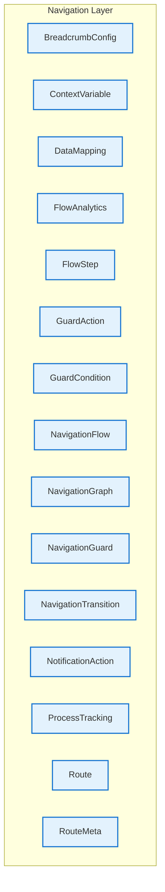

# Navigation Layer - Intra-Layer Relationships

## Overview

**Purpose**: Define semantic links between entities WITHIN this layer, capturing
structural composition, behavioral dependencies, and influence relationships.

**Layer ID**: `10-navigation`
**Analysis Date**: Generated automatically
**Validation**: Uses MarkdownLayerParser for closed-loop validation

---

### Relationship Diagram

## Layer Summary

### Entity Coverage (Target: 2+ relationships per entity)

- **Entities Meeting Target**: 0/15
- **Entity Coverage**: 0.0%

**Entities Below Target**:

- NavigationGraph: 0 relationship(s) (needs 2 more)
- Route: 0 relationship(s) (needs 2 more)
- RouteMeta: 0 relationship(s) (needs 2 more)
- BreadcrumbConfig: 0 relationship(s) (needs 2 more)
- NavigationTransition: 0 relationship(s) (needs 2 more)
- NavigationGuard: 0 relationship(s) (needs 2 more)
- GuardCondition: 0 relationship(s) (needs 2 more)
- GuardAction: 0 relationship(s) (needs 2 more)
- NavigationFlow: 0 relationship(s) (needs 2 more)
- FlowStep: 0 relationship(s) (needs 2 more)
- ContextVariable: 0 relationship(s) (needs 2 more)
- DataMapping: 0 relationship(s) (needs 2 more)
- ProcessTracking: 0 relationship(s) (needs 2 more)
- FlowAnalytics: 0 relationship(s) (needs 2 more)
- NotificationAction: 0 relationship(s) (needs 2 more)

### Coverage Matrix

| Entity               | Outgoing | Incoming | Total | Meets Target | Status   |
| -------------------- | -------- | -------- | ----- | ------------ | -------- |
| BreadcrumbConfig     | 0        | 0        | 0     | ✗            | Needs 2  |
| ContextVariable      | 0        | 0        | 0     | ✗            | Needs 2  |
| DataMapping          | 0        | 0        | 0     | ✗            | Needs 2  |
| FlowAnalytics        | 0        | 0        | 0     | ✗            | Needs 2  |
| FlowStep             | 0        | 0        | 0     | ✗            | Needs 2  |
| GuardAction          | 0        | 0        | 0     | ✗            | Needs 2  |
| GuardCondition       | 0        | 0        | 0     | ✗            | Needs 2  |
| NavigationFlow       | 0        | 0        | 0     | ✗            | Needs 2  |
| NavigationGraph      | 0        | 0        | 0     | ✗            | Needs 2  |
| NavigationGuard      | 0        | 0        | 0     | ✗            | Needs 2  |
| NavigationTransition | 0        | 0        | 0     | ✗            | Needs 2  |
| NotificationAction   | 0        | 0        | 0     | ✗            | Needs 2  |
| ProcessTracking      | 0        | 0        | 0     | ✗            | Needs 2  |
| Route                | 0        | 0        | 0     | ✗            | Needs 2  |
| RouteMeta            | 0        | 0        | 0     | ✗            | Needs 2  |
| **TOTAL**            | **-**    | **-**    | **0** | **0/15**     | **0.0%** |

### Relationship Statistics

- **Total Unique Relationships**: 0
- **Total Connections (Entity Perspective)**: 0
- **Average Connections per Entity**: 0.0
- **Entity Coverage Target**: 2+ relationships

## Entity: BreadcrumbConfig

**Definition**: Configuration for breadcrumb navigation display, specifying path generation rules, separator styles, truncation behavior, and home link settings. Provides users with location context and navigation history.

### Outgoing Relationships (BreadcrumbConfig → Other Entities)

_No outgoing intra-layer relationships documented._

### Incoming Relationships (Other Entities → BreadcrumbConfig)

_No incoming intra-layer relationships documented._

### Relationship Summary

- **Total Relationships**: 0
- **Outgoing**: 0
- **Incoming**: 0
- **Documented**: 0/0
- **With XML Examples**: 0/0
- **In Catalog**: 0/0

---

## Entity: ContextVariable

**Definition**: Shared variable across flow steps (Gap #1: Cross-experience state)

### Outgoing Relationships (ContextVariable → Other Entities)

_No outgoing intra-layer relationships documented._

### Incoming Relationships (Other Entities → ContextVariable)

_No incoming intra-layer relationships documented._

### Relationship Summary

- **Total Relationships**: 0
- **Outgoing**: 0
- **Incoming**: 0
- **Documented**: 0/0
- **With XML Examples**: 0/0
- **In Catalog**: 0/0

---

## Entity: DataMapping

**Definition**: Maps data between flow context and experience (Gap #2: Data handoff)

### Outgoing Relationships (DataMapping → Other Entities)

_No outgoing intra-layer relationships documented._

### Incoming Relationships (Other Entities → DataMapping)

_No incoming intra-layer relationships documented._

### Relationship Summary

- **Total Relationships**: 0
- **Outgoing**: 0
- **Incoming**: 0
- **Documented**: 0/0
- **With XML Examples**: 0/0
- **In Catalog**: 0/0

---

## Entity: FlowAnalytics

**Definition**: Analytics for funnel tracking (Gap #9: Funnel analytics)

### Outgoing Relationships (FlowAnalytics → Other Entities)

_No outgoing intra-layer relationships documented._

### Incoming Relationships (Other Entities → FlowAnalytics)

_No incoming intra-layer relationships documented._

### Relationship Summary

- **Total Relationships**: 0
- **Outgoing**: 0
- **Incoming**: 0
- **Documented**: 0/0
- **With XML Examples**: 0/0
- **In Catalog**: 0/0

---

## Entity: FlowStep

**Definition**: One step in a navigation flow

### Outgoing Relationships (FlowStep → Other Entities)

_No outgoing intra-layer relationships documented._

### Incoming Relationships (Other Entities → FlowStep)

_No incoming intra-layer relationships documented._

### Relationship Summary

- **Total Relationships**: 0
- **Outgoing**: 0
- **Incoming**: 0
- **Documented**: 0/0
- **With XML Examples**: 0/0
- **In Catalog**: 0/0

---

## Entity: GuardAction

**Definition**: Action when guard denies access

### Outgoing Relationships (GuardAction → Other Entities)

_No outgoing intra-layer relationships documented._

### Incoming Relationships (Other Entities → GuardAction)

_No incoming intra-layer relationships documented._

### Relationship Summary

- **Total Relationships**: 0
- **Outgoing**: 0
- **Incoming**: 0
- **Documented**: 0/0
- **With XML Examples**: 0/0
- **In Catalog**: 0/0

---

## Entity: GuardCondition

**Definition**: Condition expression for guard

### Outgoing Relationships (GuardCondition → Other Entities)

_No outgoing intra-layer relationships documented._

### Incoming Relationships (Other Entities → GuardCondition)

_No incoming intra-layer relationships documented._

### Relationship Summary

- **Total Relationships**: 0
- **Outgoing**: 0
- **Incoming**: 0
- **Documented**: 0/0
- **With XML Examples**: 0/0
- **In Catalog**: 0/0

---

## Entity: NavigationFlow

**Definition**: Sequence of routes that realizes a business process

### Outgoing Relationships (NavigationFlow → Other Entities)

_No outgoing intra-layer relationships documented._

### Incoming Relationships (Other Entities → NavigationFlow)

_No incoming intra-layer relationships documented._

### Relationship Summary

- **Total Relationships**: 0
- **Outgoing**: 0
- **Incoming**: 0
- **Documented**: 0/0
- **With XML Examples**: 0/0
- **In Catalog**: 0/0

---

## Entity: NavigationGraph

**Definition**: Complete navigation structure for application

### Outgoing Relationships (NavigationGraph → Other Entities)

_No outgoing intra-layer relationships documented._

### Incoming Relationships (Other Entities → NavigationGraph)

_No incoming intra-layer relationships documented._

### Relationship Summary

- **Total Relationships**: 0
- **Outgoing**: 0
- **Incoming**: 0
- **Documented**: 0/0
- **With XML Examples**: 0/0
- **In Catalog**: 0/0

---

## Entity: NavigationGuard

**Definition**: Guard condition for route access

### Outgoing Relationships (NavigationGuard → Other Entities)

_No outgoing intra-layer relationships documented._

### Incoming Relationships (Other Entities → NavigationGuard)

_No incoming intra-layer relationships documented._

### Relationship Summary

- **Total Relationships**: 0
- **Outgoing**: 0
- **Incoming**: 0
- **Documented**: 0/0
- **With XML Examples**: 0/0
- **In Catalog**: 0/0

---

## Entity: NavigationTransition

**Definition**: Transition from one route to another

### Outgoing Relationships (NavigationTransition → Other Entities)

_No outgoing intra-layer relationships documented._

### Incoming Relationships (Other Entities → NavigationTransition)

_No incoming intra-layer relationships documented._

### Relationship Summary

- **Total Relationships**: 0
- **Outgoing**: 0
- **Incoming**: 0
- **Documented**: 0/0
- **With XML Examples**: 0/0
- **In Catalog**: 0/0

---

## Entity: NotificationAction

**Definition**: Notification to send during flow step

### Outgoing Relationships (NotificationAction → Other Entities)

_No outgoing intra-layer relationships documented._

### Incoming Relationships (Other Entities → NotificationAction)

_No incoming intra-layer relationships documented._

### Relationship Summary

- **Total Relationships**: 0
- **Outgoing**: 0
- **Incoming**: 0
- **Documented**: 0/0
- **With XML Examples**: 0/0
- **In Catalog**: 0/0

---

## Entity: ProcessTracking

**Definition**: Tracks business process instance across flow (Gap #3: Process correlation)

### Outgoing Relationships (ProcessTracking → Other Entities)

_No outgoing intra-layer relationships documented._

### Incoming Relationships (Other Entities → ProcessTracking)

_No incoming intra-layer relationships documented._

### Relationship Summary

- **Total Relationships**: 0
- **Outgoing**: 0
- **Incoming**: 0
- **Documented**: 0/0
- **With XML Examples**: 0/0
- **In Catalog**: 0/0

---

## Entity: Route

**Definition**: Single route/destination in the application (channel-agnostic)

### Outgoing Relationships (Route → Other Entities)

_No outgoing intra-layer relationships documented._

### Incoming Relationships (Other Entities → Route)

_No incoming intra-layer relationships documented._

### Relationship Summary

- **Total Relationships**: 0
- **Outgoing**: 0
- **Incoming**: 0
- **Documented**: 0/0
- **With XML Examples**: 0/0
- **In Catalog**: 0/0

---

## Entity: RouteMeta

**Definition**: Route metadata

### Outgoing Relationships (RouteMeta → Other Entities)

_No outgoing intra-layer relationships documented._

### Incoming Relationships (Other Entities → RouteMeta)

_No incoming intra-layer relationships documented._

### Relationship Summary

- **Total Relationships**: 0
- **Outgoing**: 0
- **Incoming**: 0
- **Documented**: 0/0
- **With XML Examples**: 0/0
- **In Catalog**: 0/0

---
