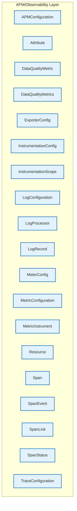

# APM/Observability Layer - Intra-Layer Relationships

## Overview

**Purpose**: Define semantic links between entities WITHIN this layer, capturing
structural composition, behavioral dependencies, and influence relationships.

**Layer ID**: `11-apm-observability`
**Analysis Date**: Generated automatically
**Validation**: Uses MarkdownLayerParser for closed-loop validation

---

### Relationship Diagram

## Layer Summary

### Entity Coverage (Target: 2+ relationships per entity)

- **Entities Meeting Target**: 0/19
- **Entity Coverage**: 0.0%

**Entities Below Target**:

- Span: 0 relationship(s) (needs 2 more)
- SpanEvent: 0 relationship(s) (needs 2 more)
- SpanLink: 0 relationship(s) (needs 2 more)
- SpanStatus: 0 relationship(s) (needs 2 more)
- LogRecord: 0 relationship(s) (needs 2 more)
- Resource: 0 relationship(s) (needs 2 more)
- InstrumentationScope: 0 relationship(s) (needs 2 more)
- ExporterConfig: 0 relationship(s) (needs 2 more)
- InstrumentationConfig: 0 relationship(s) (needs 2 more)
- LogProcessor: 0 relationship(s) (needs 2 more)
- MeterConfig: 0 relationship(s) (needs 2 more)
- MetricInstrument: 0 relationship(s) (needs 2 more)
- Attribute: 0 relationship(s) (needs 2 more)
- APMConfiguration: 0 relationship(s) (needs 2 more)
- TraceConfiguration: 0 relationship(s) (needs 2 more)
- LogConfiguration: 0 relationship(s) (needs 2 more)
- MetricConfiguration: 0 relationship(s) (needs 2 more)
- DataQualityMetrics: 0 relationship(s) (needs 2 more)
- DataQualityMetric: 0 relationship(s) (needs 2 more)

### Coverage Matrix

| Entity                | Outgoing | Incoming | Total | Meets Target | Status   |
| --------------------- | -------- | -------- | ----- | ------------ | -------- |
| APMConfiguration      | 0        | 0        | 0     | ✗            | Needs 2  |
| Attribute             | 0        | 0        | 0     | ✗            | Needs 2  |
| DataQualityMetric     | 0        | 0        | 0     | ✗            | Needs 2  |
| DataQualityMetrics    | 0        | 0        | 0     | ✗            | Needs 2  |
| ExporterConfig        | 0        | 0        | 0     | ✗            | Needs 2  |
| InstrumentationConfig | 0        | 0        | 0     | ✗            | Needs 2  |
| InstrumentationScope  | 0        | 0        | 0     | ✗            | Needs 2  |
| LogConfiguration      | 0        | 0        | 0     | ✗            | Needs 2  |
| LogProcessor          | 0        | 0        | 0     | ✗            | Needs 2  |
| LogRecord             | 0        | 0        | 0     | ✗            | Needs 2  |
| MeterConfig           | 0        | 0        | 0     | ✗            | Needs 2  |
| MetricConfiguration   | 0        | 0        | 0     | ✗            | Needs 2  |
| MetricInstrument      | 0        | 0        | 0     | ✗            | Needs 2  |
| Resource              | 0        | 0        | 0     | ✗            | Needs 2  |
| Span                  | 0        | 0        | 0     | ✗            | Needs 2  |
| SpanEvent             | 0        | 0        | 0     | ✗            | Needs 2  |
| SpanLink              | 0        | 0        | 0     | ✗            | Needs 2  |
| SpanStatus            | 0        | 0        | 0     | ✗            | Needs 2  |
| TraceConfiguration    | 0        | 0        | 0     | ✗            | Needs 2  |
| **TOTAL**             | **-**    | **-**    | **0** | **0/19**     | **0.0%** |

### Relationship Statistics

- **Total Unique Relationships**: 0
- **Total Connections (Entity Perspective)**: 0
- **Average Connections per Entity**: 0.0
- **Entity Coverage Target**: 2+ relationships

## Entity: APMConfiguration

**Definition**: Complete APM configuration for an application

### Outgoing Relationships (APMConfiguration → Other Entities)

_No outgoing intra-layer relationships documented._

### Incoming Relationships (Other Entities → APMConfiguration)

_No incoming intra-layer relationships documented._

### Relationship Summary

- **Total Relationships**: 0
- **Outgoing**: 0
- **Incoming**: 0
- **Documented**: 0/0
- **With XML Examples**: 0/0
- **In Catalog**: 0/0

---

## Entity: Attribute

**Definition**: Key-value pair metadata

### Outgoing Relationships (Attribute → Other Entities)

_No outgoing intra-layer relationships documented._

### Incoming Relationships (Other Entities → Attribute)

_No incoming intra-layer relationships documented._

### Relationship Summary

- **Total Relationships**: 0
- **Outgoing**: 0
- **Incoming**: 0
- **Documented**: 0/0
- **With XML Examples**: 0/0
- **In Catalog**: 0/0

---

## Entity: DataQualityMetric

**Definition**: Individual data quality metric

### Outgoing Relationships (DataQualityMetric → Other Entities)

_No outgoing intra-layer relationships documented._

### Incoming Relationships (Other Entities → DataQualityMetric)

_No incoming intra-layer relationships documented._

### Relationship Summary

- **Total Relationships**: 0
- **Outgoing**: 0
- **Incoming**: 0
- **Documented**: 0/0
- **With XML Examples**: 0/0
- **In Catalog**: 0/0

---

## Entity: DataQualityMetrics

**Definition**: Data quality monitoring metrics (referenced by Data Model Layer x-apm-data-quality-metrics)

### Outgoing Relationships (DataQualityMetrics → Other Entities)

_No outgoing intra-layer relationships documented._

### Incoming Relationships (Other Entities → DataQualityMetrics)

_No incoming intra-layer relationships documented._

### Relationship Summary

- **Total Relationships**: 0
- **Outgoing**: 0
- **Incoming**: 0
- **Documented**: 0/0
- **With XML Examples**: 0/0
- **In Catalog**: 0/0

---

## Entity: ExporterConfig

**Definition**: Configuration for telemetry data export destinations, specifying protocol (OTLP, Jaeger, Prometheus), endpoints, authentication, batching, and retry policies. Controls where observability data is sent.

### Outgoing Relationships (ExporterConfig → Other Entities)

_No outgoing intra-layer relationships documented._

### Incoming Relationships (Other Entities → ExporterConfig)

_No incoming intra-layer relationships documented._

### Relationship Summary

- **Total Relationships**: 0
- **Outgoing**: 0
- **Incoming**: 0
- **Documented**: 0/0
- **With XML Examples**: 0/0
- **In Catalog**: 0/0

---

## Entity: InstrumentationConfig

**Definition**: Configuration for automatic or manual instrumentation of application code, specifying which libraries, frameworks, or code paths to instrument and capture telemetry from.

### Outgoing Relationships (InstrumentationConfig → Other Entities)

_No outgoing intra-layer relationships documented._

### Incoming Relationships (Other Entities → InstrumentationConfig)

_No incoming intra-layer relationships documented._

### Relationship Summary

- **Total Relationships**: 0
- **Outgoing**: 0
- **Incoming**: 0
- **Documented**: 0/0
- **With XML Examples**: 0/0
- **In Catalog**: 0/0

---

## Entity: InstrumentationScope

**Definition**: Logical unit of code that generates telemetry

### Outgoing Relationships (InstrumentationScope → Other Entities)

_No outgoing intra-layer relationships documented._

### Incoming Relationships (Other Entities → InstrumentationScope)

_No incoming intra-layer relationships documented._

### Relationship Summary

- **Total Relationships**: 0
- **Outgoing**: 0
- **Incoming**: 0
- **Documented**: 0/0
- **With XML Examples**: 0/0
- **In Catalog**: 0/0

---

## Entity: LogConfiguration

**Definition**: Logging configuration

### Outgoing Relationships (LogConfiguration → Other Entities)

_No outgoing intra-layer relationships documented._

### Incoming Relationships (Other Entities → LogConfiguration)

_No incoming intra-layer relationships documented._

### Relationship Summary

- **Total Relationships**: 0
- **Outgoing**: 0
- **Incoming**: 0
- **Documented**: 0/0
- **With XML Examples**: 0/0
- **In Catalog**: 0/0

---

## Entity: LogProcessor

**Definition**: A processing pipeline component for log records, enabling filtering, transformation, enrichment, or routing of logs before export. Customizes log processing behavior.

### Outgoing Relationships (LogProcessor → Other Entities)

_No outgoing intra-layer relationships documented._

### Incoming Relationships (Other Entities → LogProcessor)

_No incoming intra-layer relationships documented._

### Relationship Summary

- **Total Relationships**: 0
- **Outgoing**: 0
- **Incoming**: 0
- **Documented**: 0/0
- **With XML Examples**: 0/0
- **In Catalog**: 0/0

---

## Entity: LogRecord

**Definition**: OpenTelemetry log entry

### Outgoing Relationships (LogRecord → Other Entities)

_No outgoing intra-layer relationships documented._

### Incoming Relationships (Other Entities → LogRecord)

_No incoming intra-layer relationships documented._

### Relationship Summary

- **Total Relationships**: 0
- **Outgoing**: 0
- **Incoming**: 0
- **Documented**: 0/0
- **With XML Examples**: 0/0
- **In Catalog**: 0/0

---

## Entity: MeterConfig

**Definition**: Configuration for metric collection meters, specifying aggregation temporality, cardinality limits, and collection intervals. Controls how metrics are gathered and aggregated.

### Outgoing Relationships (MeterConfig → Other Entities)

_No outgoing intra-layer relationships documented._

### Incoming Relationships (Other Entities → MeterConfig)

_No incoming intra-layer relationships documented._

### Relationship Summary

- **Total Relationships**: 0
- **Outgoing**: 0
- **Incoming**: 0
- **Documented**: 0/0
- **With XML Examples**: 0/0
- **In Catalog**: 0/0

---

## Entity: MetricConfiguration

**Definition**: Metrics configuration

### Outgoing Relationships (MetricConfiguration → Other Entities)

_No outgoing intra-layer relationships documented._

### Incoming Relationships (Other Entities → MetricConfiguration)

_No incoming intra-layer relationships documented._

### Relationship Summary

- **Total Relationships**: 0
- **Outgoing**: 0
- **Incoming**: 0
- **Documented**: 0/0
- **With XML Examples**: 0/0
- **In Catalog**: 0/0

---

## Entity: MetricInstrument

**Definition**: Defines a specific metric measurement instrument (Counter, Gauge, Histogram, etc.) with its name, unit, description, and attributes. The fundamental unit of metric collection.

### Outgoing Relationships (MetricInstrument → Other Entities)

_No outgoing intra-layer relationships documented._

### Incoming Relationships (Other Entities → MetricInstrument)

_No incoming intra-layer relationships documented._

### Relationship Summary

- **Total Relationships**: 0
- **Outgoing**: 0
- **Incoming**: 0
- **Documented**: 0/0
- **With XML Examples**: 0/0
- **In Catalog**: 0/0

---

## Entity: Resource

**Definition**: Immutable representation of entity producing telemetry

### Outgoing Relationships (Resource → Other Entities)

_No outgoing intra-layer relationships documented._

### Incoming Relationships (Other Entities → Resource)

_No incoming intra-layer relationships documented._

### Relationship Summary

- **Total Relationships**: 0
- **Outgoing**: 0
- **Incoming**: 0
- **Documented**: 0/0
- **With XML Examples**: 0/0
- **In Catalog**: 0/0

---

## Entity: Span

**Definition**: Unit of work in distributed tracing

### Outgoing Relationships (Span → Other Entities)

_No outgoing intra-layer relationships documented._

### Incoming Relationships (Other Entities → Span)

_No incoming intra-layer relationships documented._

### Relationship Summary

- **Total Relationships**: 0
- **Outgoing**: 0
- **Incoming**: 0
- **Documented**: 0/0
- **With XML Examples**: 0/0
- **In Catalog**: 0/0

---

## Entity: SpanEvent

**Definition**: Timestamped event during span execution

### Outgoing Relationships (SpanEvent → Other Entities)

_No outgoing intra-layer relationships documented._

### Incoming Relationships (Other Entities → SpanEvent)

_No incoming intra-layer relationships documented._

### Relationship Summary

- **Total Relationships**: 0
- **Outgoing**: 0
- **Incoming**: 0
- **Documented**: 0/0
- **With XML Examples**: 0/0
- **In Catalog**: 0/0

---

## Entity: SpanLink

**Definition**: Link to related span (different trace or parent)

### Outgoing Relationships (SpanLink → Other Entities)

_No outgoing intra-layer relationships documented._

### Incoming Relationships (Other Entities → SpanLink)

_No incoming intra-layer relationships documented._

### Relationship Summary

- **Total Relationships**: 0
- **Outgoing**: 0
- **Incoming**: 0
- **Documented**: 0/0
- **With XML Examples**: 0/0
- **In Catalog**: 0/0

---

## Entity: SpanStatus

**Definition**: Outcome of span execution

### Outgoing Relationships (SpanStatus → Other Entities)

_No outgoing intra-layer relationships documented._

### Incoming Relationships (Other Entities → SpanStatus)

_No incoming intra-layer relationships documented._

### Relationship Summary

- **Total Relationships**: 0
- **Outgoing**: 0
- **Incoming**: 0
- **Documented**: 0/0
- **With XML Examples**: 0/0
- **In Catalog**: 0/0

---

## Entity: TraceConfiguration

**Definition**: Distributed tracing configuration

### Outgoing Relationships (TraceConfiguration → Other Entities)

_No outgoing intra-layer relationships documented._

### Incoming Relationships (Other Entities → TraceConfiguration)

_No incoming intra-layer relationships documented._

### Relationship Summary

- **Total Relationships**: 0
- **Outgoing**: 0
- **Incoming**: 0
- **Documented**: 0/0
- **With XML Examples**: 0/0
- **In Catalog**: 0/0

---
