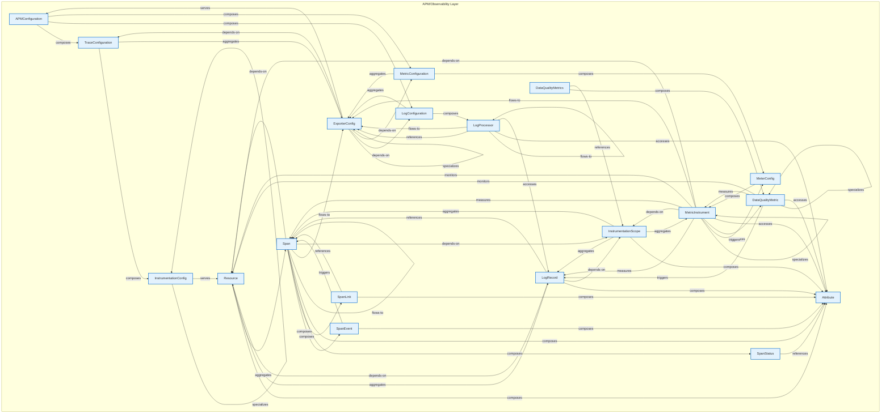

# APM/Observability Layer - Intra-Layer Relationships

## Overview

**Purpose**: Define semantic links between entities WITHIN this layer, capturing
structural composition, behavioral dependencies, and influence relationships.

**Layer ID**: `11-apm-observability`
**Analysis Date**: Generated automatically
**Validation**: Uses MarkdownLayerParser for closed-loop validation

---

### Relationship Diagram

## Layer Summary

### Entity Coverage (Target: 2+ relationships per entity)

- **Entities Meeting Target**: 19/19
- **Entity Coverage**: 100.0%

### Coverage Matrix

| Entity                | Outgoing | Incoming | Total   | Meets Target | Status     |
| --------------------- | -------- | -------- | ------- | ------------ | ---------- |
| APMConfiguration      | 3        | 1        | 4       | ✓            | Complete   |
| Attribute             | 0        | 10       | 10      | ✓            | Complete   |
| DataQualityMetric     | 5        | 3        | 8       | ✓            | Complete   |
| DataQualityMetrics    | 2        | 0        | 2       | ✓            | Complete   |
| ExporterConfig        | 5        | 8        | 13      | ✓            | Complete   |
| InstrumentationConfig | 2        | 2        | 4       | ✓            | Complete   |
| InstrumentationScope  | 4        | 4        | 8       | ✓            | Complete   |
| LogConfiguration      | 2        | 2        | 4       | ✓            | Complete   |
| LogProcessor          | 6        | 3        | 9       | ✓            | Complete   |
| LogRecord             | 4        | 5        | 9       | ✓            | Complete   |
| MeterConfig           | 1        | 2        | 3       | ✓            | Complete   |
| MetricConfiguration   | 2        | 2        | 4       | ✓            | Complete   |
| MetricInstrument      | 10       | 4        | 14      | ✓            | Complete   |
| Resource              | 3        | 6        | 9       | ✓            | Complete   |
| Span                  | 9        | 8        | 17      | ✓            | Complete   |
| SpanEvent             | 2        | 1        | 3       | ✓            | Complete   |
| SpanLink              | 2        | 1        | 3       | ✓            | Complete   |
| SpanStatus            | 1        | 1        | 2       | ✓            | Complete   |
| TraceConfiguration    | 2        | 2        | 4       | ✓            | Complete   |
| **TOTAL**             | **-**    | **-**    | **130** | **19/19**    | **100.0%** |

### Relationship Statistics

- **Total Unique Relationships**: 65
- **Total Connections (Entity Perspective)**: 130
- **Average Connections per Entity**: 6.8
- **Entity Coverage Target**: 2+ relationships

## Entity: APMConfiguration

**Definition**: Complete APM configuration for an application

### Outgoing Relationships (APMConfiguration → Other Entities)

| Relationship Type | Target Entity       | Predicate  | Status           | Source                                                               | In Catalog | Documented                                                         |
| ----------------- | ------------------- | ---------- | ---------------- | -------------------------------------------------------------------- | ---------- | ------------------------------------------------------------------ |
| composition       | LogConfiguration    | `composes` | Documented + XML | [Doc](../../spec/layers/11-apm-observability-layer.md#relationships) | ✓          | [✓](../../spec/layers/11-apm-observability-layer.md#relationships) |
| composition       | MetricConfiguration | `composes` | Documented + XML | [Doc](../../spec/layers/11-apm-observability-layer.md#relationships) | ✓          | [✓](../../spec/layers/11-apm-observability-layer.md#relationships) |
| composition       | TraceConfiguration  | `composes` | Documented + XML | [Doc](../../spec/layers/11-apm-observability-layer.md#relationships) | ✓          | [✓](../../spec/layers/11-apm-observability-layer.md#relationships) |

### Incoming Relationships (Other Entities → APMConfiguration)

| Relationship Type | Source Entity  | Predicate | Status           | Source                                                               | In Catalog | Documented                                                         |
| ----------------- | -------------- | --------- | ---------------- | -------------------------------------------------------------------- | ---------- | ------------------------------------------------------------------ |
| serves            | ExporterConfig | `serves`  | Documented + XML | [Doc](../../spec/layers/11-apm-observability-layer.md#relationships) | ✓          | [✓](../../spec/layers/11-apm-observability-layer.md#relationships) |

### Relationship Summary

- **Total Relationships**: 4
- **Outgoing**: 3
- **Incoming**: 1
- **Documented**: 4/4
- **With XML Examples**: 4/4
- **In Catalog**: 4/4

---

## Entity: Attribute

**Definition**: Key-value pair metadata

### Outgoing Relationships (Attribute → Other Entities)

_No outgoing intra-layer relationships documented._

### Incoming Relationships (Other Entities → Attribute)

| Relationship Type | Source Entity        | Predicate    | Status           | Source                                                               | In Catalog | Documented                                                         |
| ----------------- | -------------------- | ------------ | ---------------- | -------------------------------------------------------------------- | ---------- | ------------------------------------------------------------------ |
| access            | DataQualityMetric    | `accesses`   | Documented + XML | [Doc](../../spec/layers/11-apm-observability-layer.md#relationships) | ✓          | [✓](../../spec/layers/11-apm-observability-layer.md#relationships) |
| composition       | InstrumentationScope | `composes`   | Documented + XML | [Doc](../../spec/layers/11-apm-observability-layer.md#relationships) | ✓          | [✓](../../spec/layers/11-apm-observability-layer.md#relationships) |
| access            | LogProcessor         | `accesses`   | Documented + XML | [Doc](../../spec/layers/11-apm-observability-layer.md#relationships) | ✓          | [✓](../../spec/layers/11-apm-observability-layer.md#relationships) |
| composition       | LogRecord            | `composes`   | Documented + XML | [Doc](../../spec/layers/11-apm-observability-layer.md#relationships) | ✓          | [✓](../../spec/layers/11-apm-observability-layer.md#relationships) |
| access            | MetricInstrument     | `accesses`   | Documented + XML | [Doc](../../spec/layers/11-apm-observability-layer.md#relationships) | ✓          | [✓](../../spec/layers/11-apm-observability-layer.md#relationships) |
| composition       | Resource             | `composes`   | Documented + XML | [Doc](../../spec/layers/11-apm-observability-layer.md#relationships) | ✓          | [✓](../../spec/layers/11-apm-observability-layer.md#relationships) |
| composition       | Span                 | `composes`   | Documented + XML | [Doc](../../spec/layers/11-apm-observability-layer.md#relationships) | ✓          | [✓](../../spec/layers/11-apm-observability-layer.md#relationships) |
| composition       | SpanEvent            | `composes`   | Documented + XML | [Doc](../../spec/layers/11-apm-observability-layer.md#relationships) | ✓          | [✓](../../spec/layers/11-apm-observability-layer.md#relationships) |
| composition       | SpanLink             | `composes`   | Documented + XML | [Doc](../../spec/layers/11-apm-observability-layer.md#relationships) | ✓          | [✓](../../spec/layers/11-apm-observability-layer.md#relationships) |
| reference         | SpanStatus           | `references` | Documented + XML | [Doc](../../spec/layers/11-apm-observability-layer.md#relationships) | ✓          | [✓](../../spec/layers/11-apm-observability-layer.md#relationships) |

### Relationship Summary

- **Total Relationships**: 10
- **Outgoing**: 0
- **Incoming**: 10
- **Documented**: 10/10
- **With XML Examples**: 10/10
- **In Catalog**: 10/10

---

## Entity: DataQualityMetric

**Definition**: Individual data quality metric

### Outgoing Relationships (DataQualityMetric → Other Entities)

| Relationship Type | Target Entity     | Predicate     | Status           | Source                                                               | In Catalog | Documented                                                         |
| ----------------- | ----------------- | ------------- | ---------------- | -------------------------------------------------------------------- | ---------- | ------------------------------------------------------------------ |
| access            | Attribute         | `accesses`    | Documented + XML | [Doc](../../spec/layers/11-apm-observability-layer.md#relationships) | ✓          | [✓](../../spec/layers/11-apm-observability-layer.md#relationships) |
| specialization    | DataQualityMetric | `specializes` | Documented + XML | [Doc](../../spec/layers/11-apm-observability-layer.md#relationships) | ✓          | [✓](../../spec/layers/11-apm-observability-layer.md#relationships) |
| triggering        | LogRecord         | `triggers`    | Documented + XML | [Doc](../../spec/layers/11-apm-observability-layer.md#relationships) | ✓          | [✓](../../spec/layers/11-apm-observability-layer.md#relationships) |
| measures          | MetricInstrument  | `measures`    | Documented + XML | [Doc](../../spec/layers/11-apm-observability-layer.md#relationships) | ✓          | [✓](../../spec/layers/11-apm-observability-layer.md#relationships) |
| monitors          | Resource          | `monitors`    | Documented + XML | [Doc](../../spec/layers/11-apm-observability-layer.md#relationships) | ✓          | [✓](../../spec/layers/11-apm-observability-layer.md#relationships) |

### Incoming Relationships (Other Entities → DataQualityMetric)

| Relationship Type | Source Entity      | Predicate     | Status           | Source                                                               | In Catalog | Documented                                                         |
| ----------------- | ------------------ | ------------- | ---------------- | -------------------------------------------------------------------- | ---------- | ------------------------------------------------------------------ |
| specialization    | DataQualityMetric  | `specializes` | Documented + XML | [Doc](../../spec/layers/11-apm-observability-layer.md#relationships) | ✓          | [✓](../../spec/layers/11-apm-observability-layer.md#relationships) |
| composition       | DataQualityMetrics | `composes`    | Documented + XML | [Doc](../../spec/layers/11-apm-observability-layer.md#relationships) | ✓          | [✓](../../spec/layers/11-apm-observability-layer.md#relationships) |
| triggering        | MetricInstrument   | `triggers`    | Documented + XML | [Doc](../../spec/layers/11-apm-observability-layer.md#relationships) | ✓          | [✓](../../spec/layers/11-apm-observability-layer.md#relationships) |

### Relationship Summary

- **Total Relationships**: 8
- **Outgoing**: 5
- **Incoming**: 3
- **Documented**: 8/8
- **With XML Examples**: 8/8
- **In Catalog**: 8/8

---

## Entity: DataQualityMetrics

**Definition**: Data quality monitoring metrics (referenced by Data Model Layer x-apm-data-quality-metrics)

### Outgoing Relationships (DataQualityMetrics → Other Entities)

| Relationship Type | Target Entity        | Predicate    | Status           | Source                                                               | In Catalog | Documented                                                         |
| ----------------- | -------------------- | ------------ | ---------------- | -------------------------------------------------------------------- | ---------- | ------------------------------------------------------------------ |
| composition       | DataQualityMetric    | `composes`   | Documented + XML | [Doc](../../spec/layers/11-apm-observability-layer.md#relationships) | ✓          | [✓](../../spec/layers/11-apm-observability-layer.md#relationships) |
| reference         | InstrumentationScope | `references` | Documented + XML | [Doc](../../spec/layers/11-apm-observability-layer.md#relationships) | ✓          | [✓](../../spec/layers/11-apm-observability-layer.md#relationships) |

### Incoming Relationships (Other Entities → DataQualityMetrics)

_No incoming intra-layer relationships documented._

### Relationship Summary

- **Total Relationships**: 2
- **Outgoing**: 2
- **Incoming**: 0
- **Documented**: 2/2
- **With XML Examples**: 2/2
- **In Catalog**: 2/2

---

## Entity: ExporterConfig

**Definition**: Configuration for telemetry data export destinations, specifying protocol (OTLP, Jaeger, Prometheus), endpoints, authentication, batching, and retry policies. Controls where observability data is sent.

### Outgoing Relationships (ExporterConfig → Other Entities)

| Relationship Type | Target Entity       | Predicate     | Status           | Source                                                               | In Catalog | Documented                                                         |
| ----------------- | ------------------- | ------------- | ---------------- | -------------------------------------------------------------------- | ---------- | ------------------------------------------------------------------ |
| serves            | APMConfiguration    | `serves`      | Documented + XML | [Doc](../../spec/layers/11-apm-observability-layer.md#relationships) | ✓          | [✓](../../spec/layers/11-apm-observability-layer.md#relationships) |
| specialization    | ExporterConfig      | `specializes` | Documented + XML | [Doc](../../spec/layers/11-apm-observability-layer.md#relationships) | ✓          | [✓](../../spec/layers/11-apm-observability-layer.md#relationships) |
| depends-on        | LogConfiguration    | `depends-on`  | Documented + XML | [Doc](../../spec/layers/11-apm-observability-layer.md#relationships) | ✓          | [✓](../../spec/layers/11-apm-observability-layer.md#relationships) |
| depends-on        | MetricConfiguration | `depends-on`  | Documented + XML | [Doc](../../spec/layers/11-apm-observability-layer.md#relationships) | ✓          | [✓](../../spec/layers/11-apm-observability-layer.md#relationships) |
| depends-on        | TraceConfiguration  | `depends-on`  | Documented + XML | [Doc](../../spec/layers/11-apm-observability-layer.md#relationships) | ✓          | [✓](../../spec/layers/11-apm-observability-layer.md#relationships) |

### Incoming Relationships (Other Entities → ExporterConfig)

| Relationship Type | Source Entity       | Predicate     | Status           | Source                                                               | In Catalog | Documented                                                         |
| ----------------- | ------------------- | ------------- | ---------------- | -------------------------------------------------------------------- | ---------- | ------------------------------------------------------------------ |
| specialization    | ExporterConfig      | `specializes` | Documented + XML | [Doc](../../spec/layers/11-apm-observability-layer.md#relationships) | ✓          | [✓](../../spec/layers/11-apm-observability-layer.md#relationships) |
| aggregation       | LogConfiguration    | `aggregates`  | Documented + XML | [Doc](../../spec/layers/11-apm-observability-layer.md#relationships) | ✓          | [✓](../../spec/layers/11-apm-observability-layer.md#relationships) |
| flow              | LogProcessor        | `flows-to`    | Documented + XML | [Doc](../../spec/layers/11-apm-observability-layer.md#relationships) | ✓          | [✓](../../spec/layers/11-apm-observability-layer.md#relationships) |
| reference         | LogProcessor        | `references`  | Documented + XML | [Doc](../../spec/layers/11-apm-observability-layer.md#relationships) | ✓          | [✓](../../spec/layers/11-apm-observability-layer.md#relationships) |
| aggregation       | MetricConfiguration | `aggregates`  | Documented + XML | [Doc](../../spec/layers/11-apm-observability-layer.md#relationships) | ✓          | [✓](../../spec/layers/11-apm-observability-layer.md#relationships) |
| flow              | MetricInstrument    | `flows-to`    | Documented + XML | [Doc](../../spec/layers/11-apm-observability-layer.md#relationships) | ✓          | [✓](../../spec/layers/11-apm-observability-layer.md#relationships) |
| flow              | Span                | `flows-to`    | Documented + XML | [Doc](../../spec/layers/11-apm-observability-layer.md#relationships) | ✓          | [✓](../../spec/layers/11-apm-observability-layer.md#relationships) |
| aggregation       | TraceConfiguration  | `aggregates`  | Documented + XML | [Doc](../../spec/layers/11-apm-observability-layer.md#relationships) | ✓          | [✓](../../spec/layers/11-apm-observability-layer.md#relationships) |

### Relationship Summary

- **Total Relationships**: 13
- **Outgoing**: 5
- **Incoming**: 8
- **Documented**: 13/13
- **With XML Examples**: 13/13
- **In Catalog**: 13/13

---

## Entity: InstrumentationConfig

**Definition**: Configuration for automatic or manual instrumentation of application code, specifying which libraries, frameworks, or code paths to instrument and capture telemetry from.

### Outgoing Relationships (InstrumentationConfig → Other Entities)

| Relationship Type | Target Entity         | Predicate     | Status           | Source                                                               | In Catalog | Documented                                                         |
| ----------------- | --------------------- | ------------- | ---------------- | -------------------------------------------------------------------- | ---------- | ------------------------------------------------------------------ |
| specialization    | InstrumentationConfig | `specializes` | Documented + XML | [Doc](../../spec/layers/11-apm-observability-layer.md#relationships) | ✓          | [✓](../../spec/layers/11-apm-observability-layer.md#relationships) |
| serves            | Resource              | `serves`      | Documented + XML | [Doc](../../spec/layers/11-apm-observability-layer.md#relationships) | ✓          | [✓](../../spec/layers/11-apm-observability-layer.md#relationships) |

### Incoming Relationships (Other Entities → InstrumentationConfig)

| Relationship Type | Source Entity         | Predicate     | Status           | Source                                                               | In Catalog | Documented                                                         |
| ----------------- | --------------------- | ------------- | ---------------- | -------------------------------------------------------------------- | ---------- | ------------------------------------------------------------------ |
| specialization    | InstrumentationConfig | `specializes` | Documented + XML | [Doc](../../spec/layers/11-apm-observability-layer.md#relationships) | ✓          | [✓](../../spec/layers/11-apm-observability-layer.md#relationships) |
| composition       | TraceConfiguration    | `composes`    | Documented + XML | [Doc](../../spec/layers/11-apm-observability-layer.md#relationships) | ✓          | [✓](../../spec/layers/11-apm-observability-layer.md#relationships) |

### Relationship Summary

- **Total Relationships**: 4
- **Outgoing**: 2
- **Incoming**: 2
- **Documented**: 4/4
- **With XML Examples**: 4/4
- **In Catalog**: 4/4

---

## Entity: InstrumentationScope

**Definition**: Logical unit of code that generates telemetry

### Outgoing Relationships (InstrumentationScope → Other Entities)

| Relationship Type | Target Entity    | Predicate    | Status           | Source                                                               | In Catalog | Documented                                                         |
| ----------------- | ---------------- | ------------ | ---------------- | -------------------------------------------------------------------- | ---------- | ------------------------------------------------------------------ |
| composition       | Attribute        | `composes`   | Documented + XML | [Doc](../../spec/layers/11-apm-observability-layer.md#relationships) | ✓          | [✓](../../spec/layers/11-apm-observability-layer.md#relationships) |
| aggregation       | LogRecord        | `aggregates` | Documented + XML | [Doc](../../spec/layers/11-apm-observability-layer.md#relationships) | ✓          | [✓](../../spec/layers/11-apm-observability-layer.md#relationships) |
| aggregation       | MetricInstrument | `aggregates` | Documented + XML | [Doc](../../spec/layers/11-apm-observability-layer.md#relationships) | ✓          | [✓](../../spec/layers/11-apm-observability-layer.md#relationships) |
| aggregation       | Span             | `aggregates` | Documented + XML | [Doc](../../spec/layers/11-apm-observability-layer.md#relationships) | ✓          | [✓](../../spec/layers/11-apm-observability-layer.md#relationships) |

### Incoming Relationships (Other Entities → InstrumentationScope)

| Relationship Type | Source Entity      | Predicate    | Status           | Source                                                               | In Catalog | Documented                                                         |
| ----------------- | ------------------ | ------------ | ---------------- | -------------------------------------------------------------------- | ---------- | ------------------------------------------------------------------ |
| reference         | DataQualityMetrics | `references` | Documented + XML | [Doc](../../spec/layers/11-apm-observability-layer.md#relationships) | ✓          | [✓](../../spec/layers/11-apm-observability-layer.md#relationships) |
| depends-on        | LogRecord          | `depends-on` | Documented + XML | [Doc](../../spec/layers/11-apm-observability-layer.md#relationships) | ✓          | [✓](../../spec/layers/11-apm-observability-layer.md#relationships) |
| depends-on        | MetricInstrument   | `depends-on` | Documented + XML | [Doc](../../spec/layers/11-apm-observability-layer.md#relationships) | ✓          | [✓](../../spec/layers/11-apm-observability-layer.md#relationships) |
| depends-on        | Span               | `depends-on` | Documented + XML | [Doc](../../spec/layers/11-apm-observability-layer.md#relationships) | ✓          | [✓](../../spec/layers/11-apm-observability-layer.md#relationships) |

### Relationship Summary

- **Total Relationships**: 8
- **Outgoing**: 4
- **Incoming**: 4
- **Documented**: 8/8
- **With XML Examples**: 8/8
- **In Catalog**: 8/8

---

## Entity: LogConfiguration

**Definition**: Logging configuration

### Outgoing Relationships (LogConfiguration → Other Entities)

| Relationship Type | Target Entity  | Predicate    | Status           | Source                                                               | In Catalog | Documented                                                         |
| ----------------- | -------------- | ------------ | ---------------- | -------------------------------------------------------------------- | ---------- | ------------------------------------------------------------------ |
| aggregation       | ExporterConfig | `aggregates` | Documented + XML | [Doc](../../spec/layers/11-apm-observability-layer.md#relationships) | ✓          | [✓](../../spec/layers/11-apm-observability-layer.md#relationships) |
| composition       | LogProcessor   | `composes`   | Documented + XML | [Doc](../../spec/layers/11-apm-observability-layer.md#relationships) | ✓          | [✓](../../spec/layers/11-apm-observability-layer.md#relationships) |

### Incoming Relationships (Other Entities → LogConfiguration)

| Relationship Type | Source Entity    | Predicate    | Status           | Source                                                               | In Catalog | Documented                                                         |
| ----------------- | ---------------- | ------------ | ---------------- | -------------------------------------------------------------------- | ---------- | ------------------------------------------------------------------ |
| composition       | APMConfiguration | `composes`   | Documented + XML | [Doc](../../spec/layers/11-apm-observability-layer.md#relationships) | ✓          | [✓](../../spec/layers/11-apm-observability-layer.md#relationships) |
| depends-on        | ExporterConfig   | `depends-on` | Documented + XML | [Doc](../../spec/layers/11-apm-observability-layer.md#relationships) | ✓          | [✓](../../spec/layers/11-apm-observability-layer.md#relationships) |

### Relationship Summary

- **Total Relationships**: 4
- **Outgoing**: 2
- **Incoming**: 2
- **Documented**: 4/4
- **With XML Examples**: 4/4
- **In Catalog**: 4/4

---

## Entity: LogProcessor

**Definition**: A processing pipeline component for log records, enabling filtering, transformation, enrichment, or routing of logs before export. Customizes log processing behavior.

### Outgoing Relationships (LogProcessor → Other Entities)

| Relationship Type | Target Entity  | Predicate     | Status           | Source                                                               | In Catalog | Documented                                                         |
| ----------------- | -------------- | ------------- | ---------------- | -------------------------------------------------------------------- | ---------- | ------------------------------------------------------------------ |
| access            | Attribute      | `accesses`    | Documented + XML | [Doc](../../spec/layers/11-apm-observability-layer.md#relationships) | ✓          | [✓](../../spec/layers/11-apm-observability-layer.md#relationships) |
| flow              | ExporterConfig | `flows-to`    | Documented + XML | [Doc](../../spec/layers/11-apm-observability-layer.md#relationships) | ✓          | [✓](../../spec/layers/11-apm-observability-layer.md#relationships) |
| reference         | ExporterConfig | `references`  | Documented + XML | [Doc](../../spec/layers/11-apm-observability-layer.md#relationships) | ✓          | [✓](../../spec/layers/11-apm-observability-layer.md#relationships) |
| flow              | LogProcessor   | `flows-to`    | Documented + XML | [Doc](../../spec/layers/11-apm-observability-layer.md#relationships) | ✓          | [✓](../../spec/layers/11-apm-observability-layer.md#relationships) |
| specialization    | LogProcessor   | `specializes` | Documented + XML | [Doc](../../spec/layers/11-apm-observability-layer.md#relationships) | ✓          | [✓](../../spec/layers/11-apm-observability-layer.md#relationships) |
| access            | LogRecord      | `accesses`    | Documented + XML | [Doc](../../spec/layers/11-apm-observability-layer.md#relationships) | ✓          | [✓](../../spec/layers/11-apm-observability-layer.md#relationships) |

### Incoming Relationships (Other Entities → LogProcessor)

| Relationship Type | Source Entity    | Predicate     | Status           | Source                                                               | In Catalog | Documented                                                         |
| ----------------- | ---------------- | ------------- | ---------------- | -------------------------------------------------------------------- | ---------- | ------------------------------------------------------------------ |
| composition       | LogConfiguration | `composes`    | Documented + XML | [Doc](../../spec/layers/11-apm-observability-layer.md#relationships) | ✓          | [✓](../../spec/layers/11-apm-observability-layer.md#relationships) |
| flow              | LogProcessor     | `flows-to`    | Documented + XML | [Doc](../../spec/layers/11-apm-observability-layer.md#relationships) | ✓          | [✓](../../spec/layers/11-apm-observability-layer.md#relationships) |
| specialization    | LogProcessor     | `specializes` | Documented + XML | [Doc](../../spec/layers/11-apm-observability-layer.md#relationships) | ✓          | [✓](../../spec/layers/11-apm-observability-layer.md#relationships) |

### Relationship Summary

- **Total Relationships**: 9
- **Outgoing**: 6
- **Incoming**: 3
- **Documented**: 9/9
- **With XML Examples**: 9/9
- **In Catalog**: 9/9

---

## Entity: LogRecord

**Definition**: OpenTelemetry log entry

### Outgoing Relationships (LogRecord → Other Entities)

| Relationship Type | Target Entity        | Predicate    | Status           | Source                                                               | In Catalog | Documented                                                         |
| ----------------- | -------------------- | ------------ | ---------------- | -------------------------------------------------------------------- | ---------- | ------------------------------------------------------------------ |
| composition       | Attribute            | `composes`   | Documented + XML | [Doc](../../spec/layers/11-apm-observability-layer.md#relationships) | ✓          | [✓](../../spec/layers/11-apm-observability-layer.md#relationships) |
| depends-on        | InstrumentationScope | `depends-on` | Documented + XML | [Doc](../../spec/layers/11-apm-observability-layer.md#relationships) | ✓          | [✓](../../spec/layers/11-apm-observability-layer.md#relationships) |
| depends-on        | Resource             | `depends-on` | Documented + XML | [Doc](../../spec/layers/11-apm-observability-layer.md#relationships) | ✓          | [✓](../../spec/layers/11-apm-observability-layer.md#relationships) |
| reference         | Span                 | `references` | Documented + XML | [Doc](../../spec/layers/11-apm-observability-layer.md#relationships) | ✓          | [✓](../../spec/layers/11-apm-observability-layer.md#relationships) |

### Incoming Relationships (Other Entities → LogRecord)

| Relationship Type | Source Entity        | Predicate    | Status           | Source                                                               | In Catalog | Documented                                                         |
| ----------------- | -------------------- | ------------ | ---------------- | -------------------------------------------------------------------- | ---------- | ------------------------------------------------------------------ |
| triggering        | DataQualityMetric    | `triggers`   | Documented + XML | [Doc](../../spec/layers/11-apm-observability-layer.md#relationships) | ✓          | [✓](../../spec/layers/11-apm-observability-layer.md#relationships) |
| aggregation       | InstrumentationScope | `aggregates` | Documented + XML | [Doc](../../spec/layers/11-apm-observability-layer.md#relationships) | ✓          | [✓](../../spec/layers/11-apm-observability-layer.md#relationships) |
| access            | LogProcessor         | `accesses`   | Documented + XML | [Doc](../../spec/layers/11-apm-observability-layer.md#relationships) | ✓          | [✓](../../spec/layers/11-apm-observability-layer.md#relationships) |
| measures          | MetricInstrument     | `measures`   | Documented + XML | [Doc](../../spec/layers/11-apm-observability-layer.md#relationships) | ✓          | [✓](../../spec/layers/11-apm-observability-layer.md#relationships) |
| aggregation       | Resource             | `aggregates` | Documented + XML | [Doc](../../spec/layers/11-apm-observability-layer.md#relationships) | ✓          | [✓](../../spec/layers/11-apm-observability-layer.md#relationships) |

### Relationship Summary

- **Total Relationships**: 9
- **Outgoing**: 4
- **Incoming**: 5
- **Documented**: 9/9
- **With XML Examples**: 9/9
- **In Catalog**: 9/9

---

## Entity: MeterConfig

**Definition**: Configuration for metric collection meters, specifying aggregation temporality, cardinality limits, and collection intervals. Controls how metrics are gathered and aggregated.

### Outgoing Relationships (MeterConfig → Other Entities)

| Relationship Type | Target Entity    | Predicate  | Status           | Source                                                               | In Catalog | Documented                                                         |
| ----------------- | ---------------- | ---------- | ---------------- | -------------------------------------------------------------------- | ---------- | ------------------------------------------------------------------ |
| composition       | MetricInstrument | `composes` | Documented + XML | [Doc](../../spec/layers/11-apm-observability-layer.md#relationships) | ✓          | [✓](../../spec/layers/11-apm-observability-layer.md#relationships) |

### Incoming Relationships (Other Entities → MeterConfig)

| Relationship Type | Source Entity       | Predicate    | Status           | Source                                                               | In Catalog | Documented                                                         |
| ----------------- | ------------------- | ------------ | ---------------- | -------------------------------------------------------------------- | ---------- | ------------------------------------------------------------------ |
| composition       | MetricConfiguration | `composes`   | Documented + XML | [Doc](../../spec/layers/11-apm-observability-layer.md#relationships) | ✓          | [✓](../../spec/layers/11-apm-observability-layer.md#relationships) |
| reference         | MetricInstrument    | `references` | Documented + XML | [Doc](../../spec/layers/11-apm-observability-layer.md#relationships) | ✓          | [✓](../../spec/layers/11-apm-observability-layer.md#relationships) |

### Relationship Summary

- **Total Relationships**: 3
- **Outgoing**: 1
- **Incoming**: 2
- **Documented**: 3/3
- **With XML Examples**: 3/3
- **In Catalog**: 3/3

---

## Entity: MetricConfiguration

**Definition**: Metrics configuration

### Outgoing Relationships (MetricConfiguration → Other Entities)

| Relationship Type | Target Entity  | Predicate    | Status           | Source                                                               | In Catalog | Documented                                                         |
| ----------------- | -------------- | ------------ | ---------------- | -------------------------------------------------------------------- | ---------- | ------------------------------------------------------------------ |
| aggregation       | ExporterConfig | `aggregates` | Documented + XML | [Doc](../../spec/layers/11-apm-observability-layer.md#relationships) | ✓          | [✓](../../spec/layers/11-apm-observability-layer.md#relationships) |
| composition       | MeterConfig    | `composes`   | Documented + XML | [Doc](../../spec/layers/11-apm-observability-layer.md#relationships) | ✓          | [✓](../../spec/layers/11-apm-observability-layer.md#relationships) |

### Incoming Relationships (Other Entities → MetricConfiguration)

| Relationship Type | Source Entity    | Predicate    | Status           | Source                                                               | In Catalog | Documented                                                         |
| ----------------- | ---------------- | ------------ | ---------------- | -------------------------------------------------------------------- | ---------- | ------------------------------------------------------------------ |
| composition       | APMConfiguration | `composes`   | Documented + XML | [Doc](../../spec/layers/11-apm-observability-layer.md#relationships) | ✓          | [✓](../../spec/layers/11-apm-observability-layer.md#relationships) |
| depends-on        | ExporterConfig   | `depends-on` | Documented + XML | [Doc](../../spec/layers/11-apm-observability-layer.md#relationships) | ✓          | [✓](../../spec/layers/11-apm-observability-layer.md#relationships) |

### Relationship Summary

- **Total Relationships**: 4
- **Outgoing**: 2
- **Incoming**: 2
- **Documented**: 4/4
- **With XML Examples**: 4/4
- **In Catalog**: 4/4

---

## Entity: MetricInstrument

**Definition**: Defines a specific metric measurement instrument (Counter, Gauge, Histogram, etc.) with its name, unit, description, and attributes. The fundamental unit of metric collection.

### Outgoing Relationships (MetricInstrument → Other Entities)

| Relationship Type | Target Entity        | Predicate     | Status           | Source                                                               | In Catalog | Documented                                                         |
| ----------------- | -------------------- | ------------- | ---------------- | -------------------------------------------------------------------- | ---------- | ------------------------------------------------------------------ |
| access            | Attribute            | `accesses`    | Documented + XML | [Doc](../../spec/layers/11-apm-observability-layer.md#relationships) | ✓          | [✓](../../spec/layers/11-apm-observability-layer.md#relationships) |
| triggering        | DataQualityMetric    | `triggers`    | Documented + XML | [Doc](../../spec/layers/11-apm-observability-layer.md#relationships) | ✓          | [✓](../../spec/layers/11-apm-observability-layer.md#relationships) |
| flow              | ExporterConfig       | `flows-to`    | Documented + XML | [Doc](../../spec/layers/11-apm-observability-layer.md#relationships) | ✓          | [✓](../../spec/layers/11-apm-observability-layer.md#relationships) |
| depends-on        | InstrumentationScope | `depends-on`  | Documented + XML | [Doc](../../spec/layers/11-apm-observability-layer.md#relationships) | ✓          | [✓](../../spec/layers/11-apm-observability-layer.md#relationships) |
| measures          | LogRecord            | `measures`    | Documented + XML | [Doc](../../spec/layers/11-apm-observability-layer.md#relationships) | ✓          | [✓](../../spec/layers/11-apm-observability-layer.md#relationships) |
| reference         | MeterConfig          | `references`  | Documented + XML | [Doc](../../spec/layers/11-apm-observability-layer.md#relationships) | ✓          | [✓](../../spec/layers/11-apm-observability-layer.md#relationships) |
| specialization    | MetricInstrument     | `specializes` | Documented + XML | [Doc](../../spec/layers/11-apm-observability-layer.md#relationships) | ✓          | [✓](../../spec/layers/11-apm-observability-layer.md#relationships) |
| depends-on        | Resource             | `depends-on`  | Documented + XML | [Doc](../../spec/layers/11-apm-observability-layer.md#relationships) | ✓          | [✓](../../spec/layers/11-apm-observability-layer.md#relationships) |
| monitors          | Resource             | `monitors`    | Documented + XML | [Doc](../../spec/layers/11-apm-observability-layer.md#relationships) | ✓          | [✓](../../spec/layers/11-apm-observability-layer.md#relationships) |
| measures          | Span                 | `measures`    | Documented + XML | [Doc](../../spec/layers/11-apm-observability-layer.md#relationships) | ✓          | [✓](../../spec/layers/11-apm-observability-layer.md#relationships) |

### Incoming Relationships (Other Entities → MetricInstrument)

| Relationship Type | Source Entity        | Predicate     | Status           | Source                                                               | In Catalog | Documented                                                         |
| ----------------- | -------------------- | ------------- | ---------------- | -------------------------------------------------------------------- | ---------- | ------------------------------------------------------------------ |
| measures          | DataQualityMetric    | `measures`    | Documented + XML | [Doc](../../spec/layers/11-apm-observability-layer.md#relationships) | ✓          | [✓](../../spec/layers/11-apm-observability-layer.md#relationships) |
| aggregation       | InstrumentationScope | `aggregates`  | Documented + XML | [Doc](../../spec/layers/11-apm-observability-layer.md#relationships) | ✓          | [✓](../../spec/layers/11-apm-observability-layer.md#relationships) |
| composition       | MeterConfig          | `composes`    | Documented + XML | [Doc](../../spec/layers/11-apm-observability-layer.md#relationships) | ✓          | [✓](../../spec/layers/11-apm-observability-layer.md#relationships) |
| specialization    | MetricInstrument     | `specializes` | Documented + XML | [Doc](../../spec/layers/11-apm-observability-layer.md#relationships) | ✓          | [✓](../../spec/layers/11-apm-observability-layer.md#relationships) |

### Relationship Summary

- **Total Relationships**: 14
- **Outgoing**: 10
- **Incoming**: 4
- **Documented**: 14/14
- **With XML Examples**: 14/14
- **In Catalog**: 14/14

---

## Entity: Resource

**Definition**: Immutable representation of entity producing telemetry

### Outgoing Relationships (Resource → Other Entities)

| Relationship Type | Target Entity | Predicate    | Status           | Source                                                               | In Catalog | Documented                                                         |
| ----------------- | ------------- | ------------ | ---------------- | -------------------------------------------------------------------- | ---------- | ------------------------------------------------------------------ |
| composition       | Attribute     | `composes`   | Documented + XML | [Doc](../../spec/layers/11-apm-observability-layer.md#relationships) | ✓          | [✓](../../spec/layers/11-apm-observability-layer.md#relationships) |
| aggregation       | LogRecord     | `aggregates` | Documented + XML | [Doc](../../spec/layers/11-apm-observability-layer.md#relationships) | ✓          | [✓](../../spec/layers/11-apm-observability-layer.md#relationships) |
| aggregation       | Span          | `aggregates` | Documented + XML | [Doc](../../spec/layers/11-apm-observability-layer.md#relationships) | ✓          | [✓](../../spec/layers/11-apm-observability-layer.md#relationships) |

### Incoming Relationships (Other Entities → Resource)

| Relationship Type | Source Entity         | Predicate    | Status           | Source                                                               | In Catalog | Documented                                                         |
| ----------------- | --------------------- | ------------ | ---------------- | -------------------------------------------------------------------- | ---------- | ------------------------------------------------------------------ |
| monitors          | DataQualityMetric     | `monitors`   | Documented + XML | [Doc](../../spec/layers/11-apm-observability-layer.md#relationships) | ✓          | [✓](../../spec/layers/11-apm-observability-layer.md#relationships) |
| serves            | InstrumentationConfig | `serves`     | Documented + XML | [Doc](../../spec/layers/11-apm-observability-layer.md#relationships) | ✓          | [✓](../../spec/layers/11-apm-observability-layer.md#relationships) |
| depends-on        | LogRecord             | `depends-on` | Documented + XML | [Doc](../../spec/layers/11-apm-observability-layer.md#relationships) | ✓          | [✓](../../spec/layers/11-apm-observability-layer.md#relationships) |
| depends-on        | MetricInstrument      | `depends-on` | Documented + XML | [Doc](../../spec/layers/11-apm-observability-layer.md#relationships) | ✓          | [✓](../../spec/layers/11-apm-observability-layer.md#relationships) |
| monitors          | MetricInstrument      | `monitors`   | Documented + XML | [Doc](../../spec/layers/11-apm-observability-layer.md#relationships) | ✓          | [✓](../../spec/layers/11-apm-observability-layer.md#relationships) |
| depends-on        | Span                  | `depends-on` | Documented + XML | [Doc](../../spec/layers/11-apm-observability-layer.md#relationships) | ✓          | [✓](../../spec/layers/11-apm-observability-layer.md#relationships) |

### Relationship Summary

- **Total Relationships**: 9
- **Outgoing**: 3
- **Incoming**: 6
- **Documented**: 9/9
- **With XML Examples**: 9/9
- **In Catalog**: 9/9

---

## Entity: Span

**Definition**: Unit of work in distributed tracing

### Outgoing Relationships (Span → Other Entities)

| Relationship Type | Target Entity        | Predicate    | Status           | Source                                                               | In Catalog | Documented                                                         |
| ----------------- | -------------------- | ------------ | ---------------- | -------------------------------------------------------------------- | ---------- | ------------------------------------------------------------------ |
| composition       | Attribute            | `composes`   | Documented + XML | [Doc](../../spec/layers/11-apm-observability-layer.md#relationships) | ✓          | [✓](../../spec/layers/11-apm-observability-layer.md#relationships) |
| flow              | ExporterConfig       | `flows-to`   | Documented + XML | [Doc](../../spec/layers/11-apm-observability-layer.md#relationships) | ✓          | [✓](../../spec/layers/11-apm-observability-layer.md#relationships) |
| depends-on        | InstrumentationScope | `depends-on` | Documented + XML | [Doc](../../spec/layers/11-apm-observability-layer.md#relationships) | ✓          | [✓](../../spec/layers/11-apm-observability-layer.md#relationships) |
| depends-on        | Resource             | `depends-on` | Documented + XML | [Doc](../../spec/layers/11-apm-observability-layer.md#relationships) | ✓          | [✓](../../spec/layers/11-apm-observability-layer.md#relationships) |
| flow              | Span                 | `flows-to`   | Documented + XML | [Doc](../../spec/layers/11-apm-observability-layer.md#relationships) | ✓          | [✓](../../spec/layers/11-apm-observability-layer.md#relationships) |
| reference         | Span                 | `references` | Documented + XML | [Doc](../../spec/layers/11-apm-observability-layer.md#relationships) | ✓          | [✓](../../spec/layers/11-apm-observability-layer.md#relationships) |
| composition       | SpanEvent            | `composes`   | Documented + XML | [Doc](../../spec/layers/11-apm-observability-layer.md#relationships) | ✓          | [✓](../../spec/layers/11-apm-observability-layer.md#relationships) |
| composition       | SpanLink             | `composes`   | Documented + XML | [Doc](../../spec/layers/11-apm-observability-layer.md#relationships) | ✓          | [✓](../../spec/layers/11-apm-observability-layer.md#relationships) |
| composition       | SpanStatus           | `composes`   | Documented + XML | [Doc](../../spec/layers/11-apm-observability-layer.md#relationships) | ✓          | [✓](../../spec/layers/11-apm-observability-layer.md#relationships) |

### Incoming Relationships (Other Entities → Span)

| Relationship Type | Source Entity        | Predicate    | Status           | Source                                                               | In Catalog | Documented                                                         |
| ----------------- | -------------------- | ------------ | ---------------- | -------------------------------------------------------------------- | ---------- | ------------------------------------------------------------------ |
| aggregation       | InstrumentationScope | `aggregates` | Documented + XML | [Doc](../../spec/layers/11-apm-observability-layer.md#relationships) | ✓          | [✓](../../spec/layers/11-apm-observability-layer.md#relationships) |
| reference         | LogRecord            | `references` | Documented + XML | [Doc](../../spec/layers/11-apm-observability-layer.md#relationships) | ✓          | [✓](../../spec/layers/11-apm-observability-layer.md#relationships) |
| measures          | MetricInstrument     | `measures`   | Documented + XML | [Doc](../../spec/layers/11-apm-observability-layer.md#relationships) | ✓          | [✓](../../spec/layers/11-apm-observability-layer.md#relationships) |
| aggregation       | Resource             | `aggregates` | Documented + XML | [Doc](../../spec/layers/11-apm-observability-layer.md#relationships) | ✓          | [✓](../../spec/layers/11-apm-observability-layer.md#relationships) |
| flow              | Span                 | `flows-to`   | Documented + XML | [Doc](../../spec/layers/11-apm-observability-layer.md#relationships) | ✓          | [✓](../../spec/layers/11-apm-observability-layer.md#relationships) |
| reference         | Span                 | `references` | Documented + XML | [Doc](../../spec/layers/11-apm-observability-layer.md#relationships) | ✓          | [✓](../../spec/layers/11-apm-observability-layer.md#relationships) |
| triggering        | SpanEvent            | `triggers`   | Documented + XML | [Doc](../../spec/layers/11-apm-observability-layer.md#relationships) | ✓          | [✓](../../spec/layers/11-apm-observability-layer.md#relationships) |
| reference         | SpanLink             | `references` | Documented + XML | [Doc](../../spec/layers/11-apm-observability-layer.md#relationships) | ✓          | [✓](../../spec/layers/11-apm-observability-layer.md#relationships) |

### Relationship Summary

- **Total Relationships**: 17
- **Outgoing**: 9
- **Incoming**: 8
- **Documented**: 17/17
- **With XML Examples**: 17/17
- **In Catalog**: 17/17

---

## Entity: SpanEvent

**Definition**: Timestamped event during span execution

### Outgoing Relationships (SpanEvent → Other Entities)

| Relationship Type | Target Entity | Predicate  | Status           | Source                                                               | In Catalog | Documented                                                         |
| ----------------- | ------------- | ---------- | ---------------- | -------------------------------------------------------------------- | ---------- | ------------------------------------------------------------------ |
| composition       | Attribute     | `composes` | Documented + XML | [Doc](../../spec/layers/11-apm-observability-layer.md#relationships) | ✓          | [✓](../../spec/layers/11-apm-observability-layer.md#relationships) |
| triggering        | Span          | `triggers` | Documented + XML | [Doc](../../spec/layers/11-apm-observability-layer.md#relationships) | ✓          | [✓](../../spec/layers/11-apm-observability-layer.md#relationships) |

### Incoming Relationships (Other Entities → SpanEvent)

| Relationship Type | Source Entity | Predicate  | Status           | Source                                                               | In Catalog | Documented                                                         |
| ----------------- | ------------- | ---------- | ---------------- | -------------------------------------------------------------------- | ---------- | ------------------------------------------------------------------ |
| composition       | Span          | `composes` | Documented + XML | [Doc](../../spec/layers/11-apm-observability-layer.md#relationships) | ✓          | [✓](../../spec/layers/11-apm-observability-layer.md#relationships) |

### Relationship Summary

- **Total Relationships**: 3
- **Outgoing**: 2
- **Incoming**: 1
- **Documented**: 3/3
- **With XML Examples**: 3/3
- **In Catalog**: 3/3

---

## Entity: SpanLink

**Definition**: Link to related span (different trace or parent)

### Outgoing Relationships (SpanLink → Other Entities)

| Relationship Type | Target Entity | Predicate    | Status           | Source                                                               | In Catalog | Documented                                                         |
| ----------------- | ------------- | ------------ | ---------------- | -------------------------------------------------------------------- | ---------- | ------------------------------------------------------------------ |
| composition       | Attribute     | `composes`   | Documented + XML | [Doc](../../spec/layers/11-apm-observability-layer.md#relationships) | ✓          | [✓](../../spec/layers/11-apm-observability-layer.md#relationships) |
| reference         | Span          | `references` | Documented + XML | [Doc](../../spec/layers/11-apm-observability-layer.md#relationships) | ✓          | [✓](../../spec/layers/11-apm-observability-layer.md#relationships) |

### Incoming Relationships (Other Entities → SpanLink)

| Relationship Type | Source Entity | Predicate  | Status           | Source                                                               | In Catalog | Documented                                                         |
| ----------------- | ------------- | ---------- | ---------------- | -------------------------------------------------------------------- | ---------- | ------------------------------------------------------------------ |
| composition       | Span          | `composes` | Documented + XML | [Doc](../../spec/layers/11-apm-observability-layer.md#relationships) | ✓          | [✓](../../spec/layers/11-apm-observability-layer.md#relationships) |

### Relationship Summary

- **Total Relationships**: 3
- **Outgoing**: 2
- **Incoming**: 1
- **Documented**: 3/3
- **With XML Examples**: 3/3
- **In Catalog**: 3/3

---

## Entity: SpanStatus

**Definition**: Outcome of span execution

### Outgoing Relationships (SpanStatus → Other Entities)

| Relationship Type | Target Entity | Predicate    | Status           | Source                                                               | In Catalog | Documented                                                         |
| ----------------- | ------------- | ------------ | ---------------- | -------------------------------------------------------------------- | ---------- | ------------------------------------------------------------------ |
| reference         | Attribute     | `references` | Documented + XML | [Doc](../../spec/layers/11-apm-observability-layer.md#relationships) | ✓          | [✓](../../spec/layers/11-apm-observability-layer.md#relationships) |

### Incoming Relationships (Other Entities → SpanStatus)

| Relationship Type | Source Entity | Predicate  | Status           | Source                                                               | In Catalog | Documented                                                         |
| ----------------- | ------------- | ---------- | ---------------- | -------------------------------------------------------------------- | ---------- | ------------------------------------------------------------------ |
| composition       | Span          | `composes` | Documented + XML | [Doc](../../spec/layers/11-apm-observability-layer.md#relationships) | ✓          | [✓](../../spec/layers/11-apm-observability-layer.md#relationships) |

### Relationship Summary

- **Total Relationships**: 2
- **Outgoing**: 1
- **Incoming**: 1
- **Documented**: 2/2
- **With XML Examples**: 2/2
- **In Catalog**: 2/2

---

## Entity: TraceConfiguration

**Definition**: Distributed tracing configuration

### Outgoing Relationships (TraceConfiguration → Other Entities)

| Relationship Type | Target Entity         | Predicate    | Status           | Source                                                               | In Catalog | Documented                                                         |
| ----------------- | --------------------- | ------------ | ---------------- | -------------------------------------------------------------------- | ---------- | ------------------------------------------------------------------ |
| aggregation       | ExporterConfig        | `aggregates` | Documented + XML | [Doc](../../spec/layers/11-apm-observability-layer.md#relationships) | ✓          | [✓](../../spec/layers/11-apm-observability-layer.md#relationships) |
| composition       | InstrumentationConfig | `composes`   | Documented + XML | [Doc](../../spec/layers/11-apm-observability-layer.md#relationships) | ✓          | [✓](../../spec/layers/11-apm-observability-layer.md#relationships) |

### Incoming Relationships (Other Entities → TraceConfiguration)

| Relationship Type | Source Entity    | Predicate    | Status           | Source                                                               | In Catalog | Documented                                                         |
| ----------------- | ---------------- | ------------ | ---------------- | -------------------------------------------------------------------- | ---------- | ------------------------------------------------------------------ |
| composition       | APMConfiguration | `composes`   | Documented + XML | [Doc](../../spec/layers/11-apm-observability-layer.md#relationships) | ✓          | [✓](../../spec/layers/11-apm-observability-layer.md#relationships) |
| depends-on        | ExporterConfig   | `depends-on` | Documented + XML | [Doc](../../spec/layers/11-apm-observability-layer.md#relationships) | ✓          | [✓](../../spec/layers/11-apm-observability-layer.md#relationships) |

### Relationship Summary

- **Total Relationships**: 4
- **Outgoing**: 2
- **Incoming**: 2
- **Documented**: 4/4
- **With XML Examples**: 4/4
- **In Catalog**: 4/4

---
