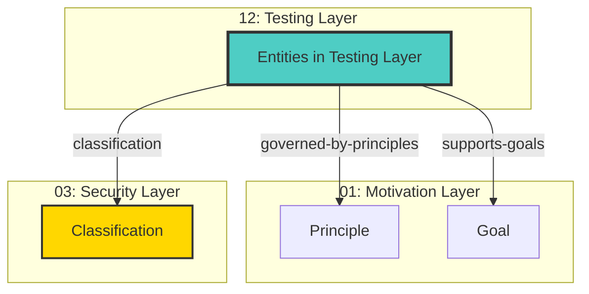

# Testing Layer - Cross-Layer Relationships

## Cross-Layer Relationships

**Purpose**: Define semantic links to entities in other layers, supporting traceability, governance, and architectural alignment.

### Cross-Layer Relationship Diagram



### Outgoing Relationships (This Layer → Other Layers)

Links from entities in this layer to entities in other layers.

#### To Motivation Layer (01)

Links to strategic goals, requirements, principles, and constraints.

| Predicate                | Source Element  | Target Element | Field Path                                                      | Description                            | Documented                                 |
| ------------------------ | --------------- | -------------- | --------------------------------------------------------------- | -------------------------------------- | ------------------------------------------ |
| `governed-by-principles` | BusinessService | Principle      | `motivation.governed-by-principles`, `x-governed-by-principles` | BusinessService governed by Principles | [✓](../../spec/schemas/link-registry.json) |
| `supports-goals`         | BusinessService | Goal           | `motivation.supports-goals`, `x-supports-goals`                 | BusinessService supports Goals         | [✓](../../spec/schemas/link-registry.json) |

**Example**:

```yaml
properties:
  motivation.governed-by-principles:
    type: array
    items:
      type: string
    description: BusinessService governed by Principles
    example: ["target-id-1", "target-id-2"]
```

#### To Security Layer (03)

Links to security models, resources, and controls.

| Predicate        | Source Element | Target Element | Field Path                | Description                             | Documented                                 |
| ---------------- | -------------- | -------------- | ------------------------- | --------------------------------------- | ------------------------------------------ |
| `classification` | Artifact       | Classification | `security.classification` | Links to Classification in target layer | [✓](../../spec/schemas/link-registry.json) |

**Example**:

```yaml
properties:
  security.classification:
    type: string
    description: Links to Classification in target layer
    example: "target-id-1"
```

### Incoming Relationships (Other Layers → This Layer)

Links from entities in other layers to entities in this layer.

_No incoming cross-layer relationships defined._
