# Testing Layer - Intra-Layer Relationships

## Overview

**Purpose**: Define semantic links between entities WITHIN this layer, capturing
structural composition, behavioral dependencies, and influence relationships.

**Layer ID**: `12-testing`
**Analysis Date**: Generated automatically
**Validation**: Uses MarkdownLayerParser for closed-loop validation

---

### Relationship Diagram

```mermaid
graph TB
  subgraph "Testing Layer"

    ContextVariation["ContextVariation"]
    CoverageExclusion["CoverageExclusion"]
    CoverageGap["CoverageGap"]
    CoverageRequirement["CoverageRequirement"]
    CoverageSummary["CoverageSummary"]
    EnvironmentFactor["EnvironmentFactor"]
    InputPartitionSelection["InputPartitionSelection"]
    InputSelection["InputSelection"]
    InputSpacePartition["InputSpacePartition"]
    OutcomeCategory["OutcomeCategory"]
    PartitionDependency["PartitionDependency"]
    PartitionValue["PartitionValue"]
    TargetCoverageSummary["TargetCoverageSummary"]
    TargetInputField["TargetInputField"]
    TestCaseSketch["TestCaseSketch"]
    TestCoverageModel["TestCoverageModel"]
    TestCoverageTarget["TestCoverageTarget"]

    TestCoverageModel -->|composes| TestCoverageTarget
    TestCoverageModel -->|composes| InputSpacePartition
    TestCoverageModel -->|composes| ContextVariation
    TestCoverageModel -->|composes| CoverageRequirement
    TestCoverageModel -->|composes| TestCaseSketch
    TestCoverageModel -->|composes| CoverageSummary
    TestCoverageTarget -->|composes| TargetInputField
    TestCoverageTarget -->|composes| OutcomeCategory
    TestCoverageTarget -->|aggregates| ContextVariation
    TestCoverageTarget -->|flows-to| CoverageRequirement
    TargetInputField -->|references| InputSpacePartition
    InputSpacePartition -->|composes| PartitionValue
    InputSpacePartition -->|composes| PartitionDependency
    InputSpacePartition -->|flows-to| InputPartitionSelection
    InputSpacePartition -->|serves| TestCoverageTarget
    PartitionValue -->|specializes| PartitionValue
    PartitionDependency -->|references| InputSpacePartition
    PartitionDependency -->|references| PartitionValue
    PartitionDependency -->|triggers| PartitionValue
    ContextVariation -->|composes| EnvironmentFactor
    ContextVariation -->|serves| TestCoverageTarget
    EnvironmentFactor -->|references| PartitionValue
    OutcomeCategory -->|specializes| OutcomeCategory
    CoverageRequirement -->|composes| InputPartitionSelection
    CoverageRequirement -->|composes| CoverageExclusion
    CoverageRequirement -->|aggregates| ContextVariation
    CoverageRequirement -->|aggregates| OutcomeCategory
    CoverageRequirement -->|references| TestCoverageTarget
    CoverageRequirement -->|flows-to| TestCaseSketch
    CoverageRequirement -->|depends-on| InputSpacePartition
    CoverageRequirement -->|accesses| InputPartitionSelection
    InputPartitionSelection -->|aggregates| PartitionValue
    InputPartitionSelection -->|references| InputSpacePartition
    CoverageExclusion -->|references| PartitionValue
    TestCaseSketch -->|composes| InputSelection
    TestCaseSketch -->|specializes| TestCaseSketch
    TestCaseSketch -->|references| CoverageRequirement
    TestCaseSketch -->|depends-on| ContextVariation
    TestCaseSketch -->|depends-on| OutcomeCategory
    TestCaseSketch -->|validates| CoverageRequirement
    TestCaseSketch -->|accesses| InputSelection
    InputSelection -->|references| InputSpacePartition
    InputSelection -->|references| PartitionValue
    InputSelection -->|depends-on| PartitionDependency
    CoverageSummary -->|composes| TargetCoverageSummary
    CoverageSummary -->|composes| CoverageGap
    TargetCoverageSummary -->|references| TestCoverageTarget
    TargetCoverageSummary -->|validates| TestCoverageTarget
    CoverageGap -->|references| CoverageRequirement
    CoverageGap -->|triggers| CoverageRequirement
  end

  %% Styling
  classDef default fill:#E3F2FD,stroke:#1976D2,stroke-width:2px
```

## Layer Summary

### Entity Coverage (Target: 2+ relationships per entity)

- **Entities Meeting Target**: 17/17
- **Entity Coverage**: 100.0%

### Coverage Matrix

| Entity                  | Outgoing | Incoming | Total   | Meets Target | Status     |
| ----------------------- | -------- | -------- | ------- | ------------ | ---------- |
| ContextVariation        | 2        | 4        | 6       | ✓            | Complete   |
| CoverageExclusion       | 1        | 1        | 2       | ✓            | Complete   |
| CoverageGap             | 2        | 1        | 3       | ✓            | Complete   |
| CoverageRequirement     | 8        | 6        | 14      | ✓            | Complete   |
| CoverageSummary         | 2        | 1        | 3       | ✓            | Complete   |
| EnvironmentFactor       | 1        | 1        | 2       | ✓            | Complete   |
| InputPartitionSelection | 2        | 3        | 5       | ✓            | Complete   |
| InputSelection          | 3        | 2        | 5       | ✓            | Complete   |
| InputSpacePartition     | 4        | 6        | 10      | ✓            | Complete   |
| OutcomeCategory         | 1        | 4        | 5       | ✓            | Complete   |
| PartitionDependency     | 3        | 2        | 5       | ✓            | Complete   |
| PartitionValue          | 1        | 8        | 9       | ✓            | Complete   |
| TargetCoverageSummary   | 2        | 1        | 3       | ✓            | Complete   |
| TargetInputField        | 1        | 1        | 2       | ✓            | Complete   |
| TestCaseSketch          | 7        | 3        | 10      | ✓            | Complete   |
| TestCoverageModel       | 6        | 0        | 6       | ✓            | Complete   |
| TestCoverageTarget      | 4        | 6        | 10      | ✓            | Complete   |
| **TOTAL**               | **-**    | **-**    | **100** | **17/17**    | **100.0%** |

### Relationship Statistics

- **Total Unique Relationships**: 50
- **Total Connections (Entity Perspective)**: 100
- **Average Connections per Entity**: 5.9
- **Entity Coverage Target**: 2+ relationships

## Entity: ContextVariation

**Definition**: Different context in which functionality can be invoked

### Outgoing Relationships (ContextVariation → Other Entities)

| Relationship Type | Target Entity      | Predicate  | Status           | Source                                                     | In Catalog | Documented                                               |
| ----------------- | ------------------ | ---------- | ---------------- | ---------------------------------------------------------- | ---------- | -------------------------------------------------------- |
| composition       | EnvironmentFactor  | `composes` | Documented + XML | [Doc](../../spec/layers/12-testing-layer.md#relationships) | ✓          | [✓](../../spec/layers/12-testing-layer.md#relationships) |
| serves            | TestCoverageTarget | `serves`   | Documented + XML | [Doc](../../spec/layers/12-testing-layer.md#relationships) | ✓          | [✓](../../spec/layers/12-testing-layer.md#relationships) |

### Incoming Relationships (Other Entities → ContextVariation)

| Relationship Type | Source Entity       | Predicate    | Status           | Source                                                     | In Catalog | Documented                                               |
| ----------------- | ------------------- | ------------ | ---------------- | ---------------------------------------------------------- | ---------- | -------------------------------------------------------- |
| aggregation       | CoverageRequirement | `aggregates` | Documented + XML | [Doc](../../spec/layers/12-testing-layer.md#relationships) | ✓          | [✓](../../spec/layers/12-testing-layer.md#relationships) |
| depends-on        | TestCaseSketch      | `depends-on` | Documented + XML | [Doc](../../spec/layers/12-testing-layer.md#relationships) | ✓          | [✓](../../spec/layers/12-testing-layer.md#relationships) |
| composition       | TestCoverageModel   | `composes`   | Documented + XML | [Doc](../../spec/layers/12-testing-layer.md#relationships) | ✓          | [✓](../../spec/layers/12-testing-layer.md#relationships) |
| aggregation       | TestCoverageTarget  | `aggregates` | Documented + XML | [Doc](../../spec/layers/12-testing-layer.md#relationships) | ✓          | [✓](../../spec/layers/12-testing-layer.md#relationships) |

### Relationship Summary

- **Total Relationships**: 6
- **Outgoing**: 2
- **Incoming**: 4
- **Documented**: 6/6
- **With XML Examples**: 6/6
- **In Catalog**: 6/6

---

## Entity: CoverageExclusion

**Definition**: Explicit exclusion from coverage with justification

### Outgoing Relationships (CoverageExclusion → Other Entities)

| Relationship Type | Target Entity  | Predicate    | Status           | Source                                                     | In Catalog | Documented                                               |
| ----------------- | -------------- | ------------ | ---------------- | ---------------------------------------------------------- | ---------- | -------------------------------------------------------- |
| reference         | PartitionValue | `references` | Documented + XML | [Doc](../../spec/layers/12-testing-layer.md#relationships) | ✓          | [✓](../../spec/layers/12-testing-layer.md#relationships) |

### Incoming Relationships (Other Entities → CoverageExclusion)

| Relationship Type | Source Entity       | Predicate  | Status           | Source                                                     | In Catalog | Documented                                               |
| ----------------- | ------------------- | ---------- | ---------------- | ---------------------------------------------------------- | ---------- | -------------------------------------------------------- |
| composition       | CoverageRequirement | `composes` | Documented + XML | [Doc](../../spec/layers/12-testing-layer.md#relationships) | ✓          | [✓](../../spec/layers/12-testing-layer.md#relationships) |

### Relationship Summary

- **Total Relationships**: 2
- **Outgoing**: 1
- **Incoming**: 1
- **Documented**: 2/2
- **With XML Examples**: 2/2
- **In Catalog**: 2/2

---

## Entity: CoverageGap

**Definition**: Identified gap in test coverage requiring attention

### Outgoing Relationships (CoverageGap → Other Entities)

| Relationship Type | Target Entity       | Predicate    | Status           | Source                                                     | In Catalog | Documented                                               |
| ----------------- | ------------------- | ------------ | ---------------- | ---------------------------------------------------------- | ---------- | -------------------------------------------------------- |
| reference         | CoverageRequirement | `references` | Documented + XML | [Doc](../../spec/layers/12-testing-layer.md#relationships) | ✓          | [✓](../../spec/layers/12-testing-layer.md#relationships) |
| triggering        | CoverageRequirement | `triggers`   | Documented + XML | [Doc](../../spec/layers/12-testing-layer.md#relationships) | ✓          | [✓](../../spec/layers/12-testing-layer.md#relationships) |

### Incoming Relationships (Other Entities → CoverageGap)

| Relationship Type | Source Entity   | Predicate  | Status           | Source                                                     | In Catalog | Documented                                               |
| ----------------- | --------------- | ---------- | ---------------- | ---------------------------------------------------------- | ---------- | -------------------------------------------------------- |
| composition       | CoverageSummary | `composes` | Documented + XML | [Doc](../../spec/layers/12-testing-layer.md#relationships) | ✓          | [✓](../../spec/layers/12-testing-layer.md#relationships) |

### Relationship Summary

- **Total Relationships**: 3
- **Outgoing**: 2
- **Incoming**: 1
- **Documented**: 3/3
- **With XML Examples**: 3/3
- **In Catalog**: 3/3

---

## Entity: CoverageRequirement

**Definition**: Requirement for test coverage of a target

### Outgoing Relationships (CoverageRequirement → Other Entities)

| Relationship Type | Target Entity           | Predicate    | Status           | Source                                                     | In Catalog | Documented                                               |
| ----------------- | ----------------------- | ------------ | ---------------- | ---------------------------------------------------------- | ---------- | -------------------------------------------------------- |
| aggregation       | ContextVariation        | `aggregates` | Documented + XML | [Doc](../../spec/layers/12-testing-layer.md#relationships) | ✓          | [✓](../../spec/layers/12-testing-layer.md#relationships) |
| composition       | CoverageExclusion       | `composes`   | Documented + XML | [Doc](../../spec/layers/12-testing-layer.md#relationships) | ✓          | [✓](../../spec/layers/12-testing-layer.md#relationships) |
| access            | InputPartitionSelection | `accesses`   | Documented + XML | [Doc](../../spec/layers/12-testing-layer.md#relationships) | ✓          | [✓](../../spec/layers/12-testing-layer.md#relationships) |
| composition       | InputPartitionSelection | `composes`   | Documented + XML | [Doc](../../spec/layers/12-testing-layer.md#relationships) | ✓          | [✓](../../spec/layers/12-testing-layer.md#relationships) |
| depends-on        | InputSpacePartition     | `depends-on` | Documented + XML | [Doc](../../spec/layers/12-testing-layer.md#relationships) | ✓          | [✓](../../spec/layers/12-testing-layer.md#relationships) |
| aggregation       | OutcomeCategory         | `aggregates` | Documented + XML | [Doc](../../spec/layers/12-testing-layer.md#relationships) | ✓          | [✓](../../spec/layers/12-testing-layer.md#relationships) |
| flow              | TestCaseSketch          | `flows-to`   | Documented + XML | [Doc](../../spec/layers/12-testing-layer.md#relationships) | ✓          | [✓](../../spec/layers/12-testing-layer.md#relationships) |
| reference         | TestCoverageTarget      | `references` | Documented + XML | [Doc](../../spec/layers/12-testing-layer.md#relationships) | ✓          | [✓](../../spec/layers/12-testing-layer.md#relationships) |

### Incoming Relationships (Other Entities → CoverageRequirement)

| Relationship Type | Source Entity      | Predicate    | Status           | Source                                                     | In Catalog | Documented                                               |
| ----------------- | ------------------ | ------------ | ---------------- | ---------------------------------------------------------- | ---------- | -------------------------------------------------------- |
| reference         | CoverageGap        | `references` | Documented + XML | [Doc](../../spec/layers/12-testing-layer.md#relationships) | ✓          | [✓](../../spec/layers/12-testing-layer.md#relationships) |
| triggering        | CoverageGap        | `triggers`   | Documented + XML | [Doc](../../spec/layers/12-testing-layer.md#relationships) | ✓          | [✓](../../spec/layers/12-testing-layer.md#relationships) |
| reference         | TestCaseSketch     | `references` | Documented + XML | [Doc](../../spec/layers/12-testing-layer.md#relationships) | ✓          | [✓](../../spec/layers/12-testing-layer.md#relationships) |
| validates         | TestCaseSketch     | `validates`  | Documented + XML | [Doc](../../spec/layers/12-testing-layer.md#relationships) | ✓          | [✓](../../spec/layers/12-testing-layer.md#relationships) |
| composition       | TestCoverageModel  | `composes`   | Documented + XML | [Doc](../../spec/layers/12-testing-layer.md#relationships) | ✓          | [✓](../../spec/layers/12-testing-layer.md#relationships) |
| flow              | TestCoverageTarget | `flows-to`   | Documented + XML | [Doc](../../spec/layers/12-testing-layer.md#relationships) | ✓          | [✓](../../spec/layers/12-testing-layer.md#relationships) |

### Relationship Summary

- **Total Relationships**: 14
- **Outgoing**: 8
- **Incoming**: 6
- **Documented**: 14/14
- **With XML Examples**: 14/14
- **In Catalog**: 14/14

---

## Entity: CoverageSummary

**Definition**: Summary of coverage status (can be computed or declared)

### Outgoing Relationships (CoverageSummary → Other Entities)

| Relationship Type | Target Entity         | Predicate  | Status           | Source                                                     | In Catalog | Documented                                               |
| ----------------- | --------------------- | ---------- | ---------------- | ---------------------------------------------------------- | ---------- | -------------------------------------------------------- |
| composition       | CoverageGap           | `composes` | Documented + XML | [Doc](../../spec/layers/12-testing-layer.md#relationships) | ✓          | [✓](../../spec/layers/12-testing-layer.md#relationships) |
| composition       | TargetCoverageSummary | `composes` | Documented + XML | [Doc](../../spec/layers/12-testing-layer.md#relationships) | ✓          | [✓](../../spec/layers/12-testing-layer.md#relationships) |

### Incoming Relationships (Other Entities → CoverageSummary)

| Relationship Type | Source Entity     | Predicate  | Status           | Source                                                     | In Catalog | Documented                                               |
| ----------------- | ----------------- | ---------- | ---------------- | ---------------------------------------------------------- | ---------- | -------------------------------------------------------- |
| composition       | TestCoverageModel | `composes` | Documented + XML | [Doc](../../spec/layers/12-testing-layer.md#relationships) | ✓          | [✓](../../spec/layers/12-testing-layer.md#relationships) |

### Relationship Summary

- **Total Relationships**: 3
- **Outgoing**: 2
- **Incoming**: 1
- **Documented**: 3/3
- **With XML Examples**: 3/3
- **In Catalog**: 3/3

---

## Entity: EnvironmentFactor

**Definition**: Environmental condition that may affect behavior

### Outgoing Relationships (EnvironmentFactor → Other Entities)

| Relationship Type | Target Entity  | Predicate    | Status           | Source                                                     | In Catalog | Documented                                               |
| ----------------- | -------------- | ------------ | ---------------- | ---------------------------------------------------------- | ---------- | -------------------------------------------------------- |
| reference         | PartitionValue | `references` | Documented + XML | [Doc](../../spec/layers/12-testing-layer.md#relationships) | ✓          | [✓](../../spec/layers/12-testing-layer.md#relationships) |

### Incoming Relationships (Other Entities → EnvironmentFactor)

| Relationship Type | Source Entity    | Predicate  | Status           | Source                                                     | In Catalog | Documented                                               |
| ----------------- | ---------------- | ---------- | ---------------- | ---------------------------------------------------------- | ---------- | -------------------------------------------------------- |
| composition       | ContextVariation | `composes` | Documented + XML | [Doc](../../spec/layers/12-testing-layer.md#relationships) | ✓          | [✓](../../spec/layers/12-testing-layer.md#relationships) |

### Relationship Summary

- **Total Relationships**: 2
- **Outgoing**: 1
- **Incoming**: 1
- **Documented**: 2/2
- **With XML Examples**: 2/2
- **In Catalog**: 2/2

---

## Entity: InputPartitionSelection

**Definition**: Selection of partition values to include in coverage

### Outgoing Relationships (InputPartitionSelection → Other Entities)

| Relationship Type | Target Entity       | Predicate    | Status           | Source                                                     | In Catalog | Documented                                               |
| ----------------- | ------------------- | ------------ | ---------------- | ---------------------------------------------------------- | ---------- | -------------------------------------------------------- |
| reference         | InputSpacePartition | `references` | Documented + XML | [Doc](../../spec/layers/12-testing-layer.md#relationships) | ✓          | [✓](../../spec/layers/12-testing-layer.md#relationships) |
| aggregation       | PartitionValue      | `aggregates` | Documented + XML | [Doc](../../spec/layers/12-testing-layer.md#relationships) | ✓          | [✓](../../spec/layers/12-testing-layer.md#relationships) |

### Incoming Relationships (Other Entities → InputPartitionSelection)

| Relationship Type | Source Entity       | Predicate  | Status           | Source                                                     | In Catalog | Documented                                               |
| ----------------- | ------------------- | ---------- | ---------------- | ---------------------------------------------------------- | ---------- | -------------------------------------------------------- |
| access            | CoverageRequirement | `accesses` | Documented + XML | [Doc](../../spec/layers/12-testing-layer.md#relationships) | ✓          | [✓](../../spec/layers/12-testing-layer.md#relationships) |
| composition       | CoverageRequirement | `composes` | Documented + XML | [Doc](../../spec/layers/12-testing-layer.md#relationships) | ✓          | [✓](../../spec/layers/12-testing-layer.md#relationships) |
| flow              | InputSpacePartition | `flows-to` | Documented + XML | [Doc](../../spec/layers/12-testing-layer.md#relationships) | ✓          | [✓](../../spec/layers/12-testing-layer.md#relationships) |

### Relationship Summary

- **Total Relationships**: 5
- **Outgoing**: 2
- **Incoming**: 3
- **Documented**: 5/5
- **With XML Examples**: 5/5
- **In Catalog**: 5/5

---

## Entity: InputSelection

**Definition**: Specific partition value selected for a test case

### Outgoing Relationships (InputSelection → Other Entities)

| Relationship Type | Target Entity       | Predicate    | Status           | Source                                                     | In Catalog | Documented                                               |
| ----------------- | ------------------- | ------------ | ---------------- | ---------------------------------------------------------- | ---------- | -------------------------------------------------------- |
| reference         | InputSpacePartition | `references` | Documented + XML | [Doc](../../spec/layers/12-testing-layer.md#relationships) | ✓          | [✓](../../spec/layers/12-testing-layer.md#relationships) |
| depends-on        | PartitionDependency | `depends-on` | Documented + XML | [Doc](../../spec/layers/12-testing-layer.md#relationships) | ✓          | [✓](../../spec/layers/12-testing-layer.md#relationships) |
| reference         | PartitionValue      | `references` | Documented + XML | [Doc](../../spec/layers/12-testing-layer.md#relationships) | ✓          | [✓](../../spec/layers/12-testing-layer.md#relationships) |

### Incoming Relationships (Other Entities → InputSelection)

| Relationship Type | Source Entity  | Predicate  | Status           | Source                                                     | In Catalog | Documented                                               |
| ----------------- | -------------- | ---------- | ---------------- | ---------------------------------------------------------- | ---------- | -------------------------------------------------------- |
| access            | TestCaseSketch | `accesses` | Documented + XML | [Doc](../../spec/layers/12-testing-layer.md#relationships) | ✓          | [✓](../../spec/layers/12-testing-layer.md#relationships) |
| composition       | TestCaseSketch | `composes` | Documented + XML | [Doc](../../spec/layers/12-testing-layer.md#relationships) | ✓          | [✓](../../spec/layers/12-testing-layer.md#relationships) |

### Relationship Summary

- **Total Relationships**: 5
- **Outgoing**: 3
- **Incoming**: 2
- **Documented**: 5/5
- **With XML Examples**: 5/5
- **In Catalog**: 5/5

---

## Entity: InputSpacePartition

**Definition**: Partitioning of an input dimension into testable categories

### Outgoing Relationships (InputSpacePartition → Other Entities)

| Relationship Type | Target Entity           | Predicate  | Status           | Source                                                     | In Catalog | Documented                                               |
| ----------------- | ----------------------- | ---------- | ---------------- | ---------------------------------------------------------- | ---------- | -------------------------------------------------------- |
| flow              | InputPartitionSelection | `flows-to` | Documented + XML | [Doc](../../spec/layers/12-testing-layer.md#relationships) | ✓          | [✓](../../spec/layers/12-testing-layer.md#relationships) |
| composition       | PartitionDependency     | `composes` | Documented + XML | [Doc](../../spec/layers/12-testing-layer.md#relationships) | ✓          | [✓](../../spec/layers/12-testing-layer.md#relationships) |
| composition       | PartitionValue          | `composes` | Documented + XML | [Doc](../../spec/layers/12-testing-layer.md#relationships) | ✓          | [✓](../../spec/layers/12-testing-layer.md#relationships) |
| serves            | TestCoverageTarget      | `serves`   | Documented + XML | [Doc](../../spec/layers/12-testing-layer.md#relationships) | ✓          | [✓](../../spec/layers/12-testing-layer.md#relationships) |

### Incoming Relationships (Other Entities → InputSpacePartition)

| Relationship Type | Source Entity           | Predicate    | Status           | Source                                                     | In Catalog | Documented                                               |
| ----------------- | ----------------------- | ------------ | ---------------- | ---------------------------------------------------------- | ---------- | -------------------------------------------------------- |
| depends-on        | CoverageRequirement     | `depends-on` | Documented + XML | [Doc](../../spec/layers/12-testing-layer.md#relationships) | ✓          | [✓](../../spec/layers/12-testing-layer.md#relationships) |
| reference         | InputPartitionSelection | `references` | Documented + XML | [Doc](../../spec/layers/12-testing-layer.md#relationships) | ✓          | [✓](../../spec/layers/12-testing-layer.md#relationships) |
| reference         | InputSelection          | `references` | Documented + XML | [Doc](../../spec/layers/12-testing-layer.md#relationships) | ✓          | [✓](../../spec/layers/12-testing-layer.md#relationships) |
| reference         | PartitionDependency     | `references` | Documented + XML | [Doc](../../spec/layers/12-testing-layer.md#relationships) | ✓          | [✓](../../spec/layers/12-testing-layer.md#relationships) |
| reference         | TargetInputField        | `references` | Documented + XML | [Doc](../../spec/layers/12-testing-layer.md#relationships) | ✓          | [✓](../../spec/layers/12-testing-layer.md#relationships) |
| composition       | TestCoverageModel       | `composes`   | Documented + XML | [Doc](../../spec/layers/12-testing-layer.md#relationships) | ✓          | [✓](../../spec/layers/12-testing-layer.md#relationships) |

### Relationship Summary

- **Total Relationships**: 10
- **Outgoing**: 4
- **Incoming**: 6
- **Documented**: 10/10
- **With XML Examples**: 10/10
- **In Catalog**: 10/10

---

## Entity: OutcomeCategory

**Definition**: Category of expected outcomes (not specific assertions)

### Outgoing Relationships (OutcomeCategory → Other Entities)

| Relationship Type | Target Entity   | Predicate     | Status           | Source                                                     | In Catalog | Documented                                               |
| ----------------- | --------------- | ------------- | ---------------- | ---------------------------------------------------------- | ---------- | -------------------------------------------------------- |
| specialization    | OutcomeCategory | `specializes` | Documented + XML | [Doc](../../spec/layers/12-testing-layer.md#relationships) | ✓          | [✓](../../spec/layers/12-testing-layer.md#relationships) |

### Incoming Relationships (Other Entities → OutcomeCategory)

| Relationship Type | Source Entity       | Predicate     | Status           | Source                                                     | In Catalog | Documented                                               |
| ----------------- | ------------------- | ------------- | ---------------- | ---------------------------------------------------------- | ---------- | -------------------------------------------------------- |
| aggregation       | CoverageRequirement | `aggregates`  | Documented + XML | [Doc](../../spec/layers/12-testing-layer.md#relationships) | ✓          | [✓](../../spec/layers/12-testing-layer.md#relationships) |
| specialization    | OutcomeCategory     | `specializes` | Documented + XML | [Doc](../../spec/layers/12-testing-layer.md#relationships) | ✓          | [✓](../../spec/layers/12-testing-layer.md#relationships) |
| depends-on        | TestCaseSketch      | `depends-on`  | Documented + XML | [Doc](../../spec/layers/12-testing-layer.md#relationships) | ✓          | [✓](../../spec/layers/12-testing-layer.md#relationships) |
| composition       | TestCoverageTarget  | `composes`    | Documented + XML | [Doc](../../spec/layers/12-testing-layer.md#relationships) | ✓          | [✓](../../spec/layers/12-testing-layer.md#relationships) |

### Relationship Summary

- **Total Relationships**: 5
- **Outgoing**: 1
- **Incoming**: 4
- **Documented**: 5/5
- **With XML Examples**: 5/5
- **In Catalog**: 5/5

---

## Entity: PartitionDependency

**Definition**: Constraint between partition values across fields

### Outgoing Relationships (PartitionDependency → Other Entities)

| Relationship Type | Target Entity       | Predicate    | Status           | Source                                                     | In Catalog | Documented                                               |
| ----------------- | ------------------- | ------------ | ---------------- | ---------------------------------------------------------- | ---------- | -------------------------------------------------------- |
| reference         | InputSpacePartition | `references` | Documented + XML | [Doc](../../spec/layers/12-testing-layer.md#relationships) | ✓          | [✓](../../spec/layers/12-testing-layer.md#relationships) |
| reference         | PartitionValue      | `references` | Documented + XML | [Doc](../../spec/layers/12-testing-layer.md#relationships) | ✓          | [✓](../../spec/layers/12-testing-layer.md#relationships) |
| triggering        | PartitionValue      | `triggers`   | Documented + XML | [Doc](../../spec/layers/12-testing-layer.md#relationships) | ✓          | [✓](../../spec/layers/12-testing-layer.md#relationships) |

### Incoming Relationships (Other Entities → PartitionDependency)

| Relationship Type | Source Entity       | Predicate    | Status           | Source                                                     | In Catalog | Documented                                               |
| ----------------- | ------------------- | ------------ | ---------------- | ---------------------------------------------------------- | ---------- | -------------------------------------------------------- |
| depends-on        | InputSelection      | `depends-on` | Documented + XML | [Doc](../../spec/layers/12-testing-layer.md#relationships) | ✓          | [✓](../../spec/layers/12-testing-layer.md#relationships) |
| composition       | InputSpacePartition | `composes`   | Documented + XML | [Doc](../../spec/layers/12-testing-layer.md#relationships) | ✓          | [✓](../../spec/layers/12-testing-layer.md#relationships) |

### Relationship Summary

- **Total Relationships**: 5
- **Outgoing**: 3
- **Incoming**: 2
- **Documented**: 5/5
- **With XML Examples**: 5/5
- **In Catalog**: 5/5

---

## Entity: PartitionValue

**Definition**: A specific partition within the input space

### Outgoing Relationships (PartitionValue → Other Entities)

| Relationship Type | Target Entity  | Predicate     | Status           | Source                                                     | In Catalog | Documented                                               |
| ----------------- | -------------- | ------------- | ---------------- | ---------------------------------------------------------- | ---------- | -------------------------------------------------------- |
| specialization    | PartitionValue | `specializes` | Documented + XML | [Doc](../../spec/layers/12-testing-layer.md#relationships) | ✓          | [✓](../../spec/layers/12-testing-layer.md#relationships) |

### Incoming Relationships (Other Entities → PartitionValue)

| Relationship Type | Source Entity           | Predicate     | Status           | Source                                                     | In Catalog | Documented                                               |
| ----------------- | ----------------------- | ------------- | ---------------- | ---------------------------------------------------------- | ---------- | -------------------------------------------------------- |
| reference         | CoverageExclusion       | `references`  | Documented + XML | [Doc](../../spec/layers/12-testing-layer.md#relationships) | ✓          | [✓](../../spec/layers/12-testing-layer.md#relationships) |
| reference         | EnvironmentFactor       | `references`  | Documented + XML | [Doc](../../spec/layers/12-testing-layer.md#relationships) | ✓          | [✓](../../spec/layers/12-testing-layer.md#relationships) |
| aggregation       | InputPartitionSelection | `aggregates`  | Documented + XML | [Doc](../../spec/layers/12-testing-layer.md#relationships) | ✓          | [✓](../../spec/layers/12-testing-layer.md#relationships) |
| reference         | InputSelection          | `references`  | Documented + XML | [Doc](../../spec/layers/12-testing-layer.md#relationships) | ✓          | [✓](../../spec/layers/12-testing-layer.md#relationships) |
| composition       | InputSpacePartition     | `composes`    | Documented + XML | [Doc](../../spec/layers/12-testing-layer.md#relationships) | ✓          | [✓](../../spec/layers/12-testing-layer.md#relationships) |
| reference         | PartitionDependency     | `references`  | Documented + XML | [Doc](../../spec/layers/12-testing-layer.md#relationships) | ✓          | [✓](../../spec/layers/12-testing-layer.md#relationships) |
| triggering        | PartitionDependency     | `triggers`    | Documented + XML | [Doc](../../spec/layers/12-testing-layer.md#relationships) | ✓          | [✓](../../spec/layers/12-testing-layer.md#relationships) |
| specialization    | PartitionValue          | `specializes` | Documented + XML | [Doc](../../spec/layers/12-testing-layer.md#relationships) | ✓          | [✓](../../spec/layers/12-testing-layer.md#relationships) |

### Relationship Summary

- **Total Relationships**: 9
- **Outgoing**: 1
- **Incoming**: 8
- **Documented**: 9/9
- **With XML Examples**: 9/9
- **In Catalog**: 9/9

---

## Entity: TargetCoverageSummary

**Definition**: Coverage metrics summary for a single test coverage target

### Outgoing Relationships (TargetCoverageSummary → Other Entities)

| Relationship Type | Target Entity      | Predicate    | Status           | Source                                                     | In Catalog | Documented                                               |
| ----------------- | ------------------ | ------------ | ---------------- | ---------------------------------------------------------- | ---------- | -------------------------------------------------------- |
| reference         | TestCoverageTarget | `references` | Documented + XML | [Doc](../../spec/layers/12-testing-layer.md#relationships) | ✓          | [✓](../../spec/layers/12-testing-layer.md#relationships) |
| validates         | TestCoverageTarget | `validates`  | Documented + XML | [Doc](../../spec/layers/12-testing-layer.md#relationships) | ✓          | [✓](../../spec/layers/12-testing-layer.md#relationships) |

### Incoming Relationships (Other Entities → TargetCoverageSummary)

| Relationship Type | Source Entity   | Predicate  | Status           | Source                                                     | In Catalog | Documented                                               |
| ----------------- | --------------- | ---------- | ---------------- | ---------------------------------------------------------- | ---------- | -------------------------------------------------------- |
| composition       | CoverageSummary | `composes` | Documented + XML | [Doc](../../spec/layers/12-testing-layer.md#relationships) | ✓          | [✓](../../spec/layers/12-testing-layer.md#relationships) |

### Relationship Summary

- **Total Relationships**: 3
- **Outgoing**: 2
- **Incoming**: 1
- **Documented**: 3/3
- **With XML Examples**: 3/3
- **In Catalog**: 3/3

---

## Entity: TargetInputField

**Definition**: Input field associated with a coverage target

### Outgoing Relationships (TargetInputField → Other Entities)

| Relationship Type | Target Entity       | Predicate    | Status           | Source                                                     | In Catalog | Documented                                               |
| ----------------- | ------------------- | ------------ | ---------------- | ---------------------------------------------------------- | ---------- | -------------------------------------------------------- |
| reference         | InputSpacePartition | `references` | Documented + XML | [Doc](../../spec/layers/12-testing-layer.md#relationships) | ✓          | [✓](../../spec/layers/12-testing-layer.md#relationships) |

### Incoming Relationships (Other Entities → TargetInputField)

| Relationship Type | Source Entity      | Predicate  | Status           | Source                                                     | In Catalog | Documented                                               |
| ----------------- | ------------------ | ---------- | ---------------- | ---------------------------------------------------------- | ---------- | -------------------------------------------------------- |
| composition       | TestCoverageTarget | `composes` | Documented + XML | [Doc](../../spec/layers/12-testing-layer.md#relationships) | ✓          | [✓](../../spec/layers/12-testing-layer.md#relationships) |

### Relationship Summary

- **Total Relationships**: 2
- **Outgoing**: 1
- **Incoming**: 1
- **Documented**: 2/2
- **With XML Examples**: 2/2
- **In Catalog**: 2/2

---

## Entity: TestCaseSketch

**Definition**: Abstract test case selecting specific partition values

### Outgoing Relationships (TestCaseSketch → Other Entities)

| Relationship Type | Target Entity       | Predicate     | Status           | Source                                                     | In Catalog | Documented                                               |
| ----------------- | ------------------- | ------------- | ---------------- | ---------------------------------------------------------- | ---------- | -------------------------------------------------------- |
| depends-on        | ContextVariation    | `depends-on`  | Documented + XML | [Doc](../../spec/layers/12-testing-layer.md#relationships) | ✓          | [✓](../../spec/layers/12-testing-layer.md#relationships) |
| reference         | CoverageRequirement | `references`  | Documented + XML | [Doc](../../spec/layers/12-testing-layer.md#relationships) | ✓          | [✓](../../spec/layers/12-testing-layer.md#relationships) |
| validates         | CoverageRequirement | `validates`   | Documented + XML | [Doc](../../spec/layers/12-testing-layer.md#relationships) | ✓          | [✓](../../spec/layers/12-testing-layer.md#relationships) |
| access            | InputSelection      | `accesses`    | Documented + XML | [Doc](../../spec/layers/12-testing-layer.md#relationships) | ✓          | [✓](../../spec/layers/12-testing-layer.md#relationships) |
| composition       | InputSelection      | `composes`    | Documented + XML | [Doc](../../spec/layers/12-testing-layer.md#relationships) | ✓          | [✓](../../spec/layers/12-testing-layer.md#relationships) |
| depends-on        | OutcomeCategory     | `depends-on`  | Documented + XML | [Doc](../../spec/layers/12-testing-layer.md#relationships) | ✓          | [✓](../../spec/layers/12-testing-layer.md#relationships) |
| specialization    | TestCaseSketch      | `specializes` | Documented + XML | [Doc](../../spec/layers/12-testing-layer.md#relationships) | ✓          | [✓](../../spec/layers/12-testing-layer.md#relationships) |

### Incoming Relationships (Other Entities → TestCaseSketch)

| Relationship Type | Source Entity       | Predicate     | Status           | Source                                                     | In Catalog | Documented                                               |
| ----------------- | ------------------- | ------------- | ---------------- | ---------------------------------------------------------- | ---------- | -------------------------------------------------------- |
| flow              | CoverageRequirement | `flows-to`    | Documented + XML | [Doc](../../spec/layers/12-testing-layer.md#relationships) | ✓          | [✓](../../spec/layers/12-testing-layer.md#relationships) |
| specialization    | TestCaseSketch      | `specializes` | Documented + XML | [Doc](../../spec/layers/12-testing-layer.md#relationships) | ✓          | [✓](../../spec/layers/12-testing-layer.md#relationships) |
| composition       | TestCoverageModel   | `composes`    | Documented + XML | [Doc](../../spec/layers/12-testing-layer.md#relationships) | ✓          | [✓](../../spec/layers/12-testing-layer.md#relationships) |

### Relationship Summary

- **Total Relationships**: 10
- **Outgoing**: 7
- **Incoming**: 3
- **Documented**: 10/10
- **With XML Examples**: 10/10
- **In Catalog**: 10/10

---

## Entity: TestCoverageModel

**Definition**: Complete test coverage model for application

### Outgoing Relationships (TestCoverageModel → Other Entities)

| Relationship Type | Target Entity       | Predicate  | Status           | Source                                                     | In Catalog | Documented                                               |
| ----------------- | ------------------- | ---------- | ---------------- | ---------------------------------------------------------- | ---------- | -------------------------------------------------------- |
| composition       | ContextVariation    | `composes` | Documented + XML | [Doc](../../spec/layers/12-testing-layer.md#relationships) | ✓          | [✓](../../spec/layers/12-testing-layer.md#relationships) |
| composition       | CoverageRequirement | `composes` | Documented + XML | [Doc](../../spec/layers/12-testing-layer.md#relationships) | ✓          | [✓](../../spec/layers/12-testing-layer.md#relationships) |
| composition       | CoverageSummary     | `composes` | Documented + XML | [Doc](../../spec/layers/12-testing-layer.md#relationships) | ✓          | [✓](../../spec/layers/12-testing-layer.md#relationships) |
| composition       | InputSpacePartition | `composes` | Documented + XML | [Doc](../../spec/layers/12-testing-layer.md#relationships) | ✓          | [✓](../../spec/layers/12-testing-layer.md#relationships) |
| composition       | TestCaseSketch      | `composes` | Documented + XML | [Doc](../../spec/layers/12-testing-layer.md#relationships) | ✓          | [✓](../../spec/layers/12-testing-layer.md#relationships) |
| composition       | TestCoverageTarget  | `composes` | Documented + XML | [Doc](../../spec/layers/12-testing-layer.md#relationships) | ✓          | [✓](../../spec/layers/12-testing-layer.md#relationships) |

### Incoming Relationships (Other Entities → TestCoverageModel)

_No incoming intra-layer relationships documented._

### Relationship Summary

- **Total Relationships**: 6
- **Outgoing**: 6
- **Incoming**: 0
- **Documented**: 6/6
- **With XML Examples**: 6/6
- **In Catalog**: 6/6

---

## Entity: TestCoverageTarget

**Definition**: An artifact or functionality that requires test coverage

### Outgoing Relationships (TestCoverageTarget → Other Entities)

| Relationship Type | Target Entity       | Predicate    | Status           | Source                                                     | In Catalog | Documented                                               |
| ----------------- | ------------------- | ------------ | ---------------- | ---------------------------------------------------------- | ---------- | -------------------------------------------------------- |
| aggregation       | ContextVariation    | `aggregates` | Documented + XML | [Doc](../../spec/layers/12-testing-layer.md#relationships) | ✓          | [✓](../../spec/layers/12-testing-layer.md#relationships) |
| flow              | CoverageRequirement | `flows-to`   | Documented + XML | [Doc](../../spec/layers/12-testing-layer.md#relationships) | ✓          | [✓](../../spec/layers/12-testing-layer.md#relationships) |
| composition       | OutcomeCategory     | `composes`   | Documented + XML | [Doc](../../spec/layers/12-testing-layer.md#relationships) | ✓          | [✓](../../spec/layers/12-testing-layer.md#relationships) |
| composition       | TargetInputField    | `composes`   | Documented + XML | [Doc](../../spec/layers/12-testing-layer.md#relationships) | ✓          | [✓](../../spec/layers/12-testing-layer.md#relationships) |

### Incoming Relationships (Other Entities → TestCoverageTarget)

| Relationship Type | Source Entity         | Predicate    | Status           | Source                                                     | In Catalog | Documented                                               |
| ----------------- | --------------------- | ------------ | ---------------- | ---------------------------------------------------------- | ---------- | -------------------------------------------------------- |
| serves            | ContextVariation      | `serves`     | Documented + XML | [Doc](../../spec/layers/12-testing-layer.md#relationships) | ✓          | [✓](../../spec/layers/12-testing-layer.md#relationships) |
| reference         | CoverageRequirement   | `references` | Documented + XML | [Doc](../../spec/layers/12-testing-layer.md#relationships) | ✓          | [✓](../../spec/layers/12-testing-layer.md#relationships) |
| serves            | InputSpacePartition   | `serves`     | Documented + XML | [Doc](../../spec/layers/12-testing-layer.md#relationships) | ✓          | [✓](../../spec/layers/12-testing-layer.md#relationships) |
| reference         | TargetCoverageSummary | `references` | Documented + XML | [Doc](../../spec/layers/12-testing-layer.md#relationships) | ✓          | [✓](../../spec/layers/12-testing-layer.md#relationships) |
| validates         | TargetCoverageSummary | `validates`  | Documented + XML | [Doc](../../spec/layers/12-testing-layer.md#relationships) | ✓          | [✓](../../spec/layers/12-testing-layer.md#relationships) |
| composition       | TestCoverageModel     | `composes`   | Documented + XML | [Doc](../../spec/layers/12-testing-layer.md#relationships) | ✓          | [✓](../../spec/layers/12-testing-layer.md#relationships) |

### Relationship Summary

- **Total Relationships**: 10
- **Outgoing**: 4
- **Incoming**: 6
- **Documented**: 10/10
- **With XML Examples**: 10/10
- **In Catalog**: 10/10

---
