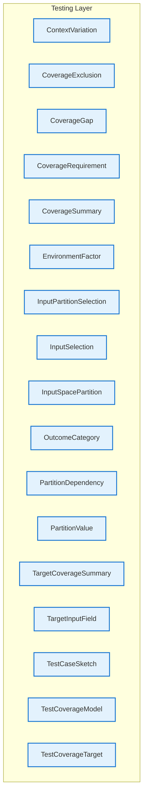

# Testing Layer - Intra-Layer Relationships

## Overview

**Purpose**: Define semantic links between entities WITHIN this layer, capturing
structural composition, behavioral dependencies, and influence relationships.

**Layer ID**: `12-testing`
**Analysis Date**: Generated automatically
**Validation**: Uses MarkdownLayerParser for closed-loop validation

---

### Relationship Diagram

## Layer Summary

### Entity Coverage (Target: 2+ relationships per entity)

- **Entities Meeting Target**: 0/17
- **Entity Coverage**: 0.0%

**Entities Below Target**:

- TestCoverageModel: 0 relationship(s) (needs 2 more)
- TestCoverageTarget: 0 relationship(s) (needs 2 more)
- TargetInputField: 0 relationship(s) (needs 2 more)
- InputSpacePartition: 0 relationship(s) (needs 2 more)
- PartitionValue: 0 relationship(s) (needs 2 more)
- PartitionDependency: 0 relationship(s) (needs 2 more)
- ContextVariation: 0 relationship(s) (needs 2 more)
- EnvironmentFactor: 0 relationship(s) (needs 2 more)
- OutcomeCategory: 0 relationship(s) (needs 2 more)
- CoverageRequirement: 0 relationship(s) (needs 2 more)
- InputPartitionSelection: 0 relationship(s) (needs 2 more)
- CoverageExclusion: 0 relationship(s) (needs 2 more)
- TestCaseSketch: 0 relationship(s) (needs 2 more)
- InputSelection: 0 relationship(s) (needs 2 more)
- CoverageSummary: 0 relationship(s) (needs 2 more)
- TargetCoverageSummary: 0 relationship(s) (needs 2 more)
- CoverageGap: 0 relationship(s) (needs 2 more)

### Coverage Matrix

| Entity                  | Outgoing | Incoming | Total | Meets Target | Status   |
| ----------------------- | -------- | -------- | ----- | ------------ | -------- |
| ContextVariation        | 0        | 0        | 0     | ✗            | Needs 2  |
| CoverageExclusion       | 0        | 0        | 0     | ✗            | Needs 2  |
| CoverageGap             | 0        | 0        | 0     | ✗            | Needs 2  |
| CoverageRequirement     | 0        | 0        | 0     | ✗            | Needs 2  |
| CoverageSummary         | 0        | 0        | 0     | ✗            | Needs 2  |
| EnvironmentFactor       | 0        | 0        | 0     | ✗            | Needs 2  |
| InputPartitionSelection | 0        | 0        | 0     | ✗            | Needs 2  |
| InputSelection          | 0        | 0        | 0     | ✗            | Needs 2  |
| InputSpacePartition     | 0        | 0        | 0     | ✗            | Needs 2  |
| OutcomeCategory         | 0        | 0        | 0     | ✗            | Needs 2  |
| PartitionDependency     | 0        | 0        | 0     | ✗            | Needs 2  |
| PartitionValue          | 0        | 0        | 0     | ✗            | Needs 2  |
| TargetCoverageSummary   | 0        | 0        | 0     | ✗            | Needs 2  |
| TargetInputField        | 0        | 0        | 0     | ✗            | Needs 2  |
| TestCaseSketch          | 0        | 0        | 0     | ✗            | Needs 2  |
| TestCoverageModel       | 0        | 0        | 0     | ✗            | Needs 2  |
| TestCoverageTarget      | 0        | 0        | 0     | ✗            | Needs 2  |
| **TOTAL**               | **-**    | **-**    | **0** | **0/17**     | **0.0%** |

### Relationship Statistics

- **Total Unique Relationships**: 0
- **Total Connections (Entity Perspective)**: 0
- **Average Connections per Entity**: 0.0
- **Entity Coverage Target**: 2+ relationships

## Entity: ContextVariation

**Definition**: Different context in which functionality can be invoked

### Outgoing Relationships (ContextVariation → Other Entities)

_No outgoing intra-layer relationships documented._

### Incoming Relationships (Other Entities → ContextVariation)

_No incoming intra-layer relationships documented._

### Relationship Summary

- **Total Relationships**: 0
- **Outgoing**: 0
- **Incoming**: 0
- **Documented**: 0/0
- **With XML Examples**: 0/0
- **In Catalog**: 0/0

---

## Entity: CoverageExclusion

**Definition**: Explicit exclusion from coverage with justification

### Outgoing Relationships (CoverageExclusion → Other Entities)

_No outgoing intra-layer relationships documented._

### Incoming Relationships (Other Entities → CoverageExclusion)

_No incoming intra-layer relationships documented._

### Relationship Summary

- **Total Relationships**: 0
- **Outgoing**: 0
- **Incoming**: 0
- **Documented**: 0/0
- **With XML Examples**: 0/0
- **In Catalog**: 0/0

---

## Entity: CoverageGap

**Definition**: Identified gap in test coverage requiring attention

### Outgoing Relationships (CoverageGap → Other Entities)

_No outgoing intra-layer relationships documented._

### Incoming Relationships (Other Entities → CoverageGap)

_No incoming intra-layer relationships documented._

### Relationship Summary

- **Total Relationships**: 0
- **Outgoing**: 0
- **Incoming**: 0
- **Documented**: 0/0
- **With XML Examples**: 0/0
- **In Catalog**: 0/0

---

## Entity: CoverageRequirement

**Definition**: Requirement for test coverage of a target

### Outgoing Relationships (CoverageRequirement → Other Entities)

_No outgoing intra-layer relationships documented._

### Incoming Relationships (Other Entities → CoverageRequirement)

_No incoming intra-layer relationships documented._

### Relationship Summary

- **Total Relationships**: 0
- **Outgoing**: 0
- **Incoming**: 0
- **Documented**: 0/0
- **With XML Examples**: 0/0
- **In Catalog**: 0/0

---

## Entity: CoverageSummary

**Definition**: Summary of coverage status (can be computed or declared)

### Outgoing Relationships (CoverageSummary → Other Entities)

_No outgoing intra-layer relationships documented._

### Incoming Relationships (Other Entities → CoverageSummary)

_No incoming intra-layer relationships documented._

### Relationship Summary

- **Total Relationships**: 0
- **Outgoing**: 0
- **Incoming**: 0
- **Documented**: 0/0
- **With XML Examples**: 0/0
- **In Catalog**: 0/0

---

## Entity: EnvironmentFactor

**Definition**: Environmental condition that may affect behavior

### Outgoing Relationships (EnvironmentFactor → Other Entities)

_No outgoing intra-layer relationships documented._

### Incoming Relationships (Other Entities → EnvironmentFactor)

_No incoming intra-layer relationships documented._

### Relationship Summary

- **Total Relationships**: 0
- **Outgoing**: 0
- **Incoming**: 0
- **Documented**: 0/0
- **With XML Examples**: 0/0
- **In Catalog**: 0/0

---

## Entity: InputPartitionSelection

**Definition**: Selection of partition values to include in coverage

### Outgoing Relationships (InputPartitionSelection → Other Entities)

_No outgoing intra-layer relationships documented._

### Incoming Relationships (Other Entities → InputPartitionSelection)

_No incoming intra-layer relationships documented._

### Relationship Summary

- **Total Relationships**: 0
- **Outgoing**: 0
- **Incoming**: 0
- **Documented**: 0/0
- **With XML Examples**: 0/0
- **In Catalog**: 0/0

---

## Entity: InputSelection

**Definition**: Specific partition value selected for a test case

### Outgoing Relationships (InputSelection → Other Entities)

_No outgoing intra-layer relationships documented._

### Incoming Relationships (Other Entities → InputSelection)

_No incoming intra-layer relationships documented._

### Relationship Summary

- **Total Relationships**: 0
- **Outgoing**: 0
- **Incoming**: 0
- **Documented**: 0/0
- **With XML Examples**: 0/0
- **In Catalog**: 0/0

---

## Entity: InputSpacePartition

**Definition**: Partitioning of an input dimension into testable categories

### Outgoing Relationships (InputSpacePartition → Other Entities)

_No outgoing intra-layer relationships documented._

### Incoming Relationships (Other Entities → InputSpacePartition)

_No incoming intra-layer relationships documented._

### Relationship Summary

- **Total Relationships**: 0
- **Outgoing**: 0
- **Incoming**: 0
- **Documented**: 0/0
- **With XML Examples**: 0/0
- **In Catalog**: 0/0

---

## Entity: OutcomeCategory

**Definition**: Category of expected outcomes (not specific assertions)

### Outgoing Relationships (OutcomeCategory → Other Entities)

_No outgoing intra-layer relationships documented._

### Incoming Relationships (Other Entities → OutcomeCategory)

_No incoming intra-layer relationships documented._

### Relationship Summary

- **Total Relationships**: 0
- **Outgoing**: 0
- **Incoming**: 0
- **Documented**: 0/0
- **With XML Examples**: 0/0
- **In Catalog**: 0/0

---

## Entity: PartitionDependency

**Definition**: Constraint between partition values across fields

### Outgoing Relationships (PartitionDependency → Other Entities)

_No outgoing intra-layer relationships documented._

### Incoming Relationships (Other Entities → PartitionDependency)

_No incoming intra-layer relationships documented._

### Relationship Summary

- **Total Relationships**: 0
- **Outgoing**: 0
- **Incoming**: 0
- **Documented**: 0/0
- **With XML Examples**: 0/0
- **In Catalog**: 0/0

---

## Entity: PartitionValue

**Definition**: A specific partition within the input space

### Outgoing Relationships (PartitionValue → Other Entities)

_No outgoing intra-layer relationships documented._

### Incoming Relationships (Other Entities → PartitionValue)

_No incoming intra-layer relationships documented._

### Relationship Summary

- **Total Relationships**: 0
- **Outgoing**: 0
- **Incoming**: 0
- **Documented**: 0/0
- **With XML Examples**: 0/0
- **In Catalog**: 0/0

---

## Entity: TargetCoverageSummary

**Definition**: Coverage metrics summary for a single test coverage target

### Outgoing Relationships (TargetCoverageSummary → Other Entities)

_No outgoing intra-layer relationships documented._

### Incoming Relationships (Other Entities → TargetCoverageSummary)

_No incoming intra-layer relationships documented._

### Relationship Summary

- **Total Relationships**: 0
- **Outgoing**: 0
- **Incoming**: 0
- **Documented**: 0/0
- **With XML Examples**: 0/0
- **In Catalog**: 0/0

---

## Entity: TargetInputField

**Definition**: Input field associated with a coverage target

### Outgoing Relationships (TargetInputField → Other Entities)

_No outgoing intra-layer relationships documented._

### Incoming Relationships (Other Entities → TargetInputField)

_No incoming intra-layer relationships documented._

### Relationship Summary

- **Total Relationships**: 0
- **Outgoing**: 0
- **Incoming**: 0
- **Documented**: 0/0
- **With XML Examples**: 0/0
- **In Catalog**: 0/0

---

## Entity: TestCaseSketch

**Definition**: Abstract test case selecting specific partition values

### Outgoing Relationships (TestCaseSketch → Other Entities)

_No outgoing intra-layer relationships documented._

### Incoming Relationships (Other Entities → TestCaseSketch)

_No incoming intra-layer relationships documented._

### Relationship Summary

- **Total Relationships**: 0
- **Outgoing**: 0
- **Incoming**: 0
- **Documented**: 0/0
- **With XML Examples**: 0/0
- **In Catalog**: 0/0

---

## Entity: TestCoverageModel

**Definition**: Complete test coverage model for application

### Outgoing Relationships (TestCoverageModel → Other Entities)

_No outgoing intra-layer relationships documented._

### Incoming Relationships (Other Entities → TestCoverageModel)

_No incoming intra-layer relationships documented._

### Relationship Summary

- **Total Relationships**: 0
- **Outgoing**: 0
- **Incoming**: 0
- **Documented**: 0/0
- **With XML Examples**: 0/0
- **In Catalog**: 0/0

---

## Entity: TestCoverageTarget

**Definition**: An artifact or functionality that requires test coverage

### Outgoing Relationships (TestCoverageTarget → Other Entities)

_No outgoing intra-layer relationships documented._

### Incoming Relationships (Other Entities → TestCoverageTarget)

_No incoming intra-layer relationships documented._

### Relationship Summary

- **Total Relationships**: 0
- **Outgoing**: 0
- **Incoming**: 0
- **Documented**: 0/0
- **With XML Examples**: 0/0
- **In Catalog**: 0/0

---
