# Goal Traceability Matrix

Shows which implementation elements support strategic goals.

## Matrix Structure

```
Goal → Supported By:
  - Business Services (Layer 02)
  - Application Services (Layer 04)
  - API Operations (Layer 06)
```

## Link Types Used

| Layer          | Link Type      | Field Path                                  |
| -------------- | -------------- | ------------------------------------------- |
| 02-business    | Supports Goals | motivation.supports-goals, x-supports-goals |
| 04-application | Supports Goals | motivation.supports-goals, x-supports-goals |
| 05-technology  | Supports Goals | motivation.supports-goals, x-supports-goals |
| 06-api         | Supports Goals | motivation.supports-goals, x-supports-goals |

## Traceability Chain

```mermaid
graph TD
  Goal["🎯 Goal"]
  BizSvc["💼 Business Service"]
  AppSvc["⚙️ Application Service"]
  API["🔌 API Operation"]

  BizSvc -->|supports| Goal
  AppSvc -->|supports| Goal
  API -->|supports| Goal

  style Goal fill:#FFD700
  style BizSvc fill:#FF6B6B
  style AppSvc fill:#4ECDC4
  style API fill:#45B7D1
```



## Usage

In layer markdown files, link to goals using:

```yaml
properties:
  motivation.supports-goals:
    type: array
    items:
      type: string
    description: Goal IDs this element supports
    example: ["goal-1", "goal-2"]
```

Or in OpenAPI:

```yaml
paths:
  /api/resource:
    post:
      x-supports-goals: ["goal-1", "goal-2"]
```
