# Requirement Coverage Matrix

Shows which implementation elements fulfill requirements.

## Matrix Structure

```
Requirement → Fulfilled By:
  - Business Services (Layer 02)
  - Application Services (Layer 04)
  - API Operations (Layer 06)
  - Security Controls (Layer 03)
  - APM Metrics (Layer 11)
```

## Link Types Used

| Layer | Link Type | Field Path |
|-------|-----------|------------|
| 04-application | Fulfills Requirements | motivation.fulfills-requirements, x-fulfills-requirements |
| 05-technology | Fulfills Requirements | motivation.fulfills-requirements, x-fulfills-requirements |
| 06-api | Fulfills Requirements | motivation.fulfills-requirements, x-fulfills-requirements |

## Traceability Chain

```mermaid
graph TD
  Req["📋 Requirement"]
  BizSvc["💼 Business Service"]
  AppSvc["⚙️ Application Service"]
  API["🔌 API Operation"]
  SecCtrl["🔒 Security Control"]

  BizSvc -->|fulfills| Req
  AppSvc -->|fulfills| Req
  API -->|fulfills| Req
  SecCtrl -->|fulfills| Req

  style Req fill:#FFE5B4
  style BizSvc fill:#FF6B6B
  style AppSvc fill:#4ECDC4
  style API fill:#45B7D1
  style SecCtrl fill:#FF4757
```

