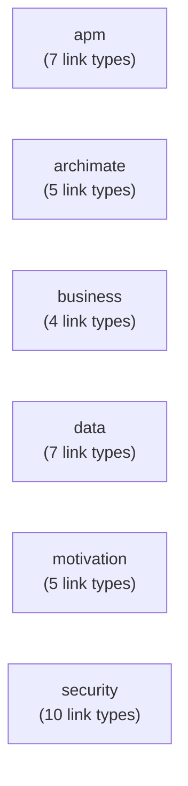

```mermaid
graph LR
  %% Link Category Diagram

  CAT0["apm<br/>(7 link types)"]
  CAT1["archimate<br/>(5 link types)"]
  CAT2["business<br/>(4 link types)"]
  CAT3["data<br/>(7 link types)"]
  CAT4["motivation<br/>(5 link types)"]
  CAT5["security<br/>(10 link types)"]
```