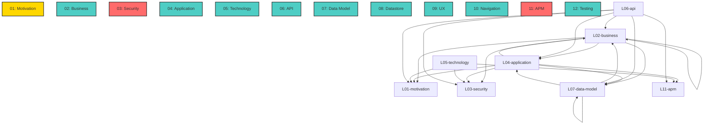

```mermaid
graph TD
  %% Layer Dependency Diagram

  L01["01: Motivation"]
  L02["02: Business"]
  L03["03: Security"]
  L04["04: Application"]
  L05["05: Technology"]
  L06["06: API"]
  L07["07: Data Model"]
  L08["08: Datastore"]
  L09["09: UX"]
  L10["10: Navigation"]
  L11["11: APM"]
  L12["12: Testing"]

  L02-business --> L01-motivation
  L02-business --> L02-business
  L02-business --> L03-security
  L02-business --> L04-application
  L02-business --> L07-data-model
  L04-application --> L01-motivation
  L04-application --> L02-business
  L04-application --> L03-security
  L04-application --> L07-data-model
  L04-application --> L11-apm
  L05-technology --> L01-motivation
  L05-technology --> L03-security
  L05-technology --> L11-apm
  L06-api --> L01-motivation
  L06-api --> L02-business
  L06-api --> L03-security
  L06-api --> L04-application
  L06-api --> L07-data-model
  L06-api --> L11-apm
  L07-data-model --> L02-business
  L07-data-model --> L04-application
  L07-data-model --> L07-data-model

  %% Styling
  classDef strategic fill:#FFD700,stroke:#333,stroke-width:2px
  classDef implementation fill:#4ECDC4,stroke:#333,stroke-width:2px
  classDef crosscutting fill:#FF6B6B,stroke:#333,stroke-width:2px

  class L01 strategic
  class L02,L04,L05,L06,L07,L08,L09,L10,L12 implementation
  class L03,L11 crosscutting
```