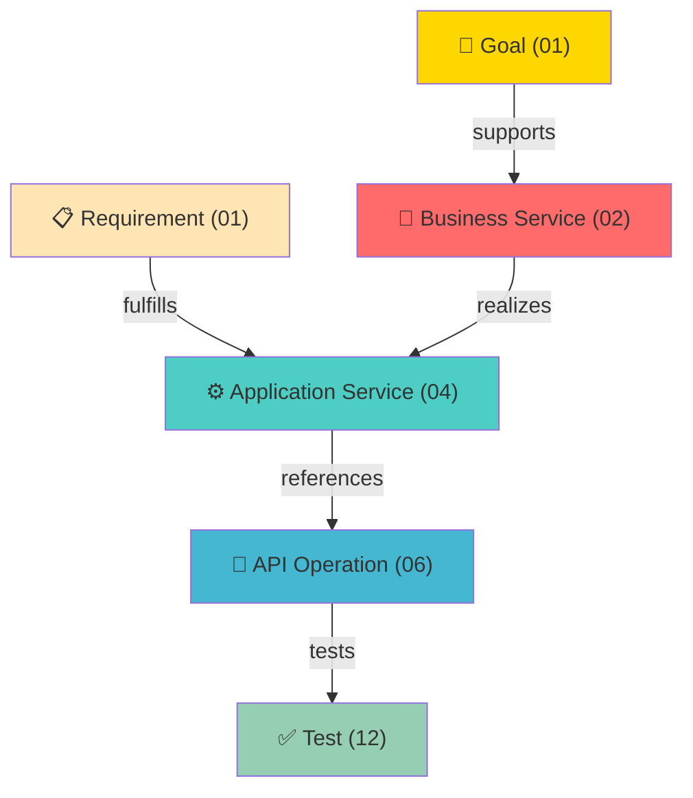

```mermaid
graph TD
  %% Traceability Chain Diagram

  Goal["🎯 Goal (01)"]
  Req["📋 Requirement (01)"]
  BizSvc["💼 Business Service (02)"]
  AppSvc["⚙️ Application Service (04)"]
  API["🔌 API Operation (06)"]
  Test["✅ Test (12)"]

  Goal -->|supports| BizSvc
  Req -->|fulfills| AppSvc
  BizSvc -->|realizes| AppSvc
  AppSvc -->|references| API
  API -->|tests| Test

  style Goal fill:#FFD700
  style Req fill:#FFE5B4
  style BizSvc fill:#FF6B6B
  style AppSvc fill:#4ECDC4
  style API fill:#45B7D1
  style Test fill:#96CEB4
```