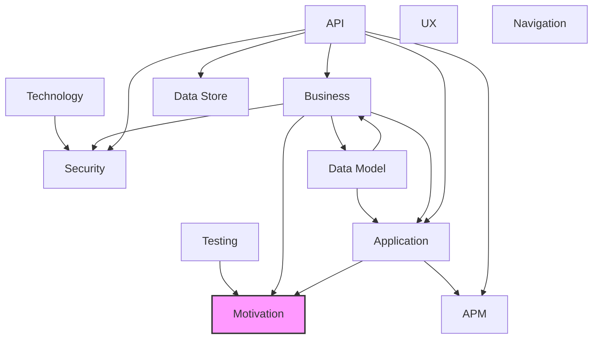

# Motivation Layer

## Report Index

- [Layer Introduction](#layer-introduction)
- [Intra-Layer Relationships](#intra-layer-relationships)
- [Inter-Layer Dependencies](#inter-layer-dependencies)
- [Inter-Layer Relationships Table](#inter-layer-relationships-table)
- [Node Reference](#node-reference)
  - [Assessment](#assessment)
  - [Assessmenttype](#assessmenttype)
  - [Constraint](#constraint)
  - [Constrainttype](#constrainttype)
  - [Driver](#driver)
  - [Drivercategory](#drivercategory)
  - [Goal](#goal)
  - [Meaning](#meaning)
  - [Outcome](#outcome)
  - [Outcomestatus](#outcomestatus)
  - [Principle](#principle)
  - [Principlecategory](#principlecategory)
  - [Priority](#priority)
  - [Requirement](#requirement)
  - [Requirementtype](#requirementtype)
  - [Stakeholder](#stakeholder)
  - [Stakeholdertype](#stakeholdertype)
  - [Value](#value)
  - [Valuetype](#valuetype)

## Layer Introduction

**Layer 1**: Motivation
**Standard**: [ArchiMate 3.2](https://pubs.opengroup.org/architecture/archimate32-doc/)

Layer 1: Motivation Layer

### Statistics

| Metric                    | Count |
| ------------------------- | ----- |
| Node Types                | 19    |
| Intra-Layer Relationships | 58    |
| Inter-Layer Relationships | 10    |
| Inbound Relationships     | 10    |
| Outbound Relationships    | 0     |

### Layer Dependencies

**Depends On**: [Business](./02-business-layer-report.md), [Application](./04-application-layer-report.md), [Testing](./12-testing-layer-report.md)

**Depended On By**: None

## Intra-Layer Relationships

```mermaid
flowchart LR
  subgraph motivation
    assessment["assessment"]
    assessmenttype["assessmenttype"]
    constraint["constraint"]
    constrainttype["constrainttype"]
    driver["driver"]
    drivercategory["drivercategory"]
    goal["goal"]
    meaning["meaning"]
    outcome["outcome"]
    outcomestatus["outcomestatus"]
    principle["principle"]
    principlecategory["principlecategory"]
    priority["priority"]
    requirement["requirement"]
    requirementtype["requirementtype"]
    stakeholder["stakeholder"]
    stakeholdertype["stakeholdertype"]
    value["value"]
    valuetype["valuetype"]
    value -->|associated-with| value
    value -->|associated-with| stakeholder
    value -->|associated-with| outcome
    value -->|associated-with| goal
    value -->|associated-with| driver
    value -->|associated-with| constraint
    stakeholder -->|associated-with| value
    stakeholder -->|associated-with| stakeholder
    stakeholder -->|associated-with| outcome
    stakeholder -->|associated-with| goal
    stakeholder -->|associated-with| driver
    stakeholder -->|associated-with| constraint
    requirement -->|associated-with| value
    requirement -->|associated-with| stakeholder
    requirement -->|associated-with| outcome
    requirement -->|associated-with| goal
    requirement -->|associated-with| driver
    requirement -->|associated-with| constraint
    requirement -->|aggregates| requirement
    requirement -->|aggregates| goal
    principle -->|influence| requirement
    principle -->|influence| principle
    principle -->|influence| goal
    principle -->|influence| assessment
    outcome -->|realizes| value
    outcome -->|realizes| goal
    outcome -->|associated-with| value
    outcome -->|associated-with| stakeholder
    outcome -->|associated-with| outcome
    outcome -->|associated-with| goal
    outcome -->|associated-with| driver
    outcome -->|associated-with| constraint
    meaning -->|associated-with| value
    meaning -->|associated-with| stakeholder
    meaning -->|associated-with| outcome
    meaning -->|associated-with| goal
    meaning -->|associated-with| driver
    meaning -->|associated-with| constraint
    goal -->|realizes| value
    goal -->|realizes| goal
    goal -->|influence| requirement
    goal -->|influence| principle
    goal -->|influence| goal
    goal -->|influence| assessment
    goal -->|aggregates| requirement
    goal -->|aggregates| goal
    driver -->|influence| requirement
    driver -->|influence| principle
    driver -->|influence| goal
    driver -->|influence| assessment
    constraint -->|influence| requirement
    constraint -->|influence| principle
    constraint -->|influence| goal
    constraint -->|influence| assessment
    assessment -->|influence| requirement
    assessment -->|influence| principle
    assessment -->|influence| goal
    assessment -->|influence| assessment
  end
```

## Inter-Layer Dependencies

## Inter-Layer Relationships Table

| Relationship ID                                                          | Source Node                                                               | Dest Node                                                  | Dest Layer                                    | Predicate              | Cardinality  | Strength |
| ------------------------------------------------------------------------ | ------------------------------------------------------------------------- | ---------------------------------------------------------- | --------------------------------------------- | ---------------------- | ------------ | -------- |
| testing.testcoveragemodel.constrained-by.motivation.constraint           | [testcoveragemodel](./12-testing-layer-report.md#testcoveragemodel)       | [constraint](./01-motivation-layer-report.md#constraint)   | [Motivation](./01-motivation-layer-report.md) | constrained-by         | many-to-many | medium   |
| testing.coveragerequirement.constrained-by.motivation.constraint         | [coveragerequirement](./12-testing-layer-report.md#coveragerequirement)   | [constraint](./01-motivation-layer-report.md#constraint)   | [Motivation](./01-motivation-layer-report.md) | constrained-by         | many-to-many | medium   |
| business.businessservice.delivers-value.motivation.value                 | [businessservice](./02-business-layer-report.md#businessservice)          | [value](./01-motivation-layer-report.md#value)             | [Motivation](./01-motivation-layer-report.md) | delivers-value         | many-to-many | medium   |
| application.applicationservice.delivers-value.motivation.value           | [applicationservice](./04-application-layer-report.md#applicationservice) | [value](./01-motivation-layer-report.md#value)             | [Motivation](./01-motivation-layer-report.md) | delivers-value         | many-to-many | medium   |
| testing.testcoveragemodel.fulfills-requirements.motivation.requirement   | [testcoveragemodel](./12-testing-layer-report.md#testcoveragemodel)       | [requirement](./01-motivation-layer-report.md#requirement) | [Motivation](./01-motivation-layer-report.md) | fulfills-requirements  | many-to-many | high     |
| testing.testcasesketch.fulfills-requirements.motivation.requirement      | [testcasesketch](./12-testing-layer-report.md#testcasesketch)             | [requirement](./01-motivation-layer-report.md#requirement) | [Motivation](./01-motivation-layer-report.md) | fulfills-requirements  | many-to-many | high     |
| testing.coveragerequirement.fulfills-requirements.motivation.requirement | [coveragerequirement](./12-testing-layer-report.md#coveragerequirement)   | [requirement](./01-motivation-layer-report.md#requirement) | [Motivation](./01-motivation-layer-report.md) | fulfills-requirements  | many-to-many | high     |
| testing.testcoveragemodel.governed-by-principles.motivation.principle    | [testcoveragemodel](./12-testing-layer-report.md#testcoveragemodel)       | [principle](./01-motivation-layer-report.md#principle)     | [Motivation](./01-motivation-layer-report.md) | governed-by-principles | many-to-many | high     |
| testing.testcoveragemodel.supports-goals.motivation.goal                 | [testcoveragemodel](./12-testing-layer-report.md#testcoveragemodel)       | [goal](./01-motivation-layer-report.md#goal)               | [Motivation](./01-motivation-layer-report.md) | supports-goals         | many-to-many | high     |
| testing.testcasesketch.supports-goals.motivation.goal                    | [testcasesketch](./12-testing-layer-report.md#testcasesketch)             | [goal](./01-motivation-layer-report.md#goal)               | [Motivation](./01-motivation-layer-report.md) | supports-goals         | many-to-many | high     |

## Node Reference

### Assessment {#assessment}

**Spec Node ID**: `motivation.assessment`

Outcome of analysis of the state of affairs

#### Relationship Metrics

- **Intra-Layer**: Inbound: 5 | Outbound: 4
- **Inter-Layer**: Inbound: 0 | Outbound: 0

#### Intra-Layer Relationships

| Related Node                | Predicate | Direction | Cardinality  |
| --------------------------- | --------- | --------- | ------------ |
| [principle](#principle)     | influence | inbound   | many-to-many |
| [goal](#goal)               | influence | inbound   | many-to-many |
| [driver](#driver)           | influence | inbound   | many-to-many |
| [constraint](#constraint)   | influence | inbound   | many-to-many |
| [requirement](#requirement) | influence | outbound  | many-to-many |
| [principle](#principle)     | influence | outbound  | many-to-many |
| [goal](#goal)               | influence | outbound  | many-to-many |
| [assessment](#assessment)   | influence | outbound  | many-to-many |

[Back to Index](#report-index)

### Assessmenttype {#assessmenttype}

**Spec Node ID**: `motivation.assessmenttype`

AssessmentType element in Motivation Layer

#### Relationship Metrics

- **Intra-Layer**: Inbound: 0 | Outbound: 0
- **Inter-Layer**: Inbound: 0 | Outbound: 0

[Back to Index](#report-index)

### Constraint {#constraint}

**Spec Node ID**: `motivation.constraint`

Restriction on the way in which a system is realized

#### Relationship Metrics

- **Intra-Layer**: Inbound: 5 | Outbound: 4
- **Inter-Layer**: Inbound: 2 | Outbound: 0

#### Intra-Layer Relationships

| Related Node                | Predicate       | Direction | Cardinality  |
| --------------------------- | --------------- | --------- | ------------ |
| [value](#value)             | associated-with | inbound   | many-to-many |
| [stakeholder](#stakeholder) | associated-with | inbound   | many-to-many |
| [requirement](#requirement) | associated-with | inbound   | many-to-many |
| [outcome](#outcome)         | associated-with | inbound   | many-to-many |
| [meaning](#meaning)         | associated-with | inbound   | many-to-many |
| [requirement](#requirement) | influence       | outbound  | many-to-many |
| [principle](#principle)     | influence       | outbound  | many-to-many |
| [goal](#goal)               | influence       | outbound  | many-to-many |
| [assessment](#assessment)   | influence       | outbound  | many-to-many |

#### Inter-Layer Relationships

| Related Node                                                            | Layer                                   | Predicate      | Direction | Cardinality  |
| ----------------------------------------------------------------------- | --------------------------------------- | -------------- | --------- | ------------ |
| [testcoveragemodel](./12-testing-layer-report.md#testcoveragemodel)     | [Testing](./12-testing-layer-report.md) | constrained-by | inbound   | many-to-many |
| [coveragerequirement](./12-testing-layer-report.md#coveragerequirement) | [Testing](./12-testing-layer-report.md) | constrained-by | inbound   | many-to-many |

[Back to Index](#report-index)

### Constrainttype {#constrainttype}

**Spec Node ID**: `motivation.constrainttype`

ConstraintType element in Motivation Layer

#### Relationship Metrics

- **Intra-Layer**: Inbound: 0 | Outbound: 0
- **Inter-Layer**: Inbound: 0 | Outbound: 0

[Back to Index](#report-index)

### Driver {#driver}

**Spec Node ID**: `motivation.driver`

External or internal condition that motivates an organization

#### Relationship Metrics

- **Intra-Layer**: Inbound: 5 | Outbound: 4
- **Inter-Layer**: Inbound: 0 | Outbound: 0

#### Intra-Layer Relationships

| Related Node                | Predicate       | Direction | Cardinality  |
| --------------------------- | --------------- | --------- | ------------ |
| [value](#value)             | associated-with | inbound   | many-to-many |
| [stakeholder](#stakeholder) | associated-with | inbound   | many-to-many |
| [requirement](#requirement) | associated-with | inbound   | many-to-many |
| [outcome](#outcome)         | associated-with | inbound   | many-to-many |
| [meaning](#meaning)         | associated-with | inbound   | many-to-many |
| [requirement](#requirement) | influence       | outbound  | many-to-many |
| [principle](#principle)     | influence       | outbound  | many-to-many |
| [goal](#goal)               | influence       | outbound  | many-to-many |
| [assessment](#assessment)   | influence       | outbound  | many-to-many |

[Back to Index](#report-index)

### Drivercategory {#drivercategory}

**Spec Node ID**: `motivation.drivercategory`

DriverCategory element in Motivation Layer

#### Relationship Metrics

- **Intra-Layer**: Inbound: 0 | Outbound: 0
- **Inter-Layer**: Inbound: 0 | Outbound: 0

[Back to Index](#report-index)

### Goal {#goal}

**Spec Node ID**: `motivation.goal`

High-level statement of intent, direction, or desired end state

#### Relationship Metrics

- **Intra-Layer**: Inbound: 14 | Outbound: 8
- **Inter-Layer**: Inbound: 2 | Outbound: 0

#### Intra-Layer Relationships

| Related Node                | Predicate       | Direction | Cardinality  |
| --------------------------- | --------------- | --------- | ------------ |
| [value](#value)             | associated-with | inbound   | many-to-many |
| [stakeholder](#stakeholder) | associated-with | inbound   | many-to-many |
| [requirement](#requirement) | associated-with | inbound   | many-to-many |
| [requirement](#requirement) | aggregates      | inbound   | many-to-many |
| [principle](#principle)     | influence       | inbound   | many-to-many |
| [outcome](#outcome)         | realizes        | inbound   | many-to-many |
| [outcome](#outcome)         | associated-with | inbound   | many-to-many |
| [meaning](#meaning)         | associated-with | inbound   | many-to-many |
| [value](#value)             | realizes        | outbound  | many-to-many |
| [goal](#goal)               | realizes        | outbound  | many-to-many |
| [requirement](#requirement) | influence       | outbound  | many-to-many |
| [principle](#principle)     | influence       | outbound  | many-to-many |
| [goal](#goal)               | influence       | outbound  | many-to-many |
| [assessment](#assessment)   | influence       | outbound  | many-to-many |
| [requirement](#requirement) | aggregates      | outbound  | many-to-many |
| [goal](#goal)               | aggregates      | outbound  | many-to-many |
| [driver](#driver)           | influence       | inbound   | many-to-many |
| [constraint](#constraint)   | influence       | inbound   | many-to-many |
| [assessment](#assessment)   | influence       | inbound   | many-to-many |

#### Inter-Layer Relationships

| Related Node                                                        | Layer                                   | Predicate      | Direction | Cardinality  |
| ------------------------------------------------------------------- | --------------------------------------- | -------------- | --------- | ------------ |
| [testcoveragemodel](./12-testing-layer-report.md#testcoveragemodel) | [Testing](./12-testing-layer-report.md) | supports-goals | inbound   | many-to-many |
| [testcasesketch](./12-testing-layer-report.md#testcasesketch)       | [Testing](./12-testing-layer-report.md) | supports-goals | inbound   | many-to-many |

[Back to Index](#report-index)

### Meaning {#meaning}

**Spec Node ID**: `motivation.meaning`

Knowledge or expertise present in a representation

#### Relationship Metrics

- **Intra-Layer**: Inbound: 0 | Outbound: 6
- **Inter-Layer**: Inbound: 0 | Outbound: 0

#### Intra-Layer Relationships

| Related Node                | Predicate       | Direction | Cardinality  |
| --------------------------- | --------------- | --------- | ------------ |
| [value](#value)             | associated-with | outbound  | many-to-many |
| [stakeholder](#stakeholder) | associated-with | outbound  | many-to-many |
| [outcome](#outcome)         | associated-with | outbound  | many-to-many |
| [goal](#goal)               | associated-with | outbound  | many-to-many |
| [driver](#driver)           | associated-with | outbound  | many-to-many |
| [constraint](#constraint)   | associated-with | outbound  | many-to-many |

[Back to Index](#report-index)

### Outcome {#outcome}

**Spec Node ID**: `motivation.outcome`

End result that has been achieved

#### Relationship Metrics

- **Intra-Layer**: Inbound: 5 | Outbound: 8
- **Inter-Layer**: Inbound: 0 | Outbound: 0

#### Intra-Layer Relationships

| Related Node                | Predicate       | Direction | Cardinality  |
| --------------------------- | --------------- | --------- | ------------ |
| [value](#value)             | associated-with | inbound   | many-to-many |
| [stakeholder](#stakeholder) | associated-with | inbound   | many-to-many |
| [requirement](#requirement) | associated-with | inbound   | many-to-many |
| [value](#value)             | realizes        | outbound  | many-to-many |
| [goal](#goal)               | realizes        | outbound  | many-to-many |
| [value](#value)             | associated-with | outbound  | many-to-many |
| [stakeholder](#stakeholder) | associated-with | outbound  | many-to-many |
| [outcome](#outcome)         | associated-with | outbound  | many-to-many |
| [goal](#goal)               | associated-with | outbound  | many-to-many |
| [driver](#driver)           | associated-with | outbound  | many-to-many |
| [constraint](#constraint)   | associated-with | outbound  | many-to-many |
| [meaning](#meaning)         | associated-with | inbound   | many-to-many |

[Back to Index](#report-index)

### Outcomestatus {#outcomestatus}

**Spec Node ID**: `motivation.outcomestatus`

OutcomeStatus element in Motivation Layer

#### Relationship Metrics

- **Intra-Layer**: Inbound: 0 | Outbound: 0
- **Inter-Layer**: Inbound: 0 | Outbound: 0

[Back to Index](#report-index)

### Principle {#principle}

**Spec Node ID**: `motivation.principle`

Normative property of all systems in a given context

#### Relationship Metrics

- **Intra-Layer**: Inbound: 5 | Outbound: 4
- **Inter-Layer**: Inbound: 1 | Outbound: 0

#### Intra-Layer Relationships

| Related Node                | Predicate | Direction | Cardinality  |
| --------------------------- | --------- | --------- | ------------ |
| [requirement](#requirement) | influence | outbound  | many-to-many |
| [principle](#principle)     | influence | outbound  | many-to-many |
| [goal](#goal)               | influence | outbound  | many-to-many |
| [assessment](#assessment)   | influence | outbound  | many-to-many |
| [goal](#goal)               | influence | inbound   | many-to-many |
| [driver](#driver)           | influence | inbound   | many-to-many |
| [constraint](#constraint)   | influence | inbound   | many-to-many |
| [assessment](#assessment)   | influence | inbound   | many-to-many |

#### Inter-Layer Relationships

| Related Node                                                        | Layer                                   | Predicate              | Direction | Cardinality  |
| ------------------------------------------------------------------- | --------------------------------------- | ---------------------- | --------- | ------------ |
| [testcoveragemodel](./12-testing-layer-report.md#testcoveragemodel) | [Testing](./12-testing-layer-report.md) | governed-by-principles | inbound   | many-to-many |

[Back to Index](#report-index)

### Principlecategory {#principlecategory}

**Spec Node ID**: `motivation.principlecategory`

PrincipleCategory element in Motivation Layer

#### Relationship Metrics

- **Intra-Layer**: Inbound: 0 | Outbound: 0
- **Inter-Layer**: Inbound: 0 | Outbound: 0

[Back to Index](#report-index)

### Priority {#priority}

**Spec Node ID**: `motivation.priority`

Priority element in Motivation Layer

#### Relationship Metrics

- **Intra-Layer**: Inbound: 0 | Outbound: 0
- **Inter-Layer**: Inbound: 0 | Outbound: 0

[Back to Index](#report-index)

### Requirement {#requirement}

**Spec Node ID**: `motivation.requirement`

Statement of need that must be realized

#### Relationship Metrics

- **Intra-Layer**: Inbound: 7 | Outbound: 8
- **Inter-Layer**: Inbound: 3 | Outbound: 0

#### Intra-Layer Relationships

| Related Node                | Predicate       | Direction | Cardinality  |
| --------------------------- | --------------- | --------- | ------------ |
| [value](#value)             | associated-with | outbound  | many-to-many |
| [stakeholder](#stakeholder) | associated-with | outbound  | many-to-many |
| [outcome](#outcome)         | associated-with | outbound  | many-to-many |
| [goal](#goal)               | associated-with | outbound  | many-to-many |
| [driver](#driver)           | associated-with | outbound  | many-to-many |
| [constraint](#constraint)   | associated-with | outbound  | many-to-many |
| [requirement](#requirement) | aggregates      | outbound  | many-to-many |
| [goal](#goal)               | aggregates      | outbound  | many-to-many |
| [principle](#principle)     | influence       | inbound   | many-to-many |
| [goal](#goal)               | influence       | inbound   | many-to-many |
| [goal](#goal)               | aggregates      | inbound   | many-to-many |
| [driver](#driver)           | influence       | inbound   | many-to-many |
| [constraint](#constraint)   | influence       | inbound   | many-to-many |
| [assessment](#assessment)   | influence       | inbound   | many-to-many |

#### Inter-Layer Relationships

| Related Node                                                            | Layer                                   | Predicate             | Direction | Cardinality  |
| ----------------------------------------------------------------------- | --------------------------------------- | --------------------- | --------- | ------------ |
| [testcoveragemodel](./12-testing-layer-report.md#testcoveragemodel)     | [Testing](./12-testing-layer-report.md) | fulfills-requirements | inbound   | many-to-many |
| [testcasesketch](./12-testing-layer-report.md#testcasesketch)           | [Testing](./12-testing-layer-report.md) | fulfills-requirements | inbound   | many-to-many |
| [coveragerequirement](./12-testing-layer-report.md#coveragerequirement) | [Testing](./12-testing-layer-report.md) | fulfills-requirements | inbound   | many-to-many |

[Back to Index](#report-index)

### Requirementtype {#requirementtype}

**Spec Node ID**: `motivation.requirementtype`

RequirementType element in Motivation Layer

#### Relationship Metrics

- **Intra-Layer**: Inbound: 0 | Outbound: 0
- **Inter-Layer**: Inbound: 0 | Outbound: 0

[Back to Index](#report-index)

### Stakeholder {#stakeholder}

**Spec Node ID**: `motivation.stakeholder`

Individual, team, or organization with interest in the outcome

#### Relationship Metrics

- **Intra-Layer**: Inbound: 5 | Outbound: 6
- **Inter-Layer**: Inbound: 0 | Outbound: 0

#### Intra-Layer Relationships

| Related Node                | Predicate       | Direction | Cardinality  |
| --------------------------- | --------------- | --------- | ------------ |
| [value](#value)             | associated-with | inbound   | many-to-many |
| [value](#value)             | associated-with | outbound  | many-to-many |
| [stakeholder](#stakeholder) | associated-with | outbound  | many-to-many |
| [outcome](#outcome)         | associated-with | outbound  | many-to-many |
| [goal](#goal)               | associated-with | outbound  | many-to-many |
| [driver](#driver)           | associated-with | outbound  | many-to-many |
| [constraint](#constraint)   | associated-with | outbound  | many-to-many |
| [requirement](#requirement) | associated-with | inbound   | many-to-many |
| [outcome](#outcome)         | associated-with | inbound   | many-to-many |
| [meaning](#meaning)         | associated-with | inbound   | many-to-many |

[Back to Index](#report-index)

### Stakeholdertype {#stakeholdertype}

**Spec Node ID**: `motivation.stakeholdertype`

StakeholderType element in Motivation Layer

#### Relationship Metrics

- **Intra-Layer**: Inbound: 0 | Outbound: 0
- **Inter-Layer**: Inbound: 0 | Outbound: 0

[Back to Index](#report-index)

### Value {#value}

**Spec Node ID**: `motivation.value`

Relative worth, utility, or importance of something

#### Relationship Metrics

- **Intra-Layer**: Inbound: 7 | Outbound: 6
- **Inter-Layer**: Inbound: 2 | Outbound: 0

#### Intra-Layer Relationships

| Related Node                | Predicate       | Direction | Cardinality  |
| --------------------------- | --------------- | --------- | ------------ |
| [value](#value)             | associated-with | outbound  | many-to-many |
| [stakeholder](#stakeholder) | associated-with | outbound  | many-to-many |
| [outcome](#outcome)         | associated-with | outbound  | many-to-many |
| [goal](#goal)               | associated-with | outbound  | many-to-many |
| [driver](#driver)           | associated-with | outbound  | many-to-many |
| [constraint](#constraint)   | associated-with | outbound  | many-to-many |
| [stakeholder](#stakeholder) | associated-with | inbound   | many-to-many |
| [requirement](#requirement) | associated-with | inbound   | many-to-many |
| [outcome](#outcome)         | realizes        | inbound   | many-to-many |
| [outcome](#outcome)         | associated-with | inbound   | many-to-many |
| [meaning](#meaning)         | associated-with | inbound   | many-to-many |
| [goal](#goal)               | realizes        | inbound   | many-to-many |

#### Inter-Layer Relationships

| Related Node                                                              | Layer                                           | Predicate      | Direction | Cardinality  |
| ------------------------------------------------------------------------- | ----------------------------------------------- | -------------- | --------- | ------------ |
| [businessservice](./02-business-layer-report.md#businessservice)          | [Business](./02-business-layer-report.md)       | delivers-value | inbound   | many-to-many |
| [applicationservice](./04-application-layer-report.md#applicationservice) | [Application](./04-application-layer-report.md) | delivers-value | inbound   | many-to-many |

[Back to Index](#report-index)

### Valuetype {#valuetype}

**Spec Node ID**: `motivation.valuetype`

ValueType element in Motivation Layer

#### Relationship Metrics

- **Intra-Layer**: Inbound: 0 | Outbound: 0
- **Inter-Layer**: Inbound: 0 | Outbound: 0

[Back to Index](#report-index)

---

_Generated: 2026-02-13T12:01:09.771Z | Spec Version: 0.8.0 | Commit: 680a318 | Generator: generate-layer-reports.ts_
